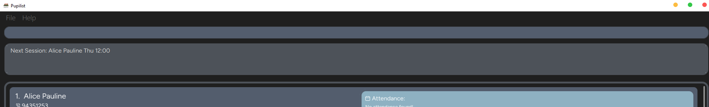

Pupilist is a **desktop app for managing students details for private tutors**. It is **optimised for Command Line Interface (CLI)**. If you are a private tutor struggling to keep track of your students grades, homework and attendance, Pupilist can get your scheduling done faster than traditional GUI apps.

* Table of Contents
{:toc}

--------------------------------------------------------------------------------------------------------------------

## Quick start

1. Ensure you have Java `11` or above installed in your Computer.

2. Download the latest `Pupilist.jar` from [here](https://github.com/AY2223S1-CS2103T-W09-4/tp/releases).

3. Copy the file to the folder you want to use as the _home folder_ for your address book.

4. Double-click the file to start the app. The GUI similar to the below should appear in a few seconds. Note how the app contains some sample data. 
   

5. Type the command in the command box and press Enter to execute it. e.g. typing **`help`** and pressing Enter will open the help window. 
   Some example commands you can try:

   * **`list`** : Lists all contacts.

   * **`add`**`n/John Doe p/98765432 lp/Algorithms` : Adds a contact named `John Doe` to the Address Book.

   * **`delete`**`3` : Deletes the 3rd contact shown in the current list.

   * **`clear`** : Deletes all contacts.

   * **`exit`** : Exits the app.

6. Refer to the [Features](#features) below for details of each command.

--------------------------------------------------------------------------------------------------------------------

## Features

**:information_source: Notes about the command format:** 

* Words in `UPPER_CASE` are the parameters to be supplied by the user. 
  e.g. in `add n/NAME`, `NAME` is a parameter which can be used as `add n/John Doe`.

* Items in square brackets are optional. 
  e.g `n/NAME [h/HOMEWORK]` can be used as `n/John Doe h/math` or as `n/John Doe`.

* Items with `…`​ after them can be used multiple times including zero times. 
  e.g. `[t/Tag]…​` can be used as ` ` (i.e. 0 times), `t/Math`, `t/Math t/Science` etc.

* Parameters with prefixes can be in any order. 
  e.g. if the command specifies `n/NAME p/PHONE_NUMBER`, `p/PHONE_NUMBER n/NAME` is also acceptable.

* Index has to be supplied according to format given. 
  e.g. if the command specifies `hw INDEX h/HOMEWORK`, `hw h/HOMEWORK INDEX` is not allowed.

* If a parameter is expected only once in the command but you specified it multiple times, only the last occurrence of the parameter will be taken. 
  e.g. if you specify `p/12341234 p/56785678`, only `p/56785678` will be taken.

* Extraneous parameters for commands that do not take in parameters (such as `help`, `list`, `exit` and `clear`) will be ignored. 
  e.g. if the command specifies `help 123`, it will be interpreted as `help`.

### Viewing help : `help`

Shows a message explaining how to access the help page, and a list of basic commands.

Format: `help`

### Adding a person: `add`

Adds a person to the address book. This command can only be used in list mode.
A person is considered a duplicate only if the names are the same (non case-sensitive).

Format: `add n/NAME p/PHONE_NUMBER lp/LESSON_PLAN`

Examples:
* `add n/Farisa p/87159999 lp/Sec 4 Chemistry`

### Listing all persons : `list`

Shows a list of all persons in the address book. Changes the address book to list mode.
Also allows you to see the next session for you to attend along with the person you 
are going to be teaching next.

Format: `list`

### Editing a person : `edit`

Edits an existing person in the address book. Can only be used in view mode.
For fields requiring an INDEX, existing fields have to contain a value before editing is allowed, else there will be no INDEX.

It requires at least one field:
- n/: To be followed by updated name of student
- p/: To be followed by updated phone number of student
- lp/: To be followed by updated lesson plan of student
- h/: To be followed by INDEX of homework to be updated, then updated homework
- a/: To be followed by INDEX of attendance to be updated, then updated attendance
- g/: To be followed by INDEX of grade to be updated, then updated grade
- s/: To be followed by INDEX of session to be updated, then updated session

Format: `edit [n/ p/ lp/]NEW_FIELD` 
`edit [h/ a/ g/ s/]INDEX NEW_FIELD`

Examples:
* `view Alex Yeoh` returns `Alex Yeoh`  
  `edit h/2 math not done` updates 2nd field of `Alex Yeoh`'s HOMEWORK to `math not done`

### Removing specific field in person: `remove`

Removes a specific field of a person in the address book at the specified index. Can only be used in View Mode. 
It requires one field:
- h/: To be followed by INDEX of homework to be removed
- a/: To be followed by INDEX of attendance to be removed
- g/: To be followed by INDEX of grade to be removed
- s/: To be followed by INDEX of session to be removed

Allows for edits of multiple fields in a single command. However, a single command should remove at most one item from each field.  

Format: `remove [h/ a/ g/ s/]INDEX`

Examples:
* `view Alex Yeoh` returns `Alex Yeoh`  
  `remove h/2` removes `Alex Yeoh`'s *homework at second index*
* `view John Doe` returns `John Doe`  
  `remove h/2 a/1` removes `John Doe`'s *homework at second index* and *attendance at first index*

### Marking specific field in person: `mark`

Marks a specific field of a person in the address book. Can only be used in View Mode. 
It requires one field:
- h/: To be followed by INDEX of homework to be marked
- a/: To be followed by INDEX of attendance to be marked

Format: `mark [h/ a/]INDEX`

Examples:
* `view Alex Yeoh` returns `Alex Yeoh`  
  `mark a/1` marks `Alex Yeoh`'s *attendance at first index*

### Unmarking specific field in person: `unmark`

Unmarks a specific field of a person in the address book. Can only be used in View Mode. 
It requires one field:
- h/: To be followed by INDEX of homework to be unmarked
- a/: To be followed by INDEX of attendance to be unmarked

Format: `unmark [h/ a/]INDEX`

Examples:
* `view Alex Yeoh` returns `Alex Yeoh`  
  `unmark h/4` unmarks `Alex Yeoh`'s *homework at fourth index*

### Locating persons by name: `find`

Finds persons whose names contain any of the given keywords.

Format: `find KEYWORD [MORE_KEYWORDS]`

* The search is case-insensitive. e.g `hans` will match `Hans`
* The order of the keywords does not matter. e.g. `Hans Bo` will match `Bo Hans`
* Only the name is searched.
* Only full words will be matched e.g. `Han` will not match `Hans`
* Persons matching at least one keyword will be returned (i.e. `OR` search).
  e.g. `Hans Bo` will return `Hans Gruber`, `Bo Yang`

Examples:
* `find John` returns `john` and `John Doe`
* `find alex david` returns `Alex Yeoh`, `David Li` 
  

### Viewing persons details: `view`

View details of a person. Required to `edit` or `remove` person's details.
You can only view one person's details at one time.

Format: `view NAME` 

* The command requires the full `NAME` of a person.
* The search is case-insensitive. e.g `hans` will match `Hans`
* Only full words will be matched e.g. `Han` will not match `Hans`

### Deleting a person : `delete`

Deletes the specified person from the address book. Cannot be used in schedule mode.

Format: `delete INDEX` 

* Deletes the person with the specified `INDEX`.

Examples:
* `delete 1` removes the first student in the address book.

### Clearing all entries : `clear`

Clears all entries from the address book.

Format: `clear`

### Adding Homework to student: `hw`

Adds a description of homework to student in address book. Cannot be used in schedule mode.
Does not check for duplicate homework entries.

Format: `hw INDEX h/HOMEWORK`

* Adds homework to student with the specified `INDEX`.

Examples:
* `hw 1 h/math assignment` adds math assignment to first student in address book.

### Adding Grade Progress to student: `grade`

Adds a description of grade progress to student in address book. Cannot be used in schedule mode.
GRADE_PROGRESS does not require a fixed format and is up to the user to manually standardise. Does not check for duplicate entries. 

Format: `grade INDEX g/GRADE_PROGRESS`

* Adds grade progress to student with the specified `INDEX`.

Examples:
* `grade 1 g/Math: D+` adds Math: D+ grade to first student in address book.

### Adding Attendance to student : `attendance`

Adds a formatted description of dates students attended class in address book. Cannot be used in schedule mode.
Does not check for duplicate entries.

Format: `attendance INDEX a/ATTENDANCE`

* Adds attendance to student with the specified `INDEX`. 
* Attendance must be in `YYYY-MM-DD` format

Examples:
* `attendance 1 a/2022-12-08` marks 2022-12-08 attendance for first student in address book.

### Adding Session to student: `session`

Adds a formatted session timing to student, expected to repeat weekly. Cannot be used in schedule mode.
Does not check for duplicate entries.

Format: `session INDEX s/TUITION_TIME`

* Adds tuition time to student with the specified `INDEX`. 
* Tuition time must be in `DDD HH:MM` format where `HH:MM` ranges from 00:00 to 23:59

Examples:
* `session 1 s/MON 12:00` adds a tuition slot of 12 afternoon, Monday to first student in address book.

### Update Lesson Plan for student: `lesson`

Updates a student's lesson plan by overwriting the current one. Cannot be used in schedule mode.

Format: `lesson INDEX lp/LESSON_PLAN`

* Updates lesson plan of student with the specified `INDEX`. 

Examples:
* `lesson 1 lp/science` changes lesson plan of first student to science.

### Viewing daily schedule: `show`

Displays all sessions scheduled on a certain day of the week. Changes address book to schedule mode.

Format: `show [DDD]`

Examples:
* `show MON` lists all tuition timings scheduled for Monday.

### Exiting the program : `exit`

Exits the program.

Format: `exit`

### Next session

Pupilist helps to organise your session timings automatically, no need for commands for this feature! 
It will show you this feature on launch of the application and when you use the [`list`](#listing-all-persons--list) command.

Pupilist takes your current device time and sees the sessions that are upcoming if you have any, 
then shows you the name of the person and the session timing. If you don't have any sessions with anyone,  
it will also tell you that there are no next session timing.

### Saving the data

Pupilist data are saved in the hard disk automatically after any command that changes the data. There is no need to save manually.

### Editing the data file

Pupilist data are saved as a JSON file `[JAR file location]/data/addressbook.json`. Advanced users are welcome to update data directly by editing that data file.

:exclamation: **Caution:**
If your changes to the data file makes its format invalid, AddressBook will discard all data and start with an empty data file at the next run.

### Archiving data files `[coming in v2.0]`

_Details coming soon ..._

--------------------------------------------------------------------------------------------------------------------

## FAQ

**Q**: How do I transfer my data to another Computer? 
**A**: Install the app in the other computer and overwrite the empty data file it creates with the file that contains the data of your previous AddressBook home folder. 
**Q**: How do I start? 
**A**: Launch the app and use the help to learn all about the commands! 
**Q**: Where do I check for updates on the app? 
**A**: Check periodically on github for our latest updates on the app.

--------------------------------------------------------------------------------------------------------------------

## Command summary

Action | Format, Examples
--------|------------------
**Add** | `add n/NAME p/PHONE_NUMBER lp/LESSON_PLAN`   e.g., `add n/James Ho p/96775567 lp/english`
**Add Attendance** | `attendance INDEX a/ATTENDANCE`  e.g., `attendance 2 a/2022-12-08`
**Add Grade** | `grade INDEX g/GRADE`  e.g., `grade 2 g/English: B+`
**Add Homework** | `hw INDEX h/HOMEWORK`  e.g., `hw 1 h/Science worksheet`
**Add Session** | `session INDEX s/SESSION`   e.g., `session 1 s/mon 09:00`
**Clear** | `clear`
**Delete** | `delete INDEX`  e.g., `delete 1`
**Edit** | `edit [n/NAME p/PHONE_NUMBER lp/LESSON_PLAN]`  `edit [s/INDEX SESSION h/INDEX HOMEWORK g/INDEX GRADE a/INDEX ATTENDANCE]`  e.g.,`edit n/James Lee h/1 math`
**Exit** | `exit`
**Find** | `find KEYWORD [MORE_KEYWORDS]`  e.g., `find James Jake`
**Help** | `help`
**List** | `list`
**Mark Item** | `mark [h/INDEX HOMEWORK a/INDEX ATTENDANCE]`  e.g., `mark a/1`
**Remove** | `remove [s/INDEX SESSION h/INDEX HOMEWORK g/INDEX GRADE a/INDEX ATTENDANCE]`  e.g., `remove h/1`
**Show Schedule** | `show [DDD]`  e.g., `show MON`
**Unmark Item** | `unmark [h/INDEX HOMEWORK a/INDEX ATTENDANCE]`  e.g., `unmark h/2`
**Update Lesson plan** | `lesson INDEX lp/LESSON_PLAN`  e.g., `lesson 1 lp/Biology`
**View** | `view NAME`  e.g., `view James Ho`

