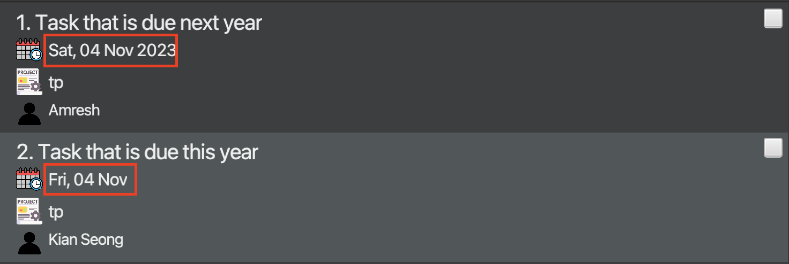
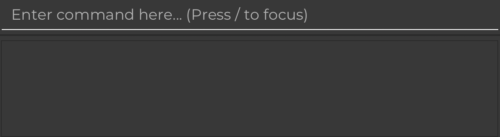
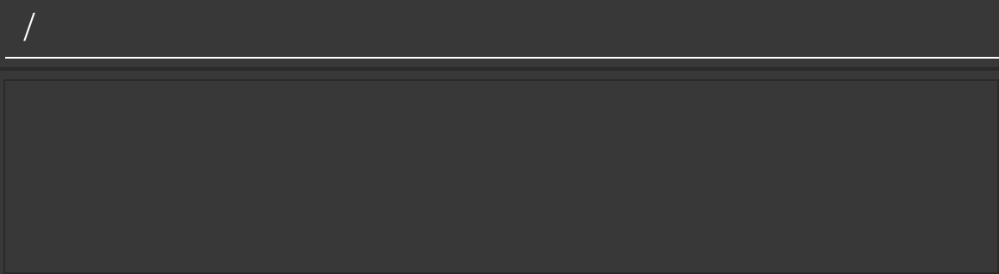

Welcome to **Arrow** User Guide! This user guide will give a descriptive instruction on how to use **Arrow**.
The _words_ _in_ _italic_ are terms you may be unfamiliar with. And if that is the case, 
do not hesitate checking them out in [Glossary](#glossary).

**Arrow** is a **desktop app** that **help software project managers keep track of their members’ tasks and deliverables**. 
By associating tasks to specific team members, users can **keep track of what needs to be done and have quick access to 
contact information should they wish to reach out to the member**. More specifically, apart from the _command box_, 
there are two main lists which store the tasks list and the contact list. In this way, our target users (software project manager)
can use two lists to organize the team project easily.

**Arrow** uses a _Command Line Interface_ (CLI)at the same time possessing convenience of a _Graphical User Interface_ (GUI). The main target audiences are software
project managers, which assumptively equipped with _Command Line Interface_ (CLI) skills. And if you can type fast,
**Arrow** can help you manage your team members in an exceptionally quick way.

### Note

**:information_source: If you are unfamiliar with Command Line Interface (CLI):** 

**Arrow** has the target audiences of software project team leads. 
In this circumstance, we assume users having some experience of using command line tools. 
However, it's perfectly fine if you do not know how to use CLI. 
Click [here](#tutorial-for-cli) to learn more about what is CLI.

--------------------------------------------------------------------------------------------------------------------

## Table of Contents

1. [Quick Start](#quick-start)
2. [Overview of Features](#overview-of-features)
    1. [Basic Commands](#basic-commands)
        - [Clear all Teammate records](#clearing-all-teammates--clear)
        - [Clear all Task records](#clearing-all-tasks-from-task-panel-task-clear)
        - [Help](#viewing-help--help)
        - [Exit the program](#exiting-the-program--exit)
    2. [Teammate Commands](#teammate-commands)
        - [Add a Teammate](#adding-a-new-teammate-add)
        - [List all Teammates](#listing-all-teammates--list)
        - [Delete a Teammate](#deleting-a-teammate--delete)
        - [Edit a Teammate](#editing-a-teammates-information--edit)
        - [Find Teammate](#finding-teammates-based-on-namekeyword-find)
    3. [Task Commands](#task-commands)
        - [Add a Task](#adding-a-new-task-task-add)
        - [Assign a Task to a Teammate](#assigning-a-task-to-a-teammate-task-assign)
        - [View all Tasks assigned to a Teammate](#viewing-all-tasks-assigned-to-a-teammate-task-list-)
        - [Mark completed Task](#marking-completed-tasks-task-mark)
        - [Unmark incomplete Task](#unmarking-incomplete-tasks-task-unmark)
        - [Delete a task](#deleting-a-task-task-delete)
        - [Set deadline to Task](#setting-deadlines-to-a-task-task-do--by)
        - [Sort Task by deadline](#sorting-tasks-by-deadline-task-sort)
        - [Filter Task by parameters](#filtering-the-tasks-list-task-list)
        - [Edit a Task](#editing-a-task-task-edit)
        - [List all project title](#listing-all-projects-task-project)
3. [Command Summary](#command-summary)
4. [FAQ](#faq)
5. [Tutorial for CLI](#tutorial-for-cli)
6. [Behind Everything](#behind-everything)
7. [Glossary](#glossary)

--------------------------------------------------------------------------------------------------------------------

## Quick Start

1. Ensure you have Java `11` or above installed in your Computer. If you are unsure of how to check, refer to the [FAQ](#faq).

2. Download the latest `arrow.jar` from [here](https://github.com/AY2223S1-CS2103T-T08-2/tp/releases).

3. Copy the file to the folder you want to use as the _home folder_ for Arrow.
4. Double-click the file to start the app. The _GUI_ or _main window_ should appear in a few seconds.
Note how the app contains some sample data. If the app does not start and an `error` appears on your screen, do refer to the [FAQ](#faq). 

5. The picture below shows the _main window_ of **Arrow**.
* The command box is boxed in *red*, where you enter commands.
* The task panel list is boxed in *blue*, where you can see the current task list.
* The address book is boxed in *green*, where you can see the contact information of your team members.

6. Type the command in the command box and press Enter to execute it. e.g. typing **`help`** and pressing Enter will open the help window. 
   Some example commands you can try:

    * **`list`** : Lists all team members.

    * **`exit`** : Exits the app.
7. Refer to the **Features** section below for details of each command.

--------------------------------------------------------------------------------------------------------------------

## Overview of Features

This section provides a brief overview of `Arrow`. The intention is for users to gain a better
understanding of basic functionalities of `Arrow`, before diving into specific commands.

1. **Basic functionality**
    1. Clear all Teammates' records
    2. Clear all Task records
    3. Get Help
    4. Exit app
2. **Managing Teammate Information**
    1. Adding a new Teammate
    2. Listing all Teammates
    3. Deleting a Teammate
    4. Editing a Teammate's information
    5. Finding Teammate(s) based on name/keyword/tag
3. **Managing Task Information**
    1. Adding a new Task
    2. Assigning a Task to a Teammate
    3. Viewing all Tasks assigned to a Teammate 
    4. Marking completed Tasks
    5. Unmarking incomplete Tasks
    6. Deleting a Task
    7. Setting deadlines to a Task
    8. Sorting Task by deadline
    9. Filtering Task by
       1. Description
       2. Project Title
       3. Assigned Contacts to Task
       4. Deadline
       5. Completion Status
    10. Editing a Task
    11. Listing all project title

## Features

If you are new to **Arrow**, here provides some tips for you to enter commands efficiently.

**:information_source: Notes about the command format:** 

* The task list shows only **INCOMPLETE** tasks. 
Once a task has been marked (either by the command or the by ticking the white box), 
it will be completed and disappears from the task panel as it is NOT incomplete.

* To view the task list with both complete and incomplete ones, using `task list -a`.

* Words in `UPPER_CASE` are the parameters to be supplied by the user. 
  e.g. in `add n/NAME`, `NAME` is a parameter which can be used as `add n/John Doe`.

* Items in square brackets are optional. 
  e.g. `n/NAME [t/TAG]` can be used as `n/John Doe t/friend` or as `n/John Doe`.

* Items with `…`​ after them can be used multiple times including zero times. 
  e.g. `[t/TAG]…​` can be used as ` ` (i.e. 0 times), `t/friend`, `t/friend t/family` etc.

* Parameters can be in any order. 
  e.g. if the command specifies `n/NAME p/PHONE_NUMBER`, `p/PHONE_NUMBER n/NAME` is also acceptable.

* If a parameter is expected only once in the command, but you specified it multiple times, only the last occurrence of the parameter will be taken. 
  e.g. if you specify `p/12341234 p/56785678`, only `p/56785678` will be taken.

* _Extraneous parameters_ for commands that do not take in parameters (such as `help`, `list`, `exit` and `clear`) will be ignored. 
  e.g. if the command specifies `help 123`, it will be interpreted as `help`.

* `INDEX` must a positive integer of the given item in the panel.

--------------------------------------------------------------------------------------------------------------------

## Basic Commands
This section covers basic application-related commands.

### Clearing all Teammates : `clear`

Clears all Teammates from the address book.

Format: `clear`

---
### Clearing all tasks from Task Panel: `task clear`

Clears the tasks from tasks list.

Format: `task clear`
* Clear the `task list` and create a new empty one.

Examples:
* `task list` followed by `task clear` clear the entire task list.

---
### Viewing help : `help`

Shows a message explaining how to access the help page.

Format: `help`

---
### Exiting the program : `exit`

Exits the program.

Format: `exit`

---
## Teammate Commands
Teammate entails all of the members that you can assign tasks to in the future. This section documents how to add, delete, edit and list operations on teammate records.

### Adding a new Teammate: `add`

Adds a new Teammate to the address book.

Format: `add n/NAME p/PHONE_NUMBER e/EMAIL a/ADDRESS [t/TAG]…​`

:bulb: **Tip:**
A teammate can have any number of tags (including 0)

Examples:
* `add n/John Doe p/98765432 e/johnd@example.com a/John street, block 123, #01-01`
* `add n/Betsy Crowe t/friend e/betsycrowe@example.com a/Newgate Prison p/1234567 t/criminal`

---
### Listing all Teammates : `list`

Shows a list of all teammates in the address book.

Format: `list`

---
### Deleting a Teammate : `delete`

Deletes the specified Teammate from the address book.

Format: `delete INDEX`

* Deletes the person at the specified `INDEX`.
* The index refers to the index number shown in the displayed person list.
* The index **must be a positive integer** 1, 2, 3, …​

Examples:
* `list` followed by `delete 2` deletes the 2nd person in the address book.
* `find Betsy` followed by `delete 1` deletes the 1st person in the results of the `find` command.

Note:
* This teammate will also be deleted from all tasks he is assigned to. Task panel will be filtered to show you the affected tasks!
* Enter `task list` to view all tasks again.

---
### Editing a Teammate's information : `edit`

Edits an existing Teammate in the address book.

Format: `edit INDEX [n/NAME] [p/PHONE] [e/EMAIL] [a/ADDRESS] [t/TAG]…​`

* Edits the person at the specified `INDEX`. The index refers to the index number shown in the displayed person list. The index **must be a positive integer** 1, 2, 3, …​
* At least one of the optional fields must be provided.
* Existing values will be updated to the input values.
* When editing tags, the existing tags of the person will be removed i.e. adding of tags is not cumulative.
* You can remove all the person’s tags by typing `t/` without
  specifying any tags after it.

Examples:
*  `edit 1 p/91234567 e/johndoe@example.com` Edits the phone number and email address of the 1st person to be `91234567` and `johndoe@example.com` respectively.
*  `edit 2 n/Betsy Crower t/` Edits the name of the 2nd person to be `Betsy Crower` and clears all existing tags.

Note:
* This teammate's details will also be edited under all tasks he is assigned to. Task panel will be filtered to show you the affected tasks!
* Enter `task list` to view all tasks again.

---
### Finding Teammate(s) based on name/keyword/tags: `find`

Finds persons whose names contain any of the given name/keywords, or persons who contain any of the given tags.

Format: `find [NAME/KEYWORD]… [t/TAG]…`

* At least one keyword/tag has to be provided.
* The search is case-insensitive. e.g. `hans` will match `Hans`
* The order of the keywords does not matter. e.g. `Hans Bo` will match `Bo Hans`
* For names/keywords, only the name is searched.
* Partial names/keywords will be matched e.g. `Han` will match `Hans`
* Only full tags will be matched e.g. `t/frontend` will only match with `t/frontend`
* Persons matching at least one keyword/tag will be returned (i.e. `OR` search).
  e.g. `Hans Bo` will return `Hans Gruber`, `Bo Yang`.

Examples:
* `find John` returns `john` and `John Doe`
* `find t/frontend` returns `Alex Yeoh`
* `find John t/frontend` returns `john`, `John Doe` and `Alex Yeoh`
* `find alex david` returns `Alex Yeoh`, `David Li` 
  

---
## Task Management Commands
A Team Leader in `Arrow` may have tasks to complete or assign to Teammates.

In the Task panel, all tasks are shown coupled with who it has been assigned to.

A Task has the ability to store these details:
* Index of Task: The index of an existing Task in the Tasks panel
* Deadline: The deadline given to the Task
* Project Title: The Project Title the Task is under
* Description: Description given to the Task
* Assigned Teammates: Teammates that the Task has been assigned to

>:information_source: All task-related commands have the keyword `task` in front of them.
These commands modify the Task panel of `Arrow`.

### Adding a new Task: `task add`

Adds a new task to the task panel.

Format: `task add TITLE by/DEADLINE [#PROJECT] [@PERSON_INDEX]...`

* `TITLE` refers to the task and **cannot be empty**.
* You can only use plain English to describe the intended deadline, such as `today`, `tomorrow`, `next Thursday`, `14 November`, and so on.
* Dates containing non-alphanumeric characters such as `11-11-2022` will not be accepted and an error message will be thrown.
* If the application is unable to determine a date from your input, an error message will be displayed, and you will be prompted to try a different input.
* If task does not have a deadline, you can put `by/?` and there will be no deadline.
* `PERSON_INDEX` refers to the index number shown in the displayed person list.

Examples:
* `task add Task 1 by/next friday #CS2103T @1`
* `task add Finish GUI by/sunday #CS2100 @2`

---
### Assigning a Task to a Teammate: `task assign`

Assigns or unassigns the specified teammate from address book to a task from task panel.

Format: `task assign TASK_INDEX [+@PERSON_INDEX]…​ [+@PERSON_NAME]…​ [-@PERSON_INDEX]…​ [-@PERSON_NAME]…​`
* +@: Assigns the persons at the specified PERSON_INDEXs, or with the PERSON_NAME, from `address book` to task at the specified TASK_INDEX from `task list`.
* -@: Unassigns the persons at the specified PERSON_INDEXs, or with the PERSON_NAME, from `address book` from task at the specified TASK_INDEX from `task list`.

:bulb: **Tip:**
A task can have 0 or more assigned teammates.

Examples:
* `task assign 1 +@1 +@Alex Yeoh -@Bernice Yu` assigns the 1st person and "Alex Yeoh" from the address book to the 1st task from task list, and unassigns "Bernice Yu" from the same task.

---
### Marking completed Tasks: `task mark`

Marks a task as complete.

Format: `task mark TASK_INDEX`
* Marks the task at the specified `TASK_INDEX`.
* The index refers to the index number shown in the displayed task list.
* The index **must be a positive integer** 1, 2, 3, …​

Examples:
* `task list` followed by `task mark 1` marks the 1st task in the task list as complete.

---
### Unmarking incomplete Tasks: `task unmark`

Unmarks a task and sets it as incomplete.

Note;
* To unmark a task, we need to show the full list of tasks with the completed (disappeared) tasks.
* By executing `task list -a` command, we can fully display the task panel with both complete and incomplete tasks.
* Thus we can `unmark` a task from complete to incomplete.

Format: `task unmark TASK_INDEX`
* Show the full task lists by using `task list -a`.
* Unmarks the task at the specified `TASK_INDEX`.
* The index refers to the index number shown in the displayed task list.
* The index **must be a positive integer** 1, 2, 3, …​

Examples:
* `task list -a` followed by `task unmark 1` unmarks the 1st task in the task list and sets it as incomplete.

---
### Deleting a Task: `task delete`

Deletes the specified task from the task panel.

Format: `task delete TASK_INDEX`

* Deletes the task at the specified `TASK_INDEX`.
* The index refers to the index number shown in the displayed task list.
* The index **must be a positive integer** 1, 2, 3, …​

Examples:
* `task list` followed by `task delete 2` deletes the 2nd task in the task panel.

---
### Setting deadlines to a task: `task do ... by/`

You can use the `task do ... by/` command to set (or remove) a deadline for some task.

Format: `task do TASK_INDEX by/DATE...`
- The `task do` command sets the deadline specified by `DATE` to the task at the specified `TASK_INDEX` from the task list.
- You can only use plain English to describe the intended deadline, such as `today`, `tomorrow`, `next Thursday`, `14 November`, and so on.
- Dates containing non-alphanumeric characters such as `11-11-2022` will not be accepted and an error message will be thrown.
- If the application is unable to determine a date from your input, an error message will be displayed, and you will be prompted to try a different input.
- To **remove** the deadline from a task, you can use the special character `?`.

##### Examples:
* `task do 1 by/tomorrow` sets the deadline for the 1st task in the list to tomorrow.
* `task do 1 by/?` **removes** the deadline from the 1st task in the list.

**:information_source: Additional Notes:** 
* As we foresee that most of your tasks should fall within the current year, the deadline of such tasks have their year omitted in the task panel. 
* You may refer to the screenshot below for a better understanding

### Sorting tasks by deadline: `task sort`

Sorts the task list by deadline

**:information_source: Additional Notes:** 
* After this command is ran, the task panel will only show incomplete tasks. 
 

Format: `task sort`

### Filtering the Tasks List: `task list`

The `task list` command is a powerful command that allows you to focus only on the tasks that matter to you.

Format: `task list [KEYWORD] [#PROJECT_NAME]... [@PERSON_INDEX]... [before/DATE] [after/DATE] [-a] [-c]`

The format above may look daunting, but this is only because the `task list` command allows you to potentially describe complex queries.

However, all the parameters are optional, and in most cases, you will only need a simple query that uses just one or two parameters.

For ease of understanding, many of these common use cases have been detailed below.

#### 1. Filtering by Completion Status

`Format: task list [-a] [-c]`
- The simplest form of the command is simply `task list`. This allows you to view all incomplete tasks.
- You may find this command useful to reset your task list back to its default state.

##### Examples
- `task list -a` returns **all** tasks, regardless of completion status.
- `task list -c` returns all **completed** tasks only.

**:information_source: Additional Notes:** 
* When the `-a` or `-c` parameters are not specified, the `task list` command returns all **incomplete** tasks that match the given query. 
* In the following examples, 'all tasks' will refer to 'all incomplete tasks' for brevity. 

#### 2. Filtering by Description
`Format: task list KEYWORD`
- The `KEYWORD` parameter allows you to search for tasks that contain `KEYWORD`.

##### Example
- `task list fix` returns all tasks whose description contains the keyword `fix`.

#### 3. Filtering by Project
`Format: task list #PROJECT_NAME...`
- The `#` parameter allows you to search for tasks that are assigned to **any** of the project(s) you specify.

##### Example
- `task list #CS2101 #CS2103T` returns all tasks that are **either** under the project `CS2101` **or** `CS2103T`.

#### 4. Filtering by Assigned Contact(s)
`Format: task list @PERSON_INDEX...`
- The `@` parameter allows you to search for tasks that are assigned to **all** the contact(s) you specify.
- Shows the tasks of the specified `PERSON_INDEX`.
- The contact refers to the index number shown in the displayed person list.
- The index **must be a positive integer** 1, 2, 3, …​

##### Example
- `task list @1 @2` returns all tasks that are assigned to **both** the 1st and 2nd persons from the address book.

#### 5. Filtering by Deadline
`Format: task list before/DATE after/DATE`
- The `before/` and `after/` parameters allow you to specify a date range to filter the tasks by, according to their deadline.
- You can choose to use only one of the parameters, as shown in the examples below

##### Examples
- `task list before/ next Monday after/ tomorrow` returns all tasks whose deadline is after tomorrow but before next Monday.
- `task list before/ end of the month` returns all tasks whose deadline is before the end of the month.

**:bulb: Tips for Advanced Users:** 
* You can use any combination of the parameters above to build a query that matches your unique requirements! 
* Do note that the `KEYWORD` parameter **must** come first, if any other parameters are used. 

---
### Editing a task: `task edit`

Edits an existing task in the task list.

Format: `task edit TASK_INDEX [ti/TITLE] [by/DEADLINE] [#/PROJECT]`

* Edits the person at the specified `TASK_INDEX`. The index refers to the index number shown in the displayed person list. The index **must be a positive integer** 1, 2, 3, …​
* At least one of the optional fields (TITLE, DEADLINE, PROJECT) must be provided. If none are provided, the application will give an error.
* Existing values will be updated to the input values.

---
### Listing all projects: `task project`

Lists all the projects present in the task panel. 
Projects of hidden tasks will also be shown.

>:information_source: The task panel will not be changed to show only tasks with project.

Format: `task project`

---
### Saving the data

Arrow data are saved in the hard disk automatically after any command that changes the data. There is no need to save manually.

### Editing the data file

Arrow data are saved as JSON files, one for Teammates and one for Task Panel.
* Teammates: `[JAR file location]/data/addressbook.json`
* TaskPanel: `[JAR file location]/data/taskpanel.json`
Advanced users are welcome to update data directly by editing that data file.

:exclamation: **Caution:**
If your changes to the data file makes its format invalid, AddressBook will discard all data and start with an empty data file at the next run.

## Proposed Features

Features to implement in the coming versions.

### Sort Teammates by name
Sort Teammates by alphabetical order of their names. Currently, it is difficult to search for specific Teammates if the list becomes too long. This feature would allow easier finding of Teammates as there is an order in the list of Teammates.

--------------------------------------------------------------------------------------------------------------------

## Command Summary

This summary provides a list of useful and straightforward instructions on how to use the command lines more efficiently.
### Basic Commands

| Command         | Format       |
|-----------------|--------------|
| User Manual     | `help`       |
| Clear Teammates | `clear`      |
| Clear Tasks     | `task clear` |
| Exit            | `exit`       |

### Teammate Commands

| Command | Format                                                                 | Example                                                                                            |
|---------|------------------------------------------------------------------------|----------------------------------------------------------------------------------------------------|
| Add     | `add n/NAME p/PHONE_NUMBER e/EMAIL a/ADDRESS [t/TAG]…​`                | `add n/James Ho p/22224444 e/jamesho@example.com a/123, Clementi Rd, 1234665 t/friend t/colleague` |
| List    | `list`                                                                 | -                                                                                                  |
| Delete  | `delete INDEX`                                                         | `delete 3`                                                                                         |
| Edit    | `edit INDEX [n/NAME] [p/PHONE_NUMBER] [e/EMAIL] [a/ADDRESS] [t/TAG]…​` | `edit 2 n/James Lee e/jameslee@example.com`                                                        |
| Find    | `find [KEYWORD]… [t/TAG]…`                                             | `find James Jake t/frontend t/backend`                                                             |

### Task Commands

| Command           | Format                                                                                               | Example                                                                                            |
|-------------------|------------------------------------------------------------------------------------------------------|----------------------------------------------------------------------------------------------------|
| Task add          | `task add TITLE by/DEADLINE [#PROJECT] [@PERSON_INDEX]...`                                           | `add n/James Ho p/22224444 e/jamesho@example.com a/123, Clementi Rd, 1234665 t/friend t/colleague` |
| Task assign       | `task assign TASK_INDEX [+@/PERSON_INDEX]…​ [+@/PERSON_NAME]…​ [cd/PERSON_INDEX]…​ [-@/PERSON_NAME]…​` | `task assign 3 +@/1 +@/Alex Yeoh @-/2`                                                             |
| Task list         | `task list`                                                                                          | -                                                                                                  |
| Task mark         | `task mark TASK_INDEX`                                                                               | `task mark 1`                                                                                      |
| Task unmark       | `task unmark TASK_INDEX`                                                                             | `task unmark 1`                                                                                    |
| Task delete       | `task delete INDEX`                                                                                  | `task delete 3`                                                                                    |
| Task set deadline | `task do TASK_INDEX by/DATE...`                                                                      | `task do 1 by/tomorrow`                                                                            |
| Task sort         | `task sort`                                                                                          | -                                                                                                  |
| Task filter       | `task list`                                                                                          | -                                                                                                  |
| Task edit         | `task edit TASK_INDEX [ti/TITLE] [by/DEADLINE] [#/PROJECT] [+@PERSONS_INDEX] ... [-@PERSONS_INDEX]...` | `task edit 2 ti/Finish bar by/tomorrow`                                                            |
| Task project      | `task project`                                                                                       | -                                                                                                  |

--------------------------------------------------------------------------------------------------------------------

## FAQ

**Q**: How do I check my Java version? 
**A**: Open Terminal if you're on Mac or Command Prompt if you're on Windows. Type "java -version" and press Enter.

**Q**: How do I install `java 11`? 
**A**: Download `java 11` to your computer via this [link](https://www.oracle.com/java/technologies/downloads/).

**Q**: If I already have java on my computer, but not `java 11`, how do I switch java version to `java 11`? 
**A**: For MacOS user, check this [tutorial](https://medium.com/@devkosal/switching-java-jdk-versions-on-macos-80bc868e686a).
For Windows user, check this [tutorial](https://www.happycoders.eu/java/how-to-switch-multiple-java-versions-windows/).

**Q**: What if the app does not open when I double-click it? 
**A**: Follow the steps listed to open the app.
1. Ensure that you have done Step 1 to 3 in the Quick Start.
2. Open Terminal app if you are on a Mac or the Command Prompt if you are on Windows.
3. Type "java -jar " into Terminal or Command Prompt (do not do anything else).
4. Go to the folder where you just copied `arrow.jar` to.
5. Drag `arrow.jar` and drop anywhere into Terminal or Command Prompt.
6. Press Enter and the command will run, the GUI will pop up.

**Q**: How do I transfer my data to another Computer? 
**A**: Install the app in the other computer and overwrite the empty data file it creates with the file that contains the data of your previous Arrow home folder.

--------------------------------------------------------------------------------------------------------------------

## Tutorial for CLI

A command-line interface (CLI) is a text-based user interface (UI) used to run programs, 
manage computer files and interact with the computer.

[This article](https://www.freecodecamp.org/news/command-line-commands-cli-tutorial/) showed you several “unknown-to-many” commands 
you can use to get access to hidden functionalities on your personal computer.

### Some of our features
To improve the speed of your actions and quality of your life while using the application we have also implemented the below features
* When your command box is out of focus and empty, you can press the `/` key on your command to immediately put your cursor on the command box.
  
  The command box will be focused and appears as below. A slash will appear and you will have to delete it before entering the next command.
  
* When you enter a command, it disappears from the command box is run by the application. You may use the `UP` arrow key to go back to a previous command or `DOWN` arrow key to go to the next command. However, if there is text entered, then you cannot use this feature.

--------------------------------------------------------------------------------------------------------------------

## Behind Everything

### Why we are using two different lists?

* **Task Panel List**

    As software project team leaders, it is important to have a clear vision of tasks to be implemented,
since there could be many projects and each project may have so many items to keep in track.
Thus, **Arrow** has a task panel list to keep every task organized. 
Details of each task can be added, which helps the team managers no fear of leaving out any progress.

    Also the task panel list only shows the incomplete tasks.

* **Teammate List**

    The most important part of a software project is the team members serving at different positions,
**Arrow** helps tracking details of every team member and links them to their tasks to be finished.

--------------------------------------------------------------------------------------------------------------------

## Glossary

| Term                  | Definition                                                                                                                                                                                                                                                        |
|-----------------------|-------------------------------------------------------------------------------------------------------------------------------------------------------------------------------------------------------------------------------------------------------------------|
| CLI                   | [Command Line Interface](https://en.wikipedia.org/wiki/Command-line_interface) is a text-based _user interface_ (UI) used to run programs,manage computer files and interact with the computer. Click [here](#tutorial-for-cli) if you are not familiar with CLI. |
| User Interface        | The point at which human users interact with a computer, website or application.                                                                                                                                                                                  |
| GUI                   | [Graphical User Interface](https://en.wikipedia.org/wiki/Graphical_user_interface) is a type of user interface                                                                                                                                                    |
| Home Folder           | The folder/directory where Arrow stores all information.                                                                                                                                                                                                          |
| Main Window           | The main window of the application that shows the list of students.                                                                                                                                                                                               |
| Command Box           | The text box where you can enter commands.                                                                                                                                                                                                                        |
| Extraneous Parameters | The specified  command contains more positional parameters than is allowed.                                                                                                                                                                                       |

--------------------------------------------------------------------------------------------------------------------

### This is the end of Arrow user guide, if you reach this far, thank you for your reading and hope you enjoying using our app :)
