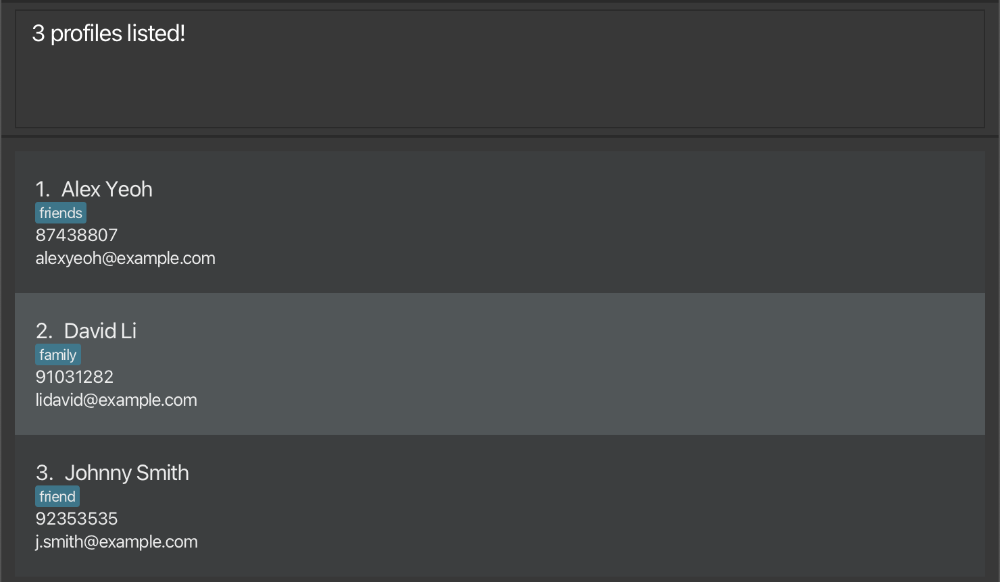

NUScheduler is a desktop app for **managing contacts, optimised for use via a Command Line Interface (CLI)** while still having the benefits of a Graphical User Interface (GUI). If you can type fast, NUScheduler can get your contact management tasks done faster than traditional GUI apps.

* Table of Contents
{:toc}

--------------------------------------------------------------------------------------------------------------------

## Quick start

1. Ensure you have Java `11` or above installed in your Computer.

2. Download the latest `NUScheduler.jar` from [here](https://github.com/AY2223S1-CS2103T-T17-3/tp/releases).

3. Copy the file to the folder you want to use as the _home folder_ for your NUScheduler.

4. Double-click the file to start the app.

5. Type the command in the command box and press Enter to execute it. e.g. typing **`help`** and pressing Enter will open the help window. 
   Some example commands you can try:

   * **`profile -a`** : Adds profile.

   * **`profile -d `**`2` : Deletes the 2nd profile shown in the current list.

   * **`profile -v`** : Lists all profiles in NUScheduler.

6. Refer to the [Features](#features) below for details of each command.

--------------------------------------------------------------------------------------------------------------------

## Features

**:information_source: Notes about the command format:** 

* Words in `UPPER_CASE` are the parameters to be supplied by the user. 
  e.g. in `add n/NAME`, `NAME` is a parameter which can be used as `add n/John Doe`.

* Items in square brackets are optional. 
  e.g `n/NAME [t/TAG]` can be used as `n/John Doe t/friend` or as `n/John Doe`.

* Items with `…`​ after them can be used multiple times including zero times. 
  e.g. `[t/TAG]…​` can be used as ` ` (i.e. 0 times), `t/friend`, `t/friend t/family` etc.

* Parameters can be in any order. 
  e.g. if the command specifies `n/NAME p/PHONE_NUMBER`, `p/PHONE_NUMBER n/NAME` is also acceptable.

* If a parameter is expected only once in the command, but you specified it multiple times, only the last occurrence of the parameter will be taken. 
  e.g. if you specify `p/12341234 p/56785678`, only `p/56785678` will be taken.

* Extraneous parameters for commands that do not take in parameters (such as `help`, `exit` and `clear`) will be ignored. 
  e.g. if the command specifies `help 123`, it will be interpreted as `help`.

### Viewing help : `help`

Shows a message explaining how to access the help page.

Format: `help`

### Adding a profile: `profile -a`

Adds a profile to NUScheduler.

Format: `profile -a n/NAME p/PHONE_NUMBER e/EMAIL [tg/TELEGRAM_USERNAME] [t/TAG]…`

:bulb: **Tip:**
A profile can have 0 or more tags

Examples:
* `profile -a n/John Doe p/98765432 e/johnd@example.com t/friend`
* `profile -a n/Jane Smith e/jane_s@example.com p/91234580 tg/jane_s`
* `profile -a n/Betsy Crowe e/betsycrowe@example.com p/1234567 t/professor t/lecturer`

### Viewing all profiles: `profile -v`

Shows a list of all profiles in the NUScheduler.

Format: `profile -v`

### Editing a profile : `profile -e`

Edits an existing profile in NUScheduler.

Format: `profile -e INDEX [n/NAME] [p/PHONE] [e/EMAIL] [tg/TELEGRAM_USERNAME] [t/TAG]…`

* Edits the profile at the specified `INDEX`. The index refers to the index number shown in the displayed profile list. The index **must be a positive integer** 1, 2, 3, ...
* At least one of the optional fields must be provided.
* Existing values will be updated to the input values.
* You can remove the profile's telegram username by typing `tg/` without specifying any username after it.
* When editing tags, the existing tags of the profile will be removed i.e adding of tags is not cumulative.
* You can remove all the profile’s tags by typing `t/` without specifying any tags after it.

Examples:
* `profile -e 1 p/91234567 e/johndoe@example.com` Edits the phone number and email address of the 1st profile to be `91234567` and `johndoe@example.com` respectively.
* `profile -e 2 n/Betsy Crower t/` Edits the name of the 2nd profile to be `Betsy Crower` and clears all existing tags.
* `profile -e 3 tg/ t/` Clears the telegram username and tags of the 3rd profile. 

### Finding profiles by name: `profile -f KEYWORD [MORE_KEYWORDS]`

Find profiles whose names contain any of the given keywords.

* The search is case-insensitive. e.g `hans` will match `Hans`
* The order of the keywords does not matter. e.g. `Hans Bo` will match `Bo Hans`
* Only the name is searched.
* Partial match will also be returned. e.g. `han` will match `hans`
* Profiles matching at least one keyword will be returned (i.e. `OR` search).
  e.g. `Hans Bo` will return `Hans Gruber`, `Bo Yang`

Examples:
* `profile -f Jane` returns `jane` and `Jane Doe`
* `profile -f alex david john` returns `Alex Yeoh`, `David Li`, `Johnny Smith` 
  

### Deleting a profile: `profile -d`

Deletes a specified profile from NUScheduler.

Format: `profile -d INDEX`

* Deletes the profile at the specified `INDEX`.
* The index refers to the index number shown in the displayed profile list.
* The index **must be a positive integer** 1, 2, 3, …​

Example:
* `profile -d 1` deletes the first profile listed.

### Adding an event: `event -a`

Adds an event with a name and a start timing and end timing.

Format: `event -a n/NAME s/START e/END [p/PROFILE]…`

:bulb: **Tip:**
An event can have 0 or more profiles

### Viewing upcoming events: `event -u`

Displays a list of upcoming events, ordered by the date, for the next specified number of days.

Format: `event -u DAYS`

* The days refer to the number of days from the current date. All events within this time frame will be displayed.
* The days **must be a positive integer** 1, 2, 3, ...

Example:
* `event -u 5` displays all events taking place in the next 5 days ordered by date.

### Viewing all events: `event -v`

Shows a list of all events in the NUScheduler.

Format: `event -v`

### Finding events by name: `event -f KEYWORD [MORE_KEYWORDS]`

Find events whose names contain any of the given keywords.

* The search is case-insensitive. e.g `birthday` will match `Birthday`
* The order of the keywords does not matter. e.g. `one two` will match `two one`
* Only the name of the event is searched.
* Only full words will be matched e.g. `Birth` will not match `Birthday`
* Events matching at least one keyword will be returned (i.e. `OR` search).
  e.g. `interview meeting` will return `Meeting Tom`, `Job Interview`

### Deleting an event: `event -d`

Deletes a specified event from NUScheduler.

Format: `event -d INDEX`

* Deletes the events at the specified `INDEX`.
* The index refers to the index number shown in the displayed event list.
* The index **must be a positive integer** 1, 2, 3, ...

Example:
* `event -v` followed by `event -d 2` deletes the 2nd event displayed.

### Exiting the program: `exit`

Exits the program.

Format: `exit`

--------------------------------------------------------------------------------------------------------------------

## FAQ

No FAQ Yet.

--------------------------------------------------------------------------------------------------------------------

## Command summary

| Action                     | Format, Examples                                                                |
|----------------------------|---------------------------------------------------------------------------------|
| **Add Profile**            | `profile -a n/NAME p/PHONE_NUMBER e/EMAIL [tg/TELEGRAM_USERNAME] [t/TAG]…`      |
| **Delete Profile**         | `profile -d INDEX`                                                              |
| **Edit Profile**           | `profile -e INDEX [n/NAME] [p/PHONE] [e/EMAIL] [tg/TELEGRAM_USERNAME] [t/TAG]…` |
| **View Profiles**          | `profile -v`                                                                    |
| **Find Profile**           | `profile -f KEYWORD [MORE_KEYWORDS]`                                            |
| **Add Event**              | `event -a n/NAME s/START e/END [p/PROFILE]…`                                    |
| **Delete Event**           | `event -d INDEX`                                                                |
| **View Events**            | `event -v`                                                                      |
| **View Upcoming Event(s)** | `event -u DAYS`                                                                 |
| **Find Event**             | `event -f KEYWORD [MORE_KEYWORDS]`                                              |
