

  
  <h1 align="center">Coydir <em>The Ultimate Company Directory</em></h1>

Welcome to Coydir's User Guide!

**Even Thanos had to read the User Guide before he learnt how to wield the power of the infinity stones...**

**This guide will teach you the ropes so that you too can command the infinite power of Coydir the universe has never seen before!! Or simply feel free to look around! :p**

---

### Table of Contents

- [Introduction](#introduction)
- [Using this Guide](#using-this-guide)
  - [Navigating the User Guide](#navigating-the-user-guide)
  - [The User Interface](#the-user-interface)
- [Quick Start](#quick-start)
- [Features](#features)
  - [Coydir Commands Format](#coydir-commands-format)
  - [Managing Employee Profiles](#managing-employee-profiles)
    - [What's in an Employee Profile](#whats-in-an-employee-profile)
    - [Adding an employee](#adding-an-employee-add)
    - [Editing an employee](#editing-an-employee-edit)
    - [Deleting an employee](#deleting-an-employee-delete)
    - [Adding multiple employees at once](#adding-multiple-employees-at-once-batchadd)
    - [View details of an employee](#view-details-of-an-employee-view)
    - [Listing all employees](#listing-all-employees-list)
    - [Finding an employee](#finding-an-employee-find)
  - [Managing Employee Leaves](#managing-employee-leaves)
    - [Controlling total leaves for an employee](#controlling-total-leave-for-an-employee)
    - [Checking if an employee is on leave](#checking-if-an-employee-is-on-leave)
    - [Adding a leave period for an employee](#adding-a-leave-period-for-an-employee-add-leave)
    - [Deleting a leave period for an employee](#deleting-a-leave-period-for-an-employee-delete-leave)
  - [Managing Employee Performance](#managing-employee-performance)
    - [Rating the performance of an employee](#rating-the-performance-of-an-employee-rate)
    - [Employee Performance History](#employee-performance-history)
  - [Managing Departments](#managing-departments)
    - [View details of a department](#view-details-of-a-department--view-department)
  - [Additional Features](#additional-features)
    - [Getting help](#getting-help-help)
    - [Exiting the program](#exiting-the-program-exit)
    - [Clearing the data](#clearing-the-data-clear)
    - [Saving the data](#saving-the-data)
    - [Editing the data file](#editing-the-data-file)
- [FAQ](#faq)
- [Command summary](#command-summary)

---

## Introduction

Welcome HR executives and Department Heads! Coydir is a desktop app to efficiently track key employee details within your company, optimized for use via a Command Line Interface (CLI). Coydir would not only allow you to quickly access the list of all employees and their details but also make necessary updates such as leaves and performance rating information.

## Using this Guide

### Navigating the User Guide
This document might look daunting at first! But fear not, in this section, you will learn how to use 
this user guide like a professional.

####Interested in how to setup? 

You can head over to [Quick Start](#quick-start) to install and run Coydir.

####Interested in what Coydir can do?

You can head over to [Features](#features) to learn how to use the features 
offered in Coydir.

####Do not understand some terminology used?
[**Please input Glossary tag**]

You can head over to [Glossary](#) for better understanding of the terms

    

## Quick start

1. Ensure you have Java `11` or above installed in your Computer.
   1. If you have installed Java before, check that you have the right version, which is Java `11`.
      - If you are using Windows, open up command prompt and type `java -version` and enter.
      - If you are using Mac, open up terminal and type `java -version` and enter.
   2. If you do not have Java `11`: - If you are using Windows, you can install it from [here](https://www.oracle.com/java/technologies/downloads/). - If you are using Mac, you can install the Azul build of OpenJDK 11 version from [here](https://www.azul.com/downloads/?version=java-11-lts&os=macos&architecture=arm-64-bit&package=jdk-fx).  
       
2. Download the latest Coydir v1.3.0 jar file from [here](https://github.com/AY2223S1-CS2103T-T15-1/tp/releases).

3. Copy the file to the folder you want to use as the _home folder_ for your Coydir.

4. Double-click the file to start the app. The GUI similar to below should appear in a few seconds. Note how the app contains some sample data. 

  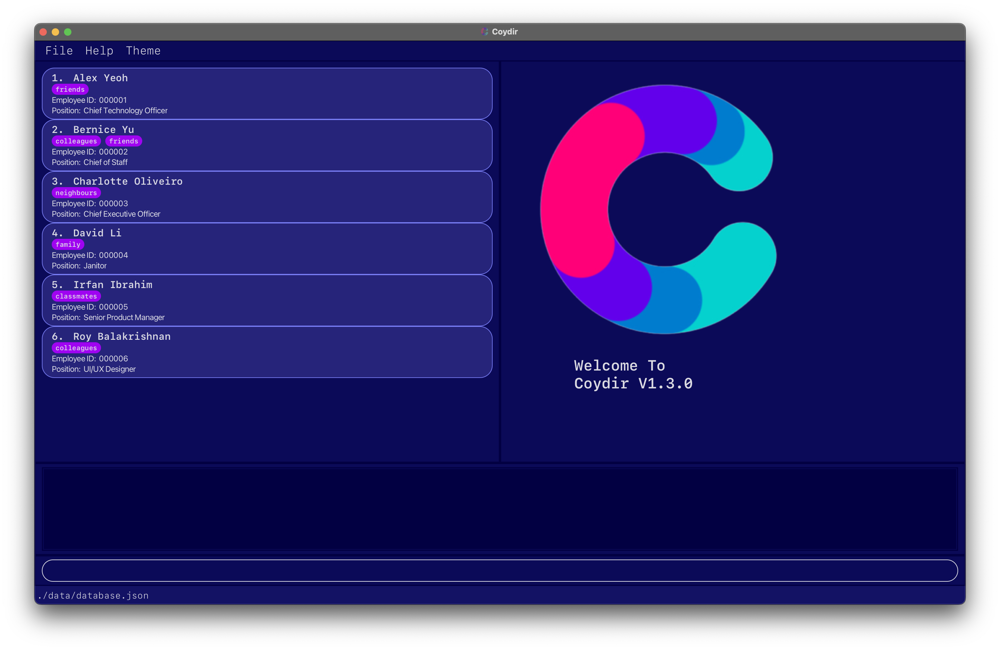

5. Type the command in the command box and press Enter to execute it. e.g. typing **`help`** and pressing Enter will open the help window. 
   Some example commands you can try:

   - **`list`** : Lists all employees in the company.

   - **`add`** `n/John Doe p/98765432 e/johnd@example.com j/Recruiter d/Human Resources a/311, Clementi Ave 2, #02-25 l/20 t/friends t/owesMoney` : Adds an employee named `John Doe`, with fields phone number, email, job title, department, address, total leaves, and tags to Coydir.

   - **`delete`**`3` : Deletes employee with ID 3.

   - **`exit`** : Exits the app.

6. Refer to the [Features](#features) below for details of each command.

### The User Interface

Below is an image of Coydir User Interface with the main components labelled.

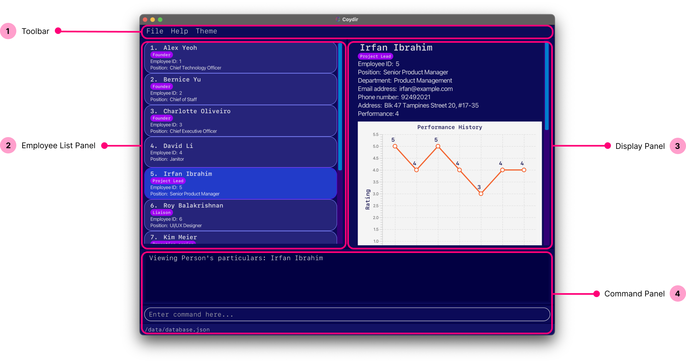

#### Toolbar

This Toolbar can be used to :

1. Exit the application through the **File** button
2. Access the Help guide through the **Help** button
3. Change from Dark mode to Light Mode or vice versa through the **Theme** button

#### Employee List Panel

This shows the whole employee list with basic information such as _Name_, _Employee ID_ and _Position_.

This will come in handy if:

1. You want a general overview of the employees in the company as of this moment.
2. You want to quickly find out their Employee ID to view more details.

#### Employee Info Panel

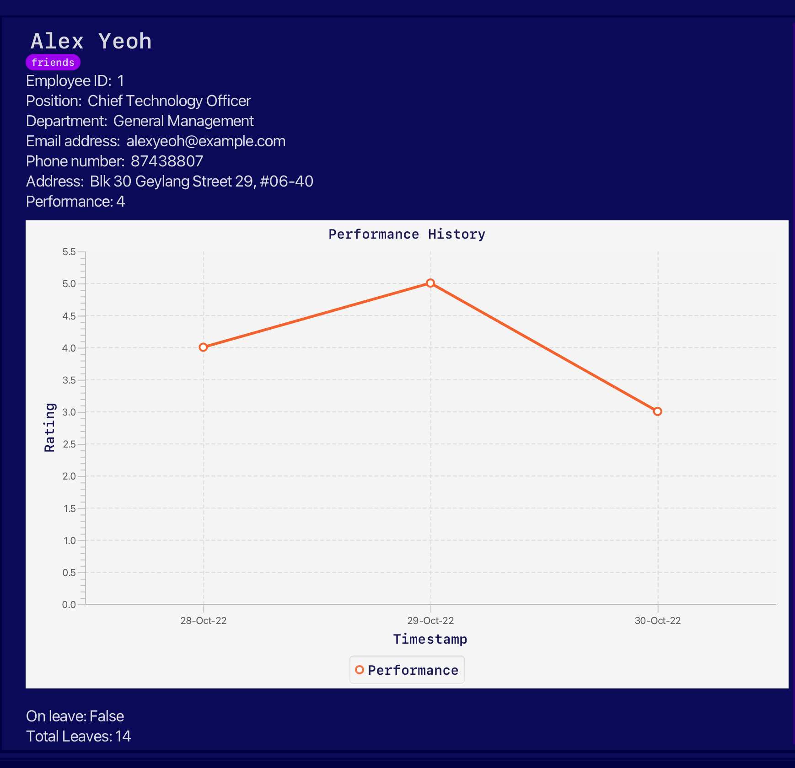
This shows a specific employee's particulars.

Things to note:

1. On startup of the application, this panel shows Coydir logo.
2. To view an employee's particulars, refer to the [view command]([#view-details-of-an-employee--view).
3. If you delete an employee that you are currently viewing, the employee info view will display the next employee's particulars.
4. If there is no next employee, this panel will revert to the Coydir logo.

#### Command Box

You can enter your user commands in the bottom section labeled as `Enter command here...`.

The top section displays relevant messages/errors after the command is entered.

## Quick start

1. Ensure you have Java `11` or above installed in your Computer.
   1. If you have installed Java before, check that you have the right version, which is Java `11`.
      - If you are using Windows, open up command prompt and type `java -version` and enter.
      - If you are using Mac, open up terminal and type `java -version` and enter.
   2. If you do not have Java `11`:
      - If you are using Windows, you can install it from [here](https://www.oracle.com/java/technologies/downloads/).
      - If you are using Mac, you can install the Azul build of OpenJDK 11 version from [here](https://www.azul.com/downloads/?version=java-11-lts&os=macos&architecture=arm-64-bit&package=jdk-fx).
2. Download the latest Coydir v1.3.0 jar file from [here](https://github.com/AY2223S1-CS2103T-T15-1/tp/releases).

3. Copy the file to the folder you want to use as the _home folder_ for your Coydir.

4. Double-click the file to start the app. A GUI similar to below should appear in a few seconds. Note how the app contains some sample data. 

  

5. Type the command in the command box and press Enter to execute it. e.g. typing **`help`** and pressing Enter will open the help window. 
   Some example commands you can try:

   - **`list`** : Lists all employees in the company.

   - **`add`** `n/John Doe p/98765432 e/johnd@example.com j/Recruiter d/Human Resources a/311, Clementi Ave 2, #02-25 l/20 t/friends t/owesMoney` : Adds an employee named `John Doe`, with fields phone number, email, job title, department, address, total leaves, and tags to Coydir.

   - **`delete 3`** : Deletes employee with ID 3.

   - **`exit`** : Exits the app.

6. Refer to the [Features](#features) below for details of each command.

## Features

With our powerful features, it has never been more convenient to perform HR tasks in companies of all sizes.

Coydir empowers you to take more control with less hassle, through data management and analytics features targeting 4 main fields:

1. [Employee particulars and details](#managing-employee-profiles)
2. [Employee leaves](#managing-employee-leaves)
3. [Employee performance](#managing-employee-performance)
4. [Department macro-view](#managing-departments)

Coydir also has other miscellaneous features for a smooth and comfortable use of the application, that we will cover in:

- [Additional Features](#additional-features)

We will explore each of these fields in great detail as we continue along, but before we get into that, let us take a look at how you can use the commands in Coydir's CLI-based interface.

### Coydir Commands Format

- Words in `UPPER_CASE` are the parameters to be supplied by the user. 
  e.g. in `add n/NAME`, `NAME` is a parameter which can be used as `add n/John Doe`.

- Items in square brackets are optional. 
  e.g `n/NAME [t/TAG]` can be used as `n/John Doe t/friend` or as `n/John Doe`.

- Items with `…`​ after them can be used multiple times including zero times. 
  e.g. `[t/TAG]…​` can be used as ` ` (i.e. 0 times), `t/friend`, `t/friend t/family` etc.

- Parameters can be in any order. 
  e.g. if the command specifies `n/NAME p/PHONE_NUMBER`, `p/PHONE_NUMBER n/NAME` is also acceptable.

- If a parameter is expected only once in the command but you specified it multiple times, only the last occurrence of the parameter will be taken. 
  e.g. if you specify `p/12341234 p/56785678`, only `p/56785678` will be taken.

- Extraneous parameters for commands that do not take in parameters (such as `help`, `list`, `exit` and `clear`) will be ignored. 
  e.g. if the command specifies `help 123`, it will be interpreted as `help`.

:warning: **Integer input values cannot be too large**: any values greater than $2^{31}-1$ is not supported.

### Managing Employee Profiles

What's Human Resources without the Human aspect? (_P.S. It's not "Resources"_)

The **core** of any management tool is the **collection and tracking of data**.
Recognising this, Coydir offers several features for the manipulation of data on your company's employees.

As a _HR professional_, Coydir makes it easy for you to **add and remove data**, **change past entries**, and **look for exactly the information you need**.
All this, while keeping your data packed neatly as individual employee profiles for a clean, organised viewing.

Next, let us look at each feature in detail.

#### What's in an Employee Profile

There's _a lot of data_ that a company might want to keep track of for their employees, and different companies might maintain different standards and policies.
In light of this, Coydir focuses on making it easy to manage key data for employees, for the purpose of making everyday operations smooth.

The complete employee profile allows you to specify _a fair amount_ of details for an employee, though some of these particulars are **optional**, and can be left blank if you are unsure of the information, or if you do not feel the need to keep track of it.

| Particular       | Description                            | Requirement    | Default Value |
| ---------------- | -------------------------------------- | -------------- | ------------- |
| **Employee ID**  | Unique numerical ID of employee        | **Cannot Set** | -             |
| **Name**         | Name of employee                       | **Compulsory** | -             |
| **Position**     | Position/job title of employee         | **Compulsory** | -             |
| **Department**   | Department of employee                 | **Compulsory** | -             |
| **Phone Number** | Phone number of employee               | **Optional**   | N/A           |
| **Email**        | Email of employee                      | **Optional**   | N/A           |
| **Address**      | Address of employee                    | **Optional**   | N/A           |
| **Tag**          | Any tag(s) for simple remarks          | **Optional**   | _None_        |
| **Total Leave**  | Total no. of leave for employee        | **Optional**   | 14            |
| **Leaves Left**  | No. of leaves left for employee        | **Cannot Set** | 14            |
| **Rating**       | Latest performance rating for employee | **Cannot Set** | _None_        |

:bulb:
##### Bonus Information on the Profile
- **Employee ID** is a unique number assigned to each employee, and is used for several powerful commands. To ensure the uniqueness of the IDs, Coydir **does not support** any editing/manipulation of the employee IDs.
  - If you really wish to, you can [edit the data file](#editing-the-data-file) directly to "control" the employee IDs. However, this is _strongly discouraged_.
- For simplicity, Coydir (_in v1.4_) currently supports a fixed list of departments.
  - You can find out more about this in the [Department Management section here](#managing-departments).
- For each employee, Coydir supports managing individual employee leaves, as well as performance ratings, helping you to track the particulars that are not meant to be set (no. of leaves left, employee rating)
  - You can find out more about [employee leave management here](#managing-employee-leaves), and about [performance ratings here](#managing-employee-performance).

#### Adding an employee: `add`

Adds an employee to Coydir.

Format: `add n/NAME [p/PHONE] [e/EMAIL] j/POSITION d/DEPARTMENT [a/ADDRESS] [l/LEAVE] [t/TAG]…​`

| Field        | TAG | Description                     | Requirement    | Default Value |
| ------------ | --- | ------------------------------- | -------------- | ------------- |
| `NAME`       | n/  | Name                            | **Compulsory** | -             |
| `PHONE`      | p/  | Phone number                    | **Optional**   | N/A           |
| `EMAIL`      | e/  | Email                           | **Optional**   | N/A           |
| `POSITION`   | j/  | Job position                    | **Compulsory** | -             |
| `DEPARTMENT` | d/  | Company Department              | **Compulsory** | -             |
| `ADDRESS`    | a/  | Address                         | **Optional**   | N/A           |
| `LEAVE`      | l/  | Total number of entitled leaves | **Optional**   | 14            |
| `TAG`        | t/  | Information tags                | **Optional**   | _None_        |

:bulb:
An employee can have any number of tags (including 0).

:bulb:
The only compulsory fields are name, position and department.
Leaves will be default 14 while the other fields will be initialised as N/A.

Examples:

- `add n/John Doe p/98765432 e/johnd@example.com j/Recruiter d/Human Resources a/311, Clementi Ave 2, #02-25 l/20 t/friends t/owesMoney`
- `add n/Peter Mars j/Chief Operating Officer d/General Management`

#### Editing an employee: `edit`

There might be times when you have to change an employee's particulars and details after adding them into the database.
It could be a typo in the address, a mobile number change, maybe even a promotion...

In any case, editing an employee's details can be done through a simple command.

- Provide the **index number** of the employee (not the Employee ID) based on the **employee list currently displayed**, along with the updated details you wish to change to.
- Any existing value, if it exists, will be overwritten by the updated value that is keyed in. Otherwise, details that are not specified will remain as they are, unchanged.

Format: `edit INDEX [n/NAME] [p/PHONE] [e/EMAIL] [j/POSITION] [d/DEPARTMENT] [a/ADDRESS] [l/LEAVE] [t/TAG]…​`

| Field        | TAG | Description                         | Requirement    | Default Value |
| ------------ | --- | ----------------------------------- | -------------- | ------------- |
| `INDEX`      | -   | Index of employee in displayed list | **Compulsory** | -             |
| `NAME`       | n/  | Updated name of employee            | **Optional**   | -             |
| `PHONE`      | p/  | Updated phone number of employee    | **Optional**   | -             |
| `EMAIL`      | e/  | Updated email of employee           | **Optional**   | -             |
| `POSITION`   | j/  | Updated position of employee        | **Optional**   | -             |
| `DEPARTMENT` | d/  | Updated department of employee      | **Optional**   | -             |
| `ADDRESS`    | a/  | Updated address of employee         | **Optional**   | -             |
| `LEAVE`      | l/  | Updated total leave of employee     | **Optional**   | -             |
| `TAG`        | t/  | Updated tag(s) of employee          | **Optional**   | -             |

:bulb:
  There must be _at least one_ update parameter provided (such as name, phone, email, etc.). Otherwise, Coydir will not run the command, as you would not be editing anything at all!

Example:

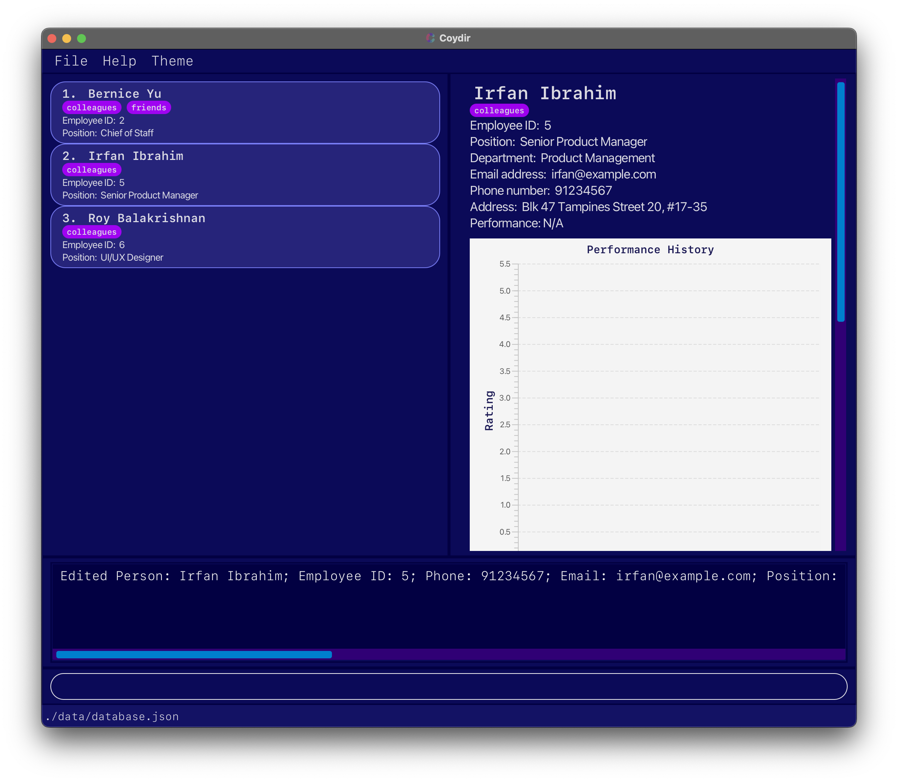

- `edit 2 p/91234567 l/20 t/colleagues` edits the 2nd displayed employee (_Irfan Ibrahim_) to have a phone number `91234567`, a total leave of `20`, and a single tag `colleagues`.

#### Deleting an employee : `delete`

Deletes the specified employee from Coydir, given the employee ID.

This command results in one of two cases below:

**Case 1: Employee with ID exists**

If Coydir has an employee with the respective ID, Coydir will delete it.

**Case 2: Employee with ID does not exist**

Otherwise, if Coydir has no employee with ID that matches the specified name, Coydir will prompt users that the employee ID entered is invalid.

Format: `delete ID`

Example:

- `delete 1` deletes the employee with employee ID of 1.

#### Adding multiple employees at once: `batch-add`

Adds multiple employees to Coydir by importing their data from `.csv` file

This feature will come in handy when:

1. You are a new user and have your employee data stored in a `.csv` file.
2. There has been a recruitment cycle and the company has recruited multiple employees.

With this feature, you would not need to spend time to manually add each employee in!

Format: `batch-add FILENAME`

Example:`batch-add coydir.csv`

How can you use this feature?

#### Step 1 (Creating CSV file) :

Things to note:

- A header row is required to indicate the purpose of the field and must be the first row in the `.csv` file.
- No commas to be used in the file.
- For multiple tags for an employee, the tags should be separated by " \ ".
- For the fields, make sure that they follow the same specifications as written in the `add` command.

Order of headers is as such (**Order must be followed**):

| Index | Field          | Requirement    | Default Value |
| ----- | -------------- | -------------- | ------------- |
| 1.    | `NAME`         | **Compulsory** | -             |
| 2.    | `PHONE`        | Optional       | N/A           |
| 3.    | `EMAIL`        | Optional       | N/A           |
| 4.    | `POSITION`     | **Compulsory** | -             |
| 5.    | `DEPARTMENT`   | **Compulsory** | -             |
| 6.    | `ADDRESS`      | Optional       | N/A           |
| 7.    | `NO_OF_LEAVES` | Optional       | 14            |
| 8.    | `TAGS`         | Optional       | _None_        |

Sample `.csv` file:

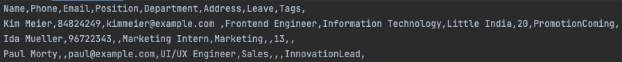

Sample `.xlsx` file:  
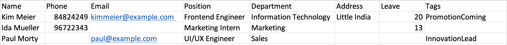  
Note: You can export this to `.csv`.

#### Step 2 (Uploading CSV file) :

1. Go to the folder where you stored the `jar` file.
2. Move CSV file to the `data` folder.  
   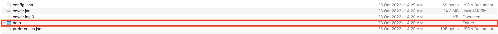

_If you are a new user (have not run any command yet), you will not see the `data` folder.  
You can run the [`clear` command](#clearing-the-data--clear) to remove the sample employees first.  
After this, you should be able to see the `data` folder._

#### Step 3 (Running CSV file) :

1. Once done, run `batch-add FILENAME` in the command box.

Successful Batch Add:  
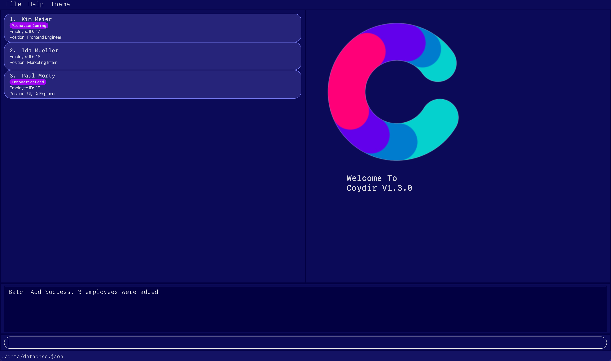

Unsuccessful Batch Add:

In the case of an unsuccessful Batch Add, **NONE** of the employees in the `.csv` will be added.

**Case 1 (Duplicate Employee):**

If there is another employee with the same name in the database or in the csv, command will fail  
and error will be raised.  

**Case 2 (Any of the fields in wrong format):**

If any of the fields are in a wrong format (as specified in `add` command), command will fail  
and error with regard to field in the wrong format will be raised

  
_In this case, a `Phone` field was in the wrong format._

As of version `1.4.0` , this feature only supports `.csv` files and adding employees with the fields mentioned above.

In the upcoming versions, we will expand `batch-add` feature to:

1. Support different types of files
2. Include more fields like rating etc.

#### View details of an employee: `view`

Views the details of an existing employee in the current list.

Format: `view INDEX`

Example:

- `view 2` returns the details of the second employee in the current list.

:bulb:
Note that an INDEX is different from an ID. More information about the difference in INDEX and ID can be found on the FAQ page.

#### Listing all employees : `list`

Shows a list of all employees in the company.

Format: `list`

#### Finding an employee : `find`

Once you get familiar with Coydir and batch-adding numerous employees into the database, using `list` simply isn't sufficient to look for the right employee.
The `find` command is a specific, precise function meant for searching through your employee directory.

You can find employees by searching for:

- Name
- Position
- Department

Or any combination of the above. Coydir will then display all employees that fulfill your search criteria.

Format: `find [n/NAME_KEYWORD] [j/POSITION_KEYWORD] [d/DEPARTMENT_KEYWORD]`

| Field        | TAG | Description                               | Requirement  | Default Value |
| ------------ | --- | ----------------------------------------- | ------------ | ------------- |
| `NAME`       | n/  | Search keyword for name of employee       | **Optional** | -             |
| `POSITION`   | j/  | Search keyword for position of employee   | **Optional** | -             |
| `DEPARTMENT` | d/  | Search keyword for department of employee | **Optional** | -             |

:bulb:
##### Important Tips!
  - There must be _at least one_ parameter (and keyword) in the search, else Coydir will not know what to search for!
  - The keywords you input for searching are **case-insensitive**. Additionally, they need not be full words, just a segment will do. This means that searching for the department "tech" will show results for both "Technology and "Information Technology".

Example:

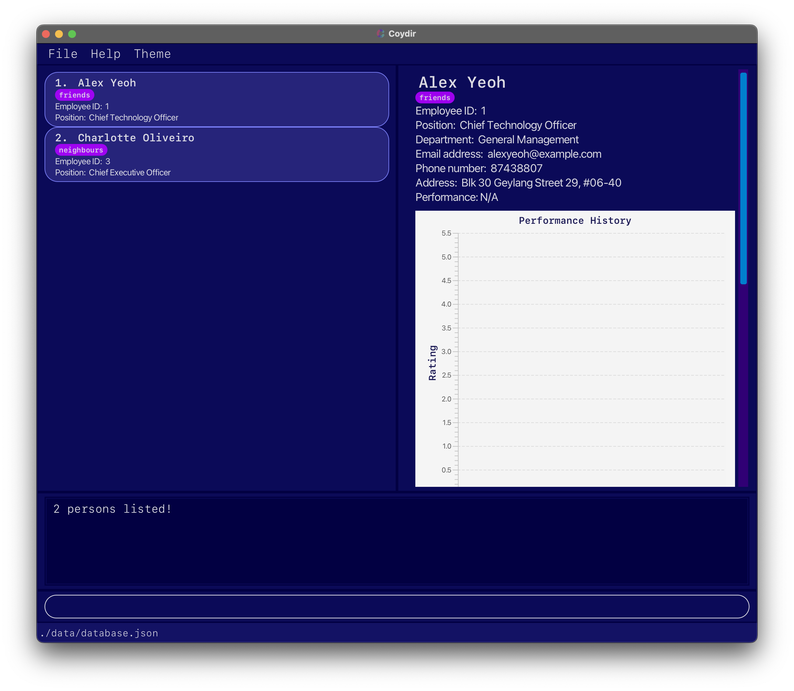

- `find j/officer d/Management` displays 2 employees, who are "Officers" in the "General Management" department.

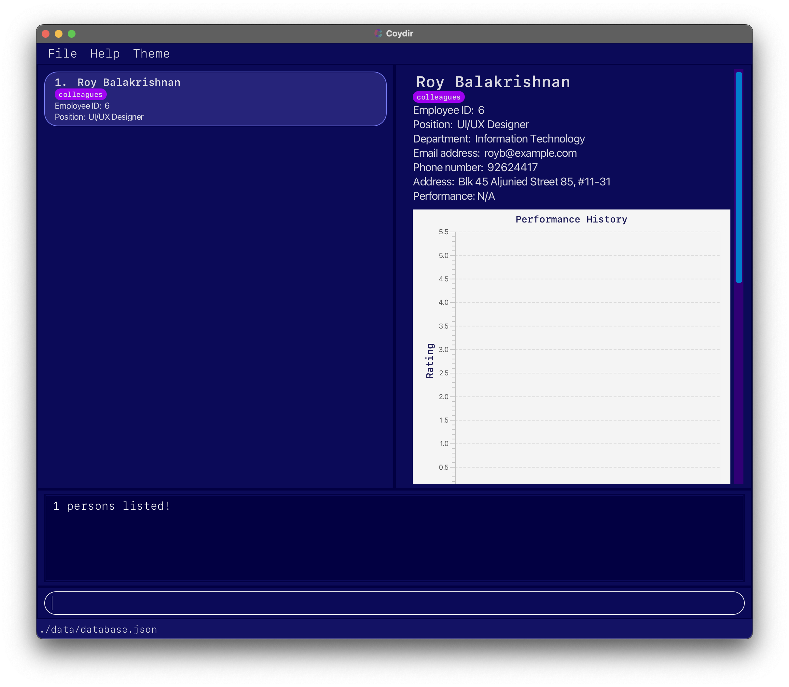

- `find n/Roy j/Design d/Tech` displays 1 employee, "Roy Balakrishnan" who is a "UI/UX Designer" in the "Information Technology" department.

### Managing Employee Leaves

Employee leave management can sometimes be a surprisingly _tedious_ matter to tackle.

However, with Coydir, we can help you to ensure your **company operations run smoothly**, while your **employees get adequate opportunities** to rest and attend to personal matters.

Here is how we support you in leave management.

#### Controlling total leave for an employee

You can set the total leave available for an **incoming new** employee when adding them to the database. This can be done by including the optional leave field, `l/`, when using the `add` command.

Example: `add n/Yi Long Ma j/Chief Operating Officer d/General Management l/20` adds an employee, and specifies his **total leave** to be **20**.

You can also edit the total leave available for an **existing** employee by using the `edit` command, and editing the `l/` tag for an employee.

Example: `edit 1 l/10` edits the total leave of the **first** employee in the current list to be **10**.

#### Checking if an employee is on leave

There are two ways to check for the live availability of employees.

1. First is using the `view-department` command: `view-department general management` opens up a table to show all the employees of the general management department. The number of employees in the department that are available or on leave will be shown.

2. The other way is using the `view` command, or simply just clicking on the profile card of a specific employee: `view 1`, or clicking on the first person card in the current list of employees, opens up the full information of the employee on the right hand side of the screen. You will be able to check if they are on leave by looking for the "On Leave" field.

#### Adding a leave period for an employee: `add-leave`

This adds a leave period to an employee given the employee ID and a start and end date. The leave period will also be displayed in a table which can be seen when viewing the employee's particulars.

This command results in one of two cases below:

**Case 1: Valid ID, date and sufficient leaves**

If the employee exists, the leave date given is valid,
and the employee has sufficient leaves, the leave period will be added and shown in the table of leaves The total leaves remaining will be deducted accordingly. The employee's "On Leave" status will become "True" when the timeframe is within the leave period.

**Case 2: Invalid ID, date or insufficient leaves**

If any of employee ID, date is invalid, or the employee does not possess enough leaves, Coydir will prompt the users accordingly, and the command will not execute.

:bulb:
Leaves are ordered by reverse chronological order in the table view.

Format: `add-leave id/ID sd/START_DATE ed/END_DATE`

| Field        | TAG | Description                               | Requirement    | Default Value |
| ------------ | --- | ----------------------------------------- | -------------- | ------------- |
| `ID`         | id/ | Employee ID                               | **Compulsory** | N.A.          |
| `START_DATE` | sd/ | Start date of leave, in dd-MM-YYYY format | **Compulsory** | N.A.          |
| `END_DATE`   | ed/ | End date of leave, in dd-MM-YYYY format   | **Compulsory** | N.A.          |

Example:

- `add-leave id/1 sd/01-01-2022 ed/01-01-2022` adds a leave period to an employee of ID 1 with a leave period from 01-01-2022 to 01-01-2022 of 1 day.

  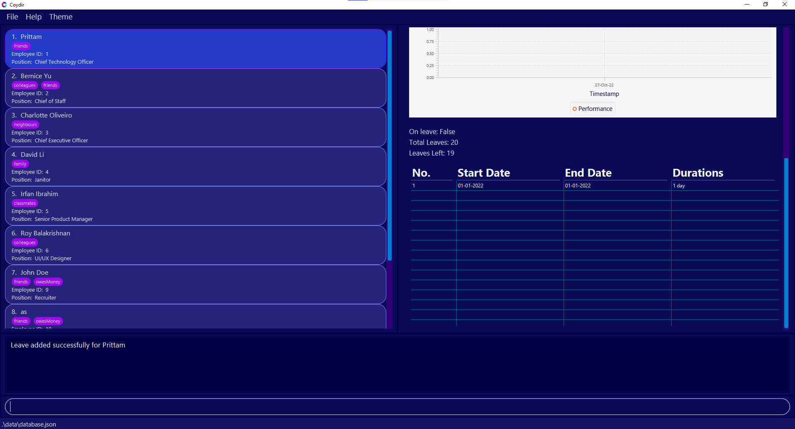
   <em>Result of adding leave successfully from example given</em>

#### Deleting a leave period for an employee: `delete-leave`

Added a wrong leave period or the employee wants to change their leave application? Fret not, `delete-leave` helps you to removes a leave period for an employee given the employee ID and index of leave in the table. The leave period deleted will then be removed from the leave table.

This command results in one of two cases below:

**Case 1: Valid ID and index of leave**

If the employee exists, the index given is valid, the leave period at that index of the list of leaves will be removed for the particular employee.

**Case 2: Invalid ID, or index**

If the employee ID, or the index is invalid, Coydir will prompt the users accordingly, and the command will not execute.

Format: `delete-leave id/ID i/INDEX`

| Field   | TAG | Description                       | Requirement    | Default Value |
| ------- | --- | --------------------------------- | -------------- | ------------- |
| `ID`    | id/ | Employee ID                       | **Compulsory** | N.A.          |
| `INDEX` | i/  | Index of leave in the leave table | **Compulsory** | N.A.          |

Example:

- `delete-leave id/1 i/1` deletes the first leave period for an employee of ID 1 in the table of leaves.

  
   <em>Result of deleting leave successfully from example given</em>

### Managing Employee Performance

Understanding the performance of your employees is crucial for _talent development_ in the company.

Key performance indicators, productivity, and progression policies may differ from company to company.
Here, Coydir offers a **simple yet powerful** way of keeping track of and making sense of your employees' performance in the company.

**:information_source: Note:** 5-point rating scale.  

The 5 point performance appraisal ratings system is the most commonly used performance rating scale across the world.
A 1 to 5 rating scale has a total of 5 categories with 2 negative and 2 positive options. A middle option is a neutral option for those who have met the expectations in terms of work performance. This rating scale is well-defined with a separate category for the employees who neither fall in the below expectations (requiring performance review) nor in the exceeds expectations categories.

#### Rating the performance of an employee: `rate`

Rate the performance of an employee given the employee ID and a numeric rating.
Ratings can take any values from 1 - 5, and it should not be blank.

The numeric representation of the ratings follows as such:
5: Outstanding | 4: Exceeds Expectations | 3: Satisfactory | 2: Needs Improvement | 1: Unsatisfactory

This command results in one of two cases below:

**Case 1: Valid ID and rating**

If the employee exists, and the rating given is valid (is a number from 1-5 inclusive), the performance rating will be added and the performance field of the employee will be updated accordingly.

**Case 2: Invalid ID or rating**

If the rating given for any employee is invalid (is not an integer from 1-5 inclusive), Coydir will prompt the users accordingly, and the command will not execute.

Format: `rate id/ID r/RATING`

| Field    | TAG | Description                    | Requirement    | Default Value |
| -------- | --- | ------------------------------ | -------------- | ------------- |
| `ID`     | id/ | Employee ID                    | **Compulsory** | -             |
| `RATING` | r/  | Performance rating of employee | **Compulsory** | -             |

Example:

- `rate id/1 r/3` adds a performance rating to an employee of ID 1 with a rating of 3: Satisfactory.

#### Employee Performance History

In each employee profile below their current performance rating field, there is a performance history line graph showing all their past `ratings` over time, marked by a `value` and `timestamp`. The line graph allows the user to appreciate the employee's performance trend, and make key decisions regarding talent development.

The individual rating values will be displayed beside each node in the performance rating graph. This makes it clearer for users to visualize an employee's overall performance at a glance.

**:information_source: Note:** You can only rate the performance of an employee once per day.  

- Rating an employee who already has a `Rating` with `timestamp` of that same day with the `rate` command will throw a `employee already rated` error.
- This is to prevent multiple ratings per day, and avoid a distorted performance history graph.

### Managing Departments

Apart from supporting the core HR functions, Coydir also supports _department-level management_, for other manpower staff and executives (_department heads, operations planning, etc._).

With these features, we offer a view that is broader than an individual employee profile and more specific than the full directory.

Complete with **real-time statistics and analytics**, Coydir makes department management much simpler. With these information, HR can easily observe the structure of a particular department, track the number of currently available employees for better tasks delegation, or even perform a department restructure to improve the overall efficiency of the company.

Currently, our application only provides a list of default departments for the user to choose from. Future update will include customizable department name. Our current list of valid departments are:

- Administration
- Board of Directors
- Customer Service
- Finance
- General Management
- Human Resources
- Information Technology
- Legal
- Marketing
- Operations
- Product Management
- Production
- Quality Assurance
- Research and Development
- Sales
- Technology

#### View details of a department: `view-department`

View the summarized details of a department given the name of the department.

Details include the number of employee in that particular department, employees who are currently available, employees who are currently on leave, and a table of employees in that department with their corresponding performance ratings and availability.

  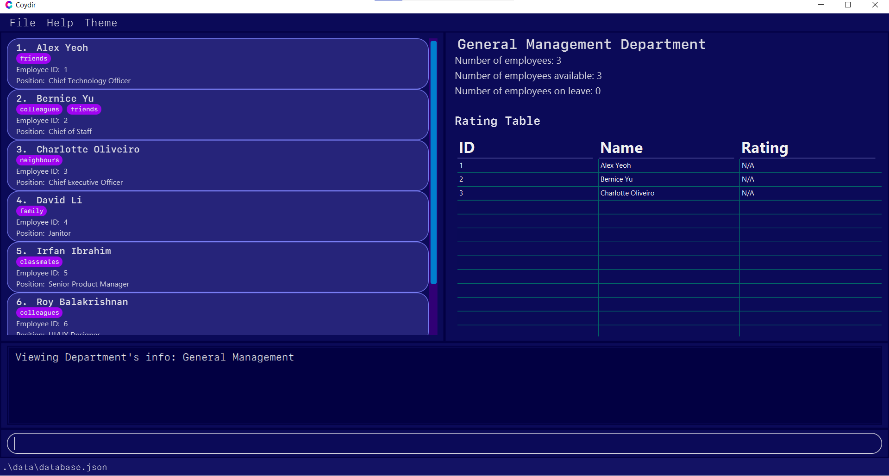</img>
   <em>Result of view-department on General Management</em>

Format: `view-department DEPARTMENT`

Example:

- `view-department Finance` displays a brief summary of the Finance department's details on the right panel.

This command results in one of the two cases below:

**Case 1: Valid department name**

If the department exists, the right panel will correctly displays the summary of the department.

**Case 2: Invalid department name**

If the department name is invalid, the program will notify you through the result box, with a list of valid department name for easier reference.

:bulb:
DEPARTMENT is case-insensitive.

### Additional Features

To wrap up, let us take a look at a couple of additional features that give _a little boost_ to your HR management on Coydir.
These features and techniques serve to make your usage of the application **smoother, easier, and more flexible**.

#### Getting help : `help`

If you have read the full User Guide up to this point, well done!
There can be a lot of information to take in, so if you ever _feel lost_ while using Coydir, getting help with the commands is just a simple step away.

Entering the `help` command will open up window with the command summary for the various functions of the application, and if you have more doubts, the _Help Window_ also contains a button to open up this User Guide in your browser.

Format: `help`

With this command, you should see a window like this appear.

**[Insert screenshot of updated Help Window]**

#### Exiting the program : `exit`

Exits the program.

Format: `exit`

#### Clearing the data : `clear`

Clears all the data currently stored in the database.

If you are a new user, you can use this command after you have experimented with Coydir  
to start keying in your actual employee information.

:exclamation: **Caution:**  
Once you run this command, you lose all data immediately.  

Format: `clear`

#### Saving the data

Coydir data are saved in the hard disk automatically after any command that changes the data. There is no need to save manually.

#### Editing the data file

Coydir data are saved as a JSON file `[JAR file location]/data/database.json`. Advanced users are welcome to update data directly by editing that data file.

:exclamation: **Caution:**
If your changes to the data file makes its format invalid, Coydir will discard all data and start with an empty data file at the next run.

---

## FAQ

**Q**: How do I transfer my data to another Computer? 
**A**: Install the app in the other computer and overwrite the empty data file it creates with the file that contains the data of your previous Coydir home folder.

**Q**: What is the difference between an INDEX and an ID? 
**A**: INDEX is the numbering of current showing list of employees, while ID represents the **unique** employee id of the employee.

**Q**: How do I change the rating of an employee? 
**A**: You can easily change the rating of an employee by using the `rate` command and adjust the RATING accordingly. Do note that it's impossible for you to change the past rating of an employee.

---

## Command summary

| Action              | Format, Examples                                                                                                                                                                     |
| ------------------- | ------------------------------------------------------------------------------------------------------------------------------------------------------------------------------------ |
| **Add**             | `add n/NAME j/POSITION d/DEPARTMENT p/PHONE e/EMAIL a/ADDRESS l/LEAVE [t/TAG]…​`   e.g. `add n/Betsy Crowe t/friend e/betsycrowe@example.com a/Newgate p/1234567 l/14 t/criminal` |
| **Edit**            | `edit INDEX [n/NAME] [p/PHONE] [e/EMAIL] [j/POSITION] [d/DEPARTMENT] [a/ADDRESS] [l/LEAVE] [t/TAG]…​`   e.g. `edit 1 p/91234567 t/friend e/newemail@example.com`                  |
| **Delete**          | `delete INDEX`  e.g. `delete 3`                                                                                                                                                   |
| **Batch Add**       | `batch-add FILENAME`   e.g. `batch-add newemployees.csv`                                                                                                                          |
| **View Details**    | `view INDEX`   e.g. `view 1`                                                                                                                                                      |
| **List**            | `list`                                                                                                                                                                               |
| **Find**            | `find [n/NAME] [j/POSITION] [d/DEPARTMENT]`  e.g. `find n/John j/engineer d/Tech`                                                                                                 |
| **Add leave**       | `add-leave id/ID sd/START_DATE ed/END_DATE`  e.g. `add-leave id/1 sd/01-01-2022 ed/02-01-2022`                                                                                    |
| **Delete leave**    | `delete-leave id/ID i/INDEX`  e.g. `delete-leave id/1 i/3`                                                                                                                        |
| **Rate**            | `rate id/ID r/RATING`  e.g. `rate id/1 r/3`                                                                                                                                       |
| **View Department** | `view-department DEPARTMENT`  e.g. `view-department Finance`                                                                                                                      |
| **Help**            | `help`                                                                                                                                                                               |
| **Exit**            | `exit`                                                                                                                                                                               |
| **Clear**           | `clear`                                                                                                                                                                              |
