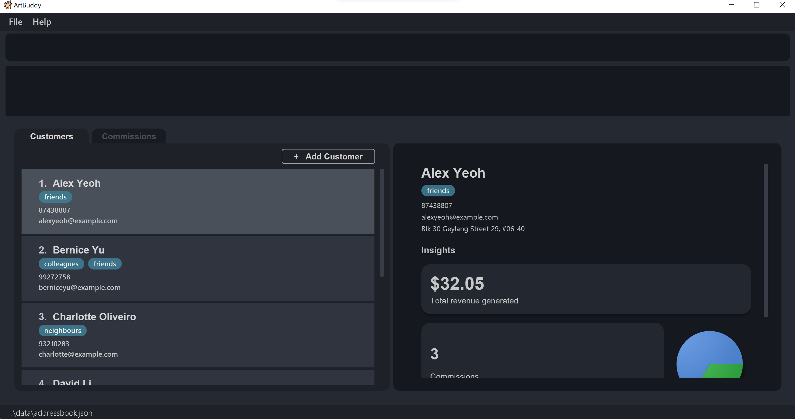
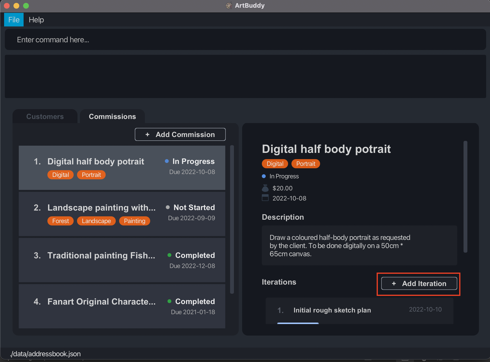
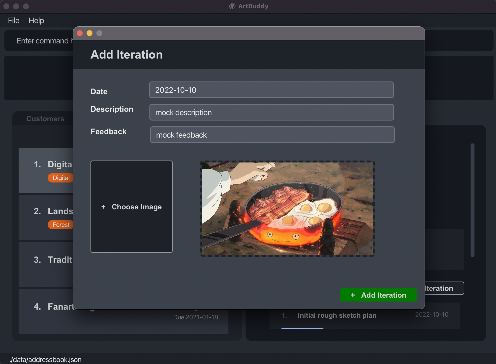

Ever forget a deadline? Or lost track of your customers? Many commission-based artists struggle to organise
their business. With so many things to keep track of, you might have found yourself wondering if there were a
better way to manage all of these.

That's why we built **ArtBuddy** (AB), a commission-based artist's best buddy, just for you. Developed with your
needs in mind, ArtBuddy is here to help you manage all your customers and commissions in one place. But that's
not all. With integrated support for tracking the progress of your commissions through iterations,
and generation of statistics, ArtBuddy is also here to help you grow as an artist.

So, focus on your art and leave the rest to ArtBuddy.

Eager to get started? You can refer to our [Quick Start](#quick-start) section to set ArtBuddy up, or
you can jump right into our [Features](#features) section to learn more about the features ArtBuddy offers.

--------------------------------------------------------------------------------------------------------------------
# Table of Contents

* Table of Contents
{:toc}

--------------------------------------------------------------------------------------------------------------------
# Using this guide

This guide walks you through all the features of ArtBuddy and can be used as a quick reference whenever you need any help.

If you are a new user, we welcome you to start from our [Introduction](#introduction) section to learn more about ArtBuddy.
To hop right into setting up ArtBuddy, you might find the [Quick Start](#quick-start) section helpful.  

If you just want to learn more about our features, you can check out our [Features](#features) section.
For ease of reference, the [Features](#features) section is divided into subsections corresponding to each main feature:
Customers, Commissions, Iterations and Statistics. Feel free to jump around as you explore ArtBuddy's amazing features!

You can also refer to our [Table of Contents](#table-of-contents) to navigate between the different sections of this guide.

### Conventions used in this guide

**Formatting conventions**  
As you read through this guide, you might come across text with special formatting. These specially formatted
text hold meaning, as described below. 

|                                    | Description                                                                                                                                                                                             |
|------------------------------------|---------------------------------------------------------------------------------------------------------------------------------------------------------------------------------------------------------|
| `code`                             | ArtBuddy commands appear in a monospaced font, with a grey background, as shown on the left. To learn more about ArtBuddy commands, refer to the [CLI section]().                                       |
| `CODE_UPPER_CASE`                  | Certain ArtBuddy commands contain words appear in upper case. These refer to [parameters]() (user input) to be supplied to ArtBuddy.                                                                    |
| <code><em>code_italics</em></code> | ArtBuddy commands may also contain words that appear in italics. These refer to example command [parameters](), which you can replace with your own inputs.                                             |
| [blue hyperlink]()                 | Hyperlinks appear in a blue font that is underlined when hovered over by your mouse. These hyperlinks bring you to another section of the user guide containing more relevant information to the topic. |
| **Bold Title Case**                | References to elements in ArtBuddy's [GUI]() (like buttons and text field labels) are formatted in **bold**, in Title Case.                                                                             |

**Call-out text box conventions**  
You might also notice call-out text boxes in this guide. These contain additional information tidbits that might be useful
for you.

:information_source: **Note:** Call-outs like this contain information that you should know about ArtBuddy!

:bulb: **Tip:** Call-outs like this contain tips that you might find useful when using ArtBuddy.

:exclamation: **Caution:** Call-outs like this contain warnings that we recommend you read through to avoid
any unexpected behaviour of ArtBuddy.

--------------------------------------------------------------------------------------------------------------------
# Introduction

Made for commission-based artists, ArtBuddy is the easiest way to organise your customers and commissions.
Powerful features and intuitive design, all packaged into one neat desktop app. ArtBuddy is supported on all
major operating systems (Windows, MacOS, Linux).

#### Let ArtBuddy help you...

1. **Manage your customers**  
ArtBuddy lets you store, edit and delete your customer's information. Consolidate all your customer's
contact details, so you never have to lose a contact again.
2. **Take charge of your commissions**  
Add commissions to a customer in ArtBuddy, just like in real life! ArtBuddy can store your
commission details, like fees, deadlines, and completion statuses. Easily update and delete
commissions as you wish.
3. **Keep track of your progress**  
ArtBuddy wants you help you hone your craft, and learning from yourself is a critical part of that.
With ArtBuddy, keep track of the progress of your commissions using iterations. Each iteration is simply 
a version of your artwork. Learn from feedback and your past work, so you can continuously improve your craft.
4. **Supercharge your business**  
Learn where your highest sales are coming from by leveraging on the powerful statistics ArtBuddy offers
so that you can accelerate your business growth.

#### Getting things done fast
We get that your time is precious. So spend it on what you love doing, your art, and let ArtBuddy handle the
rest. With optimised support for use via a Command Line Interface (CLI), ArtBuddy can help you manage your
small business at the speed of your fingertips.

Not sure what a CLI is? Don't worry! It's easy to pick up, you can even refer to our short introduction to
[ArtBuddy's CLI]() to learn more.

More of a visual person? Don't sweat it! Unlike many CLI applications, ArtBuddy still has a sleek, intuitive
[Graphical User Interface (GUI)](). This means that you can also interact with ArtBuddy using visual controls
like buttons and pop-ups. There's something for everyone!

--------------------------------------------------------------------------------------------------------------------
# Quick start

1. Ensure you have Java 11 or above installed in your Computer.

2. Download the latest `artbuddy.jar` from [here](https://github.com/AY2223S1-CS2103T-W11-3/tp/releases).

3. Copy the file to the folder you want to use as the _home folder_ for your ArtBuddy.

4. Double-click the file to start the app. You can start typing to input your commands. If you click away, you can click on the top box to start typing again.
5. The GUI should display a list of customers. This view will be referred to as Customer View.   
Note that the images are to help with interface only. The actual details of the data may differ in your application.
6. You can use the following commands in the Customer View:

   * <code>addcus n/<em>Betsy Crowe</em> e/<em>betsycrowe@example.com</em> p/<em>1234586</em></code> :  Creates a new customer named Betsy Crowe.
   * <code>delcus <em>2</em></code> :  Deletes the 2nd customer displayed on the list.
   * <code>opencus <em>2</em></code> : Selects the 2nd customer (Bernice Yu) on the list.

7. In the Commission View, the list of all commissions from the opened customer (Alex Yeoh) is displayed.   
8. You can use the following commands in the Commission View:
    * <code>addcom n/<em>Fate Archer</em> f/<em>60</em> d/<em>2022-10-15</em> s/<em>true</em> p/<em>Archery</em> t/<em>night</em> t/<em>city</em></code> : Creates a new commission titled "Fate Archer" under Meg.
    * <code>delcom <em>2</em></code> : Deletes the 2nd commission from Alex Yeoh on the list.
    * <code>opencom <em>1</em></code> : Opens the 1st commission titled "Alex Yeoh Commission 1" and updates the Commission Details View.
9. In the Commission Details View, the title, description, image thumbnails and deadline of the opened commission (Alex Yeoh Commission 1) is displayed.
10. You can use the following commands in the Commission Details View:
   * <code>additer d/<em>2022-10-11</em> n/<em>Add lighting</em> p/<em>/Users/Joseph/CSP/sunshine_highlight.png</em> f/<em>Warmer tone might be better</em></code> : Adds an iteration to the selected commission and attaches the image at the specified file path to the iteration.
11. Refer to the [Features](#features) below for details of each command.

--------------------------------------------------------------------------------------------------------------------

# Features

**:information_source: Notes about the command format:** 

* Words in `UPPER_CASE` are the parameters to be supplied by the user. 
  e.g. in `add n/NAME`, `NAME` is a parameter which can be used as <code>add n/<em>John Doe</em></code>.

* `INDEX` refers to the numbering shown on the list.  
  e.g. in `opencus INDEX`, `INDEX` refers to the numbering shown on the customers list.

* Anything with prefix `d/` such as `d/DATE` should be formatted in YYYY-MM-DD.  
  e.g. <code>d/<em>2022-10-04</em></code> is a valid input.

* Items in square brackets are optional. 
  e.g `n/NAME [t/TAG]` can be used as <code>n/<em>John Doe</em> t/<em>friend</em></code> or as <code>n/<em>John Doe</em></code>.

* Items with `...` after them can be used multiple times including zero times. 
  e.g. `[t/TAG]...` can be used as ` ` (i.e. 0 times), <code>t/<em>friend</em></code>, <code>t/<em>friend</em> t/<em>family</em></code> etc.

* Parameters can be in any order. 
  e.g. if the command specifies `n/NAME p/PHONE_NUMBER`, `p/PHONE_NUMBER n/NAME` is also acceptable.

* If a parameter is expected only once in the command, but you specified it multiple times, only the last occurrence of the parameter will be taken. 
  e.g. if you specify <code>p/<em>12341234</em> p/<em>56785678</em></code>, only <code>p/<em>56785678</em></code> will be taken.

* Extraneous parameters for commands that do not take in parameters (such as `help`, `list`, `exit` and `clear`) will be ignored. 
  e.g. if the command specifies <code>help <em>123</em></code>, it will be interpreted as `help`.

### Viewing help: `help`

Shows you a message explaining how to access the help page.

Format: `help`

## Customer related commands

A customer view is the first thing you see when you start up the application.
This will help you keep track of all the customers you currently have.

A customer will have the following details:
* Name
* Phone number
* Email
* Optional address
* Optional Tags

### Viewing a customer: `opencus`

Opens a customer at `INDEX` and shows customer details with various analytics you can use. The commissions tab will be updated to show the commissions made by the customer you selected. If no `INDEX` is provided, you will just switch to the customers tab.

Format: `opencus [INDEX]`

Examples:
* <code>opencus <em>2</em></code>
  Shows details about the customer and updates the commissions tab.

### Adding a customer: `addcus`

Adds a customer to ArtBuddy.

Format: `addcus n/NAME p/PHONE_NUMBER e/EMAIL [a/ADDRESS] [t/TAG]...​`

:bulb: **Tip:**
A customer can have any number of tags (including 0)

Examples:
* <code>addcus n/<em>John Doe</em> p/<em>98765432</em> e/<em>johnd@example.com</em> a/<em>John street, block 123, #01-01</em> t/<em>animal cartoons</em> t/<em>vip</em></code>
Creates the customer entry for John Doe with his details including multiple tags.
* <code>addcus n/<em>Betsy Crowe</em> e/<em>betsycrowe@example.com</em> p/<em>12345867</em></code>
Creates the customer entry for Betsy Crowe with her email and phone number.

### Editing a customer: `editcus`

Edits the details of the customer at `INDEX`.

Format: `editcus INDEX [n/NAME] [p/PHONE] [e/EMAIL] [a/ADDRESS] [t/TAG]...`
* At least one field to edit must be provided.

Examples:
* <code>editcus <em>1</em> p/<em>91234567</em> e/<em>johndoe@example.com</em></code> Edits the first customer's phone number and email.

### Deleting a customer: `delcus`

Deletes the customer at `INDEX` from the ArtBuddy.

Format: `delcus INDEX`

Examples:
* <code>delcus <em>2</em></code> Deletes the 2nd customer in the ArtBuddy and all commissions made by the customer.

## Commission related commands

A customer may ask for multiple commissions with different needs.
That is why we created the commission to help you keep track of all the commissions.

A commission will have the following details:
* Title
* Fee
* Deadline
* Status
* Optional Description
* Optional Tags

### Viewing a commission: `opencom`

Opens a commission at `INDEX` and shows its relevant details and image. If no `INDEX` is specified, you will just switch to the commissions tab.

Format: `opencom [INDEX]`

Examples:
* `opencom` Switches to commissions tab.

* <code>opencom <em>2</em></code> When you run an `opencom` command with index <code>opencom <em>2</em></code>, you should be switched to the commissions tab to view commission details.

### Adding a commission: `addcom`

Adds a commission to the currently opened customer.

Format: `addcom n/TITLE f/FEE d/DEADLINE s/STATUS [p/DESCRIPTION] [t/TAG]...​`
* Fee is the amount you are charging the customer for this commission.
* Status states if the commission is done or not and can only take `y`, `yes`, `t`, `true` for complete status and `n`, `no`, `f`, `false` for incomplete status. It is case-insensitive.

Examples:
* <code>addcom n/<em>Rimuru</em> f/<em>40</em> d/<em>2022-11-01</em> t/<em>traditional</em> s/<em>Y</em> t/<em>chibi</em></code> creates the commission entry titled "Rimuru" with the given fee, due date, completion status and tags.
* <code>addcom n/<em>Fate Archer</em> f/<em>60</em> d/<em>2022-10-15</em> s/<em>false</em> p/<em>Archery</em> t/<em>night</em> t/<em>city</em></code> creates a commission entry titled "Fate Archer" with the given fee, due date, completion status, description and tags.

### Editing a commission: `editcom`

Edits a commission at `INDEX`.

Format: `editcom INDEX [n/TITLE] [f/FEE] [d/DEADLINE] [s/COMPLETION STATUS] [p/DESCRIPTION] [t/TAG]`
* At least one field to edit must be provided.

Example:
* <code>editcom <em>1</em> n/<em>Tokyo Ghoul Kaneki</em> f/<em>50</em> d/<em>2022-10-10</em> s/<em>False</em> p/<em>Unfamiliar, I will need to do up a reference board first.</em> t/<em>digital</em> t/<em>neon</em></code>
  Edits the first commission to have the above fields.
* <code>editcom <em>2</em> s/<em>True</em></code> Edits the second commission to be completed.

### Deleting a commission: `delcom`

Deletes a commission at `INDEX` and iterations related to the commission.

Format: `delcom INDEX`

Example:
* <code>delcom <em>14</em></code>

## Iteration related commands

When working on a commission, you can expect to create multiple images to get feedback and update your commission.
The iteration is created to serve this purpose of keeping track of your progress in the commission.

An iteration will have the following details:
* Description
* Date
* Filepath for the image
* Feedback

### Adding iteration to a commission: `additer`
Just like the other add commands, adding iterations can be done either via the command-line, or
the graphical interface.

**Adding by the Command-Line Interface**

Format: `additer n/DESCRIPTION d/DATE p/FILEPATH f/FEEDBACK`

* The file path specified should be an absolute path from your root directory. If you're not familiar with file paths
and root directories, you might find the explanation [below](#filepath_explanation) helpful.
* The command requires a commission to be selected.
* The image name will assume the filename specified in the command.
* Currently, only image file types .png, .jpg, .bmp and .gif are supported

Example:
* <code>additer n/<em>First Draft</em> d/<em>2022-10-28</em> p/<em>/Users/John/Downloads/Draft 1.png</em> f/<em>Looks great</em></code> creates an iteration 
with the description "First Draft", date 28 October 2022, image at file path <code>p/<em>/Users/John/Downloads/Draft 1.png</em></code>, 
and feedback "Looks great".

 

What is a filepath and my root directory?

**:information_source: What is a filepath and my root directory?** 
Just like how we use addresses to tell specify locations when talking to people, computers
do the same! Each file in your computer has a unique address that can be used to identify the
exact location in your computer where the file is stored.
  
The address of each file in your computer can be viewed simply as "directions", guiding your
computer to get to the file. Think about how you would tell someone how to open a specific file
in your computer. You would probably say something along the lines of: "Go to the Downloads folder,
where you'll find an  Image folder. Click into the Images folder and open the file Draft1.png".
  
Well to computers, filepaths are just like these guiding instructions that help them locate
a specific file! And your 'root directory' is simply a 'base point' that stores all your files in
your computer. For most users using a Windows or Mac computer, this root directory is simply
a folder named `/`.
  
So what a file path `/Users/John/Downloads/Draft 1.png` really means is just a way of telling
the computer, "Hey, from my root directory, you'll find a folder called Users, and in there a
folder called John. Open that up and you'll find another folder called Downloads.
Open the Downloads folder and you'll see the file I want called `Draft 1.png`".
  
To easily copy a filepath of a file:

<ul>
<li>

On Windows, in your File Explorer, hold shift down while you right-click on the file you want. Select the option <code>Copy as Path</code> and the filepath of your file will be copied!

</li>
<li>

On Mac, in your Finder, click on the file you want to select it and press the <code>Option</code>, <code>Command</code>, <code>C</code> keys simultaneously. The filepath of your file is now copied!

</li>
</ul>

 

:exclamation: **Caution:**
Due to file path naming and the command format, specifying a folder with a folder name that ends with
a 'n', 'd', 'f', or 'p' would lead to an ambiguous command. For instance, the command
<code>additer d/<i>2022-10-10</i> n/<i>description</i> f/<i>actual feedback</i> p/<i>/test f/image.png</i></code> is ambiguous
because AB does know whether <code>f/<i>image.png</i></code> is the feedback parameter specified by the user.
  
If you wish to upload the image, either rename the folder name, or upload the image by the GUI.

 

**Adding by Graphical Interface**

Adding an iteration can also be done via the graphical interface by clicking on
the **Add Iteration** button inside the Commission you wish to add the iteration to.

A new window will then pop up, where you will be prompted to fill in the details of
the new iteration. An image can be added to the iteration by selecting a file in
your file manager by clicking on the **Add Image** button, or by dragging and dropping
an image to the grey image drop area.

  

**:information_source: Notes about images in ArtBuddy:** 

ArtBuddy creates a copy of each file you upload. This means that you can edit, delete, or
move your original copy of the file without affecting the uploaded image on ArtBuddy.

### Editing iteration from commission: `edititer`
Edits an iteration at `INDEX` in a commission.

Format: `edititer INDEX [n/DESCRIPTION] [d/DATE] [p/FILEPATH] [f/FEEDBACK]`
* The command requires a commission to be selected.
* At least one field to edit must be provided.

Example:
* <code>edititer <em>1</em> n/<em>Colourised image</em> d/<em>2022-10-12</em> f/<em>Good improvement</em> p/<em>/Users/John/Downloads/Updated Image.png</em></code>
  Edits the first iteration in the currently selected commission to have the above fields and image.
* <code>edititer <em>2</em> n/<em>Sketch</em></code> Edits the description of the second iteration in the currently selected commission.

### Deleting iteration from commission: `deliter`
Deletes an iteration at `INDEX` from a commission.

Format: `deliter INDEX`
* The command requires a commission to be selected.
* You may want to note that your local copy of the image will not be deleted.

## Statistical commands

To make the best out of your business, we have integrated statistical commands for you to filter, sort and find out which customers are your favorite.

### List all the customers: `list`
Lists all the customers

Format: `list`

### Find a customer: `find`
Finds all the customers who satisfy keyword matching in the name and tag filters. The tag filter more specifically will include customers who contain all tags under `-all` and at least one of the tags under `-any`.

Format: `find [k/KEYWORDS]... -all [t/TAGS]... -any [t/TAGS]...`
* The keywords, all, and any filters are all optional and can be omitted, but at least one should exist.

Examples:
* <code>find k/<em>Kevin</em></code> Finds customers who have the name Kevin.
* <code>find -all t/<em>friend</em> t/<em>colleague</em></code> Finds customers who are tagged both `friend` and `colleague`.
* <code>find -any t/<em>friend</em> t/<em>colleague</em></code> Finds customers who are either tagged `friend` or `colleague`.

### Sorting the customer list: `sortcus`

Sorts the displayed customer list by one of the following options:

Prefix:
- `n` (name)
- `d` (latest commission date)
- `c` (commission count)
- `r` (revenue)
- `a` (active commissions count)

Suffix: `+` (increasing) or `-` (decreasing)

Format: `sortcus PREFIX/SUFFIX`

Examples:
* `sortcus n/+` Sorts the customer list from A to Z.

### List the commissions: `listcom`
Lists all the commissions made by selected customer.

Format: `listcom`

### Viewing all commissions: `allcom`

Displays all commissions across all customers in ArtBuddy.

Format: `allcom`

After running `allcom`, you should be switched to the commissions tab to view all commissions.
To view the commissions for a specific customer, return to the customer list ([`opencus`](#viewing-a-customer-opencus)) and select the customer from the list ([`opencus INDEX`](#viewing-a-customer-opencus)).

### Find a commission: `findcom`
Finds all the commissions in the list which satisfy keyword matching in the title and tag filters. The tag filter more specifically will include commissions which contain all tags under `-all` and at least one of the tags under `-any`.

Format: `findcom [k/KEYWORDS]... -all [t/TAGS]... -any [t/TAGS]...`
* The keywords, all, and any filters are all optional and can be omitted, but at least one should exist.

Examples:
* <code>findcom k/<em>Tree Painting</em></code> Finds commissions which have the title `Tree Painting`.
* <code>find -all t/<em>oil painting</em> t/<em>canvas</em></code> Finds commissions which are tagged both `oil painting` and `canvas`.
* <code>find -any t/<em>oil painting</em> t/<em>canvas</em></code> Finds commissions who are either tagged `oil painting` or `canvas`.

## Miscellaneous
 
### Clearing all the customers: `clear`
Clears all your customers from ArtBuddy, including their commissions and iterations.

:exclamation: **Caution:**
This command cannot be undone. So only execute this command when you are 100% sure of executing it.

### Exiting the program: `exit`

Exits the program.

Format: `exit`

### Saving the data

ArtBuddy data are saved in the hard disk automatically after any command that changes the data. There is no need to save manually.

### Editing the data file

ArtBuddy data are saved as a JSON file `[JAR file location]/data/artbuddy.json`. Advanced users are welcome to update data directly by editing that data file.

:exclamation: **Caution:**
If your changes to the data file makes its format invalid, ArtBuddy will discard all data and start with an empty data file at the next run.

--------------------------------------------------------------------------------------------------------------------

# FAQ

**Q**: How do I transfer my data to another Computer? 
**A**: Install the app in the other computer and overwrite the empty data file it creates with the file that contains the data of your previous ArtBuddy home folder.

--------------------------------------------------------------------------------------------------------------------

# Command summary

| Action                   | Format, Examples                                                                                                                                                                                                                                                                                                                      |
|--------------------------|---------------------------------------------------------------------------------------------------------------------------------------------------------------------------------------------------------------------------------------------------------------------------------------------------------------------------------------|
| **Help**                 | `help`                                                                                                                                                                                                                                                                                                                                |
| **Open customer**        | `opencus INDEX`  e.g., <code>opencus <em>2</em></code>                                                                                                                                                                                                                                                                             |
| **Add customer**         | `addcus n/NAME p/PHONE_NUMBER e/EMAIL [a/ADDRESS] [t/TAG]...`    e.g., <code>addcus n/<em>John Doe</em> p/<em>98765432</em> e/<em>johnd@example.com</em> a/<em>John street, block 123, #01-01</em> t/<em>animal cartoons</em></code>                                                                                               |
| **Edit customer**        | `editcus INDEX [n/NAME] [p/PHONE] [e/EMAIL] [a/ADDRESS] [t/TAG]...`   e.g., <code>editcus <em>1</em> p/<em>91234567</em> e/<em>johndoe@example.com</em></code>                                                                                                                                                                     |
| **Delete customer**      | `delcus INDEX`  e.g., <code>delcus <em>14</em></code>                                                                                                                                                                                                                                                                              |
| **Open Commission**      | `opencom INDEX`  e.g., <code>opencom <em>14</em></code>                                                                                                                                                                                                                                                                            |
| **Add commission**       | `addcom n/TITLE f/FEE d/DEADLINE [t/TAG]...`  e.g., <code>addcom n/<em>Rimuru</em> f/<em>40</em> d/<em>2022-11-01</em> t/<em>traditional</em> t/<em>chibi</em></code>                                                                                                                                                              |
| **Edit commission**      | `editcom INDEX [n/TITLE] [f/FEE] [d/DEADLINE] [s/COMPLETION STATUS] [p/DESCRIPTION] [t/TAG]...`   e.g., <code>editcom <em>1</em> n/<em>Tokyo Ghoul Kaneki</em> f/<em>50</em> d/<em>2022-10-10</em> s/<em>False</em> p/<em>Unfamiliar, I will need to do up a reference board first.</em> t/<em>digital</em> t/<em>neon</em></code> |
| **Delete Commission**    | `delcom INDEX`  e.g., <code>delcom <em>14</em></code>                                                                                                                                                                                                                                                                              |
| **Add Iteration**        | `additer n/DESCRIPTION d/DATE f/FEEDBACK p/FILEPATH`  e.g., <code>additer n/<em>Draft 1</em> f/<em>Good</em> d/<em>2022-10-28</em> p/<em>/Users/John/Downloads/Bread.jpeg</em></code>                                                                                                                                              |
| **Edit Iteration**       | `edititer INDEX [n/DESCRIPTION] [d/DATE] [f/FEEDBACK] [p/FILEPATH]`  e.g, <code>edititer <em>2</em> n/<em>Sketch</em></code>                                                                                                                                                                                                       |
| **Delete Iteration**     | `deliter INDEX`  e.g., <code>deliter <em>1</em></code>                                                                                                                                                                                                                                                                             |
| **List customers**       | `list`                                                                                                                                                                                                                                                                                                                                |
| **Find customers**       | `find [k/KEYWORD]... -all [t/TAG]... -any [t/TAG]...`   e.g. <code>find -all t/<em>friend</em> t/<em>colleague</em></code>                                                                                                                                                                                                         |
| **Sort customers**       | `sortcus PREFIX/SUFFIX`  e.g., <code>sortcus n/<em>+</em></code>                                                                                                                                                                                                                                                                   |
| **List commissions**     | `listcom`                                                                                                                                                                                                                                                                                                                             |
| **View all Commissions** | `allcom`                                                                                                                                                                                                                                                                                                                              |
| **Find commissions**     | `findcom [k/KEYWORD]... -all [t/TAG]... -any [t/TAG]...`                                                                                                                                                                                                                                                                              |
| **Clear everything**     | `clear`                                                                                                                                                                                                                                                                                                                               |
| **Exit**                 | `exit`                                                                                                                                                                                                                                                                                                                                |
