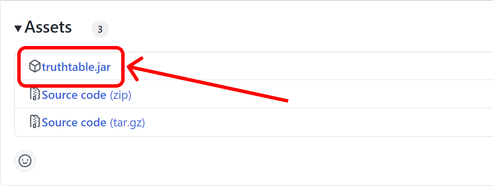
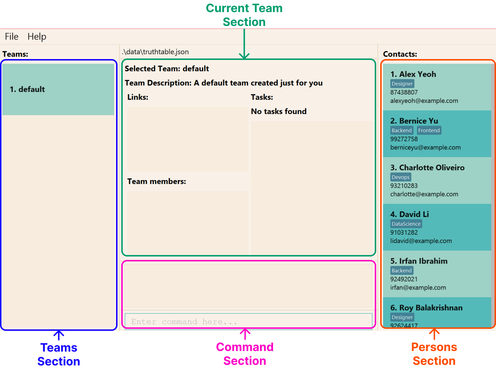
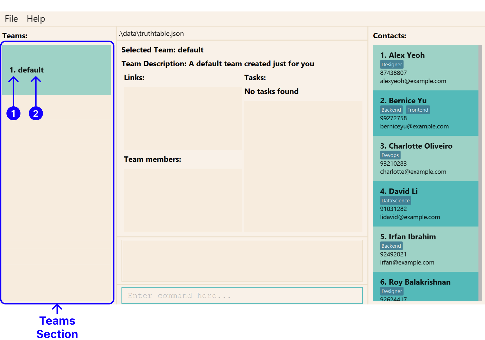
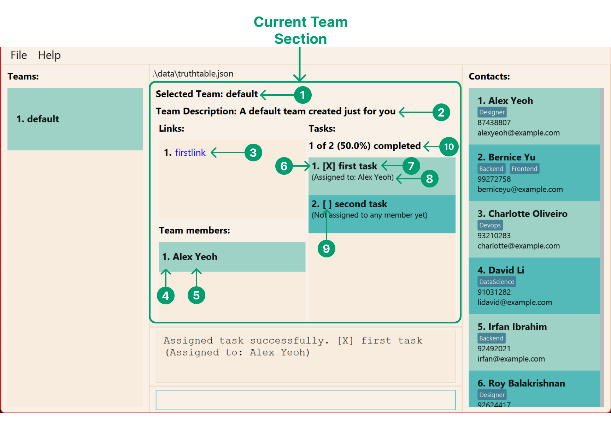
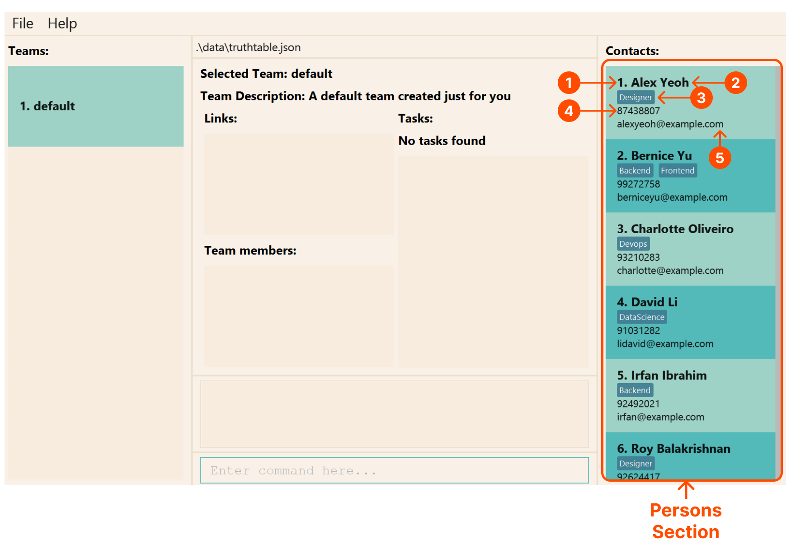
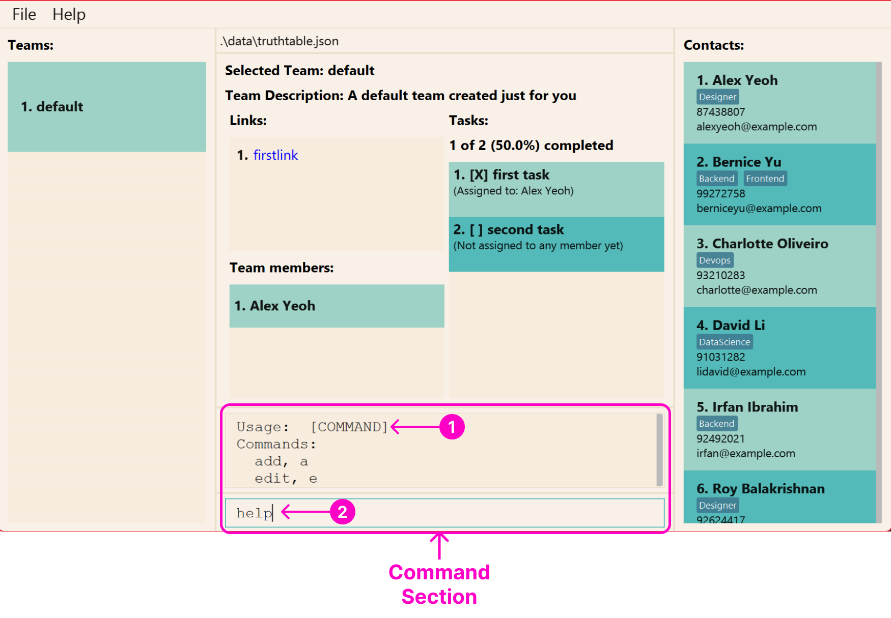
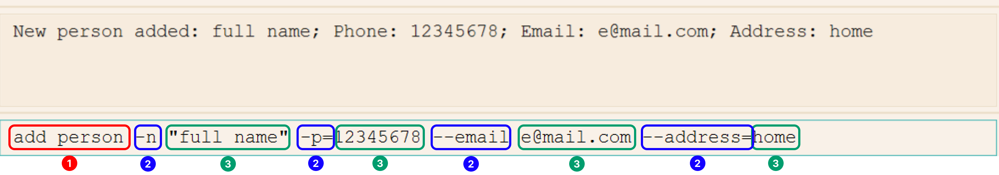
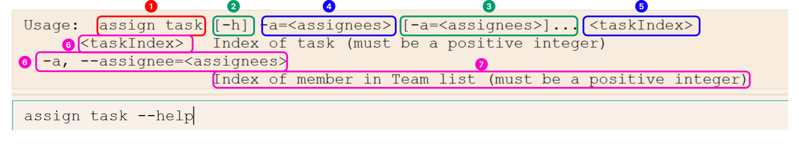

This document contains everything you need to know about TruthTable.

## About TruthTable

TruthTable is a **desktop application** that enables team leaders to **manage their software
engineering teams** in one application.

TruthTable is **optimised for use via a Command Line Interface (CLI)** while still having the benefits of a
Graphical User Interface (GUI). 

**Unsure what CLI means?**
Head over [to this section](#understanding-truthtables-cli) to learn more

If you can type fast, TruthTable can get your task management done _blazingly fast_, faster than traditional GUI
applications.

Click [here](#getting-started) to get started with TruthTable.

## Key Features of TruthTable

### Too many cooks spoil the Truth

Managing project documents and information has always been an annoying task to do. Besides the multitude of
links and slides created by the team, you may be using task management applications to track your team's
progress as well. This is where TruthTable comes in.

TruthTable allows you to **collate and organise all your tasks**, links, and member information all in one spot.

### Seeing is believing

It is often difficult to visualise and communicate your team's progress to stakeholders. TruthTable solves this
through its ergonomic user interface.

At a glance, you can see the number of tasks completed by your team, and **determine the team's overall progress**.

TruthTable allows you to see which members are assigned to the tasks, enabling you to **delegate work in a fair and
equitable manner**.

### Built for convenience and speed

Context switching is a productivity killer. Having to switch from project management to product development usually
means switching from GUI-based applications to CLI code editors.

Hence, TruthTable allows you to use a **CLI for all your project management needs**, reducing the impact of context
switching.

## Using This Guide

If you are a software engineering team leader looking to get started with TruthTable, make sure that you have the 
[pre-requisites installed](#getting-started).

[//]: # (TODO: link to team migration/onboarding section)
This document will also guide you on how to migrate your existing project information onto TruthTable, and 
familiarise you with all of TruthTable's [features](#key-features-of-truthtable). 

If you are an experienced user of TruthTable, this guide also contains valuable tips on how you can maximise your 
productivity while using TruthTable.

Here are the symbols and text styles to look out for while using this guide:

| Symbol               | Meaning                                          |
|----------------------|--------------------------------------------------|
| :information_source: | Important information for all users to take note |
| :bulb:               | Tip for all users                                |
| :star:               | Tip for advanced users                           |
| :exclamation:        | Critical information to be wary of               |

| Text Style                 | Meaning                                              |
|----------------------------|------------------------------------------------------|
| [Glossary link](#glossary) | Clickable link to navigate to a section in the guide |
| `text with background`     | Text relevant to the commands or name of a file      |
| <kbd>Esc</kbd>             | Keyboard button                                      |

Throughout the guide, there will also be alerts that look the following.

**Miscellaneous alert**:
This alert contains miscellaneous information

**Helpful alert**:
This alert contains helpful information

**Warning alert**:
This alert contains important information to be wary of.

## Table of Contents

* Table of Contents
{:toc}

--------------------------------------------------------------------------------------------------------------------

## Getting Started

1. Ensure you have **Java 11** or above installed in your computer. If not, don't worry! Click
   [here](https://docs.oracle.com/en/java/javase/11/install/overview-jdk-installation.html) for further instructions on
   how to download and install **Java 11**.

2. Download the latest version of `truthtable.jar` from [here](https://github.com/AY2223S1-CS2103T-W13-4/tp/releases).
The file can be located under the "Assets" section of the page as seen in the image below.

3. Double-click on `truthtable.jar` to start the application. A window which looks similar to the screenshot below 
   should 
appear in a few seconds. We have also added some sample data for you to play around and familiarise yourself with 
   TruthTable's [features](#commands)! 

4. Before we dive into TruthTable's features, make sure you understand how to [navigate the application](#navigating-truthtables-application-interface) first.

[Back to Table of Contents](#table-of-contents)

---

## Navigating TruthTable's Application Interface

After opening TruthTable for the first time, you should see the following screen.

Each section contains several components, which will be labelled in their respective sections below. These 
components are numbered, and their names and descriptions will be displayed in a tabular format.

### Teams Section

[//]: # (TODO: reference to team explanation / why at least 1 will always appear)
This section displays all the teams that you have created in TruthTable. Only the names of each team is listed.  

| Number | Component | Description                                    |
|--------|-----------|:-----------------------------------------------|
| 1      | Index     | The index of the team in the list of all teams |  
| 2      | Name      | The name of the team at the specified index    |

### Current Team Section

This section contains information about your current team. It displays the currently selected team, team description, 
links, tasks, and members related to said team.

| Number | Component                 | Description                                                                                                   |
|--------|---------------------------|:--------------------------------------------------------------------------------------------------------------|
| 1      | Selected Team Name        | The name of the team currently being selected                                                                 |  
| 2      | Selected Team Description | The description of the team at the specified index                                                            |
| 3      | Link Name                 | The name of a link related to the selected team                                                               |
| 4      | Member Index              | The index of a member in the team's list of members                                                           |
| 5      | Member Name               | The name of a member at the specified member index                                                            |
| 6      | Task Index                | The index of a task in the team's list of tasks                                                               |
| 7      | Task Name                 | The name of a task at the specified task index                                                                |
| 8      | Task Assignee             | The name of the member assigned to the task                                                                   |
| 9      | Task Completion Status    | The completion status of a task, `[X]` is displayed if task is completed, else `[ ]` is displayed             |
| 10     | Task Completion Rate      | The number of tasks completed is displayed, along with its relative  percentage to total number of tasks. |

### Persons Section

This section displays the names, phone number, email, address, and tags of all persons that you have created in 
TruthTable. This section is also known as the "Contacts" section.

| Number | Component    | Description                                            |
|--------|--------------|--------------------------------------------------------|
| 1      | Index        | The index of a person in all the persons in TruthTable |
| 2      | Name         | The name of a person at a specific index               |
| 3      | Tags         | The tags associated with a person                      |
| 4      | Phone Number | The phone number of a person                           |
| 5      | Email        | The email address of a person                          |
| 6      | Address      | The address of a person                                |

### Command Section

This section contains an input box where you can enter the commands for the actions that you wish to perform. Try 
typing `help` in the input box and press <kbd>Enter</kbd> to see what happens!

| Number | Component         | Description                                                                                       |
|--------|-------------------|---------------------------------------------------------------------------------------------------|
| 1      | Command Result    | The result of executing a command in the Command Input Box                                        |
| 2      | Command Input Box | The input box for commands to be entered, which can be executed by pressing  <kbd>Enter</kbd> |

[Back to Table of Contents](#table-of-contents)

---

## Understanding TruthTable's CLI

CLI applications like TruthTable requires you to execute instructions by typing specific words to make use of the 
application's features. However, if you are not an experienced user, terms like "commands", "flags", and "parameters" 
may seem daunting.

But fret not! This section will cover what all these terms actually mean. 

While you're going through this section, don't worry too much about memorising the details for every "command", as  
they all have their own help messages for your reference at any time. Furthermore, the "commands" in TruthTable are 
designed to be **easy to remember** and **natural**, so you will get up to speed in no 
time! 

### Commands, flags, and parameters

All instructions are executed through **commands**. Each command can have **flags specified after the command**, 
which modifies how the instruction should be carried out.

For each of these flags, there may be **parameters** specified after it. But, not all commands
require flags to **appear before parameters**.

Note that flags and parameters always **come after the command**.

Let's use an example to break down what each term means.

#### Example Command - `add person`

Here's a summary of what each highlighted section represents.

| Number | Name               | Meaning                                                                                 |
|--------|--------------------|:----------------------------------------------------------------------------------------|
| 1      | Command            | The name of an instruction                                                              |
| 2      | Flag/Option        | Text that is used to modify the operation of a command, often starting with `-` or `--` |
| 3      | Parameter/Argument | Information specified for a command to operate, often used after flags                  |

**:information_source: Important note for flags**

Specifying an "equal" sign (`=`) after the flag is optional, and it has no effect on the command.

**:information_source: Important note for parameters**

Use of quotation marks around parameters (`""`) is optional. 

**However**, if you are specifying a parameter
with multiple words, you will need to wrap the words in a quotes. Otherwise, TruthTable will not carry out the
command properly.

For instance, 
- `add person -n "full name" ...` will recognise "full name" as the name being specified for the new person
- `add person -n full name ...` will recognise "full" as the name being specified for the new person, however, this 
  command will not execute successfully as `name` will be treated as a **flag** (and this flag does not exist for 
  the `add person` command)

### Understanding the help message

Every command in TruthTable has their own flags and parameters, but it is not feasible for you to remember them all. 

To address this, each command allows you to specify the `-h` and `--help` flag, which brings up the available flags 
and parameters for the command. Alternatively, you can also refer to this user guide to find out the specifications for 
any command.

#### Example Command Help Message - `add person --help`

Here's a summary of what each highlighted section represents.

| Number | Name                            | Special Syntax       | Remarks                                                                        |
|--------|---------------------------------|----------------------|:-------------------------------------------------------------------------------|
| 1      | Command                         | -                    | Strictly alphabets only (all commands can be found [here](#command-summary))   |
| 2      | Optional Flag with no Parameter | `[-flag]`            | -                                                                              |
| 3      | Optional Flag with Parameters   | `[-flag=parameters]` | An ellipsis `...` is present only if more than 1 parameter is **allowed**      |
| 4      | Required Flag with Parameters   | `flag=parameters`    | An ellipsis `...` is present only if more than 1 parameter is **required**     |
| 5      | Required Parameter              | `<parameter>`        | All parameters are required by default                                         |
| 6      | Flag/Parameter Name and Alias   | -                    | All aliases of a flag/parameter will be listed and separated with commas (`,`) |
| 7      | Flag/Parameter Description      | -                    | Brief description of flag/parameter                                            |

**:bulb: Flags with multiple parameters**

If a flag is displayed with `...` behind it, this means that the flag takes in an unlimited amount of parameters.

For instance, in the `assign task` command, we can specify an unlimited number of assignees (provided they are valid).
A valid command is `assign task 1 -a 1 2 3` where `1 2 3` are recognised as the assignees to the task with index `1`.

**:star: POSIX clustered short options**: TruthTable supports clustered options as specified 
[here](https://pubs.opengroup.org/onlinepubs/9699919799/basedefs/V1_chap12.html#tag_12_02)

[Back to Table of Contents](#table-of-contents)

---

## Migrating to TruthTable

If you're looking to migrate your team information onto TruthTable, here is a step-by-step guide on how to do so.

### Creating the team

### Adding your members

### Adding your links

### Adding your tasks

### Delegating work

### Visualising progress

[Back to Table of Contents](#table-of-contents)

---
## Commands

**:information_source: Make sure you have read 
[this section](#understanding-truthtables-cli) before continuing!**

**For experienced command line users**

You will find that the syntax is very similar to other command line interfaces like `git` and `docker`!

### Commands to Manage Persons

#### Creating a new person `add person`

Adds a person to TruthTable.

Format: `add person -n NAME -p PHONE_NUMBER -e EMAIL -a ADDRESS [-t TAG]`

:bulb: **Tip:**
A person can have any number of tags (including 0)

Examples:
* `add person -n "John Doe" -p 98765432 -e johnd@example.com -a "John street, block 123, #01-01"`
* `add person -n "Betsy Crowe" -e betsycrowe@example.com -a "Newgate Prison" -p 1234567 -t criminal friend`

#### Listing all persons : `list persons`

Shows a list of all persons in TruthTable.

Format: `list persons`

#### Editing a person : `edit person`

Edits an existing person in TruthTable.

Format: `edit person PERSON_INDEX [-n NAME] [-p PHONE] [-e EMAIL] [-a ADDRESS] [-t TAG]`

* Edits the person at the specified `PERSON_INDEX`. The index refers to the index number shown in the displayed person 
  list. The index **must be a positive integer** 1, 2, 3,...
* At least one of the optional fields must be provided.
* Existing values will be updated to the input values.
* When editing tags, the existing tags of the person will be removed i.e. adding of tags is not cumulative.
* You can remove all the person’s tags by typing `-t` without
  specifying any tags after it.

Examples:
*  `edit person 1 -p 91234567 -e johndoe@example.com` Edits the phone number and email address of the 1st person to be 
   `91234567` and `johndoe@example.com` respectively.
*  `edit person 2 -n Betsy Crower -t` Edits the name of the 2nd person to be `Betsy Crower` and clears all existing 
   tags.

#### Locating persons by name: `find person`

Finds person whose names contain any of the given keywords.

Format: `find person KEYWORD [MORE_KEYWORDS]`

* The search is case-insensitive. e.g. `hans` will match `Hans`
* The order of the keywords does not matter. e.g. `Hans Bo` will match `Bo Hans`
* Only the name is searched.
* Only full words will be matched e.g. `Han` will not match `Hans`
* Persons matching at least one keyword will be returned (e.g. `Hans Bo` will return `Hans Gruber`, `Bo Yang`)

Examples:
* `find person John` returns `john` and `John Doe`
* `find person alex david` returns `Alex Yeoh`, `David Li` 
  

#### Deleting a person : `delete person`

Deletes the specified person from TruthTable.

Format: `delete person PERSON_INDEX`

* Deletes the person at the specified `PERSON_INDEX`.
* The index refers to the index number shown in the displayed person list.
* The index **must be a positive integer** 1, 2, 3,...

Examples:
* `list persons` followed by `delete person 2` deletes the 2nd person in the address book.
* `find person Betsy` followed by `delete person 1` deletes the 1st person in the results of the `find person` command.

### Commands to Manage Teams

#### Creating a new team `add team`

Add a new team to your list of teams. Will show an error there is already an existing team with the same name. 

:information_source: **Note:** Team name must consist only of alphanumeric characters (i.e., **Spaces are NOT allowed**).

Format: `add team TEAM_NAME [-d TEAM_DESCRIPTION]`

Examples:

- `add team CS2103` will create a new team by the name of "CS2103"
- `add team CS2102 -d "Database Systems"` will create a new team by the name of "CS2102" and "Database Systems"
  as description

#### Set a new team `set team`

Sets the application to an existing team, i.e., changes the current "working" team to another. Will throw an error if the team does not exist

Format: `set team TEAM_NAME`

Examples:

- `set team CS2103` will change the current working team to be the "CS2103" team.

#### Edit current team `edit team`

Format: `edit team [-n TEAM_NAME] [-d TEAM_DESCRIPTION]`

Examples:
- `edit team -n CS2103 -d "Software Engineering"` will edit the name of the current team to CS2103 and description
  to "Software Engineering"

#### Delete an existing team `delete team`

Delete an existing team from the user's list of teams. Throws an error under these conditions.

- The target team does not exist.
- The target team is the only existing team.

Format: `delete team TEAM_NAME`

Examples:

- `delete team CS2103` will delete the team with the name "CS2103"

### Commands to Manage Members

#### Adding a new member to the team `add member`

Add a new team member to the user’s currently selected team. Will throw an error if the member already exists in the team.

Format: `add member MEMBER_INDEX`

Examples:

- `add member 1` will add the first person in the list of people as a member of the current team.

#### Delete a member from team `delete member`

Delete a team member from the user’s team.

Format: `delete member TEAM_MEMBER_INDEX`

Examples:

- `delete member 2` will delete the second member of the current team.

#### Find members : `find member`

Finds all members in the current team whose names or emails contain any of the given keywords.

:information_source: **Note:** You can only find members using **either** emails or names. This means that you 
should not use both `-n` and `-e` in the `find member` command. 

Format:`find member [-n MEMBER_NAME] [-e MEMBER_EMAIL]`

* The search is case-insensitive. e.g. `hans` will match `Hans`
* The order of the keywords does not matter. e.g. `Hans Bo` will match `Bo Hans`
* Only the name or email is searched.
* Only full words will be matched e.g. `marcus` will not match `marcus@gmail.com`
* Persons matching at least one keyword will be returned (e.g. `Hans Bo` will return `Hans Gruber`, `Bo Yang`)

Examples
* `find member -n Alex` finds team members with **names** containing the word "Alex".
* `find member -n Alex Beatrice` finds team members with **names** containing **either** "Alex" or "Beatrice".
* `find member -e alex@gmail.com`  finds team members with **emails** containing "alex@gmail.com".

#### Listing all members of the team : `list members`

View all the members currently in the team, in the form of a list.

Format: `list members`

#### Sort members : `sort members`
Sorts all members in the current team by name and displays them in the member list.

Format: `sort members ORDER`

Examples
* `sort members asc` sorts your team members in **alphabetical** order (as per their names).
* `sort members dsc` sorts the team members in **reverse alphabetical** order (as per their names).
* `sort members res` **resets** the order of the team members shown.

### Commands to Manage Tasks

#### Add task to team : `add task`

Add a new task to your current team. The task name is compulsory, while other fields such as assignee index and
deadline are optional.

Multiple assignees can be assigned to the same task directly, by specifying the indices of each assignee in the member list, separated by spaces.
e.g. `add task "Merge PR" -a 1 3 4` will assign members 1, 3 and 4 to the task "Merge PR".

Format: `add task "TASK_NAME" [-a ASSIGNEE_INDEX] [-d DEADLINE]`

Examples:

* `add task "Merge PR" -a 1 -d 2022-12-02 23:59` will add a task with the name "Merge PR", assign the task to the
first member in the team list and set the deadline "02-Dec-2022 23:59", to the current team's task list.
* `add task "Review PR" -a 1 3 -d 2022-12-02 23:59` will add a task to the current team's
task list, with the name "Review PR", assign the task
to the first and third member in your team list and set the deadline of the task to be 02-Dec-2022 23:59.

#### Edit task in team : `edit task`

Edits a specified task in the current team. The task index is compulsory, while the other fields are optional and
will be overwritten accordingly.

Multiple assignees can be assigned at one time, by specifying the indices of each of the members, separated by spaces.
e.g. `edit task 1 -a 1 3 4` will assign members 1, 3 and 4.

Format: `edit task TASK_INDEX -n "TASK_NAME" [-a ASSIGNEE_INDEX] [-d DEADLINE]`

Examples:

* `edit task 1 "Merge PR" -a 1 -d 2022-12-02 23:59` will edit the first task in the current team's task
list, setting the name as "Merge PR", setting the assignee as the first member in the team list and deadline
as "02-Dec-2022 23:59".
* `edit task 1 "Update UG" -d 2022-12-02 23:59` will edit the first task in the current team's task
list, setting the name as "Update UG" and changing the deadline as "02-Dec-2022 23:59". The assignees are not changed
in this case.

#### Assign task to team member: `assign task`

Assign an existing task to a team member in the user’s team. Will display an error message if either the team member or
the task is not found in the user’s team.

Format: `assign task TASK_INDEX -a MEMBER_INDEX`

Examples:

- `assign task 1 -a 1` will assign the first task on the task list to the first member in the team.
- `assign task 2 -a 2` will assign the second task on the task list to the second member in the team.

#### Assign task to random team member: `assign random`

Assign an existing task to a random team member in the user’s team. Will display an error message if either the task is
not found in the user’s team or if there are no team members to assign the task to (if the team is empty,
or if the task has already been assigned to all members of the team.

Format: `assign random TASK_INDEX`

Examples:

- `assign random 1` will assign the first task on the task list to a random team member.

#### Set Deadline for task: `set deadline`

Set a deadline for an existing task. Will display an error message if task is not found in the user’s team.
If a deadline has been set for the task before, a new deadline will be set if command is run again.
The deadline must be specified in `YYYY-MM-DD HH:MM` format.

Format: `set deadline TASK_INDEX DEADLINE`

Examples:

- `set deadline 1 2023-12-25 23:59` will set the deadline for the first task on the task list as 25 December 2023
11.59pm.

#### Delete task from team : `delete task`

Delete an existing task from the team given the task's index. Will display an error message if the task is not found in
the user’s team, i.e., when the index exceeds the number of tasks.

Format: `delete task TASK_INDEX`

Examples:

- `delete task 1` will delete the first task of the current team.

#### Mark tasks as done: `mark`

Mark a specified task as done. To undo this command, see the `unmark` command below.

Format: `mark TASK_INDEX`

Examples:

- `mark 1` will mark the first task in the team as done.

#### Unmark tasks as done: `unmark`

Mark a specified task as incomplete. This will undo the `mark` command.

Format: `unmark TASK_INDEX`

Examples:

- `unmark 1` will mark the first task in the team as incomplete.

#### Find tasks : `find task`

Find all tasks in the current team whose names contain any of the given keywords.

To reset the task list, see `list tasks` command below.

Format: `find task -n TASK_NAME`

* The search is case-insensitive. e.g. `user guide` will match `User Guide`
* The order of the keywords does not matter. e.g. `User Guide` will match `guide user`
* Only the name is searched.
* Only full words will be matched e.g. `user` will not match `userguide`
* Persons matching at least one keyword will be returned (e.g. `user` will return `user guide`, `user stories`)

Examples
* `find task -n User Guide` finds tasks with **names** containing **either** the word "User" or "Guide".

#### List tasks in team: `list tasks`

View all the tasks currently in the user’s team in the form of a list. List can also be filtered based on complete or
remaining tasks.

The command `list tasks` can also be used to view all tasks again after the `find task` command has been run since 
`find task` command filters the current team’s tasks with some keyword(s).

Format: `list tasks [-i] [-c]`

Examples:
- `list tasks` will list all the tasks of the current team.
- `list tasks -i` will list all the incomplete tasks of the current team.
- `list tasks -c` will list all the completed tasks of the current team.

#### View summary of task assignments in team: `summary`

View the number of tasks assigned to each user in the team.

Format: `summary`

#### Sort tasks : `sort tasks`
Sorts all tasks in the current team by name and displays them in the task list

Format: `sort tasks ORDER`

Examples
* `sort tasks asc` sorts the tasks in **ascending** order.
* `sort tasks dsc` sorts the tasks in **descending** order.
* `sort tasks res` **resets** the order of the tasks shown.

#### Filter tasks by team member : `tasksof`
Find all tasks in your current team that have been assigned to a particular team member.

Format: `tasksof MEMBER_INDEX`

Examples
* `tasksof 1` will show all tasks assigned to the first member in your current team's member list.

### Commands to Manage Links / URLs

#### Add a new link : `add link`

Add a new link to the user's currently selected team.

Format: `add link -n NAME -l URL`

Examples:

- `add link -n google -l https://google.com` will add a link named "google" with the URL "https://google.com"

#### Edit an existing link : `edit link`

Edit an existing link in the user's currently selected team.

Format: `edit link LINK_INDEX [-n NAME] [-l URL]`

Examples:

- `edit link 1 -n facebook -l https://facebook.com` will update the 1st link to have the name "facebook" with the 
  URL of "https://facebook.com"

#### Delete an existing link : `delete link`

Delete the specified link from the user's currently selected team.

Format: `delete link LINK_INDEX`

Examples:

- `delete link 1`

### Miscellaneous Commands

#### Clearing all entries : `clear`

Deletes all the people from the application.

Format: `clear`

#### Switching between light and dark theme: `theme`

Toggles between light theme and dark theme.

Format: `theme`

#### Exiting the program : `exit`

Exits the program.

Format: `exit`

#### Viewing help : `help`

Shows the URL to this help page, which will list all available commands.

Format: `help`

#### Saving the data

TruthTable data is saved in the hard disk automatically after any command that changes the data. There is no need to
save manually.

#### Editing the data file

TruthTable data is saved as a JSON file `[JAR file location]/data/addressbook.json`. Advanced users are welcome to
update data directly by editing that data file.

:exclamation: **Caution:**
If your changes to the data file makes its format invalid, TruthTable will discard all data and start with an empty
data file on the next run.

#### Archiving data files `[coming in v2.0]`

_Details coming soon ..._

[Back to Table of Contents](#table-of-contents)

---

## FAQ

**Q**: How do I transfer my data to another Computer? 
**A**: Install the app in the other computer and overwrite the empty data file it creates with the file that contains
the data of your previous TruthTable home folder.

[Back to Table of Contents](#table-of-contents)

---

## Command summary

| Action | Format, Examples |
|--------|------------------|
| TBC    | TBC              |
| TBC    | TBC              |

[Back to Table of Contents](#table-of-contents)

## Glossary

| Term                     | Meaning |
|--------------------------|---------|
| Command                  |         |
| Parameter                |         |
| Index                    |         |
| Alias                    |         | 
| Command Line Interface   |         |
| Graphical User Interface |         |

[Back to Table of Contents](#table-of-contents)

