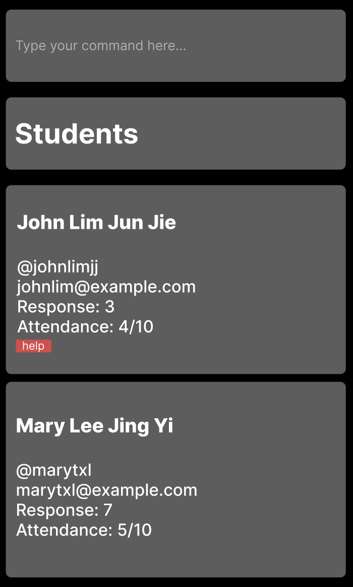
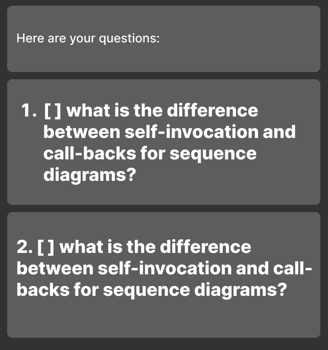

User Guide
=======
SETA is a **desktop application for CS2103T Teaching Assistants** to track their students’ and tutorials’ details, and questions asked by students, optimized for use via a Command Line Interface (CLI) while still having the benefits of a Graphical User Interface (GUI). If you can type fast, SETA enables you to manage your tutorials and track your students more effectively than traditional GUI apps.

* Table of Contents
  * **Student**
    * Adding a student: `addstu`
    * Editing a student: `editstu`
    * Listing students: `liststu`
    * Adding attendance of a student: `attendance`
    * Adding students’ response: `addresponse`
    * Adding help tag to a student: `helpstu`
    * Deleting a student: `deletestu`
  * **Question**
    * Adding a question: `addq`
    * Marking a question: `markq`
    * Unmarking a question: `unmarkq`
    * Deleting a question: `deleteq`
    * Listing questions: `listq`
  * **Tutorial**
    * Adding a tutorial: `addtut`
    * Deleting a tutorial: `deletetut`
    * Marking tutorial: `marktut`
    * Listing tutorials: `listtut`

--------------------------------------------------------------------------------------------------------------------

## Quick start

1. Ensure you have Java `11` or above installed in your Computer.

1. Download the latest `seta.jar` from [here](https://github.com/se-edu/addressbook-level3/releases).

1. Copy the file to the folder you want to use as the _home folder_ for your SETA.

1. Double-click the file to start the app. The GUI similar to the below should appear in a few seconds. Note how the app contains some sample data. 
   

1. Type the command in the command box and press Enter to execute it. e.g. typing **`help`** and pressing Enter will open the help window. 
   Some example commands you can try:

   * **`list`** : Lists all contacts.

   * **`add`**`n/John Doe p/98765432 e/johnd@example.com a/John street, block 123, #01-01` : Adds a contact named `John Doe` to the Address Book.

   * **`delete`**`3` : Deletes the 3rd contact shown in the current list.

   * **`clear`** : Deletes all contacts.

   * **`exit`** : Exits the app.

1. Refer to the [Features](#features) below for details of each command.

--------------------------------------------------------------------------------------------------------------------

## Features

**:information_source: Notes about the command format:** 

* Words in `UPPER_CASE` are the parameters to be supplied by the user. 
  e.g. in `addstu n/NAME`, `NAME` is a parameter which can be used as `addstu n/John Lim`.

* Items in square brackets are optional. 
  e.g. `n/NAME [t/TELEGRAM_HANDLE]` can be used as `n/John Lim t/@johnlim` or as `n/John Lim`.

* Parameters can be in any order. 
  e.g. if the command specifies `n/NAME e/EMAIL`, `e/EMAIL n/NAME` is also acceptable.

* If a parameter is expected only once in the command but you specified it multiple times, only the last occurrence of the parameter will be taken. 
  e.g. if you specify `p/12341234 p/56785678`, only `p/56785678` will be taken.

* Extraneous parameters for commands that do not take in parameters (such as `liststu` and `exit`) will be ignored. 
  e.g. if the command specifies `liststu 123`, it will be interpreted as `liststu`.

### Adding a student : `addstu`

Adds a student to the student list.

Format: `add n/NAME t/TELEGRAM_HANDLE e/EMAIL`
 
Examples:
* `addstu n/John Lim Jun Jie t/@johnlimjj e/johnlim@example.com`
* `addstu n/Mary Tan Xiao Li t/@marytxl e/marytxl@example.com`
  

### Editing a student: `editstu`

Edits an existing student in the student list.

Format: `edit INDEX [n/NAME] [t/TELEGRAM_HANDLE] [e/EMAIL]`

* Edits the student at the specified INDEX. The index represents the index number of the student in the student list. The index must be a positive integer 0, 1, 2…
* At least one of the fields (E.g. [n/NAME] or [e/EMAIL]) must be provided
* Existing fields will be updated to the input values.

Examples:
* `editstu 1 t/@johnlim e/jljj@example.com Edits the telegram handle and email of the person at index 1 to be @johnlim and jljj@example.com respectively.`
* `editstu 3 n/Mary Lee Jing Yi Edits the name of the person at index 3 to be Mary Lee Jing Yi.`

### Listing all students : `liststu`

Shows a list of all the students in the student list.

Format: `liststu`

### Adding attendance : `attendance`

Increases or decreases the number of times a student attended tutorials.

Format: `attendance n/NAME s/SIGN v/VALUE`
* decrease attendance value if `SIGN` is '-' and increase attendance value if `SIGN` is '+'
* increase or decrease the specific student's attendance by `VALUE`

Examples:
* `attendance n/Lee Jun Jie s/- v/2`
* `attendance n/John Lim Jun Jie s/+ v/1`
  

### Adding students' response: `addresponse`

Adds the number of messages a specified student sent during tutorial.

Format: `addresponse n\NAME m\MESSAGE_COUNT`

Examples:
* `addresponse n\John Doe m\7`

### Adding help tag: `helpstu`

Adds a help tag to an existing student.

Format: `helpstu NAME`

Example:
* `helpstu John Lim Jun Jie`

### Deleting a student: `deletestu`

Removes a specific student.

Format: `deletestu INDEX`

* Deletes the student at the specified INDEX
* The index refers to the index number shown in the displayed student list.
* The index must be a positive integer 1, 2. 3, …

Example:
* `liststu` followed by `deletestu 2` deletes the 2nd student

[//]: # (### Editing a person : `edit`)

[//]: # ()
[//]: # (Edits an existing person in the address book.)

[//]: # ()
[//]: # (Format: `edit INDEX [n/NAME] [p/PHONE] [e/EMAIL] [a/ADDRESS] [t/TAG]…​`)

[//]: # ()
[//]: # (* Edits the person at the specified `INDEX`. The index refers to the index number shown in the displayed person list. The index **must be a positive integer** 1, 2, 3, …​)

[//]: # (* At least one of the optional fields must be provided.)

[//]: # (* Existing values will be updated to the input values.)

[//]: # (* When editing tags, the existing tags of the person will be removed i.e adding of tags is not cumulative.)

[//]: # (* You can remove all the person’s tags by typing `t/` without)

[//]: # (    specifying any tags after it.)

[//]: # ()
[//]: # (Examples:)

[//]: # (*  `edit 1 p/91234567 e/johndoe@example.com` Edits the phone number and email address of the 1st person to be `91234567` and `johndoe@example.com` respectively.)

[//]: # (*  `edit 2 n/Betsy Crower t/` Edits the name of the 2nd person to be `Betsy Crower` and clears all existing tags.)

[//]: # ()
[//]: # (### Locating persons by name: `find`)

[//]: # ()
[//]: # (Finds persons whose names contain any of the given keywords.)

[//]: # ()
[//]: # (Format: `find KEYWORD [MORE_KEYWORDS]`)

[//]: # ()
[//]: # (* The search is case-insensitive. e.g `hans` will match `Hans`)

[//]: # (* The order of the keywords does not matter. e.g. `Hans Bo` will match `Bo Hans`)

[//]: # (* Only the name is searched.)

[//]: # (* Only full words will be matched e.g. `Han` will not match `Hans`)

[//]: # (* Persons matching at least one keyword will be returned &#40;i.e. `OR` search&#41;.)

[//]: # (  e.g. `Hans Bo` will return `Hans Gruber`, `Bo Yang`)

[//]: # ()
[//]: # (Examples:)

[//]: # (* `find John` returns `john` and `John Doe`)

[//]: # (* `find alex david` returns `Alex Yeoh`, `David Li` )

[//]: # (  ![result for 'find alex david']&#40;images/findAlexDavidResult.png&#41;)

[//]: # ()
[//]: # (### Deleting a person : `delete`)

[//]: # ()
[//]: # (Deletes the specified person from the address book.)

[//]: # ()
[//]: # (Format: `delete INDEX`)

[//]: # ()
[//]: # (* Deletes the person at the specified `INDEX`.)

[//]: # (* The index refers to the index number shown in the displayed person list.)

[//]: # (* The index **must be a positive integer** 1, 2, 3, …​)

[//]: # ()
[//]: # (Examples:)

[//]: # (* `list` followed by `delete 2` deletes the 2nd person in the address book.)

[//]: # (* `find Betsy` followed by `delete 1` deletes the 1st person in the results of the `find` command.)

[//]: # ()
[//]: # (### Clearing all entries : `clear`)

[//]: # ()
[//]: # (Clears all entries from the address book.)

[//]: # ()
[//]: # (Format: `clear`)

### Adding a question : `addq`

Adds a question to the question list.

Format: `addq QUESTION_DESCRIPTION`

Examples:
* `addq what is the difference between self-invocation and call-backs for sequence diagrams?` 

### Marking a question : `markq`

Marks a question as important.

Format: `markq QUESTION_NUMBER`

Examples:
* `markq 1` marks the first question in the question list as important

### Unmarking a question : `unmarkq`

Marks a question as unimportant. (If the question was previously or mistakenly marked as important)

Format: `unmarkq QUESTION_NUMBER`

Examples:
* `unmarkq 1` marks the first question in the question list as unimportant

### Deleting a question : `deleteq`

Deletes a question in the question list.

Format: `deleteq QUESTION_NUMBER`

Examples:
* `deleteq 1` deletes the first question from the question list

### Listing questions : `listq`

Lists all questions.

Format: `listq`

### Adding a tutorial : `addtut`

Adds a tutorial to the tutorial list.

Format: `addtut g/GROUP_NUMBER c/CONTENT t/DATE TIME`

Examples:
* `addtut g/T08 c/UML diagrams t/2022-10-01T08:00:00`

### Deleting a tutorial : `deletetut`

Deletes a tutorial in the question list.

Format: `deletetut TUTORIAL_NUMBER`

Example:
* `deleteq 1`deletes the first tutorial from the tutorial list

### Marking tutorial: `marktut`

Marks content in the tutorial as done.

Format: `marktut INDEX`

* Marks the tutorial at the specified `INDEX`. The index refers to the index number shown in the displayed person list.
  The index must be a positive integer 1, 2, 3, ...

Example:
* `marktut 1` marks the first tutorial from the tutorial list as done.

### Listing all tutorials: `listtut`

Shows a list of all the added tutorials.

Format: `listtut`

### Exiting the program : `exit`

Exits the program.

Format: `exit`

### Saving the data

AddressBook data are saved in the hard disk automatically after any command that changes the data. There is no need to save manually.

### Editing the data file

AddressBook data are saved as a JSON file `[JAR file location]/data/addressbook.json`. Advanced users are welcome to update data directly by editing that data file.

:exclamation: **Caution:**
If your changes to the data file makes its format invalid, AddressBook will discard all data and start with an empty data file at the next run.

### Archiving data files `[coming in v2.0]`

_Details coming soon ..._

--------------------------------------------------------------------------------------------------------------------

## FAQ

**Q**: How do I transfer my data to another Computer? 
**A**: Install the app in the other computer and overwrite the empty data file it creates with the file that contains the data of your previous AddressBook home folder.

--------------------------------------------------------------------------------------------------------------------

## Command summary

| Action         | Format, Examples                    |
|----------------|-------------------------------------|
| **Add**        | `addstu`, `addq`, `addtut`          |
| **Attendance** | `attendance`                        |
| **Delete**     | `deletestu`, `deleteq`, `deletetut` |
| **Edit**       | `editstu`                           |
| **List**       | `liststu`, `listq`, `listtut`       |
| **Mark**       | `markq`, `unmarkq`, `marktut`       |
| **Tag**        | `helpstu`                           |
