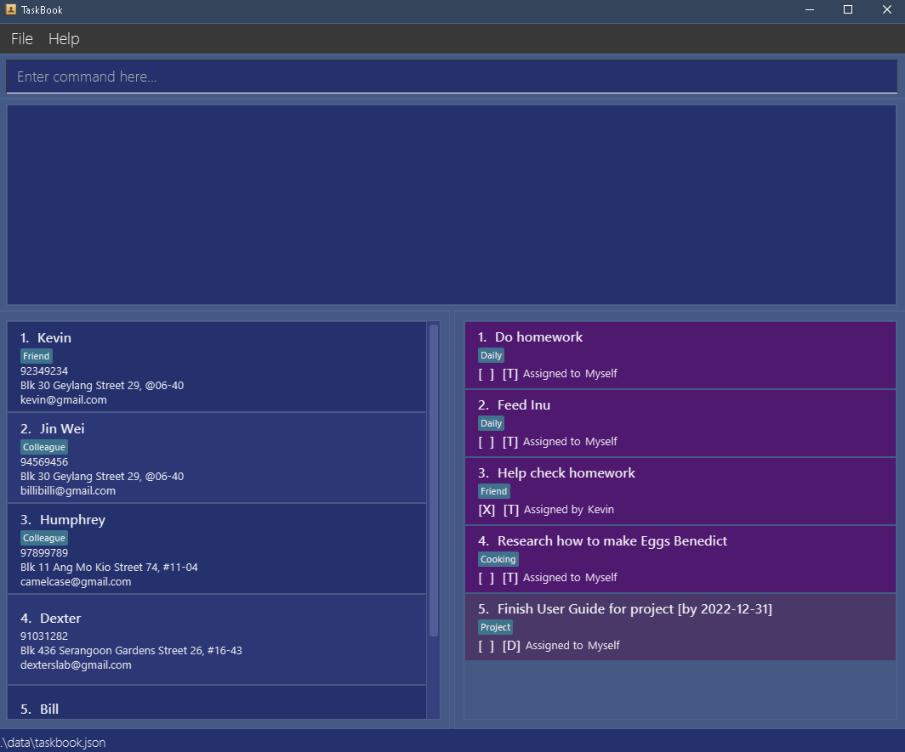

## Welcome to TaskBook!

In this user guide, you will find instructions on how to install TaskBook and use its many features to manage your tasks.

Choose a topic from the table of contents below to find out how to manage your apps using TaskBook!
## Table of Contents

* Table of Contents
{:toc}

--------------------------------------------------------------------------------------------------------------------

## Introduction
<figure>

<figcaption align = "center"><b>GUI you see on start-up may be slightly different due to different data - the illustration you see is for reference only.</b>
</figcaption>
</figure>

TaskBook is a **desktop app for managing contacts and tasks, optimized for use via a Command Line Interface** (CLI) while still having the benefits of a Graphical User Interface (GUI). If you can type fast, TaskBook can get your contact and task management tasks done faster than traditional GUI apps.

TaskBook helps NUS students to manage all their tasks, from project-related and module-related tasks, to even daily personal tasks!

--------------------------------------------------------------------------------------------------------------------

## Useful Notations

While reading this user guide, these symbols will inform you if there is some important information you need to know.

| Symbol               | Meaning                                                          |
|----------------------|------------------------------------------------------------------|
| :information_source: | Important information                                            |
| :alarm_clock:        | Reminder                                                         |
| :bulb:               | Bonus information that is not important to the usage of TaskBook |

--------------------------------------------------------------------------------------------------------------------

## Graphical User Interface Components

<figure>

<figcaption align = "center"><b>The typical appearance of TaskBook.</b>
</figcaption>
</figure>

These are the components of TaskBook, arranged according to their locations as seen in the image above, from left to right, up to down:
* **File** - A dropdown menu containing the exit button, which is an alternative to the [`bye`](#exiting-the-program--bye) [command](#using-the-examples-in-this-guide). Will gain more features in future versions.
* **Help** - A dropdown menu containing the help button, which creates a pop-up window with a link to this User Guide. Not to be confused with the [`help`](#viewing-help--help) [command](#using-the-examples-in-this-guide).
* **Command Box** - A box where you can type in various [commands](#using-the-examples-in-this-guide) to be executed. When empty and not in your focus, it will prompt you with `Enter command here...`.
* **Results Display** - A scrollable box that displays the result of executed [commands](#using-the-examples-in-this-guide) in the Command Box. If the commands fail to execute, this box will also inform you what caused the failure of the command.
* **Contact List** - A scrollable box that contains the list of contacts you have added to TaskBook. Odd numbered boxes are darker in colour than even numbered ones. The layout of a contact is as follows, from left to right, top to bottom:
  * **Index** - The number TaskBook assigns to contacts you add. Can be reshuffled by the [`contact sort`](#sorting-contacts--contact-sort) [command](#using-the-examples-in-this-guide).
  * **Name** - The name of the contact, situated right of the index.
  * **Tags** - A series of light blue boxes. If a contact has no tags, this region will not display any boxes.
  * **Phone Number** - The contact's phone number. If no phone number was added, this field will be `[No phone number]` instead.
  * **Address** - The contact's address. If no address was added, this field will display `[No address]` instead.
  * **Email** - The contact's email. If no email was added, this field will display `[No email]` instead.
* **Task List** - A scrollable box that contains the list of tasks you have added to TaskBook. The layout of a task is as follows, from left to right, top to bottom:
  * **Index** - The number TaskBook assigns to tasks you add. Can be reshuffled by the [`task sort`](#sorting-tasks--task-sort) [command](#using-the-examples-in-this-guide).
  * **Description** - The description of the tasks you add, situated right of the index.
  * **Date** - If the task has a date assigned to it (i.e if the task is a deadline or event), the date will be at the end of the description in square brackets.
  * **Status** - The first [  ] box. If the task's box is [X], it means the task has been done. Otherwise, if it is blank, the task has not been done.
  * **Type** - The second [  ] box. Indicates the type of the task. Each task type is a slightly different shade of purple to give you some visual clarity. Types of tasks:
    * **Todo** - A task that you need to do. Does not have an associated date. In the Task List, these tasks are labelled as [T], and are solid purple.
    * **Deadline** - A task that you need to do by a particular date. In the Task List, these tasks are labelled as [D], and are faintly purple.
    * **Event** - A task that involves you attending some event at some date. In the Task List, these tasks are labelled as [E], and are bright purple.
  * **Assignment** - An indicator on whether the task is assigned by you to someone else, or vice versa. 
  * **Assignor/Assignee** - The contact that has been assigned a task by you, or vice versa. This can be yourself.
* **Status Bar** - Indicates the location in your computer where TaskBook is tracking your Contact List and Task List.

--------------------------------------------------------------------------------------------------------------------

## Quick start

1. Ensure you have Java `11` or above installed in your Computer.

2. Download the latest `TaskBook.jar` from [here](https://github.com/AY2223S1-CS2103T-T13-4/tp/releases).

3. Copy the file to the folder you want to use as the _home folder_ for your TaskBook.

4. Double-click the file to start the app. The GUI similar to the one below should appear in a few seconds, containing sample data. 

<figure>

<figcaption align = "center"><b>GUI you see on start-up may be slightly different due to different data - the illustration you see is for reference only.</b>
</figcaption>
</figure>

{:start="5"}
5. Type the command in the command box and press Enter to execute it. 
   Some example commands you can try:

    * `contact list` : Lists all contacts, including ones hidden by a previous command.

    * `contact add n/John Doe p/98765432 e/johnd@example.com a/John street, block 123, #01-01` : Adds a contact named `John Doe` to the contact list.

    * `contact delete i/3` : Deletes the 3rd contact currently shown in the displayed contact list.

    * `task list` : Lists all tasks, including ones hidden by a previous command.

    * `task todo m/Bernice Yu d/Create a Todo` : Adds a todo with the description `Create a Todo` to the task list.

    * `task delete i/3` : Deletes the 3rd task currently shown in the displayed task list.

    * `bye` : Exits the app.

6. Refer to the [Features](#features) below for details of each command.

--------------------------------------------------------------------------------------------------------------------

## Using the Examples in this Guide

The examples in this guide are formatted with the following conventions:
* **Command** - Instructions to be typed into the command box. Will be executed when you press enter.
* **Flag** - Indicators to differentiate various parts of a command. Always of the form `$/`, and is followed by a **parameter**. The `$` varies by **command**. E.g: `s/` in `task sort s/SORT_TYPE`, or `i/` in `contact delete i/INDEX`.
* **Parameter** - Component of a **command** that is prefixed by a flag. 

--------------------------------------------------------------------------------------------------------------------
## Features

**:information_source: Notes about the command format:** 

* Commands, parameters and arguments are case-sensitive, unless otherwise specified.

* Non-ascii characters are removed from user input.

* Flags consisting of a character and `/` specify the type of parameter to be supplied.
  e.g. in `n/NAME`, `n/` is the flag for the `NAME` parameter.

* The `NAME` parameter for all commands must be the **full name** of the contact 
  e.g. if the contact is named `Alex Yeoh`, a command must use `n/Alex Yeoh` and not `n/Alex` or `n/Alex Y` etc.

* Words in `UPPER_CASE` are the parameters to be supplied by the user. 
  e.g. in `n/NAME`, `NAME` is a parameter which can be used as `n/John Doe`.

* Items in square brackets are optional. 
  e.g. `n/NAME [#/TAG]` can be used as `n/John Doe #/friend` or as `n/John Doe`.

* Diamond brackets mean that at least 1 item inside them must be supplied by the user.  
  e.g. `task find <q/QUERY a/ASSIGNMENT x/DONE>` can be used as `task find q/John` or as `task find a/FROM x/X`, but not just `task find`.

* Items with `…`​ after them can be used multiple times including zero times. Otherwise, they can only be used once by default. 
  e.g. `[#/TAG]…​` can be used as ` ` (i.e. 0 times), `#/friend`, `#/friend #/family` etc, while `n/NAME` (which does not have the square brackets and `…`​) must be used exactly once.

* Parameters can be in any order. 
  e.g. if the command specifies `n/NAME p/PHONE_NUMBER`, `p/PHONE_NUMBER n/NAME` is also acceptable.

* If a parameter is expected only once in the command but you specified it multiple times, only the last occurrence of the parameter will be taken. 
  e.g. if you specify `p/12341234 p/56785678`, only `p/56785678` will be taken.

* Extraneous parameters for commands that do not take in parameters (such as `task list`, `contact list` and `exit`) will be ignored. 
  e.g. if the command specifies `exit 123`, it will be interpreted as `exit`.

### Viewing help : `help`

Shows you either the list of commands available or information about a particular command.

Format: `help [c/COMMAND]`

Examples:
* `help` shows the list of commands available.
* `help c/contact delete` shows the information about the `command delete` command.

### Listing

#### Listing all Contacts : `contact list`

Shows you a list of all contacts in your TaskBook in the order they were added. 

Format: `contact list`

#### Listing all Tasks : `task list`

Shows you a list of all assigned tasks in your TaskBook in the order they were added. 

Format: `task list`

### Adding

**:bulb: Note:** 
* For contacts: A contact is considered a duplicate and cannot be added to the TaskBook if they have the **same name** as an existing contact.
* For tasks: A task is considered a duplicate and cannot be added to the TaskBook if they fulfill **all** of the following criteria with respect to an existing task:
    * same type of task (i.e. `todo`, `event` or `deadline`)
    * same contact name
    * same assignment
    * same description
    * same date (for `event`, `deadline` tasks only)
    

#### Adding a contact : `contact add`

Adds a contact to your TaskBook.

Format: `contact add n/NAME [p/PHONE_NUMBER] [e/EMAIL] [a/ADDRESS] [#/TAG]…`

* For more information on the `NAME` parameter, see [NAME Parameter](#name-parameter).
* For more information on the `PHONE_NUMBER` parameter, see [PHONE_NUMBER Parameter](#phone_number-parameter).
* Note that adding a new contact [will remove the effect of a `find` command](#finding), displaying the full list of contacts.

Examples:
* `contact add n/John Doe p/98765432 e/johnd@example.com a/John street, block 123, #01-01`
* `contact add n/Betsy Crowe #/friend e/betsycrowe@example.com a/Newgate Prison p/1234567 #/criminal`

#### Adding a todo : `task todo`

Adds a task of type todo into your task list.

**Assigned by** Format:  `task todo m/NAME d/DESCRIPTION [#/TAG]…`

**Assigned to** Format:  `task todo o/NAME d/DESCRIPTION [#/TAG]…`

**Self-assigned** Format:  `task todo d/DESCRIPTION`

* Adds a todo assigned by (`m/`) or assigned to (`o/`) a contact with a description. Optional to include tags.
* Input "Myself" or omit the `m/` and `o/` flags to assign yourself a todo.
    * Self-assignment defaults to `m/Myself` when `m/` and `o/` flags are omitted.
* Note that adding a new task [will remove the effect of a `find` command](#finding), displaying the full list of tasks.

**:information_source: Notes about task todo:** 

* `NAME` must be written in full.
* `NAME` is case-sensitive.

Examples:
* `task todo m/Alex Yeoh d/Finish user guide` adds a todo called “Finish user guide” assigned by Alex Yeoh to you.
* `task todo o/Bernice Yu d/Finish the assignment #/cs2103` adds a todo called “Finish the assignment” tagged as "cs2103" and assigned to Bernice Yu.
* `task todo o/Myself d/Upload slides` adds a todo called “Upload slides” which is self-assigned by you.
* `task todo d/Finish essay` adds a todo called "Finish essay" which you assign to yourself.

#### Adding a deadline : `task deadline`

Adds a task of type deadline into the task list.

**Assigned by** Format: `task deadline m/NAME d/DESCRIPTION t/DATE [#/TAG]…`

**Assigned to** Format: `task deadline o/NAME d/DESCRIPTION t/DATE [#/TAG]…`

**Self-assigned** Format: `task deadline d/DESCRIPTION t/DATE`

* Adds a deadline assigned by (`m/`) or assigned to (`o/`) a contact with a description and a deadline date. Optional to include tags.
* Input "Myself" or omit the `m/` and `o/` flags to assign yourself the deadline.
    * Self-assignment defaults to `m/Myself` when `m/` and `o/` flags are omitted.
* For more information on `DATE` formats, see [Accepted Date Formats](#accepted-date-formats).
* Note that adding a new task [will remove the effect of a `find` command](#finding), displaying the full list of tasks.

**:information_source: Notes about task deadline:** 

* `NAME` must be written in full.
* `NAME` is case-sensitive.

Examples:
* `task deadline m/Alex Yeoh d/Finish user guide t/2022-12-31` adds a deadline called “Finish user guide” assigned by Alex Yeoh to you.
* `task deadline o/Bernice Yu d/Finish the assignment t/Jan 31 2022 #/cs2103` adds a deadline called “Finish the assignment” and tagged as "cs2103" which is assigned to Bernice Yu.
* `task deadline o/Myself d/Upload slides t/2022-12-31` adds a deadline called “Upload Slides” which self-assigned by you.
* `task deadline d/Finish essay t/Jan 31 2022` adds a deadline called “Finish essay” which you assign to yourself.

#### Adding an event : `task event`

Adds a task of type event into your task list.

**Assigned by** Format: `task event m/NAME d/DESCRIPTION t/DATE [#/TAG]…`

**Assigned to** Format: `task event o/NAME d/DESCRIPTION t/DATE [#/TAG]…`

**Self-assigned** Format: `task event d/DESCRIPTION t/DATE`

* Adds an event assigned by (`m/`) or assigned to (`o/`) a contact with a description and an event date. Optional to include tags.
    * Self-assignment defaults to `m/Myself` when `m/` and `o/` flags are omitted.
* For more information on `DATE` formats, see [Accepted Date Formats](#accepted-date-formats).
* Note that adding a new task [will remove the effect of a `find` command](#finding), displaying the full list of tasks.

**:information_source: Notes about task event:** 

* `NAME` must be written in full.
* `NAME` is case-sensitive.

Examples:
* `task event m/Alex Yeoh d/Finish user guide t/2022-12-31` adds an event called “Finish user guide” assigned by Alex Yeoh to you.
* `task event o/Bernice Yu d/Finish the assignment t/Jan 31 2022 #/cs2103` adds an event called “Finish the assignment” tagged as "cs2103" which is assigned to Bernice Yu.
* `task event o/Myself d/Upload Slides t/Jan 31 2022` adds an event called “Upload Slides” which is self-assigned by you.
* `task event d/Finish essay t/Jan 31 2022` adds an event called “Finish essay” which you assigned to yourself.

### Editing

**:bulb: Note:** 
* [As mentioned above](#Adding), you cannot edit a contact/task into a duplicate of an existing contact/task in the TaskBook.

#### Editing a contact : `contact edit`

Edits the specified contact in your contact list.

Format: `contact edit i/INDEX <n/NAME p/PHONE_NUMBER e/EMAIL a/ADDRESS #/TAG…>`

* Edits the contact at the specified `INDEX` with the parameters provided.
* The index refers to the index number shown in the displayed contact list.
* The index **must be a positive integer** 1, 2, 3, …​
* Include only the parameters you wish to be edited, however all included parameters **must** be changed from the original.

**:alarm_clock: Reminder:** 
* From the parameters within `<>` in the command format, **at least one** valid parameter must be provided!

Examples:
* `contact edit i/1 n/James Lee e/jameslee@example.com`
* `contact edit i/2 p/98765433 #/friend`

#### Editing a task : `task edit`

Edits the specified task in your task list.

Format: `task edit i/INDEX <m/NAME o/NAME d/DESCRIPTION t/DATE #/TAG…>`

* Edits the task at the specified `INDEX` with the parameters provided.
* The index refers to the index number shown in the displayed task list.
* The index **must be a positive integer** 1, 2, 3, …​
* Include only the parameters you wish to be edited, however you include within the `<>` **must** be changed from the original.
* Only one of assignor `m/` or assignee `o/` can be specified.
    * A task can be **re-assigned to** "Person Y" by providing parameter `o/Person Y`.
    * A task can be **re-assigned by** "Person X" by providing parameter `m/Person X`.
    * If neither `m/` or `o/` is specified, the current **assignor** or **assignee** will not be changed.
* Dates `t/` can only be edited if the task is a **deadline** or **event**.
* For more information on `DATE` formats, see [Accepted Date Formats](#accepted-date-formats).

**:information_source: Notes about task edit:** 

* `NAME` must be written in full.
* `NAME` is case-sensitive.

**:alarm_clock: Reminder:** 
* From the parameters within `<>` in the command format, **at least one** valid parameter must be provided!

Examples:
* `task edit i/1 m/Jackie Chan d/Practice kick 10000 times`
* `task edit i/2 o/James Lee`
* `task edit i/3 t/2023-12-31`

### Deleting

#### Deleting a contact : `contact delete`

Deletes the specified contact from your contact list.

Format: `contact delete i/INDEX`

* Deletes the contact at the specified `INDEX`.
* The index refers to the index number shown in your displayed contact list.
* The index **must be a positive integer** 1, 2, 3, …​
* Deletion of contact is blocked if the contact has tasks associated to it.

**:information_source: Notes about contact delete:** 

* A contact cannot be deleted if there are tasks assigned to or by the contact.

Example:

* `contact list` followed by `contact delete i/2` deletes the 2nd contact in your contact list.

#### Deleting a task : `task delete`

Deletes the specified task from your task list.

Format: `task delete i/INDEX`

* Deletes the task at the specified `INDEX`.
* The index refers to the index number shown in your displayed task list.
* The index **must be a positive integer** 1, 2, 3, …​

Example:
* `task list` followed by `task delete i/2` deletes the 2nd task in your task list.

### Finding

**:bulb: Note:** 
* When you add a new contact/task, the effect of any `find` command will be removed, and the full list of contacts/tasks will be displayed.

#### Finding contacts : `contact find`

Displays all contacts matching the arguments provided by you.

Format: `contact find q/QUERY`

* QUERY is not case-sensitive.

Example:
* `contact find q/ea` will change your displayed contact list to show a contact list where all contacts will have "ea" in their name.

#### Finding tasks : `task find`

Displays all tasks matching the arguments provided by you.

Format: `task find <q/QUERY x/DONE a/ASSIGNMENT>`

* QUERY is not case-sensitive.
* ASSIGNMENT is either FROM or TO, representing "m/" and "o/", or 'Assigned by' and 'Assigned to', respectively.
* DONE is either X or O, representing 'Done' and 'Not done' respectively.

**:alarm_clock: Reminder:** 
* From the parameters within `<>` in the command format, **at least one** valid parameter must be provided!

Examples:
* `task find q/ea` will change the displayed task list to show a task list where all tasks will have "ea" in either their connected person, or their description.
* `task find x/X` will change the displayed task list to show a task list where all tasks are marked done, with [X].
* `task find a/FROM` will change the displayed task list to show a task list where all tasks are assigned to you by someone else.
* `task find q/ea x/X` is equivalent to `task find x/X q/ea`.

### Sorting

#### Sorting contacts : `contact sort`

Sorts your contact list based on the input parameter.

Format: `contact sort s/SORT`

SORT parameters:
* ca: Chronologically sort tasks by date and time added.
* a: Alphabetically sort contact names.
* ra: Alphabetically sort contact names in reverse order.
* p: Numerically sort contact phone numbers in ascending order.
* rp: Numerically sort contact phone numbers in descending order.

Example:
* `contact sort s/a` will change the displayed contact list to show a contact list where names are sorted by alphabetical order.

#### Sorting tasks : `task sort`

Sorts your task list based on the input parameter.

Format: `task sort s/SORT`

SORT parameters:
* ca: Chronologically sort tasks by date and time added.
* a: Alphabetically sort task descriptions.
* ra: Alphabetically sort task descriptions in reverse order.
* cd: Chronologically sort tasks by their associated dates in ascending order. Tasks without dates are at the end of the list, in no particular order.
* rcd: Chronologically sort tasks by their associated dates in descending order. Tasks without dates are at the end of the list, in no particular order.

Example:
* `task sort s/a` will change the displayed task list to show a task list sorted by description alphabetical order

### Marking a task : `task mark`

Marks the specified task from your task list as done.

Format: `task mark i/INDEX`

* Marks the task at the specified `INDEX` as done.
* The index refers to the index number shown in your displayed task list.
* The index **must be a positive integer** 1, 2, 3, …​

Example:
* `task list` followed by `task mark i/2` marks the 2nd task in your task list.

### Unmarking a task : `task unmark`

Marks the specified task from your task list as not done.

Format: `task unmark i/INDEX`

* Marks the task at the specified `INDEX` as not done.
* The index refers to the index number shown in your displayed task list.
* The index **must be a positive integer** 1, 2, 3, …​

Example:
* `task list` followed by `task unmark i/2` marks the 2nd task in your task list.

### Undo Command : `undo`

Undoes the previous command and reverts your TaskBook to the previous state.

**:information_source: Notes about Undo:** 

* Up to 15 commands can be undone.
* Commands can only be undone if there is a change in contact or task state.
* Undo does not reset the view changes caused by filter or sort. See [contact list](#listing-all-contacts--contact-list) and [task list](#listing-all-tasks--task-list) instead.

Format: `undo`

Example:
1. `task todo m/Bob d/Add undo feature` - some command that causes a change in state
2. `undo` will undo the previous command

### Redo Command : `redo`

Redoes the previous undo action and reverts your TaskBook to a previously undone state.

Format: `redo`

Example:
1. `task delete i/1` - some command that causes a change in state
2. `undo` will undo the previous command
3. `redo` will revert the state such that the task is deleted

### Exiting the program : `bye`

Ends the application immediately.

Format: `bye`

### Navigating Command History

A _minimum_ of 1000 commands are guaranteed to be kept in the history, if there are that many commands executed. Invalid commands are also saved in the command history, to allow for editing mistyped commands.

#### History: Previous Command

Gets the previous command, if any.

Steps:

1. Ensure that the text field is selected and in focus.

1. Press `UP` arrow key.

#### History: Next Command

Gets the next command, if any.

Steps:

1. Ensure that the text field is selected and in focus.

1. Press `DOWN` arrow key.

### Saving the data

TaskBook data is saved in the hard disk automatically after any command that changes the data. There is no need to save manually.

### Editing the data file

TaskBook data is saved as a JSON file `[JAR file location]/data/taskbook.json`. Advanced users are welcome to update data directly by editing that data file.

:exclamation: **Caution:**
If your changes to the data file makes its format invalid, TaskBook will discard all data and start with an empty data file at the next run.

## Miscellaneous Notes

### Accepted Date Formats

Any of these date formats are accepted:

* yyyy-MM-dd (2022-10-31)
* MMM dd yyyy (Oct 31 2022)
* MM dd yyyy (10 31 2022)
* dd MMM yyyy (31 Oct 2022)

### NAME Parameter

Where the NAME parameter is required (e.g. `n/NAME`), specify the **exact name**
* in full
* in a case-sensitive format

This prevents ambiguity in naming so that you can specify the exact contact where necessary.

### PHONE_NUMBER Parameter

Phone numbers must consist of only numerical inputs 0, 1, 2, 3, 4, 5, 6, 7, 8, 9. TaskBook does not support country code extensions.

Phone numbers must be at least 3 digits long, as the shortest phone numbers in the world (emergency hotlines) are 3 digits long.

--------------------------------------------------------------------------------------------------------------------

## FAQ
**Q**: How do I save my progress? 
**A**: Your progress is automatically saved after each command.

**Q**: How do I transfer my data to another computer? 
**A**: Install the app in the other computer and overwrite the empty data file it creates with the file that contains the data of your previous TaskBook home folder.

--------------------------------------------------------------------------------------------------------------------

## Command summary

| Action                        | Format                                                                          | Examples                                                                         |
|-------------------------------|---------------------------------------------------------------------------------|----------------------------------------------------------------------------------|
| **Help**                      | `help [c/COMMAND]`                                                              | `help c/help`                                                                    |
| **View All Tasks**            | `task list`                                                                     | N/A                                                                              |
| **View Contacts**             | `contact list`                                                                  | N/A                                                                              |
| **Add Contact**               | `contact add n/NAME p/PHONE_NUMBER e/EMAIL a/ADDRESS [#/TAG]…`                  | `contact add n/John Doe p/98765432 e/johnd@example.com a/John street, block 123` |
| **Add Todo: Assigned by**     | `task todo m/NAME d/DESCRIPTION [#/TAG]…`                                       | `task todo m/John d/Finish user guide #/cs2103 #/homework`                       |
| **Add Todo: Assigned to**     | `task todo o/NAME d/DESCRIPTION [#/TAG]…`                                       | `task todo o/Sam d/Finish the assignment #/compulsory`                           |
| **Add Deadline: Assigned by** | `task deadline m/NAME d/DESCRIPTION t/DATE [#/TAG]…`                            | `task deadline m/John d/Finish user guide t/2022-12-31 #/cs2103 #/homework`      |
| **Add Deadline: Assigned to** | `task deadline o/NAME d/DESCRIPTION t/DATE [#/TAG]…`                            | `task deadline o/Sam d/Finish the assignment t/Jan 31 2022 #/compulsory`         |
| **Add Event: Assigned by**    | `task event m/NAME d/DESCRIPTION t/DATE [#/TAG]…`                               | `task event m/John d/Finish user guide t/2022-12-31 #/cs2103 #/homework`         |
| **Add Event: Assigned to**    | `task event o/NAME d/DESCRIPTION t/DATE [#/TAG]…`                               | `task event o/Sam d/Finish the assignment t/Jan 31 2022 #/compulsory`            |
| **Edit Contact**              | `contact edit i/INDEX [n/NAME] [p/PHONE_NUMBER] [e/EMAIL] [a/ADDRESS] [#/TAG]…` | `contact edit i/2 n/James Lee e/jameslee@example.com #/friend`                   |
| **Edit Task**                 | `task edit i/INDEX [m/NAME] [o/NAME] [d/DESCRIPTION] [t/DATE] [#/TAG]…`         | `task edit i/2 o/James Lee #/classmate`                                          |
| **Delete Contact**            | `contact delete i/INDEX`                                                        | `contact delete i/3`                                                             |
| **Delete Task**               | `task delete i/INDEX`                                                           | `task delete i/3`                                                                |
| **Sort Contacts**             | `contact sort s/SORT`                                                           | `contact sort s/a`                                                               |
| **Sort Tasks**                | `task sort s/SORT`                                                              | `task sort s/a`                                                                  |
| **Find Contacts**             | `contact find q/QUERY`                                                          | `contact find q/ea`                                                              |
| **Find Tasks**                | `task find <q/QUERY a/ASSIGNMENT x/DONE>`                                       | `task find a/FROM q/ea`                                                          |
| **Mark Task**                 | `task mark i/INDEX`                                                             | `task mark i/3`                                                                  |
| **Unmark Task**               | `task unmark i/INDEX`                                                           | `task unmark i/3`                                                                |
| **Undo**                      | `undo`                                                                          | N/A                                                                              |
| **Redo**                      | `redo`                                                                          | N/A                                                                              |
| **Exiting the program**       | `bye`                                                                           | N/A                                                                              |
| **History: Previous Command** | `UP` arrow key                                                                  | N/A                                                                              |
| **History: Next Command**     | `DOWN` arrow key                                                                | N/A                                                                              |

