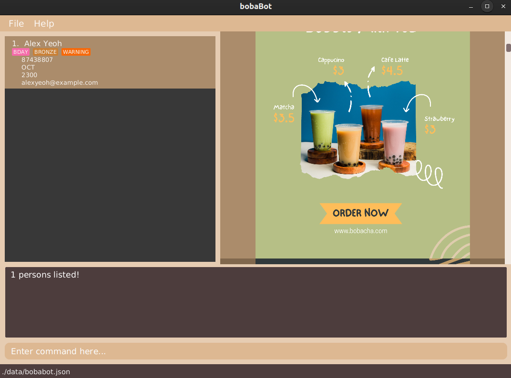

bobaBot is a **desktop application** for managing customers’ membership details. It is **optimized for Command Line Interface (CLI) while retaining some benefits of the Graphical User Interface (GUI)**. If you are a cashier working at a bubble tea shop and can type fast, bobaBot can help you easily find and manage your customers’ membership information as compared to other GUI applications.
* Table of Contents
  {:toc}

--------------------------------------------------------------------------------------------------------------------

## Quick start

1. Ensure you have Java `11` or above installed in your Computer.

1. Download the latest `bobaBot.jar` from [here](https://github.com/AY2223S1-CS2103T-W09-1/tp/releases).

1. Copy the file to the folder you want to use as the _home folder_ for your bobaBot.

1. Double-click the file to start the app. The GUI similar to the below should appear in a few seconds. Note how the app contains some sample data. 
   

1. Type the command in the command box and press Enter to execute it. e.g. typing **`help`** and pressing Enter will open the help window. 
   Some example commands you can try:

    * **`list`** : Lists all customers.

    * **`add n/John Doe p/98765432 e/johnd@example.com m/1 r/0`** : Adds a customer named `John Doe` to bobaBot.

    * **`delete p/98765432`** : Deletes the customer with the corresponding phone number (aka John Doe).

    * **`clear`** : Deletes all customers.

    * **`exit`** : Exits the app.

1. Refer to the [Features](#features) below for details of each command.

--------------------------------------------------------------------------------------------------------------------

## Features

**:information_source: Notes about the command format:** 

* Words in `UPPER_CASE` are the parameters to be supplied by the user. 
  e.g. in `add n/NAME`, `NAME` is a parameter which can be used as `add n/John Doe`.

* Items in square brackets are optional. 
  e.g `n/NAME [t/TAG]` can be used as `n/John Doe t/member` or as `n/John Doe`.

* Items with `…`​ after them can be used multiple times including zero times. 
  e.g. `[t/TAG]…​` can be used as ` ` (i.e. 0 times), `t/member`, `t/member t/gold` etc.

* Parameters can be in any order. 
  e.g. if the command specifies `n/NAME p/PHONE_NUMBER`, `p/PHONE_NUMBER n/NAME` is also acceptable.

* If a parameter is expected only once in the command but you specified it multiple times, only the last occurrence of the parameter will be taken. 
  e.g. if you specify `p/12341234 p/56785678`, only `p/56785678` will be taken.

* Extraneous parameters for commands that do not take in parameters (such as `help`, `list`, `exit` and `clear`) will be ignored. 
  e.g. if the command specifies `help 123`, it will be interpreted as `help`.

### Viewing help : `help`

Shows a message explaining how to access the help page.

Format: `help`

### Adding a Customer: `add`

Adds a Customer to bobaBot.

Format: `add n/NAME p/PHONE_NUMBER e/EMAIL m/BIRTHDAY_MONTH r/REWARD [t/TAG]…`

:bulb: Tip:
A customer can have any number of tags (including 0)

Examples:
* `add n/John Doe p/98765432 e/johnd@example.com m/1 r/0 `
* `add n/Betsy Crowe p/91234567 e/betsycrowe@example.com m/2 r/5000 t/member t/gold`

### Editing a Customer’s details: `edit`

Edits an existing Customer in bobaBot.

Format: `edit p/PHONE_NUMBER OR edit e/EMAIL
[n/NAME] [p/PHONE_NUMBER] [e/EMAIL] [r/REWARD] [t/TAG]…​`

:bulb: Tip:
At least one of the optional fields must be provided

Examples:
* `edit p/91234567 e/johndoe@example.com r/1000`
* `edit e/peterparker@example.com r/420`

### Increasing a Customer’s Reward points: `incr`

Increases the Reward points of existing Customer in bobaBot.

Format: `incr INCREMENT_VALUE p/PHONE_NUMBER OR incr INCREMENT_VALUE e/EMAIL`

Examples:
* `incr 100 p/91234567`
* `incr 200 e/milesmorales@example.com`

### Decreasing a Customer’s Reward points: `decr`

Decreases the Reward points of existing Customer in bobaBot.

Format: `decr DECREMENT_VALUE p/PHONE_NUMBER OR decr DECREMENT_VALUE e/EMAIL`

Examples:
* `decr 100 p/91234567`
* `decr 200 e/gwenstacy@example.com`

### Listing all customers : `list`

Shows a list of all Customers in bobaBot.

Format: `list`

### Locating customers by name: `find`

Finds Customers whose information (including name, phone, email, address) contain any of the given keywords.

Format: `find KEYWORD [MORE_KEYWORDS]`

* The search is case-insensitive. e.g `hans` will match `Hans`
* The order of the keywords does not matter. e.g. `Hans Bo` will match `Bo Hans`
* Customers matching at least one keyword will be returned (i.e. `OR` search)
  e.g. `Hans Bo` will return `Hans Gruber`, `Bo Yang`
* When searching for names, fuzzy search based on Soundex will be used
  e.g. `Aschcroft` will match `Aschcraft`
* No need to type in the whole word. e.g `9927` will match `27859927`
* For precise searching, specify the corresponding attribute (phone number or email)
  e.g. `find p/88888888` will only match the customer with phone number `88888888`

Examples:
* `find John` returns `john` and `John Doe`
* `find alex david` returns `Alex Yeoh`, `David Li`
* `find Aschcroft` returns `Aschcroft`, `Ashcraft`, and `Aschcraft`
* `find 43` returns both `Alex Yeoh` and `David Li` 
* `find p/87438807` returns only `Alex Yeoh`  
  

### Deleting a Customer : `delete`

Removes a Customer from bobaBot.

Format:

`delete p/PHONE_NUMBER` or

`delete e/EMAIL`

* Deletes the Customer with the following `PHONE_NUMBER` when `p/` specified.
* Deletes the Customer with the following `EMAIL` when `e/` specified.

Examples:
* `delete p/87438807` removes the Customer with the phone number `87438807`.
* `delete e/alexyeoh@example.com` removes the Customer with the email `alexyeoh@example.com`.

### Undo a Command : `undo`

Reverts a command that has been executed. Returns bobaBot to the previous state before executing the command.

Format: `undo`

:exclamation: Note: bobaBot only preserves the 20 most recent state changes (Commands such as `list`, `find`, `help`, `calc` and `exit` will not result in a state change).

### Redo an UndoCommand : `redo`

Reverts the UndoCommand. Returns bobaBot to the state before executing the UndoCommand.

Format: `redo`

:exclamation: Note: bobaBot only preserves the 20 most recent state changes (Commands such as `list`, `find`, `help`, `calc` and `exit` will not result in a state change).

### Clearing all entries : `clear`

Clears all Customers from the bobaBot.

Format: `clear`

### Undo the last edit : `undo`

Revert the data to the version prior the last edit.

Format: `undo`

### Redo the last edit : `redo`

Redo the last edit.

Format: `redo`

### Calculate: `calc`
Do basic arithmetic calculation including +, -, *, /. Allow multiple operators and precedence

Format: `calc {expression}`

Example: `calc 2 * (1 + 1)`

### GUI Calculator: `calc-gui`
Launch a GUI calculator. A calculator window will pop-up

Format: `calc-gui`

### Exiting the program : `exit`

Exits the program.

Format: `exit`

### Saving the data

bobaBot data are saved in the hard disk automatically after any command that changes the data. There is no need to save manually.

### Editing the data file

bobaBot data are saved as a JSON file `[JAR file location]/data/bobaBot.json`. Advanced users are welcome to update data directly by editing that data file.

:exclamation: **Caution:**
If your changes to the data file makes its format invalid, bobaBot will discard all data and start with an empty data file at the next run.

### Archiving data files `[coming in v2.0]`

_Details coming soon ..._

--------------------------------------------------------------------------------------------------------------------

## FAQ

**Q**: How do I transfer my data to another Computer? 
**A**: Install the app in the other computer and overwrite the empty data file it creates with the file that contains the data of your previous AddressBook home folder.

--------------------------------------------------------------------------------------------------------------------

## Command summary

| Action         | Format, Examples                                                                                                                                                                                                                                                                     |
|----------------|--------------------------------------------------------------------------------------------------------------------------------------------------------------------------------------------------------------------------------------------------------------------------------------|
| **Add**        | `add n/NAME p/PHONE_NUMBER e/EMAIL [r/REWARD] [t/TAG]…`   e.g., `add n/Betsy Crowe p/1234567 e/betsycrowe@example.com r/5000 t/gold`                                                                                                                                              |
| **Edit**       | `edit p/PHONE_NUMBER [n/NAME] [p/PHONE_NUMBER] [e/EMAIL] [m/BIRTHDAY] [r/REWARD] [t/TAG]…` or   `edit e/EMAIL [n/NAME] [p/PHONE_NUMBER] [e/EMAIL] [m/BIRTHDAY] [r/REWARD] [t/TAG]…`   e.g., `edit p/98765432 n/Miles Morales`, `edit e/alexyeoh@example.com r/1000 p/11111111` |
| **Increase**   | `incr 100 p/PHONE_NUMBER` or `incr 100 e/EMAIL`   e.g., `incr 100 p/87438807`, `incr 100 e/alexyeoh@example.com`                                                                                                                                                                  |
| **Decrease**   | `decr 100 p/PHONE_NUMBER` or `decr 100 e/EMAIL`   e.g., `decr 100 p/87438807`, `decr 100 e/alexyeoh@example.com`                                                                                                                                                                  |
| **Delete**     | `delete p/PHONE_NUMBER` or `delete e/EMAIL`   e.g., `delete p/87438807`, `delete e/alexyeoh@example.com`                                                                                                                                                                          |
| **Find**       | `find KEYWORD [MORE_KEYWORDS]`   e.g., `find alex david`                                                                                                                                                                                                                          |
| **Undo**       | `undo`                                                                                                                                                                                                                                                                               |
| **Redo**       | `redo`                                                                                                                                                                                                                                                                               |
| **Calculate**  | `calc`                                                                                                                                                                                                                                                                               |
| **Calculator** | `calc-gui`                                                                                                                                                                                                                                                                           |
| **Clear**      | `clear`                                                                                                                                                                                                                                                                              |
| **List**       | `list`                                                                                                                                                                                                                                                                               |
| **Help**       | `help`                                                                                                                                                                                                                                                                               |
| **Exit**       | `exit`                                                                                                                                                                                                                                                                               |
