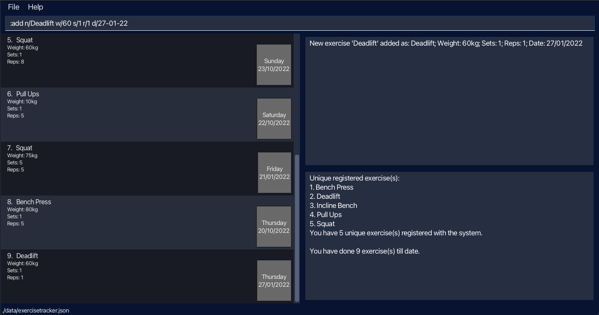
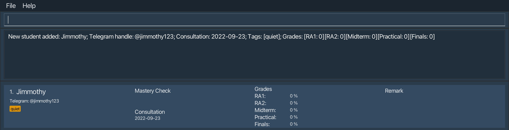
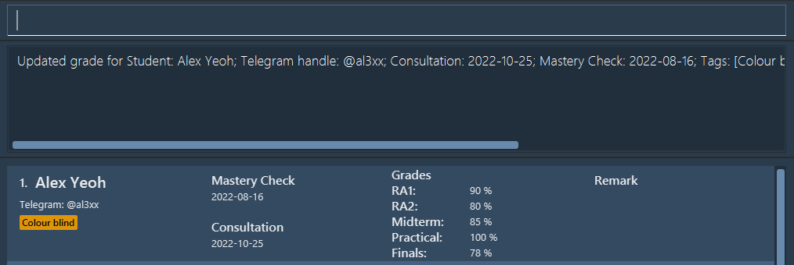
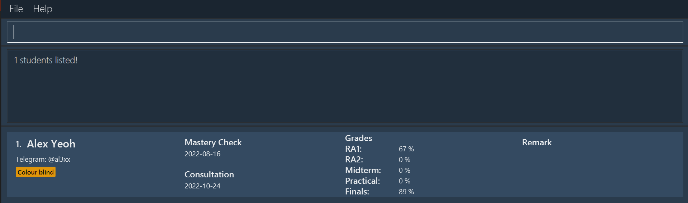
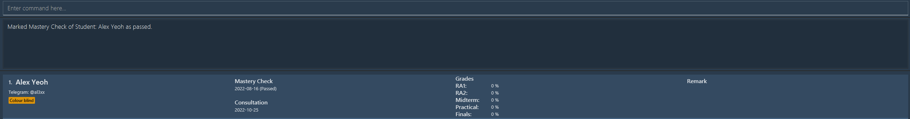
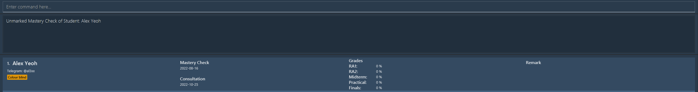
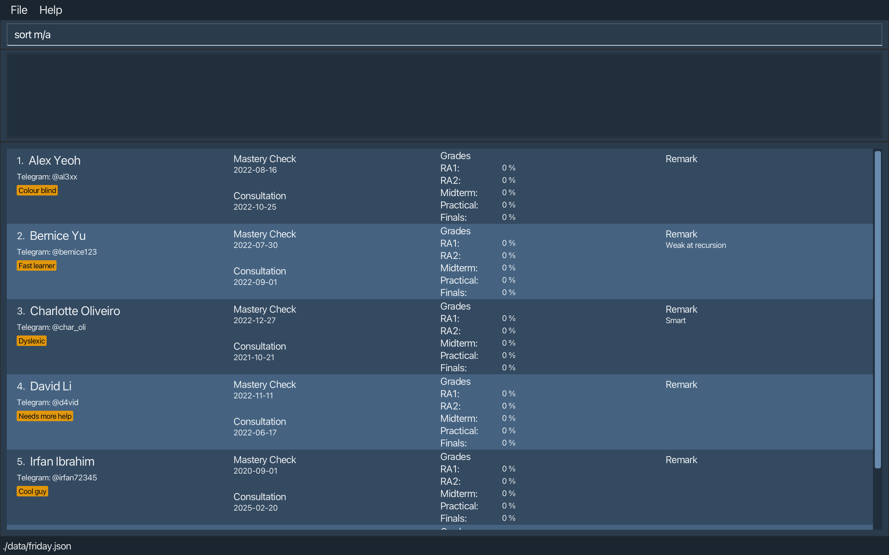
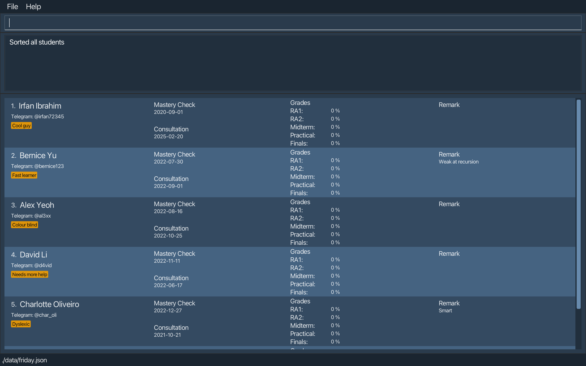

FRIDAY is a **desktop app for CS1101S Teaching Assistants to organize and track their students’ progress, optimized for
use via a Command Line Interface** (CLI) while still having the benefits of a Graphical User Interface (GUI). If you can
type fast, FRIDAY can get your contact management tasks done faster than traditional GUI apps.

### Table of Contents
{:toc}

--------------------------------------------------------------------------------------------------------------------

## Features

1. Add students
2. Delete students
3. Edit details of students
   1. Name
   2. Telegram handle
   3. Consultation dates
   4. Dates of Mastery Checks
   6. Remarks
4. Record grades of students
5. Find individual student details
6. View all students
7. Mark Mastery Checks of students
8. Unmark Mastery Checks of students
8. Sort students
9. Add aliases
10. Delete aliases
11. View all aliases
12. Get user guide link
13. Get help

--------------------------------------------------------------------------------------------------------------------

## Commands

**:information_source: Notes about the command format:** 

* Words in `UPPER_CASE` are the parameters to be supplied by the user. 

  e.g. in `add n/NAME`, `NAME` is a parameter which can be used as `add n/John Doe`.

* Items in square brackets are optional. 

  e.g `n/NAME [t/TELEGRAM_HANDLE]` can be used as `n/John Doe t/johndoe` or as `n/John Doe`.

* Items with `…`​ after them can be used multiple times including zero times. 

  e.g. `[tag/TAG]…​` can be used as ` ` (i.e. 0 times), `tag/fast learner`, `tag/fast learner tag/good at recursion` etc.

* Parameters can be in any order. 

  e.g. if the command specifies `n/NAME t/TELEGRAM_HANDLE`, `t/TELEGRAM_HANDLE n/NAME` is also acceptable.

* If a parameter is expected only once in the command, but you specified it multiple times, only the last occurrence of the parameter will be taken. Note that this does not apply to the `INDEX` parameter in commands that have it, namely the `delete`, `edit`, `remark`, `grade`, `mark` and `unmark` commands, as they expect exactly one `INDEX` parameter. 

  e.g. if you specify `t/johndoe t/johndoe123`, only `t/johndoe123` will be taken.

* Extraneous parameters for commands that do not take in parameters (such as `help`, `list`, `exit` and `clear`) will be ignored. 

  e.g. if the command specifies `help 123`, it will be interpreted as `help`.

### Adding a student: `add`

Adds a student to FRIDAY, with the given name, Telegram handle, consultation date, Mastery Check date, and tags.

Format: `add n/NAME [t/TELEGRAM_HANDLE] [c/CONSULTATION_DATE] [m/MASTERY_CHECK_DATE] [tag/TAG]...`

:bulb: **Tip:**
A student can have any number of tags (including 0).

Example:

Outcome:

### Deleting a student: `delete`

Deletes the student at the given index from FRIDAY.

Format: `delete INDEX`

:bulb: **Tip:**
The index of the student must be specified and there should be exactly one INDEX parameter. 
The index of the student can be seen from the student list.

### Editing a student: `edit`

Edits a student's details in FRIDAY.

Format: `edit INDEX [n/NAME] [t/TELEGRAM_HANDLE] [c/CONSULTATION] [m/MASTERY_CHECK] [tag/TAG]`

:bulb: **Tip:**
The index of the student must be specified and there should be exactly one INDEX parameter. 
The index of the student can be seen from the student list. 
The name, Telegram handle, consultation, mastery check, and tag(s) are optional, but there should be at least one parameter. 
A student can have any number of tags (including 0).

### Editing a remark for a student: `remark`

Adds a remark for a specified student.

Format: `remark INDEX [r/REMARK]`

:bulb: **Tip:**
The index of the student must be specified and there should be exactly one INDEX parameter. 
The index of the student can be seen from the student list. 
The remark is optional. Not including the remark (i.e. `remark INDEX`) will remove any existing remark from the student. 

### Recording grades for a student: `grade`

Records the grades of the assessments and examinations for a specified student.

Format: `grade INDEX [ra1/RA1_SCORE] [ra2/RA2_SCORE] [pa/PRACTICAL_SCORE] [mt/MID_TERM_SCORE] [ft/FINALS_SCORE]`

:bulb: **Tip:**
The index of the student must be specified and there should be exactly one INDEX parameter. 
The index of the student can be seen from the student list. 
The scores of the assessments, Reading Assessment 1 (RA1), Reading Assessment 2 (RA2), Practical Assessment (PA), Midterm Test, and Final Examination, are in percentages between 0% to 100% inclusive, with up to 2 decimals allowed. 
The scores are optional, but there should be at least one parameter.

Example after entering `grade 1 ra1/90 ra2/80 pa/100 mt/85 ft/78`:

### Finding individual student details: `find`

View a particular student's details.

Format: `find KEYWORDS`

:bulb: **Tip:**
Use student name/telegram handle/consultation/mastery check date/remark to search up a particular student.
Note: Multiple keywords can be entered.
Note: when searching for exam grade use format `find [exam_name:EXAM_SCORE]`

Example:

Outcome:

### Viewing all students: `list`

Lists all students in FRIDAY.

Format: `list`

### Marking a student's Mastery Check as passed: `mark`

Marks the Mastery Check of a specified student as passed.

Format: `mark INDEX`

:bulb: **Tip:**
The index of the student must be specified and there should be exactly one INDEX parameter. 
The index of the student can be seen from the student list. 

Example after entering `mark 1`:

### Unmarking a student's Mastery Check: `unmark`

Unmarks the Mastery Check of a specified student.

Format: `unmark INDEX`

:bulb: **Tip:**
The index of the student must be specified and there should be exactly one INDEX parameter. 
The index of the student can be seen from the student list. 

Example after entering `unmark 1` (Assuming student 1's Mastery Check has previously been marked as passed):

### Sorting students: `sort`

Sorts all students in FRIDAY with the given criteria, in ascending or descending order.

Format: `sort CRITERIA/ORDER`

* `CRITERIA` can be `n` (name), `t` (Telegram handle), `c` (consultation), `m` (Mastery Check), or the following grades: `ra1`, `ra2`, `mt`, `pa`, `mt`, and `ft`
* `ORDER` can be `a` (ascending) or `d` (descending)
* Names and Telegram handles are sorted in alphabetical order
* Consultations and Mastery Checks are sorted by time
* Grades are sorted in numerical order

Example:

Outcome:

### Adding aliases: `alias`

Adds an alias for a command into FRIDAY.

Format: `alias a/ALIAS k/KEYWORD`

`KEYWORD` must be the default command keyword (e.g `add` in Adding students)
`ALIAS` must not be a default command keyword

### Deleting aliases: `unalias`

Deletes an existing alias in FRIDAY.

Format: `unalias a/ALIAS`

### View all aliases: `aliaslist`

View all aliases in FRIDAY.

Format: `aliaslist`

### Getting User Guide link: `guide`

Returns a link to FRIDAY's User Guide.

Format: `guide`

### Getting help: `help`

Shows a summary of commands along with their command word. Also includes a link to FRIDAY's user guide.

Format: `help`

--------------------------------------------------------------------------------------------------------------------

## FAQ

--------------------------------------------------------------------------------------------------------------------

## Command Summary

| Action                                       | Format                                                                                                   |
|----------------------------------------------|----------------------------------------------------------------------------------------------------------|
| **Add a student**                            | `add n/NAME [t/TELEGRAM_HANDLE] [c/CONSULTATION_DATE] [m/MASTERY_CHECK_DATE] [tag/TAG]...`               |
| **Delete a student**                         | `delete INDEX`                                                                                           |
| **Edit a student's details**                 | `edit INDEX [n/NAME] [t/TELEGRAM_HANDLE] [c/CONSULTATION] [m/MASTERY_CHECK] [tag/TAG]...`                |
| **Add remarks for a student**                | `remark INDEX [r/REMARK]`                                                                                |
| **Record the grades for a student**          | `grade INDEX [ra1/RA1_SCORE] [ra2/RA2_SCORE] [pa/PRACTICAL_SCORE] [mt/MID_TERM_SCORE] [ft/FINALS_SCORE]` |
| **Find a student's details**                 | `find KEYWORDS`                                                                                          |
| **Mark a student's Mastery Check as passed** | `mark INDEX`                                                                                             |
| **Unmark a student's Mastery Check**         | `unmark INDEX`                                                                                           |
| **View all students**                        | `list`                                                                                                   |
| **Sort students**                            | `sort CRITERIA/ORDER`                                                                                    |
| **Add Alias**                                | `alias a/ALIAS k/KEYWORD`                                                                                |
| **Delete Alias**                             | `unalias a/ALIAS`                                                                                        |
| **View all alias**                           | `aliaslist`                                                                                              |
| **Get a link to the User Guide**             | `guide`                                                                                                  |
| **Getting Help**                             | `help`                                                                                                   |
