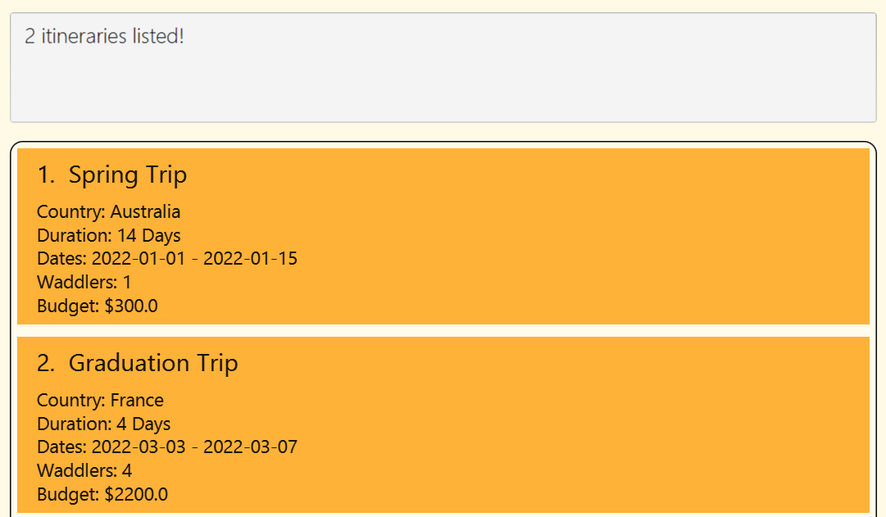
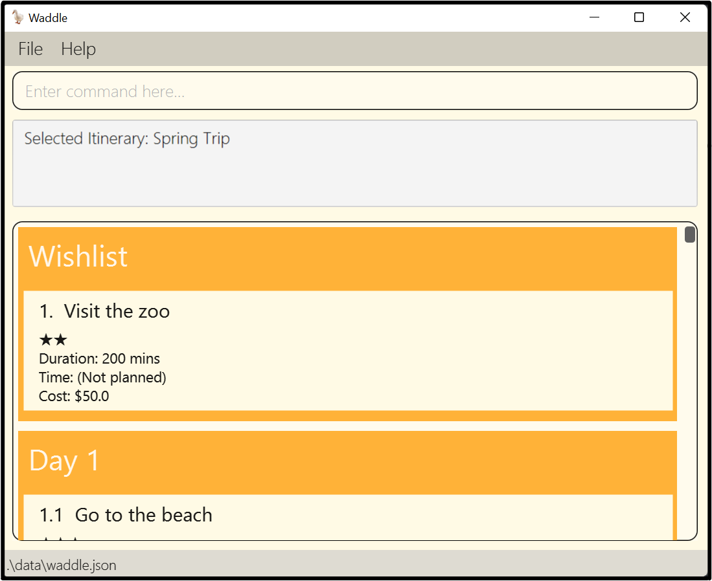

# Waddle User Guide 🦆
Waddle is a **simple, no-frills travel planning application catered to people who love doing everything on their keyboards**. Waddle allows users to plan their travels in **3 simple steps**.
1. Create a trip itinerary
2. Add activities to your itinerary
3. Make a schedule for your trip

**It's that simple**.

--------------------------------------------------------------------------------------------------------------------

## Table of Contents
1. [**Quick start**](#quick-start)
2. [**Features**](#features)
   1. [**Commands on main page**](#commands-on-main-page)
      1. [`help` Viewing help](#viewing-help--help)
      2. [`add` Creating a new itinerary](#creating-a-new-itinerary--add)
      3. [`list` Listing all itineraries](#listing-all-itineraries--list)
      4. [`edit` Editing the details of an itinerary](#editing-the-details-of-an-itinerary--edit)
      5. [`delete` Deleting an itinerary](#deleting-an-itinerary--delete)
      6. [`clear` Clearing itineraries](#clearing-itineraries--clear)
      7. [`find` Locating itineraries by name](#locating-itineraries-by-name--find)
      8. [`select` Selecting an itinerary](#selecting-an-itinerary--select)
   2. [**Commands on item planning page**](#commands-on-item-planning-page)
      1. [`add` Adding an item](#adding-an-item--add)
      2. [`edit` Editing the details of an item](#editing-the-details-of-an-item--edit)
      3. [`delete` Deleting an item](#deleting-an-item--delete)
      4. [`plan` Scheduling an item](#scheduling-an-item--plan)
      5. [`unplan` Unscheduling an item](#unscheduling-an-item--unplan)
      6. [`free` Viewing vacant timeslots](#viewing-vacant-timeslots--free)
      7. [`home` Returning to main page](#returning-to-main-page--home)
      8. [`copy` Copying to clipboard](#copying-to-clipboard--copy)
      9. [`pdf` Exporting to PDF file](#exporting-to-pdf-file--pdf)
   3. [`exit` Exiting Waddle](#exiting-waddle--exit)  
   4. [**Advanced**](#advanced)
      1. [Saving the data](#saving-the-data)
      2. [Editing the data file](#editing-the-data-file)
3. [**FAQ**](#faq)
4. [**Command summary**](#command-summary)
   1. [**Home page commands**](#home-page-commands)
   2. [**Item planning page commands**](#item-planning-page-commands)

--------------------------------------------------------------------------------------------------------------------

## Quick start

1. Ensure you have Java `11` or above installed in your Computer.

2. Download the latest `Waddle.jar` from [here](https://github.com/AY2223S1-CS2103T-W11-4/tp/releases/tag/v1.3.1).

3. Copy the file to the folder you want to use as the _home folder_ for Waddle.

4. Double-click the file to start the app. The GUI similar to the below should appear in a few seconds. Note how the app contains some sample data. 
   

5. Type the command in the command box and press Enter to execute it. e.g. typing **`help`** and pressing Enter will open the help window. 
   Some example commands you can try:

   * **`list`** : Lists all itineraries.

   * **`add`**`d/My Japan Trip du/14 sd/2023-04-01` : Adds an itinerary named "My Japan Trip".

   * **`delete`**`1` : Deletes the 1st itinerary shown in the current list.

   * **`exit`** : Exits the app.

6. Refer to the [Features](#features) below for details of each command.

--------------------------------------------------------------------------------------------------------------------

## Features

**:information_source: Notes about the command format:** 

* Words in `UPPER_CASE` are the parameters to be supplied by the user. 
  - e.g. in `add d/DESCRIPTION ...`, `DESCRIPTION` is a parameter which can be used as `add d/My Japan Trip`.

* Items in square brackets are optional. 
  - e.g. `d/DESCRIPTION [c/COUNTRY] sd/START DATE du/DURATION` can be used as `d/My Japan Trip c/Japan sd/2023-04-01 du/14` or as `d/My Japan Trip sd/2023-04-01 du/14`.
  
* Parameters can be in any order. 
  - e.g. if the command specifies `c/COUNTRY d/DESCRIPTION`, `d/DESCRIPTION c/COUNTRY` is also acceptable.

* If a parameter is expected only once in the command, but you specified it multiple times, only the **last occurrence** of the parameter will be taken. 
  - e.g. if you specify `d/Eat Ramen d/Aquarium`, only `d/Aquarium` will be taken.

* Extraneous parameters for commands that do not take in parameters (such as `help`, `list`, `exit` and `clear`) will be ignored. 
  - e.g. if the command specifies `help 123`, it will be interpreted as `help`.

### Commands on main page

### Viewing help : `help`

Shows a message explaining how to access the help page.

Format: `help`

### Creating a new itinerary : `add`

Adds an itinerary to Waddle.

Format: `add d/DESCRIPTION sd/START DATE du/DURATION [c/COUNTRY] [p/NUMBER OF WADDLERS] [b/BUDGET]`

* Adds a new itinerary named `DESCRIPTION` to the itinerary list.
* `START DATE` is the date of the first day in the itinerary. It must be given in the format `yyyy-mm-dd`.
* `DURATION` will determine the number of days in the itinerary, and must be between 1 and 365 days.
  - e.g. `sd/2022-12-10 du/3` would mean that the trip is from 10 Dec 2022 to 12 Dec 2022.
* `BUDGET` is the budget for the itinerary and must be between $0 and $1,000,000. Please provide the budget in dollars ($), you may include cents too!
  - e.g. `b/1000` is $1,000.
  - e.g. `b/1000.50` is $1,000.50.

:information_source: **Note:** 
* You cannot add an itinerary with the same description as an existing itinerary.
* Waddle only accepts english letters and spaces for `DESCRIPTION` and `COUNTRY`, special characters like `'`, `&`, `!` are not allowed.
    * Example of invalid input: `d/My Trip!!`, `c/Côte d'Ivoire`, `c/中国`
* The budget input should only contain numbers and one decimal point.
    * Example of invalid input: `b/1,000,000`
* If more than 2 decimal places are provided for the budget, Waddle rounds it up to 2 decimal places.
    * e.g. `b/1000.505` will be reflected as $1,000.51.

Examples:
* `add d/My Japan Trip sd/2022-12-12 du/6`
* `add d/Germanyyyy c/Germany du/14 s/05/10/22 b/1000 p/4`

### Listing all itineraries : `list`

Shows a list of all itineraries in Waddle.

Format: `list`

### Editing the details of an itinerary : `edit`

Edits an existing itinerary in Waddle.

Format: `edit INDEX [d/DESCRIPTION] [c/COUNTRY] [sd/START DATE] [du/DURATION] [p/NUMBER OF WADDLERS] [b/BUDGET]`

* Edits the itinerary at the specified `INDEX`. The index refers to the index number shown in the displayed itinerary list. The index **must be a positive integer** 1, 2, 3, …​
* At least one of the optional fields must be provided.
* Existing values will be updated to the input values.

:information_source: **Note:** 
* If you are editing the budget, please ensure that it is sufficient to cover the cost of all the planned items. An error would be shown otherwise.

Examples:
* `edit 1 du/15 sd/2022-10-04` Edits the duration and start date of the first itinerary to be `15` and `2022-10-04` respectively.
* `edit 2 c/India` Edits the country of the second itinerary to be `India`.

### Deleting an itinerary : `delete`

Deletes the specified itinerary from Waddle.

Format: `delete INDEX`

* Deletes the itinerary at the specified `INDEX`. The index refers to the index number shown in the displayed list of itineraries.
* The index **must be a positive integer** 1, 2, 3, …​

Examples:
* `list` followed by `delete 2` deletes the 2nd itinerary in Waddle.
* `find Japan` followed by `delete 1` deletes the 1st itinerary in the results of the `find` command.

### Clearing itineraries : `clear`

Deletes all itineraries in Waddle.

Format: `clear`

### Locating itineraries by name : `find`

Finds itineraries with names containing any of the given keywords.

Format: `find KEYWORD [MORE_KEYWORDS]`

* The search is case-insensitive. e.g. `india` will match `India`
* The order of the keywords does not matter. e.g. `Trip Japan My` will match `My Japan Trip`
* The search is based on itinerary descriptions only.
* Only full words will be matched e.g. `Jap` will not match `Japan`
* Itineraries matching at least one of the provided keywords will be returned (i.e. `OR` search).
  - e.g. `find Japan Trip` will return `My Germany Trip`, since there is a match for the keyword  `Trip`.
* Use the [`list`](#listing-all-itineraries--list) command to see all itineraries again.

Examples:
* `find India` returns `My India Trip` and `India Expedition`
* `find India Trip` returns `My Japan Trip`, `My India Trip`, `India Expedition`
* `find trip` returns the following result:   
  

### Selecting an itinerary : `select`

Enters the [item planning page](#commands-on-item-planning-page) for the selected itinerary.

Format: `select INDEX`

* Selects the itinerary at the specified `INDEX`. The index refers to the index number shown in the displayed list of itineraries.
* The index **must be a positive integer** 1, 2, 3, ...​

Examples:
* `select 1`

### Commands on item planning page

Here's an example of how the item planning page looks like:

### Adding an item : `add`

Adds an item to the list of items.

Format: `add d/DESCRIPTION [p/PRIORITY] [c/COST] [du/DURATION]`

* Adds a new item with `DESCRIPTION` to the unscheduled item list.
* The default `PRIORITY` is 1, while default `COST` and `DURATION` are both 0.
* `COST` is the cost of the item and must be between $0 to $1,000,000. Please provide the cost in dollars ($), you may include cents too!
  - e.g. `b/100.20` is $100.20.
* `DURATION` is in _minutes_.
  - e.g. `du/100` is 100 minutes (or 1 hour and 40 minutes).
* You cannot add items with the same description as an existing item in the item list.

Examples:
* `add d/Go to the Louvre p/2 du/1`
* `add d/Skiing du/14 c/100`

### Editing the details of an item : `edit`

Edits an existing item in the item list.

Format: `edit INDEX [d/DESCRIPTION] [p/PRIORITY] [c/COST] [du/DURATION]`

* Edits the item at the specified `INDEX`. The index refers to the index number displayed in either the unscheduled item list, or the scheduled items in the day lists.
* At least one of the optional fields must be provided.
* Existing values will be updated to the input values.

:information_source: **Note:** 
* If you are editing the cost, please ensure that the new cost stays within the budget of the itinerary. An error would be shown otherwise.

Examples:
* `edit 1 d/Go skiing` would edit the description of the 1st item in the unscheduled item list to be `Go skiing`.
* `edit 2.2 p/3 c/100` would edit the priority and cost of the 2nd item in the Day 2 list to be `3` and `100` respectively.

### Deleting an item : `delete`

Deletes an existing item in the item list.

Format: `delete INDEX`

* Deletes the item at the specified `INDEX`. The index refers to the index number displayed in either the unscheduled item list, or the scheduled items in the day lists.

Examples:
* `delete 1` would delete the 1st item in the unscheduled item list.
* `delete 2.1` would delete the 1st item in the Day 2 item list.

### Scheduling an item : `plan`

Schedules an item in the unscheduled item list.

Format: `plan INDEX d/DAY NUMBER st/START TIME`

* Schedules the item at the specified `INDEX`. The index refers to the index number displayed in the unscheduled item list.
* The index **must be a positive integer** 1, 2, 3, ...​
* `DAY NUMBER` **must be a positive integer** 1, 2, 3, ...​ referring to a day in the list of days displayed.
* `START TIME` should be given in the format `hh:mm`, or `hh:mm:ss` where `hh` is the hour in 24-hour format, `mm` is the minute, and `ss` is the seconds.
* The end time of the item is calculated by adding the `DURATION` of the item to the `START TIME`.
* You can only add an item if there is no clash in timing between the start and end time of the new item, and the start and end time of any existing scheduled item.

:information_source: **Note:** 
* When scheduling an item, please ensure that the item stays within the budget of the itinerary. An error would be shown otherwise.

Examples:
* `plan 2 d/3 st/12:00` would schedule the 2nd item in the unscheduled item list on Day 3, starting at 12pm.
* `plan 1 d/1 st/14:50:10` would schedule the 1st item in the unscheduled item list on Day 1, starting at 14:50pm, 10 seconds in.

### Unscheduling an item : `unplan`

Unschedules an item in a scheduled item list.

Format: `unplan INDEX`

* Unschedules the item at the specified `INDEX`. The index refers to the index number displayed in the list of scheduled items in the list of days.
* You must provide both an existing day number and item number for `INDEX` in this format `(Day number).(item number)`.
* Note that day number and item number must both be more than or equals to 0.

Examples:
* `unplan 2.1` would unschedule the 1st item in the Day 2 item list.
* `unplan 4.5` would unschedule the 5th item in the Day 4 item list.

### Viewing vacant timeslots : `free`

Displays the vacant timeslots available for scheduling items.

Format: `free`

### Returning to main page : `home`

Returns you to the main itinerary list page.

Format: `home`

### Copying to clipboard : `copy`

Copies the itinerary in a text format onto your device's clipboard so you can paste it anywhere.

Format: `copy`

[//]: # (TODO: include screenshot of how the generated text looks like)

:information_source: **Note:** 
* The generated text includes all days within the itinerary, even if there are no items planned for the day.
* The generated text does not include the items in the wishlist. For items to be reflected in the generated text, they must be planned.

### Exporting to PDF file : `pdf`

Exports the itinerary into a PDF file. The file can be found under the "Waddle" folder in your "Documents" folder.

[//]: # (TODO: include screenshots of where to find it for windows and mac, maybe linux but idk how)

Format: `pdf`

### Exiting Waddle : `exit`

Exits the Waddle program.

Format: `exit`

* This command can be used both in the home page and the item planning page.

### Advanced

### Saving the data

Waddle data is saved in the hard disk automatically upon any change in the data. There is no need to save manually.

### Editing the data file

Waddle data is saved as a JSON file `[JAR file location]/data/waddle.json`. Advanced users are welcome to update data directly by editing that data file.

:exclamation: <b>Caution:</b>
If your changes to the data file makes its format invalid, Waddle will discard all data and start with an empty data file at the next run. Please perform a backup before manually editing data.

--------------------------------------------------------------------------------------------------------------------

## FAQ

**Q**: How do I transfer my data to another computer? 
**A**: Install the app in the other computer and overwrite the empty data file it creates with the file that contains the data of your previous Waddle home folder.

--------------------------------------------------------------------------------------------------------------------

## Command summary

### Home page commands
| Action                                                           | Format, Examples                                                                                                                                                  |
|------------------------------------------------------------------|-------------------------------------------------------------------------------------------------------------------------------------------------------------------|
| [**Help**](#viewing-help--help)                                  | `help`                                                                                                                                                            |
| [**Add Itinerary**](#creating-a-new-itinerary--add)              | `add d/DESCRIPTION [c/COUNTRY] du/DURATION sd/START DATE [p/NUMBER OF WADDLERS] [b/BUDGET]`  e.g., `add d/Germanyyyy c/Germany du/14 sd/2022-05-10 p/4 b/7500` |
| [**List Itineraries**](#listing-all-itineraries--list)           | `list`                                                                                                                                                            |
| [**Edit Itinerary**](#editing-the-details-of-an-itinerary--edit) | `edit INDEX [n/NAME] [c/COUNTRY] [du/DURATION] [s/START DATE] [p/NUMBER OF WADDLERS] [b/BUDGET]`  e.g.,`edit 1 du/15 sd/2022-04-10`                            |
| [**Delete Itinerary**](#deleting-an-itinerary--delete)           | `delete INDEX`  e.g., `delete 3`                                                                                                                               |
| [**Clear Itineraries**](#clearing-itineraries--clear)            | `clear`                                                                                                                                                           |
| [**Find Itinerary**](#locating-itineraries-by-name--find)        | `find KEYWORD [MORE_KEYWORDS]`  e.g., `find India Trip`                                                                                                        |
| [**Select Itinerary**](#selecting-an-itinerary--select)          | `select INDEX`  e.g., `select 3`                                                                                                                               |
| [**Exit**](#exiting-waddle--exit)                                | `exit`                                                                                                                                                            |

### Item planning page commands
| Action                                                       | Format, Examples                                                                                         |
|--------------------------------------------------------------|----------------------------------------------------------------------------------------------------------|
| [**Add Item**](#adding-an-item--add)                         | `add d/DESCRIPTION [p/PRIORITY] [c/COST] [du/DURATION]`  e.g.,`add d/Visit Taj Mahal p/5 c/40 du/180` |
| [**Edit Item**](#editing-the-details-of-an-item--edit)       | `edit INDEX [d/DESCRIPTION] [p/PRIORITY] [c/COST] [du/DURATION]`  e.g., `edit 4.1 c/50`               |
| [**Delete Item**](#deleting-an-item--delete)                 | `delete INDEX`  e.g., `delete 3`                                                                      |
| [**Schedule Item**](#scheduling-an-item--plan)               | `plan INDEX d/DAY NUMBER st/START TIME`  e.g., `plan 1 d/4 st/12:00`                                  |
| [**Unschedule Item**](#unscheduling-an-item--unplan)         | `unplan INDEX`  e.g., `unplan 3.2`                                                                    |
| [**View Vacant Timeslots**](#viewing-vacant-timeslots--free) | `free`                                                                                                   |
| [**Return to Main Page**](#returning-to-main-page--home)     | `home`                                                                                                   |
| [**Copy to clipboard**](#copying-to-clipboard--copy)         | `copy`|
| [**Export to PDF**](#exporting-to-pdf-file--pdf)          | `pdf`|
| [**Exit**](#exiting-waddle--exit)                            | `exit`                                                                                                   |
