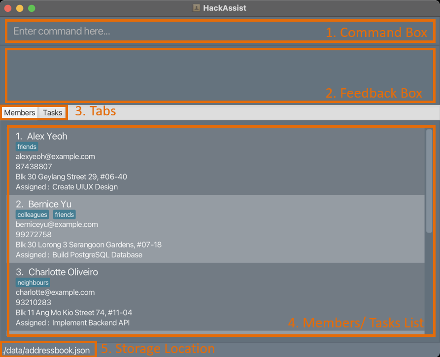
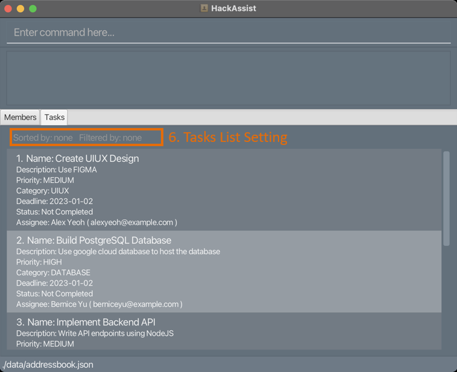

HackAssist is a desktop application which aims to help manage tasks in software development hackathons. In hackathons, task managements are often hectic because we are required to complete a large number of tasks in a short amount of time. However, using HackAssist, we wish to make task managements easier, so you can focus on your hackathon project :)

This guide provides an overview on how to perform the main functionalities of HackAssist: [members management](#members-management) and [tasks management](#tasks-management).

For advanced user, you can go straight to [command summary](#command-summary).

* Table of Contents
{:toc}

--------------------------------------------------------------------------------------------------------------------

## Quick start

1. Ensure you have Java `11` or above installed in your Computer. 
   * To check if you have Java installed, please open up a terminal (search for `Command Prompt` on Windows and `Terminal` on Mac OS) and type in `java -version`. This will show your java version, if you have it installed.
   * If you do not have Java 11 or above installed, please proceed to this [link](https://www.oracle.com/java/technologies/downloads/#java11) and download the appropriate Java for your operating system.

2. Download the latest `HackAssist.jar` from [here](https://github.com/AY2223S1-CS2103T-F12-2/tp/releases).

3. Copy the file to the folder you want to use as the _home folder_ for your HackAssist.

4. Double-click the file to start the app. A GUI similar to the one shown below will appear in a few seconds. Note how HackAssist contains sample data for you to experiment with. 
   

5. Type the command in the command box and press Enter to execute it. e.g. typing **`help`** and pressing Enter will open the help window. 
   Some example commands you can try:

   * **`listTasks`** : Lists all tasks in the task list.

   * **`addTask`**`n/Create profile page d/User profile pr/medium c/frontend dl/2023-01-01` : Adds task `Create profile page` to the task list.

   * **`deleteTask`**`1` : Deletes the first task from the task list.

   * **`help`** : Displays help text.

   * **`exit`** : Exits the app.

Refer to the [Features](#features) below for details of each command.

--------------------------------------------------------------------------------------------------------------------

## Layout

1. Command Box: This is where you key in your commands. Press Enter to execute it.
  
2. Feedback Box: This is where you can see the response from HackAssist when you execute a command. You will either see a confirmation message, or an error message informing you what went wrong with your command.

3. Tabs: This is where you can choose for HackAssist to display Members or Tasks List

4. Members/ Tasks List: This is where the current list is displayed which includes details about each member or task.

5. Storage Location: This is where you can see the location of HackAssist data file.

6. Tasks List Setting: This portion displays what the current sort and filter setting for Tasks List are, if any.

--------------------------------------------------------------------------------------------------------------------

## Features

This section provides information on how you can use HackAssist commands for people management and tasks management. 

You can click [General](#general) to learn about general commands, [Members Management](#members-management) to learn about commands specific to People Management, or [Task Management](#tasks-management) to learn about commands specific to Task Management.

Before you learn any commands, please read the following notes about HackAssist command format.

**:information_source: Notes about the command format:** 

* Words in `UPPER_CASE` are the parameters to be supplied by the user. 
  e.g. in `add n/NAME`, `NAME` is a parameter which can be used as `add n/John Doe`.

* Items in square brackets are optional. 
  e.g `n/NAME [t/TAG]` can be used as `n/John Doe t/friend` or as `n/John Doe`.

* Items with `…`​ after them can be used multiple times including zero times. 
  e.g. `[t/TAG]…​` can be used as ` ` (i.e. 0 times), `t/friend`, `t/friend t/family` etc.

* Parameters can be in any order. 
  e.g. if the command specifies `n/NAME p/PHONE_NUMBER`, `p/PHONE_NUMBER n/NAME` is also acceptable.

* If a parameter is expected only once in the command but you specified it multiple times, only the last occurrence of the parameter will be taken. 
  e.g. if you specify `p/12341234 p/56785678`, only `p/56785678` will be taken.

* Any parameters given for commands that do not take in parameters (such as `help`, `list`, `exit` and `clear`) will be ignored. 
  e.g. if the command specifies `help 123`, it will be interpreted as `help`.

 

### General

#### Viewing help: `help`

Shows a message explaining how to access the help page.

Format: `help`

#### Clearing all entries: `clear`

Clears all contacts from the address book.

Format: `clear`

#### Exiting the program: `exit`

Exits the program.

Format: `exit`

#### Saving the data

HackAssist data are saved in the hard disk automatically after any command that changes the data. There is no need to save manually.

#### Editing the data file

HackAssist data are saved as a JSON file `[JAR file location]/data/HackAssist.json`. Advanced users are welcome to update data directly by editing that data file.

:exclamation: **Caution:**
If your changes to the data file makes its format invalid, HackAssist will discard all data and start with an empty data file at the next run.

 

### Members Management

#### Adding a person: `add`

Adds a new person to the address book.
* Note: You cannot add a task if another task with the same name already exists in the task list. 

Format: `add n/NAME p/PHONE_NUMBER e/EMAIL a/ADDRESS [t/TAG]…​`

:bulb: Tip:
A person can have any number of tags (including 0)

Refer to the [Member Parameters](#member-parameters) section for details about the format of each parameter.

Examples:
* `add n/John Doe p/98765432 e/johnd@example.com a/John street, block 123, #01-01 `
* `add n/Betsy Crowe t/friend e/betsycrowe@example.com a/Newgate Prison p/1234567 t/criminal `

#### Deleting a person: `delete`

Deletes the specified person from the address book.
* Note: This will delete the person permanately

Format: `delete INDEX`

* Deletes the person at the specified INDEX.
* The index refers to the index number shown in the displayed person list.
* The index must be a positive integer 1, 2, 3, …​

Examples:
* `list` followed by `delete 2 ` deletes the 2nd person in the address book.
* `find Betsy` followed by `delete 1 ` deletes the 1st person in the results of the find command, which should be Betsy.

#### Editing a person: `edit`

Edits an existing person in the address book.
The values inside [] indicate optional fields
Format: `edit INDEX [n/NAME] [p/PHONE] [e/EMAIL] [a/ADDRESS] [t/TAG]…​`

* Edits the person at the specified INDEX. The index refers to the index number shown in the displayed person list. The index must be a positive integer 1, 2, 3, …​
* At least one of the optional fields must be provided, otherwise you would not be updating anything.
* Existing values will be updated to the input values.
* When editing tags, all existing tags of the person will be removed and completely replaced with the new tags.
* You can remove all the person’s tags by typing `t/` without specifying any tags after it.
* To edit what tasks a person is assigned to, instead of editing the person, edit the relvant task. The edit will be reflected in the person list after you edit the task. There is no way to edit a task using the edit person command.

Examples:
*  `edit 1 p/91234567 e/johndoe@example.com` edits the phone number and email address of the 1st person to be `91234567` and `johndoe@example.com` respectively.
*  `edit 2 n/Betsy Crower t/` edits the name of the 2nd person to be `Betsy Crower` and clears all existing tags.

#### Locating persons by name: `find`

Finds persons whose names contain any of the given keywords.

Format: `find KEYWORD [MORE_KEYWORDS]`

* The search is case-insensitive. e.g. hans will match Hans
* The order of the keywords does not matter. e.g. Hans Bo will match Bo Hans
* Only the names of people will be considered.
* Only full words will be matched e.g. Han will not match Hans
* Persons matching at least one keyword will be returned (i.e. only one keyword has to match).
  e.g. Hans Bo will return Hans Gruber, Bo Yang, despite the fact that neither match Hans Bo (both names match at least one word)

Examples:
* `find John` returns john and John Doe
* `find alex david` returns Alex Yeoh, David Li  

#### Listing all persons: `list`

Shows a list of all persons in the address book.
This command can be used to reset the displayed person list after a find command.

Format: `list`

 

### Tasks Management

The following commands are for viewing and managing your hackathon tasks. These tasks can be related to software development, product design, project presentation etc. Each task can be assigned to a member to represent that they are responsible for completing that task.

#### Adding a task: `addTask`

Adds a task to the task list. Note that you cannot add a task if another task with the same name already exists in the task list. 

Format: `addTask n/TASK_NAME d/DESCRIPTION pr/PRIORITY c/CATEGORY dl/DEADLINE [pe/EMAIL_OF_PERSON_ASSIGNED]`

* If the optional parameter `pe/EMAIL_OF_PERSON_ASSIGNED` is provided, the task will be assigned to that member. If not, it will remain unassigned. 

Refer to the [Task Parameters](#task-parameters) section for details about the format of each parameter.

Examples:

* `addTask n/Fix toggle d/Fix dark mode button pr/low c/frontend dl/2022-12-12` adds task `Fix toggle` to the task list
* `addTask n/Fix routing d/Handle routing for POST req pr/high c/backend dl/2022-11-11 pe/john@example.com` adds task `Fix routing` to the task list and assigns it to member with email `john@example.com`

#### Deleting a task: `deleteTask`

Deletes a task from the task list.
* **Note: The task will be permanently deleted**. To mark a task as `completed` but have it remain in the task list, use the [`editTask`](#editing-a-task-edittask) command instead. 

Format: `deleteTask INDEX`
* Deletes the task at the specified `INDEX`.
* The index refers to the task number shown in the displayed task list.
* The index **must be a positive integer** 1, 2, 3, …​

Examples:
* `deleteTask 1` deletes the first task from the displayed task list

#### Editing a Task: `editTask`

Edits the parameter(s) of an existing task in the task list. You can also use this command to mark tasks as `completed` or to assign the task to a team member. 

Format: `editTask INDEX [n/TASK_NAME] [d/DESCRIPTION] [pr/PRIORITY] [c/CATEGORY] [dl/DEADLINE] [pe/EMAIL_OF_PERSON_ASSIGNED] [do/IS_DONE]`

* Edits the task at the specified index. The index refers to the index number shown in the displayed task list. The index must be a positive integer 1, 2, 3, …​ and less than or equal to the number of tasks in the task list.
* At least one of the optional fields must be provided.
* Existing values will be updated to the input values.
* To un-assign a member from a task, write `none` in the EMAIL_OF_PERSON_ASSIGNED field, i.e. `pe/none`.
* To mark a task's status as `completed` or `not completed`, write `true` or `false` in the IS_DONE field, e.g. `do/true`.

Refer to the [Task Parameters](#task-parameters) section for details about the format of each parameter.

Examples:
* `editTask 2 c/frontend pe/charlotte@example.com` edits the category of the 2nd task in the displayed task list to be `frontend` and assigns the task to  the member with email `charlotte@example.com`.
* `editTask 4 do/true` marks the 4th task in the displayed task list as `completed`.

#### Viewing all tasks: `listTasks`

Displays all existing tasks in the task list. Use this after using the [`filter`](#filtering-tasks-filter) command to remove the filter.

Format: `listTasks`

#### Filtering tasks: `filter`

Filters the task list based on either CATEGORY or DEADLINE or both. Use this when you want to view only tasks in a certain category or before a certain deadline.

Format: `filter [c/CATEGORY] [dl/DEADLINE]`

* Filters the task list based on the parameters provided.
* At least one of the optional parameters must be provided.
* Only tasks that match the filter condition will be displayed in the task list.
* To remove the filter, use the [`listTasks`](#viewing-all-tasks-listtasks) command.

Refer to the [Task Parameters](#task-parameters) section for details about the format of each parameter.

Examples:
*  `filter c/backend` displays only tasks that have `backend` as CATEGORY
*  `filter c/backend dl/2022-12-12` displays only tasks that have `backend` as CATEGORY and DEADLINE on `2022-12-12` or before

#### Sorting tasks: `sort`

Sorts the task list by the specified field in the specified order. For instance, you can sort tasks in descending order of PRIORITY to help you decide which tasks should be done first. 

Format: `sort [pr/ORDER] [dl/ORDER]`

* Exactly one of the optional parameters must be provided.
* Use the `pr/` parameter to sort by PRIORITY.
* Use the `dl/` parameter to sort by DEADLINE. 
* Order must be either `asc` for ascending or `desc` for descending.

Examples:
* `sort pr/asc` sorts tasks by priority in ascending order

--------------------------------------------------------------------------------------------------------------------

## Command summary

| Action               | Format, Examples                                                                                                                                                                                                                |
|----------------------|---------------------------------------------------------------------------------------------------------------------------------------------------------------------------------------------------------------------------------|
| **Add**              | `add n/NAME p/PHONE_NUMBER e/EMAIL a/ADDRESS [t/TAG]…​`   e.g., `add n/James Ho p/22224444 e/jamesho@example.com a/123, Clementi Rd, 1234665 t/friend t/colleague`                                                        |
| **Delete**           | `delete INDEX`  e.g., `delete 3`                                                                                                                                                                                             |
| **Edit**             | `edit INDEX [n/NAME] [p/PHONE_NUMBER] [e/EMAIL] [a/ADDRESS] [t/TAG]…​`   e.g.,`edit 2 n/James Lee e/jameslee@example.com`                                                                                                 |
| **Find**             | `find KEYWORD [MORE_KEYWORDS]`   e.g., `find James Jake`                                                                                                                                                                     |
| **List People**      | `list`                                                                                                                                                                                                                          |
| **Clear**            | `clear`                                                                                                                                                                                                                         |
| **Help**             | `help`                                                                                                                                                                                                                          |
| **Add Task**         | `addTask n/TASK_NAME d/TASK_DESCRIPTION pr/PRIORITY c/TASK_CATEGORY dl/DEADLINE pe/EMAIL OF PERSON ASSIGNED`   e.g., `addTask n/Fix toggle d/Fix dark mode button pr/low c/frontend dl/2022-12-12 pe/charlotte@example.com`  |
| **Edit Task**        | `editTask INDEX [n/TASK_NAME] [d/TASK_DESCRIPTION] [pr/PRIORITY] [c/TASK_CATEGORY] [dl/DEADLINE] [pe/EMAIL of person assigned] [do/ISDONE]`   e.g., `editTask 2 c/frontend pe/charlotte@example.com`                         |
| **Delete Task**      | `deleteTask TASK_NUMBER`   e.g., `deleteTask 1`                                                                                                                                                                              |
| **List Tasks**       | `listTasks`                                                                                                                                                                                                                     |
| **Filter Task**      | `filter [c/TASK_CATEGORY] [dl/DEADLINE]`   e.g., `filter c/backend dl/2022-12-12`                                                                                                                                            |
| **Sort by Deadline** | `sortByDeadline [o/ORDER]`   e.g., `sortByDeadline o/asc`                                                                                                                                                                    |
| **Sort by Priority** | `sortByPriority [o/ORDER]`   e.g., `sortByPriority o/desc`                                                                                                                                                                   |

--------------------------------------------------------------------------------------------------------------------

## FAQ

**Q**: How do I transfer my data to another Computer? 
**A**: Install the app in the other computer and overwrite the empty data file it creates with the file that contains the data of your previous HackAssist home folder.
**Q**: Do i need internet to run HackAssist? 
**A**: Internet is not needed to run the application.
**q**: Will my data be lost after closing the application?
**A**: No, your data will be stored in the `HackAssist.json` file. Data will only be lost if `HackAssist.json` file is deleted.
**Q**: How do i backup my data? 
**A**: Create a copy of the `HackAssist.json` file in another directory.

--------------------------------------------------------------------------------------------------------------------
## Member Parameters

| Parameter               | Format                                                                                                                                                 |
|-------------------------|---------------------------------------------------------------------------------------------------------------------------------------------------------------|
| n/NAME                  | Should contain only alphanumeric characters and spaces                                                                                                 |
| d/PHONE_NUMBER          | Should contain only numbers                                                                                                                |
| e/EMAIL                 | Has 2 parts seperated by a '@' character.    The first should only contain alphanumeric characters and these special characters, +_.-    The second part should consists of one or more labels. These lables should :  - have start and end with alphanumeric characters,   - have be at least 2 characters long   - have be separated only by hyphens, if any.                                                                                                                             |
| c/ADDRESS                | No restriction on what characters can be entered in this field                                                                                                                                                                                  |

--------------------------------------------------------------------------------------------------------------------

## Task Parameters

| Parameter               | Format                                                                                                                                                 |
|-------------------------|--------------------------------------------------------------------------------------------------------------------------------------------------------|
| n/NAME                  | Should contain only alphanumeric characters and spaces                                                                                                 |
| d/DESCRIPTION           | Should contain only alphanumeric characters and spaces                                                                                                 |
| pr/PRIORITY             | Should be either  `high`, `medium`, or `low` (case-insensitive)                                                                                        |
| c/CATEGORY              | Should be one of the following (case-insensitive):  - `database` - `frontend` - `backend` - `uiux` - `presentation` - `others` |
| dl/DEADLINE             | Should be in the format `YYYY-MM-DD` and after the current date                                                                                        |
| pe/EMAIL_OF_PERSON_ASSIGNED | Should be the email address of an existing member (case-insensitive). For the [`editTask`](#editing-a-task-edittask) command, it can also be `none`, i.e. `pe/none`.                    |
| do/IS_DONE               | *For [`editTask`](#editing-a-task-edittask) command only.* Should be either `true` or `false` (case-insensitive)                                                                   |
## Glossory

| Word               | Definition                                                                                                                                                 |
|-------------------------|--------------------------------------------------------------------------------------------------------------------------------------------------------|
| GUI                 | Graphical User Interface - The Visual representation of the application                                                                                            |
