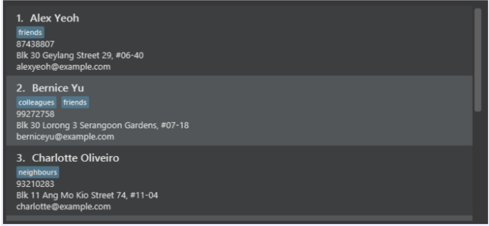

Financial Advisor Planner (FAP) is a **desktop app for Financial Advisors (FA) to manage their clients, optimized for use via a Command Line Interface** (CLI) while still having the benefits of a Graphical User Interface (GUI). If you can type fast, FAP can get your client management tasks done faster than traditional GUI apps.

* Table of Contents
{:toc}

--------------------------------------------------------------------------------------------------------------------

## Quick start

1. Ensure you have Java `11` or above installed in your Computer.

1. Download the latest `financialadvisorplanner.jar` from [here](https://github.com/AY2223S1-CS2103T-W09-2/tp/releases).

1. Copy the file to the folder you want to use as the _home folder_ for your FinancialAdvisorPlanner.

1. Double-click the file to start the app. The GUI similar to the below should appear in a few seconds. Note how the app contains some sample data. 
   

1. Type the command in the command box and press Enter to execute it. e.g. typing **`help`** and pressing Enter will open the help window. 
   Some example commands you can try:

   * **`list`** : Lists all contacts.

   * **`add`**`n/John Doe p/98765432 e/johnd@example.com a/John street, block 123, #01-01 i/60000 r/Low s/1000` : Adds a contact named `John Doe` to the list of clients.

   * **`delete`**`3` : Deletes the 3rd contact shown in the current list.

   * **`clear`** : Deletes all contacts.

   * **'sort'**'alphabet' : Sorts the contacts in alphabetical order.

   * **`find`** `John`: looks for contact that matches keyword ‘John’

   * **`exit`** : Exits the app.

1. Refer to the [Features](#features) below for details of each command.

--------------------------------------------------------------------------------------------------------------------

## Features

**:information_source: Notes about the command format:** 

* Words in `UPPER_CASE` are the parameters to be supplied by the user. 
  e.g. in `add n/NAME`, `NAME` is a parameter which can be used as `add n/John Doe`.

* Items in square brackets are optional. 
  e.g `n/NAME [t/TAG]` can be used as `n/John Doe t/friend` or as `n/John Doe`.

* Items with `…`​ after them can be used multiple times including zero times. 
  e.g. `[t/TAG]…​` can be used as ` ` (i.e. 0 times), `t/friend`, `t/friend t/family` etc.

* Parameters can be in any order. 
  e.g. if the command specifies `n/NAME p/PHONE_NUMBER`, `p/PHONE_NUMBER n/NAME` is also acceptable.

* If a parameter is expected only once in the command but if you specify it multiple times, only the last occurrence of the parameter will be taken. 
  e.g. if you specify `p/12341234 p/56785678`, only `p/56785678` will be taken.

* Extraneous parameters for commands that do not take in parameters (such as `help`, `list`, `exit` and `clear`) will be ignored. 
  e.g. if the command specifies `help 123`, it will be interpreted as `help`.
* Parameter hints will be shown after a command action.

### Viewing help : `help`

Shows a message explaning how to access the help page.

Format: `help`

### Adding a person: `add`

Adds a person to the list of clients.

Format: `add n/NAME p/PHONE_NUMBER e/EMAIL a/ADDRESS i/YEARLY_INCOME r/RISK_APPETITE s/MONTHLY_SAVINGS [t/TAG]…​`

:bulb: **Tip:**
A person can have any number of tags (including 0) 

:information_source: **Note:** RISK_APPETITE can only have the values ‘High’, ‘Medium’ or ‘Low’

Examples:
* `add n/John Doe p/98765432 e/johnd@example.com a/John street, block 123, #01-01 i/200000 r/Medium s/5000`
* `Add n/Betsy Crowe t/friend i/0 r/High e/betsycrow@example.com a/Newgate Prison p/1234567 s/0`

### Listing all persons : `list`

Shows a list of all persons in the client list.

Format: `list`

### Editing a person : `edit`

Edits an existing person in the list of clients.

Format: `edit INDEX [n/NAME] [p/PHONE] [e/EMAIL] [a/ADDRESS] [i/YEARLY_INCOME] [r/RISK_APPETITE] [s/MONTHLY_SAVINGS] [t/TAG]…​`

* Edits the person at the specified `INDEX`. The index refers to the index number shown in the displayed person list. The index **must be a positive integer** 1, 2, 3,…​
* At least one of the optional fields must be provided.
* Existing values will be updated to the input values.
* When editing tags, the existing tags of the person will be removed i.e adding of tags is not cumulative.
* You can remove all the person’s tags by typing `t/` without
    specifying any tags after it.

Examples:
*  `edit 1 p/91234567 e/johndoe@example.com` Edits the phone number and email address of the 1st person to be `91234567` and `johndoe@example.com` respectively.
*  `edit 2 n/Betsy Crower t/` Edits the name of the 2nd person to be `Betsy Crower` and clears all existing tags.

### Locating persons by name: `find`

Finds persons whose names contain any of the given keywords.

Format: `find KEYWORD [MORE_KEYWORDS]`

* The search is case-insensitive. e.g `hans` will match `Hans`
* The order of the keywords does not matter. e.g. `Hans Bo` will match `Bo Hans`
* Only the name is searched.
* Only full words will be matched e.g. `Han` will not match `Hans`
* Persons matching at least one keyword will be returned (i.e. `OR` search).
  e.g. `Hans Bo` will return `Hans Gruber`, `Bo Yang`

* The search is case-insensitive. e.g hans will match Hans
* The order of the keywords does not matter. e.g. Hans Bo will match Bo Hans
* Only full words will be matched e.g. Han will not match Hans
* Persons matching at least one keyword will be returned (i.e. OR search). e.g. Hans Bo will return Hans Gruber, Bo Yang
* The search also applies to other information available such as mobile number or policy numbers.
  E.g John Doe has the mobile number 87438807
    * find 87438807 will return John Doe
* The search can be limited to certain categories by using find [CATEGORY] KEYWORD instead.
  * E.g find [Mobile] 87438807 will return John Doe

Examples:
* `find John` returns `john` and `John Doe`
* `find alex david` returns `Alex Yeoh`, `David Li` 
  

### Deleting a person : `delete`

Deletes the specified person from the list of clients.

Format: `delete INDEX`

* Deletes the person at the specified `INDEX`.
* The index refers to the index number shown in the displayed person list.
* The index **must be a positive integer** 1, 2, 3, …​

Examples:
* `list` followed by `delete 2` deletes the 2nd person in the list of clients.
* `find Betsy` followed by `delete 1` deletes the 1st person in the results of the `find` command.

### Adding an appointment : `addappt`

Adds an appointment at the input date(s) and time(s) for an existing person in the list of clients.

Format: `addappt INDEX d/DATE_TIME [d/MORE_DATE_TIMES]`

:bulb: **Tip:**
DATE_TIME has the format `d-MMM-yyyy hh:mm a` 

:information_source: **Note:** All input DATE_TIME(s) must be valid in order for the command to be executed. 

Examples:

* `addappt 2 d/21-Jan-2023 10:00 AM`
* `addappt 4 d/21-Jan-2023 10:00 AM d/14-Jan-2023 12:00 PM d/14-Jan-2023 12:00 PM`

### Sorting by alphabetical order : `sort alphabet`

Sorts the contacts shown in the list of clients by alphabetical order.

Format: `sort alphabet`

* Returns all the contacts in alphabetical order
  

### Clearing all entries : `clear`

Clears all entries from the list of clients.

Format: `clear`

### Exiting the program : `exit`

Exits the program.

Format: `exit`

### Saving the data

FinancialAdvisorPlanner data are saved in the hard disk automatically after any command that changes the data. There is no need to save manually.

### Editing the data file

FinancialAdvisorPlanner data are saved as a JSON file `[JAR file location]/data/FinancialAdvisorPlanner.json`. Advanced users are welcome to update data directly by editing that data file.

:exclamation: **Caution:**
If your changes to the data file makes its format invalid, FinancialAdvisorPlanner will discard all data and start with an empty data file at the next run.

### Archiving data files `[coming in v2.0]`

_Details coming soon ..._

--------------------------------------------------------------------------------------------------------------------

## FAQ

**Q**: How do I transfer my data to another Computer? 
**A**: Install the app in the other computer and overwrite the empty data file it creates with the file that contains the data of your previous FinancialAdvisorPlanner home folder.

--------------------------------------------------------------------------------------------------------------------

## Command summary

Action | Format, Examples
--------|------------------
**Add** | `add n/NAME p/PHONE_NUMBER e/EMAIL a/ADDRESS i/YEARLY_INCOME r/RISK_APPETITE s/MONTHLY_SAVINGS [t/TAG]…​ `   e.g., `e.g., add n/James Ho p/22224444 e/jamesho@example.com a/123, Clementi Rd, 1234665 i/60000 r/Low s/1000 t/friend t/colleague`
**Addappt** | `addappt INDEX d/DATE_TIME [d/MORE_DATE_TIMES]…​ `   e.g., `e.g., addappt 4 d/21-Jan-2023 10:00 AM d/14-Jan-2023 12:00 PM d/14-Jan-2023 12:00 PM`
**Clear** | `clear`
**Delete** | `delete INDEX`  e.g., `delete 3`
**Edit** | `edit INDEX [n/NAME] [p/PHONE_NUMBER] [e/EMAIL] [a/ADDRESS] [i/YEARLY_INCOME] [r/RISK_APPETITE] [s/MONTHLY_SAVINGS] [t/TAG]…​`  e.g.,`edit 2 n/James Lee e/jameslee@example.com`
**Exit** | `exit`
**Find** | `find KEYWORD [MORE_KEYWORDS]`   `find [CATEGORY] KEYWORD [MORE_KEYWORDS]`  e.g., `find James Jake`
**List** | `list`
**Help** | `help`
**Sort Alphabet** | `sort alphabet` 
