# Welcome To TrackO's User Guide!

Tired of configuring multiple ugly spreadsheets on Microsoft Excel or Google Sheets to track your business?

Or are you perhaps finding it increasingly difficult to manage pen and paper records as your business grows?

Then **TrackO** might just be _**the**_ solution for you! With **TrackO**, you no longer need to worry about inconsistencies 
when you update your data across multiple spreadsheets or paper records. No more complicated formulas to link data 
between spreadsheets. No need for inefficient paper records that pile up in your storeroom.

In this user guide, you will find step-by-step instructions on how to install **TrackO**, as well as learn about the
neat functionalities of **TrackO** that will make your life easier!

If you are looking to help develop this project, take a look at our [Developer Guide](DeveloperGuide.md) too.

## Table of Contents

* [**Introduction**](#introduction)
* [**Layout**](#layout)
* [**Using this guide**](#using-this-guide)
* [**Command guide**](#command-guide)
* [**Quick start**](#quick-start)
* [**Tutorial**](#tutorial)
* [**Features**](#features)
  * [**Inventory management**](#inventory-management)
    * [Adding an inventory item: `addi`](#adding-an-inventory-item-addi)
    * [Listing all inventory items: `listi`](#listing-all-inventory-items-listi)
    * [Finding an inventory item: `findi`](#finding-an-inventory-item-findi)
    * [Deleting an inventory item: `deletei`](#deleting-an-inventory-item-deletei)
    * [Editing an inventory item: `editi`](#editing-an-inventory-item-editi)
  * [**Order management**](#order-management)
    * [Adding an order: `addo`](#adding-an-order-addo)
    * [Listing all orders: `listo`](#listing-all-orders-listo)
    * [Finding order(s): `findo`](#finding-orders-findo)
    * [Sorting orders by time created: `sorto`](#sorting-orders-by-time-created-sorto)
    * [Deleting an order: `deleto`](#deleting-an-order-deleteo)
    * [Editing an order: `edito`](#editing-an-order-edito)
    * [Marking an order as paid/delivered: `marko`](#marking-an-order-as-paiddelivered-marko)
  * [**General features**](#general-features)
    * [Getting help: `help`](#getting-help-help)
    * [Clearing data in TrackO: `clear`](#clearing-all-data-in-tracko-clear)
    * [Exiting TrackO: `exit`](#exiting-tracko--exit)
* [**Command Summary**](#command-summary)
* [**Glossary**](#glossary)

--------------------------------------------------------------------------------------------------------------------

## Introduction

**TrackO** is a desktop application built for small home-based business owners (just like you!) to manage their orders 
and inventory items. It is an **integrated solution** that merges the process of tracking orders and inventory in one
place, optimized for use via a Command Line Interface ([CLI](#cli)), while still having the benefits of a Graphical User Interface
([GUI](#gui)).

If you love to type, **TrackO** can get your order and inventory management tasks done faster than
the traditional solution of pen and paper, and even popular GUI applications such as spreadsheets
(_e.g. Microsoft Excel, Google Sheets, etc._).

Even if you are not _that_ comfortable with typing, fret not! **TrackO** is built with you
in mind. The functionalities are beginner-friendly and extremely easy to pick up.

As a broad overview, **TrackO** provides users with the ability to:
* View and manage inventory data
* View and manage order data
* Ensure consistency between inventory and order data
_(e.g. automatically updating in-stock quantities on marking orders as paid/delivered)_

Currently, **TrackO** only supports tracking inventory items that are countable by units _(e.g. 1 apple, 2 cookies, etc.)_.
Our development team will introduce more powerful inventory tracking functionalities _(e.g. by weight, by litres, etc.)_
in future enhancements of the product (stay tuned!).

Interested? Jump straight to our [Quick Start section](#quick-start) to get started now! 

[Back to top &#8593;](#welcome-to-trackos-user-guide)

---

## Using this guide

Feeling overwhelmed already? Fret not because this user guide is meant to help you integrate this application seamlessly
into your business operations.

As a first time user, we understand that it might be daunting to start up the application without sufficient instructions. 
We have prepared a [Quick Start](#quick-start) section in this guide to equip you with the knowledge to start up TrackO for your business.

The [Layout](#layout) will also help you understand the different sections of TrackO's [GUI](#gui) and their functionalities. 

After familiarising yourself with the [GUI](#gui), head over to the [Tutorial](#tutorial) section where you can learn
some of the application's commands by playing with our sample data.

To know more about the general formats of the commands in the application, you can proceed to the [Command Guide](#command-guide).
This will get you ready for the in-depth explanation of each command's format and use cases which can be found in the [Features](#features) section.
The features are organised into the core component of the application that they belong to, 
[order management](#order-management) and [inventory management](#inventory-management). You can also find [general features](#general-features)
that do not belong to those categories.

Lastly, we have included a handy [Command Summary](#command-summary) section for when you're proficient at using TrackO and just want to take a quick look
at any commands you need!

p.s. Not too sure about some technical terms in this guide? Check out our [glossary](#glossary) to get a better understand all the technical jargon! 

[Back to top &#8593;](#welcome-to-trackos-user-guide)

-------------------------------------------------------------------------------------------------------------------

## Quick start

1. Ensure you have Java `11` or above installed in your Computer.

2. Download the latest `TrackO.jar` from [here](https://github.com/AY2223S1-CS2103T-W15-3/tp/releases).

3. Copy the file to the folder you want to use as the _home folder_ for your TrackO.  
    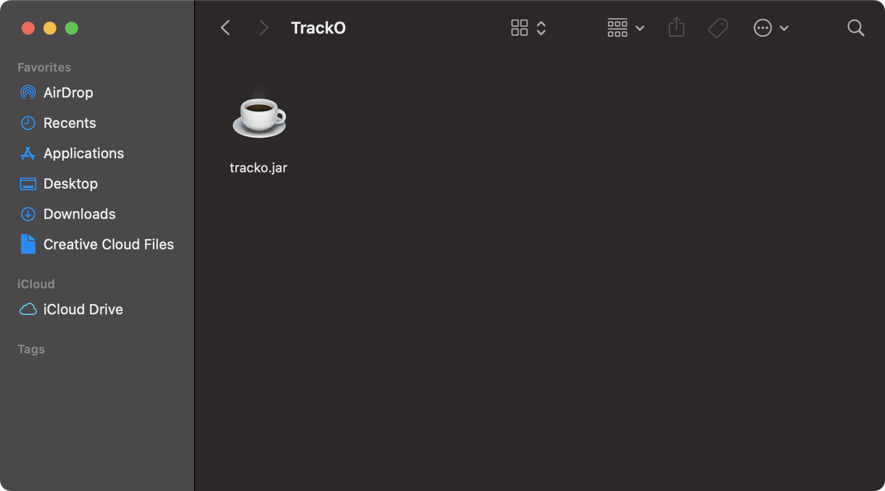

    

        :bulb: **Tip:**
        Any folder can be a home folder for your TrackO. In this case, the home folder is an 
        empty folder called `TrackO` located in the `Desktop`.
    

4. Double-click the file to start the app. The GUI similar to the one below should appear in a few seconds. The application will already contain some sample
   data. 
   

5. Head over to the [tutorial](#tutorial) section for a small walkthrough of some of TrackO's commands and use cases.

6. If you'd like to skip the tutorial, head over to the [features](#features) section for some of the more technical
   and in-depth explanation of each command's format a use case.

Our application is loaded with sample data to help visualize how the application works.
 

:bulb: **Tip:** Want start using TrackO from scratch? Enter the [`clear`](#clearing-all-data-in-tracko-clear) command to remove
the application's sample data.

[Back to top &#8593;](#welcome-to-trackos-user-guide)

--------------------------------------------------------------------------------------------------------------------

## Layout

The image below describes TrackO's layout:

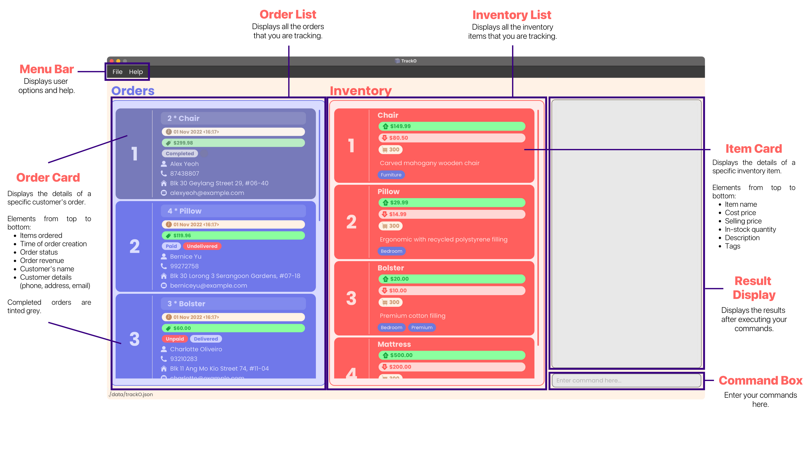

[Back to top &#8593;](#welcome-to-trackos-user-guide)

--------------------------------------------------------------------------------------------------------------------

## Tutorial

To get you started, here are some simple commands you can try out on our sample data before getting to know more of
TrackO's functionalities! 

1. We start off by getting to know how to manage your **inventory**!

   1. **Adding an item: `addi`**
       * Suppose you have `350` units of the item `Teddy bear keychain` currently in your physical inventory.
         Each unit costs `$0.89` to produce, and you will be selling them at `$3.50` each.
       * You can add this as an inventory item to TrackO by entering the following command into the [command box](#layout):  
         `addi i/Teddy bear keychains q/350 d/Great for kids! t/New sp/3.50 cp/0.89`
       * This command also adds a short description, `Great for kids!` to the item and tags it as `New`.

         You should see this item appear in TrackO at [index](#index) `5` as shown below:
   
         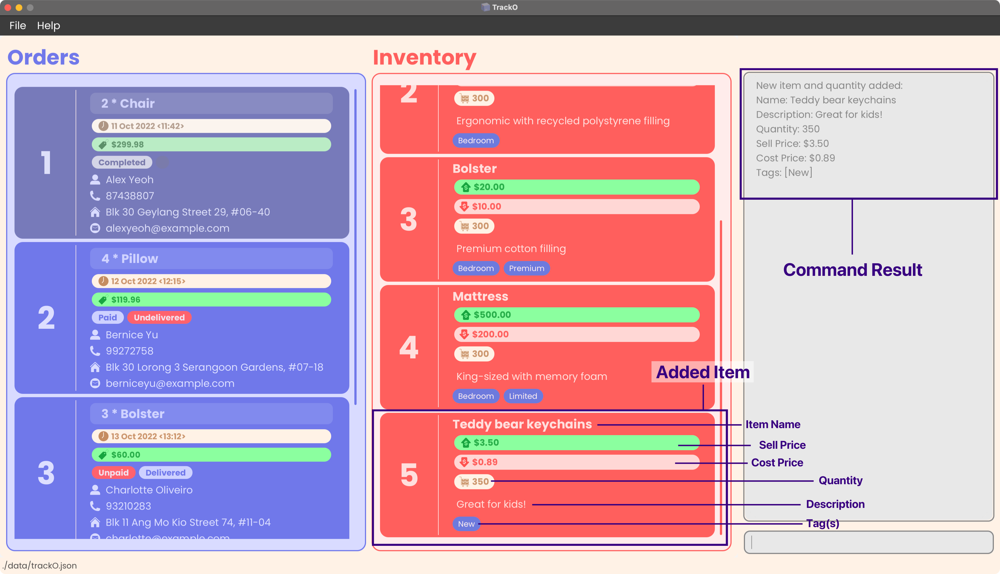
    
2. Next, we move on to managing your **orders**!
    1. **Adding an order: `addo`**
       * Suppose a customer by the name `Jonathan Chee` wants his order delivered to `43 Clementi Road, 639433`. He is 
        contactable by the email `JonChee@gmail.com` and at the phone number`96785944`. He has also ordered 1 unit of `Teddy bear keychain`.
       * Firstly, initiate the `addo` command with the customer details by entering the following command into the [command box](#layout):  
         `addo n/Jonathan Chee p/96785944 e/JonChee@gmail.com a/43 Clementi Road, 639433`
       * Next, to add the items ordered by the customer, enter the following command into the [command box](#layout):  
         `i/teddy bear keychains q/1`
       * Finally, enter `done` to finish adding the order to TrackO!
      
         You should see this order appear in TrackO at index 5 as shown below:

         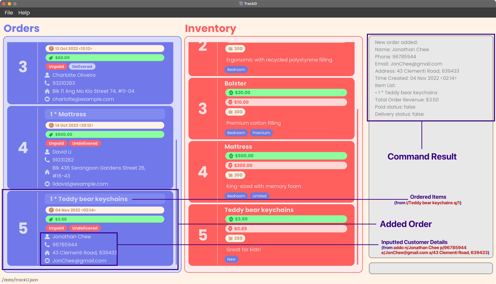
    
     
:bulb: **Note:**
     If an item is not in your inventory, TrackO does not allow you to add that item to an order!
     

   2. **Finding order(s): `findo`**
      * Our application allows you to search for orders by different fields (e.g. payment status, delivery status, customer details).
      * To find orders to be delivered to `Clementi` which have not been paid for, enter the following command to the [command box](#layout):  

        `findo -P a/Clementi`
   
        You should see these orders appear in the [order list](#layout), as shown below:
        
        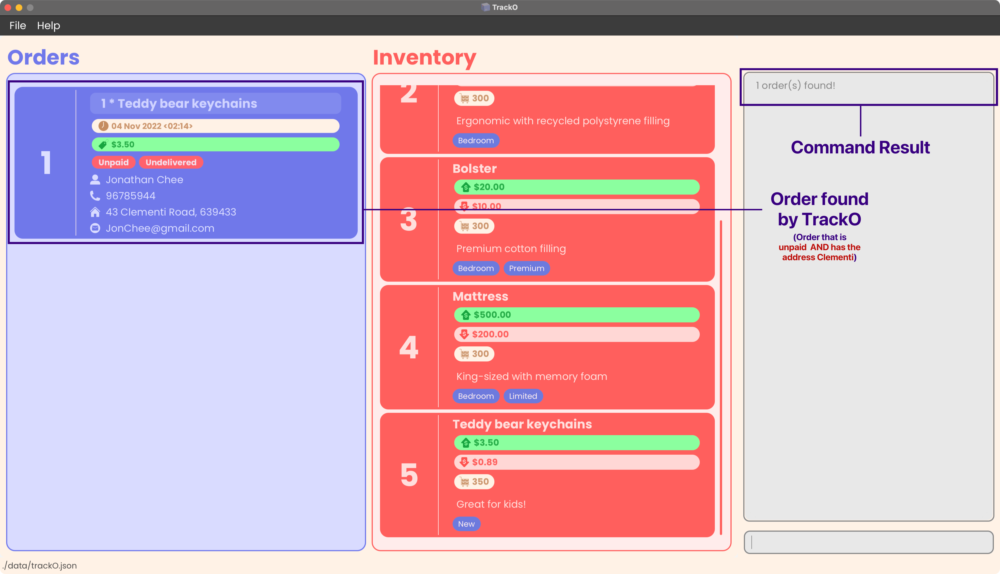
    
   3. **Listing order(s): `listo`**
       * To view all your orders again, enter `listo`.
          
         You should see these orders appear in the [order list](#layout), as shown below:
         
         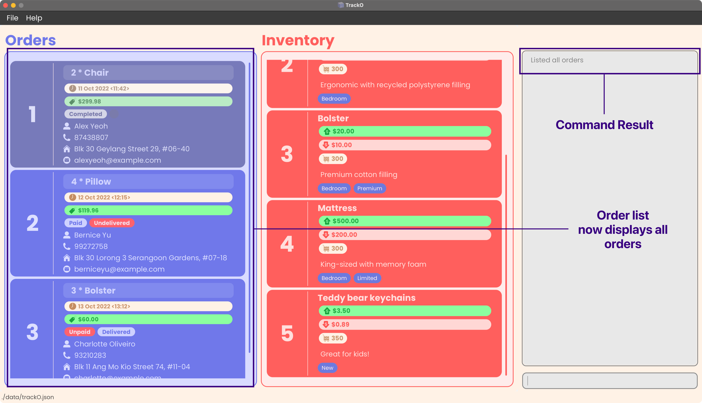

Now that you're done trying out some commands, you can enter `exit` to leave the application. We hope that this short tutorial was helpful! 
To check out more commands, you can head over to our [Features](#features) section.

[Back to top &#8593;](#welcome-to-trackos-user-guide)

-------

## Command guide

This section of the user guide helps to break down the formatting used for commands in this user guide.

* Words in `UPPER_CASE` are the [parameters](#parameter) to be supplied by the user. 
  e.g. in `addo n/NAME`, `NAME` is a parameter which can be used as `addo n/John Doe ...`.

* Parameters in square brackets `[]` are optional.  
  e.g. in `findo KEYWORD [MORE_KEYWORDS]`, only the first `KEYWORD` is compulsory. The rest are optional.

* Parameters can be in any order. 
  e.g. if the command specifies `i/ITEM_NAME q/QUANTITY`, `q/QUANTITY i/ITEM_NAME` is also acceptable.

* All command keywords (e.g. `addo`, `marko`, `editi`, etc.), prefixes (e.g. `p/`, `i/`, etc.)
  and flags(e.g. `-p`, `-D`, etc.) are **case-sensitive**. 
  e.g. `addo` is a valid command keyword, but `addO` is invalid. 

* If a parameter is expected only once in the command, but you specified it multiple times, only the last occurrence of the parameter will be taken. 
  e.g. if you specify `p/12341234 p/56785678`, only `p/56785678` will be taken.

* If you use parameters for commands that do not take in parameters (such as `listi`, `listo`,`clear` and `exit`), these parameters will be ignored. 
  e.g. if the command specifies `listi 123`, it will be interpreted as `listi`.

[Back to top &#8593;](#welcome-to-trackos-user-guide)

--------------------------------------------------------------------------------------------------------------------

## Features

This section contains information on each command's format and its use cases.

### <u>Inventory management</u>

The commands included in this section are related to inventory management. 
As of `v1.4`, there are 5 commands.

[Back to top &#8593;](#welcome-to-trackos-user-guide)

### Adding an inventory item: `addi`

Adds an item to the list of tracked inventory.

Format: `addi n/ITEM_NAME q/QUANTITY d/DESCRIPTION sp/SELL_PRICE cp/COST_PRICE [t/TAG]…​ `
- `SELL_PRICE` is the amount that is received as revenue per unit of item sold
- `COST_PRICE` is the amount that it costs to produce per unit of the item
- `SELL_PRICE` and `COST_PRICE` should be given as a number rounded to the nearest cent
- TrackO allows items to have a larger `COST_PRICE` than `SELL_PRICE`, where items can be sold at a loss

:bulb: **Tip:**
An inventory item's name must be more than 1 character long.

:bulb: **Tip:**
An inventory item can have 0 or more tags. A tag should only consist of 1 word. A tag **cannot** have more than 30 characters.

Example(s):

- When you enter `addi i/Keychain q/20 d/Silicone keychain with a metal buckle sp/3.50 cp/1 t/Souvenir` to our sample data,
TrackO will add `20 units` of `Keychain` to your inventory list, with the cost price of `$1` and selling price `$3.50`. 
The `Item` has the description `Silicone keychain with a metal buckle` and tag `Souvenir`.  
The following result will be displayed in the application:
  
  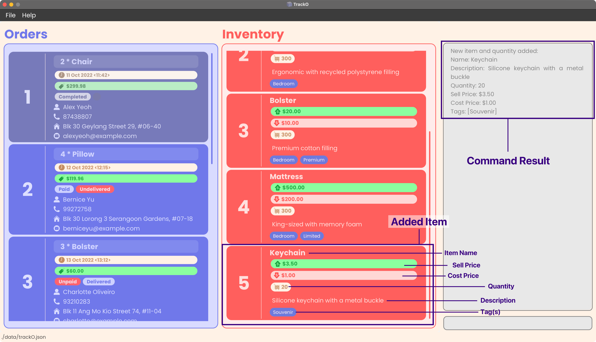

[Back to top &#8593;](#welcome-to-trackos-user-guide)

### Listing all inventory items: `listi`

Lists all the existing items in the store’s inventory.

Format: `listi`

Example(s):
- When you enter `listi` to our sample data, TrackO will list all the existing inventory items in your `Inventory List`.
Executing it on our sample data will display the following result:

  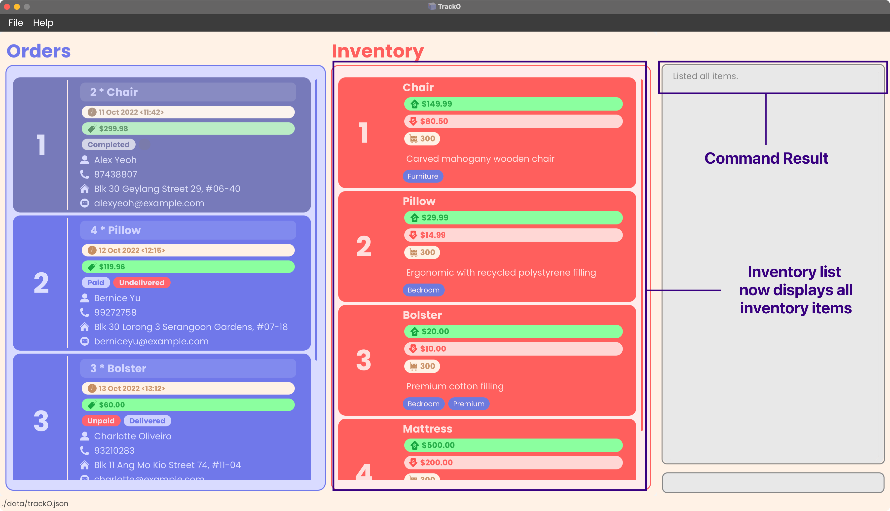

[Back to top &#8593;](#welcome-to-trackos-user-guide)

### Finding an inventory item: `findi`

Finds an inventory item whose name fits any of the given keywords.

Format: `findi KEYWORD [MORE_KEYWORDS]`

- The search is case-insensitive. e.g. `keychain` will match `Keychain`
- The order of the keywords does not matter. e.g. `pants long` will match `long pants`
- Only the name of the item is searched.
- Only full words will be matched. e.g. `key` will not match `Keychain`
- Items matching at least one keyword will be returned (i.e. OR search).
  e.g. `shirt` will return `dress shirt`, `collared shirt`

Example(s):
- When you enter `findi mattress` to our sample data, TrackO will find items that contain the word `mattress` in their 
  `Item Name` and display the following result:

  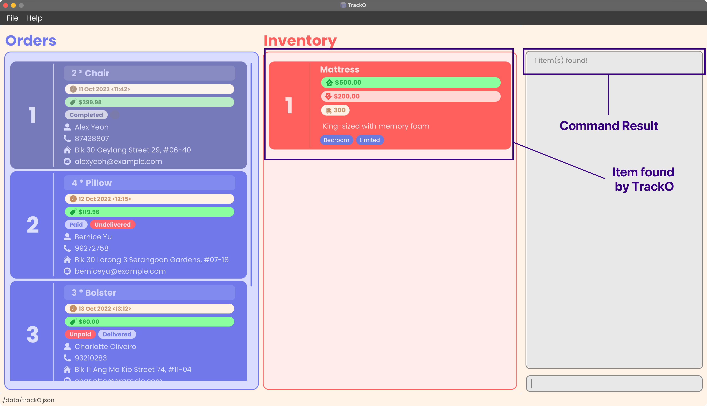
  
- When you enter `findi mattress chair` to our sample data, TrackO will find items that contain the word `mattress` or 
  `chair` in their `Item Name`, and display the following result:

  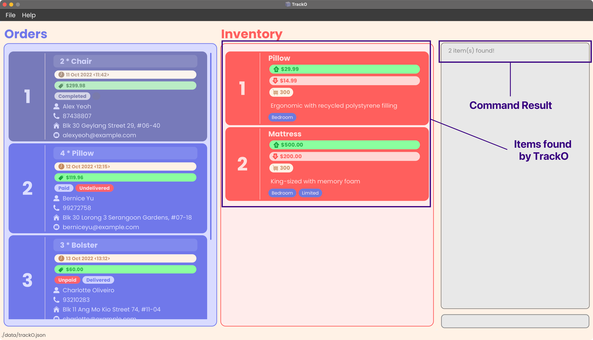

[Back to top &#8593;](#welcome-to-trackos-user-guide)

### Deleting an inventory item: `deletei`

Deletes the specified item from the list of tracked inventory.

Format: `deletei INDEX`

* Deletes the item at the specified `INDEX`.
* `INDEX` refers to the index number shown in the displayed inventory list.
* `INDEX` **must be a positive integer** 1, 2, 3, …​

:bulb: **Tip:**
TrackO does not allow items that are currently involved with unpaid or undelivered orders to be deleted.

Example(s):
* When you enter `deletei 1` to our sample data, TrackO deletes the first item, `Chair` from the inventory list. 
  Notice how the order involving `Chair` is completed, which allows the `Chair` to be deleted:

  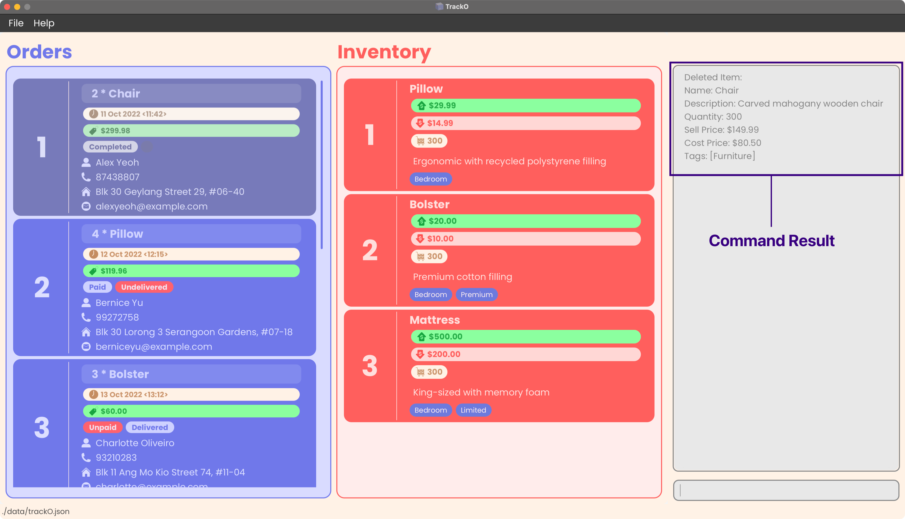
  
* When you enter `deletei 2` to our sample data, TrackO will remind you that the item you are trying to delete is currently
  involved in an order (in this case, the order at index `2`). You will not be able to delete the item until the order is 
  completed. To do so, see [`marko`](#marking-an-order-as-paiddelivered-marko).

  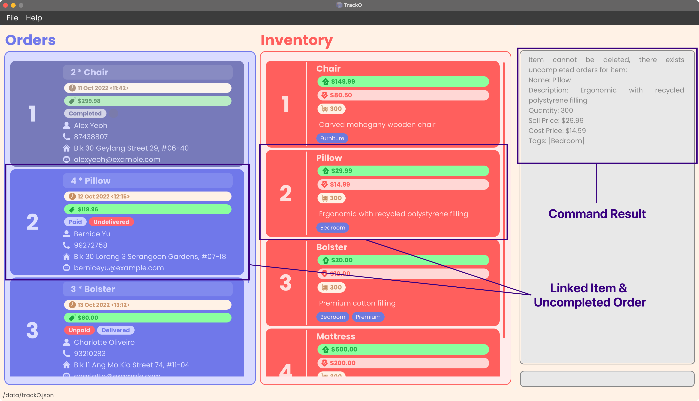

[Back to top &#8593;](#welcome-to-trackos-user-guide)

### Editing an inventory item: `editi`

Edits an existing item in the inventory list.

Format: `editi INDEX [i/ITEM_NAME] [q/QUANTITY] [d/DESCRIPTION] [sp/SELL_PRICE] [cp/COST_PRICE] [t/TAG]…​`

* Edits the item at the specified `INDEX`.
* `INDEX` refers to the index number shown in the displayed inventory list.
* `INDEX` **must be a positive integer** 1, 2, 3, …​
* You can remove all the item’s tags by typing `t/` without
  specifying any tags after it.

:bulb: **Tip:**
When an `Item` is involved in an order, you cannot edit its `Item Name`, `Sell Price`, and `Cost Price`.
You can only edit its `Quantity`, `Description`, `Tag`.

Example(s):

* When you enter `editi 1 i/Table q/200 d/Metal Table t/Fragile` to our sample data, TrackO will edit the item name, quantity, 
  description and tag of the 1st item, which was `Chair`, to be `Table`, `200`, `Metal Table` and `Fragile` respectively.
  
  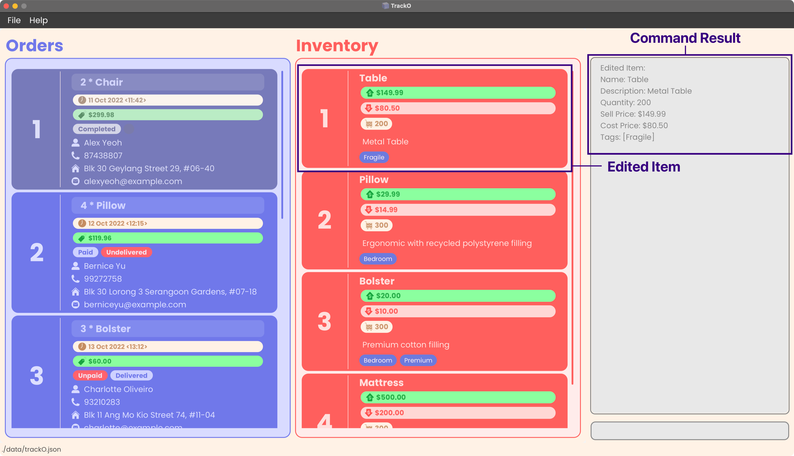
  
* When you enter `editi 1 t/`, TrackO removes the tags of the item at index `1`.

  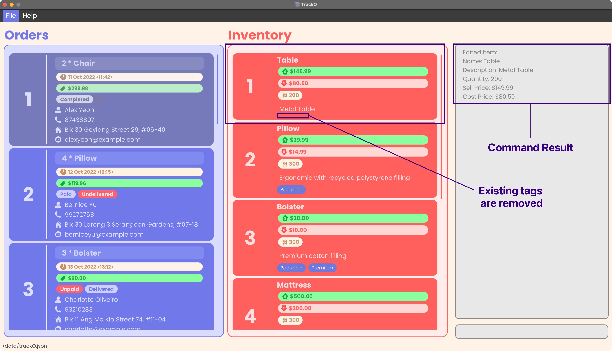

* When you enter `editi 3 i/Cookies d/Delicious home-made cookies` to our sample data, TrackO will remind you that the item
you are trying to edit is currently involved in an order (in this case, the order at index `3`) and the item will not be edited.
  
  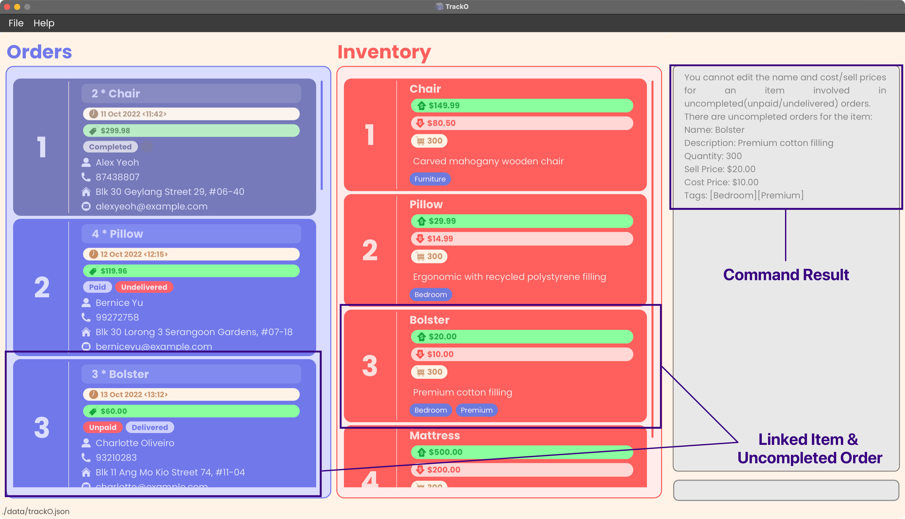
  
* When you enter `editi 3 q/500` to our sample data, the `Quantity` of the `Item` at index `3`, `Bolster`, will be restocked to
`500 units`.

  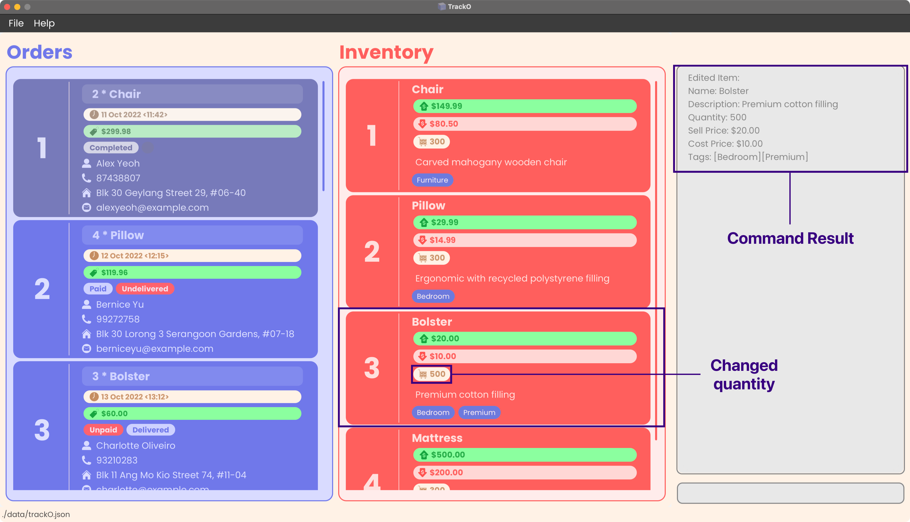

[Back to top &#8593;](#welcome-to-trackos-user-guide)

-------------------------------------------------------------------------

### <u>Order management</u>

The commands included in this section are related to order management.
As of `v1.4`, there are 7 commands.

[Back to top &#8593;](#welcome-to-trackos-user-guide)

### Adding an order: `addo`

Creates an order to be added to the list of orders tracked by TrackO.

* The added orders will track the time that it was created.

The first step is to initiate the command with the customer's data.

Format: `addo n/NAME p/PHONE e/EMAIL a/ADDRESS`

Example(s):
* `addo n/John Doe p/91234567 e/johndoe@example.com a/48 Westwood Terrace` creates an order for customer `John Doe`, who is contactable at `91234567` and `johndoe@example.com` and wants the order delivered to `48 Westwood Terrace`
* `addo n/Betty White p/92345678 e/bettywhite@example.com a/39 Ocean Drive` creates an order for customer `Betty White`, who is contactable at `92345678` and `bettywhite@example.com` and wants the order delivered to `39 Ocean Drive`

The next step is to add the order items and their order quantities to the created order.

:bulb: **Tip:**
You can repeat this step until all desired item data has been added to the created order.

Format: `i/ITEM_NAME q/QUANTITY`

* You must input an item name that matches an existing item in your inventory list.
* The name matching is case-insensitive, e.g. `i/pEn q/3` and `i/pen q/3` will both add `3` quantities (or units) of the inventory item `Pen` to the created order.
* You must input a quantity of integer value more than 0, e.g. `q/1` or `q/3` but NOT `q/0` or `q/-1`.
* If you input an item name that matches previously entered item, the quantity of the added item will be updated instead, e.g. `i/Box q/3` followed by `i/Box q/4` will only add a total of `4` quantities (or units) of `Box` to the created order

Lastly, to end the command, you can enter `done` to tell TrackO to track the order or `cancel` to completely abort the command.

Example(s):
- When you enter `addo n/John Doe p/91234567 e/johndoe@example.com a/48 Westwood Terrace`, followed by  `i/pillow q/5`,
then lastly `done`, you are creating an order for `John Doe`, who is contactable at `91234567` and `johndoe@example.com` 
and wants `5 Pillows` delivered to `48 Westwood Terrace`. Executing this command to our sample data will display the 
following result:

  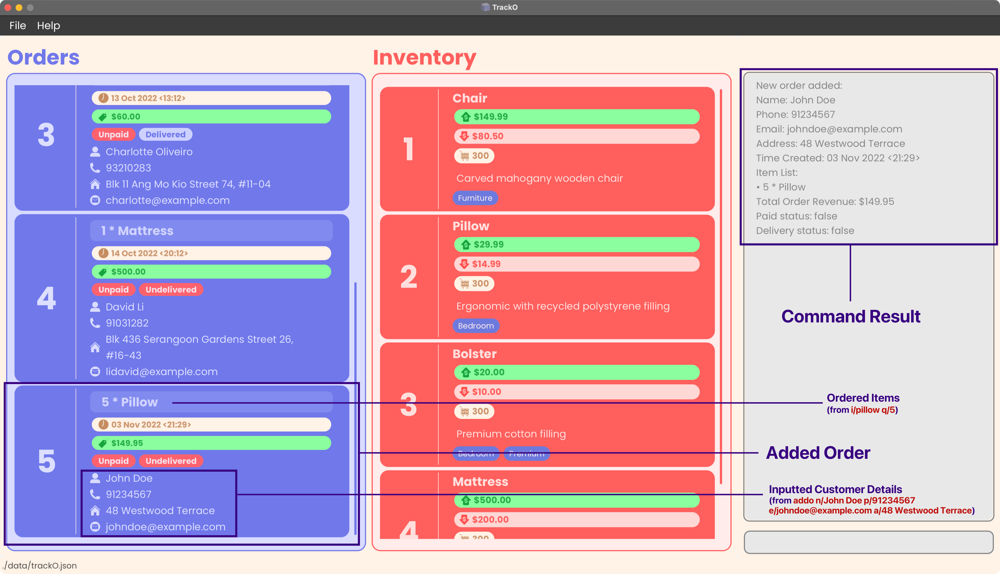

[Back to top &#8593;](#welcome-to-trackos-user-guide)

### Listing all orders: `listo`

Lists all the orders a store has.

Format: `listo`

Example(s):
- When you enter `listo` to our sample data, TrackO will list all the existing orders in the `Order List`. Executing it 
on our sample data will display the following result:
  
  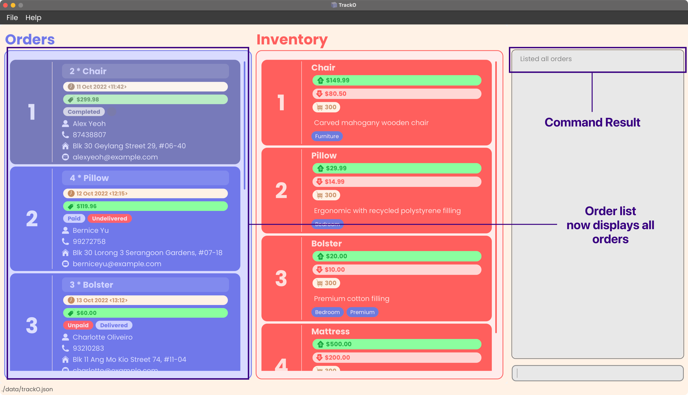

[Back to top &#8593;](#welcome-to-trackos-user-guide)

### Finding order(s): `findo`

Finds an order with item names containing any of the given keywords.

Format: `findo [-d OR -D] [-p OR -P]`   
`[i/ITEM_KEYWORD [MORE_ITEM_KEYWORDS]]`   
`[a/ADDRESS_KEYWORD [MORE_ADDRESS_KEYWORDS]]`   
`[n/NAME_KEYWORD [MORE_NAME_KEYWORDS]]`

* All 4 flags (`-d`, `-D`, `-p`, `-P`) are optional
  * `-d`: search for orders which are delivered
  * `-D`: search for orders which are not delivered
  * `-p`: search for orders which are paid
  * `-P`: search for orders which are not paid
* There are 3 prefixes (`a/`, `n/`, `i/`). If there are no flags present, at least one of the 3 prefixes must be used in the `findo` command
  * `a/`: searches by address
  * `n/`: searches by name
  * `i/`: searches by order item
* A prefix is only expected once in the command but if specified multiple times, only the last occurrence of 
the parameter will be taken in, e.g. `findo a/Clementi a/Geylang` will search for orders with `Geylang` 
in their address.

**:information_source: Notes:** 

* The search keywords used are case-insensitive.  
  e.g. `keychain` will match `Keychain`

* The order of the keywords does not matter.  
  e.g. `findo a/Geylang n/Alex` will also give the same results as `findo n/Alex a/Geylang`

* Only full words will be matched.  
  e.g. `Gardens,` will not match `Gardens` and `keychain` will not match `keychains`

* Orders matching at least one keyword will be returned (i.e. `OR` search).  
  e.g. `findo i/apple keychain` will return `apple painting` and `banana keychain`

Example(s):
- When you enter `findo n/Alex a/Geylang`, TrackO will display all orders with the name `Alex` and an address 
including the word `Geylang`. Executing it on our sample data will display the following result:

  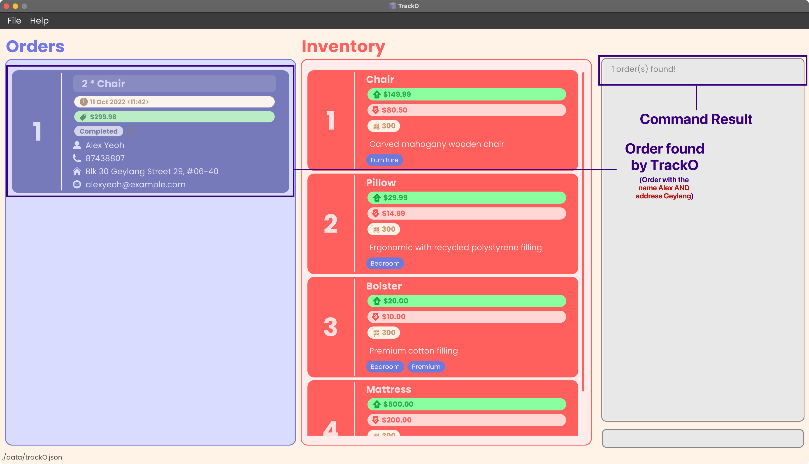

* When you enter `findo n/Charlotte Bernice a/Serangoon Ang Mo Kio`, TrackO will display all orders with the name 
`Charlotte` or `Bernice` and an address including the word `Serangoon` or `Ang Mo Kio`. Executing it on our sample
data will display the following result:
  
  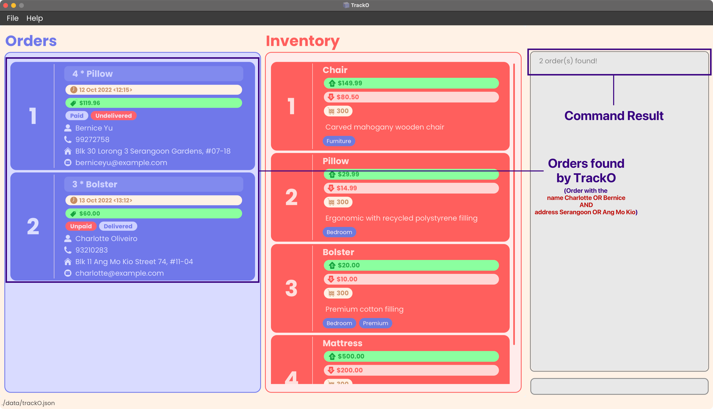

* When you enter `findo -d n/Charlotte`, TrackO returns all orders with the name `Charlotte` which have been `delivered`.
Executing it on our sample data will display the following result:

  
  
* When you enter `findo -d -p n/Alex` returns all orders with the name `Alex` which have been `paid` and `delivered`.
Executing it on our sample data will display the following result:

    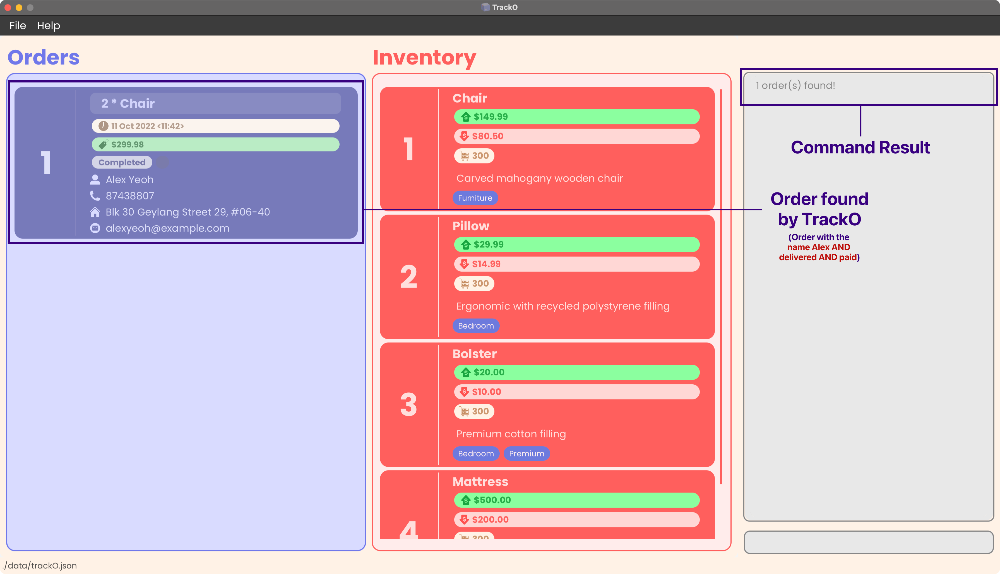

:bulb: **Tip:**
Completed orders are orders which have been paid **and** delivered. You can search using both -p **and** -d to find completed orders! 

[Back to top &#8593;](#welcome-to-trackos-user-guide)

### Sorting orders by time created: `sorto`

Sorts the displayed list of orders by the time at which they were created.

Format: `sorto new` or `sorto old`

* The keywords `new` and `old` are case-insensitive.
* `sorto new` sorts the order list such that the newest orders are at the top.
* `sorto old` sorts the order list such that the oldest orders are at the top.

Example(s):
* When you enter `listo` followed by `sorto old`, TrackO sorts all orders such that oldest orders are at the top.
Executing it on our sample data will display the following result:

  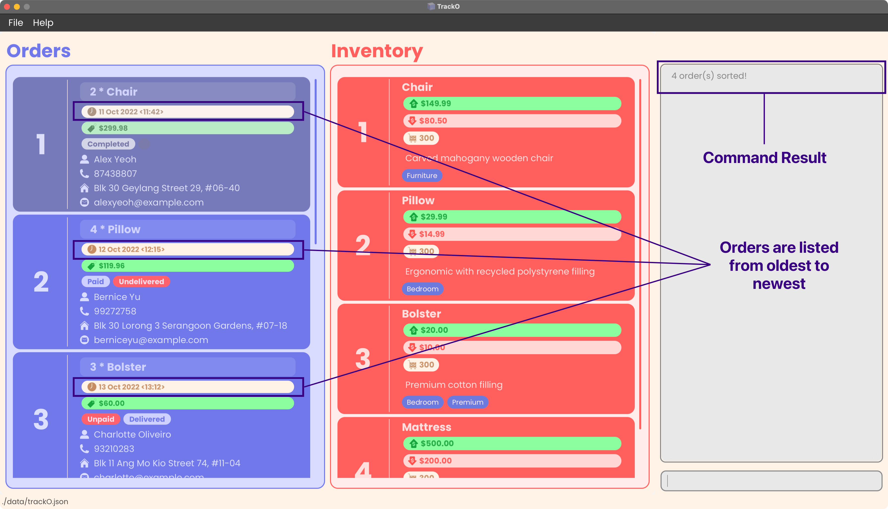

* For this example, let us follow the steps described below:
  1. First, enter `addo n/Jessica Doe a/Blk 12 Changi Road 20, #01-15 p/90876543 e/jessicadoe@gmail.com`, followed by
     `i/Chair q/5`, then `done` to add an order of `5 Chairs` for customer `Jessica Doe`. The application will display 
     the following result:
  
     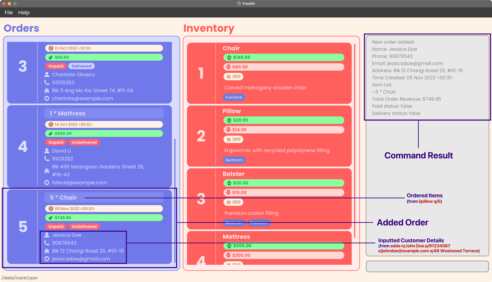
     
  2. Next, enter `findo i/Chair` to display all the orders that have `Chair` in their list of ordered items. The application
     will display the following result:
  
     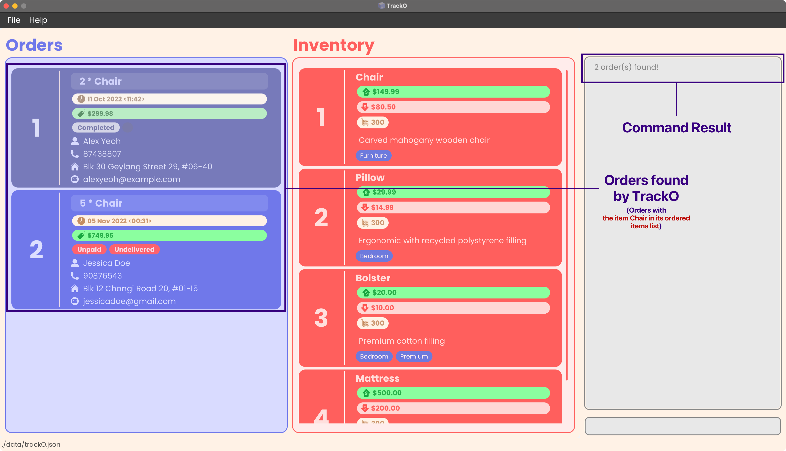
    
  3. When you enter `sorto new`, the currently displayed orders will be sorted from the newest to the oldest. The application 
     will display the following result:

     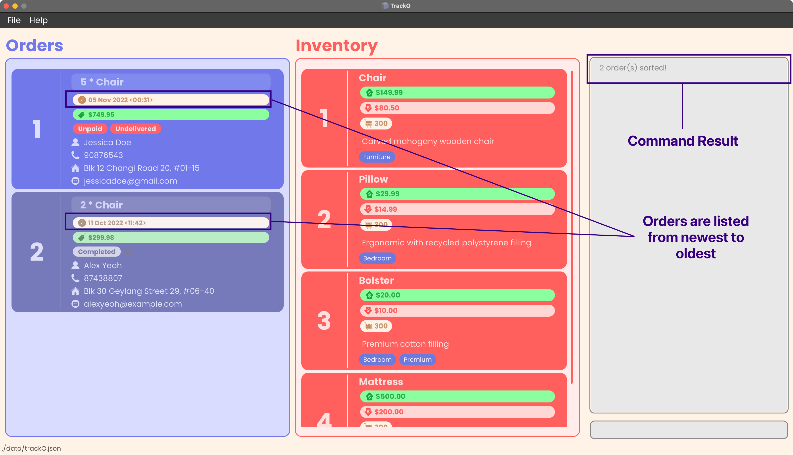

[Back to top &#8593;](#welcome-to-trackos-user-guide)

### Deleting an order: `deleteo`

Deletes an order from the list of tracked orders.

Format: `deleteo INDEX`

* Deletes the order at the specified INDEX.
* `INDEX` refers to the index number shown in the displayed order list.
* `INDEX` **must be a positive integer** 1, 2, 3, …

Example(s):
* When you enter `listo` followed by `deleteo 2`, TrackO deletes the 2nd order from the order list. Executing it on our 
sample data will display this result:

  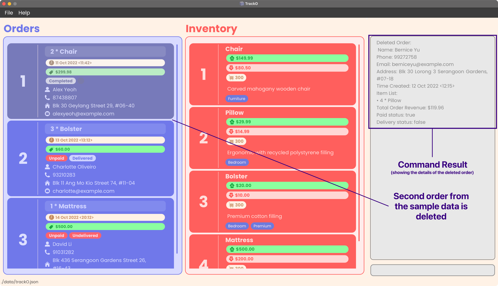

* For the second example, let us follow the steps described below:
  1. First, enter `findo i/Pillow`. TrackO will display orders with the item `Pillow` in their list of ordered items.  
     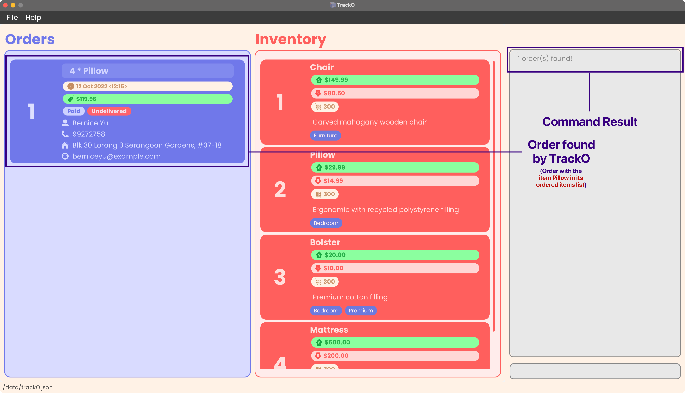
     
  2. When you enter `deleteo 1`, TrackO will delete the order currently displayed at index `1`, which is the order with 
     `Pillow` in its list of ordered items. It will display the following result:  
     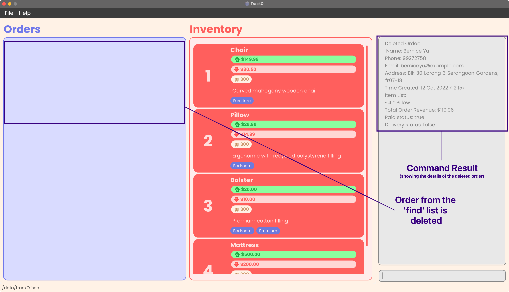
     
  3. To redisplay all your existing orders, enter `listo` and it should look like the following:  
     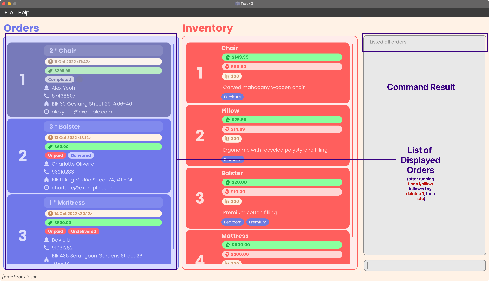

* For the third example, let us follow the steps described below:
  1. First, enter `sorto new`. TrackO will sort the orders from the newest to the oldest, with the most recent 
     order at the top.  
     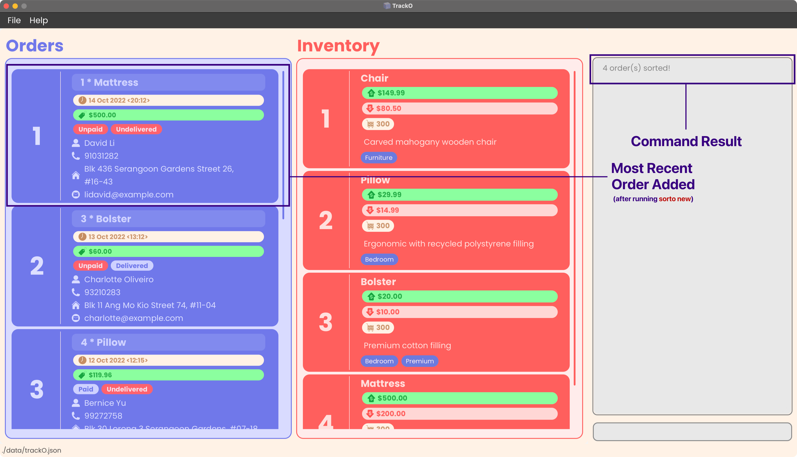
  
  2. When you enter `deleteo 1`, TrackO will delete the order currently displayed at index `1`, i.e. the most recent order.  
     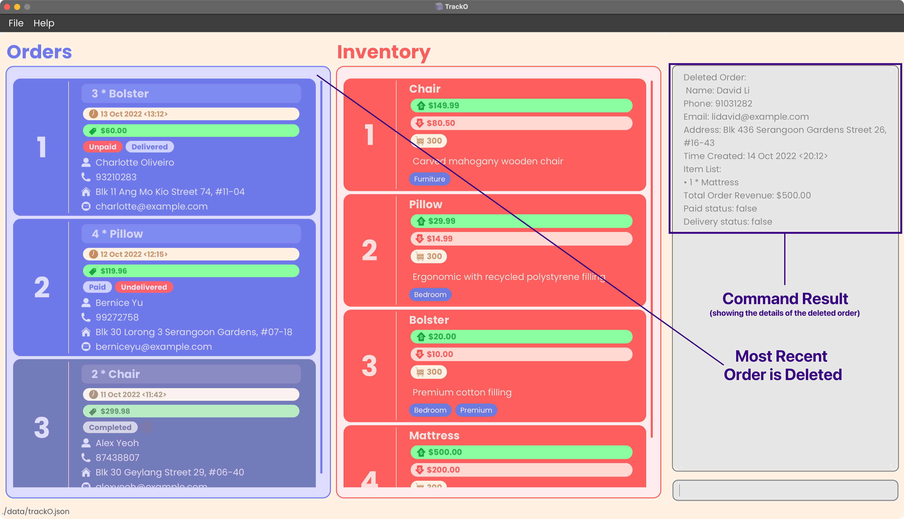

[Back to top &#8593;](#welcome-to-trackos-user-guide)

### Editing an order: `edito`

Edits an existing order in the order list.

Format: `edito INDEX [n/NAME] [p/PHONE] [e/EMAIL] [a/ADDRESS] [i/ITEM_NAME q/QUANTITY]`

* Edits the order at the specified `INDEX`.
* This feature is case-insensitive.
* The `INDEX` refers to the index number shown in the displayed order list.
* The `INDEX` **must be a positive integer** 1, 2, 3, …​
* Every field is optional, but if you were to include `i/ITEM_NAME`, you must also include 
  `q/QUANTITY`. Both fields need to be present to update an order's list of ordered items.
* You can only edit an order's list of ordered items to consist of items that exists in your inventory.   
  e.g. If your inventory does not have `Apples`, then you cannot edit any of your order's list of ordered items to `Apples`.
* Editing an item that does not exist in your order's list of ordered items, but exists in your inventory 
  will add the item to the order's list of ordered items.   e.g. Your inventory has `Apples` and `Bananas`. Right now, the third order's list of ordered items only has `Apples`.
  `edito 3 i/Bananas q/3` will add `3` `Bananas` to the third order's list of ordered items.
* Setting `q/0` to any item in the order's list of ordered items will remove the item from the list.   e.g. The fourth order's list of ordered items has
`2` `Apples` and `3` `Bananas`. Inputting `edito 4 i/Bananas q/0` will remove the `Bananas` from the fourth order's list of ordered items, leaving only
the `2` `Apples`.

**:information_source: Notes:** 

* Only orders which are not marked as `paid` or `delivered` can be edited.

* The order's created time cannot be edited.

* An order's paid status and delivery status also cannot be edited through this command. To modify those,
  see [`marko`](#marking-an-order-as-paiddelivered-marko) instead.

Example(s):
* For this example, let us follow the steps described below:
  1. When you enter `edito 2 n/Peter p/98765432 e/peter@email.com a/123 Apartment Unit, #05-11`, TrackO will edit the name, 
     phone, email, and address of the second order in the list to `Peter`,`98765432`, `peter@email.com`, and 
     `123 Apartment Unit, #05-11` respectively. It will display this result when executed on our sample data:  
     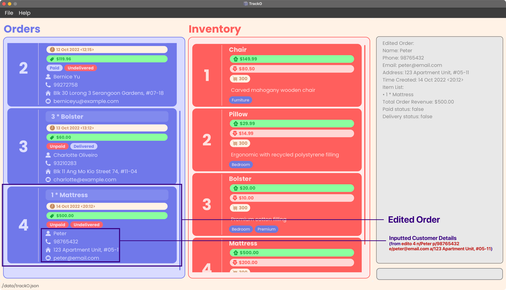
  
  2. Next, entering `edito 4 i/Chair q/5` will add `5 Chairs` to the fourth order's list of ordered items, as shown below:  
     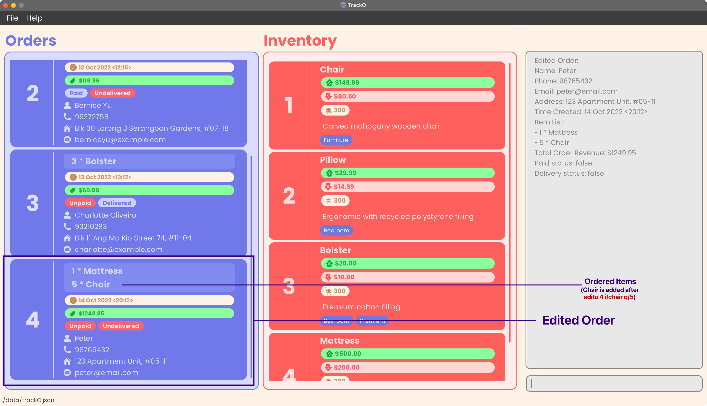
  
  3. Now, let us try entering `edito 4 i/mattress q/0`. Doing this will remove the item `Mattress` from the fourth order's 
     list of ordered items.  
     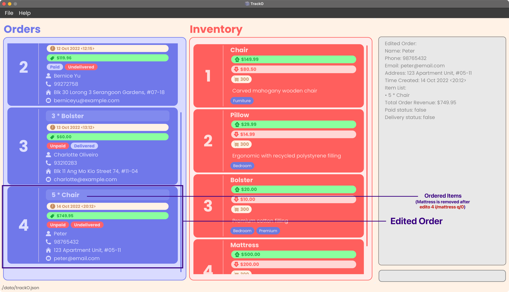
  
  4. Finally, try entering `edito 4 i/Chair q/10`. TrackO will update the `Quantity` of ordered `Chairs` in the fourth order to `10`.  
     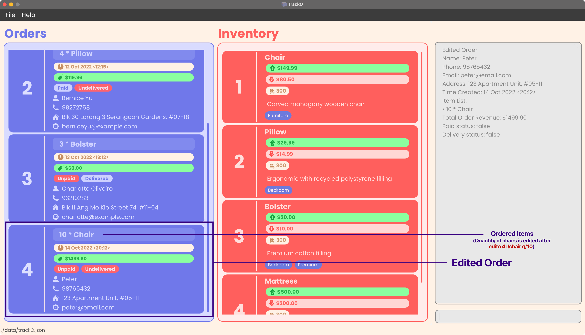

[Back to top &#8593;](#welcome-to-trackos-user-guide)

### Marking an order as paid/delivered: `marko`

Marks an existing order in the order list as paid and/or delivered. 

:information_source: **Warning:** `marko` is irreversible. This means that you cannot unmark an order that is marked as 
paid and/or delivered. 

Format: `marko INDEX [-p] [-d]`

* Marks the order at the specified `INDEX` as paid and/or delivered. 
* The 'INDEX' refers to the index number shown in the currently displayed list. 
* The 'INDEX' **must be a positive integer** 1, 2, 3, …​ 
* Flag `-p` marks the order as paid. 
* Flag `-d` marks the order as delivered. 
* Flags are case-sensitive and specific to the character. 
  e.g. `- p` is not a valid flag because there is a space between the `-` and `p`. 
* At least one of `-p` or `-d` must be present in your input. 
* Both `-p` and `-d` may be present in your input to mark an order as both paid and delivered.
* When an order is completed (marked as both `paid` and `delivered`), 
the colour of the particular order's card will be in a darker shade than an uncompleted order. 

:bulb: **Note:**
You can mark an order with insufficient stock as paid (to record payments for pre-orders) but you **cannot** 
mark an order as **delivered** if there is **insufficient stock** of the item(s) involved in the order.

Example(s):
* When you enter `marko 4 -p` on our sample data, TrackO will mark the order at index `4` in the currently displayed 
  list as `paid`, as shown below:  
  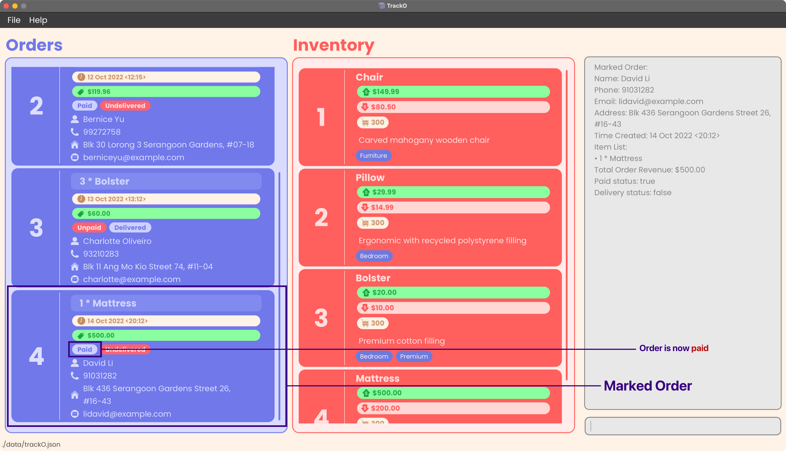

* When you enter `marko 2 -d` on our sample data, TrackO will mark the order at index `2` in the currently displayed
  list as `delivered`. However, because the order was previously marked as `paid`, the label will show `Completed` and 
  the color of the [order card](#layout) is tinted gray.  
  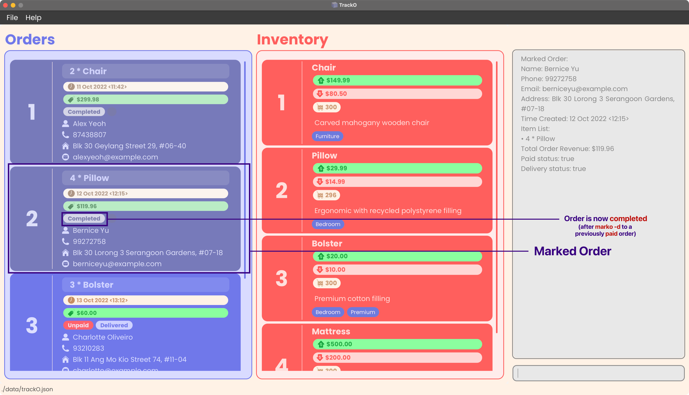

[Back to top &#8593;](#welcome-to-trackos-user-guide)

### <u>General features</u>

The commands included here are `TrackO`'s general features for you to clear the sample data, access the help window, 
or to exit the application.

[Back to top &#8593;](#welcome-to-trackos-user-guide)

### Getting help: `help`

Shows a window with a link to the user guide.

[Back to top &#8593;](#welcome-to-trackos-user-guide)

### Clearing all data in TrackO: `clear`

If you want clear all sample data present, `clear` is the command for you. 

The command `clear` clears all data (in both `Order List` and `Inventory List`) from TrackO.

1. Initiate the command to clear all data from TrackO.  
    Format: `clear`
2. Confirm the decision to clear all data.  
    Format: `confirm` or `cancel`
- `clear` will trigger a message which prompts for user confirmation to clear the data in TrackO.
- Keyword `confirm` : confirms the deletion of all data in TrackO. All data in TrackO will be removed after this input. 
- Keyword `cancel` : aborts the command to clear all data in TrackO. No changes to data in TrackO after this input. 
- `clear` ignores any input after. (e.g. `clear chair` will have the same effect as `clear`)

:bulb: **Tip:**
The keywords `confirm` and `done` are case-sensitive. Thus, only the keywords in lower case are accepted.

An empty TrackO should look like this:

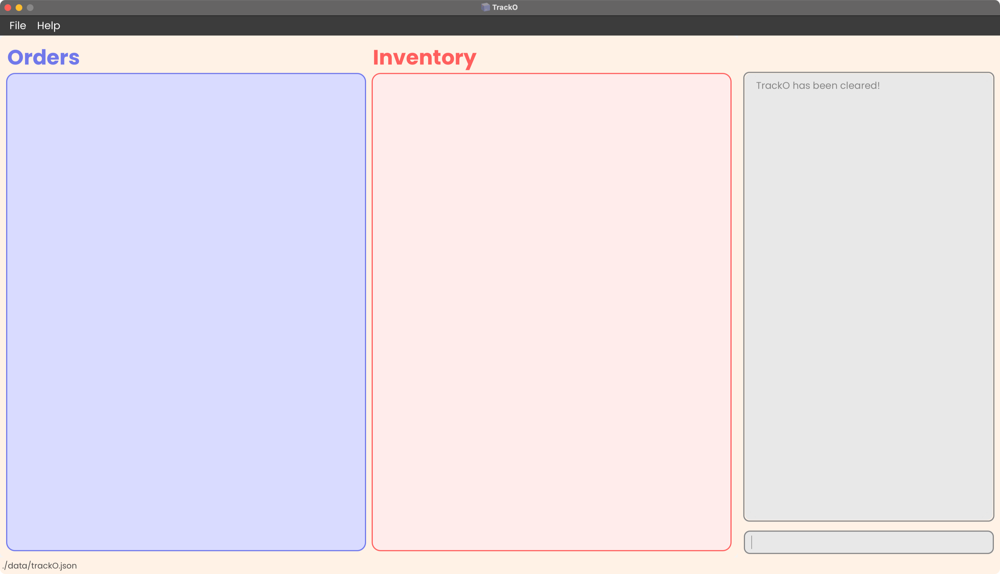

[Back to top &#8593;](#welcome-to-trackos-user-guide)

### Exiting TrackO: `exit`

Exits the program.

Format: `exit`

[Back to top &#8593;](#welcome-to-trackos-user-guide)

## Command summary

| Action                                                              | Format, Examples                                                                                                                                                                                                                                                                |
|---------------------------------------------------------------------|---------------------------------------------------------------------------------------------------------------------------------------------------------------------------------------------------------------------------------------------------------------------------------|
| [**Add An Inventory Item**](#adding-an-inventory-item-addi)         | `addi n/NAME q/QUANTITY d/DESCRIPTION [t/TAG]…​ sp/SELL_PRICE cp/COST_PRICE`   e.g. `addi n/Chair q/20 d/Swedish Wooden chair t/Furniture sp/79.99 cp/50.00 [t/TAG]…​`                                                                                                       |
| [**Delete An Inventory Item**](#deleting-an-inventory-item-deletei) | `deletei INDEX`  e.g. `deletei 3`                                                                                                                                                                                                                                            |
| [**List All Inventory Items**](#listing-all-inventory-items-listi)  | `listi`                                                                                                                                                                                                                                                                         |
| [**Find Inventory Item(s)**](#finding-an-inventory-item-findi)      | `findi KEYWORD [MORE_KEYWORDS]`   e.g. `findi blue shirt`                                                                                                                                                                                                                   |
| [**Edit An Inventory Item**](#editing-an-inventory-item-editi)      | `editi INDEX [i/ITEM_NAME] [q/QUANTITY] [d/DESCRIPTION] [sp/SELL_PRICE] [cp/COST_PRICE] [t/TAG]…​`  e.g. `editi 2 i/Table q/200 d/Metal Table t/Fragile`                                                                                                                     |
| [**Add An Order**](#adding-an-order-addo)                           | `addo n/NAME p/PHONE e/EMAIL a/ADDRESS`   e.g. `addo n/John Doe p/91234567 e/johndoe@example.com a/48 Westwood Terrace`   then, `i/ITEM_NAME q/QUANTITY` as many times as required   e.g. `i/Pillow q/2`  followed by `done` or `cancel`                            |
| [**List All Orders**](#listing-all-orders-listo)                    | `listo`                                                                                                                                                                                                                                                                         |
| [**Find Order(s)**](#finding-orders-findo)                          | `findo [-d OR -D] [-p OR -P]`   `[i/ITEM_KEYWORD [MORE_ITEM_KEYWORDS]]`   `[a/ADDRESS_KEYWORD [MORE_ADDRESS_KEYWORDS]]`   `[n/NAME_KEYWORD [MORE_NAME_KEYWORDS]]`, where all flags are optional and only 1 prefix is compulsory   e.g. `findo -d i/keychain n/Alex` |
| [**Delete An Order**](#deleting-an-order-deleteo)                   | `deleteo INDEX`   e.g. `deleteo 2`                                                                                                                                                                                                                                           |
| [**Edit An Order**](#editing-an-order-edito)                        | `edito INDEX [n/NAME] [p/PHONE] [e/EMAIL] [a/ADDRESS] [i/ITEM_NAME q/QUANTITY]`   e.g. `edito 2 n/Peter p/98765432 e/peter@email.com a/123 Apartment Unit, #05-11`                                                                                                           |
| [**Mark An Order**](#marking-an-order-as-paiddelivered-marko)       | `marko INDEX [-p] [-d]`   e.g. `marko 2 -d`, `marko 3 -p -d`                                                                                                                                                                                                                 |
| [**Sort Orders**](#sorting-orders-by-time-created-sorto)            | `sorto new` or `sorto old`                                                                                                                                                                                                                                                      |
| [**Getting Help**](#getting-help-help)                              | `help`                                                                                                                                                                                                                                                                          |
| [**Clear**](#clearing-all-data-in-tracko-clear)                     | `clear`  followed by `confirm` or `cancel` when prompted                                                                                                                                                                                                                    |
| [**Exit**](#exiting-tracko-exit)                                    | `exit`                                                                                                                                                                                                                                                                          |

[Back to top &#8593;](#welcome-to-trackos-user-guide)

## Glossary

### CLI

`CLI` stands for `Command Line Interface`. A `CLI` is a text-based user interface in which a program connects to the user. 
Through a `CLI`, users interact with a system or application by typing in commands in the form of text. The system then executes
the typed in command in response.

### GUI

`GUI` stands for `Graphical User Interface`. A `GUI` is a user interface that provides interactive visual components _(e.g. icons, etc.)_.
Through a `GUI`, users interact with a system or application by clicking on these elements. The system then responds to the user's actions
by updating the user interface.

### Parameter

`Parameter`s are the changeable inputs that you can give for a specific part of a command. For example, in the portion 
`i/NAME` of the `addi` command, `NAME` can be replaced with the input that is meaningful to you (e.g, `i/Cookie` or 
`i/Keychain`).

### Index

`Index` refers to the position of an order or item in the list. When we say that an `item` is at `Index 2`, it means that
the item is currently in the second position on the list.

[Back to top &#8593;](#welcome-to-trackos-user-guide)
