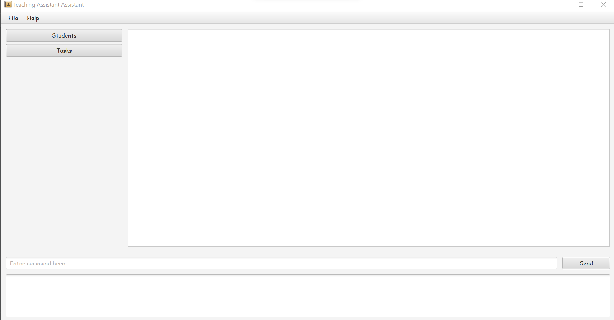

Teaching Assistant Assistant (TAA) is a **desktop app for Teaching Assistants (TA) to track student progress and tasks,
optimized for use via a Command Line Interface** (CLI) while still having the
benefits of a Graphical User Interface (GUI). If you can type fast, TAA can get your students and tasks management done
faster than traditional GUI apps.

* Table of Contents
{:toc}

---

## Quick start
1. Ensure you have Java `11` or above installed in your Computer.
2. Download the latest TAA.jar from [here](https://github.com/AY2223S1-CS2103T-T13-1/tp/releases/tag/v1.3.trial).
3. Copy the file to the folder you want to use as the home folder for your TAA.
4. Double-click the file to start the app. The GUI appear in your app should be similar as the one shown below:
   
5. Type the command in the command box and press Enter or click the Send button to execute. Some example commands you can try:
* `student add` `n/John p/96123456 e/john@example.com g/T03`: Adds a student named John to the TAA.
* `student edit` `1 g/T01`: Edits the student John to change his tutorial group from T03 to T01.
* `student delete` `1`: Removes the student John from TAA.
6. Refer to the Features below for details of each command.
---

## Features

**:information_source: Notes about the command format:** 

* Words surrounded in angled brackets (`&lt; &gt;`), e.g. `<taskName>` are the parameters to be supplied by the user. 
  e.g. in `tutorial add g/&lt;tutorialGroup&gt;`, `&lt;tutorialGroup&gt;` is a parameter which can be used as `tutorial add g/T03`.

* Optional parameters are indicated with `(optional)`. 
  e.g. `task add tn/&lt;taskName&gt; i/&lt;taskDescription&gt; d/&lt;taskDeadline&gt; s/&lt;student(s)&gt;(optional)`
  can be used as
  * `task add tn/Assignment #6 i/Recursion d/31/12/2023` or
  * `task add tn/Assignment #6 i/Recursion d/31/12/2021 s/Thomas Edison` or
  * `task add tn/Assignment #6 i/Recursion d/31/12/2021 s/Thomas Edison s/George Washington`

* Arguments with `(s)` after them can be used multiple times including zero times. 
  e.g. See the above example regarding `s/&lt;student(s)&gt;`.

* Parameters can be specified in any order. 
  e.g. if the command specifies `group expel g/&lt;groupName&gt; s/&lt;studentName&gt;`, both of the following commands are equivalent:
  * `group expel g/T03 s/Billy Boy`
  * `group expel s/Billy Boy g/T03`

* If a parameter is expected only once in the command but you specified it multiple times, only the last occurrence of the parameter will be taken. 
  e.g. if you specify `p/80000000 p/88888888`, only `p/88888888` will be taken.

* Extraneous parameters for commands that do not take in parameters (such as `help me`, `bye bye`) will be ignored. 
  e.g. if you enter `help me pretty p/lease`, it will be interpreted as `help me`.

### Add students : 

- Command `student add n/studentName p/phoneNumber e/email g/tutorialGroup(optional) t/tags(optional)`
- Adds a student with the given phone number, email, tutorial group, and tags to the list of students

Notes:
- `<studentName>` should be alphanumeric and should not be blank
- `<phoneNumber>` should only contain numbers, and it should be at least 3 digits long
- `<email>` should contain in the format: local-part@domain
  - local-part should only contain alphanumerics and these special characters, excluding the parentheses, (+_.-) 
  - local-part should not start or end with any special characters
  - domain should be at least 2 characters long
- `<tutorialGroup>` should follow the format Txx, where x is a numeric value, and it should not be blank
- `<tags>` should be alphanumeric with no white space

### Remove students : 

- Command `student delete <index>`
- Removes the student from the list of students with the given index

Notes:
- `index` must be a positive integer and must correspond to an existing student

### Edit students : 

- Command `student edit <index> n/<studentName>(optional) p/<studentPhone>(optional) e/<studentEmail>(optional) g/<tutorialGroup>(optional) t/<tag>(optional)`
- Edits the student by its given index with at least 1 variable specified to change.

Notes:
- `index` must be a positive integer and must correspond to an existing student

### List students : 

- Command `student list`
- Abbreviate with `students`
- Shows a list of all students

### Add new task : 

- Command `task add tn/<taskName> i/<taskDescription> d/<taskDeadline> s/<student(s)>(optional)`
- Adds a task to the list of tasks
- The task is initially assigned to no students if no student variable is entered

Notes:
- `taskName` should only contain alphanumeric characters and spaces, and it should not be blank
- `taskDescription` should not be blank
- `taskDeadline` should be in the format of DD/MM/YYYY with its days and months within range
- `student(s)`, referenced by their name, should exist

### Remove task : 

- Command `task delete <index>`
- Removes the indexed task from the list of tasks

Notes:
- `index` must be a positive integer and valid

### Edit task : 

- Command `task edit <index> tn/<taskName>(optional) i/<taskDescription>(optional) d/<taskDeadline>(optional) s/<student(s)>(optional)`
- Edits the task by its given index with at least 1 variable specified to change.

Notes:
- `index` must be a positive integer and valid

### List tasks : 

- Command `task list`
- Abbreviate with `tasks`
- Shows a list of tasks

### Mark tasks : 

- Command `task mark i/<taskNumber>`
- Marks the task with the task number on the list.

### Unmark tasks : 

- Command `task unmark i/<taskNumber>`
- Unmarks the task with the task number on the list.

### Assign a task to a student : 

- Command `task assign n/<taskName> n/<studentName>`
- Assign the task `taskName` to the student `studentName`.

### Add new tutorial group : 

- Command `tutorial add g/<tutorialGroup>`
- Adds the tutorial group with the name `tutorialGroup`

### Remove tutorial group : 

- Command `tutorial delete g/<tutorialGroup>`
- Removes the tutorial group with the name `tutorialGroup`

### Enroll a student into a group : 

- Command `student enroll i g/<groupName>`
- Enrolls the student at index i to the group named `groupName`

### Expel a student from a group `To be implemented` : 

- Command `group expel g/<groupName> g/<studentName>`
- Removes the student `studentName` from the group `groupName`.

### View the list of students in a group : 

- Command `group roster n/<groupName>`
- Displays a list of students enrolled in `groupName`.

### Display user guide url :

- Command `help me`
- Shows a popup with the user guide url in it

### Exit the app :

- Command `Bye bye`
- Exit and close the app

_Details coming soon..._

---

## FAQ

#### What if I forgot the command format?
- A list of commands will be displayed after the launch of the program.
- You can also click on the help button to view the commands.

#### Why I cannot add a student?
- Check the format of your add command. You can refer to the pop-up message or the help page for the command format.
- Check if the name of the new student belongs to another student.

#### Why I cannot enroll a student to a tutorial group? 
- Check whether the specified student and tutorial group exist.
- Check if you input the correct student name.
- 
#### What if I just want to modify one field of a student? Do I need to type out the rest fields?
- The student edit command supports any number of field changes. Omit the fields you do not wish to change.

#### How to remove the student filter?

#### 

_Details coming soon..._

---

## Command summary

| Action                            | Format, Examples                                                                                                                                                                 |
|-----------------------------------|----------------------------------------------------------------------------------------------------------------------------------------------------------------------------------|
| **Add student**                   | `student add n/studentName p/phoneNumber e/email g/tutorialGroup(optional) t/tags(optional)` e.g. `student add n/James Ho p/98765432 e/a@gmail.com g/T03 t/yearTwo`              |
| **Remove student**                | `student delete <index>` e.g. `student delete 1`                                                                                                                                 |
| **Edit student**                  | `student edit <index> n/<studentName>(optional) p/<studentPhone>(optional) e/<studentEmail>(optional) g/<tutorialGroup>(optional) t/<tag>(optional)` e.g. `student edit 1 g/T05` |
| **List students**                 | `student list`                                                                                                                                                                   |
| **Add task**                      | `task add tn/<taskName> i/<taskDescription> d/<taskDeadline> s/<student(s)>(optional)` e.g. `task add tn/Grade Mission 1 i/Due Tomorrow d/10/12/2022 s/James Ho`                 |
| **Remove task**                   | `task delete <index>` e.g. `task delete 1`                                                                                                                                       |
| **Rename task**                   | `task edit <index> tn/<taskName>(optional) i/<taskDescription>(optional) d/<taskDeadline>(optional) s/<student(s)>(optional)` `e.g. task edit 1 d/11/12/2020`                    |
| **List tasks**                    | `task list`                                                                                                                                                                      |
| **Mark task**                     | `task mark i/TASK_NUMBER` e.g. `task mark i/1`                                                                                                                                   |
| **Unmark task**                   | `task unmark i/TASK_NUMBER` e.g. `task unmark i/1`                                                                                                                               |
| **Assign task**                   | `task assign n/TASK_NAME n/STUDENT_NAME` e.g. `task assign n/Grade Mission 2 n/James Ho`                                                                                         |
| **Add tutorial group**            | `tutorial add g/<tutorialGroup>` e.g. `tutorial add g/T01`                                                                                                                       |
| **Remove tutorial group**         | `tutorial delete g/<tutorialGroup>` e.g. `tutorial delete g/T01`                                                                                                                 |
| **Enrol student**                 | `group enrol n/GROUP_NAME n/STUDENT_NAME` e.g. `group enrol n/CS2103T n/James Ho`                                                                                                |
| **Expel student**                 | `group expel n/GROUP_NAME n/STUDENT_NAME` e.g. `group expel n/CS2103T n/James Ho`                                                                                                |
| **View student roster for group** | `group roster n/GROUP_NAME` e.g. `group roster n/CS2103T`                                                                                                                        |
| **Display the user guide url**    | `help me`                                                                                                                                                                        |
| **Exit the app**                  | `bye bye`                                                                                                                                                                        |
