# HealthContact User Guide

HealthContact is a software for the receptionist of a family clinic who arranges telemedicine services between doctors and patients.
It helps to keep track of patient data, patient appointments and patient bills for the family clinic.

## Features
* Add a patient (addpatient)
* Add an appointment of a patient (addappointment)
* Add a bill of an appointment (addbill)
* Edit a patient (editpatient)
* Edit an appointment of a patient (editappointment)
* Edit a bill of an appointment (editbill)
* Find patient(s) (findpatient)
* Find appointment(s) (findappointment)
* Find bill(s) (findbill)
* Sort patients (sortpatient)
* Sort appointments (sortappointment)
* Sort bills (sortbill)
* Select a patient (selectpatient)
* Select an appointment (selectappointment)
* Set a bill to be paid (setpaid)
* Set a bill to be unpaid (setunpaid)
* List all patients, bills and appointments (list)
* Delete a patient (deletepatient)
* Delete an appointment (deleteappointment)
* Delete a bill (deletebill)
* Undo previous command (undo)
* Redo previous command (redo)
* Clear all data (clear)
* Exit the program (exit)
* Help (help)
* Saving the data
* Editing the data file

---
# Quick Start
1. Ensure you have Java 11 or above installed in your Computer.

2. Download the latest HealthContact.jar from [here](https://github.com/AY2223S1-CS2103T-W08-1/tp/releases).

3. Copy the file to the folder you want to use as the home folder for your HealthContact application.

4. Double-click the file to start the app. The GUI similar to the below should appear in a few seconds. Note how the app contains some sample data.


5. Type the command in the command box and press Enter to execute it. e.g. typing help and pressing Enter will open the help window.

6. Refer to the __Features__ below for details of each command.


# 1. Features

## 1.1 Add

### 1.1.1 Adding a patient `addpatient`, `ap`

Adds a patient to HealthContact with input information including name, phone number,
email address, home address, remarks and tags. 

* Name must be different from existing patient and name is case-insensitive. 

* Remark and tags are optional. 

* A patient can be added with multiple tags.

#### Command word 

`addpatient`, `ap`

#### Format

`Command word <prefix><input> ...`

#### Parameter List

|     | Prefix  | Meaning       | Input Constraint                                                                                       |
|-----|---------|---------------|--------------------------------------------------------------------------------------------------------|
| `*` | `n/`    | Name          | 1. Non-empty alphanumeric characters and spaces<br/> 2. Must be different from existing patient's name |
| `*` | `p/`    | Phone number  | Numbers with at least 3 digits                                                                         |
| `*` | `e/`    | Email address | `local-part@domain`                                                                                    |
| `*` | `a/`    | Home address  | Non-empty characters                                                                                   |
|     | `r/`    | Remark        | Any characters                                                                                         |
| `+` | `t/`    | Tag           | One alphanumeric word                                                                                  |

Notes on symbols in first column:

`*`  Must have (If they are duplicate prefixes, only the last one will be taken into account)

`+`  Can have multiple

#### Examples:

* `ap n/Bernice Yu a/#11-330, blk 775, Bishan e/b.yu@nus.edu.sg p/80880011 t/NUS t/staff` adds such patient.


* `ap n/Bernice Yu a/#01-01, blk 1, Changi Villege e/b.yu@ntu.edu.sg p/80880011 t/NTU t/staff` is unable 
to add such a patient because Bernice Yu already exists in HealthContact.


### 1.1.2 Adding an appointment of a patient `addappointment`, `aa`

Adds an appointment to HealthContact with input information including patient name, medical test,
slot, and doctor.

* Patient name input must strictly match the name of an existing patient.

* Slot must be in the format `yyyy-MM-dd HH:mm`, eg. `2022-11-12 13:00`.

* The input of four parameters must be different with the combination in other appointments.

* Doctor and medical test are case-sensitive.

* The input of four parameters must be different with the combination in other appointments, taking into consideration that doctor and medical test are case-sensitive, while patient name is case-insensitive.

* The onus is on the user to check and ensure the following before adding an appointment:
  * The appointment times for different patients with the same doctor do not clash with one another.
  * The same patient/doctor does not have multiple appointments with times that clash with one another.

#### Command word

`addappointment`, `aa`

#### Format

`Command word <prefix><input> ...`

#### Parameter List

|     | Prefix | Meaning      | Input Constraint                                                                        |
|-----|--------|--------------|-----------------------------------------------------------------------------------------|
| `*` | `n/`   | Name         | 1. Non-empty alphanumeric characters and spaces<br/> 2. must be existing patient's name |
| `*` | `s/`   | Slot         | Valid date and time in format `yyyy-MM-dd HH:mm`                                        |
| `*` | `d/`   | Doctor name  | Non-empty alphanumeric characters and spaces                                            |
| `*` | `t/`   | Medical test | Non-empty characters                                                                    |

Notes on symbols in first column:

`*`  Must have (If they are duplicate prefixes, only the last one will be taken into account)

`+`  Can have multiple

#### Examples:

* `aa n/Bernice Yu s/2021-10-11 12:00 d/Dioni Yong t/X-Ray` adds such appointment.


* Executing `aa n/Bernice Yu s/2021-10-11 12:00 d/Dioni Yong t/X-Ray` again is unable
to add such an appointment because the appointment with the combination of the four inputs
parameters already exists in HealthContact.


* `aa n/Bernice Yu s/2022-01-23 09:00 d/Dioni Yong t/CT` adds another appointment for Bernice Yu.


### 1.1.3 Adding a bill of an appointment `addbill`, `ab`

Adds a bill attached to an appointment with input information including amount and bill date.

* An amount must be positive number with at most 2 decimal places.

* One appointment can be attached to no more than one bill.

* A bill date must be in the format `yyyy-MM-dd`, eg. `2022-11-12`.

* The onus is on the user to check that the bill date entered is the same as the appointment date or later.

#### Command word

`addbill`, `ab`

#### Format

`Command word <index of appointment> <prefix><input> ...`

#### Parameter List

|      | Prefix  | Meaning              | Input Constraint                                                                                                 |
|------|---------|----------------------|------------------------------------------------------------------------------------------------------------------|
| `**` | NA      | Index of appointment | 1. Positive integer <br/> 2. Appears in the appointment list<br/>3. The indicated appointment does not have bill |
| `*`  | `a/`    | Amount               | Positive number with at most 2 decimal place                                                                     |
| `*`  | `d/`    | Bill Date            | Valid date in format `yyyy-MM-dd`                                                                          |

Notes on symbols in first column:

`**` Must be directly after command word

`*`  Must have (If they are duplicate prefixes, only the last one will be taken into account)

#### Examples:

* `ab 1 a/1200.00 d/2021-11-11` adds such bill to the first appointment in the displayed list.


* Executing `ab 1 a/1500.00 d/2021-11-13` is unable to add such bill because the first appointment
in the displayed list already has an attached bill.


## 1.2 Edit

### 1.2.1 Editing a patient `editpatient` `ep`

Edits a patient's information, such as name, phone number, address, email, remarks, and tags.

Format: `editpatient INDEX [n/NAME] [p/PHONE] [e/EMAIL] [a/ADDRESS] [r/REMARK] [t/TAG]…​`
         `ep INDEX [n/NAME] [p/PHONE] [e/EMAIL] [a/ADDRESS] [r/REMARK] [t/TAG]…​`

* Edits the patient at the specified `INDEX`. The index refers to the index number shown in the displayed patient list. 
  The index **must be a positive integer** 1, 2, 3, …​
* At least one of the optional fields must be provided.
* Existing values will be updated to the input values.
* When editing tags, the existing tags of the person will be removed i.e adding of tags is not cumulative.
* You can remove all the patient’s tags by typing `t/` without
  specifying any tags after it.

Examples:
* `editpatient 1 p/91234567 e/johndoe@example.com` Edits the phone number and email address of the 1st patient to be 
   `91234567` and `johndoe@example.com` respectively.
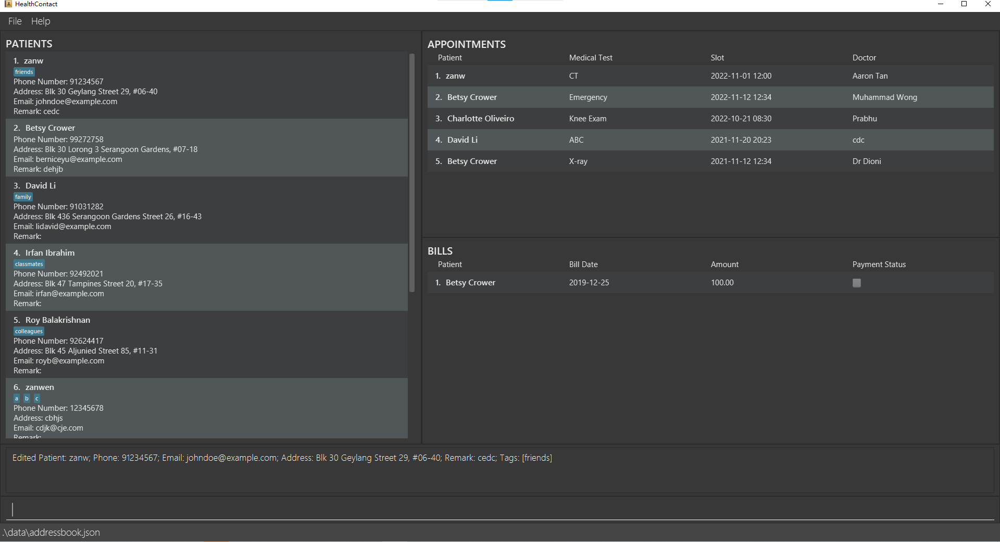

* `editpatient 2 n/Betsy Crower t/` Edits the name of the 2nd patient to be `Betsy Crower` and clears all existing tags.


### 1.2.2 Editing an appointment of a patient

Edits an appointment of a patient, such as name, medical test, slot, and doctor.

Format: `editappointment INDEX [n/NAME] [t/MEDICAL_TEST] [s/SLOT<yyyy-MM-dd HH:mm>] [d/DOCTOR]`
         `ea INDEX [n/NAME] [t/MEDICAL_TEST] [s/SLOT<yyyy-MM-dd HH:mm>] [d/DOCTOR]`

* Edits the appointment at the specified `INDEX`.
  The index refers to the index number shown in the displayed appointment list.
* The index **must be a positive integer** 1, 2, 3, …​
* At least one of the optional fields must be provided.
* Existing values will be updated to the input values.

Examples:
* `editappointment 1 n/zanw t/CT Scan s/2021-03-01 10:00 d/Tan` Edits the name, medical test, slot, 
   and doctor of the 1st appointment to be `zanw`, `CT Scan`, `2021-03-01 10:00`, and `Tan` respectively.


### 1.2.3 Editing a bill of an appointment

Edits a bill of an appointment.

Format: `editbill INDEX [a/amount] [d/bill date]` `eb INDEX [a/amount] [d/bill date]`

* Edits the bill at the specified `INDEX`. The index refers to the index number shown in the displayed bill list. 
  The index **must be a positive integer** 1, 2, 3, …​
* At least one of the optional fields must be provided.
* Existing values will be updated to the input values.

Examples:
* `editbill 1 a/100` Edits the amount of the 1st bill to be `100`.
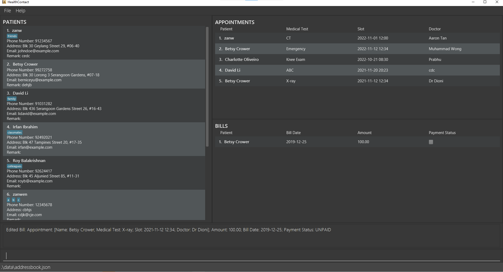

* `editbill 1 d/2020-10-10` Edits the bill date of the 1st bill to be `2020-10-10`.


## 1.3 Find

### 1.3.1 Finding patients `findpatient` `fp`

Filters patients by one or more fields using their prefixes, and their corresponding inputs (numbers, letters,
special characters).

Format:
```findpatient <prefix><input> ...``` or ```fp <prefix><input>...```

* The command words are ``findpatient`` or ``fp``.
* The prefixes are n/ for Name, p/ for Phone, e/ for Email, a/ for Address, r/ for Remark and t/ for Tags.
* The filter is case-insensitive. e.g. han will match Han
* Can filter using full words or partial words. e.g. han will match Hannah
* Can filter using a combination of inputs for a field, according to the constraints of the field.
  e.g. e/@gmail.com
* Can filter using one field or multiple fields at once. e.g. n/John p/91234567
* If there are no prefixes keyed in, an error message will be shown with the correct command format.
* If the input after a prefix is empty/invalid, an error message with the constraint of the field will be shown.

Examples:
* ```findpatient n/ale``` returns ``Alex Yeoh`` and ``alex tan``.

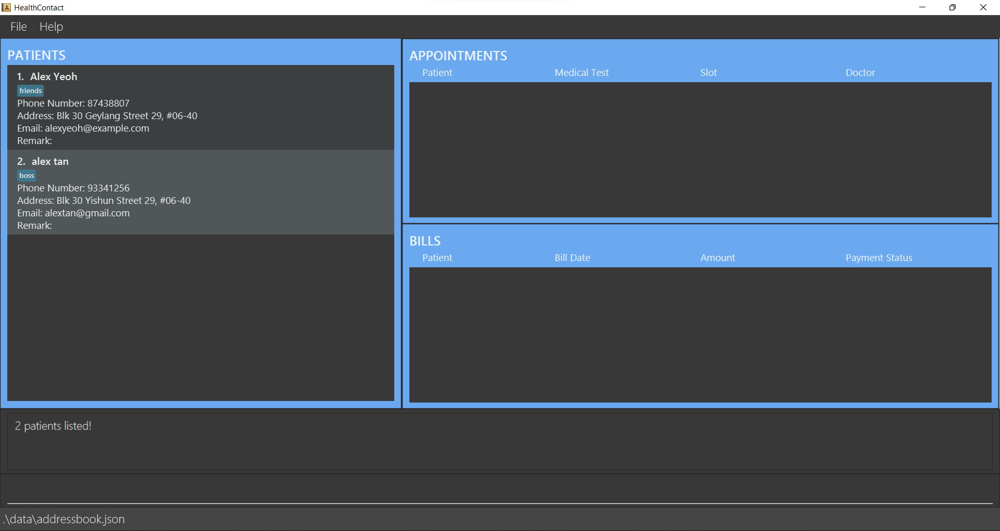

* ```fp t/friends t/colleagues n/bernice``` returns only ``Bernice Yu`` with the tags ``friends`` and ``colleagues``.

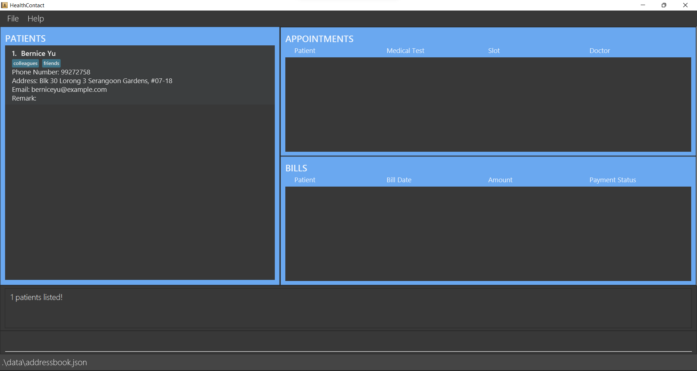

### 1.3.2 Finding appointments `findappointment` `fa`

Filters appointments by one or more fields using their prefixes, and their corresponding inputs (numbers, letters,
special characters).

Format:
```findappointment <prefix><input> ...``` or ```fa <prefix><input>...```

* The command words are `findappointment` or `fa`.
* The prefixes are n/ for Name, t/ for Medical Test, s/ for Slot and d/ for Doctor.
* The filter is case-insensitive. e.g. han will match Han
* Can filter using full words or partial words. e.g. han will match Hannah
* Can filter using a combination of inputs for a field, according to the constraints of the field.
  e.g. s/x-ray
* Can filter using one field or multiple fields at once, but each field can only be used once in a single command.
* If there are no prefixes keyed in, an error message will be shown with the correct command format.
* If the input after a prefix is empty/invalid, an error message with the constraint of the field will be shown.

Examples:
* ```findappointment t/x-ray``` returns ``Bernice Yu`` with "X-ray" appointment.


* ```fa d/Dr Tan n/Alex``` returns only ``Alex Yeoh``'s appointment with "Dr Tan".


### 1.3.3 Finding bills `findbill` `fb`

Filters bills by one or more fields using their prefixes, and their corresponding inputs (numbers, letters,
special characters).

Format:
```findbill <prefix><input> ...``` or ```fb <prefix><input>...```

* The command words are `findbill` or `fb`.
* The prefixes are n/ for Name, p/ for Payment Status, d/ for Date and a/ for Amount.
* The filter is case-insensitive. e.g. han will match Han
* Can filter using full words or partial words. e.g. han will match Hannah
* Can filter using a combination of character(s) for a field, according to the constraints of the field.
  e.g. a/23.45
* Can filter using one field or multiple fields at once, but each field can only be used once in a single command.
* If there are no prefixes keyed in, an error message will be shown with the correct command format.
* If the input after a prefix is empty/invalid, an error message with the constraint of the field will be shown.

Examples:
`findbill n/Ber p/unpaid` returns Bernice's unpaid bill


## 1.4 Sort

### 1.4.1 Sorting patients `sortpatient` 

Sorts patients by a single field

Format:
```sortpatient <prefix><input> ...```

* The command word is `sortpatient`.
* The prefixes are c/ for Criteria and o/ for Order.
* The criteria can be Name of patient (name), Phone number of patient (phone), Email address of patient (email), Address of patient (address).
* The order can be Ascending (asc) or Descending (desc).
* If there are no prefixes keyed in, an error message will be shown with the correct command format.
* If the input after a prefix is empty/invalid, an error message with the constraint of the field will be shown.

Examples:
* ```sortpatient c/name o/asc``` returns patients sorted by name in ascending order.

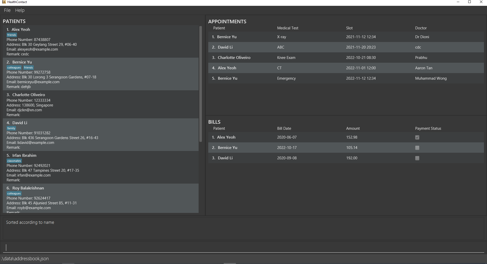

* ```sortpatient c/phone o/desc``` returns patients sorted by phone number in descending order.


### 1.4.2 Sorting appointments `sortappointment`

Sorts appointments by a single field

Format:
```sortappointment <prefix><input> ...```

* The command word is `sortappointment`.
* The prefixes are c/ for Criteria and o/ for Order.
* The criteria can be Name of patient (name), Medical Test of appointment (test), Slot of appointment (slot) and Doctor of appointment (doctor).
* The order can be Ascending (asc) or Descending (desc).
* If there are no prefixes keyed in, an error message will be shown with the correct command format.
* If the input after a prefix is empty/invalid, an error message with the constraint of the field will be shown.

Examples:
* ```sortappointment c/test o/asc``` returns appointments sorted by medical test in ascending order.

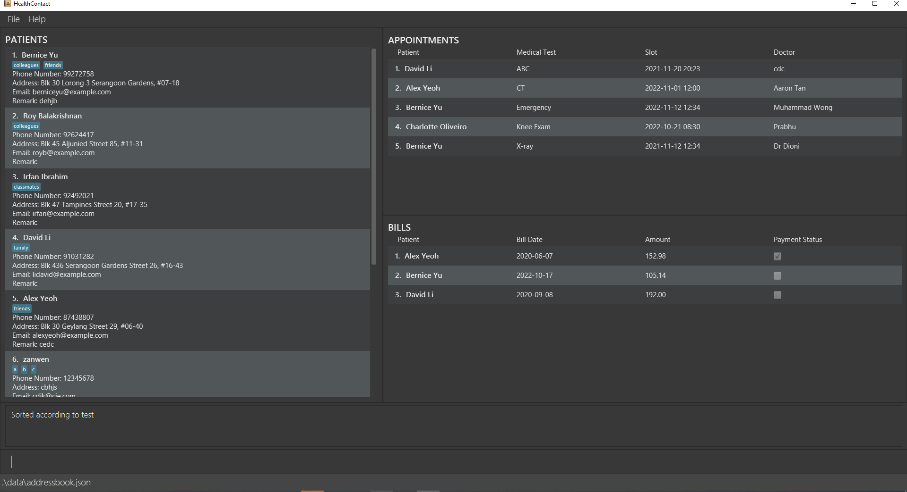

* ```sortappointment c/doctor o/desc``` returns appointments sorted by doctor in descending order.

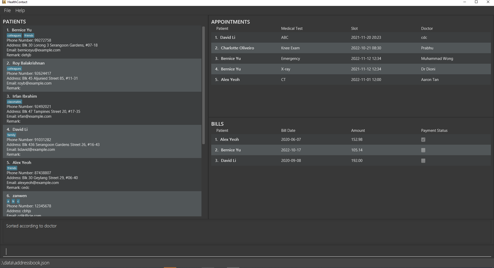

### 1.4.3 Sorting bills `sortbill`

Sorts bills by a single field

Format:
```sortbill <prefix><input> ...```

* The command word is `sortbill`.
* The prefixes are c/ for Criteria and o/ for Order.
* The criteria can be Name of patient (name), Amount (amount), Bill date (date), Payment status (status).
* The order can be Ascending (asc) or Descending (desc).
* If there are no prefixes keyed in, an error message will be shown with the correct command format.
* If the input after a prefix is empty/invalid, an error message with the constraint of the field will be shown.
* If the criteria is Payment status, Ascending will show bills which are paid first and Descending will show bills which are unpaid first.


Examples:
* ```sortbill c/amount o/asc``` returns bills sorted by amount in ascending order.


* ```sortbill c/status o/desc``` returns bills sorted by payment status in descending order.


## 1.5 Select

Select commands are the fast way to show the relative information to the selected item.

### 1.5.1 Selecting a patient `selectpatient`, `slp`

Selects a patient by index in the patient list. Filter the appointment list and bill list
so that these two lists shows the appointments and bills for the selected patient only.

#### Command word

`selectpatient`, `slp`

#### Format

`Command word + <index of patient>`

#### Parameter List

|      | Prefix  | Meaning          | Input Constraint                                           |
|------|---------|------------------|------------------------------------------------------------|
| `**` | NA      | Index of patient | 1. Positive integer <br/> 2. Appears in the patient list   |

Notes on symbols in first column:

`**` Must be directly after command word

#### Examples:

* `slp 1` shows the appointments and bills for the first patient in the patient list.


### 1.5.2 Selecting an appointment `selectappointment`, `sla`

Selects an appointment by index in the appointment list. Filter the bill list
so that bill list shows the bill for the selected appointment only.

#### Command word

`selectappointment`, `sla`

#### Format

`Command word + <index of appointment>`

#### Parameter List

|      | Prefix  | Meaning              | Input Constraint                                             |
|------|---------|----------------------|--------------------------------------------------------------|
| `**` | NA      | Index of appointment | 1. Positive integer <br/> 2. Appears in the appointment list |

Notes on symbols in first column:

`**` Must be directly after command word

#### Examples:

* `sla 1` shows the bill for the first appointment in the appointment list.


## 1.6 Setting Bill Payment Status

### 1.6.1 Setting Bill As Paid `setpaid` `sp`

Sets the payment status of a bill to "paid".

Format:
```setpaid <index>``` or ```sp <index>```

* The command words are `setpaid` or `sp`.
* The index refers to the index number of the bill shown in the displayed bill list.
* The index must be a valid positive integer 1, 2, 3, …​

Example:
* ```setpaid 1``` sets the first bill in the displayed bill list as paid, in this case, `Bernice Yu`'s bill.

Before:
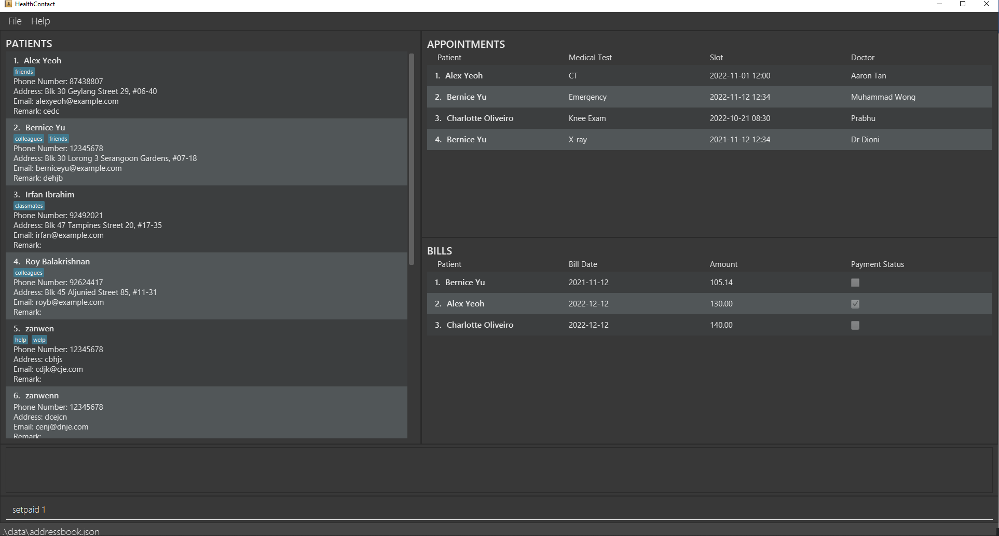

After:


### 1.6.2 Setting Bill As Unpaid `setunpaid`, `sup`

Sets the payment status of a bill to "unpaid".

Format:
```setunpaid <index>``` or ```sup <index>```

* The command words are `setunpaid` or `sup`.
* The index refers to the index number of the bill shown in the displayed bill list.
* The index must be a valid positive integer 1, 2, 3, …​

Example:
* ```setunpaid 1``` sets the first bill in the displayed bill list as unpaid, in this case, `Bernice Yu`'s bill.

Before:


After:


## 1.7 List `list`, `ls`

Removes all conditions previously applied to the list and shows all patients, appointments and bills.

### Format

`list` or `ls`

### Example

* Executing `list`, the program shows all patients, appointments and bills.

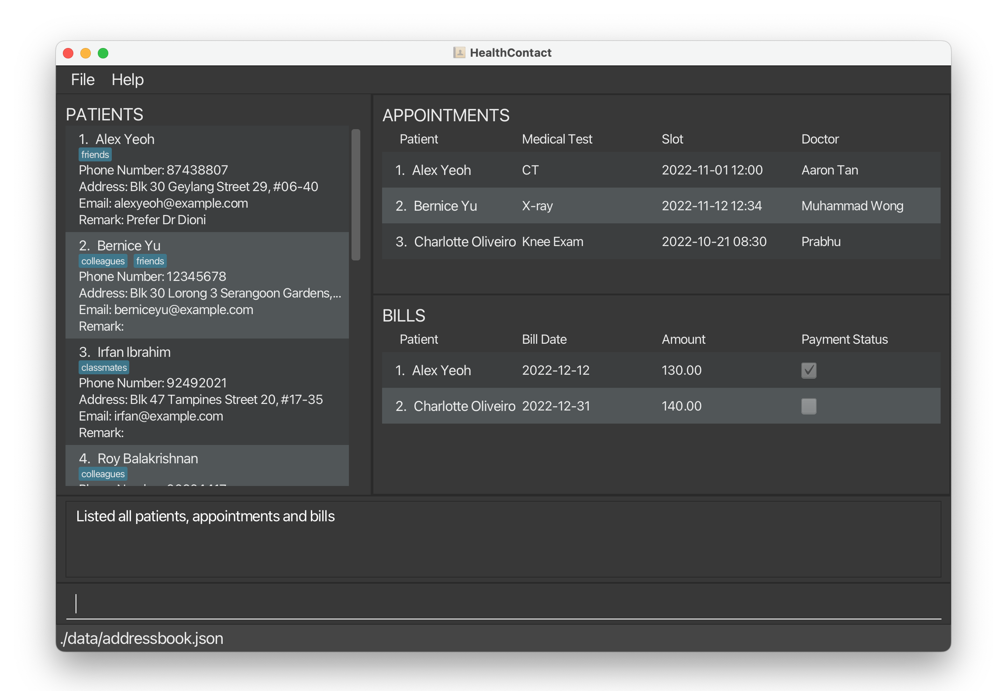

## 1.8 Delete

### 1.8.1 Deleting a patient `deletepatient` `dp`

Deletes a patient by the index number of the patient in the list.

Format:
```deletepatient <targetindex>``` or ```dp <targetindex>```

* The command words are `deletepatient` or `dp`.
* The patient to be deleted is identified by using the index in the displayed list.
* Deleting a patient deletes their related appointments and bills.
* If there is no index keyed in or the command word is followed by non-numeric characters, an error message will be
  shown with the correct command format.
* If the index provided is negative or greater than the number of patients in the list, an error message will be shown
  saying the index is invalid.

Examples:
`deletepatient 2` deletes patient Bernice Yu and all their related appointments and bills.


### 1.8.2 Deleting an appointment of a patient `deleteappointment` `da`

Deletes an appointment by the index number of the appointment in the list.

Format:
```deleteappointment <targetindex>``` or ```da <targetindex>```

* The command words are `deleteappointment` or `da`.
* The appointment to be deleted is identified by using the index in the displayed list.
* Deleting an appointment deletes its related bill.
* If there is no index keyed in or the command word is followed by non-numeric characters, an error message will be
  shown with the correct command format.
* If the index provided is negative or greater than the number of patients in the list, an error message will be shown
  saying the index is invalid.

Examples:
* `deleteappointment 2` deletes Charlotte Oliveiro's appointment with Dr. Prabhu on 2022-10-21 08:30 for
  knee exam.
  

### 1.8.3 Deleting a bill of an appointment `deletebill` `db`

Deletes a bill by the index number of the bill in the list.

Format:
```deletebill <targetindex>``` or ```db <targetindex>```

* The command words are `deletebill` or `db`.
* The bill to be deleted is identified by using the index in the displayed list.
* If there is no index keyed in or the command word is followed by non-numeric characters, an error message will be
  shown with the correct command format.
* If the index provided is negative or greater than the number of patients in the list, an error message will be shown
  saying the index is invalid.

Examples:
`deletebill 1` deletes Bernice's bill for her X-Ray appointment


## 1.9 Undo `undo`

Reverses the most recent command.

Format:
```undo```

* The command word is `undo`.
* The command can be used multiple times to undo multiple commands.
* If there are no commands to undo, an error message will be shown.

Examples:
* ```undo``` undoes the most recent command.


## 1.10 Redo `redo`

Reverses the most recent undo command.

Format:
```redo```

* The command word is `redo`.
* The command can be used multiple times to redo multiple commands.
* If there are no commands to redo, an error message will be shown.

Examples:
* ```redo``` redoes the most recent undo command.

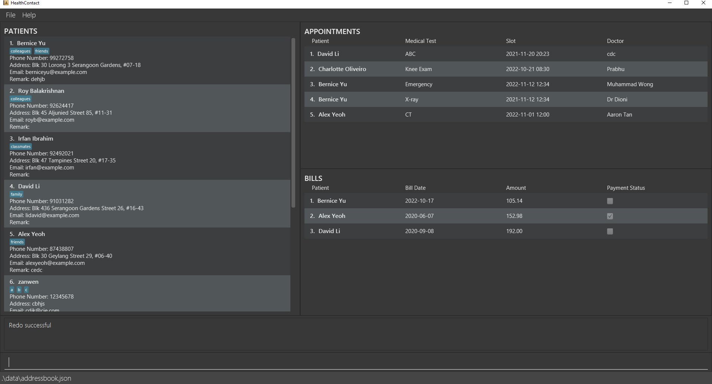


## 1.11 Clear `clear`

Deletes all patients, appointments and bills from HealthContact.

* If the user accidentally clears all data, the user can restore the data by using the `undo` command. If the user closes the application before undoing `clear`, the data will be gone permanently.

### Format


`clear`

### Example

* Executing `clear`, all data is deleted.

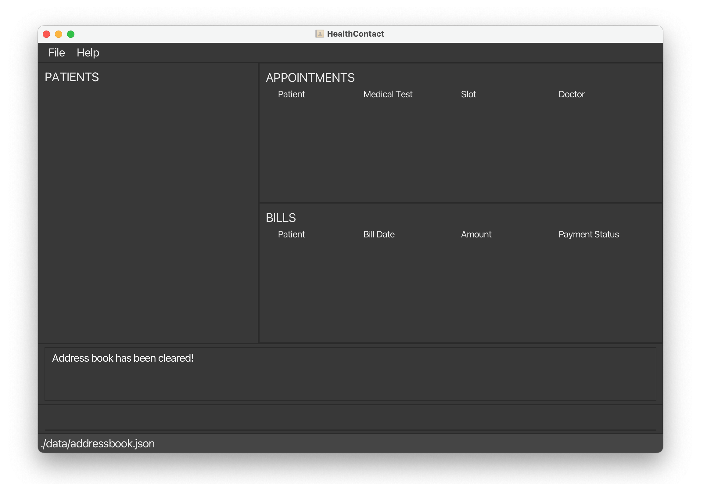

## 1.12 Exit `exit`

Quits HealthContact.

### Format

`exit`

### Example

* Executing `exit`, the program closes.

## 1.13 Help `help`

Opens the Help Window.

### Format

`help`

### Example

* Executing `help`, the help window pops.

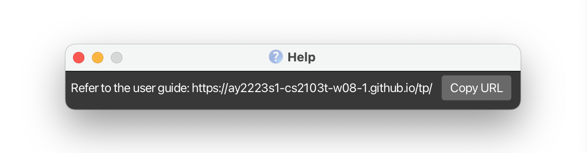

## 1.14 Saving the data

HealthContact data are saved in the hard disk automatically after any command that changes the data. There is no need to save manually.

## 1.15 Editing the data file

HealthContact data are saved as a JSON file `[JAR file location]/data/healthcontact.json`. Advanced users are welcome to update data directly by editing that data file.
* If the changes to the data file makes its format invalid, HealthContact will discard all data and start with an empty data file at the next run.

# 2. FAQ
1. Q: How do I find out which appointment a bill is for?
- Use the FindAppointmentCommand to find all appointments for a patient using the patient name on the bill. Then, use the SelectAppointmentCommand to see which appointment is the bill for.

