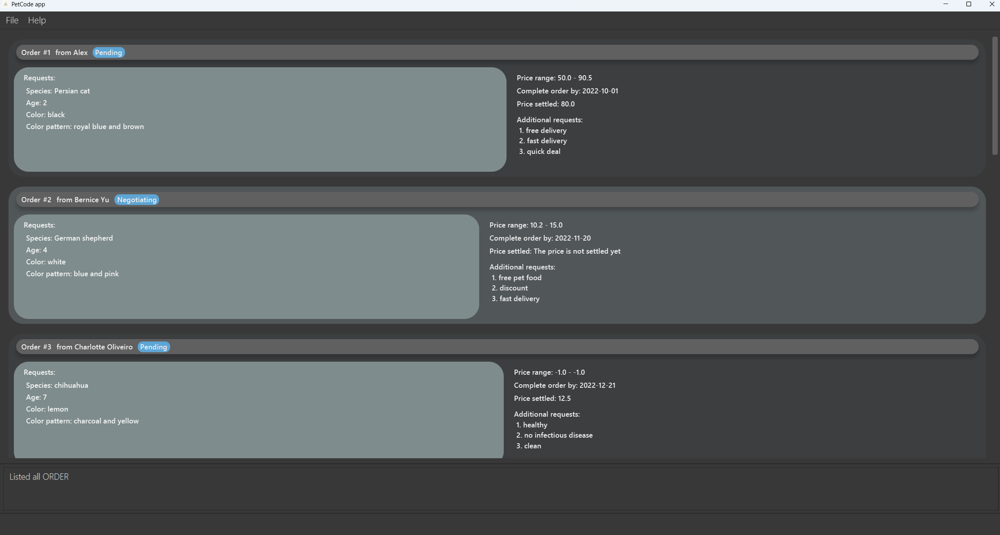
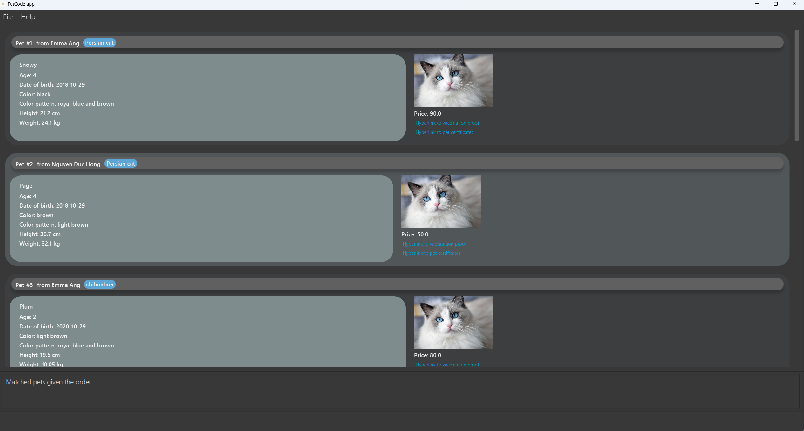

<h1> PetCode User Guide</h1>
Welcome to the PetCode user guide!  

PetCode is a desktop app that helps <b>store and manage contact information for your pet sales coordination business</b>.

{:refdef: style="text-align: center;"}

{: refdef}

#### Using this guide
If this is the first time you are using this user guide, it is highly recommended for you to read the section on
[Introducing PetCode](#introducing-petcode). Otherwise,

* If you are setting up, please take a look at our [Quick Start guide](#quick-start).
* If you are unsure of how to use PetCode, the [Command Summary](#command-summary) table is a good starting point.
* If you are a developer and want to help out, please take a look at the [Developer Guide](DeveloperGuide.md).
* For quick navigation in this guide, click the hyperlink at the end of each command to go back to the table of contents, and navigate to other sections of this guide from there.

## Table of Contents
- **[Introducing PetCode](#introducing-petcode)**
    * [What is PetCode?](#what-is-petcode)
    * [Glossary](#glossary)
    * [How to interpret the display window](#how-to-interpret-the-display-window)
- **[Quick Start](#quick-start)**
- **[Commands](#commands)**
    * [Viewing help](#viewing-help--help)
    * [Listing contacts or items](#listing-contacts-or-items--list)
    * [Checking which item belongs to which contact](#checking-which-item-belongs-to-which-contact--check)
    * [Adding a contact or item](#adding-a-contact-or-item--add)
        + [Adding a buyer](#adding-a-buyer--add-b)
        + [Adding a deliverer](#adding-a-deliverer--add-d)
        + [Adding a supplier](#adding-a-supplier--add-s)
        + [Adding an order to a buyer](#adding-an-order-to-a-buyer--add-o)
        + [Adding a pet to a supplier](#adding-a-pet-to-a-supplier--add-p)
        + [Adding a person with a popup window](#adding-a-contact-with-a-popup-window--add) 
    * [Matching pets to an order](#matching-pets-to-an-order--match)
    * [Deleting a contact or item](#deleting-a-contact-or-item--delete)
    * [Editing attributes of a contact](#editing-attributes-of-a-contact--edit)
    * [Finding contact(s) using keywords](#finding-contacts-using-keywords--find)
        + [Finding a buyer](#finding-a-buyer--find-b)
        + [Finding a supplier](#finding-a-supplier--find-s)
        + [Finding a deliverer](#finding-a-deliverer--find-d)
    * [Filtering items by attributes](#filtering-items-by-attributes--filter)
        + [Filtering orders](#filtering-orders--filter-o)
        + [Filtering pets](#filtering-pets--filter-p)
    * [Sorting contacts](#sorting-contacts--sort)
    * [Clearing all contacts](#clearing-all-entries--clear)
    * [Exiting the program](#exiting-the-program--exit)
- **[How data is stored](#how-data-is-stored)**
    * [Saving contacts and items](#saving-the-data)
    * [Editing the data file](#editing-the-data-file)
    * [Archiving data files](#archiving-data-files-coming-in-v20)
- **[FAQ](#faq)**
- **[Summaries](#summaries)**
    * [List of prefixes](#list-of-prefixes)
    * [Command summary](#command-summary)

--------------------------------------------------------------------------------------------------------------------

## Introducing PetCode

Whether you're new to PetCode, or just want to learn more about the details -- this section has you covered.
This section will provide an overview of PetCode and explain key terms.

### What is PetCode?

PetCode is a free, open-source application designed for pet sales coordinators for contact information management.

Due to the nature of a pet sales coordination business, you most likely have **a lot of information you need to deal with**. 
For example, what orders have you received? Which orders have not been fulfilled? How should you match this order with
the pets available? What is the contact information of your pet buyers, pet suppliers and delivery services?

PetCode is designed specifically to **improve your workflow**, by managing all this information to efficiently close
deals and satisfy your customers. It can be used to offload information, categorise them more meaningfully, and match
your customers' requests to their dream pet.

### How to interpret the display window

When you first run the app, you may see a display window pop up similar to the one below. We call this window the **Main Window**.

The following diagram below shows how you should interpret this display window.
* The **Command Box** refers to the text field where you can type commands in.
* The **Display List for Contacts / Items** refers to the list of contacts / items you are currently displaying.
  You may enter the following commands in the Command Box to see how the Display List changes:
    * `list buyer` lists all buyers.
    * `delete-b 1` deletes the buyer with index 1.
    * `list order` lists all orders.
      

### Glossary

In the user guide, you may come across some terms you do not understand. The following table provides clarification
of the terms commonly used in PetCode.

|       Term       | Description                                                                                                                                                                                                                                                                                                                                                  |
|:----------------:|--------------------------------------------------------------------------------------------------------------------------------------------------------------------------------------------------------------------------------------------------------------------------------------------------------------------------------------------------------------|
| **Alphanumeric** | Digits and letters only. For example, `AB3`, `PetCode`, `coco123`, and `2103` are alphanumeric. `#01-04`, `email@domain.com`, and `white    spaces` are not.                                                                                                                                                                                                 |
|  **Attribute**   | Words that follow prefixes to describe properties, states, characteristics, and traits. Examples are price, weight, name, and order status.                                                                                                                                                                                                                  |
|   **Command**    | A command is a specific instruction you can give to PetCode to perform an action. You can view the list of commands available [here](#command-summary).                                                                                                                                                                                                      |
|   **Contact**    | A contact is an information entry in PetCode. There are three types of contacts you can add - `Buyer`, `Supplier` and `Deliverer`. You can add a contact with the [`add` command](#adding-a-contact-or-item-add).                                                                                                                                            |
|     **CLI**      | Command-Line Interface (CLI) receives commands from a user in the form of lines of text. It refers to the input textbox in this context.                                                                                                                                                                                                                     |
|     **GUI**      | GUI stands for Graphical User Interface. It refers to the display window of the PetCode application.                                                                                                                                                                                                                                                         |
|    **Index**     | The index of the contact or item in the display list for contacts/items.                                                                                                                                                                                                                                                                                     |
|   **Integer**    | Whole number                                                                                                                                                                                                                                                                                                                                                 |
|     **Item**     | An item refers to an `Order` or a `Pet`. An Order refers to the order placed by a buyer. A Pet refers to the pet available for sale.                                                                                                                                                                                                                         |
|  **Parameter**   | A parameter refers to the information you need to give to your command such that it can execute an action based on that information.   For example, the [`list` command](#listing-contacts-or-items--list) requires a KEY parameter to know what kind of list to display. `list buyer` displays your list of buyers, where the KEY parameter is `buyer`. |
|    **Prefix**    | A prefix indicates the kind of information you are keying in. You can view the list of prefixes available [here](#list-of-prefixes).                                                                                                                                                                                                                         |
|  **Whitespace**  | An empty character, or a placeholder character ` `.                                                                                                                                                                                                                                                                                                          |

## Quick start

1. Ensure you have Java `11` or above installed in your Computer. Please kindly refer 
   [here](https://blog.hubspot.com/website/check-java-verison) for further instructions on how to do so.

2. Download the latest `petcode.jar` from [here](https://github.com/AY2223S1-CS2103T-T09-2/tp/releases).

3. Copy the file to the folder you want to use as the _home folder_ for your PetCode app.

4. Double-click the file to start the app. The GUI similar to the below should appear in a few seconds. Note that the app
   contains some sample data and the pet images are unchangeable in the current version of PetCode.  
   

5. Type the command in the command box and press ENTER to execute it. e.g. typing **`help`** and pressing ENTER will
   open the help window. 
   Some example commands you can try:

    * **`list buyer`** : Lists all buyers.

    * **`add-b n/Hongyi ph/11223344 e/email@u.nus.edu a/UTR 138600 l/Singapore`** : Adds
      a pet buyer named `Hongyi` to the PetCode.

    * **`delete-b 1`** : Deletes the first contact from the buyer contacts list.

    * **`clear`** : Deletes all contacts. You can use this command to clear all the sample data provided. Be extra careful when using this command since **there is no `undo`**.

    * **`exit`** : Exits the app.

6. Refer to the [Commands](#commands) Section below for details of each command.

[Go back to [Table of Contents](#table-of-contents)]

--------------------------------------------------------------------------------------------------------------------

## Commands

:information_source: **How to interpret the Command format:** 

* Words in `UPPER_CASE` are the parameters to be supplied by you. 
  e.g. in `add n/NAME`, `NAME` is a parameter which can be used as `add n/John Doe`.

* Items in square brackets are optional. 
  e.g. `p_n/PET_NAME [p_cert/CERTIFICATE]` can be used as `p_n/Page p_cert/USA Bureau of Exportation Certified` or as `p_n/Page`.

* Items with `…`​ after them can be used multiple times including zero times. 
  e.g. `[p_cert/CERTIFICATE]…​` can be used as ` ` (i.e. 0 times), `p_cert/noble blood`, `p_cert/noble blood p_cert/house-trained` etc.

* If a parameter is expected only once in the command, but you specified it multiple times, only the last occurrence of
  the parameter will be taken. 
  e.g. if you specify `ph/12341234 ph/56785678`, only `ph/56785678` will be taken.

* Extraneous parameters for commands that do not take in parameters (such as `help`, `exit` and `clear`) will be
  ignored. 
  e.g. if the command specifies `help 123`, it will be interpreted as `help`.

* If the command format contains round brackets `()`, it means the command format inside `()` is omitted and can be found in another command. 
  e.g. in `add-b n/NAME ph/PHONE_NUMBER e/EMAIL a/ADDRESS l/LOCATION o/add-o(order1 prefixes and fields)…​`, the detailed command format inside `()` is omitted and can be found in [Adding an order to a buyer](#adding-an-order-to-a-buyer--add-o).

* Unless otherwise specified, the order of prefixes does not matter. 
  e.g. if the command specifies `n/NAME ph/PHONE_NUMBER`, `ph/PHONE_NUMBER n/NAME` is also acceptable, unless stated otherwise in a particular command.

[Go back to [Table of Contents](#table-of-contents)]

### Viewing help : `help`

Shows a message explaining how to access the help page.

Format: `help`

[Go back to [Table of Contents](#table-of-contents)]
[Go back to [Commands](#commands)]

### Listing contacts or items : `list`

Displays the specified type of contacts or items. This command is especially useful when you want to view all contacts or items of the same type,
or when you want to set the display list to the correct list as required by other commands.

Format: `list KEY`

#### KEY Table

| Contact / Item to List |     KEY      |
|:----------------------:|:------------:|
|         Buyer          |   buyer, b   |
|        Supplier        | supplier, s  |
|       Deliverer        | deliverer, d |
|         Order          |   order, o   |
|          Pet           |    pet, p    |
|       All Person       |    all, a    |

Examples:
* `list buyer` or `list b`, lists all Buyer contacts with their orders.
* `list deliverer` or `list d`, lists all Deliverer contacts.
* `list supplier` or `list s`, lists all Supplier contacts with their pets.
* `list all` or `list a`, lists all Buyer, Deliverer, Supplier contacts and their respective pets and orders details.
* `list order` or `list o`, lists all Orders.
* `list pet` or `list p`, lists all Pets.

[Go back to [Table of Contents](#table-of-contents)]
[Go back to [Commands](#commands)]

### Checking which item belongs to which contact : `check`

Checks a contact at the specified index and shows his/her items, or checks an item at the specified index and shows the contact it belongs to.
This command is especially useful when you want to switch the display between related buyers and orders, or switch the display between related suppliers and pets.

Format: `check KEY INDEX`

#### KEY Table

| Contact / Item to Check |     KEY      |
|:-----------------------:|:------------:|
|          Buyer          |   buyer, b   |
|        Supplier         | supplier, s  |
|          Order          |   order, o   |
|           Pet           |    pet, p    |

#### Expected Behaviour for each type of the Check command

| Examples        | Expected behaviour                                                                        |
|-----------------|-------------------------------------------------------------------------------------------|
| `check buyer 1` | Shows the list of orders from the buyer at index 1, if at index 1 is a buyer.             |
| `check s 2`     | Shows the list of pets on sale from the supplier at index 2, if at index 2 is a supplier. |
| `check order 3` | Shows the buyer of the order at index 3, if at index 3 is an order.                       |
| `check p 4`     | Shows the supplier of the pet at index 4, if at index 4 is a pet.                         |

:exclamation: **Caution:** For the current version of PetCode, `check deliverer INDEX` will just display an empty list, since adding orders to deliverers is not yet implemented.
In the future, you may be able to transfer orders from buyers to deliverers and check out the deliverers' orders.

[Go back to [Table of Contents](#table-of-contents)]
[Go back to [Commands](#commands)]

### Adding a contact or item : `add`

Adds a contact or item to the address book.

* A contact can be of three categories: Buyer, Deliverer, and Supplier.
* An item can be either an Order or Pet.

General Format for add command: `add-KEY prefix/PARAMETERS…​`, where:

* `KEY` specifies what type of contact or item you want to add.
* `prefix` indicates the kind of information you are adding.
* `PARAMETER` is the content of the information you are adding.

Kindly refer to the [Summaries](#summaries) section for more information on the available prefixes and a summarised list
of add commands.

:bulb: **Tip:** If you are a beginner, we highly recommend you to use
the [Add Command using the popup window](#adding-a-contact-with-a-popup-window--add)
instead of the usual CLI interface.

[Go back to [Table of Contents](#table-of-contents)]
[Go back to [Commands](#commands)]

#### Adding a buyer : `add-b`

Adds a buyer to the contacts. A buyer is a person who would like to buy pet(s) and places one or more orders describing what kind
of pet(s) he/she would like.

You can add a buyer without orders as shown below.

Format: `add-b n/NAME ph/PHONE_NUMBER e/EMAIL a/ADDRESS l/LOCATION`

Example:
* To add a single buyer: `add-b n/Hongyi ph/11223344 e/email@u.nus.edu a/UTR 138600 l/Singapore`

:information_source: **What is the difference between address and location?**  

* **Address** is the specific street number and unit number of the place.  
* **Location** is the country this person is based.  

Since PetCode caters to international pet sale, it is good to have location as a separate attribute.
Different countries have different regulations on pet sale, and you may need to filter persons by their locations for some reason.

What if the buyer that you want to add already has some orders?
You can add a buyer and his/her orders in one shot! Check it out below :point_down:   
Format: `add-b n/NAME ph/PHONE_NUMBER e/EMAIL a/ADDRESS l/LOCATION o/add-o(order1 prefixes and fields) o/add-o(order2 prefixes and fields)…​`

:bulb: **Tip:** You can input as many `o/add-o` prefixes as you need. Each `o/add-o` creates an order under the buyer.
After each `o/add-o`, simply enter the details of the order without specifying the index of the associated buyer.
Don't know how to add an order properly? Refer to [Add Order](#adding-an-order-to-a-buyer--add-o) for more information.

:bulb: **Tip:** For more details on what each prefix represents, kindly refer to [List of Prefixes](#list-of-prefixes).

Examples:
* To add a buyer with one
  order: `add-b n/Hongyi ph/11223344 e/hhygg@u.nus.edu a/UTR 138600 l/Singapore o/add-o o_st/Pending o_r/add-r o_a/1 o_sp/Siamese cat o_c/black o_cp/black and brown o_p/30 o_pr/20, 50 o_d/2022-10-26 o_ar/vaccinated o_ar/free delivery`
* To add a buyer with two
  orders: `add-b n/Hongyi ph/11223344 e/hhygg@u.nus.edu a/UTR 138600 l/Singapore o/add-o o_st/Pending o_r/add-r o_a/1 o_sp/Siamese cat o_c/black o_cp/black and brown o_p/30 o_pr/20, 50 o_d/2022-10-26 o_ar/vaccinated o_ar/free delivery o/add-o  o_st/Negotiating o_r/add-r o_a/3 o_sp/Shih Tzu o_c/white o_cp/dotted white o_p/44.1 o_pr/10.6, -1 o_d/2022-09-20 o_ar/noble blood o_ar/not naughty`

:bulb: **Tip:** **Overwhelmed by the prefixes** when adding multiple orders?
Check out [Add Command using the popup window](#adding-a-contact-with-a-popup-window--add) to add multiple orders when adding a buyer **without prefixes**.

[Go back to [Table of Contents](#table-of-contents)]
[Go back to [Commands](#commands)]

#### Adding a deliverer : `add-d`

Adds a deliverer to your contact list. A deliverer delivers pets from suppliers to buyers.

Format: `add-d n/NAME ph/PHONE_NUMBER e/EMAIL a/ADDRESS l/LOCATION`

Examples:

* To add a single deliverer: `add-d n/Lezheng ph/19657471 e/lez998@u.nus.edu a/PGP Residences 118429 l/Singapore`

[Go back to [Table of Contents](#table-of-contents)]
[Go back to [Commands](#commands)]

#### Adding a supplier : `add-s`

Adds a supplier to address book. A supplier feeds, trains, and takes care of pets for sale.

You can add a supplier without pets as shown below.

Format: `add-s n/NAME ph/PHONE_NUMBER e/EMAIL a/ADDRESS l/LOCATION`

Example:
* To add a single supplier: `add-s n/Carol Pet House ph/11223344 e/carolpethouse@gmail.com a/Marina Bay Sands 138600 l/USA`

Similar to the [Add Buyer](#adding-a-buyer-add-b) command, you may feel the need to add a supplier together with all the pets he/she sells in one shot.
Check it out below :point_down:

Format: `add-s n/NAME ph/PHONE_NUMBER e/EMAIL a/ADDRESS l/LOCATION p/add-p(pet1 prefixeds and fields) p/add-p(pet2 prefixeds and fields)…​`

:bulb: **Tip:** Note that you can input as many `p/add-p` prefixes as you need. Each `p/add-p` creates an order under the buyer.
After each `p/add-p`, simply enter the details for the pet without specifying the index of the associated supplier.
Don't know how to add a pet properly? Refer to [Add Pet](#adding-a-pet-to-a-supplier--add-p) for more information.

:bulb: **Tip:** For more details on what each prefix represents, kindly refer to [List of Prefixes](#list-of-prefixes).

Examples:
* To add a supplier with one pet for
  sale: `add-s n/Carol Pet House ph/17238965 e/carolpethouse@gmail.com a/Marina Bay Sands 138600 l/Singapore p/add-p p_n/Luck p_d/2022-01-01 p_c/pink p_cp/pure pink p_h/41.2 p_s/Yorkshire pig p_cert/US certified p_v/true p_w/102.5 p_p/270.3`
* To add a supplier with two pets for
  sale: `add-s n/Carol Pet House ph/17238965 e/carolpethouse@gmail.com a/Marina Bay Sands 138600 l/Singapore p/add-p p_n/Luck p_d/2022-01-01 p_c/pink p_cp/pure pink p_h/41.2 p_s/Yorkshire pig p_cert/US certified p_v/true p_w/102.5 p_p/270.3 p/add-p p_n/Snupy p_d/2021-05-31 p_c/white p_cp/dotted p_h/89.3 p_cert/US certified p_s/Californian rabbit p_v/false p_w/32.8 p_p/330.3`

:bulb: **Tip:** Overwhelmed by the prefixes when adding multiple pets?
Check out [Add Command using the popup window](#adding-a-contact-with-a-popup-window--add) to add multiple pets when adding a supplier **without prefixes**.

[Go back to [Table of Contents](#table-of-contents)]
[Go back to [Commands](#commands)]

#### Adding an order to a buyer : `add-o`

Adds an order to a buyer contact. This is especially useful when an existing buyer has a new order, or when the buyer confirms the order some time after being added to the contacts.

Format: `add-o INDEX_OF_BUYER o_st/STATUS o_r/add-r o_a/AGE o_sp/SPECIES o_c/COLOR o_cp/COLOR_PATTERN [o_p/PRICE] o_pr/PRICE_RANGE o_d/DATE [o_ar/ADDITIONAL_REQUEST]…​`

:exclamation: **Caution**: `INDEX_OF_BUYER` should be immediately after `add-o`.
Ensure that at the index is a buyer before executing this command,
which can be achieved by executing the [List Command](#listing-contacts-or-items--list) or [Find buyer command](#finding-a-buyer--find-b) beforehand.  

:exclamation: **Caution**: Please ensure that `o_r/` is followed by `add-r` immediately and there are no other prefixes
between `o_r/`, `o_a/`, `o_c/`, `o_cp/`, and `o_sp/`. This is because they as a whole specify how the requested pet
should be like.

:information_source: **What is a request in an order?**  

The prefix `o_r/` specifies a request, which contains the **characteristics of a pet** that the buyer wants the pet to have,
including age, color, color pattern and species.
Other information in the order that is **not directly related to a pet**, such as the order status and the price range the buyer is willing to accept, **does not fall under request**.

:bulb: **Tip:** For more details on what each prefix represents, kindly refer to [List of Prefixes](#list-of-prefixes).

Examples:

* To add an order to the buyer at index 1 of the display list: `add-o 1 o_st/Pending o_r/add-r o_a/1 o_sp/German shepherd o_c/golden o_cp/pure color o_p/30 o_pr/20, 50 o_d/2022-10-26 o_ar/vaccinated o_ar/free delivery`
* To add an order to the buyer at index 2 of the display list: `add-o 2 o_st/Negotiating o_r/add-r o_a/3 o_sp/chihuahua o_c/white o_cp/dotted white o_p/44.1 o_pr/10.6, -1 o_d/2022-09-20 o_ar/noble blood o_ar/not naughty`

[Go back to [Table of Contents](#table-of-contents)]
[Go back to [Commands](#commands)]

#### Adding a pet to a supplier : `add-p`

Adds a pet to a supplier contact. This is especially useful when an existing supplier has a new pet for sale or when the supplier tells you what are the pets he/she owns some time after being added to the contacts.

Format: `add-p INDEX_OF_SUPPLIER p_n/PET_NAME p_d/DATE_OF_BIRTH p_c/COLOR p_cp/COLOR_PATTERN p_h/HEIGHT p_w/WEIGHT p_s/SPECIES p_v/VACCINATION_STATUS p_p/PRICE [p_cert/CERTIFICATE]…​`

:exclamation: **Caution**: `INDEX_OF_SUPPLIER` should be immediately after `add-p`.
Ensure that at the index is a supplier before executing this command,
which can be achieving by executing the [List Command](#listing-contacts-or-items--list) or [Find supplier command](#finding-a-supplier--find-s) beforehand.

Examples:

* To add a pet to the supplier at index 1 of the display list: `add-p 1 p_n/Kawaii p_d/2001-11-20 p_c/red p_cp/stripped p_h/39.5 p_s/Bengal cat p_v/true p_w/15.3 p_p/20 p_cert/GoodDog Cert p_cert/Royal Blood Cert`

:bulb: **Tip:** For more details on what each prefix represents, kindly refer to [List of Prefixes](#list-of-prefixes).

[Go back to [Table of Contents](#table-of-contents)]
[Go back to [Commands](#commands)]

#### Adding a contact with a popup window : `add`

Adds a contact with a pop-up window that has prompt texts for what to input without the need to enter any
prefixes. This reduces the need to memorise prefixes.
Given below is the pop-up window for adding a supplier.

The followings are two ways to use this command:

* Adds a buyer to the contacts with or without any number of orders.

  Format: `add buyer`

* Adds a supplier to the contacts with or without any number of pets.

  Format: `add supplier`

**:bulb: Tip:** **Useful keyboard shortcuts for the pop-up window:**

| Keyboard shortcut | Associated action                                                                      |
|:-----------------:|:---------------------------------------------------------------------------------------|
|      ESCAPE       | Closes the pop-up window **without saving**                                            |
|       ENTER       | Goes to the next input text field                                                      |
|     CTRL + A      | Adds an order/pet to the buyer/supplier                                                |
|     CTRL + D      | Deletes the last order/pet under the buyer/supplier in the pop-up window               |
|     CTRL + S      | Saves the inputs, adds the buyer/supplier to the contacts, and closes the pop-p window |

> Note that some shortcuts are only **effective when a text field is in focus**.
> When no text fields are highlighted (i.e. not in focus), **press TAB once (still no focus, press TAB again and again until the highlight appears)** to focus the cursor to a text field.
> This ensures that you can use all the available shortcuts.

:information_source:  If a compulsory text field is ***empty*** or a text field ***starts with whitespace*** during saving, the cursor will be brought to that text field,
which will be highlighted in red.

:information_source:  If the input of a text field is in the ***wrong format*** during saving, the person will not be added to
the contacts and the pop-up window will not close.
The error message and the correct format of the input will be shown in the **main window**.

:exclamation: This command is only available for **adding a buyer or supplier** for the current version.
Note that the three buttons for adding pets to a supplier, which are `Upload photo`, `Upload pet certificate`, `Upload vaccination proof` (you can refer to the picture above),
only **open the file explorer** and **do nothing more**. You may be able to upload files from your local disk to the storage of PetCode in future versions.

[Go back to [Table of Contents](#table-of-contents)]
[Go back to [Commands](#commands)]

### Matching pets to an order : `match`

Matches the "best fit" pet to an order. This is especially useful when you receive an order
and want to find out **which pet(s)** on sale is the **best fit** (i.e. description of the pet matches as many requirements specified in the order as possible).
With this information, you may contact the suppliers who own these pets for further negotiation.

:information_source: **How does the match command work?**

This command sorts all pets currently being displayed on your screen, i.e filtered out pets will not be sorted.

We have designed an algorithm to give each pet in the storage a score. Pets with descriptions that are closer to the requirements specified in the order will be given a higher score.
Pets with higher scores (i.e. more fitting to the order) are displayed on top. If you want to know how we design the algorithm, check out our [Developer Guide](DeveloperGuide.md).

In the current version of PetCode, the score calculation in the algorithm uses a default set of weightages. In the future, you may be able to define your own
weightages for different fields, such as price, age, species and so on.

Format: `match INDEX`

Example: 
* To match the first order in the display list to pets in the storage: `match 1`

:exclamation: **Caution**: Please ensure that at the index is an order, which can be achieved by executing the [List command](#listing-contacts-or-items--list) or [Filter order command](#filtering-orders--filter-o) beforehand.

The following picture shows the display list before the match command is executed.

The following picture shows the display list after `match 1` is executed.

[Go back to [Table of Contents](#table-of-contents)]
[Go back to [Commands](#commands)]

### Deleting a contact or item : `delete`

Deletes a contact / item at the specified index of the respective contact / item list.

Format: `delete-KEY INDEX`

#### KEY Table

| Contact / Item to Delete | KEY |
|:------------------------:|:---:|
|          Buyer           |  b  |
|         Supplier         |  s  |
|        Deliverer         |  d  |
|          Order           |  o  |
|           Pet            |  p  |

Examples:
* `delete-b 1`, deletes `Buyer` contact at index 1 of the display list, if index is found.
* `delete-s 2`, deletes `Supplier` contact at index 2 of the display list, if index is found.
* `delete-d 1`, deletes `Deliverer` contact at index 1 of the display list, if index is found.
* `delete-o 1`, deletes `Order` at index 1 of the display list, if index is found.
* `delete-p 1`, deletes `Pet` at index 1 of the display list, if index is found.

:exclamation: **Caution**: Please ensure that you have the corresponding display list before you execute the delete command.
For example, if you want to delete a buyer by `delete-b 1`, do ensure at index 1 is a buyer.
This is to make sure you know what you are deleting and do not delete a contact or item by accident, since there is no `undo` command yet.

* To ensure at the index is a contact, use [List command](#listing-contacts-or-items--list) or [Find command](#finding-contacts-using-keywords--find).
* To ensure at the index is an item, use [List command](#listing-contacts-or-items--list) or [Filter command](#filtering-items-by-attributes--filter).

**:bulb: Tip:** Want to delete an order or a pet when browsing through the list of buyer / supplier?
You **don't need to** list all orders / pets, find that particular order / pet and its index, and delete from there.
Instead, you can just use the [Check command](#checking-which-item-belongs-to-which-contact--check), `check buyer 1` for example, and delete from the order list of that buyer.

[Go back to [Table of Contents](#table-of-contents)]
[Go back to [Commands](#commands)]

### Editing attribute(s) of a contact : `edit`

Edits one or more attributes of a contact by the index number used in the displayed contacts list.
Existing values of that attribute will be overwritten by the input values.
Please provide **at least one** attribute.

Format: `edit-KEY INDEX [n/NAME] [ph/PHONE_NUMBER] [e/EMAIL] [a/ADDRESS] [l/LOCATION]`

#### KEY Table

| Contact to Edit | Role |
|:---------------:|:----:|
|      Buyer      |  b   |
|    Deliverer    |  d   |
|    Supplier     |  s   |

:exclamation: **Caution**: Please ensure that you have the corresponding display list before you execute the edit command.
For example, if you want to edit a buyer by `edit-b 1`, do ensure at index 1 is a buyer.

Examples: 
* `edit-b 1 n/Alex`, modifies the name of the Buyer contact at index 1 of Buyer List to Alex, if index is found.
* `edit-s 3 n/Bobby ph/884321` modifies the name to Bobby and phone to 884321, of the Supplier contact at index 3 of Supplier List to Alex, if index is found.

:exclamation: This command is only available for **editing the basic information** of a contact for the current version. In other words, **information regarding `Order`/`Pet`** that the `Buyer`/`Supplier` possess **cannot be modified**.

[Go back to [Table of Contents](#table-of-contents)]
[Go back to [Commands](#commands)]

### Finding contact(s) using keywords : `find`

Displays **all** contacts which match **one** specific attribute. This command is especially useful when you want to quickly
find contacts based on a keyword.

There are five possible attributes for finding contact(s):
Address, Email, Location, Name, Phone. Please provide **one** out of the five when using this command.

Format: `find prefix/ATTRIBUTE`

#### Attributes and Their Corresponding Prefixes Table

| Attribute | Prefix | Format    | Example                |
|-----------|--------|-----------|------------------------|
| Address   | a      | a/KEYWORD | a/Wall Street          |
| Email     | e      | e/KEYWORD | e/whereisamy@gmail.com |
| Location  | l      | l/KEYWORD | l/Nova Scotia          |
| Name      | n      | n/KEYWORD | n/Amy Toh              |
| Phone     | ph     | ph/NUMBER | ph/81234567            |

Examples:

* `find a/6th College Ave West`
* `find e/blackball@furry.com`
* `find ph/98986668`

[Go back to [Table of Contents](#table-of-contents)]
[Go back to [Commands](#commands)]

#### Finding a buyer : `find-b`

Displays all buyers who match **one** specific attribute.

Format: `find-b prefix/ATTRIBUTE`

Check out the [Attributes and Their Corresponding Prefixes Table](#attributes-and-their-corresponding-prefixes-table)
for more information on prefixes and attributes.

Examples:

* `find-b a/6th College Ave West`
* `find-b e/blackball@furry.com`
* `find-b ph/98986668`

[Go back to [Table of Contents](#table-of-contents)]
[Go back to [Commands](#commands)]

#### Finding a deliverer : `find-d`

Displays all deliverers who match **one** specific attribute.

Format: `find-d prefix/ATTRIBUTE`

Check out the [Attributes and Their Corresponding Prefixes Table](#attributes-and-their-corresponding-prefixes-table)
for more information on prefixes and attributes.

Examples:

* `find-d a/6th College Ave West`
* `find-d e/blackball@furry.com`
* `find-d ph/98986668`

[Go back to [Table of Contents](#table-of-contents)]
[Go back to [Commands](#commands)]

#### Finding a supplier : `find-s`

Displays all suppliers who match **one** specific attribute.

Format: `find-s prefix/ATTRIBUTE`

Check out the [Attributes and Their Corresponding Prefixes Table](#attributes-and-their-corresponding-prefixes-table)
for more information on prefixes and attributes.

Examples:

* `find-s a/6th College Ave West`
* `find-s e/blackball@furry.com`
* `find-s ph/98986668`

[Go back to [Table of Contents](#table-of-contents)]
[Go back to [Commands](#commands)]

### Filtering items by attributes : `filter`

Displays items based on the specified attribute(s). This command is especially useful when you want to coordinate
sales between a Buyer and Supplier, by filtering out orders that are still "Pending", etc.
Please provide **at least one** attribute when using this command.

:information_source: **What is the difference between find command and filter command?**  
* Find command: Finds **contact(s)**; only **one** attribute is allowed.  
* Filter command: Filters **item(s)**; **multiple** attributes are allowed. 

#### Filtering orders : `filter-o`

Displays only Orders based on the given attribute(s). There are three possible attributes to filter: Additional
requests, Order status, Price range.

Format: `filter-o PREFIX/ATTRIBUTE`

| Attribute           | Prefix | Format                       | Example            |
|---------------------|--------|------------------------------|--------------------|
| Additional requests | o_ar   | o_ar/KEYWORD                 | o_ar/non-shedding  |
| Order Status        | o_st   | o_st/KEYWORD                 | o_st/Negotiating   |
| Price Range         | o_pr   | o_pr/LOWER_PRICE-UPPER_PRICE | o_pr/100-456       |

Examples:

* `filter-o o_st/Pending`
* `filter-o o_st/Negotiating o_pr/90-900`
* `filter-o o_ar/good o_st/Delivering o_pr/80-100`

Notes:

* For additional requests, there cannot be spaces (i.e. filter-o o_ar/good for kids).
* Having multiple prefixes of the same type is allowed. One example of this is:
`filter-o o_st/Pending o_st/Delivering`. However, only the latest input will be taken, in the example above, the order status the app will use to filter orders is the "Delivering" status.

[Go back to [Table of Contents](#table-of-contents)]
[Go back to [Commands](#commands)]

#### Filtering pets : `filter-p`

Displays only Pets based on the given attributes. There are five possible attributes to filter: Color, Name,
Price, Species, Vaccination status.

Format: `filter-p PREFIX/ATTRIBUTE`

| Attribute          | Prefix | Format      | Example           |
|--------------------|--------|-------------|-------------------|
| Color              | p_c    | p_c/KEYWORD | p_c/pink          |
| Name               | p_n    | p_n/KEYWORD | p_n/nyanko-sensei |
| Price              | p_p    | p_p/PRICE   | p_p/209           |
| Species            | p_s    | p_s/KEYWORD | p_s/ostrich       |
| Vaccination Status | p_v    | p_v/KEYWORD | p_v/false         |

Examples:

* `filter-p p_c/white`
* `filter-p p_c/black p_v/true`
* `filter-p p_c/black p_n/doraemon p_p/50 p_s/cat p_v/true`

[Go back to [Table of Contents](#table-of-contents)]
[Go back to [Commands](#commands)]

### Sorting contacts : `sort`

Sorts the specified list based on the default or given attribute(s) as sorting criteria.

Format: `sort KEY [ATTRIBUTE]…​`

:information_source: When no attributes are specified as sorting criteria, the list will be sorted based on the default sorting criteria given below.

#### KEY and ATTRIBUTE Table

| Contact / Item to Sort |     KEY      | Default Sorting Criteria | Possible ATTRIBUTE as Sorting Criteria   (acceptable parameters)                                                                                                                 | Examples                                |
|:----------------------:|:------------:|:------------------------:|-------------------------------------------------------------------------------------------------------------------------------------------------------------------------------------|-----------------------------------------|
|         Buyer          |   buyer, b   |     Number of orders     | Name (name, n), Phone (phone, ph), Email (email, e), Location (location, l), Address (address, a)                                                                                   | `sort buyer name`, `sort b p n`         |
|        Supplier        | supplier, s  |      Number of pets      | Name (name, n), Phone (phone, ph), Email (email, e), Location (location, l), Address (address, a)                                                                                   | `sort supplier e`, `sort s address`     |
|       Deliverer        | deliverer, d |           Name           | Name (name, n), Phone (phone, ph), Email (email, e), Location (location, l), Address (address, a)                                                                                   | `sort d location a`, `sort deliverer n` |           
|         Order          |   order, o   |         Due date         | Due Date (duedate, d), Price Range (pricerange, pr),   Settled Price (price, p), Order Status (orderstatus, os)                                                                  | `sort order pr`, `sort o d p os`        |          
|          Pet           |    pet, p    |          Price           | Price (price, p), Name (name, n), Color (color, c), Color Pattern (colorpattern, cp),   Birth Date (birthdate, bd), Species (species, s), Height (height, h), Weight (weight, w) | `sort pet color`, `sort p s cp`         |

:exclamation:**Caution:** This command sorts the specified list in **ascending** order. For example, it will display the buyer with the **lowest** number
of orders at the **top** of the buyer list and the buyer with the **highest** number of orders at the **bottom** of the buyer list.

[Go back to [Table of Contents](#table-of-contents)]
[Go back to [Commands](#commands)]

### Clearing all entries : `clear`

Clears all entries from the PetCode.

:exclamation: **Caution:** Be careful when using this command as there is no `undo` command implemented yet.

Format: `clear`

[Go back to [Table of Contents](#table-of-contents)]
[Go back to [Commands](#commands)]

### Exiting the program : `exit`

Exits the program.

Format: `exit`

[Go back to [Table of Contents](#table-of-contents)]
[Go back to [Commands](#commands)]

## How data is stored
### Saving the data

PetCode data is saved into your computer's hard disk automatically after any command that changes the data.
There is no need to save manually.

### Editing the data file

PetCode data is saved as a JSON file `[JAR file location]/data/PetCode.json`.
Advanced users are welcome to update the data directly by editing that data file.

:exclamation: **Caution:** If your changes to the data file makes its format invalid, PetCode will discard all data and
start with an empty data file at the next run.

### Archiving data files `[coming in v2.0]`

_Details coming soon ..._

[Go back to [Table of Contents](#table-of-contents)]

--------------------------------------------------------------------------------------------------------------------

## FAQ

**Q**: How do I transfer my data to another Computer? 
**A**: Install the app in the other computer and overwrite the empty data file it creates with the file that contains
the data of your previous PetCode home folder.

**Q**: Why does the app tell my that the buyer/deliverer/supplier already exits in the addressbook? How are contacts and
items considered as duplicates? 
**A**: Unfortunately, we do not allow duplicate contacts or items in our app, otherwise you may mistakenly modify a
person that you don't intend to! For buyer/deliverer/supplier, if they are of the same person category and have the same
name and the same email address, they are considered as the same. However, we do allow a buyer and a deliverer to have
exactly the same name and the same email, even all attributes being identical. That is, we allow a person to have more
than one role in our app.
Two pets are considered as the same if they have all the same attributes. Two orders are different even they have all
the same attributes.

[Go back to [Table of Contents](#table-of-contents)]

--------------------------------------------------------------------------------------------------------------------

## Summaries
### List of Prefixes

These prefixes are for you to indicate different fields when you add a new [buyer](#adding-a-buyer-add-b), a new [deliverer](#adding-a-deliverer-add-d), a new [supplier](#adding-a-supplier-add-s), a new [order](#adding-an-order-to-a-buyer-add-o), or a new [pet](#adding-a-pet-to-a-supplier--add-p).

| Prefix    | Category        | Meaning                           | Usage                                                                                                                                                                                                                                                                                                                              | Example                                         |
|-----------|-----------------|-----------------------------------|------------------------------------------------------------------------------------------------------------------------------------------------------------------------------------------------------------------------------------------------------------------------------------------------------------------------------------|-------------------------------------------------|
| `n/`      | General Person  | Name                              | A string of alphanumeric and characters and whitespaces. Required.                                                                                                                                                                                                                                                                 | `n/John Halstead`                               |
| `ph/`     | General Person  | Phone number                      | Numbers only. Required.                                                                                                                                                                                                                                                                                                            | `ph/80334455`                                   |
| `e/`      | General Person  | Email address                     | A string of characters. Must contain `@` and follow email format. Required.                                                                                                                                                                                                                                                        | `e/1324@sample.com`                             |
| `a/`      | General Person  | Address                           | A string of any characters. Required.                                                                                                                                                                                                                                                                                              | `a/36 College Ave East, Singapore 138600`       |
| `l/`      | General Person  | Location (country) of this person | A string of alphanumeric characters. Required.                                                                                                                                                                                                                                                                                     | `l/Singapore`, `USA`, `China`                   |
| `o/`      | Order           | Order                             | Always followed by `add-o`. Optional, if no orders to add when adding a buyer. Can have multiple.                                                                                                                                                                                                                                  | `o/add-o`                                       |
| `o_st/`   | Order           | Order status                      | `Pending`, `Negotiating`, or `Delivering`                                                                                                                                                                                                                                                                                          | `o_st/Pending`                                  |
| `o_p/`    | Order           | Price                             | A non-negative decimal number. Use `-1` to indicate not settled price. Must be within the price range. Required.                                                                                                                                                                                                                   | `o_p/38.6`                                      |
| `o_pr/`   | Order           | Price range                       | This is for you to use when negotiating with buyer -- the range the price is expected  to fall within. Two non-negative decimal numbers, separated by a comma `,`. The first must not be greater than the second. If you haven't settled down one or two of the bounds, use `-1` to indicate not applicable price bound. Required. | `o_pr/-1, -1`, `o_pr/2.9, -1`, `o_pr/4.3, 19.5` |
| `o_d/`    | Order           | Transaction (scheduled) date      | In the format `yyyy-MM-dd`.                                                                                                                                                                                                                                                                                                        | `o_d/2022-10-28`, `o_d/2022-9-2`                |
| `o_r/`    | Order (Request) | Order request                     | Always followed by `add-r`. The Request group of prefixes describe what kind of pet this order seeks. Required.                                                                                                                                                                                                                    | `o_r/add-r`                                     |
| `o_a/`    | Order (Request) | Age                               | A non-negative whole number. Required.                                                                                                                                                                                                                                                                                             | `o_a/5`                                         |
| `o_sp/`   | Order (Request) | Species                           | A string of alphanumeric and characters and whitespaces. Required.                                                                                                                                                                                                                                                                 | `o_sp/Chihuahua`, `o_sp/German shepherd`        |
| `o_c/`    | Order (Request) | Color                             | A string of alphanumeric and characters and whitespaces. Required.                                                                                                                                                                                                                                                                 | `o_c/red`                                       |
| `o_cp/`   | Order (Request) | Color pattern                     | A string of alphanumeric and characters and whitespaces. This describes the appearance of the pet in more detail. Required.                                                                                                                                                                                                        | `o_cp/white stripped`, `o_cp/black dotted`      |
| `o_ar/`   | Order           | Additional request of the order.  | A string of alphanumeric and characters and whitespaces. Optional. Can have multiple.                                                                                                                                                                                                                                              | `o_ar/free delivery`, `o_ar/arrive in 10 days`  |
| `p/`      | Pet             | Pet                               | Always followed by `add-p`. Optional, if no orders to add when adding a supplier. Can have multiple.                                                                                                                                                                                                                               | `p/add-p`                                       |
| `p_n/`    | Pet             | Pet name                          | A string of alphanumeric and characters and whitespaces. Required.                                                                                                                                                                                                                                                                 | `p_n/Page`                                      |
| `p_s/`    | Pet             | Species                           | A string of alphanumeric and characters and whitespaces. Required.                                                                                                                                                                                                                                                                 | `p_s/Chihuahua`, `p_s/German shepherd`          |
| `p_d/`    | Pet             | Date of birth of the pet          | In the format `yyyy-MM-dd`.                                                                                                                                                                                                                                                                                                        | `p_d/2020-3-29`                                 |
| `p_c/`    | Pet             | Color                             | A string of alphanumeric and characters and whitespaces. Required.                                                                                                                                                                                                                                                                 | `p_c/blue`                                      |
| `p_cp/`   | Pet             | Color pattern                     | A string of alphanumeric and characters and whitespaces. This describes the appearance of the pet in more detail. Required.                                                                                                                                                                                                        | `p_cp/blue grids`                               |
| `p_h/`    | Pet             | Height                            | A non-negative decimal number. The unit is cm. Required.                                                                                                                                                                                                                                                                           | `p_h/33.2`                                      |
| `p_w/`    | Pet             | Weight                            | A non-negative decimal number. The unit is kg. Required.                                                                                                                                                                                                                                                                           | `p_w/58.2`                                      |
| `p_p/`    | Pet             | Price                             | A non-negative decimal number. This is the price the pet is to be sold at. Use `-1` to indicate not settled price. Required.                                                                                                                                                                                                       | `p_p/55.5`                                      |
| `p_v/`    | Pet             | Vaccination status                | `true` if the pet is vaccinated, otherwise `false`. Required.                                                                                                                                                                                                                                                                      | `p_v/false`                                     |
| `p_cert/` | Pet             | Certificate                       | A string of alphanumeric and characters and whitespaces. Other certificates this pet holds. Optional. Can have multiple.                                                                                                                                                                                                           | `p_cert/US certified`, `p_cert/noble blood`     |

:information_source: `-0` is also considered as non-negative.

### Command Summary

|                                  Action                                   | Format                                                                                    | Examples                                                               |
|:-------------------------------------------------------------------------:|-------------------------------------------------------------------------------------------|------------------------------------------------------------------------|
|                 **[Add](#adding-a-contact-or-item-add)**                  | `add-ROLE n/NAME b/BREED p/PHONE_NUMBER e/EMAIL a/ADDRESS l/LOCATION`                     | `add-b n/Hongyi p/11223344 e/hhygg@u.nus.edu a/UTR 138600 l/Singapore` |
| **[Add](#adding-a-person-with-a-popup-window--add)** (using popup window) | `add buyer`, `add supplier`                                                               |                                                                        |
|                 **[Clear](#clearing-all-entries--clear)**                 | `clear`                                                                                   |                                                                        |
|             **[Delete](#deleting-a-contact-or-item--delete)**             | `delete-KEY INDEX`                                                                        | `delete-b 1`, `delete-d 2`, `delete-s 3`, `delete-o 1`, `delete-p 2`   |
|            **[Edit](#editing-attributes-of-a-contact--edit)**             | `edit-ROLE INDEX [n/NAME] [p/PHONE] [e/EMAIL] [a/ADDRESS] [l/LOCATION]`                   | `edit-b 1 n/Alex`, `edit-s 3 n/Bobby p/884321`                         |
|            **[Find](#finding-contacts-using-keywords--find)**             | `find PREFIX/KEYWORD`                                                                     | `find n/James Jake`                                                    |
|                **[Find Buyer](#finding-a-buyer--find-b)**                 | `find-b PREFIX/KEYWORD`                                                                   | `find-b n/James Jake`                                                  |
|            **[Find Deliverer](#finding-a-deliverer--find-d)**             | `find-d PREFIX/KEYWORD`                                                                   | `find-d n/James Jake`                                                  |
|             **[Find Supplier](#finding-a-supplier--find-s)**              | `find-s PREFIX/KEYWORD`                                                                   | `find-s n/James Jake`                                                  |
|             **[Filter Orders](#filtering-orders--filter-o)**              | `filter-o PREFIX/KEYWORD`                                                                 | `filter-o o_ar/non-allergic o_pr/10-100`                               |
|               **[Filter Pets](#filtering-pets--filter-p)**                | `filter-p PREFIX/KEYWORD`                                                                 | `filter-p p_c/white p_s/capybara`                                      |
|                      **[Help](#viewing-help--help)**                      | `help`                                                                                    |                                                                        |
|               **[List](#listing-contacts-or-items--list)**                | `list all`, `list buyer`, `list supplier`,  `list deliverer`, `list order`, `list pet` |                                                                        |
|                    **[Sort](#sorting-contacts--sort)**                    | `sort LIST_PARAMETER [ATTRIBUTES...]`                                                     | `sort pet price height weight`                                         |
|     **[Check](#checking-which-item-belongs-to-which-contact--check)**     | `check LIST_TYPE INDEX`                                                                   | `check buyer 1`                                                        |

[Go back to [Table of Contents](#table-of-contents)]
