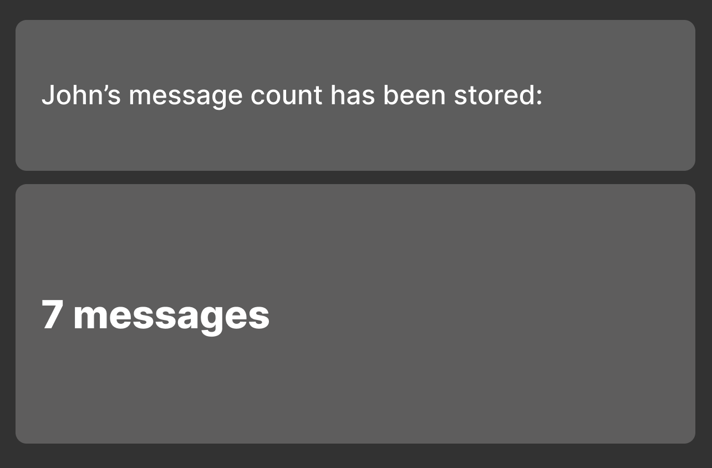
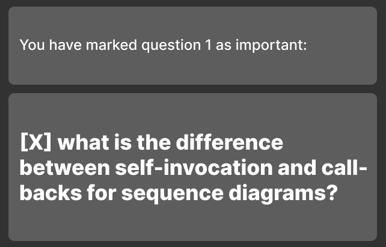
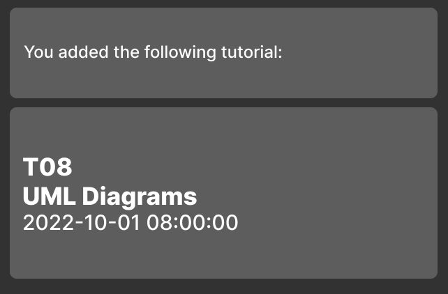

User Guide
=======
SETA is a **desktop application for CS2103T Teaching Assistants** to track their students’ and tutorials’ details, and
questions asked by students, optimized for use via a Command Line Interface (CLI) while still having the benefits of a
Graphical User Interface (GUI). If you can type fast, SETA enables you to manage your tutorials and track your students
more effectively than traditional GUI apps.

* Table of Contents
    * **Student**
        * Adding a student: [`addstu`](#adding-a-student--addstu)
        * Editing a student: [`editstu`](#editing-a-student-editstu)
        * Listing all students: [`liststu`](#listing-all-students--liststu)
        * Adding student's attendance: [`attendance`](#adding-students-attendance--attendance)
        * Adding student’s response: [`addresponse`](#adding-students-response-addresponse)
        * Adding help tag to a student: [`helpstu`](#adding-help-tag-helpstu)
        * Deleting a student: [`deletestu`](#deleting-a-student-deletestu)
    * **Question**
        * Adding a question: [`addq`](#adding-a-question--addq)
        * Marking a question: [`markq`](#marking-a-question--markq)
        * Unmarking a question: [`unmarkq`](#unmarking-a-question--unmarkq)
        * Deleting a question: [`deleteq`](#deleting-a-question--deleteq)
        * Listing all questions: [`listq`](#listing-all-questions--listq)
    * **Tutorial**
        * Adding a tutorial: [`addtut`](#adding-a-tutorial--addtut)
        * Deleting a tutorial: [`deletetut`](#deleting-a-tutorial--deletetut)
        * Marking a tutorial: [`marktut`](#marking-a-tutorial-marktut)
        * Listing all tutorials: [`listtut`](#listing-all-tutorials-listtut)
    * **Exiting the program**: [`exit`](#exiting-the-program--exit)

--------------------------------------------------------------------------------------------------------------------

## Quick start

1. Ensure you have Java `11` or above installed in your Computer.

1. Download the latest `seta.jar` from [here](https://github.com/AY2223S1-CS2103T-T08-4/tp/releases).

1. Copy the file to the folder you want to use as the _home folder_ for your SETA.

1. Double-click the file to start the app. The GUI similar to the below should appear in a few seconds. Note how the app
   contains some sample data. 
   

1. Type the command in the command box and press Enter to execute it. e.g. typing **`liststu`** and pressing Enter will
   go to the student page, listing all the students. 

Some example commands you can try:

* **`liststu`** : Lists all students.

* **`addstu`**`n/John Lim Jun Jie h/@johnlimjj e/johnlim@example.com` : Adds a student named `John Lim Jun Jie` to
  the student list.

* **`deletestu`**`3` : Deletes the 3rd student shown in the current list.

* **`exit`** : Exits the app.

1. Refer to the [Features](#features) below for details of each command.

--------------------------------------------------------------------------------------------------------------------

## Features

**:information_source: Notes about the command format:** 

* Words in `UPPER_CASE` are the parameters to be supplied by the user. 
  e.g. in `addstu n/NAME`, `NAME` is a parameter which can be used as `addstu n/John Lim`.

* Items in square brackets are optional. 
  e.g. `n/NAME [h/TELEGRAM_HANDLE]` can be used as `n/John Lim h/@johnlim` or as `n/John Lim`.

* Parameters can be in any order. 
  e.g. if the command specifies `n/NAME e/EMAIL`, `e/EMAIL n/NAME` is also acceptable.

* If a parameter is expected only once in the command but you specified it multiple times, only the last occurrence of
  the parameter will be taken. 
  e.g. if you specify `h/@johnlim h/@johnlimjj`, only `h/@johnlimjj` will be taken.

* Extraneous parameters for commands that do not take in parameters (such as `liststu` and `exit`) will be ignored. 
  e.g. if the command specifies `liststu 123`, it will be interpreted as `liststu`.

### Adding a student : `addstu`

Adds a student to the student list.

Format: `addstu n/NAME h/TELEGRAM_HANDLE e/EMAIL`

* Telegram handle must start with a '@'.
* Email can only contain alphanumeric characters.

Examples:

* `addstu n/John Lim Jun Jie h/@johnlimjj e/johnlim@example.com`
* `addstu n/Mary Tan Xiao Li h/@marytxl e/marytxl@example.com`

### Editing a student: `editstu`

Edits an existing student in the student list.

Format: `edit INDEX [n/NAME] [h/TELEGRAM_HANDLE] [e/EMAIL] [a/ATTENDANCE]`

* Edits the student at the specified INDEX. The index represents the index number of the student in the student list.
  The index must be a positive integer 0, 1, 2…
* At least one of the fields (E.g. [n/NAME] or [e/EMAIL]) must be provided
* Existing fields will be updated to the input values.

Examples:

* `editstu 1 h/@johnlim e/jljj@example.com Edits the telegram handle and email of the person at index 1 to be @johnlim and jljj@example.com respectively.`
* `editstu 3 n/Mary Lee Jing Yi Edits the name of the person at index 3 to be Mary Lee Jing Yi.`

### Adding student's attendance : `attendance`

Increases or decreases the number of times a student attended tutorials.

Format: `attendance INDEX s/SIGN v/VALUE`

* Adds attendance to the student at the specified INDEX
* The index refers to the index number shown in the displayed student list.
* The index must be a positive integer 1, 2. 3, …
* decrease attendance value if `SIGN` is '-' and increase attendance value if `SIGN` is '+'
* increase or decrease the specific student's attendance by `VALUE`

Examples:

* `attendance 1 s/- v/2`
* `attendance 1 s/+ v/1`

### Adding student's response: `addresponse`

Adds the number of messages a specified student sent during tutorial.

Format: `addresponse n\NAME m\MESSAGE_COUNT`

Examples:

* `addresponse n\John Doe m\7`

### Adding help tag: `helpstu`

Adds a help tag to an existing student.

Format: `helpstu NAME`

Example:

* `helpstu John Lim Jun Jie`

### Deleting a student: `deletestu`

Removes a specific student.

Format: `deletestu INDEX`

* Deletes the student at the specified INDEX
* The index refers to the index number shown in the displayed student list.
* The index must be a positive integer 1, 2. 3, …

Example:

* `liststu` followed by `deletestu 2` deletes the second student in the student list

### Adding a question : `addq`

Adds a question to the question list.

Format: `addq QUESTION_DESCRIPTION`

Examples:

* `addq what is the difference between self-invocation and call-backs for sequence diagrams?`

### Marking a question : `markq`

Marks a question as important.

Format: `markq INDEX`

* Marks the question at the specified INDEX as important.
* The index refers to the index number shown in the displayed question list.
* The index must be a positive integer 1, 2. 3, …
*

Examples:

* `markq 1` marks the first question in the question list as important

### Unmarking a question : `unmarkq`

Marks a question as unimportant. (If the question was previously or mistakenly marked as important)

Format: `unmarkq INDEX`

* Marks the question at the specified INDEX as unimportant.
* The index refers to the index number shown in the displayed question list.
* The index must be a positive integer 1, 2. 3, …
*

Examples:

* `unmarkq 1` marks the first question in the question list as unimportant

### Deleting a question : `deleteq`

Deletes a question in the question list.

Format: `deleteq INDEX`

Examples:

* `deleteq 1` deletes the first question from the question list

### Adding a tutorial : `addtut`

Adds a tutorial to the tutorial list.

Format: `addtut g/GROUP_NUMBER c/CONTENT t/DATE TIME`

Examples:

* `addtut g/T08 c/UML diagrams t/2022-10-01T08:00:00`

### Deleting a tutorial : `deletetut`

Deletes a tutorial in the tutorial list.

Format: `deletetut INDEX`

* Deletes the tutorial at the specified INDEX
* The index refers to the index number shown in the displayed tutorial list.
* The index must be a positive integer 1, 2. 3, …
*

Example:

* `deleteq 1`deletes the first tutorial from the tutorial list

### Marking a tutorial: `marktut`

Marks content in the tutorial as done.

Format: `marktut INDEX`

* Marks the tutorial at the specified `INDEX`.
* The index refers to the index number shown in the displayed tutorial list.
* The index must be a positive integer 1, 2, 3, ...

Example:

* `marktut 1` marks the first tutorial from the tutorial list as done.

### Exiting the program : `exit`

Exits the program.

Format: `exit`

### Saving the data

SETA data are saved in the hard disk automatically after any command that changes the data. There is no need to save
manually.

### Editing the data file

SETA data are saved as a JSON file `[JAR file location]/data/seta.json`. Advanced users are welcome to update data
directly by editing that data file.

:exclamation: **Caution:**
If your changes to the data file makes its format invalid, SETA will discard all data and start with an empty data file at the next run.

### Archiving data files `[coming in v2.0]`

_Details coming soon ..._

--------------------------------------------------------------------------------------------------------------------

## FAQ

**Q**: How do I transfer my data to another Computer? 
**A**: Install the app in the other computer and overwrite the empty data file it creates with the file that contains
the data of your previous SETA home folder.

--------------------------------------------------------------------------------------------------------------------

## Command summary

| Action         | Format, Examples                    |
|----------------|-------------------------------------|
| **Add**        | `addstu`, `addq`, `addtut`          |
| **Attendance** | `attendance`                        |
| **Delete**     | `deletestu`, `deleteq`, `deletetut` |
| **Edit**       | `editstu`                           |
| **List**       | `liststu`, `listq`, `listtut`       |
| **Mark**       | `markq`, `unmarkq`, `marktut`       |
| **Tag**        | `helpstu`                           |
| **Exit**       | `exit`                              |
