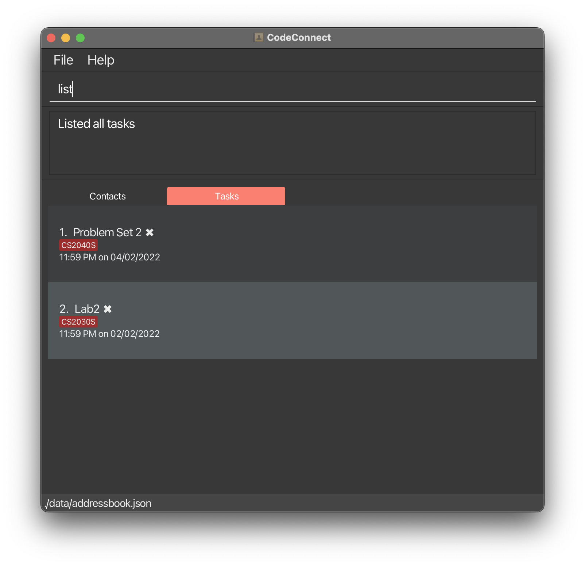

CodeConnect is a **desktop app** for managing your **tasks and your contacts**, optimized for use via a **Command Line Interface** (CLI)
while still having the benefits of a Graphical User Interface (GUI).
If you can type fast, CodeConnect can get your tasks done faster than traditional GUI apps.

* Table of Contents
{:toc}

--------------------------------------------------------------------------------------------------------------------

## Quick start

1. Ensure you have Java `11` or above installed in your Computer.

2. Download the latest `CodeConnect.jar` from [here]().

3. Copy the file to the folder you want to use as the _home folder_.

4. Double-click the file to start the app. The GUI similar to the below should appear in a few seconds. Note how the app contains some sample data.

   
   
   

5. Type the command in the command box and press Enter to execute it. e.g. typing **`help`** and pressing Enter will open the help window. 
   Some example commands you can try:

   * **`listc`** : Lists all contacts.

   * **`add`**`Finish homework by/tomorrow 5pm m/CS2040S` : Adds a task named `Finish homework` to the Task Manager.

   * **`del`**`1` : Deletes the 1st task shown in the current list.

   * **`clear`** : Deletes all contacts.

   * **`exit`** : Exits the app.

6. Refer to the [Features](#features) below for details of all available commands.

--------------------------------------------------------------------------------------------------------------------

## Features

**:information_source: Notes about the command format:** 

* Words in `{curly_braces}` are the parameters to be supplied by the user. 
  e.g. In `addc n/{name}`, `{name}` is a parameter which can be used as `addc n/John Doe`.

* Items in square brackets are optional. 
  e.g. When [adding a contact](#adding-a-contact-addc), it is optional to tag them. Hence, the tag parameter is presented as `[t/{tag}]`

* Items with `…`​ after them can be used multiple times including zero times. 
  e.g. `[t/{tag}]…​` can be used as ` ` (i.e. 0 times), `t/friend`, `t/friend t/family` etc.

* Parameters can be in any order. 
  e.g. If the command specifies `n/{name} p/{phone_number}`, `p/{phone_number} n/{name}` is also acceptable.

* If a parameter is expected only once in the command, but you specified it multiple times, only the **last occurrence** of the parameter will be taken. 
  e.g. If you specify `p/12341234 p/56785678`, only `p/56785678` will be taken.

* Extraneous parameters for commands that do not take in parameters (such as `help`, `list`, `exit` and `clear`) will be ignored. 
  e.g. If the command specifies `help 123`, it will be interpreted as `help`.

### Getting help

#### Viewing help : `help`

Format: `help`

### Managing tasks

#### Adding a task: `add`

Adds a task to the task list.

Format:
`add {task_name} by/{deadline} [m/{module_code}]`

Examples:
* `add finish problem set 5 by/tomorrow 5pm m/CS2040S`
* `add finish SEP application by/2022-12-25 23:59`

#### Editing a task: `edit`

Edit the specified task from the task list.

Format:
`edit {task_index} {field_prefix + field_description}`

Examples:
* `edit 2 n/Rewatch lecture 6` - Renames task at index 2 to "Rewatch lecture 6"
* `edit 3 m/CS2040S by/2022-12-12 23:59` - Changes the module and deadline of the task at index 3

#### Deleting a task: `del`

Deletes a task from the task manager list.

Format:
`del {task_index}`

Example:
`del 5`

#### Deleting all completed tasks: `clean`

Deletes all completed tasks from the task manager list.

Format: `clean`

:exclamation: **Caution:**
This command has similar spelling to the [clear command](#clearing-all-contacts--clear), which **deletes all contacts**.

#### Marking a task: `mark`

Marks a task as completed in the task manager list.

Format:
`mark {task_index}`

Example:
`mark 3`

#### Unmarking a task: `unmark`

Marks a task as incomplete in the task manager list.

Format:
`unmark {task_index}`

Example:
`unmark 3`

#### Searching for tasks: `find`

Find tasks whose names contain any of the given keywords, or find them by their tagged module.

Keywords and modules are searched for in a case-insensitive manner.

Keywords may also be used to search for a substring (see examples below).

Format:
`find n/ {task}` `find m/ {module}`

Examples:
* `find n/ homework` returns `Science homework`, `Math homework`
* `find n/ home` returns `Science homework`, `Math homework`
* `find n/ tut set` returns `Tutorial 1`, `Problem set 2` 
* `find m/ CS1101S` returns `Problem set 4`, `Reading assignment 2`
* `find m/ 1101S` returns `Problem set 4`, `Reading assignment 2`

#### Listing all tasks : `list`

Shows a list of all tasks.

Format: `list`  `list time`

* `list` - displays a list of all tasks in the order of most recent task added
* `list time` - displays a list of all tasks in the order of the earliest deadline

### Managing contacts

#### Adding a contact: `addc`

Adds a contact to the contact list.

Format: `addc n/ {name} p/ {phone_number} [e/ {email}] [a/ {address}] [t/ {tag}]... [m/ {module_1} {module_2}...] [gh/ {github}] [tele/ {telegram}]`

Examples:
* `addc n/ Bob Martin p/ 98765432 e/ bobbymartini@gmail.com m/ CS1101S CS1231S gh/ bobby tele/ bmartin`
* `addc n/ Betsy Crowe p/ 89985432 tele/croweybetty`

#### Listing all contact : `listc`

Shows a list of all persons in the address book.

Format: `listc`

#### Deleting a contact : `delc`

Deletes the specified contact from the contact list.

Format: `delc {contact_index}`

* Deletes the person at the specified `INDEX`.
* The index refers to the index number shown in the displayed person list.
* The index **must be a positive integer** 1, 2, 3, …​

Examples:
* `delc 2` - deletes the contact at index 2 in the contact list.

#### Editing a contact : `editc`

Edits the specified contact from the contact list.

Format: `editc {contact_index} {field prefix + field description}`

* Edits the person at the specified `INDEX`.
* The index refers to the index number shown in the displayed person list.
* The index **must be a positive integer** 1, 2, 3, …​

Examples:
* `editc 2 n/ John Wong` - edits the name of the contact at index 2 in the contact list to `John Wong`.

#### Searching for contacts: `findc`

Finds persons whose names contain any of the given keywords, or find persons who take a particular module.

Format:
`findc n/ {name}` `findc m/ {module}` `findc ts/ {task_index}`

Examples:
* `findc n/ John` returns `john`, `John Doe`
* `findc n/ jo` returns `john`, `John Doe`
* `findc n/ jo ja` returns `john`, `james`
* `findc m/ CS1231S` returns `Alex Yeoh`, `David Li`
* `findc m/ 1231` returns `Alex Yeoh`, `David Li`
* `findc ts/ 2` returns contacts that are taking the module that the task at index 2 belongs to

#### Quick-search for contacts: `saveme`

Finds persons that can help with the task at the first index of the task list.

Example:
* The task at index 1 belongs to the `CS1101S` module.
* Entering `saveme` will display all contacts that take the `CS1101S` module.

#### Clearing all contacts : `clear`

Deletes all entries from the address book.

Format: `clear`

### Finishing up

#### Exiting the program : `exit`

Exits the program.

Format: `exit`

### Saving the data

CodeConnect data are saved in the hard disk automatically after any command that changes the data. There is no need to save manually.

### Editing the data file

CodeConnect data are saved as a JSON file `[JAR file location]/data/codeconnect.json`. Advanced users are welcome to update data directly by editing that data file.

:exclamation: **Caution:**
If your changes to the data file makes its format invalid, CodeConnect will discard all data and start with an empty data file at the next run.

--------------------------------------------------------------------------------------------------------------------

## FAQ

**Q**: How do I transfer my data to another Computer? 
**A**: Install the app in the other computer and overwrite the empty data file it creates with the file that contains the data of your previous CodeConnect home folder.

--------------------------------------------------------------------------------------------------------------------

## Command summary

| Action             | Format, Examples                                                                                                                                                                                                                       |
|--------------------|----------------------------------------------------------------------------------------------------------------------------------------------------------------------------------------------------------------------------------------|
| **Add task**       | `add {task_name} by/{deadline} [m/{module_code}]`   e.g. `add finish problem set 5 by/next week sunday m/CS2040S`                                                                                                                   |
| **Edit task**      | `edit {task_index} {field prefix + field description}`   e.g. `edit 2 by/2022-12-12 23:59`                                                                                                                                          |
| **Delete task**    | `del {task_index}`   e.g. `delete 5`                                                                                                                                                                                                |
| **Mark task**      | `mark {task_index}`   e.g. `mark 3`                                                                                                                                                                                                 |
| **Unmark task**    | `unmark {task_index}`   e.g. `unmark 3`                                                                                                                                                                                             |
| **Find tasks**     | `find n/ {task}`   `find m/ {module}`  e.g., `find n/ homework`,   `find m/ CS1101S`                                                                                                                                          |
| **List tasks**     | `list` / `list time`                                                                                                                                                                                                                   |
| **Add contact**    | `addc n/ {name} p/ {phone_number} [e/ {email}] [a/ {address}] [t/ {tag}]... [m/ {module_1} {module_2}...] [gh/ {github}] [tele/ {telegram}]`   e.g., `addc n/ Bob Martin p/ 98765432 tele/bobmartin00 m/ CS1101S CS1231S t/ friend` |
| **Clear contacts** | `clear`                                                                                                                                                                                                                                |
| **Delete contact** | `delc {contact_index}`  e.g., `delete 3`                                                                                                                                                                                            |
| **Edit contact**   | `editc {contact_index} {field prefix + field description}`   e.g. `editc 2 p/91919100`                                                                                                                                              |
| **Find contacts**  | `findc n/ {name}`   `findc m/ {module}`  `findc ts/ {task_index}`   e.g., `findc /n John`, `findc /m CS1231S`, `findc ts/ 3`                                                                                                  |
| **List contacts**  | `listc`                                                                                                                                                                                                                                |
| **Help**           | `help`                                                                                                                                                                                                                                 |
