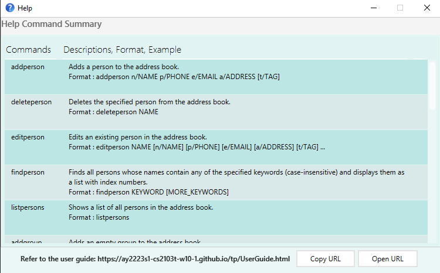
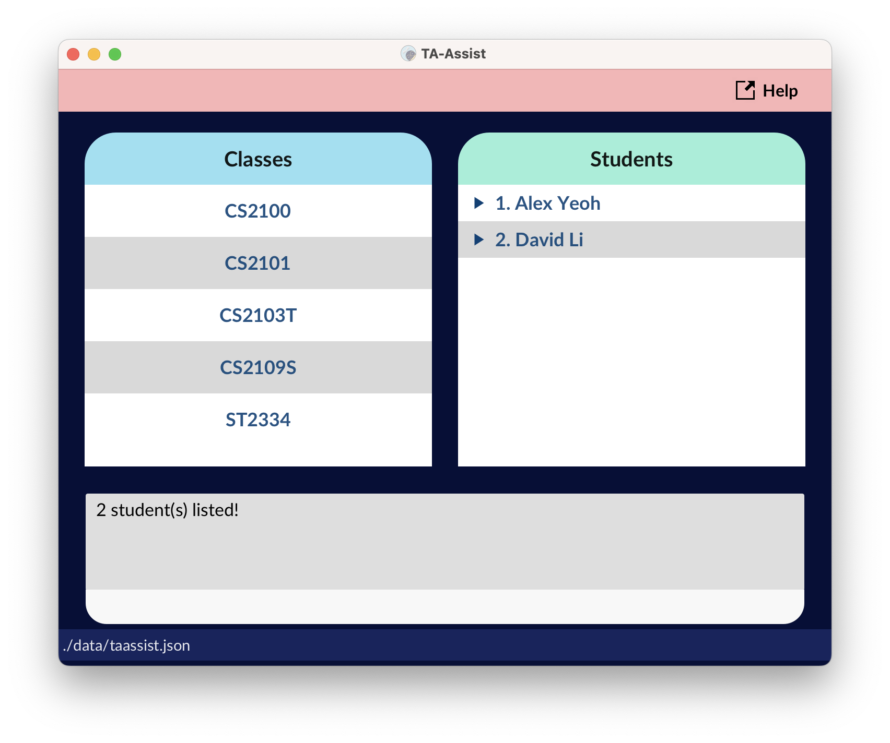

TABS helps project team leaders **overview tasks assigned to group members**. It is targeted at individuals with less programming background i.e. **less CLI-intensive** in nature.

- [`Quick start`](#quick-start)
- [`Features`](#features)
  - Viewing help: [`help`](#viewing-help--help)
  - Adding a person: [`addperson`](#adding-a-person-addperson)
  - Listing all persons: [`listpersons`](#listing-all-persons--listpersons)
  - Edit a person: [`editperson`](#editing-a-person--editperson)
  - Locating persons by name: [`findperson`](#locating-persons-by-name-findperson)
  - Deleting a person : [`deleteperson`](#deleting-a-person--deleteperson)
  - Adding a group: [`addgroup`](#creating-a-group--addgroup)
  - Add member to group: [`addmember`](#adding-a-member--addmember)
  - Delete member from group: [`deletemember`](#deleting-a-member--deletemember)
  - Assign member a task: [`assigntask`](#assigning-a-task-to-a-person-assigntask)
  - Delete task from member [`deletetask`](#deleting-a-task-from-a-person-deletetask)
  - Locate group by name: [`display`](#display-a-group--display)
  - Delete a group: [`deletegroup`](#deleting-a-group--deletegroup)
  - Exiting the program : [`exit`](#exiting-the-program--exit)
- [`Command summary`](#command-summary)

---
## Quick start

1. Ensure you have Java 11 or above installed in your Computer.
2. Download the latest TABS.jar.
3. Copy the file to the folder you want to use as the home folder for your TABS.
4. Double-click the file to start the app. The GUI similar to the below should appear in a few seconds.
Note how the app contains some sample data.
  

  
5. Refer to the [Features](#features) below for details of each command.

--------------------------------------------------------------------------------------------------------------------

## Features

**:information_source: Notes about the command format:** 

* Words in `UPPER_CASE` are the parameters to be supplied by the user. 
  e.g. in `addperson n/NAME`, `NAME` is a parameter which can be used as `addperson n/John Doe`.

* Items in square brackets are optional. 
  e.g `n/NAME [t/TAG]` can be used as `n/John Doe t/friend` or as `n/John Doe`.

* Items with `…`​ after them can be used multiple times including zero times. 
  e.g. `[t/TAG]…​` can be used as ` ` (i.e. 0 times), `t/friend`, `t/friend t/family` etc.

* Parameters can be in any order. 
  e.g. if the command specifies `n/NAME p/PHONE_NUMBER`, `p/PHONE_NUMBER n/NAME` is also acceptable.

* If a parameter is expected only once in the command but you specified it multiple times, only the last occurrence of the parameter will be taken. 
  e.g. if you specify `p/12341234 p/56785678`, only `p/56785678` will be taken.

* Extraneous parameters for commands that do not take in parameters (such as `listpersons`, `exit` and `clear`) will be ignored. 
  e.g. if the command specifies `listpersons 123`, it will be interpreted as `listpersons`.

### Viewing help : help
Shows a message explaining how to access the help page.

Format: help

### Adding a person: `addperson`

Adds a person to the address book.

Format: `addperson n/NAME p/PHONE_NUMBER e/EMAIL a/ADDRESS [t/TAG]…​`

:bulb:
<b>Tip:</b> A person can have any number of tags (including 0)

Examples:
* `addperson n/John Doe p/98765432 e/johnd@example.com a/John street, block 123, #01-01`
* `addperson n/Betsy Crowe t/friend e/betsycrowe@example.com a/Newgate Prison p/1234567 t/criminal`

### Listing all persons : `listpersons`

Shows a list of all persons in the address book.

Format: `listpersons`

### Editing a person : `editperson`

Edits an existing person in the address book.

Format: `editperson NAME [n/NAME] [p/PHONE] [e/EMAIL] [a/ADDRESS] [t/TAG]…​`

* Edits the person with the specified `NAME`. The person with this `NAME` must already exist in the app.
* At least one of the optional fields must be provided.
* Existing values will be updated to the input values.
* When editing tags, the existing tags of the person will be removed i.e adding of tags is not cumulative.
* You can remove all the person’s tags by typing `t/` without
    specifying any tags after it.

Examples:
*  `editperson John Doe p/91234567 e/johndoe@example.com` Edits the phone number and email address of `John Doe` to be `91234567` and `johndoe@example.com` respectively.
*  `editperson BetsyCrower n/Betsy Crower t/` Edits the name of `BetsyCrower` to be `Betsy Crower` and clears all existing tags.

### Locating persons by name: `findperson`

Finds persons whose names contain any of the given keywords.

Format: `findperson KEYWORD [MORE_KEYWORDS]`

* The search is case-insensitive. e.g `hans` will match `Hans`
* The order of the keywords does not matter. e.g. `Hans Bo` will match `Bo Hans`
* Only the name is searched.
* Only full words will be matched e.g. `Han` will not match `Hans`
* Persons matching at least one keyword will be returned (i.e. `OR` search).
  e.g. `Hans Bo` will return `Hans Gruber`, `Bo Yang`

Examples:
* `findperson John` returns `john` and `John Doe`
* `findperson alex david` returns `Alex Yeoh`, `David Li`
 
 
  

### Deleting a person : `deleteperson`

Deletes the specified person from the address book.

Format: `deleteperson NAME`

* Deletes the person with the specified `NAME`. The person with this `NAME` must already exist in the app.

Examples:
* `deleteperson Betsy` deletes the person with the username `Betsy`.
* `deleteperson Betsy Hoover` deletes the person with the username `Betsy Hoover`.

### Creating a group : `addgroup`

Creates a new group with no members.

Format: `addgroup  GROUP`

* Creates a group with the specified `GROUP`

Examples:

* `addgroup CS2103T`

### Adding a member : `addmember`

Adds an existing person to an existing group in TABS.

Format: `addmember g/GROUP n/NAME`

Examples:

* `addmember g/CS2103T n/UserName`
* `addmember g/CS2101 n/DefaultUser`

### Deleting a member : `deletemember`

Deletes an existing person from an existing group in TABS.

Format: `deletemember g/GROUP n/NAME`

Examples:

* `deletemember g/CS2103T n/UserName`
* `deletemember g/CS2101 n/DefaultUser`
### Assigning a task to a person: `assigntask`

Assigns a task to a person with a group in TABS.

Format: `assigntask NAME g/GROUP task/TASK`

* Assigns a `TASK` to a person with the specified `NAME` and specified `GROUP`.
* `TASK` is of type String.

Examples:

* `assigntask John g/CS2103T task/TeamProject` assigns TeamProject task to person John with group CS2103T.
* `assigntask Billy g/Team Delta task/Delta Project` assigns Delta Project to person Billy with group Team Delta.

### Deleting a task from a person: `deletetask`

Deletes a task from a person in a group in TABS.

Format: `deletetask NAME g/GROUP task/TASK`

* Deletes a `TASK` from a person with the specified `NAME` and specified `GROUP`.
* `TASK` is of type String.

Examples:

* `deletetask John g/CS2103T task/TeamProject` deletes TeamProject task from person John in group CS2103T.
* `deletetask Billy g/Team Delta task/Delta Project` deletes Delta Project from person Billy with in Team Delta.

### Display a group : `display`

Displays the group members allocated to the specified group. Instead of details, assigned tasks will be listed.

Format: `display GROUP`

Lists the members associated with the `GROUP` and their tasks.

Examples:

* `display CS2103T` displays the users under group CS2103T

### Deleting a group : `deletegroup`

Deletes the specified group from the address book.

Format: `deletegroup GROUP`

Deletes the group with the group name `GROUP`.

Examples:

* `deletegroup CS2103T` deletes the group CS2103T

### Exiting the program : `exit`

Exits the program.

Format: `exit`

--------------------------------------------------------------------------------------------------------------------

## Command summary

 Action | Format, Examples
-------------------|------------------
**Add Person** | `addperson [n/NAME] [p/PHONE_NUMBER] [e/EMAIL] [a/ADDRESS] [t/TAG]…`   e.g. `adduser n/James Ho p/22224444 e/jamesho@example.com a/123, Clementi Rd, 1234665 t/friend t/colleague`
**Delete Person** | `deleteperson NAME`  e.g. `deleteuser James Ho`
**Edit Person** | `editperson NAME [n/NAME] [p/PHONE_NUMBER] [e/EMAIL] [a/ADDRESS] [t/TAG]…`  e.g. `edituser 2 n/James Lee e/jameslee@example.com`
**Find Person** | `findperson KEYWORD [MORE_KEYWORDS]`  e.g. `finduser James Jake`
**List** | `listpersons`
**Add Group** | `addgroup GROUP`   e.g. `addgroup CS2103T`
**Add Member** | `addmember [g/GROUP] [n/NAME]`   e.g. `addmember g/CS2103T n/James Lee, addmember g/CS2101 n/DefaultUser`
**Delete Member** | `deletemember [g/GROUP] [n/NAME]`   e.g. `deletemember g/CS2103T n/James Lee, deletemember g/CS2101 n/DefaultUser`
**Assign Task** | `assigntask NAME [g/GROUP] [task/TASK]`   e.g. `assigntask John g/CS2103T task/TeamProject`
**Delete Task** | `deletetask NAME [g/GROUP] [task/TASK]`   e.g. `deletetask John g/CS2103T task/TeamProject`
**Display Group** | `display GROUP`   e.g. `display CS2103T`
**Delete Group** | `deletegroup GROUP`   e.g. `deletegroup CS2103T`
**Exit** | `exit`
