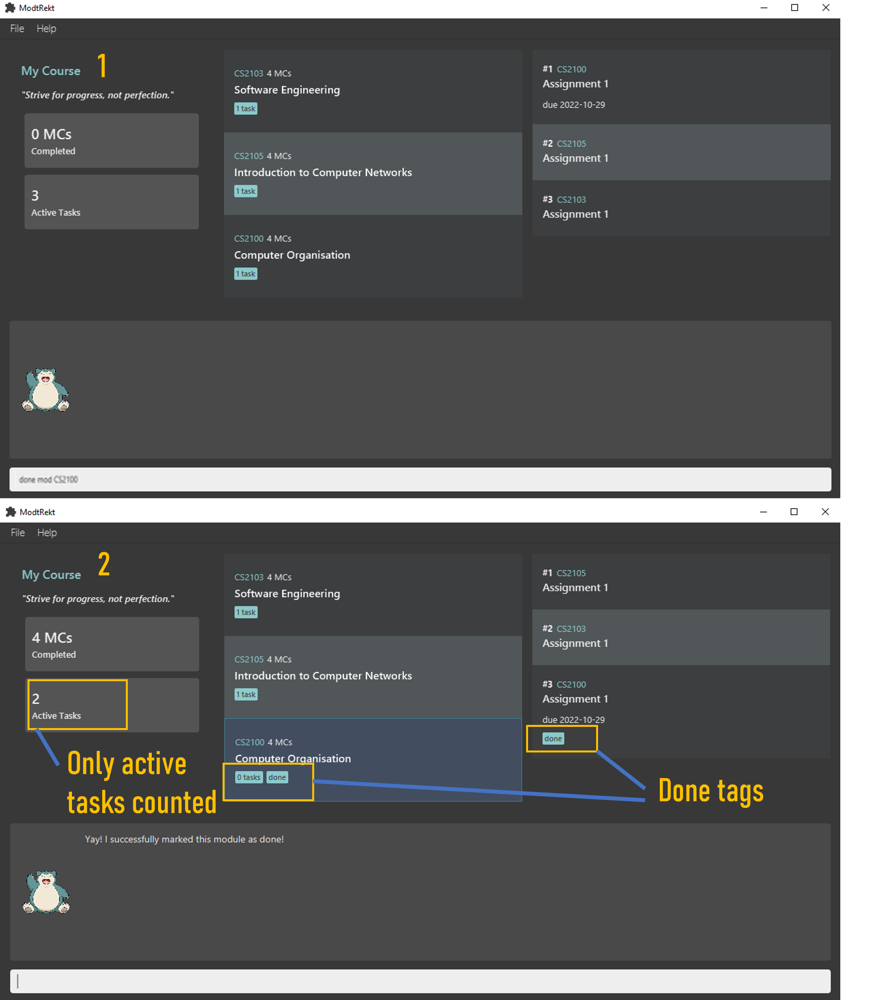
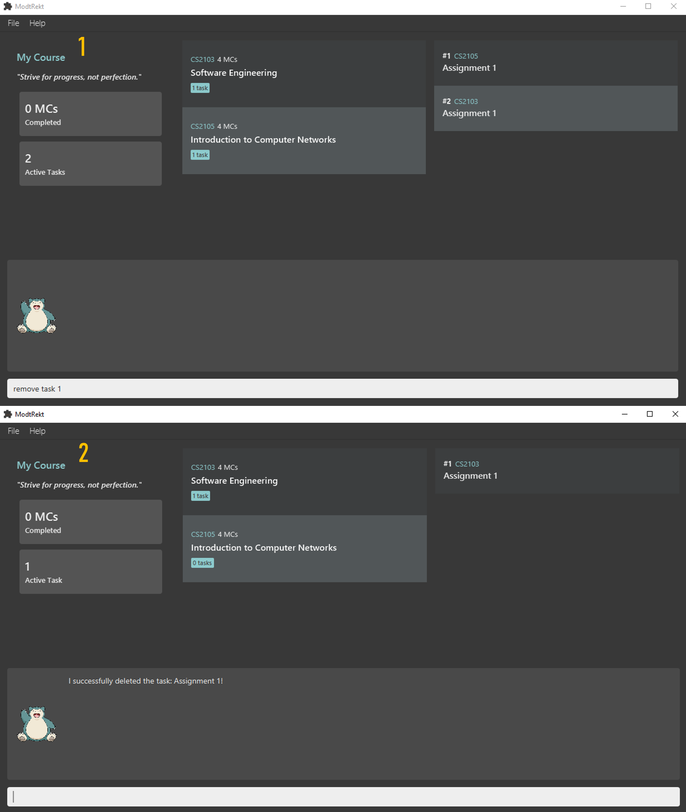

# ModtRekt User Guide

ModtRekt is a **desktop app for managing modules and tasks, optimized for use via a Command Line Interface** (CLI) while still having the benefits of a Graphical User Interface (GUI).

# Table of Contents
- [UI Mockups](#ui-mockups)
- [Quick Start](#quick-start)
- [Features](#features)
- [Command Summary](#command-summary)

## UI Mockups


--------------------------------------------------------------------------------------------------------------------

## Quick Start

1. Ensure you have Java 11 or above installed on your computer.

1. Download the latest `modtrekt.jar` from [here](https://github.com/AY2223S1-CS2103T-W10-4/tp/releases).

1. Copy the file to the folder you want to use as the home folder for your module tracker.

1. Double-click the file to start the app. The GUI similar to the screenshot above should appear in a few seconds. Note how the app contains some sample data.

1. Type the command in the command box and press `Enter` to execute it. e.g. typing `help` and pressing `Enter` will open the help window.

1.  Here are some example commands you can try:

    1. `add module CS2103T`: Adds a module called CS2103T to the module tracker.

    1. `cd CS2103T`: Sets the current module page to CS2103T.

    1. `add task "iP Week 6" -d 16/09/2022`: Adds a task called iP week 6, with a deadline of 16/09/2022, to the module tracker.

    1. `list`: Lists all the active tasks.

   1. `remove task 1`: Removes the first task of CS2103T.

   1. `exit`: Exits the app.

   1. Refer to the Features below for details of each command.


--------------------------------------------------------------------------------------------------------------------

## General Command Syntax

Every command starts with a **command phrase**, which may be single or multiple words.

> For example, `help` is a single-word command phrase.
> `add module` and `add task` are examples of multiple-word command phrases, but `add` itself is not a valid command.

The command phrase may be followed (after a space) by a **main parameter**, depending on the command.
Fret not about the specifics of the commands in this section; we will cover each command in detail in the following sections.

> For example, `CS2040S` is the main parameter in the commands `add module CS2040S` and `cd CS2040S`. 

Most commands have **parameters** which are prefixed with a dash (`-`). Each parameter can have _at most_ a **_single_ value**
immediately after it (and the mandatory space).

> Let's break down the command `add task "tP v1.3" -d 2022-10-28`.</br>
> We know from above that `add task` is the command phrase, and `"tP v1.3"` is the main parameter.</br>
> Here, `-d` is a parameter, and `2022-10-28` is its value.

Some commands even have **multiple parameters**, each separated by a space.

> For example, `add task -d 2022-10-28 "tP v1.3" -p high` has two parameters: `-d` and `-p`.

In the example above, notice how the position of the main parameter does not matter.
This is possible because every parameter has at most one value, so the command is still valid (and correct)!

Also, notice how we have been enclosing some parameter values in quotes (`"` or `'`)—this is only necessary if your value
contains a space.

Some parameters are optional. By default all parameters in the command formats we specify are mandatory.
We will surround **optional parameters** with square brackets (`[]`).

> For example, we define the list command format to be `list task [-a]`. This means you need not specify the `-a` parameter
> depending on your intention with the usage of the command.

That's it! You should now be able to understand the command syntax for the rest of this document.

### Command Quirks

You may be wondering how to include quotes in your parameter values. For example, what if you want to add a task with the name
`CS2103T "iP" Week 6`?

You can do so by enclosing the entire value in quotes of the other type. For example, if you use double-quotes in your
value, you can enclose the entire value in single-quotes, and vice versa.

> For example, `add task 'CS2103T "iP" Week 6' -d 2022-10-28` includes the double-quotes in the task description.

Alternatively, you can escape the quotes (or any symbol) by using a backslash (\) before the quote,
which tells ModtRekt to treat the quote as a normal character.

> The command `add task "CS2103T \"iP\" Week 6" -d 2022-10-28` is equivalent to the previous example.

## Features

In this section, we will cover the features of ModtRekt, and introduce the syntax of the various commands.

<div markdown="block" class="alert alert-info">

### General
`help`

Shows a message which provides a link to this user guide.

Sample execution of command `help`:


`exit`

Exits the application.

### Modules

#### Adding a module: `add module`

Adds a module to the application.

To allow our users to easily add modules via their module code, our module information is fetched from 
[NUSMods](https://nusmods.com/modules?sem[0]=1&sem[1]=2&sem[2]=3&sem[3]=4),
hence the module code you specify must be a valid NUS module code. 
If the module code is invalid, the module will not be added. Additionally, since an integration with NUSMods 
is a collaboration we would like to seek in future revisions of our app, we have decided to use the AY2022-2023 module 
list, hence beyond this AY, the module information and codes may have changed.

Format: `add module <module code>`
Shorthand: `add mod <module code>`

- The module code is case-insensitive e.g. `cs2103t` will match **CS2103T**

Examples:
- `add module CS2103T`
- `add mod CS2103T`

The app also supports the addition of customised modules, which may or may not be in NUSMods.
This is useful for users with other commitments, such as internships, that they would like to track in the app.
Note that if your customised module is not in NUSMods, you would still need to specify the module credits, for example, 0.

Format: `add module <module code> -n <custom module name> -cr <module credits>`
Shorthand: `add mod <module code> -n <custom module name> -cr <module credits>`

Sample execution of command `add mod CS2100`:


#### Removing a module: `remove module`

Deletes a module from the program. Users specify a module code to delete.

Format: `remove module <module code>`
Shorthand: `rm mod <module code>`

- The module code is case-insensitive e.g. `cs2103t` will match **CS2103T**
- Module code must match an existing module.

Examples:
- `remove module CS2103T`
- `rm mod CS2103T`

Sample execution of command `remove mod CS2100`:


#### Entering a module: `cd`

Sets the current module page to the specified module.

Format: `cd <module code>`

Allows user to view information relating to the specified module.
- Scopes the user’s actions to the specified module.
- The module code is case-insensitive e.g. `cs2103t` will match **CS2103T**
- Module code must match an existing module.

Examples:
- `cd CS2103T`

Sample execution of command `cd CS2100`:


### Exiting a module: `cd`

Exits the current module page to revert to showing all modules.

Format: `cd ..`

Allows user to view all active tasks from all modules instead of only those belonging to a specific module.

Examples:
- `cd ..`

Sample execution of command `cd ..`:


#### Marks a module as done: `done module`

Marks a module as done. 
- After you mark a module as done, your total completed module credits (MCs) will be updated.
- Marking a module as done will mark all active tasks belonging to that module as done.

Format: `done module <module code>`

Shorthand: `done mod <module code>`

Examples:
- `done module CS1101S`

Sample execution of command `done module CS2100`:


#### Marks undone a module: `undone module`

Marks a module as undone. 
- After you unmark a module as done, your total completed module credits (MCs) will be updated.
- Unmarking a module will not affect its tasks, i.e. your original tasks will not be marked as undone)

Sample execution of command `done module CS2105`, with CS2105 marked as done initially:


#### Listing all modules: `list module`

Shows all the modules you have added.
- Using the command without `-a` flag will show you only undone modules.
- Using the command with `-a` flag will show you all modules, including those marked as done.

Format: `list module [-a]`

Shorthand: `list mod [-a]`, `ls module [-a]`, `ls mod [-a]`

Examples:
- `list module -a`

Sample execution of command `list module -a`:


### Tasks

#### Adding a task: `add task`

Adds a task under a specific module.
- You may have selected a module (i.e. used the [`cd` command](#entering-a-module-cd) to select a module).
- You can specify a deadline for the task with the `-d` flag along with the deadline in YYYY-MM-DD format.
- The task description accepts only use letters, numbers, spaces, and other
  American Standard Code for Information Interchange [(ASCII)](https://en.wikipedia.org/wiki/ASCII) characters.
- The task description must be enclosed in double-quotes (`""`) if it contains spaces.
- The symbols `-` and `"` are special characters and must be escaped with a backslash (`\`) to
  be used in the task description, e.g. `add task "foo\-\"bar\""` will result in the description `foo-"bar"`. 

Format (if `cd`'d previously): `add task <description> [-d <deadline>]`

Format (if not `cd`'d`): `add task <description>  -c <module code> [-d <deadline>]`

Example:
`cd CS2100` followed by `add task "Assignment 1" -d 2022-10-29`, or equivalently,
`add task "Assignment 1" -c cCS2100 -d 2022-10-29`

Sample execution of command `add "Assignment 1" -c CS2100 -d 2022-10-29`:


#### Removing a task: `remove task`

Removes a task under a specific module.

- The task index must be a non-zero positive integer, and have a corresponding task indicated with `#` in the task list.

Format: `remove task <task index>`

Shorthand: `rm task <task index>`

Examples:
- `remove task 1`
- `rm -t 1`

Sample execution of command `remove task 1` with 2 active tasks displayed:


#### Marking a task as done: `done task`

Marks a task as done, specified via its index in the task list.

- The task index must be a non-zero positive integer, and have a corresponding task indicated with `#` in the task list.

Format: `done task <task index>`

Examples:
- `done task 1`

Sample execution of command `done task 1` with 6 active tasks displayed:


#### Marking a task as undone: `undone task`

Marks a task as undone, specified via its index in the task list.

- The task index must be a non-zero positive integer, and have a corresponding task indicated with `#` in the task list.

Format: `undone task <task index>`

Examples:
- `undone task 1`

Sample execution of command `undone task 6` with 6 active tasks displayed:


#### Listing all tasks: `list task`

Shows only the active tasks (i.e. tasks which are undone) by default.
Include the optional `-a` flag to the command to show all tasks, including those that are done.

If you have used the [`cd` command](#entering-a-module-cd) to select a module, this will
only show the tasks under the selected module.

Format: `list task [-a]`

Shorthand: `ls task [-a]`

Examples:
- `list task -a` shows all tasks, including those marked as done.
- `ls task` hides all done tasks.

--------------------------------------------------------------------------------------------------------------------

## FAQ

**Q**: How do I transfer my data to another Computer?<br>
**A**: Install the app in the other computer and overwrite the empty data file it creates with the file that contains 
the data of your previous ModuleList home folder.
**Q**: Is my data saved when I close the app?<br>
**A**: Yes! We keep track of your modules and tasks, and they will automatically be shown when you re-open the application.
**Q**: Do I need a working internet connection to use this application?<br>
**A**: No, it is not required. We have a backup data file of all NUS modules for AY2022-2023, so no internet is required.


--------------------------------------------------------------------------------------------------------------------

## Command summary

```< >``` for mandatory arguments

```[ ]``` for optional arguments

### General

|       Action        | Format          | Examples        |
|:-------------------:|-----------------|-----------------|
|      **Help**       | `help`          | `help`          |
|      **Exit**       | `exit`          | `exit`          |

### Modules

|          Action           | Format                                                                              | Examples                                                           |
|:-------------------------:|-------------------------------------------------------------------------------------|--------------------------------------------------------------------|
|     **Add a Module**      | `add module <module code>`<br/>`add mod <module code>`                              | `add module CS2103T`<br/>`add mod CS2103T`                         |
|    **Remove a Module**    | `remove module <module code>`<br/>`rm mod <module code>`                            | `remove module CS2103T`<br/>`rm mod cS2103t`                       |
|    **Go to a Module**     | `cd <mod, code>`                                                                    | `cd CS2103T`                                                       |
|  **Marks done a Module**  | `done module <module code>` <br/> `done mod <module code>`                          | `done module CS1101S` <br/> `done mod CS1101S`                     |
| **Marks undone a Module** | `undone module <module code>` <br/> `undone mod <module code>`                      | `undone module CS1101S` <br/> `undone mod CS1101S`                 |
|   **List All Modules**    | `list module [-a]` <br/> `list mod [-a]` <br/> `ls module [-a]` <br/> `ls mod [-a]` | `list module`<br/> `list mod -a`<br/> `ls module`<br/> `ls mod -a` |

### Tasks

|       Action       | Format                                                    | Examples                                              |
|:------------------:|-----------------------------------------------------------|-------------------------------------------------------|
|   **Add a Task**   | `add task <description> [-d <deadline>] -c <module code>` | `add task do Assignment 1 -d 15/09/2022 -c CS2100`    |
| **Remove a Task**  | `remove task <index> `<br/>`rm -t <index>`                | `remove task 1`<br/>`rm -t 1`                         |
| **List All Tasks** | `list tasks` <br/> `ls -t`                                | `list tasks`<br/>`ls -t`                              |


### Glossary

|       Terms        | Description                                                                                             |
|:------------------:|---------------------------------------------------------------------------------------------------------|
|   **AY**           | Academic Year                                                                                           |
| **GUI**            | Graphical User Interface                                                                                |
| **CLI**            | Command Line Interface                                                                                  |
| **Syntax**         | Structure of statements                                                                                 |
| **NUSMods**        | A timetabling application created for NUS students, containing information about all modules in NUS.    |
| **cd**             | Shorthand for `change directory`, in the context of our application, modules can be seen as directories |
| **MCs**            | Modular credits                                                                                         |
| **ASCII**          | American Standard Code for Information Interchange                                                      |
| **NUS**            | National University of Singapore                                                                        |
