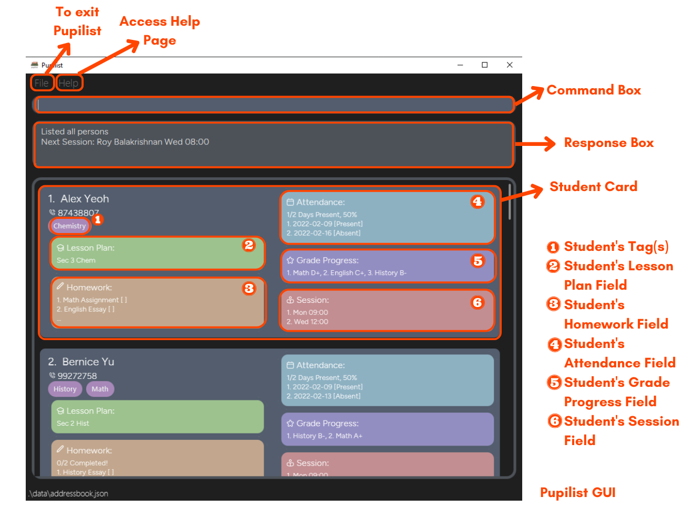
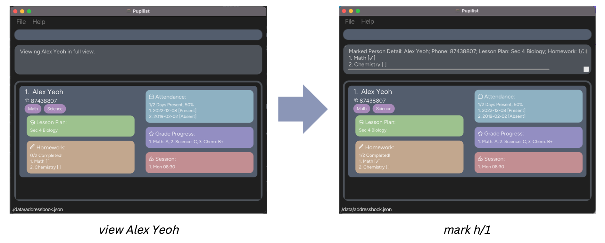
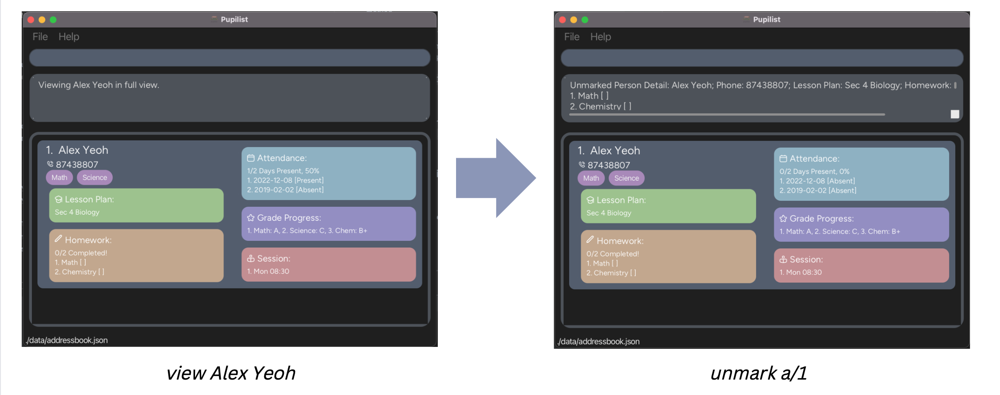
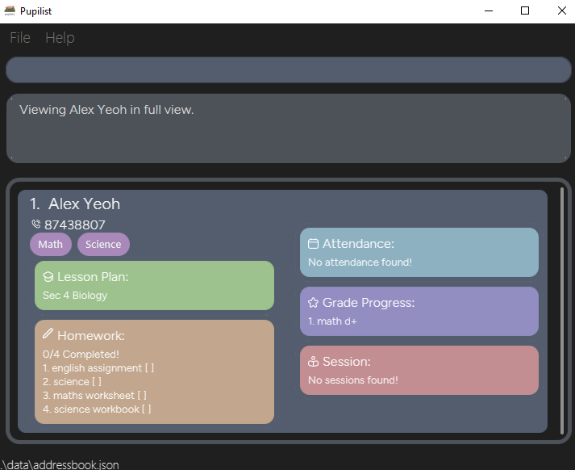
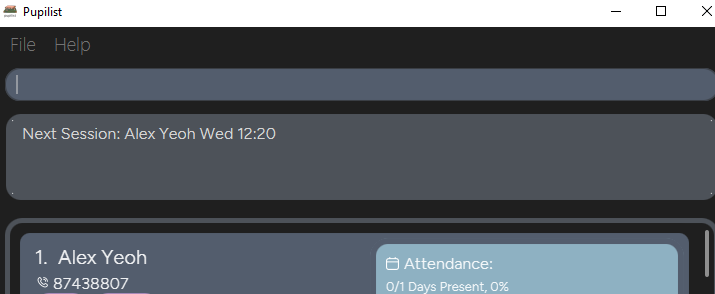

<h1> Pupilist User Guide</h1>
Welcome to Pupilist's User Guide!

  

Pupilist is an **application for managing students details for private tutors**. It aims to **help you organise your students information to better manage your lessons and students in an all-in-one application**.

If you are a private tutor struggling to:
1. keep track of your students and their individual lesson plans
2. keep track of your students grades, homework and attendance
3. keep track of your lesson timings
4. keep track of your students' contact information

Pupilist can get your scheduling done faster with single line CLI command inputs to manage all your tutoring needs.
 
* Table of Contents
{:toc}

---

## Introducing Pupilist

  

## Glossary

| Term       | Description                                                                                                                                                                                                                                                           |
|------------|-----------------------------------------------------------------------------------------------------------------------------------------------------------------------------------------------------------------------------------------------------------------------|
| CLI        | Command-Line Interface. Refers to programs that receive commands in the form of a single line of text.                                                                                                                                                                |
| GUI        | Graphical User Interface. Refers to the screen displayed.                                                                                                                                                                                                             |
| Parameter  | Refers to any information Pupilist may require to execute a specific command.  For example, the [`View`](#viewing-students-details-view) command requires a NAME parameter for Pupilist to display information of the Student, assuming a valid name in view mode. |
| Prefixes   | A prefix indicates the type of field you are keying in. The list of prefixes supported by Pupilist can be found [here](#prefixes-summaries).                                                                                                                          |

## Quick start

1. Ensure you have Java `11` or above installed in your Computer.
2. Download the latest `Pupilist.jar` from [here](https://github.com/AY2223S1-CS2103T-W09-4/tp/releases).
3. Copy the file to the folder you want to use as the _home folder_ for Pupilist.
4. Double-click the file to start the app. The GUI similar to the below should appear in a few seconds. Note how the app contains some sample data. 
   
5. Type the command in the command box and press Enter to execute it. e.g. typing **`help`** and pressing Enter will open the help window. 
   Some example commands you can try:

   * **`list`** : Lists all contacts.
   * **`add`**`n/John Doe p/98765432 lp/Algorithms` : Adds a contact named `John Doe` to Pupilist.
   * **`delete`**`3` : Deletes the 3rd contact shown in the current list.
   * **`clear`** : Deletes all contacts.
   * **`exit`** : Exits the app.
6. Refer to the [Features](#features) below for details of each command.

---

## Features

**:information_source: Notes about the command format:** 

* Words in `UPPER_CASE` are the parameters to be supplied by the user. 
  e.g. in `add n/NAME`, `NAME` is a parameter which can be used as `add n/John Doe`.
* Items in square brackets are optional. 
  e.g `n/NAME [h/HOMEWORK]` can be used as `n/John Doe h/math` or as `n/John Doe`.
* Items with `…` after them can be used multiple times including zero times. 
  e.g. `[t/Tag]…` can be used as ` ` (i.e. 0 times), `t/Math`, `t/Math t/Science` etc.
* Parameters with prefixes can be in any order. 
  e.g. if the command specifies `n/NAME p/PHONE_NUMBER`, `p/PHONE_NUMBER n/NAME` is also acceptable.
* Index has to be supplied according to format given. 
  e.g. if the command specifies `hw INDEX h/HOMEWORK`, `hw h/HOMEWORK INDEX` is not allowed.
* If a parameter is expected only once in the command but you specified it multiple times, only the last occurrence of the parameter will be taken. 
  e.g. if you specify `p/12341234 p/56785678`, only `p/56785678` will be taken.
* Extraneous parameters for commands that do not take in parameters (such as `help`, `list`, `exit` and `clear`) will be ignored. 
  e.g. if the command specifies `help 123`, it will be interpreted as `help`.

### Adding details

#### Adding a student: `add`

This command adds a student to Pupilist. A student is considered a duplicate only if the names are the same (non case-sensitive). 
**Usage**: List mode only

Format: `add n/NAME p/PHONE_NUMBER lp/LESSON_PLAN [t/TAG]...`

Examples:

* `add n/Farisa p/87159999 lp/Sec 4 Chemistry`

#### Adding Homework to student: `hw`

This command adds a homework description to a student in Pupilist.
Does not check for duplicate homework entries. 
**Usage**: View or list mode only

Format: `hw INDEX h/HOMEWORK`

* Adds homework to student with the specified `INDEX`
* In view mode, INDEX should always be 1 (as per the view list)

Examples:

* `hw 1 h/math assignment` adds math assignment to first student in Pupilist.

#### Adding Grade Progress to student: `grade`

This command adds a grade progress description to a student in Pupilist.
Pupilist does not check for duplicate grade progress entries. 
**Usage**: View or list mode only

Format: `grade INDEX g/GRADE_PROGRESS`

* Adds grade progress to student with the specified `INDEX`
* GRADE_PROGRESS does not require any fixed format, thus there will be no format restraints
* In view mode, INDEX should always be 1 (as per the view list)

Examples:

* `grade 1 g/Math: D+` adds Math: D+ grade to first student in Pupilist.

#### Adding Attendance to student : `attendance`

This command adds an attendance date to a student in Pupilist.
Does not check for duplicate entries. 
**Usage**: View or list mode only

Format: `attendance INDEX a/ATTENDANCE`

* Adds attendance to student with the specified `INDEX` 
* Attendance must be in `YYYY-MM-DD` format
* In view mode, INDEX should always be 1 (as per the view list)

Examples:

* `attendance 1 a/2022-12-08` adds 2022-12-08 to the attendance list of the first student in Pupilist.

#### Adding Session to student: `session`

This command adds a session day and time to a student, and is expected to repeat weekly.
Does not check for duplicate entries. 
**Usage**: View or list mode only

Format: `session INDEX s/TUITION_TIME`

* Adds tuition time to student with the specified `INDEX` 
* Tuition time must be in `DDD HH:MM` format where `HH:MM` ranges from 00:00 to 23:59
* In view mode, INDEX should always be 1 (as per the view list)

Examples:

* `session 1 s/MON 12:00` adds a tuition slot at Monday 12pm to the first student in Pupilist.

#### Update Lesson Plan for student: `lesson`

This command updates a student's lesson plan by overwriting the current one. 
**Usage**: View or list mode only

Format: `lesson INDEX lp/LESSON_PLAN`

* Updates lesson plan of student with the specified `INDEX` 
* In view mode, INDEX should always be 1 (as per the view list)

Examples:

* `lesson 1 lp/science` changes lesson plan of the first student to science.

### Editing details

#### Editing a student : `edit`

This command edits an existing student in Pupilist.
For fields requiring an INDEX, existing fields have to contain a value before editing is allowed, else there will be no INDEX. 
**Usage**: View mode only

Format: `edit [n/NAME] [p/PHONE] [lp/LESSON_PLAN] [t/TAG]...` 
`edit [h/ a/ g/ s/]INDEX NEW_FIELD`

It requires at least one of the optional fields:

- n/: To be followed by updated name of student
- p/: To be followed by updated phone number of student
- lp/: To be followed by updated lesson plan of student
- h/: To be followed by INDEX of homework to be updated, then updated homework
- a/: To be followed by INDEX of attendance to be updated, then updated attendance
- g/: To be followed by INDEX of grade to be updated, then updated grade
- s/: To be followed by INDEX of session to be updated, then updated session
- t/: To be followed by the student's tags, all tags can be removed by typing `t/` without specifying any tags after it

Examples:

* `view Alex Yeoh` returns `Alex Yeoh`  
  `edit h/2 math not done` updates 2nd field of `Alex Yeoh`'s HOMEWORK to `math not done`

#### Marking specific field in student: `mark`

This command marks a specific field of a student in Pupilist. 
**Usage**: View mode only

It requires one field:

- h/: To be followed by INDEX of homework to be marked
- a/: To be followed by INDEX of attendance to be marked

:exclamation: **Caution:**
Only allows the marking of one field in a single command.
Does not allow commands such as `mark h/2 a/1` or `mark a/2 a/3`.

Format: `mark [h/ a/]INDEX`

Examples:

* `view Alex Yeoh` returns `Alex Yeoh`  
  `mark h/1` marks `Alex Yeoh`'s *homework at first index*
  

#### Unmarking specific field in student: `unmark`

Use `unmark` command to unmark a specific field of a student in Pupilist. 
**Usage**: View mode only

It requires one field:

- h/: To be followed by INDEX of homework to be unmarked
- a/: To be followed by INDEX of attendance to be unmarked

:exclamation: **Caution:**
Allows for unmarking of only one field in a single command.
Does not allow commands such as `unmark h/2 a/1` or `unmark a/2 a/3`.

Format: `unmark [h/ a/]INDEX`

Examples:

* `view Alex Yeoh` returns `Alex Yeoh`  
  `unmark a/1` unmarks `Alex Yeoh`'s *attendance at first index*
  

### Removing details

#### Removing specific field in student: `remove`

This command removes a specific field of a student in Pupilist at the specified index. 
**Usage**: View mode only

It requires at least one field:

- h/: To be followed by INDEX of homework to be removed
- a/: To be followed by INDEX of attendance to be removed
- g/: To be followed by INDEX of grade to be removed
- s/: To be followed by INDEX of session to be removed

Allows for edits of multiple fields in a single command. However, a single command should remove at most one item from each field.  

Format: `remove [h/ a/ g/ s/]INDEX`

Examples:

* `view Alex Yeoh` returns `Alex Yeoh`  
  `remove h/2` removes `Alex Yeoh`'s *homework at second index*
* `view John Doe` returns `John Doe`  
  `remove h/2 a/1` removes `John Doe`'s *homework at second index* and *attendance at first index*

#### Deleting a student : `delete`

This command deletes the specified student from Pupilist. 
**Usage**: View or list mode only

Format: `delete INDEX`

* Deletes the student with the specified `INDEX`
* In view mode, INDEX should always be 1 (as per the view list)

Examples:

* `delete 1` removes the first student in Pupilist.

#### Clearing all entries : `clear`

This command clears all entries from Pupilist. 
**Usage**: All modes

Format: `clear`

### Viewing details

#### Listing all students : `list`

This command shows a list of all students in Pupilist. It changes Pupilist to list mode and displays
the next session in the response box. 
**Usage**: All modes

Format: `list`

#### Locating students by name: `find`

This command finds students whose names contain any of the given keywords. 
**Usage**: All modes

Format: `find KEYWORD [MORE_KEYWORDS]`

* The search is case-insensitive. e.g `hans` will match `Hans`
* The order of the keywords does not matter. e.g. `Hans Bo` will match `Bo Hans`
* Only the name is searched.
* Only full words will be matched e.g. `Han` will not match `Hans`
* Students matching at least one keyword will be returned (i.e. `OR` search).
  e.g. `Hans Bo` will return `Hans Gruber`, `Bo Yang`

Examples:

* `find John` returns `john` and `John Doe`
* `find alex david` returns `Alex Yeoh`, `David Li` 
  

#### Viewing students details: `view`

This command displays the full details of a student. Changest Pupilist to view mode, which is required to `edit` or `remove` a student's details.
Only one student's details can be viewed at a time. 
**Usage**: All modes

Format: `view NAME`

* The command requires the full `NAME` of a student
* The search is case-insensitive. e.g `hans` will match `Hans`
* Only full words will be matched e.g. `Han` will not match `Hans`

#### Viewing daily schedule: `show`

This command displays all sessions scheduled on a certain day of the week. Changes Pupilist to schedule mode. 
**Usage**: All modes

Format: `show [DDD]`

Examples:

* `show MON` lists all tuition timings scheduled for Monday.

### Running the app

#### Viewing help : `help`

This command opens a window that displays a list of basic commands and how to use them. 
**Usage**: All modes

Format: `help`

#### Exiting the program : `exit`

This command exits the program. 
**Usage**: All modes

Format: `exit`

#### Next Session

Pupilist helps to organise session timings automatically. No command is required for this feature.
This feature is shown on launch of the application and when the [`list`](#listing-all-persons--list) command is used.

Pupilist checks for the upcoming sessions based on the current device time, then displays the name of 
the student and the corresponding session.

#### Saving the data

Pupilist data is saved in the hard disk automatically after any command that changes the data. There is no need to save manually.

#### Editing the data file

Pupilist data is saved as a JSON file `[JAR file location]/data/addressbook.json`. Advanced users are welcome to update the data directly by editing that data file.

:exclamation: **Caution:**
If any changes to the data file makes its format invalid, Pupilist will discard all data and start with an empty data file at the next run.

#### Archiving data files `[coming in v2.0]`

_Details coming soon ..._

---

## FAQ

**Q**: How do I transfer my data to another computer? 
**A**: Install the app in the other computer and overwrite the empty data file it creates with the file that contains the data of your previous Pupilist home folder. 
**Q**: How do I start? 
**A**: Launch the app and use the help command to learn all about the other commands! 
**Q**: Where do I check for updates on the app? 
**A**: Check periodically on GitHub for our latest updates on the app.

---

## Summaries

### Command summary

| Action                 | Format, Examples                                                                                                                                                             |
|------------------------|------------------------------------------------------------------------------------------------------------------------------------------------------------------------------|
| **Add**                | `add n/NAME p/PHONE_NUMBER lp/LESSON_PLAN [t/TAG]...`   e.g., `add n/James Ho p/96775567 lp/english`                                                                      |
| **Add Attendance**     | `attendance INDEX a/ATTENDANCE`  e.g., `attendance 2 a/2022-12-08`                                                                                                        |
| **Add Grade**          | `grade INDEX g/GRADE`  e.g., `grade 2 g/English: B+`                                                                                                                      |
| **Add Homework**       | `hw INDEX h/HOMEWORK`  e.g., `hw 1 h/Science worksheet`                                                                                                                   |
| **Add Session**        | `session INDEX s/SESSION`   e.g., `session 1 s/mon 09:00`                                                                                                                 |
| **Clear**              | `clear`                                                                                                                                                                      |
| **Delete**             | `delete INDEX`  e.g., `delete 1`                                                                                                                                          |
| **Edit**               | `edit [n/NAME p/PHONE_NUMBER lp/LESSON_PLAN] [t/TAG]...`  `edit [s/INDEX SESSION h/INDEX HOMEWORK g/INDEX GRADE a/INDEX ATTENDANCE]`  e.g.,`edit n/James Lee h/1 math` |
| **Exit**               | `exit`                                                                                                                                                                       |
| **Find**               | `find KEYWORD [MORE_KEYWORDS]`  e.g., `find James Jake`                                                                                                                   |
| **Help**               | `help`                                                                                                                                                                       |
| **List**               | `list`                                                                                                                                                                       |
| **Mark Item**          | `mark [h/INDEX HOMEWORK a/INDEX ATTENDANCE]`  e.g., `mark a/1`                                                                                                            |
| **Remove**             | `remove [s/INDEX SESSION h/INDEX HOMEWORK g/INDEX GRADE a/INDEX ATTENDANCE]`  e.g., `remove h/1`                                                                          |
| **Show Schedule**      | `show [DDD]`  e.g., `show MON`                                                                                                                                            |
| **Unmark Item**        | `unmark [h/INDEX HOMEWORK a/INDEX ATTENDANCE]`  e.g., `unmark h/2`                                                                                                        |
| **Update Lesson plan** | `lesson INDEX lp/LESSON_PLAN`  e.g., `lesson 1 lp/Biology`                                                                                                                |
| **View**               | `view NAME`  e.g., `view James Ho`                                                                                                                                        |

### Prefixes summaries

| Prefix | Definition                | Usage                                                                                                                                                                       | Example              |
|--------|---------------------------|-----------------------------------------------------------------------------------------------------------------------------------------------------------------------------|----------------------|
| a/     | Attendance                | Numbers in the format of `YYYY-MM-DD`  where YYYY are four numbers making up the year, MM are two numbers making up the month and DD are two numbers making up the day.  | a/2022-12-08         |
| g/     | Subject and its grade     | Word description related to subject and grade.                                                                                                                              | g/Math: A+           |
| h/     | Homework                  | Word description related to homework.                                                                                                                                       | hw/Science Worksheet |
| lp/    | Lesson plan               | Word description related to lesson plan.                                                                                                                                    | lp/Diversity         |
| n/     | Name                      | Only numbers and letters. Spaces are allowed. Required field.                                                                                                               | n/Alex Ho            |
| p/     | Phone number              | Numbers only. Spaces are not allowed and at least 3 numbers. Required field.                                                                                                | p/97402341           |
| s/     | Session timing of lessons | Numbers in the format of`DDD HH:mm`  where DDD is three characters making up the day, HH are two numbers making up the hour and mm are two numbers making up the minute. | s/tue 08:30          |
| t/     | Tag                       | Any words. Optional.                                                                                                                                                        | t/Star student       |
