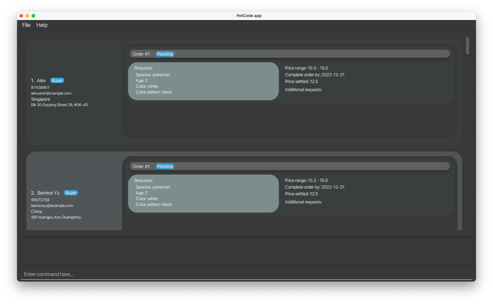
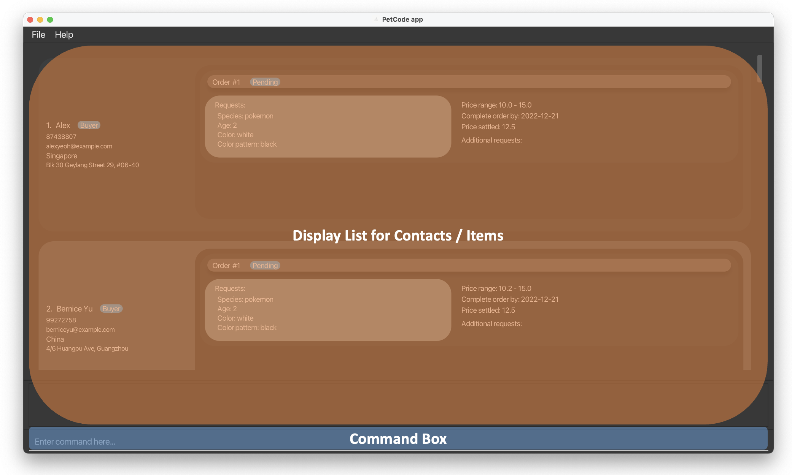
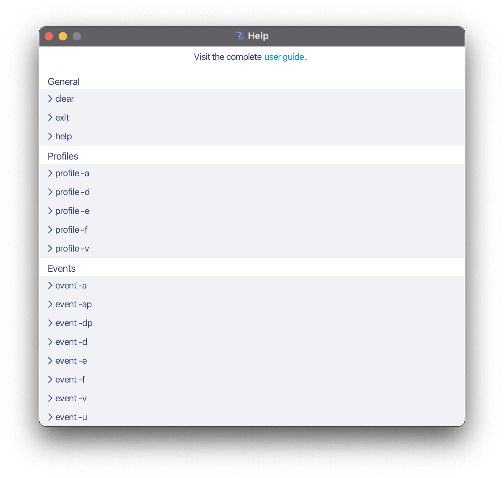
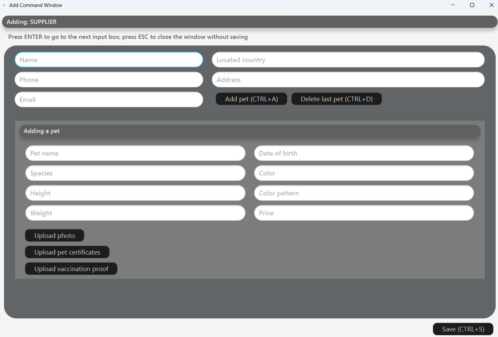

<h1> PetCode User Guide</h1>
Welcome to the PetCode user guide!

PetCode is a desktop app that helps <b>store and manage contact information for your pet sales coordination business</b>.

#### Using this guide
If this is the first time you are using this user guide, it is highly recommended for you to read the section on
[Introducing PetCode](#introducing-petcode). Otherwise,

* If you are setting up, please take a look at our [Quick Start guide](#quick-start).
* If you are unsure of how to use PetCode, the [Command Summary](#command-summary) table is a good starting point.
* If you are a developer and want to help out, please take a look at the [Developer Guide](DeveloperGuide.md).

## Table of Contents
- **[Introducing PetCode](#introducing-petcode)**
    * [What is PetCode?](#what-is-petcode)
    * [Glossary](#glossary)
    * [How to interpret the display window](#how-to-interpret-the-display-window)
- **[Quick Start](#quick-start)**
- **[Commands](#commands)**
    * [Viewing help](#viewing-help--help)
    * [Adding a contact or item](#adding-a-contact-or-item-add)
        + [Adding a buyer](#adding-a-buyer-add-b)
        + [Adding a deliverer](#adding-a-deliverer-add-d)
        + [Adding a supplier](#adding-a-supplier-add-s)
        + [Adding an order to a buyer](#adding-an-order-to-a-buyer-add-o)
        + [Adding a pet to a supplier](#adding-a-pet-to-a-supplier--add-p)
        + [Adding a person with a popup window](#adding-a-person-with-a-popup-window--add) 
    * [Matching pets to an order](#matching-pets-to-an-order--match)
    * [Listing contacts or items](#listing-contacts-or-items--list)
    * [Deleting a contact or item](#deleting-a-contact-or-item--delete)
    * [Editing attributes of a contact](#editing-attributes-of-a-contact--edit)
    * [Finding contact(s) using keywords](#finding-contacts-using-keywords--find)
        + [Finding a buyer](#finding-a-buyer--find-b)
        + [Finding a supplier](#finding-a-supplier--find-s)
        + [Finding a deliverer](#finding-a-deliverer--find-d)
    * [Filtering items by attributes](#filtering-items-by-attributes--filter)
        + [Filtering orders](#filtering-orders--filter-o)
        + [Filtering pets](#filtering-pets--filter-p)
    * [Sorting contacts](#sorting-contacts--sort)
    * [Checking which item belongs to which contact](#checking-which-item-belongs-to-which-contact--check)
    * [Clearing all contacts](#clearing-all-entries--clear)
    * [Exiting the program](#exiting-the-program--exit)
- **[How data is stored](#how-data-is-stored)**
    * [Saving contacts and items](#saving-the-data)
    * [Editing the data file](#editing-the-data-file)
    * [Archiving data files](#archiving-data-files-coming-in-v20)
- **[FAQ](#faq)**
- **[Summaries](#summaries)**
    * [List of prefixes](#list-of-prefixes)
    * [Command summary](#command-summary)

--------------------------------------------------------------------------------------------------------------------

## Introducing PetCode

Whether you're new to PetCode, or just want to learn more about the details -- this section has you covered.
This section will provide an overview of PetCode and explain key terms.

### What is PetCode?

PetCode is a free, open-source application designed for pet sales coordinators for contact information management.

Due to the nature of a pet sales coordination business, you most likely have **a lot of information you need to deal with**. 
For example, what orders have you received? Which orders have not been fulfilled? How should you match this order with
the pets available? What is the contact information of your pet buyers, pet suppliers and delivery services?

PetCode is designed specifically to **improve your workflow**, by managing all this information to efficiently close
deals and satisfy your customers. It can be used to offload information, categorise them more meaningfully, and match
your customers' requests to their dream pet.

### Glossary

In the user guide, you may come across some terms you do not understand. The following table hopes to provide clarification
of the terms commonly used in PetCode.

| Term             | Description                                                                                                                                                                                                                                                                                                                                                                            |
|------------------|----------------------------------------------------------------------------------------------------------------------------------------------------------------------------------------------------------------------------------------------------------------------------------------------------------------------------------------------------------------------------------------|
| **Contact**      | A contact is an information entry in PetCode. There are three types of contacts you can add - Buyer, Supplier and Deliverer. You can add a contact with the [`add` command](#adding-a-contact-or-item-add).                                                                                                                                                                            |
| **Command**      | A command is a specific instruction you can give to Petcode to perform an action. You can view the list of commands available [here](#command-summary).                                                                                                                                                                                                                                |
| **GUI**          | GUI stands for Graphical User Interface. It refers to the display window of the PetCode application.                                                                                                                                                                                                                                                                                   |
| **CLI**          | Command-Line Interface (CLI) receives commands from a user in the form of lines of text. It refers to the input text box in this context.                                                                                                                                                                                                                                              |
| **Parameter**    | A parameter refers to the information you need to give to your command such that it can execute an action based on that information.     For example, the [`list` command](#listing-contacts-or-items--list) has the format `list KEY`. The KEY parameter to know what kind of list to display, i.e, `list buyer` displays your list of buyers.                                |
| **Prefix**       | A prefix indicates the kind of information you are keying in.     For example, the [`add-b command`](#adding-a-buyer-add-b) has the format `add-b n/NAME ph/PHONE_NUMBER...` requires the prefixes `n/` and `ph/` to indicate that you are keying in the name and phone number respectively.    You can view the list of prefixes available [here](#list-of-prefixes). |
| **Item**         | An item refers to an Order or a Pet. An Order refers to the order placed by a buyer. A Pet refers to the pet available for sale.                                                                                                                                                                                                                                                       |
| **Integer**      | Whole number                                                                                                                                                                                                                                                                                                                                                                           |
| **Alphanumeric** | Digits and letters only. For example, `AB3`, `PetCode`, `coco123`, and `2103` are alphanumeric. `#01-04`, `email@domain.com`, and `white    spaces` are not.                                                                                                                                                                                                                           |
| **Whitespace**   | An empty character, or a placeholder character ` `.                                                                                                                                                                                                                                                                                                                                    |
| **Index**        | An index is an integer that represents the order of a contact / item, i.e the first order in the order list has the index 1, the second order in the order list has the index 2, etc.                                                                                                                                                                                                  |

### How to interpret the display window

When you first run the app, you may see a display window pop up similar to the following one below:

The following diagram below shows how you should interpret this display window.
* The **Command Box** refers to the text field where you can type commands in.
* The **Display List for Contacts / Items** refers to the list of contacts / items you are currently displaying. 
  You may enter the following commands in the Command Box to see how the Display List changes:
  * `list buyer` lists all buyers.
  * `delete-b 1` deletes the buyer with index 1.
  * `list order` lists all orders.
  

## Quick start

1. Ensure you have Java `11` or above installed in your Computer. Please kindly refer 
   [here](https://blog.hubspot.com/website/check-java-verison) for further instructions on how to do so.

2. Download the latest `petcode.jar` from [here](https://github.com/AY2223S1-CS2103T-T09-2/tp/releases).

3. Copy the file to the folder you want to use as the _home folder_ for your PetCode.

4. Double-click the file to start the app. The GUI similar to the below should appear in a few seconds. Note how the app
   contains some sample data. 
   

5. Type the command in the command box and press Enter to execute it. e.g. typing **`help`** and pressing Enter will
   open the help window. 
   Some example commands you can try:

    * **`list buyer/supplier/delivery`** : Lists buyer/supplier/delivery.

    * **`add-b n/Hongyi ph/11223344 e/email@u.nus.edu a/UTR 138600 l/Singapore`** : Adds
      a buyer named `Hongyi` who is looking for a pet to the PetCode.

    * **`delete-b 1`** : Deletes the first contact from the buyer contacts list.

    * **`clear`** : Deletes all contacts. You can use this command to clear all the sample data provided.

    * **`exit`** : Exits the app.

6. Refer to the [Commands](#commands) Section below for details of each command.

[Go back to [Table of Contents](#table-of-contents)]

--------------------------------------------------------------------------------------------------------------------

## Commands

:information_source: **How to interpret the Command format:** 

* Words in `UPPER_CASE` are the parameters to be supplied by you. 
  e.g. in `add n/NAME`, `NAME` is a parameter which can be used as `add n/John Doe`.

* Items in square brackets are optional. 
  e.g. `p_n/PET_NAME [p_cert/CERTIFICATE]` can be used as `p_n/Page p_cert/USA Bureau of Exportation Certified` or as `p_n/Page`.

* Items with `…`​ after them can be used multiple times including zero times. 
  e.g. `[p_cert/CERTIFICATE]…​` can be used as ` ` (i.e. 0 times), `p_cert/noble blood`, `p_cert/noble blood p_cert/house-trained` etc.

* Parameters can be in any order. 
  e.g. if the command specifies `n/NAME ph/PHONE_NUMBER`, `ph/PHONE_NUMBER n/NAME` is also acceptable.

* If a parameter is expected only once in the command, but you specified it multiple times, only the last occurrence of
  the parameter will be taken. 
  e.g. if you specify `ph/12341234 ph/56785678`, only `ph/56785678` will be taken.

* Extraneous parameters for commands that do not take in parameters (such as `help`, `exit` and `clear`) will be
  ignored. 
  e.g. if the command specifies `help 123`, it will be interpreted as `help`.

**Additional Information:**

* Unless otherwise specified, the order of prefixes does not matter.
* When you input a price range for your orders, the order of the lower bound of the price range and the upper bound does 
not matter because our app will configure the lower bound of the price range to be the smaller input and the upper
bound to be the larger input.

[Go back to [Table of Contents](#table-of-contents)]

### Viewing help : `help`

Shows a message explaining how to access the help page.

Format: `help`

[Go back to [Table of Contents](#table-of-contents)]
[Go back to [Commands](#commands)]

### Adding a contact or item: `add`

Adds a contact or item to the address book.

* A contact can be of three categories: Buyer, Deliverer, and Supplier.
* An item can be either an Order or Pet.

General Format for add command: `add-KEY prefix/PARAMETERS...`, where:

* `KEY` specifies what type of contact or item you want to add.
* `prefix` indicates the kind of information you are adding.
* `PARAMETER` is the information you are adding.

Kindly refer to the [Summaries](#summaries) section for more information on the available prefixes and a summarised list
of add commands.

:bulb: **Tip:** If you are a beginner, we highly recommend you to use
the [Add Command using the popup window](#adding-a-person-with-a-popup-window--add)
instead of the usual CLI interface.

[Go back to [Table of Contents](#table-of-contents)]
[Go back to [Commands](#commands)]

#### Adding a BUYER: `add-b`

Adds a buyer to the contacts. A buyer is a person who would like to buy a pet and places an order describing what kind
of pet he/she would like.

Format: `add-b n/NAME ph/PHONE_NUMBER e/EMAIL a/ADDRESS l/LOCATION`

:information_source: **What is the difference between address and location?** **Address** is the specific street number and unit
number of the place. **Location** is the country this person is based. Since we focus on international pet sale, it is good
to have location as a separate attribute. Different countries have different regulations on pet sale, and you may need
to filter persons by their locations for some reason.

After meeting a new customer with an order and would like to add her/him to your list of contacts, we have a
nice feature for you to add a buyer and his/her orders in one shot! Check it out below :point_down:

Format: `add-b n/NAME ph/PHONE_NUMBER e/EMAIL a/ADDRESS l/LOCATION o/add-o(order1 prefixes and fields) o/add-o(order2 prefixes and fields)…​`

:bulb: **Tip:** Note that you can input as many `o/add-o` prefixes as you need. After each `add-o`, simply enter the
details for
the order, and you don't have to specify the index of the associated buyer this time. For more
information, you can refer to the [Add Order](#adding-an-order-to-a-buyer-add-o) section.

:bulb: **Tip:** For more details on what each prefix represents, kindly refer to [List of Prefixes](#list-of-prefixes).

Examples:

* To add a single buyer: `add-b n/Hongyi ph/11223344 e/email@u.nus.edu a/UTR 138600 l/Singapore`
* To add a buyer with one
  order: `add-b n/Hongyi ph/11223344 e/email@u.nus.edu a/UTR 138600 l/Singapore o/add-o o_st/Pending o_r/add-r o_a/1 o_sp/German Shepherd o_c/black o_cp/black and brown o_p/30 o_pr/20, 50 o_d/2022-10-26 o_ar/vaccinated o_ar/free delivery`
* To add a buyer with two
  orders: `add-b n/Hongyi ph/11223344 e/email@u.nus.edu a/UTR 138600 l/Singapore o/add-o o_st/Pending o_r/add-r o_a/1 o_sp/German Shepherd o_c/black o_cp/black and brown o_p/30 o_pr/20, 50 o_d/2022-10-26 o_ar/vaccinated o_ar/free delivery o/add-o  o_st/Negotiating o_r/add-r o_a/3 o_sp/Chihuahua o_c/white o_cp/dotted white o_p/44.1 o_pr/10.6, -1 o_d/2022-09-20 o_ar/noble blood o_ar/not naughty `

[Go back to [Table of Contents](#table-of-contents)]
[Go back to [Commands](#commands)]

#### Adding a DELIVERER: `add-d`

Adds a deliverer to your contact list. A deliverer delivers pets from suppliers to buyers.

Format: `add-d n/NAME ph/PHONE_NUMBER e/EMAIL a/ADDRESS l/LOCATION`

Examples:

* To add a single deliverer: `add-d n/Hongyi ph/11223344 e/email@u.nus.edu a/UTR 138600 l/Singapore`

:bulb: **Tip:** For more details on what each prefix represents, kindly refer to [List of Prefixes](#list-of-prefixes).

[Go back to [Table of Contents](#table-of-contents)]
[Go back to [Commands](#commands)]

#### Adding a SUPPLIER: `add-s`

Adds a supplier to address book. A supplier feeds, trains, and takes care of pets for sale.

Format: `add-s n/NAME ph/PHONE_NUMBER e/EMAIL a/ADDRESS l/LOCATION`

Similar to the [Add Buyer](#adding-a-buyer-add-b) command, you may feel that adding a supplier followed by adding
her/his pets for sale is too troublesome. For your convenience, we have added a feature where you can add a pet to the
supplier in one shot! Check it out below :point_down:

Format: `add-s n/NAME ph/PHONE_NUMBER e/EMAIL a/ADDRESS l/LOCATION p/add-p(pet1 prefixeds and fields) p/add-p(pet2 prefixeds and fields)…​`

:bulb: **Tip:** Note that you can input as many `p/add-p` prefixes as you need. After each `add-p`, simply enter the
details
for the pet, and you don't have to specify the index of the associated supplier this time. For more information,
you can refer to the [Add Pet](#adding-a-pet-to-a-supplier--add-p) section.

:bulb: **Tip:** For more details on what each prefix represents, kindly refer to [List of Prefixes](#list-of-prefixes).

Examples:

* To add a single
  supplier: `add-s n/Carol Pet House ph/11223344 e/carolpethouse@gmail.com a/Marina Bay Sands 138600 l/USA`
* To add a supplier with one pet for
  sale: `add-s n/Carol Pet House ph/11223344 e/carolpethouse@gmail.com a/Marina Bay Sands 138600 l/USA p/add-p p_n/Page p_d/2022-1-1 p_c/pink p_cp/pure pink p_h/41 p_s/pig p_cert/US certified p_v/true p_w/102 p_p/270`
* To add a supplier with two pets for
  sale: `add-s n/Carol Pet House ph/11223344 e/carolpethouse@gmail.com a/Marina Bay Sands 138600 l/USA p/add-p p_n/Page p_d/2022-1-1 p_c/pink p_cp/pure pink p_h/41 p_s/pig p_cert/US certified p_v/true p_w/102 p_p/270 p/add-p p_n/Snupy p_d/2021-05-31 p_c/white p_cp/dotted p_h/89.3 p_cert/US certified p_s/rabbit p_v/false p_w/32 p_p/330`

[Go back to [Table of Contents](#table-of-contents)]
[Go back to [Commands](#commands)]

#### Adding an ORDER TO A BUYER: `add-o`

Adds an order to a buyer contact. This is especially useful for adding an order to customer placed it.

Format: `add-o INDEX_OF_BUYER o_st/STATUS o_r/add-r o_a/AGE o_sp/SPECIES o_c/COLOR o_cp/COLOR_PATTERN [o_p/PRICE] o_pr/PRICE_RANGE o_d/DATE [o_ar/ADDITIONAL_REQUEST]…​`

`INDEX_OF_BUYER` should be immediately after `add-o` and is the one-based index of the buyer you would like to add this order to. You can find out the index
in the displayed buyer list. You may want to use the [List Command](#listing-contacts-or-items--list) to find the buyer,
if you have filtered the list.

:exclamation: **Caution**: Please ensure that `o_r/` is followed by `add-r` immediately and that there are no other prefixes
between `o_r/`, `o_a/`, `o_c/`, `o_cp/`, and `o_sp/`. This is because they as a whole specify how the requested pet
should be like. In the future, you may be able to define your own requests as templates for generating orders.

:bulb: **Tip:** For more details on what each prefix represents, kindly refer to [List of Prefixes](#list-of-prefixes).

Examples:

* `add-o 1 o_st/Pending o_r/add-r o_a/1 o_sp/German Shepherd o_c/black o_cp/black and brown o_p/30 o_pr/20, 50 o_d/2022-10-26 o_ar/vaccinated o_ar/free delivery`
* `add-o 1 o_st/Negotiating o_r/add-r o_a/3 o_sp/Chihuahua o_c/white o_cp/dotted white o_p/44.1 o_pr/10.6, -1 o_d/2022-09-20 o_ar/noble blood o_ar/not naughty`

[Go back to [Table of Contents](#table-of-contents)]
[Go back to [Commands](#commands)]

#### Adding a PET TO A SUPPLIER : `add-p`

Adds a pet to a supplier contact. This is especially useful for adding a new available pet to its supplier.

Format: `add-p INDEX_OF_SUPPLIER p_n/PET_NAME p_d/DATE_OF_BIRTH p_c/COLOR p_cp/COLOR_PATTERN p_h/HEIGHT p_w/WEIGHT p_s/SPECIES p_v/VACCINATION_STATUS p_p/PRICE [p_cert/CERTIFICATE]…​`

`INDEX_OF_SUPPLIER` should be immediately after `add-p` and is the one-based index of the supplier you would like to add this pet to. You can find out the
index just in the display list. You may want to use the [List Command](#listing-contacts-or-items--list) to find the
supplier, if you have filtered the list.

Examples:

* `add-p 1 p_n/Wu Lezheng p_d/2001-11-20 p_c/red p_cp/stripped p_h/39.5 p_s/chihuahua p_v/true p_w/15.3 p_p/20 p_cert/GoodDog Cert p_cert/Royal Blood Cert`

:bulb: **Tip:** For more details on what each prefix represents, kindly refer to [List of Prefixes](#list-of-prefixes).

[Go back to [Table of Contents](#table-of-contents)]
[Go back to [Commands](#commands)]

#### Adding a contact WITH A POPUP WINDOW : `add`

Adds a contact with a pop-up window that has prompt texts for what to input without the need to enter any
prefixes. This reduces the need to memorise prefixes.
Given below is the pop-up window for adding a supplier.

The followings are two ways to use this command:

* Adds a buyer to the contacts with or without any number of orders.

  Format: `add buyer`

* Adds a supplier to the contacts with or without any number of pets.

  Format: `add supplier`

:information_source: **Useful keyboard shortcuts for the pop-up window:**

| Keyboard shortcut | Associated action                                                                      |
|:-----------------:|:---------------------------------------------------------------------------------------|
|      ESCAPE       | Closes the pop-up window **without saving**                                            |
|       ENTER       | Goes to the next input text field                                                      |
|     CTRL + A      | Adds an order/pet to the buyer/supplier                                                |
|     CTRL + D      | Deletes the last order/pet under the buyer/supplier in the pop-up window               |
|     CTRL + S      | Saves the inputs, adds the buyer/supplier to the contacts, and closes the pop-p window |

**:bulb: Tip:** If a compulsory text field is ***empty*** during saving, the cursor will be brought to that text field,
which will be highlighted in red.

**:bulb: Tip:** If the input of a text field has the ***wrong format*** during saving, the person will not be added to
the contacts and the pop-up window will not close.
The error message and the correct format of the input will be shown in the **main window**.

:exclamation: This command is only available for **adding a buyer or supplier** for the current version.

[Go back to [Table of Contents](#table-of-contents)]
[Go back to [Commands](#commands)]

### Matching pets to an order : `match`

Matches the "best fit" pet to an order. This is especially useful if you want to find out which pet waiting for sale is 
the best fit when you receive a new order. 

Format: `match INDEX`
`INDEX` is the index of the order to which you would like to find the best fitting pet. 

:information_source: This command sorts all pets currently being displayed on your screen, i.e filtered out pets will 
not be sorted.   The sorting is based on our score evaluation algorithm and in descending order. This means that  
the top few displayed pets are the ones that best match your order.    With this information, you may contact the
suppliers who own these pets for further negotiation. If you are interested in the algorithm, check out our developer guide.
   At this point in time, the score is calculated using a default set of weightages. In the future, you may be able to define your own
weightages for different fields, such as price, age, species and so on.

[Go back to [Table of Contents](#table-of-contents)]
[Go back to [Commands](#commands)]

### Listing contacts or items : `list`

Displays the specified type of contacts or items. This command is especially useful when you want to find the index of a
contact / item.

Format: `list [KEY]`

#### List KEY Types Table

| Contact / Item to List |         KEY          |
|:----------------------:|:--------------------:|
|         Buyer          |   buyer, b, -b, /b   |
|        Supplier        | supplier, s, -s, /s  |
|       Deliverer        | deliverer, d, -d, /d |
|         Order          |   order, o, -o, /p   |
|          Pet           |    pet, p, -p, /p    |
|       All Person       |    all, a, -a, /a    |

Examples:
* `list buyer`, lists all Buyer contacts and all the orders from each buyer.
* `list deliverer`, lists all Deliverer contacts and all the taken by each deliverer.
* `list supplier`, lists all Supplier contacts and all the pets that each supplier has on sale.
* `list all`, lists all Buyer, Deliverer, Supplier contacts and their respective pets and orders details.
* `list order`, lists all Orders.
* `list pet`, lists all Pets.
* `list`, list all the items in the current list.

[Go back to [Table of Contents](#table-of-contents)]
[Go back to [Commands](#commands)]

### Deleting a contact or item : `delete`

Deletes a contact / item at the specified index of the respective contact / item list.

Format: `delete-KEY INDEX`

#### KEY Types Table

| Contact / Item to Delete | KEY |
|:------------------------:|:---:|
|          Buyer           |  b  |
|         Supplier         |  s  |
|        Deliverer         |  d  |
|          Order           |  o  |
|           Pet            |  p  |

Examples:
* `delete-b 1`, deletes `Buyer` contact at index 1 of Buyer List, if index is found.
* `delete-s 1`, deletes `Supplier` contact at index 1 of Supplier List, if index is found.
* `delete-d 1`, deletes `Deliverer` contact at index 1 of Deliverer List, if index is found.
* `delete-o 1`, deletes `Order` at index 1 of Orders List, if index is found.
* `delete-p 1`, deletes `Pet` at index 1 of Pets List, if index is found.

[Go back to [Table of Contents](#table-of-contents)]
[Go back to [Commands](#commands)]

### Editing attribute(s) of a contact : `edit`

Edits one or more attributes of a contact by the index number used in the displayed contacts list.
Existing values of that attribute will be overwritten by the input values.

:exclamation: This command is only available for **editing the basic contact information** of the `Person` for the current version. In other words, **information regarding `Order`/`Pet`** that the `Buyer`/`Supplier` possess **cannot be modified**.

Format: `edit-ROLE INDEX [n/NAME] [ph/PHONE_NUMBER] [e/EMAIL] [a/ADDRESS] [l/LOCATION]`

#### ROLE Types Table

| Contact to Edit | Role |
|:---------------:|:----:|
|      Buyer      |  b   |
|    Supplier     |  s   |
|    Deliverer    |  d   |

Examples: 
* `edit-b 1 n/Alex`, modifies the name of the `Buyer` contact at index 1 of Buyer List to Alex, if index is found.
* `edit-s 3 n/Bobby ph/884321` modifies the name to Bobby and phone to 884321, of the `Supplier` contact at index 3 of Supplier List to Alex, if index is found.

[Go back to [Table of Contents](#table-of-contents)]
[Go back to [Commands](#commands)]

### Finding contact(s) using keywords : `find`

Displays all contacts which match ONE specific attribute. This command is especially useful when you want to quickly
find contacts based on a keyword.

There are five possible attributes for finding contact(s):
Address, Email, Location, Name, Phone.

Format: `find prefix/INPUT`

#### Attributes and Their Corresponding Prefixes Table

| Attribute | Prefix | Format    | Example                |
|-----------|--------|-----------|------------------------|
| Address   | a      | a/KEYWORD | a/Wall Street          |
| Email     | e      | e/KEYWORD | e/whereisamy@gmail.com |
| Location  | l      | l/KEYWORD | l/Nova Scotia          |
| Name      | n      | n/KEYWORD | n/Amy Toh              |
| Phone     | ph     | ph/NUMBER | ph/81234567            |

Examples:

* `find a/6th College Ave West`
* `find e/blackball@furry.com`
* `find ph/98986668`

[Go back to [Table of Contents](#table-of-contents)]
[Go back to [Commands](#commands)]

#### Finding a BUYER : `find-b`

Displays all buyers who match ONE specific attribute. Check out
the [Attributes and Their Corresponding Prefixes Table](#attributes-and-their-corresponding-prefixes-table)
for more information.

Format: `find-b prefix/INPUT`

Examples:

* `find-b a/6th College Ave West`
* `find-b e/blackball@furry.com`
* `find-b ph/98986668`

[Go back to [Table of Contents](#table-of-contents)]
[Go back to [Commands](#commands)]

#### Finding a DELIVERER : `find-d`

Displays all deliverers who match ONE specific attribute. Check out
the [Attributes and Their Corresponding Prefixes Table](#attributes-and-their-corresponding-prefixes-table)
for more information.

Format: `find-d prefix/INPUT`

Examples:

* `find-d a/6th College Ave West`
* `find-d e/blackball@furry.com`
* `find-d ph/98986668`

[Go back to [Table of Contents](#table-of-contents)]
[Go back to [Commands](#commands)]

#### Finding a SUPPLIER : `find-s`

Displays all suppliers who match ONE specific attribute. Check out
the [Attributes and Their Corresponding Prefixes Table](#attributes-and-their-corresponding-prefixes-table)
for more information.

Format: `find-s prefix/INPUT`

Examples:

* `find-s a/6th College Ave West`
* `find-s e/blackball@furry.com`
* `find-s ph/98986668`

[Go back to [Table of Contents](#table-of-contents)]
[Go back to [Commands](#commands)]

### Filtering items by attributes : `filter`

Displays items based on the specified attribute(s). This command is especially useful when you want to coordinate
sales between a Buyer and Supplier, by filtering out orders that are still "Pending" etc.

:exclamation:**Caution:** This command has to be used **AFTER** a list command, i.e When filtering orders, use the
command `list orders` before using `filter-o`. When filtering pets, use the command `list pets`, before using `filter-p`.

#### Filtering ORDERS : `filter-o`

Displays only Orders based on the given attribute(s). There are three possible attributes to filter: Additional
requests, Order status, Price range.

| Attribute           | Prefix | Format                     | Example         |
|---------------------|--------|----------------------------|-----------------|
| Additional requests | o_ar   | ar/KEYWORD                 | ar/non-shedding |
| Order Status        | o_st   | os/KEYWORD                 | os/Negotiating  |
| Price Range         | o_pr   | pr/LOWER_PRICE-UPPER_PRICE | pr/100-456      |

Format: `filter-o PREFIX/INPUT`

Examples:

* `filter-o o_st/Pending`
* `filter-o o_st/Negotiating o_pr/90-900`
* `filter-o o_ar/good with children o_st/Delivering o_pr/80-100`

Notes:

* Having multiple prefixes of the same type is allowed. One example of this is:
`filter-o os/Pending os/Delivering`. However, only the latest input will be taken, in the example above, the order status the app will use to filter orders is the "Delivering" status.
* Note that Order Statuses are case-sensitive, so the input `filter-o os/delivering` may throw an error. To play safe, use the following words for Order status only:

| Order Status | Input word  | Usage                   |
|--------------|-------------|-------------------------|
| PENDING      | Pending     | filter-o os/Pending     |
| NEGOTIATING  | Negotiating | filter-o os/Negotiating |
| DELIVERING   | Delivering  | filter-o os/Delivering  |

[Go back to [Table of Contents](#table-of-contents)]
[Go back to [Commands](#commands)]

#### Filtering PETS : `filter-p`

Displays only Pets based on the given attributes. There are five possible attributes to filter: Color, Name,
Price, Species, Vaccination status.

| Attribute          | Prefix | Format      | Example           |
|--------------------|--------|-------------|-------------------|
| Color              | p_c    | p_c/KEYWORD | p_c/pink          |
| Name               | p_n    | p_n/KEYWORD | p_n/nyanko-sensei |
| Price              | p_p    | p_p/PRICE   | p_p/209           |
| Species            | p_s    | p_s/KEYWORD | p_s/ostrich       |
| Vaccination Status | p_v    | p_v/KEYWORD | p_v/false         |

Format: `filter-p PREFIX/INPUT`

Examples:

* `filter-p p_c/white`
* `filter-p p_c/black p_v/true`
* `filter-p p_c/black p_n/doraemon p_p/50 p_s/cat p_v/true`

[Go back to [Table of Contents](#table-of-contents)]
[Go back to [Commands](#commands)]

### Sorting contacts : `sort`

Format: `sort LIST_TYPE [ATTRIBUTES...]`

:bulb:**Tip:** Different types of contact / item lists have different ways to sort them. Check out the [List Attribute 
Table](#list-attribute-table) below for more information.

Check out the acceptable List Parameters for different types of contacts /
items [here](#list-key-types-table).

#### List Attribute Table

| List type | Attributes                                                                |
|-----------|---------------------------------------------------------------------------|
| Buyer     | *Number of Order*, Name, Phone, Email, Location, Address                  |
| Supplier  | *Number of Pet On sale*, Name, Phone, Email, Location, Address            |
| Deliverer | *Number of Order*, Name, Phone, Email, Location, Address                  |
| Order     | *Due Date*, Price Range, Price, Status                                    |
| Pet       | *Price*, Name, Color, Color Pattern, Birth Date, Species, Height, Weight  |

> The italicised text attribute represents the default sorting attribute for each list.  
> For example, `sort pet` will sort the Pets list in default by the price attribute.

#### Acceptable Attribute Parameters Table

| Attribute             | Acceptable Parameters                        |
|-----------------------|----------------------------------------------|
| Name                  | name, na, n, -n, /n                          |
| Phone                 | phone, ph, p, -p, /p                         |
| Email                 | email, ema, em, e, -e, /e                    |
| Location              | location, loc, l, -l, /l                     |
| Address               | address, addr, a, -a, /a                     |
| Number of Order       | orders, order                                |
| Number of Pet On Sale | pets, pet                                    |
| Due Date              | duedate, due, by, date, bydate, d, -d, /d    |
| Price Range           | pricerange, prange, pricer, pr, -pr, /pr     |
| Price                 | price, p, -p, /p                             |
| Status                | orderstatus, status, os, s, -s, /s           |
| Color                 | color, c, -c, /c                             |
| Color Pattern         | colorpattern, cpattern, colorp, cp, -cp, /cp |
| Birth Date            | birthdate, bdate, birthd, date, bd, -bd, /bd |
| Species               | species, s, -s, /s                           |
| Height                | height, h, -h, /h                            |
| Weight                | weight, w, -w, /w                            |

:exclamation:**Caution:** This command sorts the specified list in **ascending** order, e.g it will display the buyer with the **lowest** number
of orders at the **top** of the buyer list and the buyer with the **highest** number of orders at the **bottom** of the buyer list.

Examples:

* `sort buyer`
* `sort pet price height weight`
* `sort s n /loc`
* `sort -o pr s p`

[Go back to [Table of Contents](#table-of-contents)]
[Go back to [Commands](#commands)]

### Checking which item belongs to which contact : `check`

Checks a contact at specified index, the application will display different windows for each list input.
This command is especially useful for checking which Order belongs to which Buyer, and which Pet belongs to which
Supplier.

Format: `check LIST_PARAMETER INDEX`

:exclamation: **Caution:** This command **does not support** the Deliverers list. The input index has to be a **valid index**.

Check out the acceptable List Parameters for different types of contacts /
items [here](#list-key-types-table).

#### Application Behaviour for the Check command

| List type | Application behaviour                                                     |
|-----------|---------------------------------------------------------------------------|
| Buyer     | shows only the list of orders from the buyer at specified index.          |
| Supplier  | shows only the list of pets on sale from the supplier at specified index. |
| Order     | shows the Buyer of the order at specified index.                          |
| Pet       | shows the Supplier of the pet at specified index.                         |

Examples: (Assuming all are valid indexes)

* `check buyer 1`
* `check -s 3`
* `check o 2`
* `check /p 4`

[Go back to [Table of Contents](#table-of-contents)]
[Go back to [Commands](#commands)]

### Clearing all entries : `clear`

Clears all entries from the PetCode.

:exclamation: **Caution:** Be careful when using this command as there is no `undo` command implemented yet.

Format: `clear`

[Go back to [Table of Contents](#table-of-contents)]
[Go back to [Commands](#commands)]

### Exiting the program : `exit`

Exits the program.

Format: `exit`

[Go back to [Table of Contents](#table-of-contents)]
[Go back to [Commands](#commands)]

## How data is stored
### Saving the data

PetCode data is saved into your computer's hard disk automatically after any command that changes the data.
There is no need to save manually.

### Editing the data file

PetCode data is saved as a JSON file `[JAR file location]/data/PetCode.json`.
Advanced users are welcome to update the data directly by editing that data file.

:exclamation: **Caution:** If your changes to the data file makes its format invalid, PetCode will discard all data and
start with an empty data file at the next run.

### Archiving data files `[coming in v2.0]`

_Details coming soon ..._

[Go back to [Table of Contents](#table-of-contents)]

--------------------------------------------------------------------------------------------------------------------

## FAQ

**Q**: How do I transfer my data to another Computer? 
**A**: Install the app in the other computer and overwrite the empty data file it creates with the file that contains
the data of your previous PetCode home folder.

[Go back to [Table of Contents](#table-of-contents)]

--------------------------------------------------------------------------------------------------------------------

## Summaries
### List of Prefixes

These prefixes are for you to indicate different fields when you add a new [buyer](#adding-a-buyer-add-b), a new [deliverer](#adding-a-deliverer-add-d), a new [supplier](#adding-a-supplier-add-s), a new [order](#adding-an-order-to-a-buyer-add-o), or a new [pet](#adding-a-pet-to-a-supplier--add-p).

| Prefix    | Category        | Meaning                           | Usage                                                                                                                                                                                                                                                                                                                              | Example                                         |
|-----------|-----------------|-----------------------------------|------------------------------------------------------------------------------------------------------------------------------------------------------------------------------------------------------------------------------------------------------------------------------------------------------------------------------------|-------------------------------------------------|
| `n/`      | General Person  | Name                              | A string of alphanumeric and characters and whitespaces. Required.                                                                                                                                                                                                                                                                 | `n/John Halstead`                               |
| `ph/`     | General Person  | Phone number                      | Numbers only. Required.                                                                                                                                                                                                                                                                                                            | `ph/80334455`                                   |
| `e/`      | General Person  | Email address                     | A string of characters. Must contain `@` and follow email format. Required.                                                                                                                                                                                                                                                        | `e/1324@sample.com`                             |
| `a/`      | General Person  | Address                           | A string of any characters. Required.                                                                                                                                                                                                                                                                                              | `a/36 College Ave East, Singapore 138600`       |
| `l/`      | General Person  | Location (country) of this person | A string of alphanumeric characters. Required.                                                                                                                                                                                                                                                                                     | `l/Singapore`, `USA`, `China`                   |
| `o/`      | Order           | Order                             | Always followed by `add-o`. Optional, if no orders to add when adding a buyer. Can have multiple.                                                                                                                                                                                                                                  | `o/add-o`                                       |
| `o_st/`   | Order           | Order status                      | `Pending`, `Negotiating`, or `Delivering`                                                                                                                                                                                                                                                                                          | `o_st/Pending`                                  |
| `o_p/`    | Order           | Price                             | A non-negative decimal number. Use `-1` to indicate not settled price. Optional.                                                                                                                                                                                                                                                   | `o_p/38.6`                                      |
| `o_pr/`   | Order           | Price range                       | This is for you to use when negotiating with buyer -- the range the price is expected  to fall within. Two non-negative decimal numbers, separated by a comma `,`. The first must not be greater than the second. If you haven't settled down one or two of the bounds, use `-1` to indicate not applicable price bound. Required. | `o_pr/-1, -1`, `o_pr/2.9, -1`, `o_pr/4.3, 19.5` |
| `o_d/`    | Order           | Transaction (scheduled) date      | In the format `yyyy-MM-dd`.                                                                                                                                                                                                                                                                                                        | `o_d/2022-10-28`, `o_d/2022-9-2`                |
| `o_r/`    | Order (Request) | Order request                     | Always followed by `add-r`. The Request group of prefixes describe what kind of pet this order seeks. Required.                                                                                                                                                                                                                    | `o_r/add-r`                                     |
| `o_a/`    | Order (Request) | Age                               | A non-negative whole number. Required.                                                                                                                                                                                                                                                                                             | `o_a/5`                                         |
| `o_sp/`   | Order (Request) | Species                           | A string of alphanumeric and characters and whitespaces. Required.                                                                                                                                                                                                                                                                 | `o_sp/Chihuahua`, `o_sp/German shepherd`        |
| `o_c/`    | Order (Request) | Color                             | A string of alphanumeric and characters and whitespaces. Required.                                                                                                                                                                                                                                                                 | `o_c/red`                                       |
| `o_cp/`   | Order (Request) | Color pattern                     | A string of alphanumeric and characters and whitespaces. This describes the appearance of the pet in more detail. Required.                                                                                                                                                                                                        | `o_cp/white stripped`, `o_cp/black dotted`      |
| `o_ar/`   | Order           | Additional request of the order.  | A string of alphanumeric and characters and whitespaces. Optional. Can have multiple.                                                                                                                                                                                                                                              | `o_ar/free delivery`, `o_ar/arrive in 10 days`  |
| `p/`      | Pet             | Pet                               | Always followed by `add-p`. Optional, if no orders to add when adding a supplier. Can have multiple.                                                                                                                                                                                                                               | `p/add-p`                                       |
| `p_n/`    | Pet             | Pet name                          | A string of alphanumeric and characters and whitespaces. Required.                                                                                                                                                                                                                                                                 | `p_n/Page`                                      |
| `p_s/`    | Pet             | Species                           | A string of alphanumeric and characters and whitespaces. Required.                                                                                                                                                                                                                                                                 | `p_s/Chihuahua`, `p_s/German shepherd`          |
| `p_d/`    | Pet             | Date of birth of the pet          | In the format `yyyy-MM-dd`.                                                                                                                                                                                                                                                                                                        | `p_d/2020-3-29`                                 |
| `p_c/`    | Pet             | Color                             | A string of alphanumeric and characters and whitespaces. Required.                                                                                                                                                                                                                                                                 | `p_c/blue`                                      |
| `p_cp/`   | Pet             | Color pattern                     | A string of alphanumeric and characters and whitespaces. This describes the appearance of the pet in more detail. Required.                                                                                                                                                                                                        | `p_cp/blue grids`                               |
| `p_h/`    | Pet             | Height                            | A non-negative decimal number. The unit is cm. Required.                                                                                                                                                                                                                                                                           | `p_h/33.2`                                      |
| `p_w/`    | Pet             | Weight                            | A non-negative decimal number. The unit is kg. Required.                                                                                                                                                                                                                                                                           | `p_w/58.2`                                      |
| `p_p/`    | Pet             | Price                             | A non-negative decimal number. This is the price the pet is to be sold at. Use `-1` to indicate not settled price. Required.                                                                                                                                                                                                       | `p_p/55.5`                                      |
| `p_v/`    | Pet             | Vaccination status                | `true` if the pet is vaccinated, otherwise `false`. Required.                                                                                                                                                                                                                                                                      | `p_v/false`                                     |
| `p_cert/` | Pet             | Certificate                       | A string of alphanumeric and characters and whitespaces. Other certificates this pet holds. Optional. Can have multiple.                                                                                                                                                                                                           | `p_cert/US certified`, `p_cert/noble blood`     |

:bulb: `-0` is also considered as non-negative.

### Command Summary

|                                  Action                                   | Format                                                                                    | Examples                                                                         |
|:-------------------------------------------------------------------------:|-------------------------------------------------------------------------------------------|----------------------------------------------------------------------------------|
|                 **[Add](#adding-a-contact-or-item-add)**                  | `add-ROLE n/NAME b/BREED p/PHONE_NUMBER e/EMAIL a/ADDRESS l/LOCATION`                     | `add-b n/Hongyi b/ragdoll p/11223344 e/email@u.nus.edu a/UTR 138600 l/Singapore` |
| **[Add](#adding-a-person-with-a-popup-window--add)** (using popup window) | `add buyer`, `add supplier`                                                               |                                                                                  |
|                 **[Clear](#clearing-all-entries--clear)**                 | `clear`                                                                                   |                                                                                  |
|             **[Delete](#deleting-a-contact-or-item--delete)**             | `delete-KEY INDEX`                                                                        | `delete-b 1`, `delete-d 2`, `delete-s 3`, `delete-o 1`, `delete-p 2`             |
|            **[Edit](#editing-attributes-of-a-contact--edit)**             | `edit-ROLE INDEX [n/NAME] [p/PHONE] [e/EMAIL] [a/ADDRESS] [l/LOCATION]`                   | `edit-b 1 n/Alex`, `edit-s 3 n/Bobby p/884321`                                   |
|            **[Find](#finding-contacts-using-keywords--find)**             | `find PREFIX/KEYWORD`                                                                     | `find n/James Jake`                                                              |
|                **[Find Buyer](#finding-a-buyer--find-b)**                 | `find-b PREFIX/KEYWORD`                                                                   | `find-b n/James Jake`                                                            |
|            **[Find Deliverer](#finding-a-deliverer--find-d)**             | `find-d PREFIX/KEYWORD`                                                                   | `find-d n/James Jake`                                                            |
|             **[Find Supplier](#finding-a-supplier--find-s)**              | `find-s PREFIX/KEYWORD`                                                                   | `find-s n/James Jake`                                                            |
|           **[Filter](#filtering-items-by-attributes--filter)**            | `filter t/INPUT`                                                                          | `filter t/dog t/second-hand`                                                     |
|             **[Filter Orders](#filtering-orders--filter-o)**              | `filter-o PREFIX/KEYWORD`                                                                 | `filter-o ar/good with children pr/10-100`                                       |
|               **[Filter Pets](#filtering-pets--filter-p)**                | `filter-p PREFIX/KEYWORD`                                                                 | `filter-p c/white s/capybara`                                                    |
|                      **[Help](#viewing-help--help)**                      | `help`                                                                                    |                                                                                  |
|               **[List](#listing-contacts-or-items--list)**                | `list all`, `list buyer`, `list supplier`,  `list deliverer`, `list order`, `list pet` |                                                                                  |
|                    **[Sort](#sorting-contacts--sort)**                    | `sort LIST_PARAMETER [ATTRIBUTES...]`                                                     | `sort pet price height weight`                                                   |
|     **[Check](#checking-which-item-belongs-to-which-contact--check)**     | `check LIST_TYPE INDEX`                                                                   | `check buyer 1`                                                                  |

[Go back to [Table of Contents](#table-of-contents)]
