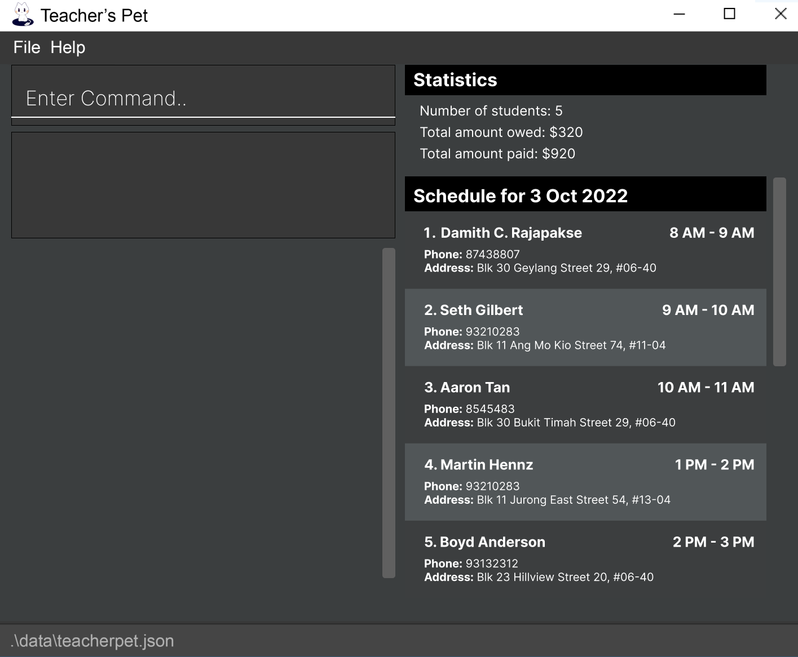
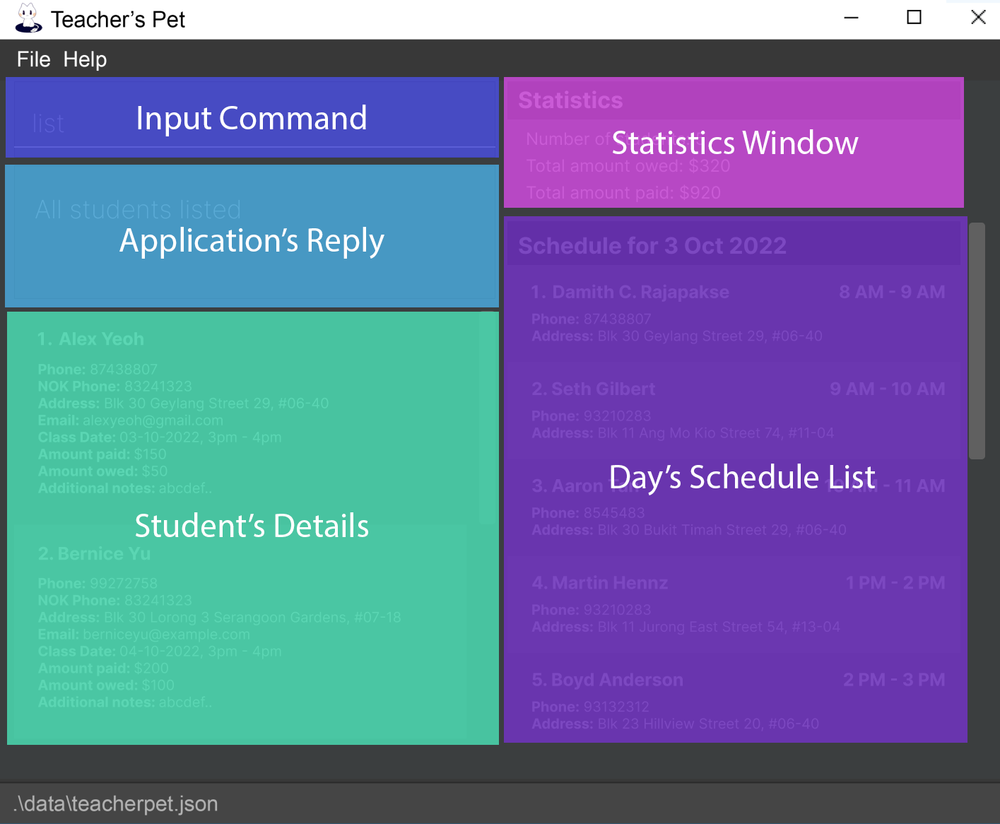
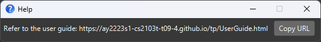
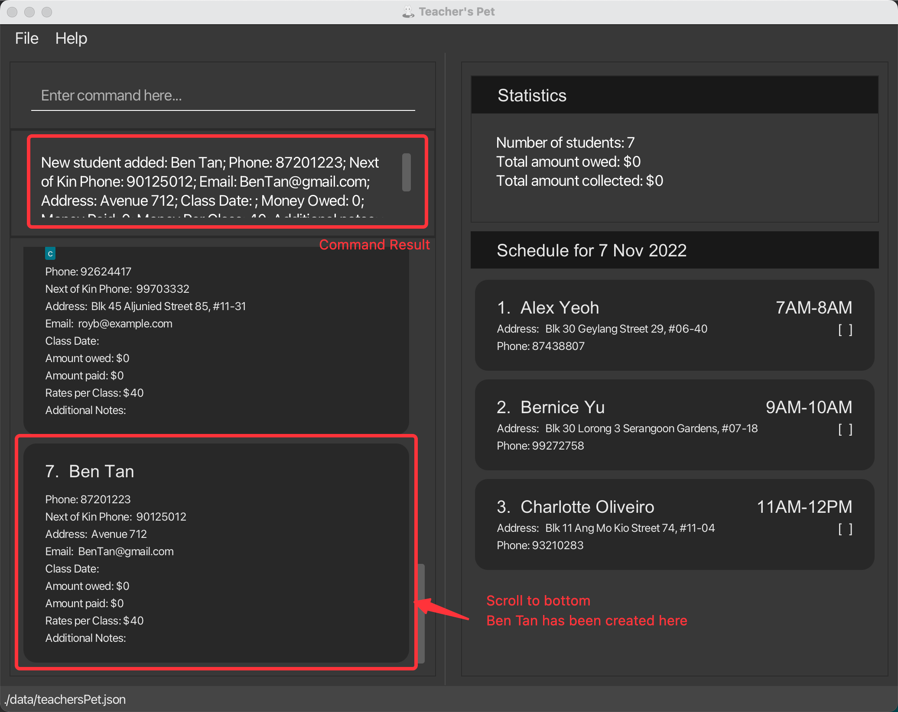
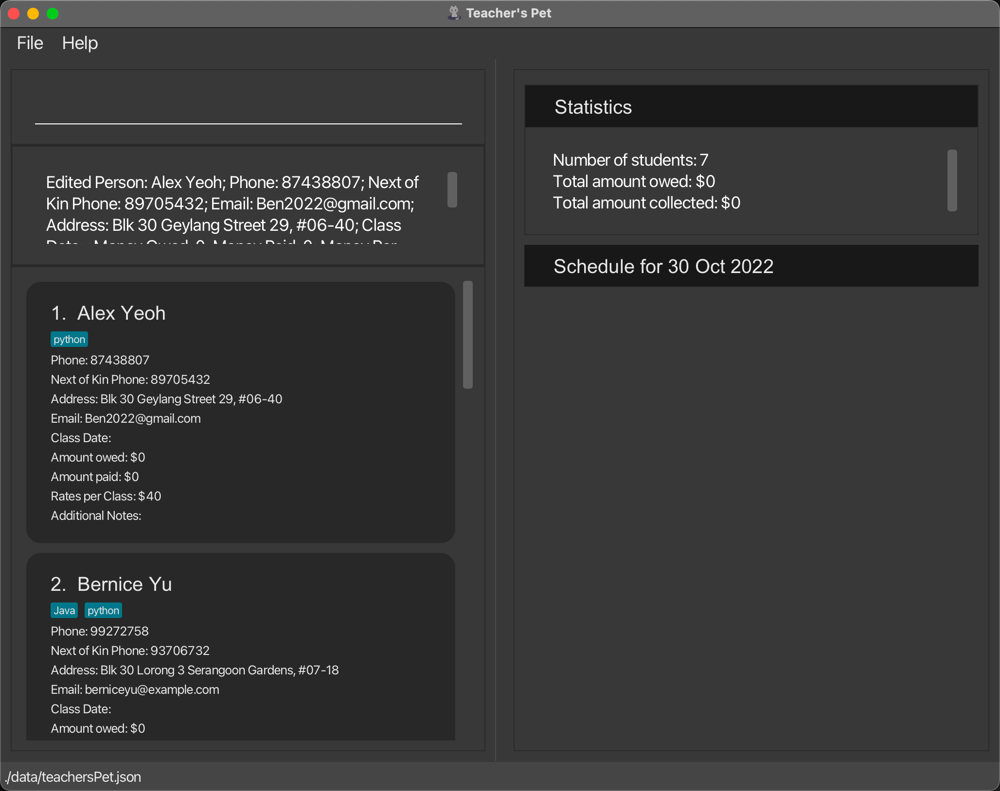
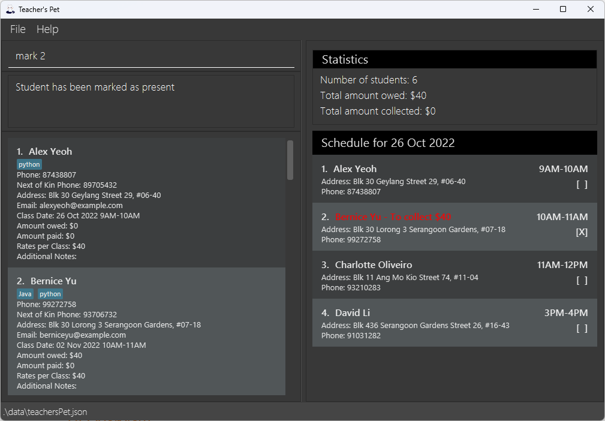
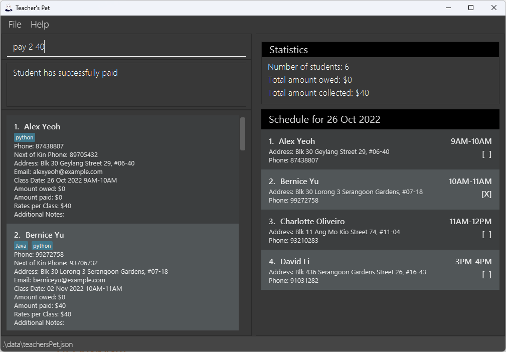

**Teacher’s Pet** is a desktop application for managing contacts of students and classes, optimised for use via a
Command Line Interface (CLI) while still having the benefits of a Graphical User Interface (GUI). If you can type fast,
Teacher’s Pet can get your contact and class management tasks done faster than traditional GUI apps.

**Teacher’s Pet** allows you to manage your schedule and keep track of your students.
The app stores basic information about your students, such as `Name`, `Contact Number`, `Class Date` and more.

Before you get started, you may want to read [how to get started with this User Guide](#reading-the-user-guide)!
To get started with using our application, jump straight to the [Quick Start](#quick-start) section.
For a full list of commands and detailed instructions, head to the [Features](#features) section.

## Table of contents
* [Quick Start](#quick-start)
* [UI Overview](#ui-overview)
* [Reading the User Guide](#reading-the-user-guide)
    * [Command format](#notes-about-the-command-format)
    * [Callouts](#callouts)
* [Features](#features)
    * [Viewing help: `help`](#viewing-help-help)
    * [Adding a student: `add`](#adding-a-student-add)
    * [Editing student details: `edit`](#editing-student-details-edit)
    * [Marking a student: `mark`](#marking-a-student-mark)
    * [Receiving money from a student: `pay`](#receiving-money-from-a-student-pay)
    * [Viewing all students: `list`](#viewing-all-students-list)
    * [Finding a student: `find`](#finding-a-student-find)
      * [Find by Name](#find-by-name)
      * [Find by Email](#find-by-email)
      * [Find by Address](#find-by-address)
      * [Find by Student's Contact Number](#find-by-students-contact-number)
      * [Find by Next of Kin's Contact Number](#find-by-next-of-kins-contact-number)
      * [Find by Class Date](#find-by-class-date)
      * [Find by Tag](#find-by-tag)
    * [Next available class: `avail`](#next-available-class-avail)
    * [Sort displayed students: `sort`](#sort-the-displayed-students-sort)
      * [Sort by Name](#sort-by-name)
      * [Sort by Class](#sort-by-class-date)
      * [Sort by Money Owed](#sort-by-money-owed)
    * [Deleting a student: `delete`](#deleting-students-delete)
    * [Clearing all student: `clear`](#clearing-all-student-clear)
    * [Undo a command: `undo`](#undo-the-last-command-undo)
    * [Exiting the program : `exit`](#exiting-the-program-exit)
    * [Saving the data](#saving-the-data)
    * [Editing the data file](#editing-the-data-file)
* [FAQ](#faq)
* [Command Summary](#command-summary)
* [Prefix Summary](#prefix-summary)

--------------------------------------------------------------------------------------------------------------------

## Quick start

1. Ensure you have Java `11` or above installed in your Computer.
2. Download the latest `teachersPet.jar` from https://github.com/AY2223S1-CS2103T-T09-4/tp/releases when made available.
3. Copy the file to the folder you want to use as the *home folder* for your application.
4. Double-click the file to start the app. The GUI similar to the below should appear in a few seconds.
   Note how the app contains some sample data.

---

## UI Overview

Our application is divided into 5 areas to maximise productivity, the specific uses are:

- Input Command - The dialog box where all user interaction are held.
- Application’s Reply - A short answer whether the application has executed the command, or an error message if the
  application did not understand the command.
- Student's Details - A window that will display the details of the student(s).
- Statistics Window - A window that shows all the statistics of the tutor, such as the number of students and
the money collected/owed.
- Day’s Schedule List - A scroll window which shows the schedule for the day, sorted by time.

Basic Instructions:
1. Type the command in the command box and press Enter to execute it. e.g., typing `help` and pressing Enter will open
   the help window. Some example commands you can try:
    - `list`: Lists all students.
    - `add n/John Doe p/98765432 np/81239090 e/johnd@example.com a/John street, block 123, #01-01`: Adds a student named
      `John Doe` to the student list.
    - `delete 3`: Deletes the 3rd student shown in the current list.
    - `clear`: Deletes all students.
    - `exit`: Exits the app.
2. Refer to the Features below for details of each command.

[↑ Back to top](#table-of-contents)

---

## Reading the User Guide

### Notes about the command format:

- Words in `UPPER_CASE` are the parameters to be supplied by the user. e.g., in `add n/NAME`, `NAME` is a parameter
  which can be used as `add n/John Doe`.
- Items in square brackets are optional. e.g., `n/NAME [t/TAG]` can be used as `n/John Doe t/python` or as `n/John Doe`.
- Items with `…` after them can be used multiple times including zero times. e.g., `[t/TAG]…` can be used as ` ` (e.g.
  0 times), `t/python`, `t/javascript t/react` etc.
- Parameters with a prefix can be in any order. e.g., if the command specifies `n/NAME p/CONTACT_NUMBER`, `p/CONTACT_NUMBER n/NAME`
  is also acceptable.
- If a parameter is expected only once in the command, but you specified it multiple times, only the last occurrence
  of the parameter will be taken. e.g., if you specify `p/12341234 p/56785678`, only `p/56785678` will be taken.
- Extraneous parameters for commands that do not take in parameters (such as `help`, `list`, `exit` and `clear`) will
  be ignored. e.g., if the command specifies `help 123`, it will be interpreted as `help`.
- Commands that require the use of index from the Schedule panel list (right side) will be represented as `INDEX-s`,
  while index from the Student's Details panel list (left side) will be represented as `INDEX`.

### Callouts:

Do refer to the callouts icons below! They will be useful when you are reading this user guide.

| Icon | Definition                                                                                                                |
|------|---------------------------------------------------------------------------------------------------------------------------|
| ℹ️   | Indicates additional information that can help you to gain a better understanding. They are good to know but not crucial. |
| 💡   | Indicates tips and solutions for potential problems you may encounter.                                                    |
| ❗    | Indicates information that are important to know so as to minimise confusion.                                             |
| ⚠️   | Indicates a warning to ensure you will proceed with care.                                                                 |

[↑ Back to top](#table-of-contents)

---

## Features

### Viewing help: `help`

Shows a message explaining how to access the help page.

Format: `help`

[↑ Back to top](#table-of-contents)

---

### Adding a student: `add`

Adds a student to the Teacher’s Pet.

##### Student’s Name:
    - Student’s Name must not be empty.
    - Student’s Name must only contain alphanumeric characters.
    

ℹ **Note:** Multiple students may share the same name.

##### Student’s Contact Number:
   - Student’s contact number must not be empty. 
   - Student’s contact number must only contain numerical digits between `0` and `9`.
   - Student's contact number must begin with `6`, `8` or `9`.

ℹ **Note:** Contact number must contain exactly 8 digits. Contact number must be unique.

##### Next of Kin’s Contact Number:
    - Next of Kin’s contact number must not be empty.
    - Next of Kin’s contact number must only contain numerical digits between `0` and `9`.
    - Next of Kin’s contact number must begin with `6`, `8` or `9`.

ℹ **Note:** Next of Kin’s contact number must contain exactly 8 digits.

##### Address:
    - Address must not be empty.
    - Address may contain any kinds of character.

ℹ **Note:** Address cannot be empty. It must contain at least 1 character.

##### Email:
    - Email must not be empty. 
    - Email should be in the format of `local@domain`, where:
      - Local address should only contain alphanumeric characters and these special characters `+_.-`.
      - Consecutive special characters are not supported.
      - The domain name must:
        1. End with a domain label at least 2 characters long.
        2. Have each domain label start and end with alphanumeric characters.
        3. Have each domain label consist of alphanumeric characters, separated only by hyphens, if any.

##### Tags:
    - Tags are optional.
    - A student can have any number of tags (including 0).
    - Tags must only contain alphanumeric characters.
    

ℹ **Note:** Tags must contain at least 1 alphanumeric character, cannot contain spacings and limited to `40` characters long.

Format: `add n/NAME p/CONTACT_NUMBER np/NEXT_OF_KIN_CONTACT_NUMBER e/EMAIL a/ADDRESS [t/TAG]…`

Example:

- `add n/Ben Tan p/87201223 np/90125012 e/BenTan@gmail.com a/Avenue 712`

ℹ **Note:** Amount paid, Amount owed, Rates per Class, and Additional notes fields are to be updated via `edit` command.

[↑ Back to top](#table-of-contents)

---

### Editing student details: `edit`

Edits an existing student in the list.

- Student’s Name - `n/`
- Student's Contact Number - `p/`
- Next of Kin’s Contact Number - `np/` 
- Address - `a/`
- Email - `e/`
- Class Date - `dt/`
- Amount Paid - `paid/`
- Amount Owed - `owed/`
- Rates per Class - `rate/`
- Additional Notes - `nt/`
- Tag - `t/`

1. Student's Name (`n/`), Student's Contact Number (`p/`), Next of Kin’s Contact Number (`np/`), Email (`e/`), Address (`a/`) and Tag (`t/`) follow the same convention as [adding a student](#adding-a-student-add).

2. Class Date (`dt/`):
    - Class date can be left empty.
    - Formats: `dt/` must be followed by either one of the below options.
        1. `yyyy-MM-dd 0000-2359`
        2. `Day-of-Week 0000-2359`
    - End time must be after the start time.
    - If the Day-of-Week is today, executing `edit INDEX dt/Day-of-Week 0000-2359` will set the date to today only
      if the start time of the class is later than the current time. Else, the date will be set to the specified Day-of-Week
      in the following week.
    - Examples: `2022-10-09 1100-1230`, `MON 1100-1230`, `Mon 1100-1230`
    - Invalid inputs: `2022-10-9 1100-1230`, `2022-10-09 1100-1000`

❗ **Caution:** If a chosen date is occupied by another student, a class conflict error will arise.

4. Amount Paid (`paid/`):
    - Amount Paid stands for the amount that has been paid by the Student.
    - Amount paid can only be an integer.
    - Amount paid must be non-negative.

5. Amount Owed (`owed/`):
    - Amount Owed stands for the amount that has been owed by the Student.
    - Format: `owed/` must be followed by an integer.
    - Amount owed can only be an integer.
    - Amount owed must be non-negative.

6. Rates per Class (`rate/`):
    - Rates per Class stands for the amount of charge per Class for the Student.
    - Rates per Class can only be an integer.
    - Rates per Class must be non-negative.

ℹ **Note:** Amount Owed, Amount Paid, and Rates per Class must be between $0 and $2147483647. They are modified
  independent of each other.

7. Additional Notes (`nt/`):
    - Additional notes can be left empty.
    - Additional notes can take in any types of character.
    - Use `nt/` to set the additional notes.
    - Use `nt-a/` to append the additional notes.
    

❗ **Caution:** Using both nt/ and nt-a/ in a single command will reset the content of Additional Notes
to the content behind both nt/ and nt-a/ prefixes.

❗ **Caution:** At least one of these fields must exist in order to make the edit command valid.

Format: `edit INDEX [n/NAME] [p/CONTACT_NUMBER] [np/NEXT_OF_KIN_CONTACT_NUMBER] [e/EMAIL] [dt/CLASS_DATE] [a/ADDRESS]
[paid/AMOUNT_PAID] [owed/AMOUNT_OWED] [rate/RATES_PER_CLASS] [nt/ADDITIONAL_NOTES] [nt-a/ADDITIONAL_NOTES_APPEND] [t/TAG]…`

Examples:

- `edit 1 e/Ben2022@gmail.com`

- `edit 1 dt/tue 1100-1200`

[↑ Back to top](#table-of-contents)

---

### Marking a student: `mark`

Allows the user to mark a student as present for a class.

The application will increase the student's owed amount by the rates per class.
A cross will be displayed beside the student's name indicating that the student has attended the class.
The student's next class will be set a week later at the same time, provided if there is a free time slot.

Format: `mark INDEX-s`

- Marks the student as present at the specified `INDEX-s`.
- The `INDEX-s` refers to the index number shown in the Schedule panel (bottom right).
- The `INDEX-s` must be a positive integer. e.g., `1, 2, 3, ...`.

💡 **Tip:** If you want to unmark a student, you may do so via the `undo` command.

Example:
- `mark 2` marks the 2nd student in the Schedule panel.

ℹ **Note:** Notice how the student's name changed to red? This is because the student now owes money!

💡 **Tip:** If you want to charge the student for missing the class, you can do so by executing
the mark command. This increases the amount owed but frees up that time slot for another student.

[↑ Back to top](#table-of-contents)

---

### Receiving money from a student: `pay`

Allows the user to indicate that a student has paid a certain amount of money.

The application will reduce the student's owed amount by the amount paid.

Format: `pay INDEX-s AMOUNT_PAID`

- Marks the student as present at the specified `INDEX-s`.
- The `INDEX-s` refers to the index number shown in the Schedule panel (bottom right).
- The `INDEX-s` must be a positive integer. e.g., `1, 2, 3, ...`.
- The `AMOUNT_PAID` must be an integer and cannot be negative. e.g., `0, 1, 2, ...`.

Example:
- `pay 2 40` indicates that the 2nd student in the Schedule panel has paid $40.

ℹ **Note:** The student cannot pay more than what he/she owes. There is also a maximum cap of
  $2147483647 for every payment.

[↑ Back to top](#table-of-contents)

---

### Viewing all students: `list`

Allows the user to view students and their information which includes:

- Contact Number
- Next of Kin’s Number
- Address
- Email
- Class Date
- Amount Paid
- Amount Owed
- Rates Per Class
- Additional Notes
- Tag

Format: `list`

[↑ Back to top](#table-of-contents)

---

### Finding a student: `find`

Finds an existing student in the list. You can only find by one field at a time.

Fields supported in `find`:

- Name `n/`
- Email `e/`
- Address `a/`
- Student's Contact Number `p/`
- Next of Kin's Contact number `np/`
- Class Date `dt/`
- Tag `t/`

❗ **Caution:** Only one type of prefix should be used in a find command at a time.

#### Find by Name:

Finds all students with names matching the keywords.

Format: `find n/KEYWORD [MORE_KEYWORDS]`

- The search is case-insensitive. e.g., `alex` will match `Alex`.
- The order of the keywords does not matter. e.g. `Yeoh Alex` will match `Alex Yeoh`.
- Only full words will be matched e.g., `Han` will not match `Hans`.
- Students matching at least one keyword will be returned. e.g., `Hans Bo` will return `Hans Gruber`, `Bo Yang`.

Example:

`find n/tan` returns `Tan Xiao Ming` and `John Tan`.

#### Find by Email:

Finds all students with a particular email.

Format: `find e/EMAIL`

- The search is case-insensitive. e.g., `ghost@woods.com` will match `ghoSt@woOds.com`.
- Only one email can be searched at each time.
- Full email must be used for corresponding student to be found e.g., `ghost` will not match `ghost@woods.com`.

❗ **Caution:** Do not include more than one email such as find e/jonsnow@winterfell.com ghost@woods.com.

Example:

`find e/jonsnow@winterfell.com` returns all students with email set as `jonsnow@winterfell.com`.

#### Find by Address:

Finds all students with addresses matching the keywords.

Format: `find a/KEYWORD [MORE_KEYWORDS]`

- The search is case-insensitive. e.g., `Labrador` will match `LABRADOR`.
- The order of the keywords does not matter. e.g., `Bukit Timah` will match `Timah Bukit`.
- Students matching at least one keyword will be returned. e.g., `Bukit Timah` will return `Bukit Batok`, `Timah Hill`.
- Partial words will be matched e.g., `Labra` will match `Labrador`.

Example:

`find a/street` returns `Bukit Timah Street 3` and `Labrador Street 27`.

#### Find by Student's Contact Number:

Finds student with the matching contact number.

Format: `find p/CONTACT_NUMBER`

- Only full numbers will be matched e.g., `8123` will not match `81234567`.
- Only one contact number can be searched at each time.

Example:

`find p/81234567` returns the student with the contact number set as `81234567`.

#### Find by Next of Kin's Contact Number:

Finds all students with a particular next of kin's contact number.

Formats: `find np/NEXT_OF_KIN_CONTACT_NUMBER`

- Only full numbers will be matched e.g., `8123` will not match `81234567`.
- Only one contact number can be searched at each time.

❗ **Caution:** Do not include more than one contact number such as find np/91232323 81231232.

Examples:

`find np/91232323` returns all students with the next of kin's contact number set as `91232323`.

[↑ Back to top](#table-of-contents)

#### Find by Class Date:

Finds all students with classes on a particular date.

Formats:
    1. `find dt/yyyy-MM-dd`
    2. `find dt/Day-of-Week`

- Only the date is searched.

❗ **Caution:** Do not include class timing.

Examples:

`find dt/2022-10-15` returns all students with classes on 15 October 2022.
`find dt/Mon` returns all students with classes on the coming monday.

[↑ Back to top](#table-of-contents)

#### Find by Tag:

Finds all students with a particular tag.

Formats: `find t/tagName`

- Only one tag can be searched at each time.
- The tag is case-sensitive.

❗ **Caution:** Do not include more than one tag such as find t/python java.

Examples:

* `find t/python` returns all students who have a python tag, including students who have other tags on top of the
python tag.
* `find t/javascript` returns all students who have a javascript tag, including students who have other tags on top
of javascript tag 
* `find t/python t/javascript` returns all students who have javascript and python tags, includings students who have 
other tags on top of the two tags.

[↑ Back to top](#table-of-contents)

---
### Next available class: `avail`

Finds the next available class given a time range and duration and returns the next available class within the time 
range and with the specified class duration.

Format: `avail TIME_RANGE DURATION`

- The `TIME_RANGE` would follow a 24-hour format of 0000-2359.
- The `DURATION` is in minutes.

❗ **Caution:** The duration should not exceed the time range. e.g., If the time range is 1000-1100
and the duration is 70, this would be invalid.

Examples:
- Given that there is 1 student on the current day of 2022-10-27 from 0900-1000, `avail 1100-1200 60` would return
  `2022-10-27 1100-1200` since there is no student at that slot.
- Given that there are 2 students on the current day of 2022-10-27 from 0900-1000 and at 1030-1130, 
`avail 0830-1300 60` would return `2022-10-27 1130-1230` as the next slot since there is no sufficient duration
between 1000-1030 for a 60 minutes class.

[↑ Back to top](#table-of-contents)

---

### Sort the displayed students: `sort`

Sorts the list of students in the Student's Details panel by the specified `TYPE` and `ORDER`.

Format: `sort TYPE [ORDER]`

- `TYPE` must be followed by either one of the below options:
  - `NAME`
  - `CLASS`
  - `OWED`
- `ORDER`, if present, must be followed by either one of the below options:
  - `ASC`
  - `DESC`
  - If it is left as blank, it will follow the default order based on the specified `TYPE`.
- The default order for `NAME` and `CLASS` is `ASC` while for `OWED`, the default order is `DESC`.
- The parameters `TYPE` and `ORDER` are case-insensitive.
- When two students are **in a tie** for the compared `TYPE`, they will be sorted according to their **names** in **ascending** order by default.

[↑ Back to top](#table-of-contents)

#### Sort by Name

Sorts the list of students in the Students' Details panel by `name` and given `ORDER`.

If `ORDER` is left blank, it will be `asc` by default.

Examples:

- `list` followed by `sort name` will list all the students according to their names in ascending order.
- `list` followed by `sort name asc` will list all the students according to their names in ascending order.
- `list` followed by `sort name desc` will list all the students according to their names in descending order.

[Back to top](#table-of-contents)

#### Sort by Class Date

Sorts the list of students in the Students' Details panel by `CLASS` and given `ORDER`.

If `ORDER` is left blank, it will be `ASC` by default.

Examples:

- `list` followed by `sort class` will list all the students according to their upcoming classes in ascending order.
- `list` followed by `sort class asc` will list all the students according to their upcoming classes in ascending order.
- `list` followed by `sort class desc` will list all the students according to their upcoming classes in descending order.

[Back to top](#table-of-contents)

#### Sort by Money Owed

Sorts the list of students in the Students' Details panel by `OWED`(Amount of Money Owed) and given `ORDER`.

If `ORDER` is left blank, it will be `DESC` by default.

Examples:

- `list` followed by `sort OWED` will list all the students according to how much money they owe in **descending** order.
- `list` followed by `sort OWED ASC` will list all the students according to how much money they owe in ascending order.
- `list` followed by `sort OWED DESC` will list all the students according to how much money they owe in descending order.

[Back to top](#table-of-contents)

---

### Deleting student(s): `delete`

Deletes the specified student(s) from the student list.

Format: `delete INDEX [MORE_INDEXES]`

- Deletes the student(s) at the specified `INDEX(ES)`.
- The `INDEX(ES)` refers to the index numbers shown in the Student's Details panel (bottom left section of the display).
- The `INDEX(ES)` must be a positive integer within the size of the displayed student list. e.g., `1, 2, 3, ...`.

Examples:
- `list` followed by `delete 1 2` deletes the 1st and 2nd student in the Student's Details panel.
- `find Betsy` followed by `delete 1` deletes the 1st student in the Student's Details panel.

💡 **Tip:** Deleting a student by mistake can be reversed by 
<a href="#undo-the-last-command-undo">undo</a> command!

[↑ Back to top](#table-of-contents)

---

### Clearing all student: `clear`

Clears all students and their details from the list.

Format: `clear`

💡 **Tip:** Clearing all students by mistake can be reversed by 
<a href="#undo-the-last-command-undo">undo</a> command!

[↑ Back to top](#table-of-contents)

---

### Undo the last command: `undo`

Undoes the last command executed by reverting any recent change in data within the Teacher's Pet.

Format: `undo`

ℹ **Note:** Undo command will not change any visual display
with the latest commands being display-related like
<a href="#finding-a-student-find">find</a> command. If you wish to remove the filter, the best way is to use
<a href="#viewing-all-students-list">list</a> command.

[↑ Back to top](#table-of-contents)

---

### Exiting the program: `exit`

Exits the program.

Format: `exit`

[↑ Back to top](#table-of-contents)

---

### Saving the data

Teacher’s Pet data are saved in the hard disk automatically after any command that changes the data. There is no need to save manually.

[↑ Back to top](#table-of-contents)

---

### Editing the data file

Students' data is saved as a JSON file `[JAR file location]/data/teachersPet.json`. Advanced users are welcome to edit the data file.

⚠️ **Warning:** Proceed with care! If your changes to the data file makes its format invalid,
Teacher’s Pet will discard all data and start with an empty data file at the next run!

[↑ Back to top](#table-of-contents)

---

## FAQ

Q: How do I transfer my data to another Computer?

A: Install the app in the other computer and overwrite the empty data file it creates with the file that contains the data of your previous Teacher's Pet home folder.

[↑ Back to top](#table-of-contents)

---
## Glossary

| Terms       | Definition                                                 |
|-------------|------------------------------------------------------------|
| Class Date  | The 1-1 tutoring time slot of a student                    |
| Day-of-Week | 3-letter Abbreviation; case-insensitive e.g., Mon, MON     |
| INDEX       | The index number shown in the Student's Details panel list |
| INDEX-s     | The index number shown in the Schedule panel list          |
| Prefix      | e.g., `n/`, `p/`, `np/`                                    |
| Parameter   | e.g., `NAME`, `EMAIL`, `ADDRESS`                           |

[↑ Back to top](#table-of-contents)

## Command Summary

| Action                            | Format, Examples                                                                                                                                                                                                                                         |
|-----------------------------------|----------------------------------------------------------------------------------------------------------------------------------------------------------------------------------------------------------------------------------------------------------|
| Get help                          | `help`                                                                                                                                                                                                                                                   |
| Add a student                     | add n/NAME p/CONTACT_NUMBER np/NEXT_OF_KIN_CONTACT_NUMBER a/ADDRESS e/EMAIL [t/TAG]... e.g., `add n/John Doe p/98765432 np/90123291 a/Street ABC e/johnd@example.com t/python t/beginner`                                                                |
| Edit a student                    | edit INDEX [n/NAME] [p/CONTACT_NUMBER] [np/NEXT_OF_KIN_CONTACT_NUMBER] [a/ADDRESS] [e/EMAIL] [dt/CLASS_DATE] [paid/AMOUNT_PAID] [owed/AMOUNT_OWED] [rate/RATES_PER_CLASS] [nt/ADDITIONAL_NOTES] [nt-a/ADDITIONAL_NOTES_APPEND] e.g., `edit 2 p/98765431` |
| Mark a student                    | mark INDEX-s e.g., `mark 2`                                                                                                                                                                                                                              |
| Receive money from a student      | pay INDEX-s AMOUNT_PAID e.g., `pay 2 300`                                                                                                                                                                                                                |
| List all students                 | `list`                                                                                                                                                                                                                                                   |
| Find a student                    | find n/NAME e.g., `find n/John Doe` or other supported fields                                                                                                                                                                                            |
| Find available time slots         | avail TIME_RANGE DURATION e.g., `avail 1000-1200 30`                                                                                                                                                                                                     |
| Sort students in particular order | sort TYPE [ORDER] e.g., `sort NAME ASC`                                                                                                                                                                                                                  |
| Delete a student                  | delete INDEX e.g., `delete 2`                                                                                                                                                                                                                            |
| Clear all students                | `clear`                                                                                                                                                                                                                                                  |
| Undo a command                    | `undo`                                                                                                                                                                                                                                                   |
| Exit the application              | `exit`                                                                                                                                                                                                                                                   |

[↑ Back to top](#table-of-contents)

## Prefix Summary

| Prefix                                              | Meaning | Examples                                             |
|-----------------------------------------------------|:--------|------------------------------------------------------|
| Name of student                                     | n/      | `n/Alice`                                            |
| Phone number of student                             | p/      | `p/81234567`                                         |
| Next of Kin Phone number                            | np/     | `np/65432109`                                        |
| Email of student                                    | e/      | `e/alice@email.com`                                  |
| Date and time of student's class                    | dt/     | `dt/2022-10-27 1300-1400`                            |
| Address of student                                  | a/      | `a/15 Bukit Timah Road, Singapore 155203`            |
| Amount paid by student                              | paid/   | `paid/300`                                           |
| Amount owed by student                              | owed/   | `owed/200`                                           |
| Rates per Class                                     | rate/   | `rate/100`                                           |
| Additional notes of student (create new notes)      | nt/     | `nt/I have created new notes for Alice`              |
| Additional notes of student (append existing notes) | nt-a/   | `nt-a/I have added more notes to the existing notes` |
| Tags of student                                     | t/      | `t/python`                                           |

[↑ Back to top](#table-of-contents)
