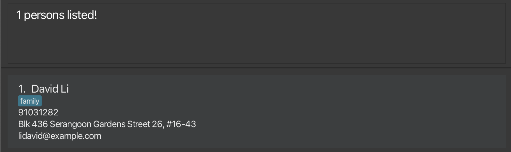
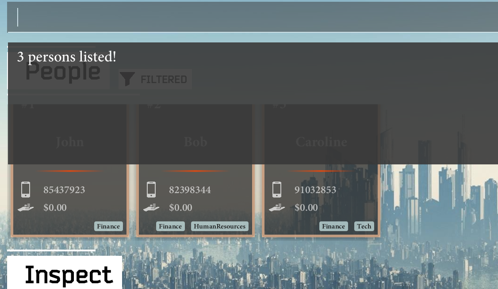

SectresBook helps **secretaries** to maintain all the information of the members of their club by **collating a list of identifiable information, past records and future tasks.**

* Table of Contents
{:toc}

--------------------------------------------------------------------------------------------------------------------

## Quick start

1. Ensure you have Java `11` or above installed in your Computer.

1. Download the latest `SectresBook.jar` from [here](https://github.com/AY2223S1-CS2103T-W12-2/tp/releases).

1. Copy the file to the folder you want to use as the _home folder_ for your SectresBook.

1. Double-click the file to start the app. The GUI similar to the below should appear in a few seconds. Note how the app contains some sample data. 
   

1. Type the command in the command box and press Enter to execute it. e.g. typing **`help`** and pressing Enter will open the help window. 
   Some example commands you can try:

   * **`list`** : Lists all contacts.

   * **`add`**`n/John Doe p/98765432 e/johnd@example.com a/John street, block 123, #01-01` : Adds a contact named `John Doe` to the Address Book.

   * **`delete 3`** : Deletes the 3rd contact shown in the current list.
   
   * **`help`**: Open the UserGuide in your default web browser.

   * **`clear`** : Deletes all contacts.

   * **`exit`** : Exits the app.

1. Refer to the [Features](#features) below for details of each command.

--------------------------------------------------------------------------------------------------------------------

## Features

**:information_source: Notes about the command format:** 

* Words in `UPPER_CASE` are the parameters to be supplied by the user. 
  e.g. in `add n/NAME`, `NAME` is a parameter which can be used as `add n/John Doe`.

* Items in square brackets are optional. 
  e.g `n/NAME [t/TAG]` can be used as `n/John Doe t/friend` or as `n/John Doe`.

* `<OR>` signifies an exclusive-or parameter that is to be input. 
  e.g `INDEX <OR> NAME` allows either the parameter `INDEX` or the parameter `NAME`, but not both

* Items with `…`​ after them can be used multiple times including zero times. 
  e.g. `[t/TAG]…​` can be used as ` ` (i.e. 0 times), `t/friend`, `t/friend t/family` etc.

* Parameters can be in any order. 
  e.g. if the command specifies `n/NAME p/PHONE_NUMBER`, `p/PHONE_NUMBER n/NAME` is also acceptable.

* If a parameter is expected only once in the command but you specified it multiple times, only the last occurrence of the parameter will be taken. 
  e.g. if you specify `p/12341234 p/56785678`, only `p/56785678` will be taken.

* Extraneous parameters for commands that do not take in parameters (such as `help`, `list`, `exit` and `clear`) will be ignored. 
  e.g. if the command specifies `help 123`, it will be interpreted as `help`.

### Viewing help : `help`

Shows a message explaning how to access the help page.

Format: `help`

### Adding a person: `add`

Adds a person to the SectresBook.

Format: `add n/NAME p/PHONE_NUMBER e/EMAIL a/ADDRESS [t/TAG]...​ [l/LOAN]`

:bulb: **Tip:**
A person can have any number of tags (including 0)

Examples:
* `add n/John Doe p/98765432 e/johnd@example.com a/John street, block 123, #01-01 t/Member`
* `add n/Jane Doe p/98876542 e/jane@example.com a/That Street, block 133, #11-10 t/Member l/10`
* `add n/Neethesh t/Vice-president e/neethesh@example.com a/Happy Avenue p/91234567`

### Listing all persons : `list`

Shows a list of all persons in the SectresBook.

Format: `list`

### Editing a club member : `edit`

Edits an existing club member’s information in the SectresBook

Format: `edit INDEX <OR> NAME [n/NAME] [p/PHONE] [e/EMAIL] [a/ADDRESS] [t/TAG]…​`

Example of usage:

`edit 1 p/99999999` can be used to easily update the first person's contact information.

`edit John p/91235555` can be used to update a person’s contact information if there exists only one person whose name contains John. 
  If no person is named `John`, no operations are performed. If more than one person has `John` in their name, then the operation is equivalent to `find John`.

### Locating persons by name: `find`

Finds persons whose names/email contain any of the given keywords.

Format: `find KEYWORD [MORE_KEYWORDS]`

* The search is case-insensitive. e.g `hans` will match `Hans`
* The order of the keywords does not matter. e.g. `Hans Bo` will match `Bo Hans`
* Only the name is searched.
* Only full words will be matched e.g. `Han` will not match `Hans`
* Persons matching at least one keyword will be returned (i.e. `OR` search).
  e.g. `Hans Bo` will return `Hans Gruber`, `Bo Yang`
* Email usernames that contain at least one keyword will be returned.

Examples:
* `find John` returns `john` and `John Doe`
* `find alex david` returns `Alex Yeoh`, `David Li` 
  
* `find lid` returns `David Li` since email username of David (`lidavid@example.com`) contains `lid`
  

### Locating persons by tag: `find`

Finds persons that have the given tag.

Format: `find t/TAG`

* The tag search is case-insensitive. e.g `finance` will match `Finance`
* Only the tag is searched.
* Only full words will be matched e.g. `Tech` will not match `Technology`
* Persons matching at least one tag will be returned (i.e. `OR` search).
  e.g. `Finance` will return 
  * `John (tag: Finance)`,
  * `Caroline (tag: Finance) (tag: Tech)`,
  * `Bob (tag:Finance) (tag:HumanResources)`

Examples:
* `find t/Finance` returns `John`, `Caroline` and `Bob`
  

### Deleting a person : `delete`

Deletes the specified person from the SectresBook.

Format: `delete INDEX`

Otherwise, the specified person may be removed by name.

* Deletes the person at the specified `INDEX`.
* The index refers to the index number shown in the displayed person list.
* The index **must be a positive integer** 1, 2, 3, …​

Format: `delete <name>`

* Delete the entry of the person who has the given name.
* Will not perform any operation if the name of the person does not exist.

An optional argument `add` can be specified to complete erase all data in the book.

Format: `delete all`

* `delete all` is functionally the same as `clear`

Examples:
* `list` followed by `delete 2` deletes the 2nd person in the SectresBook.
* `find Betsy` followed by `delete 1` deletes the 1st person in the results of the `find` command.
* `delete Betsy` deletes the entry belonging to Betsy in the SectresBook
* `delete Lynette` does not perform any operation, as Lynette does not exist in the SectresBook.
* `delete all` will clear the entire SectresBook. Please refer to the [`clear` command](#clearing-all-entries--clear).

### Clearing all entries : `clear`

Clears all entries of people from the SectresBook.

Format: `clear`

### Adding Notes `[coming in v1.2.1]`

### Editing Notes `[coming in v1.2.1]`

### Deleting Notes `[coming in v1.2.1]`

### Exiting the program : `exit`

Exits the program.

Format: `exit`

### Saving the data

SectresBook data are saved in the hard disk automatically after any command that changes the data. There is no need to save manually.

### Editing the data file

SectresBook data are saved as a JSON file `[JAR file location]/data/sectresbook.json`. Advanced users are welcome to update data directly by editing that data file.

:exclamation: **Caution:**
If your changes to the data file makes its format invalid, SectresBook will discard all data and start with an empty data file at the next run.

### Archiving data files `[coming in v2.0]`

_Details coming soon ..._

--------------------------------------------------------------------------------------------------------------------

## FAQ

**Q**: How do I transfer my data to another Computer? 
**A**: Install the app in the other computer and overwrite the empty data file it creates with the file that contains the data of your previous SectresBook home folder.

**Q**: Double clicking the jar file does not open the jar file! 
**A**: Make sure that Java 11 is install on your computer. You may also open the terminal or command prompt and type `java -jar SectresBook.jar`.

--------------------------------------------------------------------------------------------------------------------

## Command summary

Action | Format, Examples
--------|------------------
**Add** | `add n/NAME p/PHONE_NUMBER e/EMAIL a/ADDRESS [t/TAG]…​`   e.g., `add n/James Ho p/22224444 e/jamesho@example.com a/123, Clementi Rd, 1234665 t/friend t/colleague`
**Clear** | `clear`
**Delete** | `delete INDEX`  e.g., `delete 3`
**Edit** | `edit INDEX [n/NAME] [p/PHONE_NUMBER] [e/EMAIL] [a/ADDRESS] [t/TAG]…​`  e.g.,`edit 2 n/James Lee e/jameslee@example.com`
**Find** | `find KEYWORD [MORE_KEYWORDS]`  e.g., `find James Jake`
**List** | `list`
**Help** | `help`
