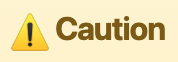
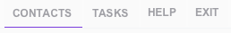
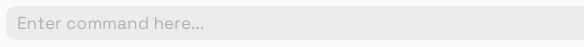
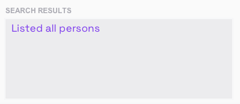
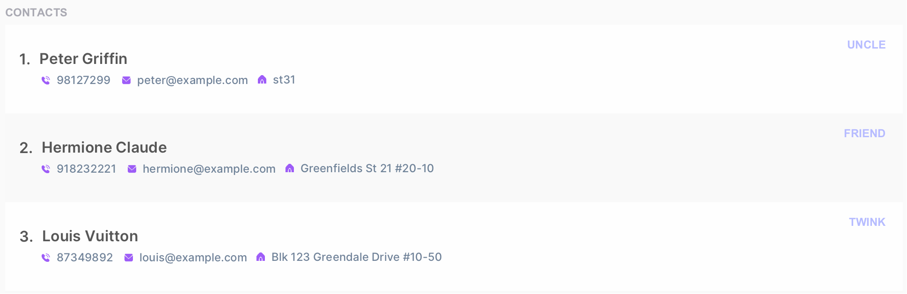
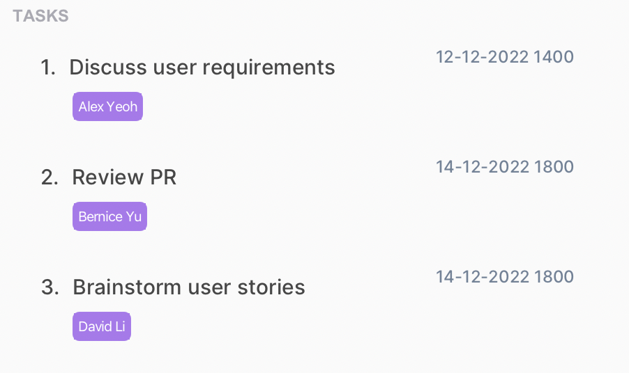
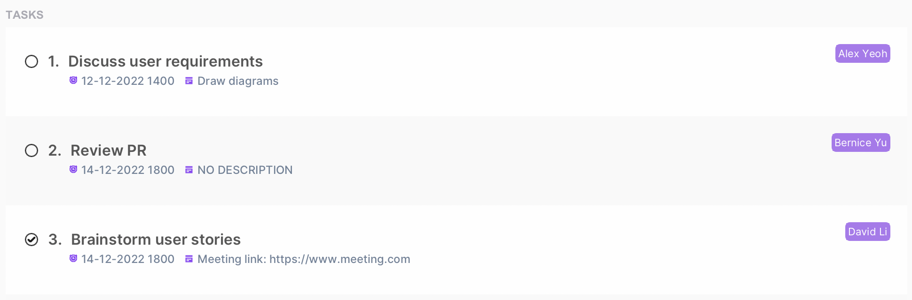
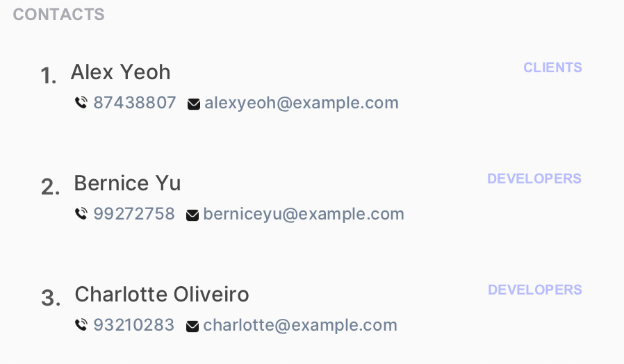
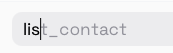

<!---
Overall structure of this user guide is adapted from https://ay2223s1-cs2103t-w16-2.github.io/tp/UserGuide.html
--->

## **About Swift+**

Swift+ is a **project management app** designed to help software engineering (SWE) project leads in tracking their daily
interactions with contacts. As a project lead, you can easily **record down your clients and teammates** by creating contacts
using Swift+. Using Swift+’s **task management system**, you can assign tasks to contacts and mark tasks as completed.
Finally, you can gain an overview of your project with our intuitive side-by-side user interface.

Perfect for SWE professionals, Swift+ is built around a **command line interface**, complete with an **autocomplete** feature.
If you have fast fingers, Swift+ can help you manage contacts and tasks more quickly than a traditional point-and-click interface.

This user guide provides details on how to use Swift+ in your daily workflow. This guide covers how to set up Swift+ and
use its text-based commands. Get started now by heading over to [How to use this User Guide](#how-to-use-this-user-guide)!

---

## **Table of Contents**

{:.no_toc}

1. Table of Contents
   {:toc}

---

## **How to use this User Guide**

### Icons

Throughout this website, you may find colored boxes that contain useful information. The icon at the top of the box represents
the type of information contained.

| Icon                                                      | Meaning                                                      |
| --------------------------------------------------------- | ------------------------------------------------------------ |
| {:height="32px"}         | Tips to help you make the most out of Swift+.                |
| {:height="32px"}       | Information you should take note of while using Swift+.      |
| {:height="32px"} | Warnings that may corrupt your app and data if not followed. |

### Sections

If you have not installed Swift+, head over to the [Installation](#installation) section.

After installing Swift+, you can refer to our [Getting Started](#getting-started) section on the basics of using Swift+. This includes the app's,

- [Layout](#layout)
- [Command format](#command-format)

:bulb: **Tip**  
If you are using Swift+ for the first time, we **highly recommend** that you read through the [Getting Started](#getting-started)
section before the other sections.

To view each command in detail, you can head over to the [Commands](#commands) section.

If you are an experienced user, you can refer to the [Command Summary](#command-summary) for a quick overview of the commands in Swift+.

If you have any questions while using the app, please refer to our [FAQ](#faq) section.

For any further queries or suggestions, you may reach out to us [here](/AboutUs)!

---

## **Getting Started**

This section covers how to install and start using Swift+.

### Installation

1. Ensure you have [Java 11](https://docs.oracle.com/en/java/javase/11/install/overview-jdk-installation.html) installed in your computer.

2. Download the latest release of `swift+.jar` from [here](https://github.com/AY2223S1-CS2103T-T12-2/tp/releases).

3. Copy the file to an empty folder. This will be your home folder for Swift+.

4. Double-click on the jar file to launch Swift+.

Congratulations! You have successfully set up Swift+.

:bulb: **Tip**  
The app comes with sample contacts and tasks by default. To delete the sample data quickly, you can use the [`clear`](#clearing-all-data-clear) command.

### Layout

After you open Swift+, the app will appear in the form of a graphical user interface, or GUI. In Swift+, you can toggle
between the [Contact View](#contact-view) and the [Task View](#task-view).
Let's take a look at the different components in Swift+ below.

:bulb: **Tip**  
To toggle between Contact View and Task View, you can use the [`Ctrl + Tab`](#toggling-between-contacts-and-tasks-tabs-ctrl--tab) command.

**Swift+'s GUI:**

This table showcases the components shared by both Contact View and Task View.

| Component Name        | Image                                                                    |
| --------------------- | ------------------------------------------------------------------------ |
| **Menu Bar**          |                               |
| **Command Input Box** |             |
| **Search Results**    | {:height="120px"} |

#### Contact View

The contact view is primarily for viewing contacts. The main panel on the left displays a list of contacts and all of their details. The right sidebar contains a list of tasks with some essential details.

| Component Name   | Image                                                                |
| ---------------- | -------------------------------------------------------------------- |
| **Contact List** | {:height="200px"} |
| **Task Sidebar** | {:height="150px"} |

#### Task View

The task view is primarily for viewing tasks. The main panel on the left displays a list of tasks and all of their details. The right sidebar contains a list of contacts with some essential details.

| Component Name      | Image                                                                      |
| ------------------- | -------------------------------------------------------------------------- |
| **Task List**       | {:height="200px"}             |
| **Contact Sidebar** | {:height="150px"} |

### How to use Swift+ commands

Swift+ is built around text-based commands. Before we dive deeper into the details in the [Commands](#commands) section,
let's learn the basic components and format of a command.

#### Flag

A flag is a delimiter that allows Swift+ to distinguish different input fields. For each flag, you would put in the
corresponding parameter immediately after.

Refer to the [Command Format](#command-format) section on how to use flags and parameters together.

| Flag  | Corresponding Parameter |
| ----- | ----------------------- |
| `a/`  | `ADDRESS`               |
| `c/`  | `CONTACT_INDEX`         |
| `d/`  | `DESCRIPTION`           |
| `dl/` | `DEADLINE`              |
| `e/`  | `EMAIL`                 |
| `n/`  | `NAME`                  |
| `p/`  | `PHONE_NUMBER`          |
| `t/`  | `TAG`, `TASK_INDEX`     |

#### Parameter

A parameter represents placeholders where you input data. Usually, parameters follow immediately after their corresponding flag.

Each parameter has unique constraints, which restricts what you can type in for the parameter. Refer to the table below for details.

:information_source: **Note** 
Some parameters, such as `CONTACT_INDEX` and `KEYWORD`, may not follow after flags.

Refer to the [Command Format](#command-format) section on how to use flags and parameters together.

<table>
    <tr>
        <th>Parameter</th>
        <th>Corresponding Flag</th>
        <th>Description</th>
    </tr>
    <tr>
        <td markdown="span">`ADDRESS`</td>
        <td markdown="span">`a/`</td>
        <td markdown="block">Specifies the address of a contact.

- Cannot be blank.

</td>
    </tr>
    <tr>
        <td markdown="span">`CONTACT_INDEX`</td>
        <td markdown="span">`c/`</td>
        <td markdown="block">Refers to the index number shown in the **displayed contact list**.

- Must be a **positive whole number**, e.g. 1, 2, 3.

</td>
    </tr>
    <tr>
        <td markdown="span">`CONTACT_NAME`</td>
        <td markdown="span">`n/`</td>
        <td markdown="block">Specifies the name of a contact.

- Should only contain alphanumeric characters, spaces, and the following symbols: `,` `-` `'`.

</td>
    </tr>
    <tr>
        <td markdown="span">`DEADLINE`</td>
        <td markdown="span">`dl/`</td>
        <td markdown="block">Specifies the due date of a task.

- Must be in the format of **`dd-MM-yyyy HHmm`**, e.g. `12-06-2020 1234` represents `12 June 2020 12:34`.
- If `HHmm` is specified as `2400`, the date will increase to the following day with the time at 00:00.

</td>
    </tr>
    <tr>
        <td markdown="span">`DESCRIPTION`</td>
        <td markdown="span">`d/`</td>
        <td markdown="block">Specifies the description and further details of a task.

- Should only contain alphanumeric characters, spaces, and the following symbols: `$` `&` `+` `,` `:` `;` `=` `?` `@` `#` `|` `'` `<` `>` `.` `\` `-` `^` `*` `(` `)` `%` `!`.

</td>
    </tr>
    <tr>
        <td markdown="span">`EMAIL`</td>
        <td markdown="span">`e/`</td>
        <td markdown="block">Specifies the email of a contact.

- Must be in the format of **`USERNAME@DOMAIN`**.
- `USERNAME` should only contain alphanumeric characters and the following special symbols: `+` `_` `.` `-`.
- `USERNAME` cannot start or end with the above special symbols.
- `DOMAIN` consists of domain labels separated by periods (`.`), e.g. `nus.edu.sg`.
- `DOMAIN` must end with a domain label with at least 2 characters, e.g. `.com`.
- Each domain label must only consist of alphanumeric characters, separated only by hyphens, if any, e.g. `swift-plus.com`.
- Each domain label start and end with alphanumeric characters.

</td>
    </tr>
    <tr>
        <td markdown="span">`KEYWORD`</td>
        <td>Not applicable</td>
        <td markdown="block">Specifies the keywords to search for when finding contacts or tasks.

- Can contain alphanumeric characters, spaces, and any special characters.

</td>
    </tr>
    <tr>
        <td markdown="span">`PHONE_NUMBER`</td>
        <td markdown="span">`p/`</td>
        <td markdown="block">Specifies the phone number of a contact.

- Should only contain numbers.
- Must be at least 3 digits long.

</td>
    </tr>
    <tr>
        <td markdown="span">`TAG`</td>
        <td markdown="span">`t/`</td>
        <td markdown="block">Specifies the tag to categorize a contact under.

- Should only contain alphanumeric characters.

</td>
    </tr>
    <tr>
        <td markdown="span">`TASK_INDEX`</td>
        <td markdown="span">`t/`</td>
        <td markdown="block">Refers to the index number shown in the **displayed task list**.

- Must be a **positive whole number**, e.g. 1, 2, 3.

</td>
    </tr>
    <tr>
        <td markdown="span">`TASK_NAME`</td>
        <td markdown="span">`n/`</td>
        <td markdown="block">Specifies the name of a task.

- Should only contain alphanumeric characters, spaces, and the following symbols: `,` `-` `'`.

</td>
    </tr>
</table>

#### Command Format

To understand how a full command is interpreted, let's look at the following example.

**Example:** `add_contact n/CONTACT_NAME p/PHONE_NUMBER e/EMAIL a/ADDRESS [t/TAG]…​`

|                    | Component Name | Meaning                                                 |
| ------------------ | -------------- | ------------------------------------------------------- |
| **`add_contact`**  | Command Word   | Tells Swift+ what command you wish to execute.          |
| **`n/`**           | Flag           | Distinguishes input fields.                             |
| **`CONTACT_NAME`** | Parameter      | Represents placeholder for data that you wish to input. |

Notice how `t/TAG` is wrapped in `[ ]`. Items in square brackets are **optional**.

- For example, `n/CONTACT_NAME [t/TAG]` can be used as `n/Mark t/friend` or as `n/Mark`.

Furthermore, notice how `[t/TAG]` is followed by `…`​. Items followed by `…`​ can be used **multiple times**, including
zero times.

- For example, `n/CONTACT_NAME [t/TAG]…​` can be used as `n/Mark` (i.e. 0 times), `n/Mark t/friend`, `n/Mark t/friend t/family`, and etc.

:information_source: **Note** 

- Parameters can be in **any order**. 
  e.g. if the command specifies `n/CONTACT_NAME p/PHONE_NUMBER`, `p/PHONE_NUMBER n/CONTACT_NAME` is also acceptable.
- If a parameter is expected only once in the command but you specified it multiple times, only the **last occurrence** of the parameter will be taken. 
  e.g. if you specify `p/1234 p/5678`, only `p/5678` will be taken.
- Extraneous parameters for commands that do not take in parameters (such as `help`, `list_contact`, `exit` and `clear`) will be **ignored**. 
  e.g. if your specify `help 123`, it will be interpreted as `help`.

---

## **Commands**

This section covers how to use each command in detail. You may wish to refer to the [Parameter](#parameter) section to view the constraints for each parameter.

### Contact commands

#### Adding a contact: `add_contact`

> Adds a contact.

**Format:** `add_contact n/CONTACT_NAME p/PHONE_NUMBER e/EMAIL a/ADDRESS [t/TAG]…​`

:bulb: **Tip**  
A contact can have any number of tags (including 0)

**Examples:**

- `add_contact n/Mark Yang p/12345678 e/mark@example.com a/block 123` adds a contact named `Mark Yang` with a phone number of `12345678`, email of `mark@example.com`, and address of `block 123`.
- `add_contact n/Anne Marie t/developer e/anne@example.com a/Newgate office p/87654321 t/client` adds a contact named `Anne Marie` with a tag of `developer` and `friend`, email of `anne@example.com`, address of `Newgate office`, and phone number of `87654321`.

#### Listing all contacts: `list_contact`

> Shows a list of all contacts in the main panel and a list of all tasks in the sidebar.

**Format:** `list_contact`

#### Finding contacts by name: `find_contact`

> Finds contacts whose names contain any of the given keywords.

**Format:** `find_contact KEYWORD [MORE_KEYWORDS]`

:information_source: **Note** 

- The search is **case-insensitive**. e.g. `mark` will match `Mark`
- The order of the keywords does not matter. e.g. `Mark Wilson` will match `Wilson Mark`
- Only the name of contacts is searched.
- Only full words will be matched e.g. `Mark` will not match `Marks`
- Contacts matching at least one keyword will be returned (i.e. `OR` search).
  e.g. `Mark Wilson` will return `Mark Yang`, `Steve Wilson`

**Examples:**

- `find_contact John` returns `john` and `John Doe`.
- `find_contact alex david` returns `Alex Yeoh` and `David Li`.
  

#### Editing a contact: `edit_contact`

> Edits an existing contact.

**Format:** `edit_contact CONTACT_INDEX [n/CONTACT_NAME] [p/PHONE] [e/EMAIL] [a/ADDRESS] [t/TAG]…​`

:information_source: **Note** 

- Edits the contact at the specified `CONTACT_INDEX`.
- At least one of the optional fields must be provided.
- Existing values will be updated to the input values.
- When editing tags, the existing tags of the contact will be removed i.e. adding of tags is not cumulative.
- You can remove all the contact's tags by typing `t/` without specifying any tags after it.

**Examples:**

- `edit_contact 1 p/91234567 e/mark@example.com` edits the phone number and email address of the 1st contact to be `91234567` and `mark@example.com` respectively.
- `edit_contact 2 n/Anne t/` edits the name of the 2nd contact to be `Anne` and clears all existing tags.

#### Deleting a contact: `delete_contact`

> Deletes the specified contact.

**Format:** `delete_contact CONTACT_INDEX`

**Examples:**

- `list_contact` followed by `delete_contact 2` deletes the 2nd contact in the entire contact list.
- `find_contact Anne` followed by `delete_contact 1` deletes the 1st contact in the results of the `find_contact Anne` command.

#### Selecting a contact: `select_contact`

> Displays the selected contact in the main panel and displays the tasks assigned to the contact in the sidebar.

**Format:** `select_contact CONTACT_INDEX`

**Examples:**

- `list_contact` followed by `select_contact 1` selects the 1st contact in the entire contact list and shows all tasks assigned to that contact.
- `find_contact Hermione` followed by `select_contact 1` selects the 1st contact in the results of the `find_contact Hermione` command and shows all task assigned to that person.

### Task commands

#### Adding a task: `add_task`

> Adds a task.

**Format:** `add_task n/TASK_NAME [d/DESCRIPTION] [dl/DEADLINE] [c/CONTACT_INDEX]…​`

**Examples:**

- `add_task n/CS2103T iP d/Finish milestones dl/12-12-2022 2359 c/1` adds a task assigned to the 1st displayed contact. The task has a name of `CS2103T`, description of `Finish milestones`, and deadline of `12 December 2022 23:59`.
- `add_task n/CS2101 Assignment dl/12-12-2022 2359 c/2 c/3` adds a task assigned to the 2nd and 3rd displayed contact. The task has a name of `CS2101 Assignment` and deadline of `12 December 2022 23:59`.

#### Listing all tasks: `list_task`

> Shows a list of all tasks in the main panel and a list of all contacts in the sidebar.

**Format:** `list_task`

:information_source: **Note** 

- Tasks are **sorted chronologically by deadline**.
- Tasks without deadlines are listed below tasks with deadlines and sorted by their names alphabetically.

#### Finding tasks by name: `find_task`

> Finds tasks whose names contain any of the given keywords.

**Format:** `find_task KEYWORD [MORE_KEYWORDS]`

:information_source: **Note** 

- The search is **case-insensitive**. e.g. `book` will match `Book`
- The order of the keywords does not matter. e.g. `read book` will match `book read`
- Only the name of the task is searched.
- Only full words will be matched e.g. `Book` will not match `Books`
- Tasks matching at least one keyword will be returned (i.e. `OR` search).
  e.g. `Read book` will return `Write book`, `Find book`

**Examples:**

- `find_task Book` returns `book` and `Book`.
- `find_task read book` returns `read novel` and `sell book`.

#### Editing tasks: `edit_task`

> Edits an existing task.

**Format:** `edit_task TASK_INDEX [n/TASK_NAME] [d/DESCRIPTION] [dl/DEADLINE]`

:information_source: **Note** 

- Edits the task at the specified `TASK_INDEX`.
- At least one of the optional fields must be provided.
- Existing values will be updated to the input values.

**Examples:**

- `edit_task 1 n/Client meeting d/Gather user stories` edits the task name and description of the 1st task to `Client meeting` and `Gather user stories` respectively.
- `edit_task 2 dl/06-12-2022 1200` edits the deadline of the 2nd task to be `06-12-2022 1200`.

#### Deleting tasks: `delete_task`

> Deletes an existing task in task list.

**Format:** `delete_task TASK_INDEX`

**Examples:**

- `delete_task 1` deletes the task at index 1.
- `delete_task 3` deletes the task at index 3.

#### Selecting a task: `select_task`

> Selects the specified task and displays the contacts assigned to the task.

**Format:** `select_task TASK_INDEX`

**Examples:**

- `list_task` followed by `select_task 1` selects the 1st task in the entire task list and shows all contacts assigned to that task.
- `find_task sleep` followed by `select_task 1` selects the 1st task in the results of the `find_task sleep` command and shows all contacts assigned to that task.

#### Marking a task as complete: `mark`

> Marks the specified task as completed.

**Format:** `mark TASK_INDEX`

:information_source: **Note** 

- Specified task must be currently incomplete for command to succeed.

**Examples:**

- `list_task` followed by `mark 1` marks the 1st task in the entire task list as completed.
- `find_task sleep` followed by `mark 1` marks the 1st task in the results of the `find_task sleep` command as completed.

#### Marking a task as incomplete: `unmark`

> Marks the specified task as incomplete.

**Format:** `unmark TASK_INDEX`

:information_source: **Note** 

- Specified task must be currently completed for command to succeed.

**Examples:**

- `list_task` followed by `unmark 1` marks the 1st task in the entire task list as incomplete.
- `find_task sleep` followed by `unmark 1` marks the 1st task in the results of the `find_task sleep` command as incomplete.

#### Assigning a task to a contact: `assign`

> Assigns a task to a contact.

**Format:** `assign c/CONTACT_INDEX t/TASK_INDEX`

:information_source: **Note** 

- Assigns the task at the specified `TASK_INDEX` to the contact at the specified `CONTACT_INDEX`.
- Existing assignments are not affected.

**Examples:**

- `assign c/1 t/1` assigns the task at index 1 to the contact at index 1.
- `assign c/3 t/2` assigns the task at index 2 to the contact at index 3.

#### Unassign a task from a contact: `unassign`

> Removes a contact from a task.

**Format:** `unassign c/CONTACT_INDEX t/TASK_INDEX`

:information_source: **Note** 

- Removes the contact at the specified `CONTACT_INDEX` from the task at the specified `TASK_INDEX`.

**Examples:**

- `unassign c/1 t/1` removes the contact at index 1 from the task at index 1.
- `unassign c/3 t/2` removes the contact at index 3 from the task at index 2.

### General commands

#### Toggling between contacts and tasks tabs: `Ctrl + Tab`

> Toggles the view between the contacts and tasks tabs.

**Format:** `Ctrl + Tab`

:bulb: **Tip**  
Alternatively, you can click on the **Contacts and Tasks button** in the top toolbar.

#### Viewing help: `help`

Shows a message explaining how to access the user guide.

:bulb: **Tip**  
Alternatively, you can click on the **Help button** in the top toolbar.

**Format:** `help`

#### Clearing all data: `clear`

> Deletes all data in the application.

**Format:** `clear`

#### Exiting the program : `exit`

> Exits the program.

**Format:** `exit`

:bulb: **Tip**  
Alternatively, you can click on the **Exit button** in the top toolbar.

### Command suggestion and autocomplete

To help you familiarize with the commands, Swift+ prompts you with command suggestions as you type and can autocomplete your commands until the next user-required input.

1. Type the first few letters of a command you hope to use and Swift+ will display a suggested command. e.g. `lis`. 
   

2. Press `Tab` to autocomplete your command with the prompted suggestion.

:information_source: **Note**  
- If multiple commands are possible with the current input, autocomplete only completes up to the **longest matching prefix**. e.g. pressing `Tab` after `lis` will autocomplete the command to `list_`, since there are two commands (`list_contact` and `list_task`) that start with `lis`.
- If the current input is invalid, command suggestions will not be shown. The current input will also turn red to alert you. 
- Autocomplete does not guarantee a valid command, unless the given syntax is followed. 

### Saving the data

Swift+ data are saved in the hard disk automatically after any command that changes the data. There is no need to save manually.

### Editing the data file

Swift+ data are saved as a JSON file `[JAR file location]/data/addressbook.json`. Advanced users are welcome to update data directly by editing that data file.

:warning: **Caution**  
If your changes to the data file makes its format invalid, Swift+ will discard all data and start with an empty data file at the next run.

---

## **FAQ**

**Q**: How do I transfer my data to another computer? 
**A**: Install Swift+ in the other computer. Replace the default data file `addressbook.json` with the file that contains the data of your previous Swift+.

---

## **Command Summary**

| Action             | Format                                                                                         |
| ------------------ | ---------------------------------------------------------------------------------------------- |
| **Add Contact**    | `add_contact n/CONTACT_NAME p/PHONE_NUMBER e/EMAIL a/ADDRESS [t/TAG]…​`                        |
| **Add Task**       | `add_task n/TASK_NAME [d/DESCRIPTION] [dl/DEADLINE] [c/CONTACT_INDEX]…​`                       |
| **Assign Task**    | `assign c/CONTACT_INDEX t/TASK_INDEX`                                                          |
| **Clear Data**     | `clear`                                                                                        |
| **Delete Contact** | `delete_contact CONTACT_INDEX`                                                                 |
| **Delete Task**    | `delete_task TASK_INDEX`                                                                       |
| **Edit Contact**   | `edit_contact CONTACT_INDEX [n/CONTACT_NAME] [p/PHONE_NUMBER] [e/EMAIL] [a/ADDRESS] [t/TAG]…​` |
| **Edit Task**      | `edit_task TASK_INDEX [n/TASK_NAME] [d/DESCRIPTION] [dl/DEADLINE]`                             |
| **Find Contacts**  | `find_contact KEYWORD [MORE_KEYWORDS]`                                                         |
| **Find Tasks**     | `find_task KEYWORD [MORE_KEYWORDS]`                                                            |
| **Help**           | `help`                                                                                         |
| **List Contacts**  | `list_contact`                                                                                 |
| **List Tasks**     | `list_task`                                                                                    |
| **Mark Task**      | `mark TASK_INDEX`                                                                              |
| **Select Contact** | `select_contact CONTACT_INDEX`                                                                 |
| **Select Task**    | `select_task TASK_INDEX`                                                                       |
| **Unassign Task**  | `unassign c/CONTACT_INDEX t/TASK_INDEX`                                                        |
| **Unmark Task**    | `unmark TASK_INDEX`                                                                            |
