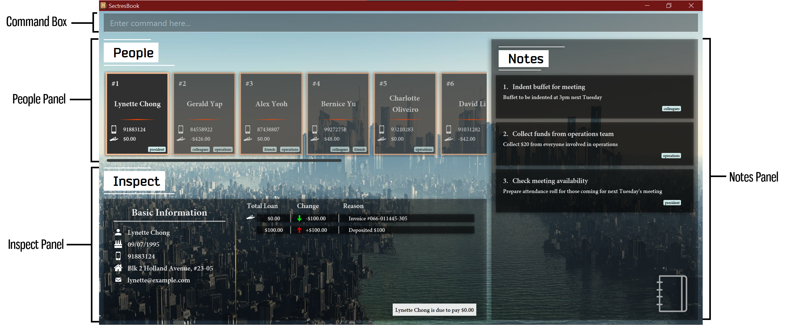
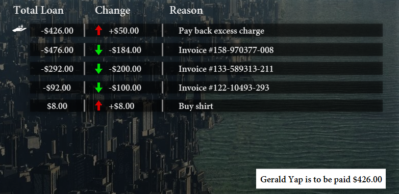
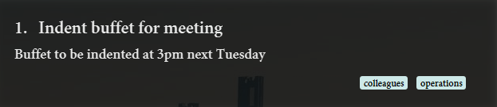
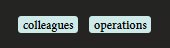
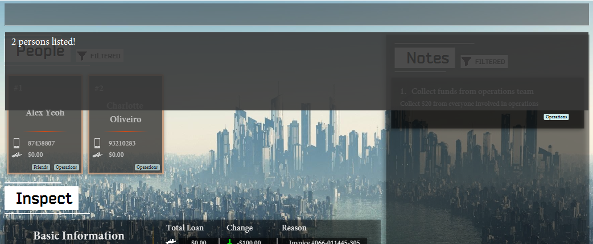
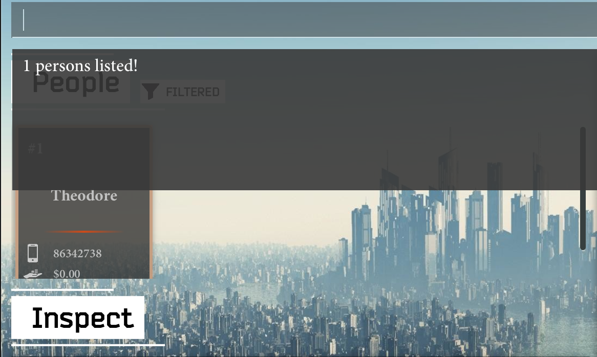
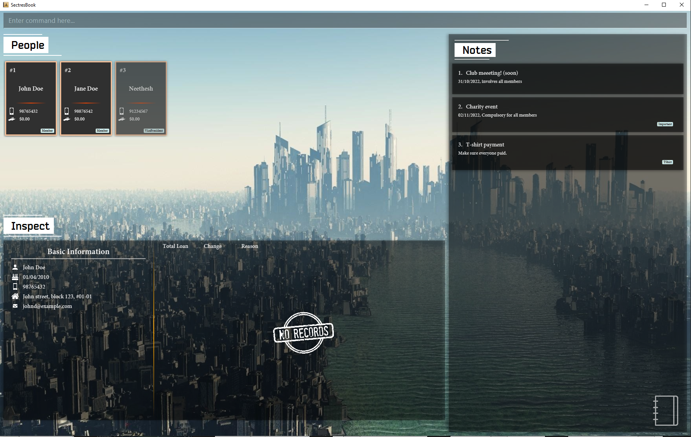
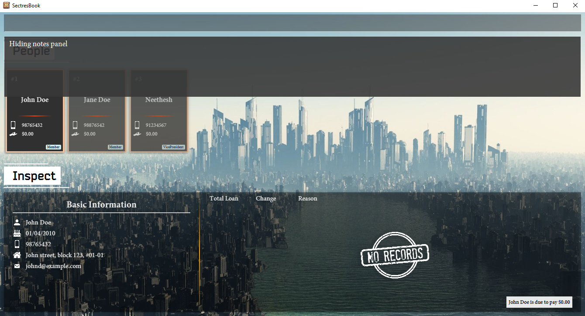
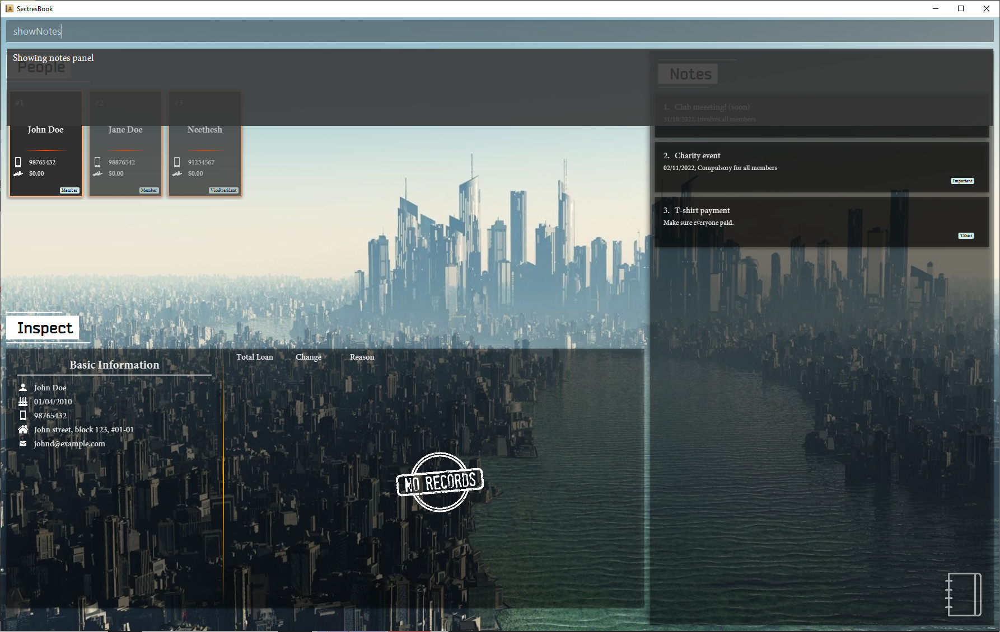

# SectresBook

SectresBook helps secretaries to **maintain all the information of the members of their club** by collating a list of identifiable information, past records, loan amounts and future tasks. As a treasurer, use SectresBook **manage the finances of your club better** by keeping track of the funds loaned to each member. This all-in-one tool eliminates the trouble of having to search through multiple notebooks/apps to find information regarding a club member, saving you time and effort so that you can focus on other tasks at hand using the notes feature!

Focusing on speed and efficiency, you can interact with SectresBook using the **Command Line Interface (CLI)**, while still having the benefits of a visually appealing **Graphical User Interface (GUI)**.

This User Guide is an in-depth guide to help you start managing your contacts, notes and finances. It includes the **installation, features and how to use them, and FAQ for troubleshooting**, ensuring a smooth pickup of the SectresBook.

### Table of Contents
  * [Introduction to SectresBook](#introduction-to-sectresbook)
  * [Using this guide](#using-this-guide)
  * [Quick start](#quick-start)
  * [User Interface](#user-interface)
    + [Command Box](#command-box)
    + [People Panel](#people-panel)
    + [Inspect Panel](#inspect-panel)
    + [Notes Panel](#notes-panel)
  * [Properties](#properties)
    + [Person Properties](#person-properties)
      - [Name](#name)
      - [Phone](#phone)
      - [Email](#email)
      - [Address](#address)
      - [Loan](#loan)
      - [Loan History](#loan-history)
      - [Birthday](#birthday)
      - [Tags](#tags)
    + [Notes Properties](#notes-properties)
      - [Title](#title)
      - [Content](#content)
      - [Tags](#tags-1)
    + [Tag Properties](#tag-properties)
  * [Features](#features)
    + [General Features](#general-features)
      - [Viewing help : `help`](#viewing-help--help)
      - [Inspecting a person : `inspect`](#inspecting-a-person--inspect)
      - [Locating persons by tag : `findTag`](#locating-persons-by-tag--findtag)
      - [Clearing all entries : `clear`](#clearing-all-entries--clear)
      - [Exiting the program : `exit`](#exiting-the-program--exit)
      - [Saving the data](#saving-the-data)
      - [Editing the data file](#editing-the-data-file)
      - [Archiving data files `[coming in v2.0]`](#archiving-data-files-coming-in-v20)
      - [Undo `[coming in v2.0]`](#undo-coming-in-v20)
      - [Redo `[coming in v2.0]`](#redo-coming-in-v20)
    + [Person Features](#person-features)
      - [Adding a new person : `add`](#adding-a-new-person--add)
      - [Listing all persons : `list`](#listing-all-persons--list)
      - [Editing a club member : `edit`](#editing-a-club-member--edit)
      - [Locating persons by name or contact number : `find`](#locating-persons-by-name-or-contact-number--find)
      - [Editing loan of a person : `editLoan`](#editing-loan-of-a-person--editloan)
      - [Deleting a person : `delete`](#deleting-a-person--delete)
      - [Sorting by property : `sort` `[coming in v2.0]`](#sorting-by-property--sort-coming-in-v20)
    + [Note Features](#note-features)
      - [Adding Notes : `addNote`](#adding-notes--addnote)
      - [Locating a note by title : `findNote`](#locating-a-note-by-title--findnote)
      - [Listing Notes : `listNotes`](#listing-notes--listnotes)
      - [Editing Notes : `editNote`](#editing-notes--editnote)
      - [Deleting Notes : `deleteNote`](#deleting-notes--deletenote)
      - [Sort Notes : `sortNotes` `[coming in v2.0]`](#sort-notes--sortnotes-coming-in-v20)
      - [Hiding notes panel : `hideNotes`](#hiding-notes-panel--hidenotes)
      - [Showing notes panel : `showNotes`](#showing-notes-panel--shownotes)
  * [FAQ](#faq)
  * [Glossary](#glossary)
  * [Command summary](#command-summary)
    + [General Commands](#general-commands)
    + [Person Commands](#person-commands)
    + [Notes Commands](#notes-commands)

--------------------------------------------------------------------------------------------------------------------

## Introduction to SectresBook

**SectresBook** is a desktop application that helps you to manage information about your club members (such as loans and birthdays) as well as keep track of your tasks in a note.

**SectresBook** provides these main features:
* Add a club member.
* Access, modify information on members.
* Add a note.
* Access, modify contents of a note.
* Tag a club member or a note (or both) for organisation

If you can type fast, SectresBook will be a convenient and efficient way to keep track of information you need to manage a club.

[Back to Top](#sectresbook)

## Using this guide

This user guide contains all the information that you will need to use and learn **SectresBook**.

If you are a **new user**, the necessary knowledge for you to get started can be found [here](#quick-start).

If you are an **experienced user**, a [Command Summary](#command-summary) is also provided, so you can quickly refer to the command formats.

Before you delve into the guide, do take note of the following highlighters.

:information_source: **Note:** Used to highlight and display information you should
pay attention to. 

:bulb: **Tip:** used to highlight tips which you might find useful 

:exclamation: **Caution:** used to highlight dangers and things to look out for. 

In addition, for better readability, icons in this guide have been colored black. In the actual application, colors may be inverted, but their shape will remain the same.

[Back to Top](#sectresbook)

## Quick start

1. Ensure you have Java `11` or above installed in your Computer.

2. Download the latest `SectresBook.jar` from [here](https://github.com/AY2223S1-CS2103T-W12-2/tp/releases).

3. Copy the file to the folder you want to use as the _home folder_ for your SectresBook.

4. Double-click the file to start the app. The GUI similar to the below should appear in a few seconds. Note how the app contains some sample data. 
   

5. We **strongly recommend** you to use this app in a resolution at or beyond 1024x768 to achieve the most level of comfort. You may also press the fullscreen icon in the top right next to the close icon to maximise the window.

6. Type the command in the command box and press Enter to execute it. e.g. typing **`help`** and pressing Enter will open the help window. 
   Some example commands you can try:

* **`list`** : Lists all contacts.

* **`add`**`name/John Doe phone/98765432 email/johnd@example.com home/John street, block 123, #01-01 bday/01/01/2000` : Adds a contact named `John Doe` to the SectresBook.

* **`delete 3`** : Deletes the 3rd contact shown in the current list.

* **`help`**: Open the UserGuide in your default web browser.

* **`clear`** : Deletes all contacts.

* **`exit`** : Exits the app.

1. Refer to the [Features](#features) below for details of each command.

[Back to Top](#sectresbook)

--------------------------------------------------------------------------------------------------------------------

## User Interface

Here is an overview of the User Interface (UI) components.

The UI comprises four sections:

### Command Box

SectresBook is a CLI app, type your command inputs here! For more information on command inputs, refer to [Features](#features) below.

Once the command box is selected, a results display will appear to report the messages from the program to you. Error messages and success messages will be shown in this box. Click anywhere else on the screen, or press the `ESC` key to exit out of the command box and hide the results display.

:bulb: **Tip:**
You may activate the command box by simply pressing the spacebar on your keyboard. There is no need to use your mouse to click on the bar.

:bulb: **Tip:**
Similarly, you may press the `ESC` key on your keyboard to exit out of the command box and hide the results display.

[Back to Top](#sectresbook)

### People Panel

This panel contains all the club and organisation members you have registered in this book. They are laid out horizontally. Although there is no need to physically control list, the user may still scroll the list with their mouse, or by pressing on the horizontal scroll bar and scrolling.

Each card representing the information of a person displays the name, phone number and total present loan amount, which may be positive to indicate an amount owed by the person, or negative to indicate an amount due to be paid to the person.

The index of the person is only an ordering within the current displayed list, it **is not tied** to the person itself.

Check the [Person Features](#person-features) to learn more about the commands you can execute related to people.

[Back to Top](#sectresbook)

### Inspect Panel

This panel is related to the people panel and shows the relevant basic information of the currently inspected person. A person can be inspect by either pressing his or her card, or by typing the `inspect` command. More details on the `inspect` command can be found [here](#inspecting-a-person--inspect).

The left side shows the basic information while the right side shows the history of loan transactions recorded.

Note that the icon of the hand holding coins shows the most recent transaction and earlier transactions are listed in order below.

The total amount of the loans is also stated in the bottom right of this panel, describing in fuller detail if the sum is owed by or to be paid to the person.

[Back to Top](#sectresbook)

### Notes Panel

This panel stores all the information related to notes and tasks that the user may want to keep track of.

Each note contains an index, a title, contents and tags.

The index of the notes is only an ordering within the current displayed list, it **is not tied** to the note itself.

Both the people and notes panels share a pool of tags for easier referencing on which group of people may be related to a specific note.

Check the [Notes Features](#note-features) to learn more about the commands you can execute related to notes.

[Back to Top](#sectresbook)

--------------------------------------------------------------------------------------------------------------------

## Properties

### Person Properties

  

A typical person card.

#### Name

The name of a person to be recorded in the SectresBook. Two persons cannot have exactly the same name, but slight deviations are acceptable. Our team realises that many people may share the same name, so it is alright to use close aliases.

This property can be identified from the GUI by the icon of the silhouette of a person.

- Identified by the prefix `name`.
- This is a valid property to find a person by using the `find` command.

:bulb: **Tip:**
It is recommended to include the full name of the person instead of aliases for easier searching.

[Back to Top](#sectresbook)

#### Phone
This is phone number of the person to be recorded in the SectresBook. This is a valid property to find a person by using the [`find` command](#locating-persons-by-name-or-contact-number--find).

This property can be identified from the GUI by the icon of a mobile phone.

- Identified by the prefix `phone`.
- A phone number should contain only numbers and be at least 3 digits long.

Please record only the most accessible phone number you can contact the given member by. You are not allowed to enter multiple phone numbers in this field.

:exclamation: **Caution:**
Ensure that no two persons have the same phone number! This is allowed in the program, but you may have difficulties contacting the person you want in the future.

[Back to Top](#sectresbook)

#### Email

This pertains to the email address of the person to be recorded in the SectresBook. It serves mainly as a point of information regarding the person, but has no additional features tied to it.

This property can be identified from the GUI by the icon of an envelope.

- Identified by the prefix `email`.
- Emails should be of the format `local-part@domain` and adhere to the following constraints:

 Part    | Constraint |
|---------|----------|
 Local part |                                                                              The local-part should only contain alphanumeric characters and these special characters `_`, `.`, `+` and `-`.   The local-part may not start or end with any special characters and special characters may not be adjacent to each other.
 Domain name |The domain name is made up of domain labels separated by periods. The domain name must:
 - end with a domain label at least 2 characters long  - have each domain label start and end with alphanumeric characters   - have each domain label consist of alphanumeric characters, separated only by hyphens, if any.

The local part and domain part **must** be connected by a `@` symbol.

[Back to Top](#sectresbook)

#### Address
This is the residing address of the person. It serves mainly as a point of information regarding the person, but has no additional features tied to it.

This property can be identified from the GUI by the icon of a house.

- Identified by the prefix `home`.
- There is no constraint on how the home address of a person should be written, as long as it is sufficiently understandable.

:information_source: **Note:**
Although there is no constraint, please ensure that your screen can accommodate the length of the text. If you find the text being cut off and ellipses `...` showing, please increase either the width or height of your screen.

[Back to Top](#sectresbook)

#### Loan
This is amount of money that is owed by a person, or is to be paid to that person. This is a property that cannot be manipulated directly, but can only be edited with the [`editLoan` command](#editing-loan-of-a-person--editloan).

This property can be identified from the GUI by the icon of the hand holding two stacks of coins.

- A loan amount can be either negative, positive or zero.
    + A positive value indicates an amount that the person has yet to pay to the organisation.
    + A zero value indicates no outstanding loan.
    + A negative value indicates an amount that should be paid back to the person.
- Loans can only take up numerical values.
- The maximum value this property can take is `$1,000,000,000,000.00` (1 trillion dollars ). Similarly, the minimum value is `-$1,000,000,000,000.00` (negative 1 trillion dollars). This should be more than sufficient for general purpose use.

[Back to Top](#sectresbook)

#### Loan History
A loan history is linked to the loans properties and describes the changes to the numeric values of the loans in detail.

This property is represented in a descending list on the right side of the inspection panel.

The most recent transaction is recorded at the top, on the row next to the loans icon.

The upwards point red arrow signifies an amount loaned to this member in a transaction.

The downwards pointing green arrow signifies an amount that this member has paid back in a transaction.

- Consists of the following sub-properties:
    - Current loan value
    - Change in amount from last value
    - Reason for change

:bulb: **Tip:**
Including a reason for every change to a person's loan value reduces the risk of accidentally adding an incorrect amount to someone. It keeps a detail tab of every increment and decrement in value.

[Back to Top](#sectresbook)

#### Birthday
The birthday date of the person.

This property can be identified from the GUI by the icon of a birthday cake.

- Identified by the prefix `bday`.
- Serves as a point of information for a person.
- This must be a valid date in the form `dd/MM/yyyy`.

[Back to Top](#sectresbook)

#### Tags
- Persons can be linked to tag objects, which serve as markers that draw connections between different people as well as associated notes.

This property can be identified from the GUI by tag shaped labels with text inside them. They are usually located at the bottom right of each person card. If there is no such label, then it means this person has no associated tags.

:bulb: **Tip:**
Please refer to the [`Tag Properties`](#tag-properties) below for more information regarding tags.

[Back to Top](#sectresbook)

### Notes Properties

  

A typical note card.

#### Title
The title serves as the main marker for notes and summarises the important details of this specific note. This is a compulsory field for all notes.

It is the first line of a note card, which is bigger than the rest of the text.

- This property is identified by the prefix `title`.
- Notes can be filtered through with the `find` command using the title property.
- Titles must be within 100 characters and can contain any ASCII characters.
- This property cannot be left empty.

[Back to Top](#sectresbook)

#### Content
The content serves as the description for notes.

This is immediately below the title and is in a smaller font size.

- This property is identified by `content`.
- This property cannot be left empty.

[Back to Top](#sectresbook)

#### Tags

Notes can be linked to tag objects, which serve as markers that draw connections between different people as well as associated notes. Tags can only be alphanumeric.

This is located at the bottom right of the notes card. If there is no such label, then it means this person has no associated tags.

:bulb: **Tip:**
Choose short, identifiable tag names.

:bulb: **Tip:**
Please refer to the [`Tag Properties`](#tag-properties) section below for more information regarding tags.

[Back to Top](#sectresbook)

### Tag Properties
A tag that is used to group together specific People and Notes.

This way, searching for a tag brings up all the People and Notes that have the tag for easier classification of related information.

- Identified by the prefix `tag`.
- Person and Note can hold tags.

[Back to Top](#sectresbook)

--------------------------------------------------------------------------------------------------------------------

## Features

**:information_source: Notes about the command format:** 

* Words in `UPPER_CASE` are the parameters to be supplied by the user. 
  e.g. in `add name/NAME`, `NAME` is a parameter which can be used as `add name/John Doe`.

* Items in square brackets are optional. 
  e.g `name/NAME [tag/TAG]` can be used as `name/John Doe tag/friend` or as `name/John Doe`.

* `<OR>` signifies an exclusive-or parameter that is to be input. 
  e.g `INDEX <OR> NAME` allows either the parameter `INDEX` or the parameter `NAME`, but not both

* Items with `…`​ after them can be used multiple times including zero times. 
  e.g. `[tag/TAG]…​` can be used as ` ` (i.e. 0 times), `tag/friend`, `tag/friend tag/family` etc.

* Parameters can be in any order. 
  e.g. if the command specifies `name/NAME phone/PHONE_NUMBER`, `phone/PHONE_NUMBER name/NAME` is also acceptable.

* If a parameter is expected only once in the command but you specified it multiple times, only the last occurrence of the parameter will be taken. 
  e.g. if you specify `phone/12341234 phone/56785678`, only `phone/56785678` will be taken.

* Extraneous parameters for commands that do not take in parameters (such as `help`, `list`, `exit` and `clear`) will be ignored. 
  e.g. if the command specifies `help 123`, it will be interpreted as `help`.

### General Features

#### Viewing help : `help`

Shows a message explaining how to access the help page.

Copy the link to your clipboard by pressing the `Copy Link` button and paste it in your favourite browser to come back to this page anytime.

Format: `help`

[Back to Top](#sectresbook)

#### Inspecting a person : `inspect`

Updates the Inspect Panel with the basic information and loan history of the person inspected.

Inspection is a UI-centric command that operates on the current filtered person’s list, so you may only inspect those that are presently listed.

If you wish to view the properties of anyone in the full list, please remember to specify `list` to clear the filter.

:information_source: **Note:**
If there are multiple people in the list satisfying the keywords given, it will, by default, inspect the first person that matches the keywords.

You may wish to use more unique keywords to reduce ambiguity, or inspect by an index.

Format: `inspect INDEX <OR> NAME`

Examples:
* `inspect 2` inspects the second person in the list of people
* `inspect Lynette` will attempt to find the first person called `Lynette` in the currently **filtered** persons' list and update the Inspect Panel with her information.

[Back to Top](#sectresbook)

#### Locating persons by tag : `findTag`

Finds People and Notes that have the given tag. Both the Notes Panel and the People Panel will be updated synchronously with all entities that match the specifiers.

:information_source: **Note:**
Both the people panel and notes panel will show a `FILTERED` indicator to inform you that both lists have been filtered.

Format: `findTag TAG [MORE_TAGS]`

* The tag search is case-insensitive. e.g `finance` will match `Finance`
* Only the tag is searched.
* Only full words will be matched e.g. `Tech` will not match `Technology`
* Persons and Notes matching at least one tag will be returned (i.e. `OR` search).
  e.g. `Operations` will return
  * Person `Alex Yeoh` (tag: Friends) (tag: Operations),
  * Person `Charlotte Oliveiro` (tag: Operations),
  * Note `Collect funds from operations team` (tag: Operations)

Examples:
* `findTag Operations` returns Person `Alex Yeoh`, Person `Charlotte Oliveiro` and Note `Collect funds from operations team`
  

[Back to Top](#sectresbook)

#### Clearing all entries : `clear`

Clears all entries of people and notes from the SectresBook. This command is irreversible. This effectively restarts the app from a blank slate.

Format: `clear`

[Back to Top](#sectresbook)

#### Exiting the program : `exit`

Exits the program.

Format: `exit`

:information_source: **Note:**
Your data is safe and saved automatically.
pay attention to. 

[Back to Top](#sectresbook)

#### Saving the data

SectresBook data are saved in the hard disk automatically after any command that changes the data. There is no need to save manually.

[Back to Top](#sectresbook)

#### Editing the data file

SectresBook data are saved as a JSON file `[JAR file location]/data/sectresbook.json`. Advanced users are welcome to update data directly by editing that data file.

:exclamation: **Caution:**
If your changes to the data file makes its format invalid, SectresBook will discard all data and start with an empty data file at the next run.

[Back to Top](#sectresbook)

#### Archiving data files `[coming in v2.0]`

:exclamation: **Caution:**
This command does not exist in the present version of the program that this User Guide is written for. It **will not work** if entered.

Copies the current data file as a new file in the `HOME_FOLDER_LOCATION/archives` folder. This file may be used as a saved checkpoint to load past information into the SectresBook.

[Back to Top](#sectresbook)

#### Undo `[coming in v2.0]`

:exclamation: **Caution:**
This command does not exist in the present version of the program that this User Guide is written for. It **will not work** if entered.

Undoes the last command that the user has inputted, setting the state of the saved data to an earlier state.

[Back to Top](#sectresbook)

#### Redo `[coming in v2.0]`

:exclamation: **Caution:**
This command does not exist in the present version of the program that this User Guide is written for. It **will not work** if entered.

Pushes the state of the program to the later state if it was set back to an earlier state by the `undo` command. If the present state is the most recent state, no operation is performed.

:information_source: **Note:**
Note that performing undo commands and inputting a new command after will set the present state to the most recent state. No redo commands may be performed subsequently.

[Back to Top](#sectresbook)

### Person Features

#### Adding a new person : `add`

Adds a person to the SectresBook. The new member will appear at the end of the persons' list residing in the People Panel.

Format: `add name/NAME phone/PHONE_NUMBER email/EMAIL home/ADDRESS bday/BIRTHDAY [tag/TAG]...​`

:bulb: **Tip:**
A person can have any number of tags (including 0).

Examples:
* `add name/John Doe phone/98765432 email/johnd@example.com home/John street, block 123, #01-01 bday/01/04/2010 tag/Member`
* `add name/Jane Doe phone/98876542 email/jane@example.com home/That Street, block 133, #11-10 bday/05/11/1986 tag/Member`
* `add name/Neethesh tag/VicePresident email/neethesh@example.com home/Happy Avenue phone/91234567 bday/24/05/1998`

[Back to Top](#sectresbook)

#### Listing all persons : `list`

List of all persons in the SectresBook. If the list was formerly filtered, the filter icon to the right of the person's label will disappear.

Format: `list`

[Back to Top](#sectresbook)

#### Editing a club member : `edit`

Edits an existing club member’s information in the SectresBook.

Format: `edit INDEX <OR> NAME [name/NAME] [phone/PHONE] [email/EMAIL] [home/ADDRESS] [bday/BIRTHDAY] [tag/TAG]…​`

Remember that all terms are optional for edit commands, but it must include at least 1 property to edit the person by.

If ambiguities by the keywords given exist, the persons' list will auto-filter to display all matching persons that cause the ambiguity to arise. Please fine tune your search requirements, or use an index from here, to edit the person again.

Example of usage:

`edit 1 phone/99999999` can be used to easily update the first person's contact information.

`edit John phone/91235555` can be used to update a person’s contact information if there exists only one person whose name contains John. 

:information_source: **Note:**
If no person is named `John`, or if more than one person has `John` in their name, then the operation is equivalent to `find John`.

[Back to Top](#sectresbook)

#### Locating persons by name or contact number : `find`

Finds persons whose names match any of the given keywords, or phone numbers contain any of the given keywords (in digits).

You will notice a `FILTERED` icon next to the panel header to indicate that the list you are viewing is currently filtered.

Format: `find KEYWORD [MORE_KEYWORDS]`

* The search is case-insensitive. e.g `hans` will match `Hans`
* The order of the keywords does not matter. e.g. `Hans Bo` will match `Bo Hans`
* Only the name is searched.
* Only full words will be matched e.g. `Han` will not match `Hans`
* Persons matching at least one keyword will be returned (i.e. `OR` search).
  e.g. `Hans Bo` will return `Hans Gruber`, `Bo Yang`
* Phone numbers starting with any of the given keywords(in digits) will be returned.

Examples:
* `find John` returns `john` and `John Doe`
* `find alex david` returns `Alex Yeoh`, `David Li` 
  
* `find 86` returns `Theodore` 
  

[Back to Top](#sectresbook)

#### Editing loan of a person : `editLoan`

Edits an existing club member's loan amount in the SectresBook. Please note that the value must be either positive or negative values with up to 2 decimal places.

The absolute maximum amount for a loan is `$1,000,000,000,000.00` (positive or negative 1 trillion). If you are intending to file more than a trillion dollars in total transactions, this application may not be a suitable one for you, as our expected clients do not normally transfer this much money.

:exclamation: **Caution:**
If the total amount after the `editLoan` command adds up to more than a trillion, the program will block the command from going through.

Format: `editLoan INDEX <OR> NAME amt/VALUE reason/REASON`

* Edits the loan value of the existing person at the specified `INDEX`.
* The index refers to the index number shown in the displayed person list.
* The index **must be a positive integer** 1,2,3 …​
* The `VALUE` can be a positive or negative value with up to 2 decimal places.
* The loan value will be changed by the value given i.e current loan + VALUE.

Examples:

* `editLoan 2 amt/30 reason/bought logistics`
* `editLoan alex amt/-30 reason/return money from logistics`
* `list` followed by `editLoan 1 -20 return money` will edit the 1st person in the SectresBook,
  reducing their loan by $20 and saving the `REASON` as `return money`.

[Back to Top](#sectresbook)

#### Deleting a person : `delete`

Deletes the specified person from the SectresBook. Delete commands are irreversible, so please ensure that you are deleting the correct person.

Format: `delete INDEX <OR> NAME`

* Deleting by **INDEX**:
    * Deletes the person at the specified `INDEX`.
    * The index refers to the index number shown in the displayed person list.
    * The index **must be a positive integer** 1, 2, 3, …​

* Deleting by **NAME**:
    * Delete the entry of the person by name with the given keyword, only if the keywords specified are unique to that person's name.
    * Will not perform any operation if the name of the person does not exist.
    * If the SectresBook contains more than one person that can be found by the keyword specified, the delete command will not execute but will return a list of all people with the given name. From here, you may choose to delete by index.

Examples:
* `list` followed by `delete 2` deletes the 2nd person in the SectresBook.
* `find Betsy` followed by `delete 1` deletes the 1st person in the results of the `find` command.
* `delete Betsy` deletes the entry belonging to Betsy in the SectresBook
* `delete Lynette` does not perform any operation, as Lynette does not exist in the SectresBook.

:bulb: **Tip:**
To delete everyone at the same time, please refer to the [`clear` command](#clearing-all-entries--clear).

[Back to Top](#sectresbook)

#### Sorting by property : `sort` `[coming in v2.0]`

:exclamation: **Caution:**
This command does not exist in the present version of the program that this User Guide is written for. It **will not work** if entered.

Sorts the members in the persons' list by properties in either ascending or descending order.

[Back to Top](#sectresbook)

### Note Features

#### Adding Notes : `addNote`

Adds a note to the SectresBook.

Format: `addNote title/TITLE content/CONTENT [tag/TAG]... `

:bulb: **Tip:**
TITLE must be unique and not longer than 100 characters. Tags are also optional.

Examples:
* `addNote title/Club meeting soon! content/Remind club members to attend meeting.`
* `addNote title/T-Shirt payment due content/Collect money tag/Juniors`

#### Locating a note by title : `findNote`

Finds the notes whose titles match any of the given keywords. A filtered icon will show to the side of the Notes Panel to indicate that you are now viewing a filtered list.

Format: `findNote KEYWORD [MORE_KEYWORDS]`

* The search is case-insensitive. e.g. `meeting` will match `Meeting`
* The order of the keywords does not matter. e.g. `Meeting Club` will match `Club Meeting`
* Only the title is searched.
* Only the full words will be matched. e.g. `Meetings` will not match `Meeting`
* Keyword cannot contain special characters. However, numbers will be allowed.
* e.g. The keywords `?!` and `t-shirt` will not be allowed.
* e.g. `2` will match `shirt 2` but will not match `shirt2`
* Keywords will ignore special characters.
* e.g. `Meetings` will match `Meetings!!!` and `Meetings 1`
* e.g. `shirt` will match `t-shirt`
* However, `tshirt` will not match `t–shirt` as special characters are ignored (`t-shirt` is now treated as two words, `t` and `shirt` with the special character `-` being treated as a spacing)

Examples:
* findNote `Meeting` returns `Club Meeting`, `Meeting!` and `Meeting 2`
* findNote `Soon` returns `Payment (soon)`

[Back to Top](#sectresbook)

#### Listing Notes : `listNotes`

Shows a list of all notes in the SectresBook. If the notes list was previously filtered, the filter icon will disappear to indicate that you are now looking at the full list.

Format: `listNotes`

[Back to Top](#sectresbook)

#### Editing Notes : `editNote`

Edits an existing specified note in the SectresBook.

Format: `editNote INDEX <OR> TITLE [title/TITLE] [content/CONTENT] [tag/TAG]...`

Example of usage:

* `editNote 1 content/Second club meeting` can be used to easily update the first note's contents.
* `editNote alumni title/2020 alumni meeting` can be used to amend a note with the title "2020 alumni mtg", only if it is the only note containing "alumni" in its title.

[Back to Top](#sectresbook)

#### Deleting Notes : `deleteNote`

Deletes the specified note from the SectresBook.

Format: `deleteNote INDEX`

* Deletes the note at the specified `INDEX`.
* The index refers to the index number shown in the displayed note list.
* The index **must be a positive integer** 1, 2, 3, …​

Unlike other entities, you may not delete a note by name. This is to minimise errors in deletion as many notes may have similar names.

Examples:
* `listNotes` followed by `deleteNote 2` deletes the 2nd note in the SectresBook.

[Back to Top](#sectresbook)

#### Sort Notes : `sortNotes` `[coming in v2.0]`

:exclamation: **Caution:**
This command does not exist in the present version of the program that this User Guide is written for. It **will not work** if entered.

Sorts the notes in either ascending or descending order by title.

[Back to Top](#sectresbook)

#### Hiding notes panel : `hideNotes`

Hides the notes panel to the right side of the screen if visible, otherwise, no operation is performed. Use this command if you do not wish to see the notes view while you are working with information related to the members only.

:information_source: **Note:**
Even though the notes panel may be hidden, operations on notes will still work as normal. This is purely a visual feature.

Format: `hideNotes`

Example:

Initial view:

After executing `hideNotes`:

[Back to Top](#sectresbook)

#### Showing notes panel : `showNotes`

Slides the notes panel into view if hidden, otherwise, no operation is performed.

Format: `showNotes`

Example :

Initial view:

After executing `showNotes`:

[Back to Top](#sectresbook)

--------------------------------------------------------------------------------------------------------------------
## FAQ

**Q** I work in a highly classified/important organisation and we have large volumes of monetary transactions and tasks we need to keep track of. Can we use this version of the program to manage our operations? 
**A** No, the current version of _SectresBook_ is not designed for such intensive and critical operations. It does not support any form of encryption or security and its performance has not been tested rigorously against larger loads. We ***do not suggest*** using this program in places where information loss or leaks may result in catastrophic consequences.

**Q** I cannot see any images in this document, what is wrong? 
**A** You are likely viewing the document in dark mode. The images are in black as their main color, please view this document in light mode instead.

**Q**: How do I transfer my data to another Computer? 
**A**: Install the app in the other computer and overwrite the empty data file it creates with the file that contains the data of your previous SectresBook home folder.

**Q**: Double-clicking the jar file does not open the jar file, why does this happen? 
**A**: Make sure that Java 11 is installed on your computer. You may also open the terminal or command prompt and type `java -jar SectresBook.jar`.

**Q** Do I need to have Java installed to run SectresBook? 
**A** Yes, SectresBook runs on Java and would require it to work. For more information on how to install Java 11, visit this [website](https://docs.oracle.com/en/java/javase/11/install/overview-jdk-installation.html).

**Q** What can I can do if the window size is too small? 
**A** Drag the window of the application with your mouse to enlarge it, or simply click the top right maximise icon of the window.

**Q** Why can't I see the full address of the person I am inspecting? 
**A** Your window is too small to accommodate the full label text, please drag your window either wider or taller so that the text may have space to display.

**Q** I have entered a command, but there is no response from the program, why did this happen? 
**A** A critical error may have occurred. You may likely be able to continue your usage of the program. Please review your terminal output and file a bug report on our [issues page](https://github.com/AY2223S1-CS2103T-W12-2/tp/issues), detailing a description of the bug as well as the steps to reproduce, attaching screenshots if any.

**Q** Do I require an internet connection to use SectresBook? 
**A** No, SectresBook fully works without the need for internet connection.

**Q** I have an existing data file but the app does not show any of the information, what is wrong? 
**A** Your data file is corrupted. Please open the json data file in a text editor and remove the offending data.

**Q** Who can I contact for questions regarding this version of the program if the information I need cannot be found in this guide? 
**A** Please contact the person from whom you obtained this present version from, or contact any of our developers (links to Github):

| [Rui Han](https://github.com/rui-han-crh) | [Pinran](https://github.com/Pinran-J) | [Ryan](https://github.com/ryanczx) | [Neethesh](https://github.com/Neethesh26) | [Zhong Wei](https://github.com/czhongwei) |
|-------------------------------------------|---------------------------------------|------------------------------------|-------------------------------------------|-------------------------------------------|

[Back to Top](#sectresbook)

--------------------------------------------------------------------------------------------------------------------

## Glossary
The definitions in this glossary are context-specific to this application.

Word | Definition
--------|------------------
**Command Line Interface (CLI)** | A text-based interface that recieves typed commands as input and returns textual feedback as output.
**Graphical User Interface (GUI)** | An image-based interface that is more visually appealing than a command-line interface and encapsulates information through the use icons and images.
**Loan** | An amount of money that is borrowed by or owed to a person. A positive value signifies an amount owed by the person and a negative value signifies an amount to be paid to that person.
**Parameter** | A value passed as a section of a command, typically following a prefix.
**Prefix** | A signposting word that indicates the kind of property (i.e. name, email, address, etc), which typically follows immediately after the prefix, that is to be passed as a parameter.
**Property** | An identifiable feature a person or object has that sufficiently distinguishes it from other objects of the same kind.
**Secretary** | A person that manages the tasks and events related to the operations of an organisation.
**Tag** | A label that groups related people together, such that they can be referred to as a single encapsulated entity specified by the tag.
**Treasurer** | A person that manages the finances and monetary transactions related to the operations of an organisation.

[Back to Top](#sectresbook)

--------------------------------------------------------------------------------------------------------------------
## Command summary

### General Commands

Action | Format                    | Examples
-------|---------------------------|----------|
**Inspect** | `inspect NAME <OR> INDEX` | `inspect 1` or `inspect Alex`
**Help** | `help`                    | `help`
**Clear all data** | `clear`                   | `clear`
**Exit** | `exit`                    | `exit`

[Back to Top](#sectresbook)

### Person Commands

Action | Format | Examples
--------|----------------------|--------
**Add a person** | `add name/NAME phone/PHONE_NUMBER email/EMAIL home/ADDRESS bday/BIRTHDAY [tag/TAG]…​`                | `add name/James Ho phone/22224444 email/jamesho@example.com home/123, Clementi Rd, 1234665 bday/01/01/2000 tag/friend tag/colleague`
**Delete person** | `delete INDEX` `delete NAME`                                                                      | `delete 3`   `delete Jane`
**Edit person** | `edit INDEX [name/NAME] [phone/PHONE_NUMBER] [email/EMAIL] [home/ADDRESS] [bday/BIRTHDAY][tag/TAG]…​` | `edit 2 name/James Lee email/jameslee@example.com`
**Find a person** | `find KEYWORD [MORE_KEYWORDS]`   `find NUMBER`                                                    | `find James Jake`   `find 8651`
**Find Tag** | `findTag TAG [MORE_TAGS]`                                                                            | `findTag Operations Outreach`
**Edit loan of a person** | `editLoan INDEX amt/AMOUNT reason/REASON`                                                            | `editLoan 1 amt/-20 reason/Buy Logistics`
**List all person** | `list`                                                                                               | `list`

[Back to Top](#sectresbook)

### Notes Commands

Action | Format | Examples
--------|-------------------|-------------
**Show Notes Panel** | `showNotes`              | `showNotes`
**Hide Notes Panel** | `hideNotes`              | `hideNotes`
**Add Note** | `addNote title/TITLE content/CONTENT [tag/TAG]...`                      | `addNote title/Create Excel Sheet content/Create sheet for blockchain department`
**Edit Note** | `editNote INDEX <OR> TITLE [title/TITLE] [content/CONTENT] [tag/TAG]...` | `editNote 1 title/Check meeting availability tag/president`
**Delete Note** | `deleteNote INDEX`                                                      | `deleteNote 1`
**List Notes** | `listNotes`                                                              | `listNotes`
**Find Note** | `findNote KEYWORD [MORE_KEYWORDS]`                                      | `findNote meeting`

[Back to Top](#sectresbook)
