> :warning: Prerequisite:
> * This guide assumes that the reader is familiar with using [Java](https://www.java.com/)

# Table of Contents

{:toc}

## Introduction

PennyWise is a desktop application that **empowers students with the ability to make sensible financial decisions**,
helping students to manage their budget. It is **optimised for use via Command Line Interface** (CLI) while providing a
clean Graphical User Interface (GUI) for easy comprehension of expenditure and savings. _Interested?_ Head over to
“Quick Start” to get started. Enjoy!

## Quick start
1. Ensure you have Java 11 or above installed in your Computer. You can check whether Java 11 is installed by following
   the instructions below:
    1. Open your terminal window
    2. Run the following command: `java -version`
    3. If Java 11 is not installed, please download Java 11 from [Oracle](https://www.oracle.com/java/technologies/downloads/#java11).
       For Mac users, you may use the [Azul build of
       OpenJDK 11 (JDK FX) version](https://www.azul.com/downloads/?version=java-11-lts&os=macos&architecture=arm-64-bit&package=jdk-fx).
2. Download the latest [pennywise.jar](https://github.com/AY2223S1-CS2103T-W17-2/tp/releases) application file.
3. Copy the file to the folder you want to use as the home folder for PennyWise.
4. Double-click the file to start the app. You should see a user interface similar to what is shown below in a few seconds.
    * The application contains some sample data to that provides some examples on how you can use the application.
   
   
5. Type the command in the command box and press Enter to execute it. e.g. typing **`help`** and pressing Enter will
   open the help window. 
   Some example commands you can try:

    - **`add`**`t/i d/Tution Teaching a/45.00 da/13-10-2022 c/Salary` : Adds an income entry
      with the description `Tuition Teaching` to the PennyWise application.

    - **`delete`**`3 t/e` : Deletes the 3rd entry shown in the expenditure list.

    - **`view`**`t/e` : View a PieChart of all expenses.

    - **`view`**`t/e mo/2022-08` : View a LineGraph of all expenses on August 2022.

    - **`clear`** : Deletes all entries.

    - **`exit`** : Exits the app.

6. Refer to the [Features](#features) below for details of each command.

:information_source: **Info:**
Congrats! You are now ready to get started on your first steps in supercharging your financial management flow!

---

## Navigating the User Guide

### Information Box

:information_source: **Info:**
This provides some additional information that may be useful for Jedi users.

### Tip Box

:bulb: **Tip:**
This provides some quick and convenient hacks that you can use to optimize your experience with PennyWise.

### Danger Box

:exclamation: **Warning**
Danger zone! Do pay attention to the information here carefully.

### Formatting

- `Highlights` are used to denote commands or output from the application.

## Features

**:information_source: Notes about the command format:** 

- All command follow this format: 
  <pre>
    command | entry identifier | input | [optional inputs]
  </pre>
  Example: 
  <pre>
    add t/e d/Lunch a/15.60 da/15-08-2022 c/Meal
  </pre>
    - Command : <pre>add</pre> 
    - Identifier : <pre>t/e</pre> 
    - Input : <pre>d/Lunch a/15.60 da/15-08-2022 c/Meal</pre> 
    - Optional input : NIL 

- Words in `UPPER_CASE` are the parameters to be supplied by the user. 
  e.g. in `delete INDEX_OF_ENTRY t/ENTRY_TYPE`, `INDEX_OF_ENTRY` is a parameter which can be used as `delete 10 t/e`.

- Items in square brackets are optional. 
  e.g `view t/ENTRY_TYPE [MONTH]` can be used as `view t/e mo/2022-05` or as `view t/e`.

- **ALL** identifiers are <ins>case sensitive</ins>. 
  e.g `d/Lunch` as a descriptor for "Lunch" is accepted by PennyWise, however `D/Lunch` would not be accepted.

## Before Using

**:information_source: Notes about the application:** 
- To familiarise yourself with our user interface, please refer to the following diagram and table to understand how to use our application.

|      `Component`       |                                                       `Explanation`                                                        |
|:----------------------:|:--------------------------------------------------------------------------------------------------------------------------:|
|    **List Display**    |            where you view your entry lists (Expenditure or Income)   - can be modifed by the `view` command             |
|   **Graph Display**    | where you view your entries in a graphical overview (Pie Chart or Line Graph)   - can be modified by the `view` command |
| **Command Input Box**  |                                       where you enter your commands to use PennyWise                                       |
| **Command Output Box** |                                  where you see the output of your commands from PennyWise                                  |

- For **ALL** entries, categories are <ins>COMPULSORY</ins> and every entry can only contain <ins>one</ins> category. 
  The following table shows the`Expenditure` and `Income` entries categories. The category names are <ins>case sensitive</ins>.

|   `Expenditure`   |    `Income`     |
|:-----------------:|:---------------:|
|     **Food**      |   **Salary**    |
|   **Groceries**   |  **Allowance**  |
| **Entertainment** |   **Profit**    |
|   **Education**   | **Investments** |
|    **Housing**    |    **Gifts**    |
|    **Others**     |   **Others**    |

- For **ALL** entries, 2 entries are considered duplicates <ins>IF</ins> both entries have exactly the same:
  `description`, `date` `amount` and `category`. We do not want PennyWise to be managing entries which are a repeat,
  of one another, as it would be easier to simply use the [edit](#editing-entries--edit-index_of_entry-tentry_type-dedited_description-aedited_amount-daedited_date-cedited_category) 
  command to alter the original entry's specifications.    
  For example, when executing the following 2 commands one after another, PennyWise will recognise (2), which is the second `Teh Beng` added as a duplicate entry. 
  Having multiple duplicate entries will make it difficult for users to track their expenses later on, and could clutter the list. Having them differentiated will make
  it easier for you to recall what you spent your money on!
  <pre>
    <code>
        1. add t/e d/Teh Beng a/1.50 da/22-10-2022 c/Food
        2. add t/e d/Teh Beng a/1.50 da/22-10-2022 c/Food
    </code>
  </pre>
  To add similar entries, vary the description/amount/date/category to let PennyWise know they are not duplicates!
  <pre>
    <code>
        1. add t/e d/Teh Beng 11am a/1.50 da/22-10-2022 c/Food
        2. add t/e d/Teh Beng 4pm a/1.50 da/22-10-2022 c/Food 
    </code>
  </pre>
  OR we could even edit the original entry directly to reflect 2 cups of `Teh Beng` consumed.
  <pre>
    <code>
        1. edit 1 t/e d/2 Teh Beng 11am a/3.00 da/22-10-2022 c/Food
    </code>
  </pre>

### Adding entries : `add t/ENTRY_TYPE d/DESCRIPTION a/AMOUNT da/DATE c/CATEGORY`
Adds an entry to the specified list.  
1. Add expense  
   - Example: `add t/e d/Lunch a/15.60 da/10-10-2022 c/Food` 
   Expected: `New entry added: Lunch; Date: 10-10-2022; Amount: 15.60; Tag: Food`
   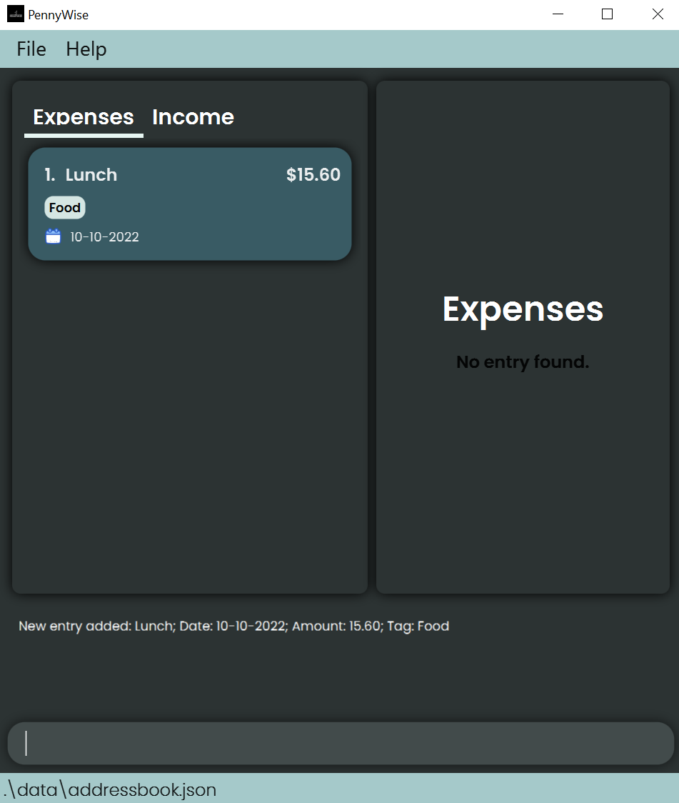
1. Add income  
   - Example: `add t/i d/Tuition a/40.00 da/10-10-2022 c/Salary` 
   Expected: `New entry added: Tuition; Date: 10-10-2022; Amount: 40.00; Tag: Salary`
   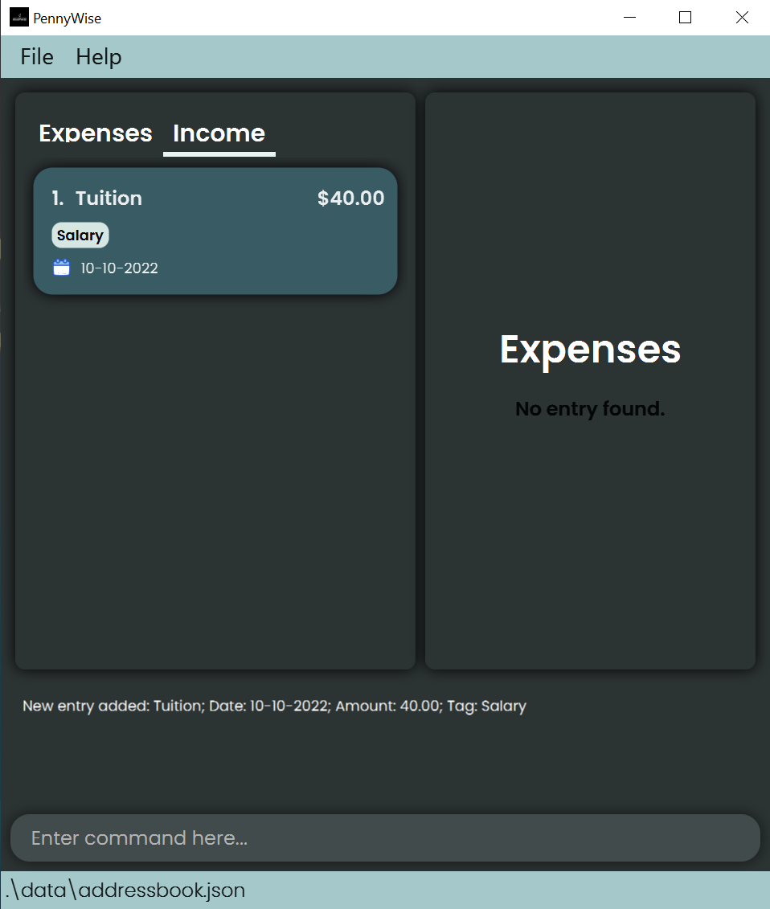

### Deleting entries : `delete INDEX_OF_ENTRY t/ENTRY_TYPE`
Deletes an entry.
1. Example: `delete 2 t/e` deletes the 2nd item on the expenditure list 
   Expenditure list:
   1. Movie 15.60 12 Sep 2022 c/Entertainment
   2. Drink 1.20 12 Sep 2022 c/Food  
   Expected: `Deleted Entry: Drink; Date: 12-09-2022; Amount: 1.20; Tag: Food`
   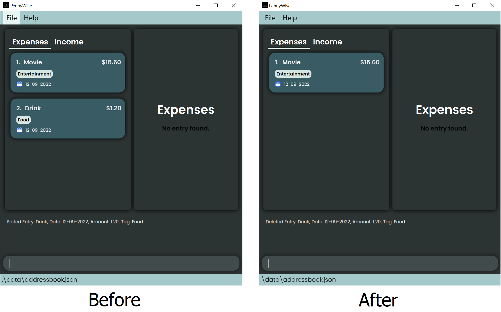
1. Example: `delete 2 t/i` deletes the 2nd item on the income list
   Income list:
   1. Tuition 40.00 12 Sep 2022 c/Salary
   2. Allowance 100.00 12 Sep 2022 c/Allowance  
   Expected: `Deleted Entry: Allowance; Date: 12-09-2022; Amount: 100.00 Tag: Allowance`
   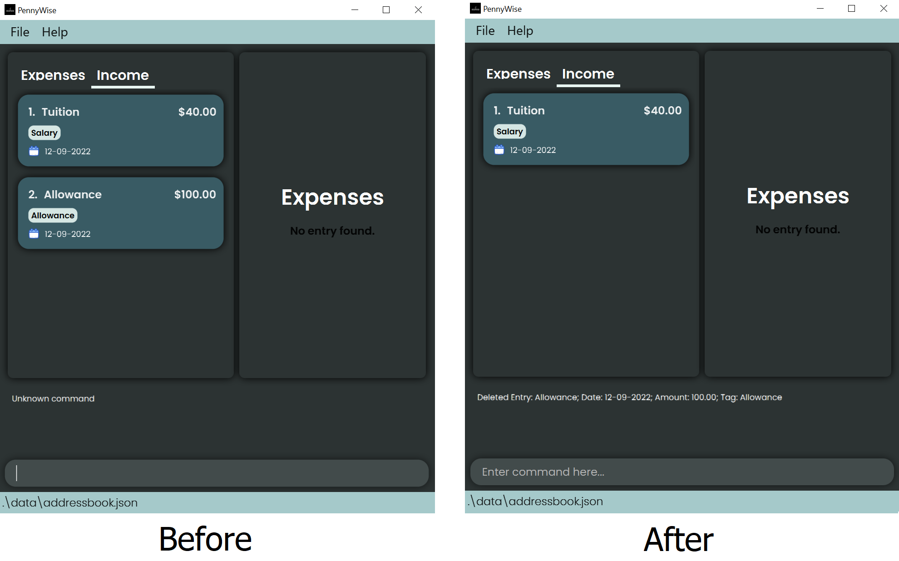

### Editing entries : `edit INDEX_OF_ENTRY t/ENTRY_TYPE [d/EDITED_DESCRIPTION a/EDITED_AMOUNT da/EDITED_DATE c/EDITED_CATEGORY]`
Edits an entry, at least **1** of the optional fields must be present.

1. Edits expenditure with specified fields
   * Example: `edit 1 t/e d/ChickenRice`
   * The expenditure at index 1 will have its description edited  
   Expected: `Edited Entry: ChickenRice; Date: 21-10-2022; Amount: 4.20; Tag: Food`
   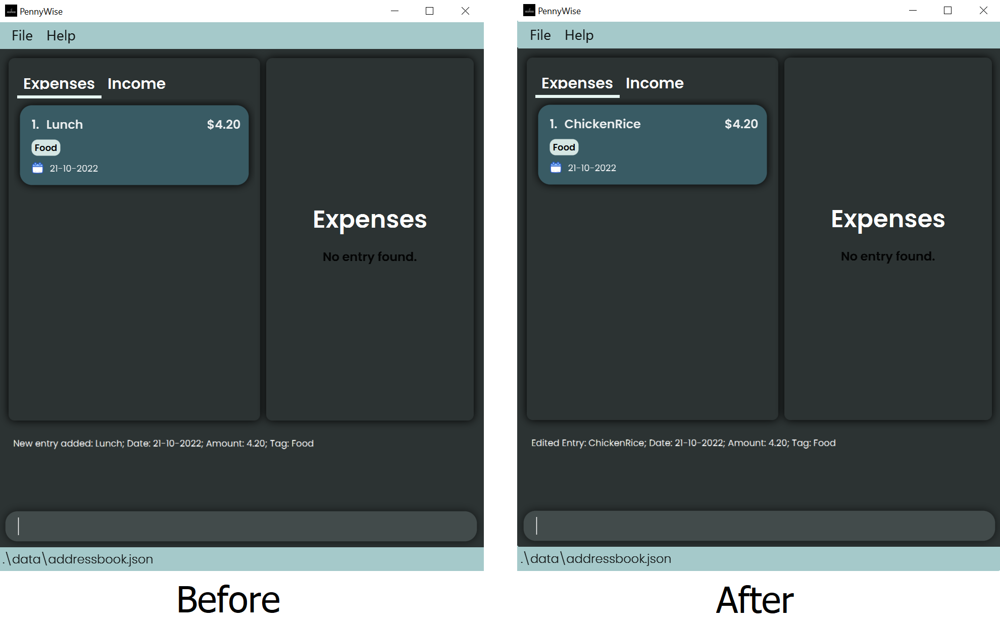
1. Edits income with specified fields
   * Example: `edit 2 t/i a/150.00 da/22-10-2022`
   * The income at index 2 will have its amount and date edited  
   Expected: `Edited Entry: CafeSalary; Date: 22-10-2022; Amount: 150.00; Tag: Salary`
   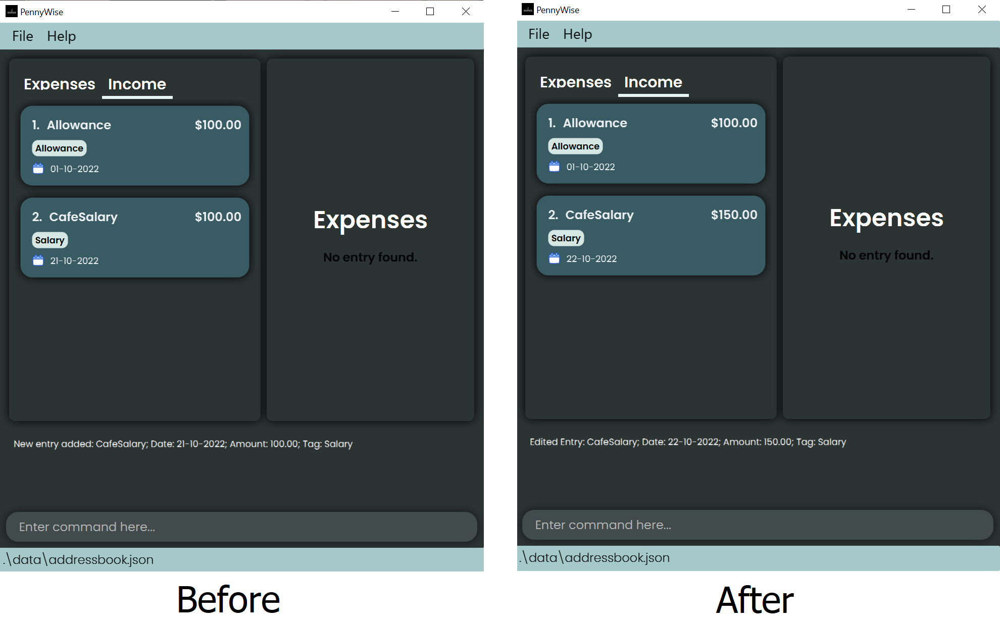

:bulb: **Tip:**
The default date is the current date on your computer!

### Summary of entries : `summary [mo/MONTH]`

1. Summary of all entries in the currently shown list
   * Examples: `summary`
     * Expected:  
       <pre>
       Financials Summarized
       Total Expenditure: 154.49
       Total Income: 250.00
       Total Balance: 95.51
       </pre>
     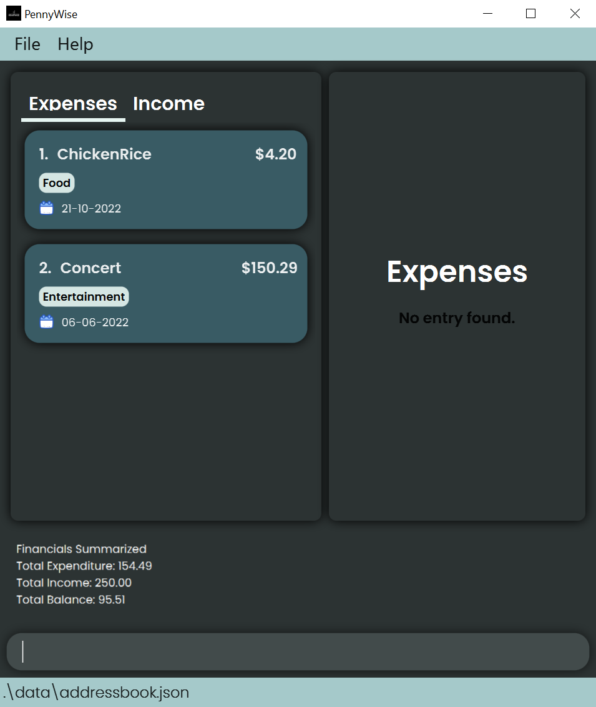
2. Summary of all entries the specified month
    * Examples: `summary mo/2022-10`
    * Expected:  
      <pre>
      Financials Summarized
      Total Expenditure: 4.20
      Total Income: 250.00
      Total Balance: 245.80
      </pre>
    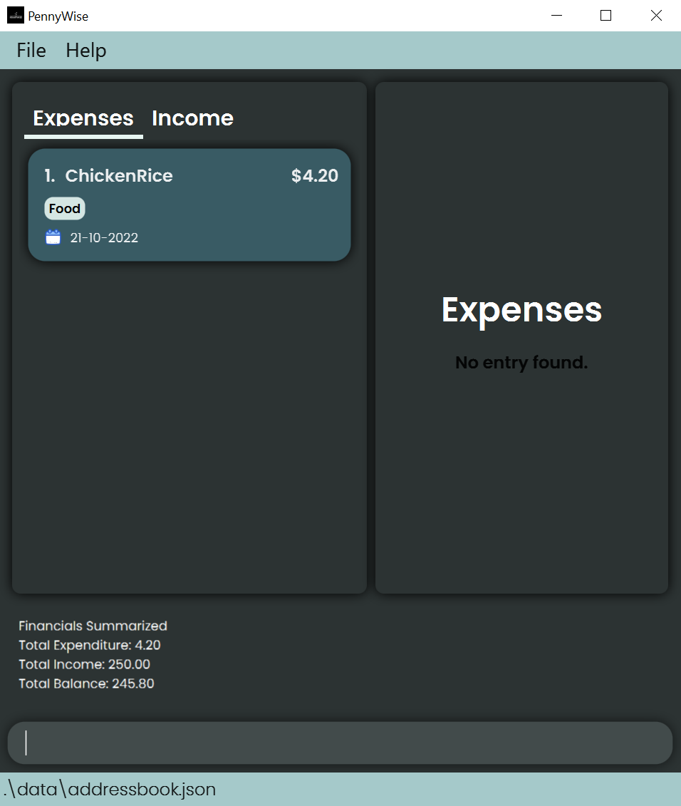

* Provides a financial summary recorded by the user in a month. The month refers to the month that is displayed to the user.
* The `MONTH` field is optional, if no month is specified, the application displays the summary for all entries.

### View entries by category : `view t/ENTRY_TYPE`

1. View a PieChart of all expenditures by categories
    * Examples: `view t/e`  
   Expected: `Show graphically all expenditure by category` and a PieChart on the right of the application
   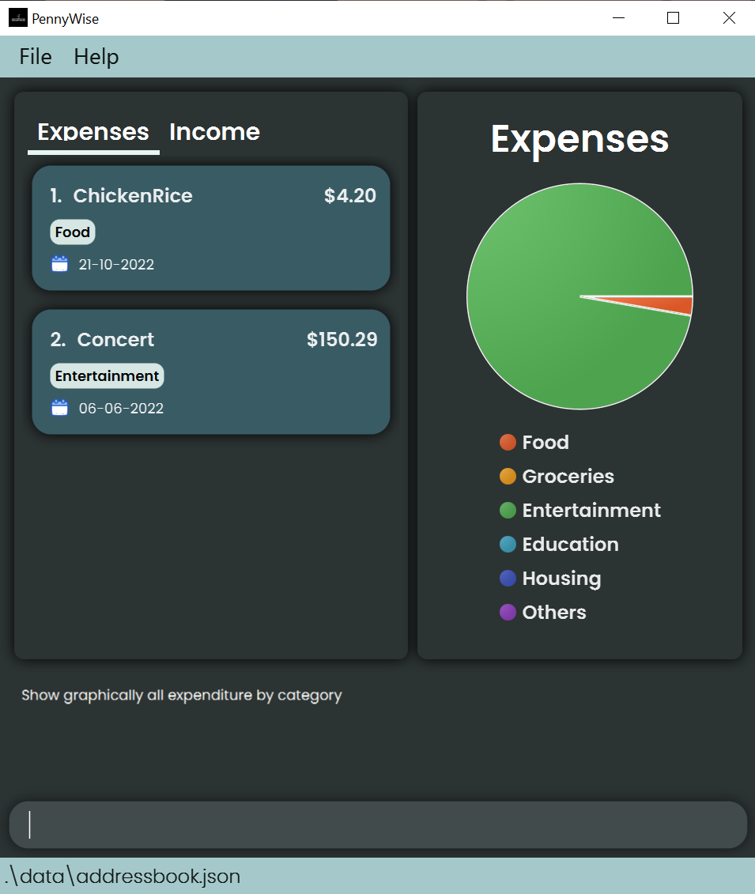
1. View a PieChart of all incomes by categories
   * Examples: `view t/i`  
   Expected: `Show graphically all income by category` and a PieChart on the right of the application
   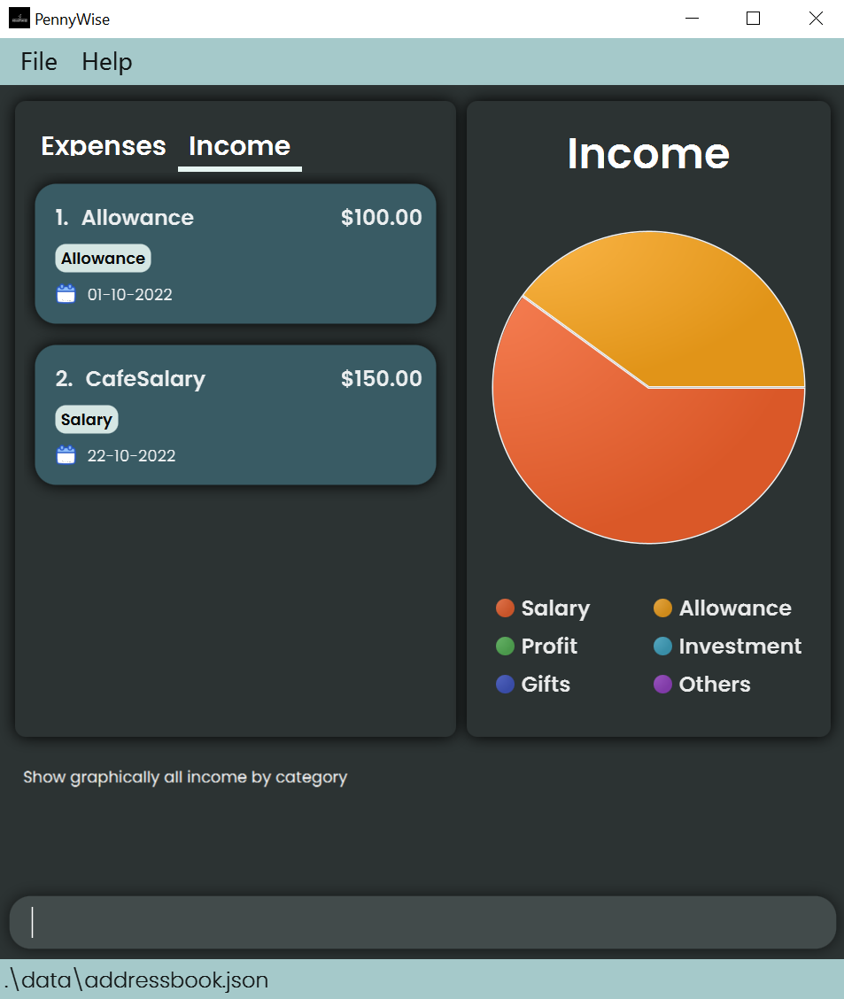

### View entries by month : `view t/ENTRY_TYPE mo/MONTH`
1. View a LineGraph of all expenditures in a specified month
   * Examples: `view t/e mo/2022-10`  
   Expected: `Show graphically all expenditure by month` and a LineGraph on the right of the application
   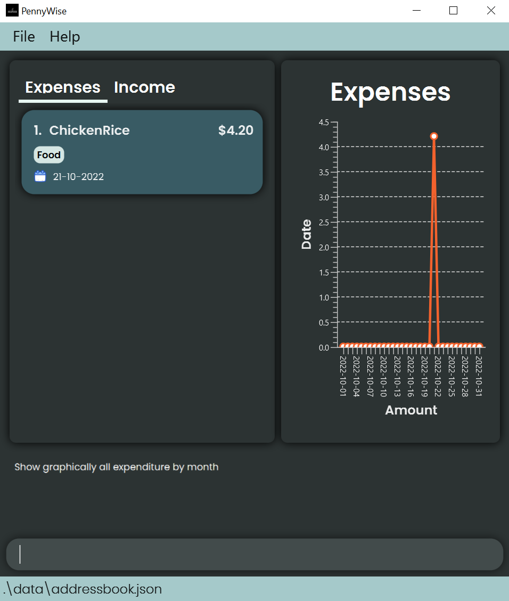
1. View a LineGraph of all incomes in a specified month
   * Examples: `view t/i mo/2022-10`  
   Expected: `Show graphically all income by month` and a LineGraph on the right of the application
   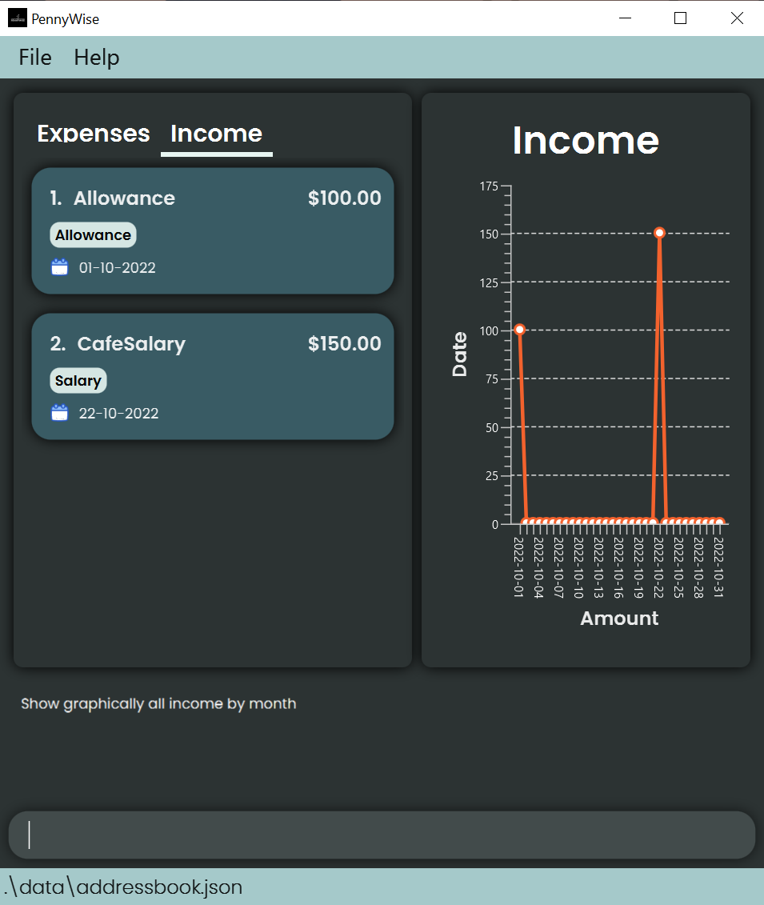

* View all entries recorded by the user in a month. The month refers to the month that is displayed to the user.
* The `MONTH` field is optional. If a month is specified, the entry details for the corresponding month is shown, accompanied by a LineGraph on the right of the application. If no month is specified, the application displays an error.

### Clearing all entries : `clear`

Clears all entries in PennyWise.

Format: `clear`

### Exiting the program : `exit`

Exits the program.

Format: `exit`

### Saving the data

PennyWise data are saved in the hard disk automatically after any command that changes the data. There is no need to save manually.

### Editing the data file

PennyWise data are saved as a JSON file `[JAR file location]/data/pennywise.json`. Advanced users are welcome to update data directly by editing that data file.

:exclamation: **Caution:**
If your changes to the data file makes its format invalid, PennyWise will discard all data and start with an empty data file at the next run.

---

## FAQ

**Q**: How do I transfer my data to another Computer?
**A**: Install the app in the other computer and overwrite the empty data file it creates with the file that contains
the data of your previous PennyWise home folder.

---

## Command summary

| Action              | Format, Examples                                                                                                                                        |
|---------------------|---------------------------------------------------------------------------------------------------------------------------------------------------------|
| **Add**             | `add t/ENTRY_TYPE d/DESCRIPTION a/AMOUNT da/DATE c/CATEGORY`   e.g. `add t/e d/Lunch a/15.60 da/10-10-2022 c/Food`                                   |
| **Delete**          | `del INDEX_OF_ENTRY t/ENTRY_TYPE`   e.g. `del 2 t/e`                                                                                                 |
| **Edit**            | `edit INDEX_OF_ENTRY t/ENTRY_TYPE [d/EDITED_DESCRIPTION a/EDITED_AMOUNT da/EDITED_DATE c/EDITED_CATEGORY]`  e.g. `edit 2 t/i a/150.00 da/22-10-2022` |
| **Summary**         | `summary [mo/MONTH]`  e.g. `summary mo/2022-09`                                                                                                      |
| **View (Category)** | `view t/ENTRY_TYPE`   e.g. `view t/e`                                                                                                                |
| **View (Month)**    | `view t/ENTRY_TYPE mo/MONTH`   e.g. `view t/i mo/2022-10`                                                                                            |
| **Clear**           | `clear`                                                                                                                                                 |
| **Exit**            | `exit`                                                                                                                                                  |
