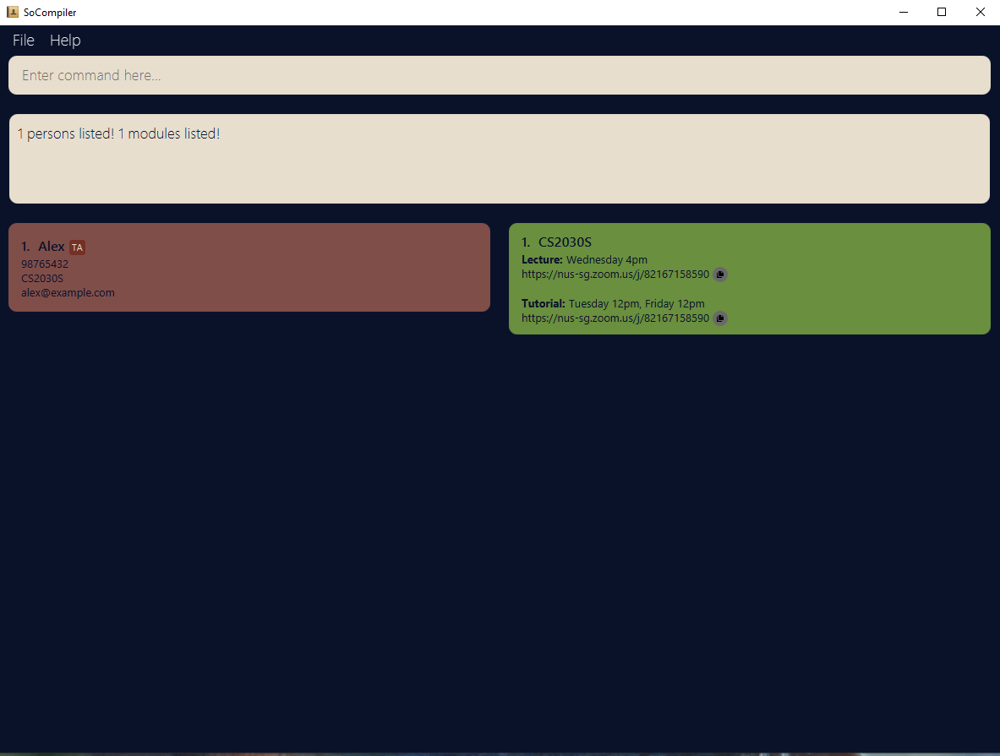
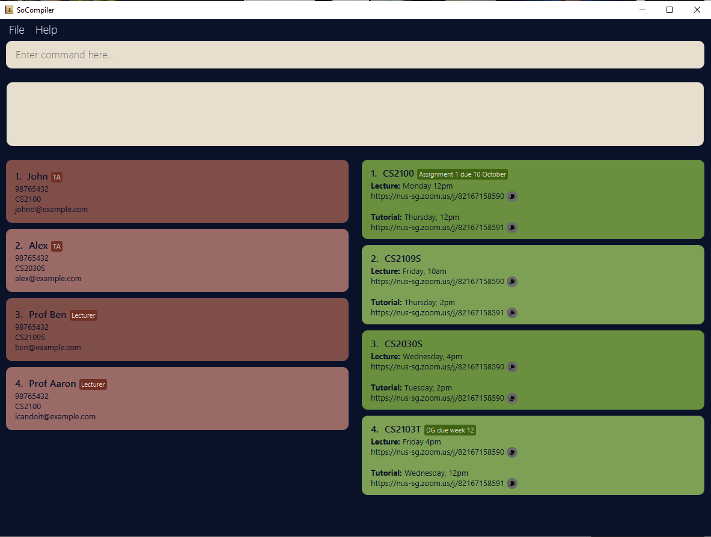
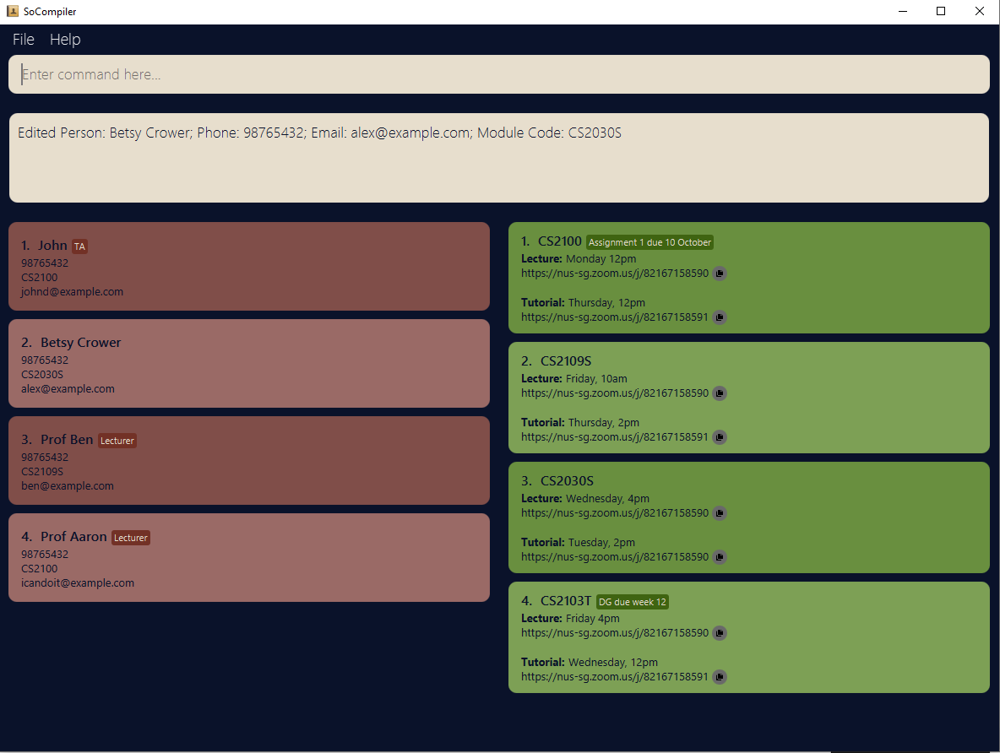
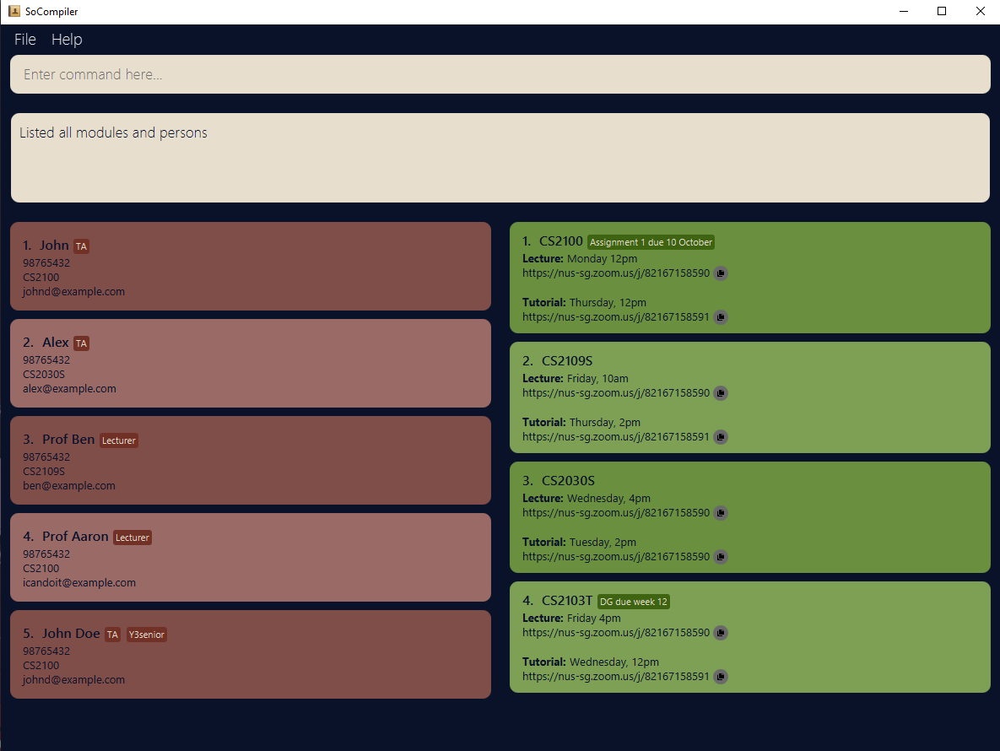
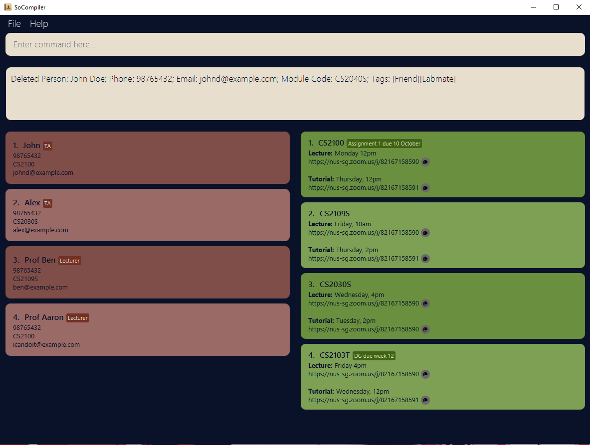

# Welcome to SoCompiler's User Guide

> The sole app that university students will need to streamline their everyday routines.

SoCompiler is a **desktop app for managing contacts and module details, optimized for use via a Command Line
Interface** (CLI) while still having the benefits of a Graphical User Interface (GUI). If you can type fast, SOCompiler
can get your contact and module management tasks done faster than traditional GUI apps.

You can add modules to the app, allowing you to store important information like the location, time and zoom links of your lectures and tutorials.

You can also add people to the app, such as your professors, teaching assistants or just friends, allowing you store their email address, phone numbers, telegram handles and which modules they are from.

--------------------------------------------------------------------------------------------------------------------

## Table of Contents

- [Overview](#welcome-to-socompilers-user-guide)
- [Quick Start](#quick-start)
- [Things to note](#things-to-note)
- [Person Fields](#person-fields)
    - [Name](#name)
    - [Phone number](#phone-number)
    - [Module code](#module-code)
    - [Email address](#email-address)
    - [Telegram handle](#telegram-handle)
    - [Person tags](#person-tags)
- [Module Fields](#module-fields)
    - [Module Code](#module-code)
    - [Lecture Details](#lecture-details)
    - [Lecture Zoom Link](#lecture-zoom-link)
    - [Tutorial Details](#tutorial-details)
    - [Tutorial Zoom Link](#tutorial-zoom-link)
    - [Assignment Details](#assignment-details)
- [Commands](#commands)
    - [General Commands](#for-both-modules-and-contacts)
        - [List](#listing-all-modules-and-contacts-list)
        - [Find](#finding-keywords-in-contacts-andor-modules-find)
        - [Clear](#clearing-all-contacts-and-modules-clear)
        - [Help](#looking-for-help-help)
        - [Exit](#exiting-the-program-exit)
    - [Commands for Contacts](#contacts)
        - [Add](#adding-a-contact-addp)
        - [Edit](#editing-a-contact-editp)
        - [Delete](#deleting-a-contact-deletep)
        - [Find](#finding-a-contact-findp)
    - [Commands for Modules](#modules)
        - [Add](#adding-a-module-addm)
        - [Edit](#editing-a-module-editm)
        - [Delete](#deleting-a-module-deletem)
        - [Find](#finding-a-module-findm)
- [Command Summary](#command-summary)
- [FAQ](#faq)
- [Glossary](#glossary)

## Quick start

1. Ensure you have Java `11` or above installed on your Computer.

* You can get Java 11 from [here](https://www.oracle.com/java/technologies/downloads/#java11), make sure to download the correct version for your operating system, and follow their instructions.

2. Download the latest `SoCompiler.jar` from [here](https://github.com/AY2223S1-CS2103T-W12-1/tp/releases).

3. Move the downloaded file to the folder you want to use as the _home folder_ for your SoCompiler. For example, you can just move it to your Desktop for ease of access.

4. Double-click the file to start the app. The GUI similar to the one below should appear in a few seconds. Note how the app
   contains some sample data. 

   

5. Type the command in the command box and press Enter to execute it.

6. Refer to the [Command Summary](#command-summary) below for details of each command.

--------------------------------------------------------------------------------------------------------------------

## Things to note

**:information_source: Notes about the command format:** 

* Words in `UPPER_CASE` are the parameters to be supplied by you. 
  e.g. for add `n/NAME`, NAME is the parameter and can be replaced with John Doe.

* Items in square brackets are optional. 
  e.g. `n/NAME [/t TAG]` can be used as `n/John Doe t/friend` or as `n/John Doe`.

* Parameters after the name and module code can be in any order. e.g. `addp n/NAME p/PHONE_NUMBER e/EMAIL` is similar
  to `addp n/NAME e/EMAIL p/PHONE_NUMBER`.

* If a parameter is expected only once in the command but is specified multiple times, only the last occurrence of the
  parameter will be taken. 
  e.g. if you specify `p/12341234 p/56785678`, only `p/56785678` will be taken.

--------------------------------------------------------------------------------------------------------------------

# Commands

## For both modules and contacts

### Listing all modules and contacts: `list`

Displays all modules and contacts stored in the app.

Format: `list`

### Finding keywords in contacts and/or modules: `find`

Finds modules and contacts with any of the given keywords.

Fields that you can filter for modules:

* [Module code](#module-code)
* [Lecture details](#lecture-details)
* [Tutorial details](#tutorial-details)
* [Assignment details](#assignment-details)

Fields that you can filter for contacts:

* [Person name](#name)
* [Phone number](#phone-number)
* [Module code](#module-code)
* [Email address](#email-address)
* [Telegram handle](#telegram-handle)
* [Person tags](#person-tags)

Format: `find KEYWORD [MORE_KEYWORDS]…​`

* The search is case-insensitive; e.g. `cs2030s` will match `CS2030S`, or `Cs2030s`.
* The order of the keywords does not matter; e.g. `Friday 10am` will match `10am Friday`.
* Only full words will be matched; e.g. `Cs2030` will not match `Cs2030S`.
* Full words are characterized by having a space before and after the word; eg. Searching `Friday` will only match `Friday` and not `Friday,`
* Modules matching at least one keyword will be returned (i.e. `OR` search); e.g. `Friday` will return all modules that have lectures or tutorials on `Friday`.

Examples:

* `find CS2030S` returns `cs2030s`
* `find Friday` returns `CS2100` and `CS2103T`, assuming both modules have lectures or tutorials on Friday.

The result from finding `CS2030s`:

### Clearing all contacts and modules: `clear`

Clears all entries from both the contact and module list.

Format: `clear`

### Looking for help: `help`

Opens a window that provides a link to the user guide.

Format: `help`

 **Tip:** 
You can access this window by clicking the File button on the top left of the app, followed by Help. Or you can just press F1!

### Exiting the program: `exit`

Exits the program.

Format: `exit`

 **Tip:** 
Alternatively, you can click the File button on the top left of the app, followed by the Exit button!

### Saving the data

SoCompiler data are saved in the hard disk automatically after any command that changes the data. There is no need to save manually.

--------------------------------------------------------------------------------------------------------------------

## Contacts

### Adding a contact: `addp`

Adds a contact to the contact list.

Format: `addp n/NAME [p/PHONE_NUMBER] [e/EMAIL] [tg/TELEGRAM] [m/MODULE_CODE] [t/TAG]…​`

* The `NAME` field is mandatory, all other fields are optional ([you can check here for more details on the individual fields](#person-fields)), attempting to add a person without a name with result in an error!
* A contact can have any number of tags (including 0)

 **Tip:**
You can add the name first and leave other fields blank. Other fields can be added later using the editp command! 

Examples:

* `addp n/John Doe p/98765432 e/johnd@example.com tg/@johndoe m/CS2040S t/Labmate t/Friend`
* `addp t/Family p/95647581 e/jessie@example.com tg/@jessica n/Jessica Lim`
* `addp n/BobMcGhee`

### Editing a contact: `editp`

Edits an existing contact in the contact list.

Format: `editp INDEX [n/NAME] [p/PHONE] [e/EMAIL] [tg/TELEGRAM] [m/MODULE_CODE] [t/TAG]…​`

* Edits the contact at the specified `INDEX`. The index refers to the index number shown in the displayed contact list.
  The index **must be a positive integer** 1, 2, 3, …​
* At least one of the optional fields must be provided.
* Existing values will be updated to the input values.
* When editing tags, the existing tags of the contact will be removed i.e. adding of tags is not cumulative.
* You can remove all the contact’s tags by typing `t/` without specifying any tags after it.

Examples:

* `editp 1 p/91234567 e/johndoe@example.com` Edits the phone number and email address of the 1st contact to be `91234567`
  and `johndoe@example.com` respectively.
* `editp 2 n/Betsy Crower t/` Edits the name of the 2nd contact to be `Betsy Crower` and clears all existing tags.

Before edit:

After edit:

### Deleting a contact: `deletep`

Deletes the specified contact from the contact list.

Format: `deletep CONTACT_INDEX`

* Deletes the contact at the specified `CONTACT_INDEX`.
* The contact index refers to the index number shown in the displayed contact list.
* The index **must be a positive integer** 1, 2, 3, …​

Examples:

* `findp Betsy` followed by `deletep 1` deletes the 1st contact in the results of the `findp` command.
* `list` followed by `deletep 5` deletes the 5th contact in the address book.

Before delete:

After delete:

### Finding a contact: `findp`

Find contacts with given keywords.

Fields that you can filter for contacts:

* Person name
* Handphone number
* Module code
* Email address
* Telegram handle
* Person tags

Format: `findp KEYWORD [MORE_KEYWORD]…​`

* The search is case-insensitive; e.g. `alex` will match `Alex`, or `ALEX`.
* The order of the keywords does not matter; e.g. `Bob McGhee` will match `McGhee Bob`.
* Only full words will be matched; e.g. `ale` will not match `alex`.
* Full words are characterized by having a space before and after the word; eg. Searching `Alex` will only match `Alex` and not `Alex-`
* Contacts matching at least one keyword will be returned (i.e. `OR` search); e.g. `mcghee broad` will return `Bob McGhee` and `Seaward Broad`.

Examples:

* `findp bob jessica` returns `Bob McGhee` and `Jessica Lim`

--------------------------------------------------------------------------------------------------------------------

## Modules

### Adding a module: `addm`

Adds a module to the module list.

Format: `addm m/MODULE_CODE [l/LECTURE_DETAILS] [t/TUTORIAL_DETAILS] [lz/LECTURE_ZOOM_LINK] [tz/TUTORIAL_ZOOM_LINK] [a/ASSIGNMENT_DETAILS]…​`

* The `MODULE_CODE` field is mandatory, all other fields are optional ([you can check here for more details on the individual fields](#module-fields)), attempting to add a module without a module code with result in an error!
* The `AssignmentDetails` can take in alphanumerical characters **along with spaces**.
* A module can have any number of `AssignmentDetails` (including 0)

 **Tip:** 
You can add the module code first and leave other fields blank. Other fields can be added later using the editm command! 

Examples:

* `addm m/CS2103T l/I3-AUDI Friday 16:00 - 18:00 lz/https://nus-sg.zoom.us/CS2103T_lecture t/COM1 B1-103 Wednesday 12:00 - 13:00 tz/https://nus-sg.zoom.us/CS2103T_tutorial a/Independent Project a/Team Project`
* `addm l/Every Monday t/Every Tuesday m/CS1231S`
* `addm m/CS2030S`

### Editing a module: `editm`

Edits an existing module in the module list.

Format: `editm INDEX [m/MODULE_CODE] [l/LECTURE_DETAILS] [t/TUTORIAL_DETAILS] [lz/LECTURE_ZOOM_LINK] [tz/TUTORIAL_ZOOM_LINK] [a/ASSIGNMENT_DETAILS]…​`

* Edits the module at the specified `INDEX`. The index refers to the index number shown in the displayed module list.
  The index **must be a positive integer** 1, 2, 3, …​
* At least one of the optional fields must be provided.
* Existing values will be updated to the input values.
* When editing assignment details, the existing assignment details of the module will be removed
  i.e adding of assignment details are not cumulative.
* You can remove all the module’s assignment details by typing `a/` without specifying any assignment details after it.

Examples:

* `editm 1 l/Every Friday a/Functional Expressionism` Edits the lecture details and assignment details of the 1st module to be `Every Friday`
  and `Functional Expressionism` respectively.
* `editm 2 m/MA1521 a/` Edits the module code of the 2nd module to be `MA1521` and clears all existing assignment details.

### Deleting a module: `deletem`

Deletes the specified module from the module list.

Format: `deletem MODULE_INDEX`

* Deletes the contact at the specified `MODULE_INDEX`.
* The module index refers to the index number shown in the displayed module list.
* The index **must be a positive integer** 1, 2, 3, …​

Examples:

* `list` followed by `deletem 2` deletes the 2nd module in the address book.
* `find CS2030S` followed by `deletem 1` deletes the CS2030S module.

### Finding a module: `findm`

Find modules with given keyword.

Fields that you can filter for modules:

* Module code
* Lecture details
* Tutorial details
* Assignment details

Format: `findm KEYWORD [MORE_KEYWORD]…​`

* The search is case-insensitive; e.g. `cs2030s` will match `CS2030S`, or `Cs2030s`.
* The order of the keywords does not matter; e.g. `cs2100 cs2109s` will match `cs2109s cs2100`.
* Any field associated with the module can be found using this command.
* Only full words will be matched; e.g. `Cs2030` will not match `Cs2030S`.
* Full words are characterized by having an empty space before and after the word; e.g. Searching `Friday` will only match `Friday` and not `Friday,`
* Modules matching at least one keyword will be returned (i.e. `OR` search); e.g. `cs2109s cs2100` will return `CS2109s` and `CS2100`.

------------------------------------------------------------------------------------------------------------------------

## Person Fields

| Field Type      | Field Description                         | Identifier | Restrictions (if any)                                                                                                                                                                                                                                                                                                                                                                                                                                                                                       |
|-----------------|-------------------------------------------|------------|-------------------------------------------------------------------------------------------------------------------------------------------------------------------------------------------------------------------------------------------------------------------------------------------------------------------------------------------------------------------------------------------------------------------------------------------------------------------------------------------------------------|
| Name            | A person's name                           | n/         | Should only contain alphanumeric characters                                                                                                                                                                                                                                                                                                                                                                                                                                                                 |           
| Phone Number    | A person's phone number                   | p/         | Should only contain numbers and be at least 3 digits long                                                                                                                                                                                                                                                                                                                                                                                                                                                   |           
| Module Code     | The module code a person is associated to | m/         |                                                                                                                                                                                                                                                                                                                                                                                                                                                                                                             |           
| Email Address   | A person's email address                  | e/         | Should follow the format `local-part@domain`, where:<ol><li>`local-part` should only contain [alphanumeric](#alphanumeric) characters and the following characters: `+` `_` `.` `-` .<li>`domain` consists of two `domain labels` seperated by a `.`<ul><li> The second `domain label` should be at least 2 characters long.<li>`domain label` should start and end with alphanumeric characters.<li>Each `domain label` should only consist of alphanumeric characters, separated by hyphens if necessary. |
| Telegram Handle | A person's telegram                       | tg/        | <ol><li>Should begin with `@` and contain only alphanumeric characters<li>Should be at least 5 characters long, excluding the `@`                                                                                                                                                                                                                                                                                                                                                                           |           
| Tags            | A person's tag                            | t/         |                                                                                                                                                                                                                                                                                                                                                                                                                                                                                                             |           

### Name

* The name of the person you want to add.
* Identified by prefix `n/`.
* Valid field to be searched using `Find` command.
* No restriction but you are recommended to add a person's full name to be it less ambigious during search.
* Mandatory field.

### Phone number

* The phone number of the person.
* Identified by prefix `p/`.
* Valid field to be searched using `Find` command.
* A Phone number should only contain numbers and be at least 3 digits long.
* Optional field.

### Module code

* The module this person is associated to, i.e. if he/she is a Professor or Teaching Assistant, it means the Module he/she is teaching.
* Identified by prefix `m/`.
* Valid field to be searched using `Find` command.
* No restriction on what you can add as module code.
* Optional field.

### Email address

* The email address of the person.
* Identified by prefix `e/`.
* Valid field to be searched using `Find` command.
* It should follow the following format: `local-part@domain`
    1. The `local-part` should only contain [alphanumeric](#alphanumeric) characters and the following characters: `+` `_` `.` `-` .
    2. This is followed by a `domain name` which is made of `domain labels` separated by periods. The `domain name` must:
    1. end with a `domain label` at least 2 characters long.
    2. have each `domain label` start and end with alphanumeric characters.
    3. have each `domain label` consist of alphanumeric characters only, separated by hyphens, if any.
* Optional field.

### Telegram handle

* The telegram handle of the person.
* Identified by prefix `tg/`.
* Valid field to be searched using `Find` command.
* Handle should start with a `@` symbol and only contain alphanumeric characters after `@`. It should be at least 5 characters long, not including `@`.
* Optional field.

### Tags

* Tags you want to attach to the person, i.e. Friend, Professor, Family
* You can include as many tags as you want.
* Identified by prefix `t/`.
* Valid field to be searched using `Find` command.
* No restriction on what you can add.
* Optional field.

--------------------------------------------------------------------------------------------------------------------

## Module Fields

| Field Type                    | Field Description                                 | Identifier | Restrictions (if any)                                                                                                                                                                                                                                                                                                                                                                                                                                                                              |
|-------------------------------|---------------------------------------------------|------------|----------------------------------------------------------------------------------------------------------------------------------------------------------------------------------------------------------------------------------------------------------------------------------------------------------------------------------------------------------------------------------------------------------------------------------------------------------------------------------------------------|
| Module Code                   | Module code of a module                           | m/         | Must be a valid NUS module                                                                                                                                                                                                                                                                                                                                                                                                                                                                         |           
| Lecture Details               | Details of a lecture, e.g. location and time      | l/         |                                                                                                                                                                                                                                                                                                                                                                                                                                                                                                    |           
| Lecture Zoom Link             | Zoom link of a lecture                            | lz/        | Must be a valid [URL](#url) which begins with https://                                                                                                                                                                                                                                                                                                                                                                                                                                             |           
| Tutorial Details              | Details of a tutorial, e.g. location and time     | t/         |                                                                                                                                                                                                                                                                                                                                                                                                                                                                                                    |          
| Tutorial Zoom Link            | Zoom link of a tutorial                           | tz/        | Must be a valid [URL](#url) which begins with https://                                                                                                                                                                                                                                                                                                                                                                                                                                             |           
| Assignment Details            | Details of an assignment, e.g. title and due date | a/         |                                                                                                                                                                                                                                                                                                                                                                                                                                                                                                    |     

### Module Code

* The module code of the module you want to add.
* Identified by prefix `m/`.
* Valid field to be searched using `Find` command.
* Only valid NUS module codes can be added.
* Mandatory field.

### Lecture Details

* The lecture details of the module you want to add, such as the location and time.
* Identified by prefix `l/`.
* Valid field to be searched using `Find` command.
* No restriction on what you can add.
* Optional field.

### Lecture Zoom Link

* The zoom link of the lecture.
* Identified by prefix `lz/`.
* Zoom link should be a valid [URL](#url).
* Optional field.

### Tutorial Details

* The tutorial details of the module you want to add, such as the location and time.
* Identified by prefix `t/`.
* Valid field to be searched using `Find` command.
* No restriction on what you can add.
* Optional field.

### Tutorial Zoom Link

* The zoom link of the lecture.
* Identified by prefix `tz/`.
* Zoom link should be a valid URL.
* Optional field.

### Assignment Details

* Details you want to add for your assignments for the module, ie. `Assignment 1 due 20/08`.
* You can include as assignment details as you want.
* Identified by prefix `a/`.
* Valid field to be searched using `Find` command.
* No restriction on what you can add.
* Optional field.

--------------------------------------------------------------------------------------------------------------------

## Command summary

| Command                                                   | Module/Contact | Format                                                                                                                                         |
|-----------------------------------------------------------|----------------|------------------------------------------------------------------------------------------------------------------------------------------------|
| [addm](#adding-a-module-addm)                             | Module         | `addm m/MODULE_CODE [l/LECTURE_DETAILS] [t/TUTORIAL_DETAILS] [lz/LECTURE_ZOOM_LINK] [tz/TUTORIAL_ZOOM_LINK] [a/ASSIGNMENT_DETAILS]…​`          |
| [addp](#adding-a-contact-addp)                            | Contact        | `addp n/NAME [p/PHONE_NUMBER] [e/EMAIL] [m/MODULE_CODE] [t/TAG]…​`                                                                             |
| [editm](#editing-a-module-editm)                          | Module         | `editm INDEX [m/MODULE_CODE] [l/LECTURE_DETAILS] [t/TUTORIAL_DETAILS] [lz/LECTURE_ZOOM_LINK] [tz/TUTORIAL_ZOOM_LINK] [a/ASSIGNMENT_DETAILS]…​` |
| [editp](#editing-a-contact-editp)                         | Contact        | `editp INDEX [n/NAME] [p/PHONE] [e/EMAIL] [m/MODULE_CODE] [t/TAG]…​`                                                                           |
| [deletem](#deleting-a-module-deletem)                     | Module         | `deletem MODULE_INDEX`                                                                                                                         |
| [deletep](#deleting-a-contact-deletep)                    | Contact        | `deletep CONTACT_INDEX`                                                                                                                        |                                                                                                                                           |
| [findm](#finding-a-module-findm)                          | Module         | `findm KEYWORD [MORE_KEYWORD]…​`                                                                                                               |                                   
| [findp](#finding-a-contact-findp)                         | Contact        | `findp KEYWORD [MORE_KEYWORD]…​`                                                                                                               |                          
| [clear](#clearing-all-contacts-and-modules-clear)         | Both           | `clear`                                                                                                                                        |
| [list](#listing-all-modules-and-contacts-list)            | Both           | `list`                                                                                                                                         |
| [find](#finding-keywords-in-contacts-andor-modules-find)  | Both           | `find KEYWORD [MORE_KEYWORDS]`                                                                                                                 |
| [exit](#looking-for-help-help)                            | General        | `exit`                                                                                                                                         |
| [help](#exiting-the-program-exit)                         | General        | `help`                                                                                                                                         |

--------------------------------------------------------------------------------------------------------------------

## FAQ

**Q**: How do I transfer my data to another Computer? 
**A**:1. Install the app in the other computer.

2. Go to the location where your current app is in, there should be a file called `data` in the same location.
3. Copy the entire file and either email yourself the file or use a thumb-drive to transfer it to the other computer.
4. Move the copied file to the same location you placed the jar file in the new computer.

**Q**: What if my module has no zoom links? What if I don't have the contact number of my Teaching Assistant? 
**A**: When adding a Module, all fields except `MODULE_CODE` are optional. When adding a contact, all fields except
`NAME` are optional. These fields can be updated later with the
[editp](#editing-a-contact--editp) or [editm](#editing-a-module--editm) commands.

--------------------------------------------------------------------------------------------------------------------

## GLOSSARY

#### Alphanumeric

* It refers to the combined set of the 26 alphabetic characters 10 Arabic numerals.
* Alphabetic characters include both lower and upper case letters, a to z & A to Z.
* Arabic numerals refer to the digits 0 to 9.

#### URL

* It refers to the address of a web page.
* Example: https://google.com

--------------------------------------------------------------------------------------------------------------------
[Back to top](#welcome-to-socompilers-user-guide)
