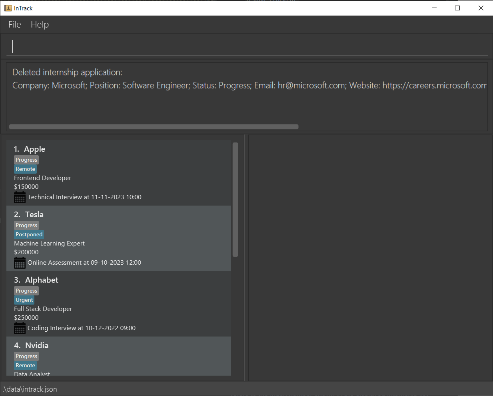
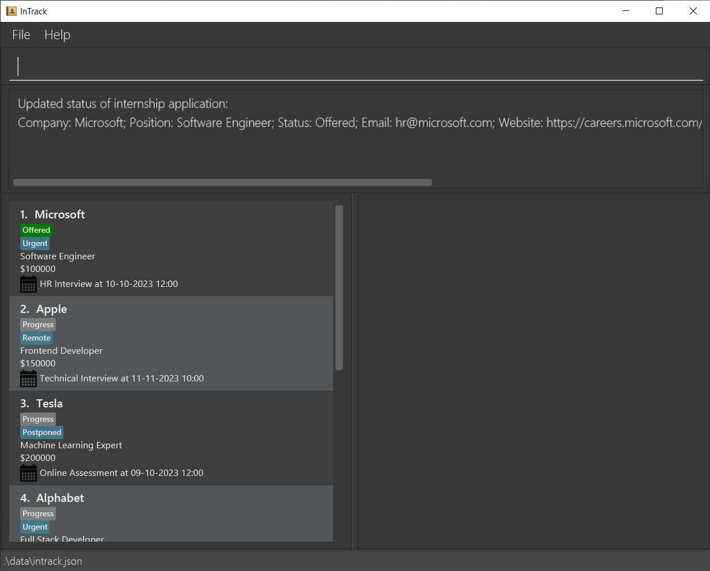
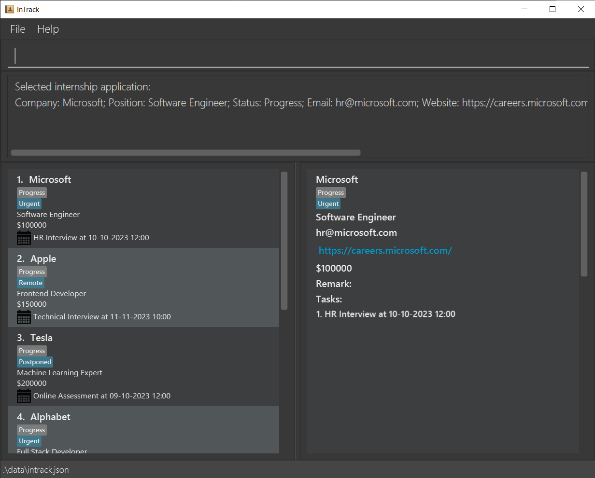
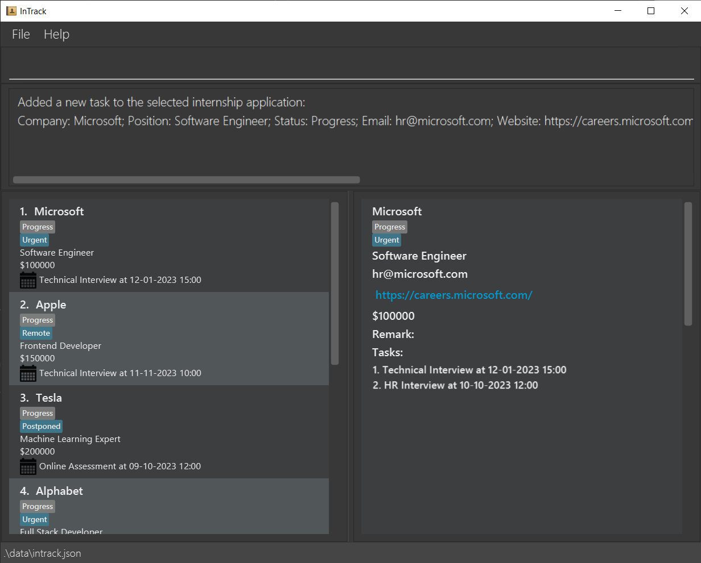
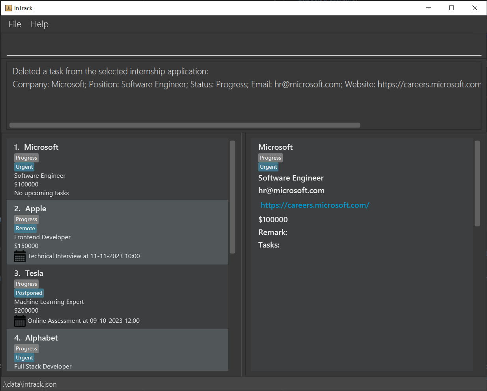

Welcome to InTrack!

InTrack is a desktop application for Computer Science students to manage their different internship applications.

InTrack allows users to

* seamlessly search for and update their various applications, as well as
* keep track of the relevant timings and deadlines

all through a simple and easy-to-use platform!

InTrack is optimized for use via a Command Line Interface (CLI) while still having the benefits of a Graphical User
Interface (GUI). If you're a Computer Science student who can type fast, InTrack can help you manage your
internship applications more efficiently and effectively than traditional GUI apps.

--------------------------------------------------------------------------------------------------------------------

# How to use this guide

First time using InTrack? We highly recommend reading this user guide in order. If you come across unfamiliar terms used
in this user guide, their definitions may be found in the [Glossary](#glossary).

Searching for information about specific features? You might find it helpful to navigate to the relevant sections via
the Table of Contents below for more detailed explanations of individual features.

Alternatively, consider looking at the [Command Summary](#command-summary) for a brief outline of all the commands.

* Table of Contents
{:toc}

--------------------------------------------------------------------------------------------------------------------

# Quick start

1. Ensure you have Java 11 or above installed in your Computer.

2. Download the latest `InTrack.jar` from [here](https://github.com/AY2223S1-CS2103T-T11-2/tp/releases).

3. Copy the file to the folder you want to use as the _home folder_ for InTrack.

4. Launch the app by double-clicking the file or by using the command `java -jar InTrack.jar` in your terminal. The GUI
   similar to the below should appear in a few seconds. Note how the app contains some sample data. 
   

5. Type the command in the command box and press Enter to execute it. e.g. typing **`help`** and pressing Enter will
   open the help window. 
   Some example commands you can try:

   * **`help`** : Opens the Help window, which contains a link to this User Guide, as well as a summary of all the
   commands InTrack provides.

   * **`list`** : Lists all internship applications.

   * **`add`**`c/Microsoft p/Software Engineer s/5000 e/hr@microsoft.com w/careers.microsoft.com t/Urgent` :
     Adds an internship application for `Software Engineer` at `Microsoft` to InTrack.

   * **`delete`**`1` : Deletes the first internship application displayed in InTrack.

   * **`exit`** : Exits InTrack.

6. Refer to the [Features](#features) below for details of each command.

--------------------------------------------------------------------------------------------------------------------

# Features

**:information_source: Notes about the command format:** 

* Words in `UPPER_CASE` are the parameters to be supplied by the user. 
  e.g. in `add p/POSITION`, `POSITION` is a parameter which can be used as `add p/Software Engineer`.

* Items in square brackets are optional. 
  e.g `w/WEBSITE [t/TAG]` can be used as `w/careers.microsoft.com t/Urgent` or as `w/careers.microsoft.com`.

* Items with `…` after them can be used multiple times including zero times. 
  e.g. `[t/TAG]…​` can be used as ` ` (i.e. 0 times), `t/Urgent`, `t/Urgent t/Remote` etc.

* If a parameter is expected only once in the command, but is specified multiple times, only the last occurrence of
  the parameter will be taken. 
  e.g. if the command specifies `c/Microsoft c/Apple`, it will be interpreted as `c/Apple`.

* Extraneous parameters for commands that do not take in parameters (such as `help` and `list`) will be ignored. 
  e.g. if the command specifies `help 123`, it will be interpreted as `help`.

## General Features

### Viewing help: `help`

If you're a little stuck, entering this command opens a Help window with a link to this User Guide, as well as a summary
of all the commands InTrack provides.

Format: `help`

### Viewing statistics of internship applications: `stats`

Displays statistics of the current list of internship applications based on the number of offered, in-progress and
rejected applications.

Format: `stats`

### Exiting the program: `exit`

If you're done and would like to close InTrack, you can do so by entering the `exit` command.

Format: `exit`

### Saving the data

InTrack data is saved in the hard disk automatically after any command that changes the data.
There is no need to save manually.

## Internship Application Management

### Adding an internship application: `add`

Adds a new internship application to InTrack.

Format: `add c/COMPANY p/POSITION e/EMAIL w/WEBSITE s/SALARY [t/TAG]…`

| Parameter  | Representation                               | Constraints                                                                   |
|------------|----------------------------------------------|-------------------------------------------------------------------------------|
| `COMPANY`  | Company that is offering the internship      | Must contain only alphanumeric characters and spaces, and should not be blank |
| `POSITION` | Position of the internship                   | Must not be blank                                                             |
| `EMAIL`    | Email of the hiring team                     | Must be of the format local-part@domain                                       |
| `WEBSITE`  | Website containing details of the internship | Must be a valid URL                                                           |
| `SALARY `  | Salary of the position                       | Must contain only numbers                                                     |
| `TAG`      | Tag(s) of the internship application         | Must be one word and contain only alphanumeric characters                     |

:bulb: **Tip:** An internship can have any number of tags (including 0), and you can add multiple tags at once.

**:information_source: Note about duplicates:** 

An internship application can only be added if it does not currently exist in InTrack. Each internship application is
uniquely identified by its `COMPANY` and `POSITION` with no regards to case-sensitivity. 

Example: If an internship application with the parameters `c/Microsoft p/Software Engineer` already exists in InTrack,
a new one with `c/MICROSOFT p/Software Engineer` will be treated as a duplicate and will not be added.

**:information_source: Note regarding status:** 

By default, an added internship will have the status of in progress. To update this, you can make use of the
[`status` command](#updating-status-of-an-internship-application--status).

Examples of usage:

* `add c/Microsoft p/Software Engineer e/hr@microsoft.com w/https://careers.microsoft.com s/5000 t/Urgent`

* `add c/Apple p/Frontend Developer e/hr@apple.com w/https://www.apple.com/careers s/5000`

Expected outcome:

* Internship application information is added to InTrack and appears at the bottom of the displayed list.

### Deleting an internship application: `delete`

Deletes the internship application at the specified `INDEX` from InTrack.

Format: `delete INDEX`

| Parameter | Representation                                 | Constraints                                                                                    |
|-----------|------------------------------------------------|------------------------------------------------------------------------------------------------|
| `INDEX`   | The index of the target internship application | Must be a positive unsigned integer and must not exceed the size of the current displayed list |

Example of usage:

* `delete 1`

Expected outcome:

* The first internship application in InTrack is deleted.

Before deleting the internship application for `Software Engineer` at `Microsoft` at `INDEX` 1:

After deleting the internship application for `Software Engineer` at `Microsoft` previously at `INDEX` 1:

### Updating status of an internship application : `status`

Updates the status of the internship application at the specified `INDEX` in InTrack with 1 of 3 possible statuses:
`o` for `Offered`, `p` for `Progress` or `r` for `Rejected`.

Format: `status INDEX STATUS`

| Parameter | Representation                                 | Constraints                                                                                    |
|-----------|------------------------------------------------|------------------------------------------------------------------------------------------------|
| `INDEX`   | The index of the target internship application | Must be a positive unsigned integer and must not exceed the size of the current displayed list |
| `STATUS`  | The new status of the internship application   | Must be either `o`, `p`, `r` or their capitalised forms                                        |

Example of usage:

* `status 1 o`

Expected outcome:

* The status of the first internship application in InTrack is updated to `Offered`.

Before updating the status of the internship application at `INDEX` 1 to `Offered`:

After updating the status of the internship application at `INDEX` 1 to `Offered`:

### Adding a tag to an internship application : `addtag`

Adds one or more `Tag`s to the internship application at the specified `INDEX` in InTrack.

Format: `addtag INDEX TAG [MORE_TAGS]`

| Parameter | Representation                                    | Constraints                                                                                    |
|-----------|---------------------------------------------------|------------------------------------------------------------------------------------------------|
| `INDEX`   | The index of the target internship application    | Must be a positive unsigned integer and must not exceed the size of the current displayed list |
| `TAG`     | The tag to be added to the internship application | Must be one word and contain only alphanumeric characters                                      |

**:information_source: Note about `addtag`:** 

`TAG` is case-sensitive, so `urgent` and `Urgent` are considered as separate tags. If a tag already exists in an
internship application, duplicates of it will not be added.

If multiple `TAG`s are specified in an `addtag` command, duplicate `TAG`s will not be added while non-duplicate ones
will be added as per normal.

Example of usage:

* `addtag 1 Urgent`

Expected outcome:

* The `Urgent` tag will appear on the first internship application in InTrack.

### Deleting a tag from an internship application : `deltag`

Deletes one or more existing `Tag`s from the internship application at the specified `INDEX` in InTrack.

Format: `deltag INDEX TAG [MORE_TAGS]`

| Parameter | Representation                                        | Constraints                                                                                    |
|-----------|-------------------------------------------------------|------------------------------------------------------------------------------------------------|
| `INDEX`   | The index of the target internship application        | Must be a positive unsigned integer and must not exceed the size of the current displayed list |
| `TAG`     | The tag to be deleted from the internship application | Must be one word and contain only alphanumeric characters                                      |

Example of usage:

* `deltag 1 Urgent`

Expected outcome:

* The `Urgent` tag, if it exists, will be removed from the first internship application in InTrack.

### Selecting an internship application : `select`

Selects and shows the details of the internship application at the specified `INDEX`.

**:information_source: Note about `select`:** 

An internship application entry must be selected via the `select` command before the `edit`, `addtask`, `deltask`,
`mail` and `remark` commands can be used.

| Parameter | Representation                                        | Constraints                                                                                    |
|-----------|-------------------------------------------------------|------------------------------------------------------------------------------------------------|
| `INDEX`   | The index of the target internship application        | Must be a positive unsigned integer and must not exceed the size of the current displayed list |

Format: `select INDEX`

Example of usage:

* `select 1`

Expected outcome:

* The first internship application in InTrack is selected and its details are shown on the right panel.

Before selecting the internship application at `INDEX` 1:

After selecting the internship application at `INDEX` 1:

### Editing an internship application : `edit`

Edits the details of the currently selected internship application.

**:information_source: Before using `edit`:** 

Before an internship application can be edited, it must first be selected via the
[`select` command](#selecting-an-internship-application--select).

Format: `edit [c/NEW_COMPANY] [p/NEW_POSITION] [s/NEW_SALARY] [e/NEW_EMAIL] [w/NEW_WEBSITE] [t/NEW_TAG]...`

| Parameter  | Representation                               | Constraints                                                                   |
|------------|----------------------------------------------|-------------------------------------------------------------------------------|
| `COMPANY`  | Company that is offering the internship      | Must contain only alphanumeric characters and spaces, and should not be blank |
| `POSITION` | Position of the internship                   | Must not be blank                                                             |
| `SALARY `  | Salary of the position                       | Must contain only numbers                                                     |
| `EMAIL`    | Email of the hiring team                     | Must be of the format local-part@domain                                       |
| `WEBSITE`  | Website containing details of the internship | Must be a valid URL                                                           |
| `TAG`      | Tag(s) of the internship application         | Must be one word and contain only alphanumeric characters                     |

**:information_source: Note about `edit`:** 

At least one of the optional fields must be provided.

The status and remark of an internship application can only be edited via the
[`status` command](#updating-status-of-an-internship-application--status)
and [`remark` command](#adding-a-remark-to-an-internship-application--remark) respectively.

Examples of usage:

* `edit c/GOOGLE p/Data Analyst e/google@gmail.com w/https://google.com t/URGENT s/1000`

Expected outcome:

* Edits the fields of the selected entry to match that in the input, in that the name of the company changes to
  Google, the position changes to Data Analyst, the email changes to google@gmail.com, the website changes to
  https://google.com, the tags are changed to just URGENT and the salary changes to $1000.

Examples of usage:

* `edit p/SWE`

Expected outcome:

* Edits the position field of the selected entry to become SWE. All other details of the entry remain unchanged.

### Adding a task to a selected internship application : `addtask`

Adds a task to the currently selected internship application.

**:information_source: Before using `addtask`:** 

Before a task can be added to an internship application, the internship application must first be selected via the
[`select` command](#selecting-an-internship-application--select).

Format: `addtask TASK_NAME /at TASK_TIME`

| Parameter   | Representation                      | Constraints                                |
|-------------|-------------------------------------|--------------------------------------------|
| `TASK_NAME` | Name of the task to be added        | Can take any values, but must not be blank |
| `TASK_TIME` | The time that the task is due or at | Must be in the format `dd-MM-yyyy HH:mm`   |

Example of usage:

* `select 1` followed by `addtask Technical Interview /at 12-01-2023 15:00`

Expected outcome:

* The selected internship application is updated with the new task added in its task list.

Before adding a new task for `Technical Interview` at `12-01-2023 15:00` to the selected internship application:

After adding a new task for `Technical Interview` at `12-01-2023 15:00` to the selected internship application:

### Deleting a task from a selected internship application : `deltask`

Deletes the task at the specified `TASK_INDEX` in the task list of the currently selected internship application.

Format: `deltask TASK_INDEX`

| Parameter    | Significance                 | Constraints                                                                                         |
|--------------|------------------------------|-----------------------------------------------------------------------------------------------------|
| `TASK_INDEX` | The index of the target task | Must be a positive unsigned integer and must not exceed the size of the current displayed task list |

Examples of usage:

* `deltask 1`

Expected outcome:

* The first task of the selected internship application is deleted.

Before deleting the task at `TASK_INDEX` 1 in the selected internship application:

Before deleting the task previously at `TASK_INDEX` 1 in the selected internship application:

### Adding a remark to an internship application : `remark`

Adds a `remark` to the selected internship application.

**:information_source: Note about `remark`:** 

Before a remark can be added to an application or edited, the internship must first be selected via the
[`select` command](#selecting-an-internship-application--select).

Format: `remark r/[REMARK]`

:bulb: **Tip:** You can delete the existing remark by leaving the `REMARK` field empty.

Example of usage:

* `remark r/Revise graphs`

Expected outcome:

* The input remark `Revise graphs` will be added to the selected internship application in the remark section.

Example of usage:

* `remark r/`

Expected outcome:

* The remark section at the bottom of the selected internship application panel will be cleared.

### Sending an email to a company : `mail`

Launches the default mail app with the and prepares to send an email with the recipient set to the email address
registered to the selected internship.

**:information_source: Before using `addtask`:** 

Before this command can be used on an internship application, the internship application must first be selected via the
[`select` command](#selecting-an-internship-application--select).

Format: `mail`

* `mail` does not check if the email address is valid/correct and is the responsibility of the user.
* `mail` invokes the native desktop application of the default mail app.

## List Management

### Listing all internship applications : `list`

Shows a list of all internship applications in InTrack.

Format: `list`

### Clearing all internship applications : `clear`

`clear` deletes all internship applications in InTrack. You may wish to use this to remove all the sample data in InTrack.

:warning:`clear` CANNOT BE REVERSED OR UNDONE! Be sure that you wish to remove all existing data before entering the
command.
:warning:

Format: `clear`

### Finding internship applications by company name : `findc`

Finds internship applications which has company name containing any of the given keywords.

Format: `findc KEYWORD [MORE_KEYWORDS]...`

* The search is case-insensitive. E.g. `google` will match `Google`.
* The order of keywords does not matter. E.g. `Bytedance Tiktok` will match `Tiktok Bytedance`.
* Only full words will be matched. E.g. `Goog` will not match `Google`.
* Internship applications with company name matching at least one keyword will be returned. E.g. `findc google tech`
will match `Google` and `Gov tech`.

Example of usage:
* `findc Google`

Expected outcome:
* All internships containing `Google` in the name field (case-insensitive) will be filtered and displayed.

### Finding internship applications by position : `findp`

Finds internship applications which has position name containing any of the given keywords.

Format: findp KEYWORD [MORE_KEYWORDS]

* The search is case-insensitive. E.g. `developer` will match `Developer`.
* The order of keywords does not matter. E.g. `Developer Frontend` will match `Frontend Developer`.
* Only full words will be matched. E.g. `Develop` will not match `Developer`.
* Internship applications with position name matching at least one keyword will be returned. E.g. `findp analyst
junior` will match `Data analyst` and `Junior SWE`.

Example of usage:
* `findp Frontend`

Expected outcome:
* All internships containing `Frontend` in the position field (case-insensitive) will be filtered and displayed.

### Finding internship applications by tags : `findt`

Finds internship applications which has tags containing any of the given keywords.

Format: findt KEYWORD [MORE_KEYWORDS]

* The search is case-insensitive. E.g. `urgent` will match `Urgent`.
* The order of keywords does not matter. E.g. `Urgent Remote` will match `Remote Urgent`.
* Only full words will be matched. E.g. `Remote` will not match `Remotely`.
* Internship applications with tags matching at least one keyword will be returned. E.g. `findt urgent remote` will
match tags `urgent` and `remote`.

Example of usage:
* `findt urgent`

Expected outcome:
* All internships with the `urgent` tag (case-insensitive) will be filtered and displayed.

### Filtering internship applications by status : `filter`

Filters all internship applications based on their status, using `p` for "Progress", `r` for "Rejected" and
`o` for "Offered".

Format: `filter STATUS`, where `STATUS` must be either `p`, `o` or `r`

Example of usage:
* `filter o`

Expected outcome:
* All internships that have status "Offered" will be filtered and displayed.

### Sorting internship applications: `sort`

Sorts the current list of internship applications on the left panel via their `SORT_TYPE` which is either `time` or `salary`,
in either ascending or descending `SORT_ORDER`.

Format: `sort SORT_TYPE SORT_ORDER`

**:information_source: Note about `SORT`:** 
For sorting by the time of their tasks, internships are also sorted with the current date and time taken
into consideration.

Internships are sorted by their earliest **upcoming tasks**, thus dates of tasks that are before the current date is **not taken into account**
when sorting is conducted.

This means that internships without any upcoming tasks (i.e. internships without any tasks or with all tasks that are past the current date), will not
be sorted in any particular order and will be kept at the bottom of the list of internships instead no matter what SORT_ORDER is given.

| Parameter    | Representation                                   | Constraints                                                                                      |
|--------------|--------------------------------------------------|--------------------------------------------------------------------------------------------------|
| `SORT_TYPE`  | The attribute that the internships are sorted by | Is not case sensitive and can only take `time` and `salary` as input fields, and cannot be blank |
| `SORT_ORDER` | The order that the internships are sorted in     | Is not case sensitive and can only take `a` and `d` as input fields, and cannot be blank         |

Example of usage:

* `sort time a`

Expected outcome:

* The list of internships are sorted in an ascending manner,
with the internship with the task with the earliest date and time that is after the current date and time at the top.

Example of usage:

* `sort salary a`

Expected outcome:

* The list of internships are sorted in an ascending manner,
with the internship with the lowest salary at the top.

--------------------------------------------------------------------------------------------------------------------

# FAQ

**Q**: What is a positive unsigned integer? 
**A**: A positive unsigned integer is a whole number that ranges from 1 to 4294967295 inclusive.

--------------------------------------------------------------------------------------------------------------------

# Command summary

## General Features

| Action              | Format  |
|---------------------|---------|
| **View help**       | `help`  |
| **View statistics** | `stats` |
| **Exit InTrack**    | `exit`  |

## Internship Application Management

| Action                                      | Format, Examples                                                                                                                                                                                |
|---------------------------------------------|-------------------------------------------------------------------------------------------------------------------------------------------------------------------------------------------------|
| **Add internship application**              | `add c/COMPANY_NAME p/POSITION e/EMAIL w/WEBSITE s/SALARY [t/TAG]… `   e.g. `add n/Microsoft p/Software Engineer e/hr@microsoft.com w/https://careers.microsoft.com s/5000 t/Urgent`        |
| **Delete internship application**           | `delete INDEX`   e.g. `delete 1`                                                                                                                                                            |
| **Update status of internship application** | `status INDEX STATUS`  e.g. `status 1 o`                                                                                                                                                    |
| **Add tag to internship application**       | `addtag INDEX TAG [MORE_TAGS]...`  e.g. `addtag 1 Urgent`                                                                                                                                   |                                                                                                                              
| **Delete tag from internship application**  | `deltag INDEX TAG [MORE_TAGS]...`  e.g. `deltag 1 Urgent`                                                                                                                                   |
| **Select internship application**           | `select INDEX`   e.g. `select 1`                                                                                                                                                            |
| **Edit internship application**             | `edit [c/NEW_COMPANY] [p/NEW_POSITION] [e/NEW_EMAIL] [w/NEW_WEBSITE] [s/NEW_SALARY] [t/NEW_TAGS]...`   Note: At least one of the optional fields must be provided.   e.g. `edit s/1200` |
| **Add task to internship application**      | `addtask TASK_NAME /at TASK_TIME `   Note: An internship application must be selected first.   e.g. `addtask Technical Interview /at 28-10-2022 17:00`                                  |
| **Delete task from internship application** | `deltask TASK_INDEX`   Note: An internship application must be selected first.   e.g. `deltask 1`                                                                                       |
| **Add remark to internship application**    | `remark r/[REMARK]`   Note: An internship application must be selected first.   e.g. `remark r/Revise graphs`                                                                           |
| **Send email to internship application**    | `mail`   Note: An internship application must be selected first.                                                                                                                            |

## List Management

| Action                               | Format, Examples                                              |
|--------------------------------------|---------------------------------------------------------------|
| **List all internship applications** | `list`                                                        |
| **Clear all entries**                | `clear`                                                       |
| **Find by company**                  | `findc KEYWORD [MORE_KEYWORDS]...`  e.g. `findc Google`   |
| **Find by position**                 | `findp KEYWORD [MORE_KEYWORDS]...`  e.g. `findp Frontend` |
| **Find by tag**                      | `findt KEYWORD [MORE_KEYWORDS]...`  e.g. `findt Urgent`   |
| **Filter by status**                 | `filter STATUS`   e.g. `filter o`                         |
| **Sort by time or salary**           | `sort SORT_TYPE SORT_ORDER`  e.g. `sort time a`           |