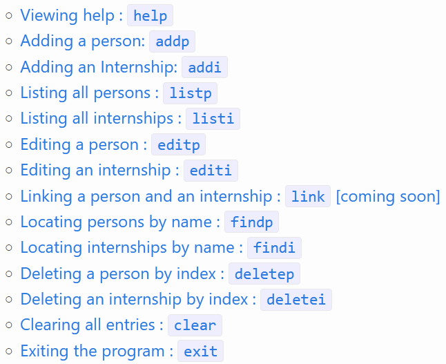

InterNUS is a desktop app for **managing internship applications, optimized for use via a Command Line Interface** (CLI) while still having the benefits of a Graphical User Interface (GUI). If you can type fast, InterNUS can get your internship management tasks done faster than traditional GUI apps.

* Table of Contents
{:toc}

--------------------------------------------------------------------------------------------------------------------

## Quick start

1. Ensure you have Java `11` or above installed in your Computer.

1. Download the latest `internus.jar` from [here](https://github.com/AY2223S1-CS2103T-F11-1/tp/releases).

1. Copy the file to the folder you want to use as the _home folder_ for your app.

1. Double-click the file to start the app. The GUI similar to the below should appear in a few seconds. Note how the app contains some sample data. 
   

1. Type the command in the command box and press Enter to execute it. e.g. typing **`help`** and pressing Enter will open the help window. 

1. Refer to the [Features](#features) below for details of each command.

--------------------------------------------------------------------------------------------------------------------

## Features

**:information_source: Notes about the command format:** 

* Words in `UPPER_CASE` are the parameters to be supplied by the user. 
  e.g. in `add n/NAME`, `NAME` is a parameter which can be used as `add n/John Doe`.

* Items in square brackets are optional. 
  e.g `n/NAME [t/TAG]` can be used as `n/John Doe t/friend` or as `n/John Doe`.

* Items with `…`​ after them can be used multiple times including zero times. 
  e.g. `[t/TAG]…​` can be used as ` ` (i.e. 0 times), `t/friend`, `t/friend t/family` etc.

* Parameters can be in any order. 
  e.g. if the command specifies `n/NAME p/PHONE_NUMBER`, `p/PHONE_NUMBER n/NAME` is also acceptable.

* If a parameter is expected only once in the command but you specified it multiple times, only the last occurrence of the parameter will be taken. 
  e.g. if you specify `p/12341234 p/56785678`, only `p/56785678` will be taken.

* Extraneous parameters for commands that do not take in parameters (such as `help`, `list`, `exit` and `clear`) will be ignored. 
  e.g. if the command specifies `help 123`, it will be interpreted as `help`.

### Viewing help : `help`

Displays a list of commands and a link to the user guide.

Format: `help`

### Adding a person: `addp`

Adds a person to InterNUS.

Format: `addp n/NAME e/EMAIL p/PHONE_NUMBER [t/TAG]…​ [l/LINK_INDEX]`

:bulb: **Tip:**
A person can have any number of tags (including 0). Link index is optional.
The link index refers to the index number shown in the internship list.

Examples:
* `addp n/John Doe e/johnd@example.com p/98765432 l/1`
* `addp n/Betsy Crowe t/friend e/betsycrowe@example.com`

### Adding an Internship: `addi`

Adds an Internship to InterNUS.

Format: `addi c/COMPANY_NAME r/ROLE s/STATUS [d/DATE_OF_INTERVIEW] [l/LINK_INDEX]`

:bulb: **Tip:**
Date of interview can be left blank, since it is possible that an interview is not scheduled yet.
The link index refers to the index number shown in the internship list and is optional. 

Examples:
* `addi n/TikTok r/Data Engineer s/rejected l/1`
* `addi c/Grab r/Full Stack Developer s/PENDING d/2020-12-20 12:00`

### Listing all persons : `listp`

Shows a list of all persons in InterNUS.

Format: `listp`

### Listing all internships : `listi`

Shows a list of all internships in InterNUS.

Format: `listi`

### Editing a person or internship : `edit`

Edits an existing person or internship in InterNUS, depending on the type of list currently displayed in InterNUS.

Format: `edit INDEX [n/NAME] [p/PHONE] [e/EMAIL] [a/ADDRESS] [t/TAG]…​`
- Edits the person or internship at the specified `INDEX`. The index refers to the index number shown in the displayed person list. The index must be a positive integer 1, 2, 3, …​
- Existing values will be updated to the input values. However, compulsory fields when adding the person or internship cannot be edited to be empty.
- When editing tags, the existing tags of the person will be removed i.e adding of tags is not cumulative.
- You can remove all the person’s tags by typing `t/` without specifying any tags after it.
- You can remove the person’s phone number or internship associated with the person by typing `p/` or `i/` without specifying any text after it, respectively.
Examples:
- `list -p` followed by `edit 1 p/91234567 e/johndoe@example.com` Edits the phone number and email address of the 1st person to be `91234567` and `johndoe@example.com` respectively.
- `list -p` followed by `edit 2 n/Betsy Crower t/ p/` Edits the name of the 2nd person to be `Betsy Crower` and clears all existing tags, as well as deleting the phone number associated with the person, without deleting the internship associated with the person.
- `list -i` followed by `edit 2 s/Rejected d/` Edits the status of the 2nd internship to `Rejected` and deletes the date of interview.

### Editing a person or internship : `link` [coming soon]

Links an existing person and internship together in InterNUS.

Format: `link pi/PERSON_INDEX ii/INTERNSHIP_INDEX`
- person at specified `PERSON_INDEX` and internship at specified `INTERNSHIP_INDEX` will be linked together such that 
- person will be displayed as contact person of internship and internship will be displayed as internship of person

Examples:
- `link pi/2 ii/3` will link person at index **2** to internship at index **3**

### Locating persons by name : `findp`

Finds persons whose names contain any of the given keywords.

Format: `findp KEYWORD`
- The search is case-insensitive. e.g **hans** will match **Hans**
- The order of the keywords does not matter. e.g. **Hans Bo** will match **Bo Hans**
- Only the person name is searched.
- Only full words will be matched e.g. **Han** will not match **Hans**

Examples:
- `findp John` returns **john** and **John Doe**

### Locating internships by name : `findi`

Finds internships whose company names contain any of the given keywords.

Format: `findi KEYWORD`
- The search is case-insensitive. e.g **abc pte ltd** will match **ABC Pte Ltd**.
- Only the company name is searched.
- The order of the keywords does not matter. e.g. **Ltd ABC Pte Constructions** will match **ABC Constructions Pte Ltd**.
- Partial names will be matched if the name contains the word perfectly e.g. **ltd** will match **XYZ Ltd**, but **lt** will not match **XYZ Ltd**.
- This search returns all internships with company names that has words that perfectly match at least 1 of the keywords.

Example of usage:
The app contains the following company names in the internship list.
- SBS Transit Ltd
- SMRT Buses
- SMRT Trains Ltd
- Tower Transit Singapore
- ABC Pte Ltd

Then,
- `findi Transit` returns **SBS Transit Ltd** and **Tower Transit Singapore**
- `findi Buses Trains` returns **SMRT Buses** and **SMRT Trains Ltd**
- `findi ABC Pte Ltd` returns **SBS Transit Ltd**, **SMRT Trains Ltd** and **ABC Pte Ltd**

### Deleting a person or internship by index : `delete`

Deletes the specified person or internship from InterNUS.

Format: `delete INDEX`

* Deletes the person or internship with the specific `INDEX` in the currently displayed list.
* The index refers to the index number shown in the currently displayed list.
* The index **must be a positive integer** 1, 2, 3, …​

Examples:
* `list -i` followed by `delete 2` deletes the 2nd internship in InterNUS.
* `find -p Betsy` followed by `delete 1` deletes the 1st person in the results of the `find` command.

### Clearing all entries : `clear`

Clears all entries from InterNUS.

Format: `clear`

### Exiting the program : `exit`

Exits the program.

Format: `exit`

### Saving the data

InterNUS data is saved in the hard disk automatically after any command that changes the data. There is no need to save manually.

### Editing the data file

InterNUS data is saved as a JSON file. `[JAR file location]`/data/addressbook.json.
Advanced users are welcome to update data directly by editing that data file.

:exclamation: **Caution:**
If your changes to the data file makes its format invalid, InterNUS will discard all data and start with an empty data file at the next run.

### Archiving data files `[coming in v2.0]`

_Details coming soon ..._

--------------------------------------------------------------------------------------------------------------------

## FAQ

**Q**: How do I transfer my data to another Computer? 
**A**: Install the app in the other computer and overwrite the empty data file it creates with the file that contains the data of your previous AddressBook home folder.

--------------------------------------------------------------------------------------------------------------------

## Command summary

| Action     | Format, Examples                                                                                                                                                      |
|------------|-----------------------------------------------------------------------------------------------------------------------------------------------------------------------|
| **Add**    | `add n/NAME p/PHONE_NUMBER e/EMAIL a/ADDRESS [t/TAG]…​`   e.g., `add n/James Ho p/22224444 e/jamesho@example.com a/123, Clementi Rd, 1234665 t/friend t/colleague` |
| **Clear**  | `clear`                                                                                                                                                               |
| **Delete** | `delete INDEX`  e.g., `delete 3`                                                                                                                                   |
| **Edit**   | `edit INDEX [n/NAME] [p/PHONE_NUMBER] [e/EMAIL] [a/ADDRESS] [t/TAG]…​`  e.g.,`edit 2 n/James Lee e/jameslee@example.com`                                           |
| **Find**   | `find -i/p KEYWORD`  e.g., `find -p James Jake`, `find -i frontend engineer`                                                                                       |
| **List**   | `list`                                                                                                                                                                |
| **Help**   | `help`                                                                                                                                                                |
