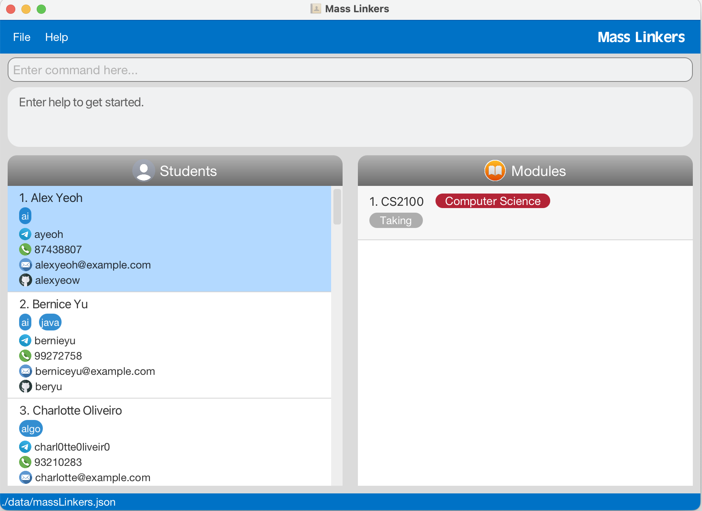
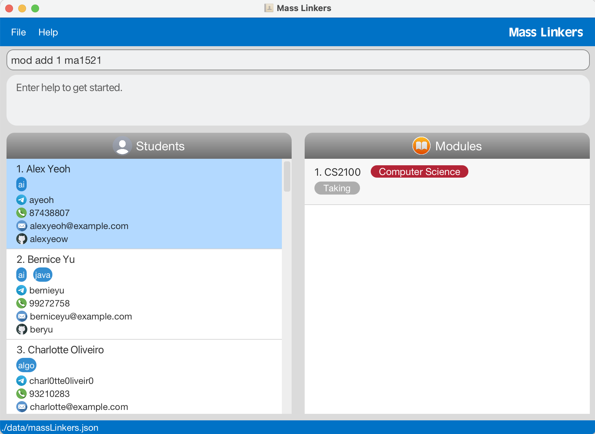
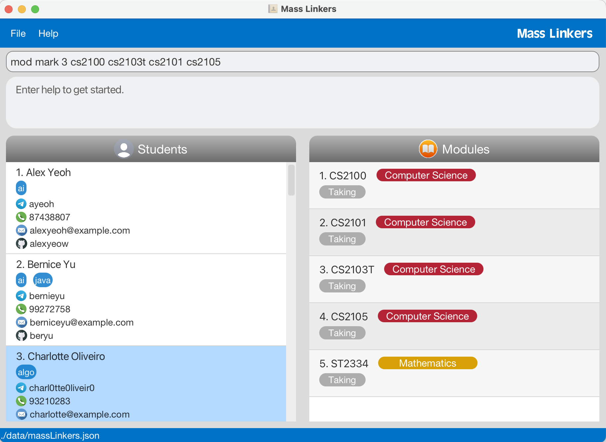
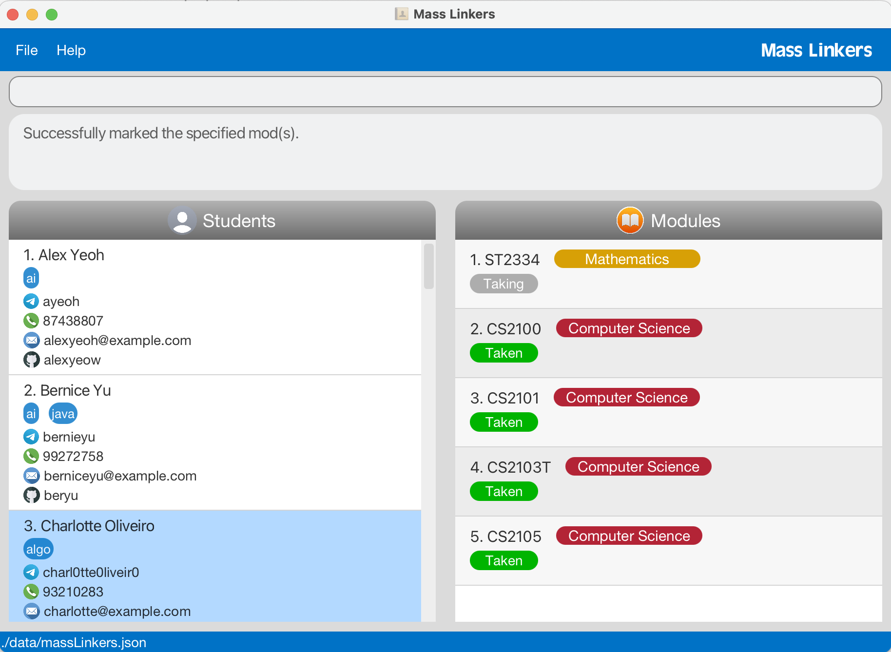

## **Using Mass Linkers: your quick start guide**

Welcome to Mass Linkers -- a powerful Desktop application tool that helps **Computer Science (CS) students** find study support from batchmates.

Mass Linkers helps you find batchmates to form study groups and seek study advice through the following way.

It provides a **centralised** platform for you to 
- save your batchmates’ contact and module details 
- search for batchmates with common interests or who are taking similar modules as you **conveniently**.

A fast typer? Mass Linkers is made just for you.
It is optimised for use via a **Command Line Interface (CLI)** while still having the benefits of an aesthetic **Graphical User Interface (GUI)**.

## **Using the User Guide**
In this *User Guide*, we will take you through the many useful features and functions of Mass Linkers, and provide you crucial information on how the different commands are used.

Feeling lost as a first-time user? We advise you to follow the User Guide sequentially, starting from [Getting started](#getting-started), as it provides a natural flow of how the commands should be executed.

If you are more familiar with CLI or Mass Linkers, head over to the [Command Summary](#command-summary) to start using the app.

The following icons are used in the _User Guide_ to denote special information to look out for.
#### Meaning of icons
<div markdown="block" class="alert alert-info">
**:information_source:**: __additional information__ such as specific requirements of parameters and the nature of command
</div>

<div markdown="span" class="alert alert-primary">
**:bulb:**: __tip__ on how to carry out certain functionalities
</div>

<div markdown="span" class="alert alert-warning">
**:warning:**: __warning__ as the command can create drastic changes to the existing App data
</div>

--------------------------------------------------------------------------------------------------------------------

## **Table of contents**
* Table of Contents
{:toc}

--------------------------------------------------------------------------------------------------------------------

## **Getting started**

1. Ensure you have Java `11` or above installed in your computer.

2. Download the latest `MassLinkers.jar` from [here](https://github.com/AY2223S1-CS2103T-T11-4/tp/releases).

3. Copy the file to the folder you want to use as the _home folder_ for your Mass Linkers.

4. Double-click the file to start the app. If done correctly, the GUI similar to the one below should appear in a few seconds. The app has been populated with some sample data.
5. If you wish to start with an empty set of data, execute the [Clear](#2-clear-all-data-clear) command. <br>
   

6. Type a command in the command box and press Enter to execute it. Refer to the section on [Features](#features) below for details and usage of each command. 
7. You can also use the [`help`](#view-help-help) command in Mass Linkers to view a summary of all available commands and their syntax.

--------------------------------------------------------------------------------------------------------------------

## **Features**
There are four main types of commands used in Mass Linkers - Batchmate commands, Interest commands, Module commands and General commands.

By segregating the commands in this manner, this makes it easier to make modifications and conduct a search based on different fields (ie. seach by common interests, modules or personal information).

The following notes outline several noteworthy format which the [Feature](#features) section uses in detailing the usage of different commands.

<div markdown="block" class="alert alert-info">

**:information_source: Take note of the Command Format:**<br>

* Words in `UPPER_CASE` are parameters to be supplied by the user.<br>
  Example:
  * In `add n/NAME`, `NAME` is a parameter which can be used as `add n/John Doe`.

* Items in square brackets are optional.<br>
  Example:
  * `n/NAME t/TELEGRAM [i/INTEREST]` can be used as `n/John Doe t/johnxyz i/ai` or as `n/John Doe t/johnxyz` without using `i/INTEREST`.

* Items with `...` after them can be used multiple times.<br>
  Examples:
  * `[i/INTEREST]...` can be used as `i/ai`, `i/algo i/swe` etc.<br>
  * `[MORE_MODULES]...` can be used as `cs2100`, `cs2103t cs2101 cs2105` etc.

* Parameters can be in any order.<br>
  Example:
  * If the command specifies `n/NAME t/TELEGRAM [g/GITHUB] [p/PHONE] [e/EMAIL] [i/INTEREST]`, then `[i/INTEREST] [e/EMAIL] [p/PHONE] n/NAME [g/GITHUB] t/TELEGRAM` is also acceptable.

* If a parameter is expected only once in the command but you specified it multiple times, only the last occurrence of the parameter will be taken.
  Example:
  * If you specify `n/John Doe n/Bob Tan`, only `n/Bob Tan` will be saved.
  * If you specify `p/12341234` `p/56785678`, only `p/56785678` will be saved.

* Extraneous parameters for commands that do not take in parameters (such as `help`, `list`, `exit` and `clear`) will be ignored.
  Example:
  * If the command specifies `help 123`, it will be interpreted as `help`.
  * If the command specifies `exit 345`, it will be interpreted as `exit`.

</div>

<div markdown="block" class="alert alert-info">

Parameters are the input words that come after a command word to specify how the command should be executed. Click [here](#parameter-requirements) to view the list of parameter requirements.

**:information_source: Regarding parameters:**<br>

* For all commands involving `INDEX`, `INDEX` refers to the index number shown in the currently displayed list.<br>
  * ___Beware!!!___ This may not be the full list of batchmates you have in Mass Linkers! For example, you may have entered the [find command](#find-a-batchmate-find), so the currently displayed list will be the result of `find` which is not the full list.
  * The index __must be a positive integer__, e.g. 1, 2, 3 … and be smaller than or equal to the number of batchmates in the currently displayed list.
  
</div>

### A. Batchmate commands

Batchmate commands handle the management of a batchmate's personal information such as Name, Telegram, GitHub and Phone number.

#### 1. Add a batchmate: `add`

Adds a batchmate to the list of batchmates in the _Students panel_.

__Format:__ `add n/NAME t/TELEGRAM [g/GITHUB] [p/PHONE] [e/EMAIL] [i/INTEREST]... [m/MODULE]...`

* A summary of the requirements of each parameter can be found under [Parameter Requirements](#parameter-requirements).
* Only unique batchmate can be added. It is considered a duplicate if an existing batchmate and the current batchmate to be added have identical Telegram handle, GitHub username, email address or phone number.
* Modules added to a batchmate will be automatically categorised according to their prefixes. e.g. `cs2103t` will be tagged as `Computer Science`.  `ma1521` will be tagged as `Mathematics`. For modules that are not identified by Mass Linkers, they will be tagged as `Unrestricted Elective`. More information can be found under [Module Categorisation](#module-categorisation).

__Examples:__
* `add n/John Doe t/johnxyz` adds a batchmate named `John Doe` with telegram handle `johnxyz` to the list.
* `add n/John Doe t/johnxyz g/johndoe p/98765432 e/johnd@example.com i/ai i/swe` adds a batchmate named `John Doe` with telegram handle `johnxyz`, github username `johndoe`, phone number `98765432`, email address `johnd@example.com` and interests in `ai` and `swe` to the list.
* `add n/John Doe t/johnxyz m/cs2103t m/cs2101` adds a batchmate named `John Doe` with telegram handle `johnxyz` and modules `cs2103t` and `cs2101` to the list.

#### 2. Edit a batchmate: `edit`

<div markdown="span" class="alert alert-primary">:bulb: **Tip:**
To edit a module, simply delete that module using [__mod delete__](#delete-module-from-a-batchmate-mod-delete) and add the new module using [__mod add__](#add-module-to-a-batchmate-mod-add).
</div>

Edits the information of a specified batchmate in the _Students panel_.

__Format:__ `edit INDEX [n/NAME] [t/TELEGRAM] [g/GITHUB] [p/PHONE] [e/EMAIL] [i/INTEREST]...`

* Edits the batchmate at the specific `INDEX` in the __currently displayed list__ in the _Students panel_. Refer to the section on _Notes about parameters_ at the start of [Features](#features) for more details.
* At least one of the optional fields must be provided.
* Existing values will be updated to the input values.
* When editing interests, the existing interests of the batchmate will be completely replaced by the new ones.
* You can remove all the batchmate’s interests by typing `i/` without specifying any interests after it.

__Examples:__
* `edit 1 g/johndoe p/91234567 e/johndoe@example.com` edits the github username, phone number and email address of the 1st batchmate in the currently displayed list to be `johndoe`, `91234567` and `johndoe@example.com` respectively.
* `edit 2 n/Bob Tan i/` edits the name of the 2nd batchmate in the currently displayed list to be `Bob Tan` and clears all existing interests.

#### 3. Delete a batchmate: `delete`

Deletes a specified batchmate from the _Students panel_.

__Format:__ `delete INDEX`

* Deletes the batchmate at the specific `INDEX` in the __currently displayed list__ in the _Students panel_. Refer to the section on _Notes about parameters_ at the start of [Features](#features) for more details.

__Examples:__
* `list` followed by `delete 2` deletes the 2nd batchmate in the full list of batchmates you have in Mass Linkers.
* `find Betsy` followed by `delete 1` deletes the 1st batchmate in the currently displayed list of the `find` command.

#### 4. Find a batchmate: `find`

Finds batchmates whose details contain __any__ of the given keywords.

__Format:__ `find KEYWORD [MORE_KEYWORDS]...`

* `NAME`, `TELEGRAM`, `GITHUB`, `PHONE` and `EMAIL` are searched.
* The search is case-insensitive. e.g `Hans` will return `hans`.
* The order of the keywords does not matter. e.g. `Hans Bo` will return both `Hans Bo` and `Bo Hans`.
* To search using `NAME`, only __full words__ will be matched. e.g. `Ha` will _not_ return a batchmate with the name `Hans`.
* To search using `TELEGRAM`, `GITHUB`, `PHONE` and `EMAIL`, partial words are accepted. E.g. `boh` will return `bohans`.
* Batchmates matching at least one keyword will be returned. e.g. `Hans Bo` will return `Hans Gruber`, `Bo Yang`.

__Examples:__
* When you want to search using `NAME`:
  * `find John` returns `john` and `John Doe`.
  * `find alex david` returns `Alex Tan`, `David Chua`.
* When you want to search using `TELEGRAM`, `GITHUB` or `EMAIL`:
  * `find boh` returns the batchmates with telegram handle, github username or email address containing `boh`, e.g. `bohans`.
* When you want to search using `PHONE`:
  * `find 999` returns the batchmates with phone number `69998888`, `89991234` or `99912345`.

#### 5. List all batchmates: `list`

Shows a list of all batchmates in the _Students panel_.

__Format:__ `list`

### B. Interest commands
Interest commands handle the management of a batchmate's list of interests, such as addition of interests, deletion of interests and searching batchmates with specified interests.

<div markdown="block" class="alert alert-info">

**:information_source: What are considered interests:**<br>
Interests can include batchmates' hobbies such as games, CS specialisations, etc.
</div>

#### 1. Add interests: `addInt`

Adds interest(s) to a specified batchmate in the _Students panel_.

__Format:__ `addInt INDEX INTEREST [MORE_INTERESTS]...`

* Adds interest(s) to the batchmate at the specific INDEX in the __currently displayed list__ in the _Students panel_. Refer to the section on _Notes about parameters_ at the start of [Features](#features) for more details.
* Interests added are case insensitive, they will be displayed in lower casing. 

__Examples:__
* `addInt 1 algo` adds the interest `algo` to the 1st batchmate in the currently displayed list.
* `addInt 3 database swe machinelearning` adds the interests `database`, `swe` and `machinelearning` to the 3rd batchmate in the currently displayed list.

#### 2. Delete interests: `deleteInt`

Delete interest(s) from a specified batchmate in the _Students panel_.

__Format:__ `deleteInt INDEX INTEREST [MORE_INTERESTS]...`

* Deletes interest(s) from the batchmate at the specific INDEX in the __currently displayed list__ in the _Students panel_. Refer to the section on _Notes about parameters_ at the start of [Features](#features) for more details.

__Examples:__
* `deleteInt 1 ai` deletes the interest `ai` from the 1st batchmate in the currently displayed list.
* `deleteInt 3 ai swe` deletes the interests `ai` and `swe` from the 3rd batchmate in the currently displayed list.

#### 3. Find batchmates by interests: `findInt`

Finds batchmates whose interests contain __all__ the specified interests.

__Format:__ `findInt INTEREST [MORE_INTERESTS]...`

* The search is case-insensitive. e.g. `machineLearning` will match `machinelearning`.
* Only exact words will be matched. e.g. `sw` will not match `swe`.

__Examples:__
* `findInt ai` returns all batchmates whose interests contain `ai`.
* `findInt swe security` returns all batchmates whose interests contain both `swe` and `security`.

### C. Module commands
Module commands handle the management of a batchmate's list of modules, such as addition of modules, deletion of modules and searching batchmates with specified modules.

<div markdown="block" class="alert alert-info">:information_source: **Note:**
Commands used to manage a batchmate's personal information in [Batchmate commands](#batchmate-commands) and [Interest commands](#interest-commands) follow the 1 command word syntax. E.g., `add`, `addInt`.
Whereas, commands that manage a module detail in [Module commands](#module-commands) can have multiple command words preceded by the `mod` keyword. E.g., `mod add`, `mod mark all`, `mod find taken`.

This is to facilitate easy distinction between the nature of commands.

</div>

#### 1. View a batchmate's modules
Views the list of modules taken by a batchmate in the Modules panel.

Left-click the row with the batchmate's name in the Students panel.

- The selected row would turn blue and the Modules panel would display all the modules of the batchmate.

This is the GUI when Mass Linkers is opened.


This is the GUI after you left-click the 1st batchmate in the Students panel. The 1st row turns blue and the Modules panel displays all the modules of the 1st batchmate.


#### 2. Add module to a batchmate: `mod add`

Adds module(s) to a specified batchmate in the _Modules panel_.

__Format:__ `mod add INDEX MODULE [MORE_MODULES]...`

* Adds module(s) to the batchmate at the specific `INDEX` in the __currently displayed list__ in the _Modules panel_. Refer to the section on _Notes about parameters_ at the start of [Features](#features) for more details.
* * Modules added to a batchmate will be automatically categorised according to their prefixes. e.g. `cs2103t` will be tagged as `Computer Science`.  `ma1521` will be tagged as `Mathematics`. For modules that are not identified by Mass Linkers, they will be tagged as `Unrestricted Elective`. More information can be found under [Module Categorisation](#module-categorisation).

__Examples:__
* `mod add 1 ma1521` adds the module `MA1521` to the 1st batchmate in the currently displayed list.
* `mod add 3 cs2100 cs2103t cs2101 cs2105` adds the modules `CS2100`, `CS2103T`, `CS2101` and `CS2105` to the 3rd batchmate in the currently displayed list.

This is the GUI before `mod add 1 ma1521` is executed.


This is the GUI after you press Enter to execute the command. The module `ma1521` is successfully added to the 1st batchmate and automatically categorised as `Mathematics`.


#### 3. Delete module from a batchmate: `mod delete`

Deletes module(s) from a specified batchmate in the _Modules panel_.

__Format:__ `mod delete INDEX MODULE [MORE_MODULES]...`

* Deletes module(s) from the batchmate at the specific `INDEX` in the __currently displayed list__ in the _Modules panel_. Refer to the section on _Notes about parameters_ at the start of [Features](#features) for more details.

__Examples:__
* `mod delete 1 cs2103t` deletes the module `CS2103T` from the 1st batchmate in the currently displayed list.
* `mod delete 3 cs2100 cs2103t cs2101 cs2105` deletes the modules `CS2100`, `CS2103T`, `CS2101` and `CS2105` from the 3rd batchmate in the currently displayed list.

#### 4. Mark module as taken: `mod mark`

Marks module(s) of a specified batchmate as `taken` in the _Modules panel_, which means the batchmate has taken the module(s) before.

__Format:__ `mod mark INDEX MODULE [MORE_MODULES]...`

* Marks module(s) of the batchmate at the specific `INDEX` in the __currently displayed list__ in the _Modules panel_. Refer to the section on _Notes about parameters_ at the start of [Features](#features) for more details.

__Examples:__
* `mod mark 1 cs2103t` marks the module `CS2103T` of the 1st batchmate in the currently displayed list as `taken`.
* `mod mark 3 cs2100 cs2103t cs2101 cs2105` marks the modules `CS2100`, `CS2103T`, `CS2101` and `CS2105` of the 3rd batchmate in the currently displayed list as `taken`.

This is the GUI before `mod mark 3 cs2100 cs2103t cs2101 cs2105` is executed. The modules `CS2100`, `CS2103T`, `CS2101` and `CS2105` current have `taking` as their status.


This is the GUI after you press Enter to execute the command. The modules `CS2100`, `CS2103T`, `CS2101` and `CS2105` are successfully marked as `taken`.


#### 5. Unmark module as not taken: `mod unmark`

Unmarks module(s) of a specified batchmate and updates the status as `taking` in the _Modules panel_, which means the batchmate is currently taking the module(s).

__Format:__ `mod unmark INDEX MODULE [MORE_MODULES]...`

* Unmarks module(s) of the batchmate at the specific `INDEX` in the __currently displayed list__ in the _Modules panel_. Refer to the section on _Notes about parameters_ at the start of [Features](#features) for more details.

__Examples:__
* `mod unmark 1 cs2103t` unmarks the module `CS2103T` of the 1st batchmate in the currently displayed list as `not taken`.
* `mod unmark 3 cs2100 cs2103t cs2101 cs2105` unmarks the modules `CS2100`, `CS2103T`, `CS2101` and `CS2105` of the 3rd batchmate in the currently displayed list as `not taken`.

#### 6. Mark all modules as taken: `mod mark all`
<div markdown="span" class="alert alert-warning">:warning: **Warning:** The __mod mark all__ command is irreversible. Only execute it if you intend to mark all existing modules for all batchmates as taken. 
 </div>
 
Marks all current modules of every batchmate in Mass Linkers as `taken` in the _Modules panel_. This makes it convenient to update the module status of all existing modules of every batchmate as taken after each semester.

__Format:__ `mod mark all`

#### 7. Find batchmates taking specified modules: `mod find`

Finds batchmates with modules matching __all__ the specified modules.

__Format:__ `mod find MODULE [MORE_MODULES]...`

* The search is case-insensitive. e.g `cs2100` will match `CS2100`.
* Only __full words__ will be matched. e.g. `cs21` will _not_ return batchmates with the mods `CS2100` and `CS2101`.

__Examples:__
* `mod find cs2100` returns batchmates with the module `CS2100`.
* `mod find cs2101 cs2103t` returns batchmates with both modules `CS2101` and `CS2103T`.

#### 8. Find modules taken or taking: `mod find taken` or `mod find taking`
<div markdown="span" class="alert alert-primary">:bulb: **Tip:**
This is an <i>extension</i> of [__mod find__](#find-batchmates-taking-specified-modules-mod-find). The rules listed above for [__mod find__](#find-batchmates-taking-specified-modules-mod-find) apply to this feature too.
</div>

Finds batchmates who have taken or are taking __all__ the specified modules.

__Format:__ `mod find taken MODULE [MORE_MODULES]...` or `mod find taking MODULE [MORE_MODULES]...`

__Examples:__
* `mod find taken cs2100` returns batchmates who have taken `CS2100`.
* `mod find taken cs2101 cs2103t` returns batchmates who have taken both `CS2101` and `CS2103T`.
* `mod find taking cs2100` returns batchmates who are taking `CS2100`.
* `mod find taking cs2101 cs2103t` returns batchmates who are taking both `CS2101` and `CS2103T`.


### D. General commands
General commands are commands which do not fall under any of the above categories.  

#### 1. View help: `help`

Shows a brief summary of commands with their syntax and a link to the user guide. You can also click the `Open User Guide` button which will redirect you to the user guide in your browser.

__Format:__ `help`

#### 2. Clear all data: `clear`
<div markdown="span" class="alert alert-warning">:warning: **Warning:** The __clear__ command is irreversible. Only execute it if you intend to clear all existing data. 
 </div>
Clears all existing data in Mass Linkers. 

__Format:__ `clear`

#### 3. Exit the program : `exit`

Exits Mass Linkers.

__Format:__ `exit`

#### 4. Save the data

Mass Linkers ensures your data is saved automatically each time after you execute a command which changes the data. Hence, you do not need to conduct a save manually.

--------------------------------------------------------------------------------------------------------------------

### **Parameter Requirements**

Below is the summary of requirements to take note of for each parameter for the different commands. 

| Parameter       | Requirements                                                                                                                                                                                                                                                                                                                                                                                                                                                                                                                                                                                                                                                                                                                                               |
|-----------------|------------------------------------------------------------------------------------------------------------------------------------------------------------------------------------------------------------------------------------------------------------------------------------------------------------------------------------------------------------------------------------------------------------------------------------------------------------------------------------------------------------------------------------------------------------------------------------------------------------------------------------------------------------------------------------------------------------------------------------------------------------|
| Name            | Only alphabetical with spaces allowed. <br/> Examples: `Joe`, `John Doe`                                                                                                                                                                                                                                                                                                                                                                                                                                                                                                                                                                                                                                                                                   |
| Telegram handle | May only contain alphanumeric characters or underscores and have a minimum length of 5 characters.<br> Consecutive and/or starting/ending with underscores are not allowed as per Telegram requirements. <br/> Examples: `johndoe`, `john_doe123`                                                                                                                                                                                                                                                                                                                                                                                                                                                                                                          |
| Phone number    | Should contain only numerical values (i.e. `0-9`), and at most one "`+`" at the beginning for country code (optional). <br> Should have a length of 7-16 characters (inclusive of country code). <br> Incorrect phone numbers are still accepted, though they are discouraged and a warning will be shown.  <br/> Examples: `98383913`, `+12064512559`, `(+65) 98383913` (Warning will be shown)                                                                                                                                                                                                                                                                                                                                                           |
| GitHub username | May only contain alphanumeric characters or hyphens and have a length between 1 - 39 characters.<br> Consecutive and/or starting with hyphens are not allowed as per GitHub requirements. <br/> Examples: `john1`, `john-doe`                                                                                                                                                                                                                                                                                                                                                                                                                                                                                                                              |
| Interest        | Only alphanumerical characters allowed. <br/> Examples: `swe`, `ai`, `algo`                                                                                                                                                                                                                                                                                                                                                                                                                                                                                                                                                                                                                                                                                |                                                                                                                                                                                                                                                                                                                                                                                                                                                                                                                                                                                                                                             |                                                                                                                                                                                                                                                                                                                                                                                                                                                                                                                                                                                                                                             |
| Email           | Emails should be of the format local-part@domain and adhere to the following constraints: <br> 1. The local-part should only contain alphanumeric characters and these special characters within the quotation marks: "`+_.-`". The local-part may not start or end with any special characters.<br> 2. This is followed by a '@' and then a domain name. The domain name is made up of domain labels separated by periods.<br>The domain name must:<br>- end with a domain label at least 2 characters long<br>- have each domain label start and end with alphanumeric characters<br>- have each domain label consist of alphanumeric characters, separated only by hyphens, if any. <br/> Examples: `john12@gmail.com`, `joe-lim@u.nus.edu`, `joe@mail` |
| Modules         | Module names should be numbers prefixed with alphabet(s) and be less than 10 characters.                                                                                                                                                                                                                                                                                                                                                                                                                                                                                                                                                                                                                                                                   |

### **Module Categorisation**

Modules are automatically categorised when you create them. The categorisation is modelled after the prefixes which [NUS modules](https://nusmods.com/modules?sem[0]=1&sem[1]=2&sem[2]=3&sem[3]=4) use.

Below is the categorisation:

| Category              | Module Prefix      |
|-----------------------|--------------------|
| Computer Science      | CS, IS, CP         |
| Mathematics           | ST, MA             |
| Science               | LS, CM, PC         |
| General Education     | GE, UT             |
| Unrestricted Elective | All other prefixes |

_Module prefix refers to the first two characters of every module name._

--------------------------------------------------------------------------------------------------------------------

## **FAQ**
Facing an issue? Below are the commonly asked questions, which address technical and privacy concerns.

#### Technical Support
**Q**: How do I transfer my data to another Computer?<br>
**A**: Install Mass Linkers in the other computer and overwrite the empty data file it creates with the file that contains the data of your previous Mass Linkers home folder.

**Q**: Do I need internet connection to use Mass Linkers?<br>
**A**: No, internet connection is not required. 

**Q**: I am using Mac and I tried opening the `MassLinkers.jar` file by double-clicking it in Finder. It says *"MassLinkers.jar" cannot be opened because it is from an unidentified developer.*<br>
**A**: Right click the `MassLinkers.jar file` and select `Open`. When a warning message that says _macOS cannot verify the developer of "MassLinkers.jar". Are you sure you want to open it?_ appears, select `Open`. Alternatively, you can right click the `MassLinkers.jar` file and select `Open with JavaLauncher(default)`. 

**Q**: Will the data of batchmates be saved if the program was not closed via the ```exit``` command?<br>
**A**: Yes, the data will still be saved if the program is closed by closing the application window directly. However, we advise using the ```exit``` command for a better user experience.

**Q**: I have accidentally cleared all the data. Is there any way to undo the changes?<br>
**A**: Currently, there is no ```undo``` feature and the ```clear``` command is irreversible. Hence, it is extremely important to only use it when you want an empty Student and Module table. However, we are looking into adding ```undo``` and ```redo``` commands for future developments.

**Q**: I have added a batchmate and its row exceeds the currently displayed list of batchmates in the _Students panel_. I have to scroll below to view the newly added batchmate. Is this expected?<br>
**A**: Yes, adding a new batchmate would not auto scroll the _Students panel_ to the bottom of the list.

#### Privacy Issues
**Q**: What if I do not want to share some of my personal data like my phone number and email address?<br>
**A**: While it is every student's responsibility to exercise discretion in sharing their batchmates' contacts, Mass Linkers has made more sensitive data fields such as GitHub, Phone and Email optional. In this way, the only mandatory fields are your name and telegram handle. If you are uncomfortable sharing your name, you can use a pseudo-name for identification purposes. 

--------------------------------------------------------------------------------------------------------------------

## **Command summary**

All the available commands in Mass Linkers are categorised into 4 summary tables below.

### Batchmate commands

| Action                           | Format                                                                                    | Examples                                                                                          |
|----------------------------------|-------------------------------------------------------------------------------------------|---------------------------------------------------------------------------------------------------|
| **Add**                          | `add n/NAME t/TELEGRAM [g/GITHUB] [p/PHONE] [e/EMAIL] [i/INTEREST]... [m/MODULE]...`      | `add n/John Doe t/johnxyz g/johndoe p/98765432 e/johnd@example.com i/AI i/swe m/cs2103t m/cs2101` |
| **Edit**                         | `edit INDEX [n/NAME] [t/TELEGRAM] [g/GITHUB] [p/PHONE] [e/EMAIL] [i/INTEREST]...`         | `edit 1 g/johndoe p/91234567 e/johndoe@example.com`                                               |
| **Delete**                       | `delete INDEX`                                                                            | `delete 2`                                                                                        |
| **Find**                         | `find KEYWORD [MORE_KEYWORDS]...`                                                         | `find Alex david`                                                                                 |
| **List**                         | `list`                                                                                    | `list`                                                                                            |

### Interest commands

| Action                           | Format                                                                                    | Examples                                                                                          |
|----------------------------------|-------------------------------------------------------------------------------------------|---------------------------------------------------------------------------------------------------|
| **Add interest**                 | `addInt INDEX INTEREST [MORE_INTERESTS]...`                                               | `addInt 3 algo ai swe`                                                                            |
| **Delete interest**              | `deleteInt INDEX INTEREST [MORE_INTERESTS]...`                                            | `deleteInt 3 ai swe`                                                                              |
| **Find by interest**             | `findInt INTEREST [MORE_INTEREST]...`                                                     | `findInt ai swe`                                                                                  |

### Module commands

| Action                           | Format                                                                                    | Examples                                                                                          |
|----------------------------------|-------------------------------------------------------------------------------------------|---------------------------------------------------------------------------------------------------|
| **Add module**                   | `mod add INDEX MODULE [MORE_MODULES]...`                                                  | `mod add 3 cs2100 cs2103t cs2101 cs2105`                                                          |
| **Delete module**                | `mod delete INDEX MODULE [MORE_MODULES]...`                                               | `mod delete 3 cs2100 cs2103t cs2101 cs2105`                                                       |
| **Mark module**                  | `mod mark INDEX MODULE [MORE_MODULES]...`                                                 | `mod mark 3 cs2100 cs2103t cs2101 cs2105`                                                         |
| **Unmark module**                | `mod unmark INDEX MODULE [MORE_MODULES]...`                                               | `mod unmark 3 cs2100 cs2103t cs2101 cs2105`                                                       |
| **Mark all modules**             | `mod mark all`                                                                            | `mod mark all`                                                                                    |
| **Find module**                  | `mod find MODULE [MORE_MODULES]...`                                                       | `mod find cs2101 cs2103t`                                                                         |
| **Find modules taken or taking** | `mod find taken MODULE [MORE_MODULES]...` <br> `mod find taking MODULE [MORE_MODULES]...` | `mod find taken cs2100` or <br> `mod find taking cs2101 cs2103t`                                  |

### General commands

| Action                           | Format                                                                                    | Examples                                                                                          |
|----------------------------------|-------------------------------------------------------------------------------------------|---------------------------------------------------------------------------------------------------|
| **Help**                         | `help`                                                                                    | `help`                                                                                            |
| **Clear all data**               | `clear`                                                                                   | `clear`                                                                                           |
| **Exit**                         | `exit`                                                                                    | `exit`                                                                                            |
