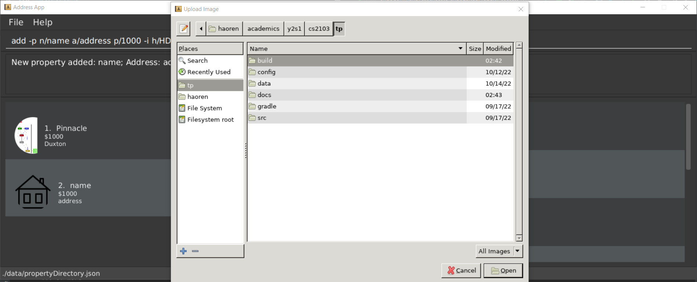

Condonery is a desktop app made for property agents primarily used for managing client contacts and property listings.
It is optimized for use via a Command Line Interface (CLI) while still having the benefits of a Graphical User Interface (GUI).
If you can type fast, Condonery can get your contact management tasks done faster than traditional GUI apps.

* Table of Contents
- [`Quick start`](#quick-start)
- [`Property and client attributes`](#property-and-client-attributes)
  - [Shared attributes](#shared-attributes)
  - [Property attributes](#property-attributes)
  - [Client attributes](#client-attributes)
- [`Features systax`](#features-syntax)
- [`Features in Condonery`](#features-in-condonery)
  - [Undoing commands : `undo`](#undoing-commands--undo)
  - [Viewing help : `help`](#viewing-help--help)
  - [Exiting the program : `exit`](#exiting-the-program--exit)
- [`Property Directory Features`](#property-directory-features)
    - [Adding a property: add -p](#adding-a-property-add--p)
    - [Listing all properties : list -p](#listing-all-properties--list--p)
    - [Editing a property : edit -p](#editing-a-property--edit--p)
    - [Locating properties by name: `find -p`](#locating-properties-by-name-find--p)
    - [Deleting a property : `delete -p`](#deleting-a-property--delete--p)
    - [Filtering properties by tags: `filter -p`](#filtering-properties-filter--p)
    - [Filtering properties within price range: range -p](#filtering-properties-within-price-range-range--p)
    - [Filtering properties by status: status -p](#filter-properties-by-status-status--p)
    - [Filtering properties by type: type -p](#filtering-properties-by-type-type--p)
    - [Selecting a property: select -p INDEX](#selecing-a-property-select--p-index)
    - [Clearing all entries : clear](#clearing-all-entries--clear)
    - [Saving the data](#saving-the-data)
    - [Editing the data file](#editing-the-data-file)
- [`Client Directory Features`](#client-directory-features)
    - [Adding a client profile: add -c](#adding-a-client-profile-add--c)
    - [Listing all client profiles: list -c](#listing-all-client-profiles-list--c)
    - [Editing a client profile: edit -c](#editing-a-client-profile-edit--c)
    - [Locating client profiles by name: find -c](#locating-client-profiles--by-name-find--c)
    - [Deleting a client profile: delete -c](#deleting-a-client-profile-delete--c-index)
    - [Filtering client profiles by tags: filter -c](#filtering-client-profiles-filter--c)
    - [Selecting a client profile: select -c](#selecting-a-client-profile-select--pc-index)
- [`FAQ`](#faq)
- [`Command summary`](#command-summary)

--------------------------------------------------------------------------------------------------------------------

## Quick start

1. Ensure you have Java `11` or above installed in your Computer.

1. Download the latest `condonery.jar` from [here](https://github.com/AY2223S1-CS2103-W14-1/tp/releases).

1. Copy the file to the folder you want to use as the _home folder_ for your Condonery.

1. Double-click the file to start the app. The interface will look like this.
   

1. Type the command in the command box and press Enter to execute it. e.g. typing **`help`** and pressing Enter will open the help window. 
   Some example commands you can try:

    * **`list -p`** : Lists all properties.

    * **`add -p`**`n/Pinnacle@Duxton a/Cantonment Rd, #1G, 085301 p/100,000 h/CONDO t/luxury` : Adds a listing named `Pinnacle@Duxton`, with the inputted details, to the property directory.

    * **`list -p delete`**`3` : Deletes the 3rd property shown in the current list.

    * **`exit`** : Exits the app.

1. Refer to the [Features](#features-syntax) below for details of each command.

--------------------------------------------------------------------------------------------------------------------

## Property and client attributes

In Condonery, properties and clients can hold many different attributes. These attributes are denoted by parameters (e.g. `n/` for name) when using commands like `add -p`, `add -c`, `edit -p` or `edit -c`.
This section gives a breakdown of each attribute and its parameter counterpart.

### Shared attributes
#### Name
* Refers to the name of a property or client.
* Each property or client can only have one name.

* Parameter: `n/`
* Example: `n/PINNACLE@DUXTON`

#### Address
* Refers to the address of a property or client.
* Each property or client can only have one address.

* Parameter: `a/`
* Example: `a/Cantonment Rd, #1G, 085301`

#### Tag
* Refers to the given tags of a property or client. Can be used to label a property or client with important details.
* The only requirement for tags is that they have to be alphanumerical.
* Each property or client can have multiple tags.

* Parameter: `t/`
* Example: `t/High-end`, `t/Friend`

#### Image
* Refers to the given image for a property or client.
* Each property or client can only have one image.
* The user will be prompted to select an image in a separate window after successful usage of this parameter in the context of whichever command the parameter was used for.

* Parameter: `-i`

### Property attributes
#### Price
* Refers to the general price to purchase a unit for a property.
* Each property can only have one price.
* Max value is 2,147,483,647

* Parameter: `p/`
* Example: `p/1,000,000`

#### Property type
* Refers to the type of a property.
* Each property can only have one property type.
* Valid property types:
  * HDB
  * CONDO
  * LANDED
* Arguments for this parameter are case-insensitive.

* Parameter: `h/`
* Example: `h/HDB`, `h/Condo`

#### Property status
* Refers to the status of a property.
* Each property can only have one property status.
* Valid property statuses:
  * AVAILABLE
  * SOLD
  * PENDING
* Arguments for this parameter are case-insensitive.

* Parameter: `s/`
* Example: `s/AVAILABLE`, `s/PENDING`

#### Interested clients
* Refers to the clients that are interested in a property.
* Each property can have multiple clients interested in it.
* This parameter takes in **case-insensitive** arguments and attempts to link it to the name of a client.
* Can take in multiple space-delimited arguments.
* An argument will not be accepted if it links to no clients, or if it links to more than one client.
  * An input containing both accepted and unaccepted arguments will not throw an error. The accepted arguments will still be used to link interested clients to the property.

* Parameter: `ic/`
* Example: `ic/Samuel`, `ic/bob jedrek JANICE`

### Client attributes
#### Interested properties
* Refers to properties that a client is interested in.
* Each client can be interested in multiple properties.
* This parameter takes in **case-insensitive** arguments and attempts to link it to the name of a property.
* Can take in multiple space-delimited arguments.
* An argument will not be accepted if it links to no clients, or if it links to more than one client.
  * An input containing both accepted and unaccepted arguments will not throw an error. The accepted arguments will still be used to link interested properties to the client..

* Parameter: `ip/`
* Example: `ip/duxton`, `ip/rosewood duxton FAIRFIELD`

--------------------------------------------------------------------------------------------------------------------

## Features syntax

**:information_source: Notes about the command format:** 

* Demarcaters `-p` and `-c` after each command word represent interactions with the property and client directory respectively. 
  * e.g. `add -p` is used to add properties in the property directory while `add -c` is used to add clients in the client directory.
* Words in `UPPER_CASE` are the arguments to be supplied by the user. 
  e.g. in `add -p n/NAME`, `NAME` is an argument which can be used as `add -p n/PINNACLE@DUXTON`.
* Items in square brackets are optional. 
  e.g `n/NAME [t/TAG]` can be used as `n/PINNACLE@DUXTON t/luxury` or as `n/PINNACLE@DUXTON`.
* Items with `…`​ after them can be used multiple times including zero times. 
  e.g. `[t/TAG]…​` can be used as ` ` (i.e. 0 times), `t/friend`, `t/friend t/family` etc.
* Parameters can be in any order. 
  * e.g. if the command specifies `n/NAME p/PRICE`, `p/PRICE n/NAME` is also acceptable.
* If a parameter is expected only once in the command but you specified it multiple times, only the last occurrence of the parameter will be taken. 
  * e.g. if you specify `p/1,000,000 p/2,000,000`, only `p/2,000,000` will be taken.
* Extraneous parameters or arguments for commands that do not any (such as `help`, `list`, `exit`, `clear -p`  and `clear -c`) will be ignored. 
  * e.g. if the command specifies `help 123`, it will be interpreted as `help`.

--------------------------------------------------------------------------------------------------------------------

## Features in Condonery

### Undoing commands : `undo`

Reverses the effect of the previous command. Only commands that affect the state of Property/Client Directory can be
undone.

For example, `help` cannot be undone, whereas `add -p` can be undone.

Format: `undo`

### Viewing help : `help`

Shows the help guide

Format: `help`

### Exiting the program : `exit`

Exits the program.

Format: `exit`

## Property Directory Features

### Adding a property: `add -p`

Adds a property to the property directory.

Format: `add -p n/NAME a/ADDRESS p/PRICE h/PROPERTY_TYPE [-i] [s/PROPERTY_STATUS] [t/TAG]… [ic/INTERESTED_CLIENTS]…​`

Mandatory parameters:
- [Name](#name): `n/`
- [Address](#address): `a/`
- [Price](#price): `p/`
- [Property type](#property-type): `h/`

Optional parameters:
- [Image](#image): `-i`
- [Property status](#property-status): `s/`
- [Tags](#tag): `t/`
- [Interested clients](#interested-clients): `ic/`

:bulb: **Tips:**
* A property can have any number of tags (including 0)
* A property can have any number of interested clients (including 0)
* The `h/PROPERTY_TYPE` flag specifies the type of property. It can only be either HDB, CONDO, or LANDED.
* Succesfully adding interested clients to a property does not add the new property as an interested property for those clients. The user has to manually add the new property as an interested property of those clients.
* The `s/PROPERTY_STATUS` is optional, if not specified, will default to `AVAILABLE` status.
* The `-i` flag allows the user to upload images of the property. A file chooser dialog will appear after running the command.

Examples:
* `add n/PINNACLE@DUXTON a/11 Pulau Tekong Besar, Pulau, Tekong Camp, 508450 p/1,000,000 s/AVAILABLE h/HDB t/cheap`
* `add n/SEMAKAU LANDFILL a/Straits Boulevard p/1,000 s/AVAILABLE h/HDB t/high-end ic/sam bob`

### Listing all properties : `list -p`

Lists all properties currently stored in the property directory.

Format: `list -p`

### Editing a property : `edit -p`

Edits an existing property in the property directory.

Format: `edit -p INDEX [n/NAME] [a/ADDRESS] [p/PRICE] [s/PROPERTY_STATUS] [h/PROPERTY_TYPE] [t/TAG]… [ic/INTERESTED_CLIENTS…]​`

:bulb: **Tips:**
* Edits the property at the specified `INDEX`. The index refers to the index number shown in the displayed property list. The index **must be a positive integer** 1, 2, 3, …​
* At least one of the optional fields must be provided.
* Existing values will be updated to the input values.
* When editing tags, the existing tags of the property will be removed i.e adding of tags is not cumulative.
* You can remove all the property’s tags by typing `t/` without specifying any tags after it.
* Succesfully adding interested clients to a property does not add the edited property as an interested property for those clients. The user has to manually add the edited property as an interested property of those clients, as well as possibly remove the edited property from its original interested clients.

Examples:
*  `edit -p 1 p/1,000,000 a/11 Pulau Tekong Besar, Pulau, Tekong Camp, 508450` Edits the price and address of the 1st person to be `1,000,000` and `11 Pulau Tekong Besar, Pulau, Tekong Camp, 508450` respectively.
*  `edit -p 2 n/Cinammon College t/` Edits the name of the 2nd property to be `Cinammon College` and clears all existing tags.

### Locating properties by name: `find -p`

Finds properties whose names contain any of the given keywords.

Format: `find -p KEYWORD [MORE_KEYWORDS]`

:bulb: **Tips:**
* The search is case-insensitive. e.g `bishan` will match `Bishan`.
* The order of the keywords does not matter. e.g. `PINNACLE@DUXTON Bishan` will match `Bishan PINNACLE@DUXTON`.
* Only the name is searched.
* Only full words will be matched e.g. `PINNACLE` will not match `PINNACLE@DUXTON`.
* Properties matching at least one keyword will be returned (i.e. `OR` search). e.g. `PINNACLE@DUXTON Bishan` will return `PINNACLE@DUXTON`, `Bishan 8`.

Examples:
* `find -p Wall Street` returns `Wall Street` and `Wall Street Prime`
* `find -p Pinnacle@Duxton Sesame Street` returns `Pinnacle@Duxton`, `Sesame Street` 

[//]: # (Image to be added later)
[//]: # (  ![result for 'find alex david']&#40;images/findAlexDavidResult.png&#41;)

### Deleting a property : `delete -p`

Deletes the specified property at the specified INDEX, from the property directory.

Format: `delete -p INDEX`

:bulb: **Tips:**
* The INDEX refers to the index number shown in the displayed property directory.
* The INDEX **must be a positive integer** 1, 2, 3, …​

Examples:
* `list -p` followed by `delete -p 2` deletes the 2nd property in the property directory.
* `find -p Wall Street` followed by `delete -p 1` deletes the first property in the results of the `find -p` command.

### Filtering properties by tags: `filter -p`

Returns a filtered list of properties that fulfil the filter conditions according to specified tags.

:bulb: **Tips:**
* A TAG has to be **fully** and not partially typed out (i.e. 'high-end' instead of 'high').

Format: `filter -p TAG...`

Examples:
* `filter -p high-end` returns all properties with the `high-end` tag.
* `filter -p available` returns all properties with the `available` tag.

### Filtering properties within price range: `range -p`

Returns a filtered list of clients that fulfil the filter conditions.

Format: `range -p l/100,000 u/1,000,000`

:bulb: **Tips:**
* Lower and upper price boundaries only accept integer values (commas acceptable).

Examples:
* `range -p l/100,000 u/1,000,000` returns all properties within the price range of 100,000 and 1,000,000 inclusive.

### Filtering properties by status: `status -p`

Returns all the properties with the specified `PropertyStatusEnum`

Format: `status -p STATUS`

Examples:
* `status -p AVAILABLE` returns all the properties with status of `AVAILABLE`
* `status -p PENDING` returns all the properties with status of `PENDING`
* `status -p SOLD` returns all the properties with status of `SOLD`

### Filtering properties by type: `type -p`

Returns a filtered list of clients that fulfil the filter conditions.

Format: `type -p TYPE`
 
Examples:
* `type -p HDB condo` returns all properties that are HDBs or Condos.

### Selecting a property: `select -p INDEX`

Selects the specified proprety in the property directory for its details to be displayed.

Format: `select -p INDEX`

:bulb: **Tips:**
* Selects the property at the specified `INDEX`.

* The index refers to the index number shown in the displayed property directory.

* The index **must be a positive integer** 1, 2, 3, …​
 
* The GUI changes to display just the selected property in the property directory, while clients interested in that property are shown in the client directory.

### Clearing all entries : `clear -p`

Clears all properties from the property directory.

Format: `clear -p`

### Saving the data

Property directory and Client directory data are saved in the hard disk automatically after any command that changes 
the data. There is no need to save manually.

### Editing the data file

Property directory data are saved as a JSON file `[JAR file location]/data/propertyDirectory.json`.
Client directory data are saved as a JSON file `[JAR file location]/data/clientDirectory.json`.
Uploaded images are saved in `[JAR file location]/data/images`.
Advanced users are welcome to update data directly by editing that data file.

:exclamation: **Caution:**
If your changes to the data file makes its format invalid, both the Property directory and Client directory will discard all data and start with an empty data file at the next run.

## Client Directory Features

### Adding a client profile: `add -c`

Adds a client profile to the client directory.

Format: `add -c n/NAME a/ADDRESS [-i] [t/TAG]… [ip/INTERESTED_PROPERTIES…]`

Mandatory parameters:
- [Name](#name): `n/`
- [Address](#address): `a/`

Optional parameters:
- [Image](#image): `-i`
- [Tags](#tag): `t/`
- [Interested properties](#interested-properties): `ip/`

:bulb: **Tip:**
* A client can have any number of tags (including 0)
* A client can have any number of interested clients (including 0)
* Succesfully adding interested properties to a client does not add the new client as an interested client for those properties. The user has to manually add the new client as an interested client of those properties.
* The `-i` flag allows the user to upload images of the client. A file chooser dialog will appear after running the command.

Examples:
* `add n/linda a/Pasir Ris`
* `add n/Bob a/RC4 t/Spendthrift`
* `add n/Samuel a/Yishun Street 2 Blk123 t/friend t/thrify -i`

### Listing all client profiles: `list -c`

Lists all client profiles currently stored in the client directory.

Format: `list -c`

### Editing a client profile: `edit -c`

Edits an existing client profile in the client directory.

Format: `edit -c INDEX [n/NAME] [a/ADDRESS] [t/TAG]… [ip/INTERESTED_PROPERTIES…]`

:bulb: **Tips:**
* Edits the client profile at the specified `INDEX`. The index refers to the index number shown in the displayed client profile list. The index **must be a positive integer** 1, 2, 3, …​
* At least one of the optional fields must be provided.
* Existing values will be updated to the input values.
* When editing tags, the existing tags of the client profile will be removed i.e. adding of tags is not cumulative.
* You can remove all the client profile's tags by typing `t/` without specifying any tags after it.
* Succesfully adding interested properties to a client does not add the edited client as an interested client for those properties. The user has to manually add the edited client as an interested client of those properties, as well as possibly remove the edited client from its original interested properties.

Examples:
* `edit -c 5 n/Bob a/RC4 t/thrifty`

### Locating client profiles by name: `find -c`

Finds clients whose names contain any of the given keywords.

Format: `find -c KEYWORD [MORE_KEYWORDS]`

:bulb: **Tips:**
* The search is case-insensitive. e.g `janice` will match `Janice`.
* The order of the keywords does not matter. e.g. `Tan Sean` will match `Sean Tan`.
* Only the name is searched.
* Only full words will be matched e.g. `Sam` will not match `Samuel`.
* Client profiles matching at least one keyword will be returned (i.e. `OR` search). e.g. `Sean Lee` will return `Sean Tan`, `Bob Lee`

Examples:
* `find -c Janice` returns `Janice Tan` and `Janice Ong`
* `find -c Dustin Chan` returns `Dustin Ong`, `Jane Chan` 

[//]: # (Image to be added later)
[//]: # (  ![result for 'find alex david']&#40;images/findAlexDavidResult.png&#41;)

### Deleting a client profile: `delete -c INDEX`

Deletes the specified client profile at the specified INDEX, from the client directory.

Format: `delete -c INDEX`

:bulb: **Tips:**
* The INDEX refers to the index numebr shown in the displayed client directory.
* The INDEX must be a positive integer 1, 2, 3...

  Examples:
* `list -c` followed by `delete 2` deletes the second client in the client directory.
* `filter -c high-end` followed by `delete 1` deletes the first client in the results of the `filter -c` command

### Filtering client profiles by tags: `filter -c`

Returns a filtered list of client profiles that fulfil the filter conditions according to specified tags.

:bulb: **Tips:**
* A TAG has to be **fully** and not partially typed out (i.e. 'best-friends' instead of 'friend').

Format: `filter -c TAG...`

Examples:
* `filter -c best-friend` returns all client profiles with the `best-friend` tag.
* `filter -c thrifty` returns all client profiles with the `thrifty` tag.

### Selecting a client profile: `select -c INDEX`

Selects the specified client profile in the client directory for its details to be displayed.

Format: `select -c INDEX`

:bulb: **Tips:**
* Selects the client at the specified `INDEX`.

* The index refers to the index number shown in the displayed client directory.

* The index **must be a positive integer** 1, 2, 3, …​

* The GUI changes to display just the selected client in the client directory, while properties the client is interested in are shown in the property directory.

### Clearing all entries : `clear -c`

Clears all clients from the client directory.

Format: `clear -c`

--------------------------------------------------------------------------------------------------------------------

## FAQ

**Q**: How do I transfer my data to another Computer? 
**A**: Install the app in the other computer and overwrite the empty data file it creates with the file that contains 
the data of your previous Property directory and Client directory home folder.

--------------------------------------------------------------------------------------------------------------------

## Command summary

**Property Directory**

| Action        | Format, Examples                                                                                                                                 |
|---------------|--------------------------------------------------------------------------------------------------------------------------------------------------|
| **Add -p**    | `add -p n/NAME a/ADDRESS p/PRICE h/PROPERTY_TYPE [-i] [t/TAG]…​`   e.g., `add -p n/PINNACLE@DUXTON a/SG, Cantonment Rd, #1G, 085301 t/luxury` |
| **Clear -p**  | `clear -p`                                                                                                                                       |
| **Delete -p** | `delete -p INDEX`  e.g., `delete -p 3`                                                                                                        |
| **Edit -p**   | `edit INDEX [n/NAME] [a/ADDRESS] [h/PROPERTY_TYPE] [t/TAG]…​`  e.g.,`edit -p 2 n/PINNACLE@DUXTON a/SG, Cantonment Rd, #1G, 085301 t/luxury`   |
| **Filter -p** | `filter -p TAG [MORE_TAGS]`  e.g., `filter -p high-end thrifty`                                                                               |
| **Find -p**   | `find -p NAME [MORE_NAMES]`  e.g., `find -p PINNACLE@DUXTON BISHAN`                                                                           |
| **Range -p**  | `range -p l/LOWER_BOUND u/UPPER_BOUND`  e.g., `range -p l/1,000,000 u/3,000,000`                                                              |
| **List -p**   | `list -p`                                                                                                                                        |
| **Select -p** | `select -p INDEX`   e.g., `select -p 2`                                                                                                       |
| **Status -p** | `status -p`                                                                                                                                      |
| **Type -p**   | `type -p`                                                                                                                                        |

**Client Directory**

| Action        | Format, Examples                                                                                                                      |
|---------------|---------------------------------------------------------------------------------------------------------------------------------------|
| **Add -c**    | `add n/NAME a/ADDRESS [-i] [t/TAG]…​`   e.g., `add n/James a/123, Clementi Rd, 1234665 t/friend t/colleague`                       |
| **Clear -c**  | `clear -c`                                                                                                                            |
| **Delete -c** | `delete -c INDEX`  e.g., `delete -c 3`                                                                                             |
| **Edit -c**   | `edit INDEX [n/NAME] [p/PHONE_NUMBER] [e/EMAIL] [a/ADDRESS] [t/TAG]…​`  e.g.,`edit 2 n/James Lee a/SG, Cantonment Rd, #1G, 085301` |
| **Filter -c** | `filter -c TAG [MORE_TAGS]`  e.g., `filter -c friend colleague`                                                                    |
| **Find -c**   | `find -c NAME [MORE_NAMES]`  e.g., `find -c James Jake`                                                                            |
| **List -c**   | `list -c`                                                                                                                             |
| **Select -c** | `select -c INDEX`   e.g., `select -p 1`                                                                                            |

**General**

**Exit** | `exit`
**Help** | `help`
**Undo** | `undo`

