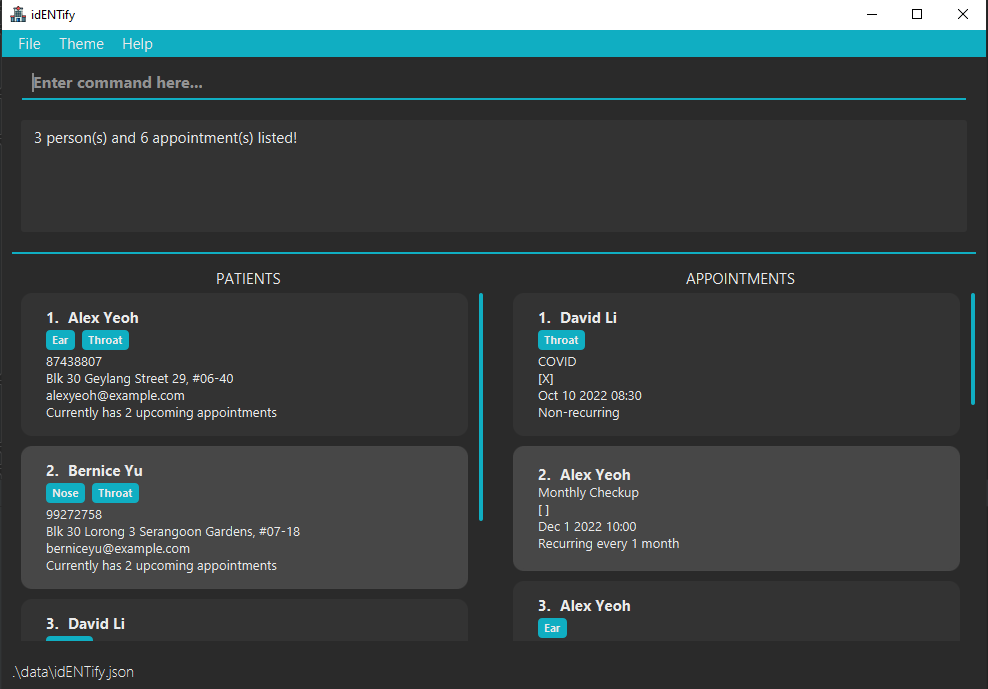

IdENTify is a **desktop app for managing contacts, optimized for use via a Command Line Interface** (CLI) while still having the benefits of a Graphical User Interface (GUI). If you can type fast, idENTify can get your contact management tasks done faster than traditional GUI apps.

* Table of Contents
{:toc}

## Features

<div markdown="block" class="alert alert-info">

**:information_source: Notes about the command format:**<br>

* Words in `UPPER_CASE` are the parameters to be supplied by the user.<br>
  e.g. in `add n/NAME`, `NAME` is a parameter which can be used as `add n/John Doe`.

* Items in square brackets are optional.<br>
  e.g `n/NAME [t/TAG]` can be used as `n/John Doe t/friend` or as `n/John Doe`.

* Items with `…`​ after them can be used multiple times including zero times.<br>
  e.g. `[t/TAG]…​` can be used as ` ` (i.e. 0 times), `t/friend`, `t/friend t/family` etc.

* Parameters can be in any order.<br>
  e.g. if the command specifies `n/NAME p/PHONE_NUMBER`, `p/PHONE_NUMBER n/NAME` is also acceptable.

* If a parameter is expected only once in the command but you specified it multiple times, only the last occurrence of the parameter will be taken.<br>
  e.g. if you specify `p/12341234 p/56785678`, only `p/56785678` will be taken.

* Extraneous parameters for commands that do not take in parameters (such as `help`, `list`, `exit` and `clear`) will be ignored.<br>
  e.g. if the command specifies `help 123`, it will be interpreted as `help`.

</div>

### Viewing help : `help`

Shows a message explaning how to access the help page.


Format: `help`


### Adding a person: `add`

Adds a patient into idENTify.

Format: `Format: add n/NAME p/PHONE_NUMBER a/ADDRESS [e/EMAIL] [t/TAG]…​`

<div markdown="span" class="alert alert-primary">:bulb: **Tip:**
A person can have any number of tags (including 0)
</div>

Examples:
* `add n/John Doe p/98765432 a/John street, block 123, #01-01`
* `add n/Betsy Crowe p/88888888 a/Newgate Prison t/e`

### Listing all patients/appointments : `list`

Shows a list of all patients or appointments, depending on the parameter given.

Format:
* `list patients`
* `list appts`


### Editing a patient : `edit patients`

Edits an existing patient in idENTify.

Format: `edit patients INDEX [n/NAME] [p/PHONE] [e/EMAIL] [a/ADDRESS] [t/TAG]…​`

* Edits the patient at the specified `INDEX`. The index refers to the index number shown in the displayed patient list. The index **must be a positive integer** 1, 2, 3, …​
* At least one of the optional fields must be provided.
* Existing values will be updated to the input values.
* When editing tags, the existing tags of the person will be removed i.e adding of tags is not cumulative.
* You can remove all the patient’s tags by typing `t/` without
    specifying any tags after it.

Examples:
*  `edit patients 1 p/91234567 e/johndoe@example.com` Edits the phone number and email address of the 1st patient to be `91234567` and `johndoe@example.com` respectively.
*  `edit patients 2 n/Betsy Crower t/` Edits the name of the 2nd patient to be `Betsy Crower` and clears all existing tags.

### Editing an appointment: `edit appts`

Edits an existing patient's appointment in idENTify.

Format: `edit appts INDEX [r/REASON] [d/DATE] [pe/TIMEPERIOD]`

* Edits the appointment at the specified `INDEX`. The index refers to the index number shown in the displayed appointment list. The index **must be a positive integer** 1, 2, 3, …​
* At least one of the optional fields must be provided.
* Existing values will be updated to the input values.

Examples:
* `edit appts 1 r/Cough d/2022-12-10 16:30` Edits the reason and date of the first appointment to be `Cough` and `2022-12-10 16:30`
respectively. Existing time period will not be edited.
* `edit appts 1 pe/1Y2M` Edits the time period of the first appointment to be recurring every 1 year 2 months. Existing reason and date will not be edited.


### Hiding patients by name or tag: `hide patients`

####By name:
Filters out (hides) patients whose names contain any of the given keywords.

Format: `hide patients KEYWORD [MORE_KEYWORDS]`

Examples:
* `hide patients John` hides `john` and `John Doe`
* `hide patients alex david` hides `Alex Yeoh`, `David Li`<br>

####By tag:

Hides patients whose names contain any of the given tags.

Format: `hide patients t/TAG [MORE_TAGS]`

* The search is case-insensitive. e.g `FRIENDS` will match `friends`
* All tags of a patient are searched.

Examples:
* `hide patients t/friends colleagues` hides all patients with a friends OR colleagues tag.

### Find results that satisify an input criteria: `find`
Finds patients and appointments that matches all the given criteria specified.

Format: `find [n/NAME] [p/PHONE] [e/EMAIL] [a/ADDRESS] [t/TAG]…​ [r/REASON] [ds/DATE_START] [de/DATE_END]`

* At least 1 of the optional fields must be provided.
* The search is case-insensitive. e.g `hans` will match `Hans`
* The order of the keywords does not matter. e.g. `Hans Bo` will match `Bo Hans`
* Only the name is searched.
* Only full words will be matched e.g. `Han` will not match `Hans`
* Persons matching at least one keyword will be hidden (i.e. `OR` search).
  e.g. `Hans Bo` will hide `Hans Gruber`, `Bo Yang`
* `[n/NAME]`, `[p/PHONE]`, `[e/EMAIL]`, `[a/ADDRESS]` and `[t/TAG]…​` are fields to find information about the patient (patient criteria).
  * `[n/NAME]` searches for the name of the patients.
  * `[p/PHONE]` searches for the phone number of the patients.
  * `[e/EMAIL]` searches for the email of the patients.
  * `[a/ADDRESS]` searches for the address of the patients.
  * `[t/TAG]…` searches for matching tags of the patients.
* `[r/REASON]`, `[ds/DATE_START]`, `[de/DATE_END]` are fields to find information about appointments (appointment criteria).
  * `[r/REASON]` searches for appointments with the given reason.
  * `[ds/DATE_START]` searches for appointments occuring at or after `DATE_START`.
  * `[ds/DATE_END]` searches for appointments occuring at or before `DATE_END`.
* Only patients and appointments that satisifies all criteria will be displayed.
  * A patient must satisify all patient criteria and have at least 1 appointment that satisifies all the appointment criteria to be displayed.
  * An appointment must satisify all appointment criteria and belong to a patient that satisifes all the patient criteria to be displayed.
* All fields except `[ds/DATE_START]`, `[de/DATE_END]` and `[t/TAG]` supports partial match.
  * e.g When finding names, searching `John Do` will match someone named `John Doe`.
* For `[t/TAG]` fields, only tags with a full match will be matched
  * e.g Finding a tag `Cough` will not match a tag labelled `Coughing`.
* `[ds/DATE_START]` must be a date equal to or before `[ds/DATE_END]`.

Examples:
* `find n/John p/12345` displays all patients with `John` in their names and `12345` in their phone numbers, as well as all their appointments.
* `find ds/2020-01-01 00:00` displays all appointments occuring at or after 1st of January 2020. It will also display all patients with at least one of said appointments.
* `find a/Clementi r/Sleep Apena` displays all patients whose address contains `Clementi` and has at least 1 appointment containing `Sleep Apena` as its reason. It will also only display appointments containing `Sleep Apena` of said patients.
* `find t/throat` returns `Bernice Yu` and `David Li`, both of which contains the `Throat` tag. <br>
  

### Deleting a person : `delete`

Deletes a patient or a range of patients from idENTify.

Format: `delete INDEX [endIndex]`

* Deletes the person at the specified `INDEX`.
* The index refers to the index number shown in the displayed person list.
* The index **must be a positive integer** 1, 2, 3, …​

Examples:
* `list patients` followed by `delete 2` deletes the 2nd person in idENTify.
* `delete 1 3` deletes the first 3 patients (index 1 to 3 inclusive) in idENTify
* `find Betsy` followed by `delete 1` deletes the 1st person in the results of the `find` command.

### Add an appointment:  `book`

Books an appointment for the specified patient at INDEX with a given REASON, DATE and an optional TIME PERIOD.

Appointments added are sorted according to their date.

Format: `book INDEX r/REASON d/DATE [pe/TIME PERIOD]`

* The index refers to the index number shown in the displayed patient list.
* The index must be a positive integer 1, 2, 3, …​
* Dates should be inputted in a YYYY-MM-DD HH:MM format or HH:MM YYYY-MM-DD format.
* Input a time period for the appointment to be recurring, default time period is set to 0Y0M0D otherwise.
* Input at least a Y, M or D value for the time period. Values **must be in the range of** 0-10Y, 0-12M or 0-31D to be considered as valid.

Examples:
* `book 2 r/Ear Infection d/2022-12-31 18:00`
* `book 2 r/Ear Infection d/16:30 2022-12-31 pe/1M2D`
* `book 2 r/Ear Infection d/2022-12-31 13:00 pe/1Y`

### Mark an appointment as completed:  `mark`

Marks a specified appointment in the appointment list as complete.

If the specified appointment was set to be recurring, automatically books a new appointment that will occur after the time period specified.

Format: `mark APPOINTMENT_INDEX`

* `APPOINTMENT_INDEX` refers to the index number of the appointment to be marked, as shown in the appointment list.
* Value of `APPOINTMENT_INDEX` **must be a positive integer** 1, 2, 3, …​

Examples:
* `mark 3`

### Unmark an appointment as incomplete:  `unmark`

Unmarks a specified appointment in the appointment list as incomplete.

Format: `unmark APPOINTMENT_INDEX`

* `APPOINTMENT_INDEX` refers to the index number of the appointment to be unmarked, as shown in the appointment list.
* Value of `APPOINTMENT_INDEX` **must be a positive integer** 1, 2, 3, …​

Examples:
* `unmark 1`

### Cancel an appointment: `cancel`
Cancels a specified appointment in the appointment list. <br>
Format: ```cancel APPOINTMENT_INDEX```
- Deletes the appointment with `APPOINTMENT_INDEX` in the appointment list.
- The index refers to the index number shown in the displayed appointment list.
- The index must be a positive integer 1, 2, 3, …​

Examples:
* `cancel 1`

### Clearing all entries : `clear`

Clears all entries from idENTify.

Format: `clear`

### Exiting the program : `exit`

Exits the program.

Format: `exit`

### Saving the data

AddressBook data are saved in the hard disk automatically after any command that changes the data. There is no need to save manually.

### Editing the data file

IdENTify data are saved as a JSON file `[JAR file location]/data/addressbook.json`. Advanced users are welcome to update data directly by editing that data file.

<div markdown="span" class="alert alert-warning">:exclamation: **Caution:**
If your changes to the data file makes its format invalid, idENTify will discard all data and start with an empty data file at the next run.
</div>

--------------------------------------------------------------------------------------------------------------------

## Command summary

Action | Format, Examples
--------|------------------
**Add** | `add n/NAME p/PHONE_NUMBER a/ADDRESS [e/EMAIL] [t/TAG]…​` <br> e.g., `add n/James Ho p/22224444 a/123, Clementi Rd, 1234665`
**Clear** | `clear`
**Delete** | `delete INDEX`<br> e.g., `delete 3`
**Find** | `find [n/NAME] [p/PHONE] [e/EMAIL] [a/ADDRESS] [t/TAG]…​ [r/REASON] [ds/DATE_START] [de/DATE_END]`<br> e.g., `find n/Joshua e/Josh@example.com r/Tinnitus`
**Book** | `book INDEX r/REASON d/DATE [pe/TIME PERIOD]` <br> e.g., `book 2 r/Ear Infection d/2022-12-31 18:00 pe/1Y`
**Mark** | `mark APPOINTMENT_INDEX` <br> e.g. `mark 3`
**Unmark** | `unmark APPOINTMENT_INDEX` <br> e.g. `unmark 1`
**Cancel** | `cancel APPOINTMENT_INDEX` <br> e.g., `cancel 2`
**Edit Patient** | `edit patients INDEX [n/NAME] [p/PHONE] [e/EMAIL] [a/ADDRESS] [t/TAG]…​` <br> e.g., `edit patients 1 n/Bernice Yu`
**Edit Appointment** | `edit appts INDEX [r/REASON] [d/DATE] [pe/TIME PERIOD]` <br> e.g., `edit appts 1 r/Cough`
**List** | `list patients` <br> `list appointments`
**Help** | `help`
**Exit** | `exit`
