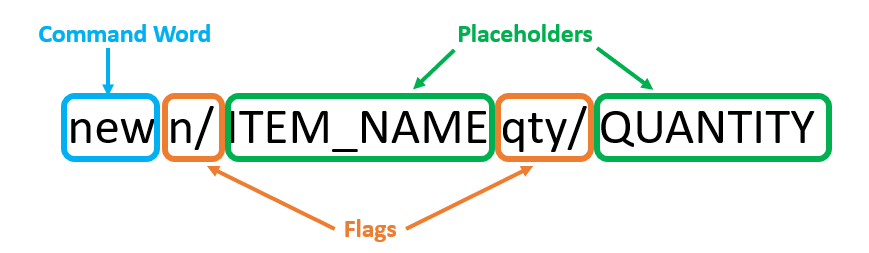

## About

We want you to spend less time keeping track of perishable goods in your daily operations. FoodRem is a command line application that enables you to efficiently record, update and categorise food items. It is a convenient administrative tool that can answer the following questions in a flash:

* What food items are about to expire?
* How much of each condiment do I have?
* Which food items are newly purchases?
* ...and many more!

With a few quick commands, you can have complete control of your perishable goods, so you can focus on what is important: serving your customers, improving menu recipes, and transforming your business into the next success story.

## Key Features

1. Add, update and delete inventory items
1. Search and sort food items by:
   * Name
   * Quantity
   * Bought date
   * Expiry date
   * Tags
1. Tag items to group them into categories

## Purpose, Scope and Audience

### Purpose

FoodRem helps small businesses to easily manage consumables and perishable goods within a single inventory to reduce time spent on managing and restocking inventory.

### Scope

This app is targeted at small F&B businesses which may struggle in inventory management due to a lack of streamlined process and manpower.

### Audience

This guide is targeted at users using FoodRem who wants to find out more about the different commands to manage their inventory in a quicker and more efficient manner.

Readers do not have to be familiar with the command line to use this guide effectively.
The only expectation we have of you is to carefully read through the different sections.

 <!-- Force a page break -->



## How to use the User Guide

Thank you for choosing FoodRem! We are delighted to have you as a user and aim to serve you well!

If this is your first time using FoodRem, start off with the [Quick Start](#quick-start) section.
This guides you on how to install FoodRem.

We **highly recommend** that you read through the User Guide in a **sequential order** up until the section
[Features](#features), where you can find all the information you need before using all command.

If you are a new user to FoodRem, you can head over to the section about [Using FoodRem](#using-foodrem) which will teach you the basics of FoodRem. This includes: 

* Introducing you to the general [command format](#command-formats).
* [Flags](#flags) and [Placeholders](#placeholders) where you can find:
  * Important syntax you will come across while reading the User
    Guide such as `n/`, `bgt/` or `INDEX`, `ITEM_NAME`.
  *  The description of these syntax and how to use them
* [Trying out](#trying-your-first-command) a command.

If you are an experienced user, you can refer to the [Command Summary](#command-summary) to get an overview of all the currently supported FoodRem commands.

Here are some icons you may encounter in FoodRem and what they mean:

* ℹ️ : additional info
* ❗ : warning

`Words or phrases in code blocks like this` refer to user input.

If you are stuck, refer to [Troubleshooting](#troubleshooting) or [FAQ](#faq).
You can refer to [Glossary](#glossary) that contains definitions of some commonly used words in FoodRem

## Quick Start



## Using FoodRem
Here is an overview of what FoodRem consists of and how you can perform a command.
## Items and Tags



### Command Formats

You will encounter FoodRem commands throughout this User Guide.
Before you delve into the different commands in [Features](#features), let’s learn what a command consists of.

Here is an example:

A command consists of:
1. Command word to tell FoodRem what action you wish to do, These actions are covered in [Features](#features)
2. [Flags](#flags) to distinguish parameters
3. [Placeholders](#placeholders) that you can replace with your parameter inputs

### Flags

Flags are delimiters that enable FoodRem to distinguish different parameters without ambiguity.

| Flags | Related Placeholder   |
|-------|-----------------------|
| id/   | INDEX                 |
| n/    | ITEM_NAME TAG_NAME |
| qty/  | QUANTITY              |
| unit/ | UNIT                  |
| buy/  | BOUGHT_DATE           |
| exp/  | EXPIRY_DATE           |
| p/    | PRICE                 |
| r/    | REMARKS               |

### Placeholders

Placeholders are words in UPPER_CASE to show you what parameters you can supply to a command.



### Trying your First Command



## Features



## Command Summary

### Item Commands



### Tag Commands



### Other Commands



## Troubleshooting

Something goes here...

## FAQ



## Future Extensions

(NOT COMPLETED)

1. **Food expiring soon / Date food bought**

1. **Glorified search and sort**

   1. Upgrade sort and search
   1. Sort food items by quantity
   1. Sort food items by name
   1. Sort food items by expiry date
   1. Sort food items by purchase date
   {: .lower-alpha}

1. **Food buffer**

   1. Rainbow UI / Dashboard
   1. Optional : Minimum acceptable quantity
   1. Optional : Percentage of stock expiring
   {: .lower-alpha}

1. **Purchasing (Hard -> Will not see benefit immediately)**

   1. History + Statistics
   1. Inventory need a price of items
   {: .lower-alpha}

1. **(Last priority) Order management**

   1. Grouping of items
   1. Creation of menu with specific items
   1. Record menu items bought
   1. Statistics
   {: .lower-alpha}

## Acknowledgements

FoodRem is a brownfield software project based off [AddressBook3](https://se-education.org/addressbook-level3/), taken under the [CS2103T Software Engineering module](https://nus-cs2103-ay2223s1.github.io/website/index.html) held by the School of Computing at the National University of Singapore.

## Glossary


