Welcome to the NotionUS user guide! 

**NotionUS** is a lightweight but powerful application that can help you to manage your assignments and tasks. It sports 
a sleek and minimalist design which allows you to clearly see your outstanding tasks at a glance. It provides a command
line user interface which aids fast typists in managing their assignments quickly, while still providing the benefits of
a graphical user interface.

|   If you are   |                                         You should                                         |
|:--------------:|:------------------------------------------------------------------------------------------:|
|   a new user   | proceed to our [quick start](#quick-start) section to set up NotionUS and try its features |
| returning user |       skip to our [command summary](#command-summary) for a summary of our features!       |

* Table of Contents
{:toc}

--------------------------------------------------------------------------------------------------------------------
## Quick start

1. Ensure you have Java `11` or above installed in your Computer.
   1. To check if you have Java installed, please open up a terminal (search for `Command Prompt` on Windows and 
      `Terminal` on Mac OS) and type in `java -version`. This will show your java version, if you have it installed.
   2. If you do not have Java 11 or above installed, please proceed to this [link](https://www.oracle.com/java/technologies/downloads/#java11)
      and download the appropriate Java for your operating system.

2. Download the latest NotionUS.jar from [here](https://github.com/AY2223S1-CS2103T-F12-3/tp/releases/).

3. Move the file to the folder you want to use as the home folder for NotionUS. Note that a new folder will be created
   in the same location as the file, which will contain the application data.

4. Double-click the file to start the app. The app should look like the image below, and have some sample data has been pre-loaded to experiment with.

    

### Understanding the Graphical User Interface (GUI)

Understanding the GUI is essential to making the most out of your experience in the app.

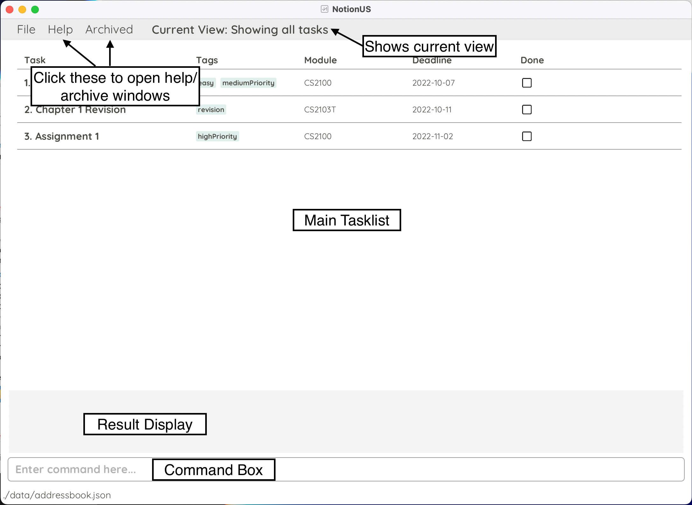

From top to bottom:
1. `Help` and `Archived` Buttons:
    * Click `Help` to open the help menu which will display a list of example commands and a link to our user guide.
    * Click `Archived` to open the archived tasks window, which shows any previously archived tasks.

2. Filter status display:
    * This displays any filters applied on the list using commands such as `ls` or `find`, for more information
      please refer to **Feature** section below.

3. Main tasklist:
    * This displays all your *current* tasks.

4. Result display:
    * The result display displays any information regarding command inputs, such as success or err    rs.

5. Command box:
    * This is where you enter commands to control the app.

To learn more about other GUI Features, click [**here**](#gui-features).

Now that you understand the GUI, lets try inputting a command into the app!

Try typing the command `ls --module CS2103T` in the “Enter command here...” box and press “ENTER” to execute the command.

:bulb: **What does this command do?**
Lists all tasks associated with the module `CS2103T`.

The GUI should be updated as shown below:

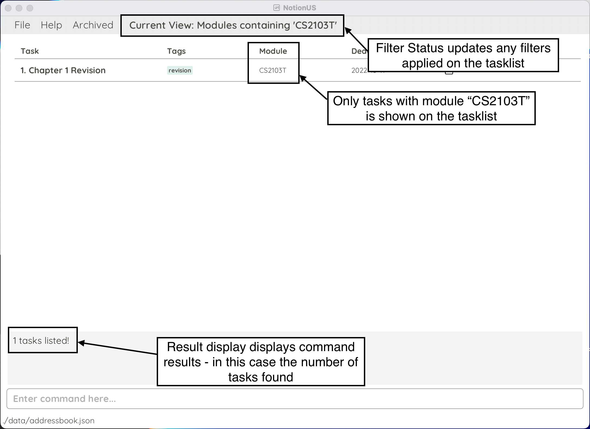

   Some other example commands you can try:
   - `add -n Tutorial 3 -m CS2103T -d 2022-10-10`:
     Adds a task called `Tutorial 3` for the module `CS2103T` with the deadline `2022-09-16` into the task list.
   - `mark 1` :
     Marks the first task in the list as complete.
   - `delete 2` : 
     Deletes the second task in the list.
   - `edit 3 -n Assignment 2` : 
     Changes the name of the third task in the list to `Assignment 2`.
   - `find tutorial` :
     Finds anything with the keyword 'tutorial' (not case-sensitive or strictly matched words)

   You can also continue reading the [**command features**](#command-features) section to read more about how to use each command!

--------------------------------------------------------------------------------------------------------------------

## GUI Features

#### Autocomplete

When the user starts to type in the start of a command, a popup menu will appear with options to complete your input.
Use the `up` and `down` arrow keys to navigate through the options and `Enter` to fill the command box with the command
of your choice.

Here is an example of autocomplete in action:

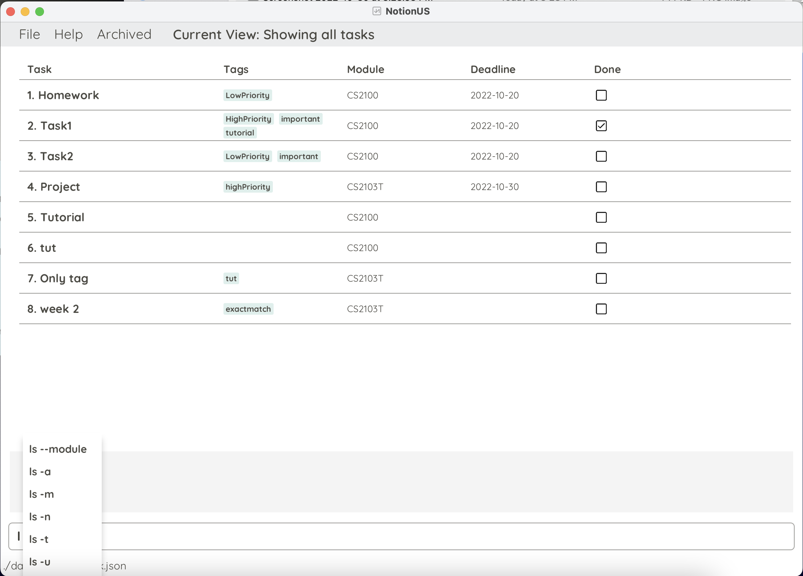

However, it is recommended to read through the features section to understand the syntax for commands that require additional input.

#### Returning to a previous command : `up`/`down` keys
Loads previous command into the _Command Box_.
While the _Command Box_ is in focus, use the `Up` and `Down` arrow keys to navigate through the command history that is automatically loaded in.

--------------------------------------------------------------------------------------------------------------------

## Command Features

Before proceeding, do make sure that you can understand our notation for command formats:

**:information_source: Notes about the command format:**

* Words in `lower_case` are commands or flags to be typed as-is 
  * e.g. in `ls -t TAG_NAME`, `ls -t` must be typed as-is and is case-sensitive 
* Words in `UPPER_CASE` are values of parameters to be supplied by the user
  * e.g. in `ls -d DATE`, `DATE` refers to the value of the `-d` parameter supplied to the `ls` command 
* Words in `[Square brackets]` are optional parameters 
  * e.g. in `add -n TASK_NAME -m MODULE [-d DATE] [-t TAG_NAME]*`, `[-d DATE]` and `[-t TAG_NAME]*` can be omitted 
* Words that are followed by `*` are parameters that can be used multiple times
  * e.g. in `tag TASK_NUMBER (-t TAG_NAME)*`, `-t TAG_NAME` can be included multiple times
* Command parameters (e.g. `-a`, `-m`) can be made in any order
  * e.g. `ls -u --module CS2103T` and `ls --module CS2103T -u` will give the same result
* If a parameter is expected only once in a command but was specified multiple times, the last occurrence of it will be taken
  * e.g. if you enter `edit 1 -d 2022-10-22 -d 2022-10-30`, this will be interpreted as `edit 1 -d 2022-10-30`
* Extraneous parameters for commands (i.e. `help`, `showarchive`, etc.) or flags (i.e. `-a`, `-u`, etc.) that do not take in parameters will be ignored
  * e.g. if you enter `showarchive 2103`, this will be interpreted as `showarchive`

**:information_source: Additional information about task constraints:**

* Task names can only contain letters, numbers and spaces. For example, `Assignment-5` is not a valid name as it
  contains a hypen.
* Dates must be written in the format YYYY-MM-DD, eg `2022-10-30`.
* Module names and tags can only contain letters and numbers, no spaces allowed.

* Commands that filter for names find names that **contain** the keyword. (`ls -n`, `find`) 
* Commands that filter for tags find tags that **match** the keyword. (`ls -t`, `find`)

### Getting help : `help`

Displays list of commands and information about NotionUS.

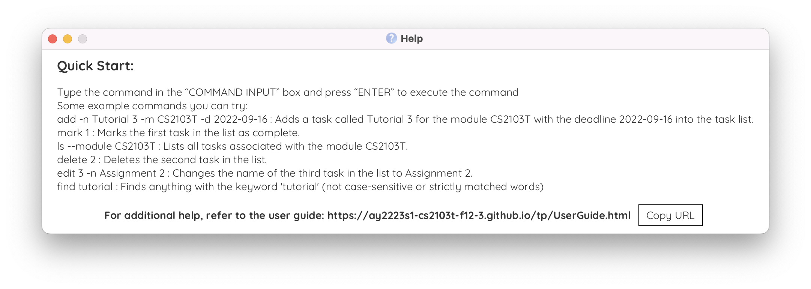

Format: `help`

:bulb: **Tip:**
Shortcut key: <kbd>F1</kbd> 

### Adding a task: `add`

Adds a task to the task list.

Format: `add -n TASK_NAME -m MODULE [-d DATE] [-t TAG_NAME]*`

**Reminder**: Params in `[]` are **optional**, and `-t TAG_NAME` can be used multiple times.

Notes about usage of the add command:
* **Duplicate detection** - If you try to add in a task with the same name and module as an existing task,
  we will inform you that such a task already exists within the task list and reject your command
* **Optional deadlines** - Tasks with no deadlines are treated as being due "far in the future", meaning they
  will be placed at the end of the task list.
* **Ordering of tasks** - Tasks are first ordered by their deadlines, followed by the module name and then the task
  name, in alphabetical order.

Examples:
* `add -n Task 1 -m CS2103T -d 2022-10-15 -t homework`
* `add -n Tutorial 3 -m CS2103T`
* `add -n Tutorial 12 -m CS2103T -d 2022-10-28 -t tutorial`

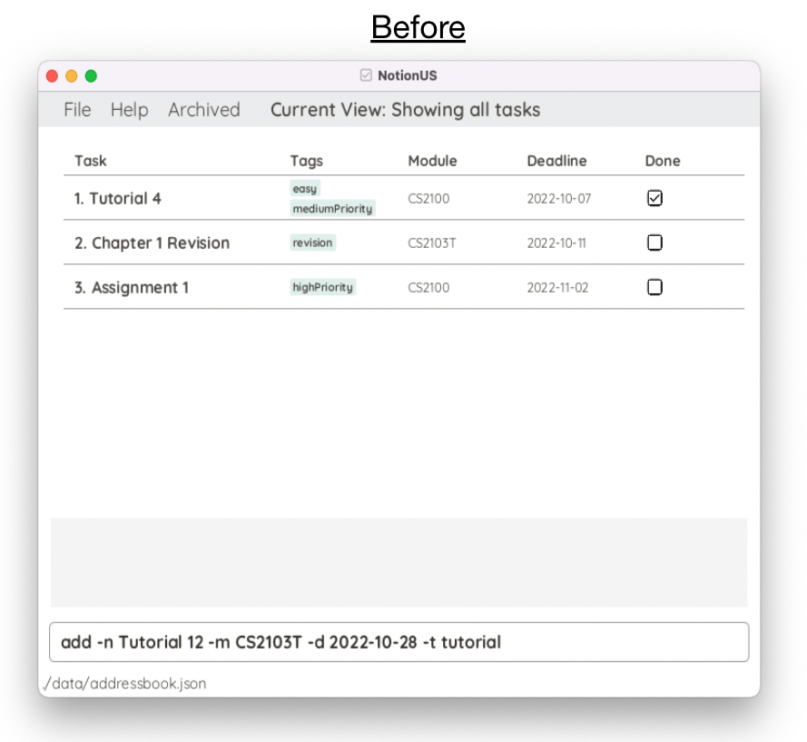
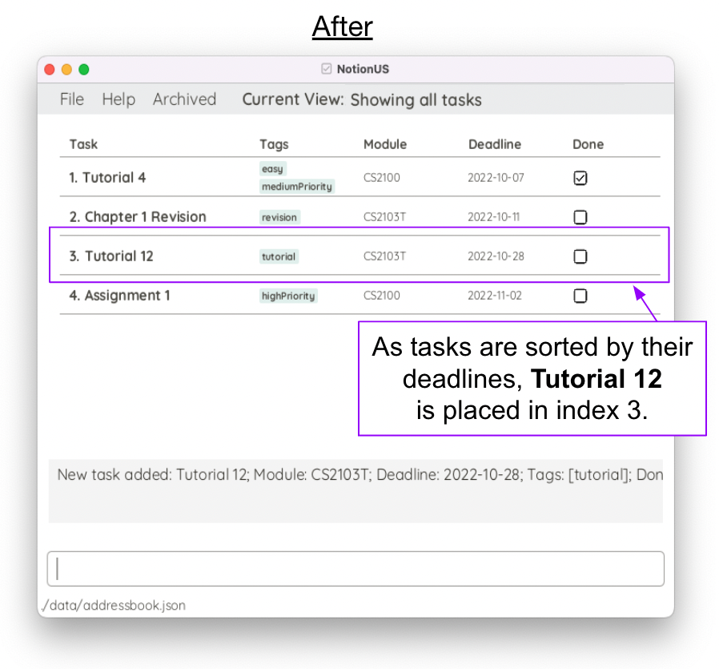

### Editing a task : `edit`

Edits an existing task in the task list, at least one field needs to be edited.

Format: `edit TASK_NUMBER [-n TASK_NAME] [-m MODULE] [-d DATE] [-t TAG_NAME]*`

**Reminder**: Params in `[]` are **optional**, and `-t TAG_NAME` can be used multiple times.

Notes about usage of the edit command:
* **Duplicate detection** - If you try to edit the task such that it will have the same name and module as another task,
  we will inform you that such a task already exists within the task list and reject your command
* **Deadline removal** - Run the edit command with `-d` without specifying a date, eg `edit 1 -d`.
* **Tags deletion** - Similar to above, run the edit command with `-t` without specifying a tag, eg `edit 3 -t`

Examples:
* `edit 1 -t revision -n Recitation` Edits the tag to "revision" and taskName to "Recitation".

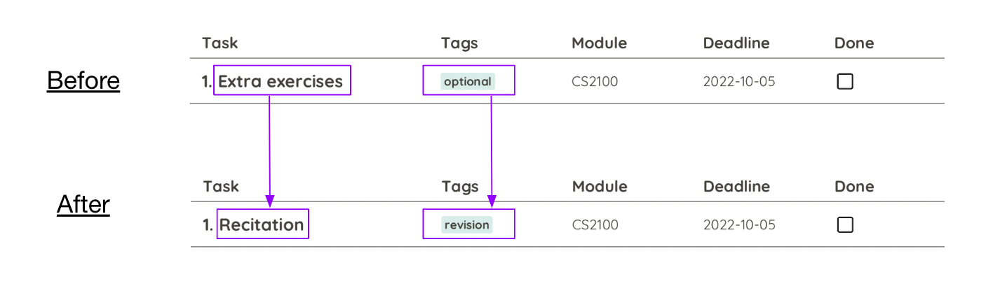

### Deleting a task : `delete`

Allows user to delete a task from task list.

Format: `delete TASK_NUMBER`

Examples:
* `delete 3`
    * Deletes third task in the task list.
    * Remaining tasks’ `TASK_NUMBER` will be automatically updated.

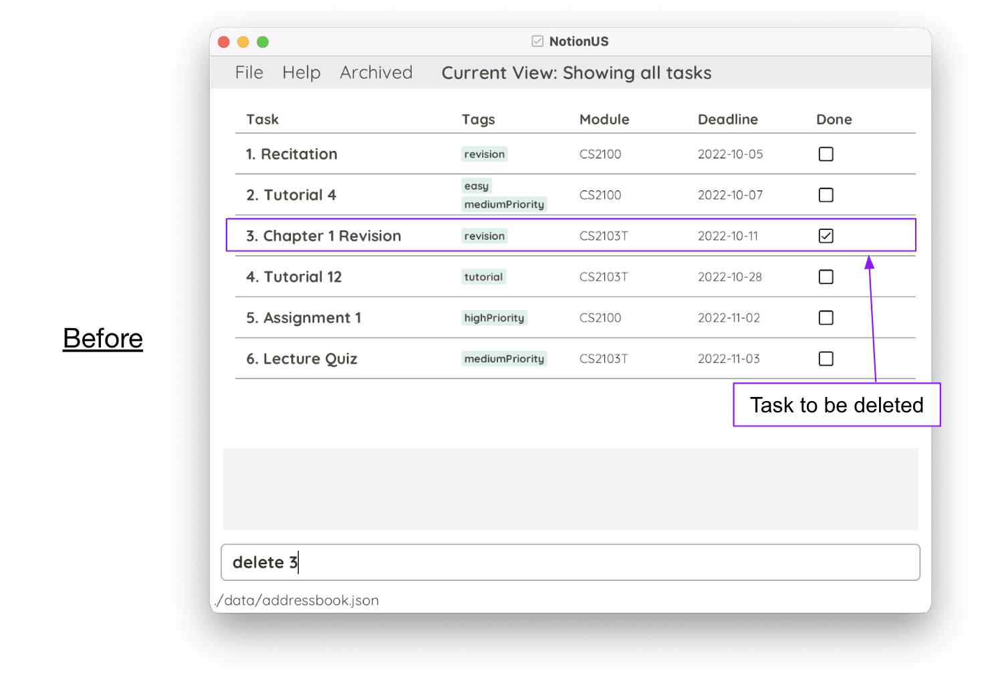
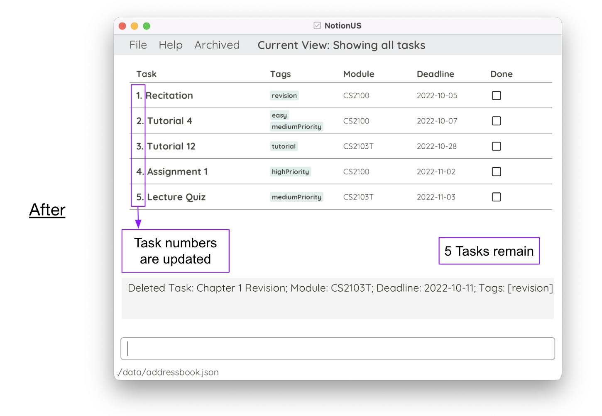

### Marking a task as completed: `mark`

Mark a task as complete.

Note: Using `mark` on a task already marked as complete will not change its completion status.

Format: `mark TASK_NUMBER`

Example: `mark 2`

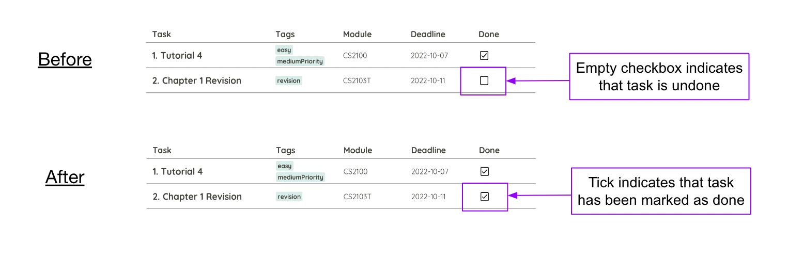

### Unmarking a task: `unmark`

Unmark a task, ie mark a task as incomplete.

Note: Using `unmark` on a task that is not complete will not change its completion status.

Format: `unmark TASK_NUMBER`

Example: `unmark 2`

### Tagging a task: `tag`

Allows you to tag a task.

Format : `tag TASK_NUMBER (-t TAG_NAME)*`
* `TASK_NUMBER`: This is the number of the task currently displayed.
* `TAG_NAME`: The word to tag the task with, should be alphanumeric, i.e. must not contain any spaces.
* `(-t TAG_NAME)`: You may add more than one tag by adding `-t TAG_2` after your first tag.

Example: `tag 1 -t optional`

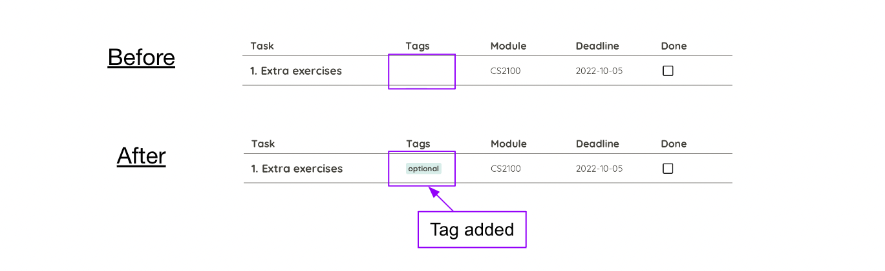

### Clearing all entries : `clear`

Clears all entries of tasks in the task list.

Format: `clear`

### List : `ls`

`ls` commands filter the task list. There are multiple ways to filter the task list, such as
listing all tasks, unmarked tasks, all tasks under a module name, etc. You may apply multiple list flags in one
command to filter a list down to the results you are looking for. To reset the list, use the command `ls -a`.

:exclamation: **Caution:** 
* Any command that searches for names finds all task names that contain the keyword and does not have to be an exact match.
* It is also case-insensitive.
* Any command that searches for tags finds all tags that exactly match, but is also case-insensitive.
  

Current filters applied will be shown in the UI at the top bar.

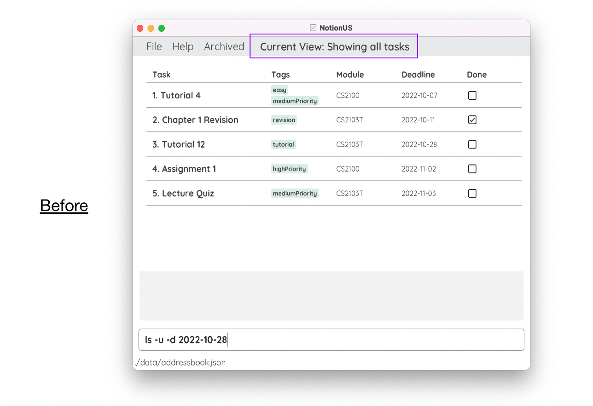
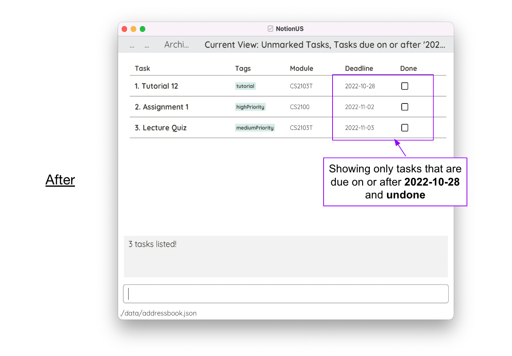

#### Listing all tasks : `ls -a`

Shows a list of all tasks in the task list.

Format: `ls -a`

#### Listing all unmarked tasks : `ls -u`

Shows a list of all unmarked tasks in the task list, i.e. shows a list of uncompleted tasks.

Format: `ls -u`

#### Listing all marked tasks : `ls -m`

Shows a list of all marked tasks in the task list, i.e. shows a list of completed tasks.

Format: `ls -m`

#### Listing all tasks under the same module : `ls --module`

Shows a list of all tasks under the same module.

Format: `ls --module MODULE`
* `MODULE`: Should be alphanumeric, i.e. must not contain any spaces.

Example: `ls --module cs2103t`

#### Listing all tasks containing the same tag : `ls -t`

Shows a list of tasks whose tags match **exactly** with the tag_name. (Case-insensitive)

Format: `ls -t TAG_NAME`

* `TAG_NAME`: The tag you are looking for should be an exact match and alphanumeric, ie must not contain any spaces.

Example: `ls -t highPriority` will find tags with `highpriority` (case-insensitive)

#### Listing all tasks with deadline on or after a date : `ls -d`

Shows a list of all tasks with deadline on or after the inputted date.

As tasks with no deadline can be considered to be due "far in the future", this command will always list tasks with no
deadlines.

Format: `ls -d DATE`
* `DATE`: Must be in the format of YYYY-MM-DD.

Example: `ls -d 2022-11-11`

#### Listing all task names with the matching keywords: `ls -n`

Shows a list of all tasks with matching names.

Format: `ls -n KEYWORD*`
* `KEYWORD`: One or more keywords can be provided. Each keyword should consist of only letters and numbers, and are separated by spaces.

Example: `ls -n task1`

### Find task names or tags: `find`

The `find` command finds the task names that **contain** the keywords and tags which **exactly match** with the 
keywords. Meaning that names does not have to be an exact match (Example: searching `tap` with return a task with a 
task name `tape`). `find` is not case-sensitive.

Format: `find KEYWORD/TAG_NAME*`
* `KEYWORD/TAG_NAME`: One keyword/tag name or multiple, which should be alphanumeric and separated by spaces.

Singular word search example: `find tut`
finds names which contain `tut` and any tag that exactly match `tut`.

Example singular word search: 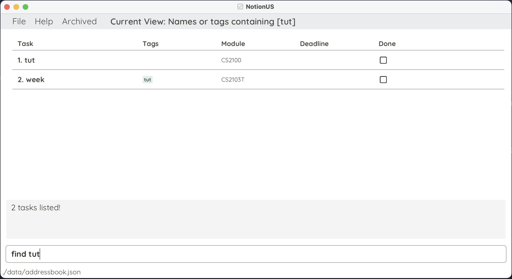

Multiple word search example: `find Week tut`
finds **any** task name that contain keywords `week` or `tut` or **any** tag that match them.
 (Note that it is not limited to only 2 keywords)

Example multiple word search: 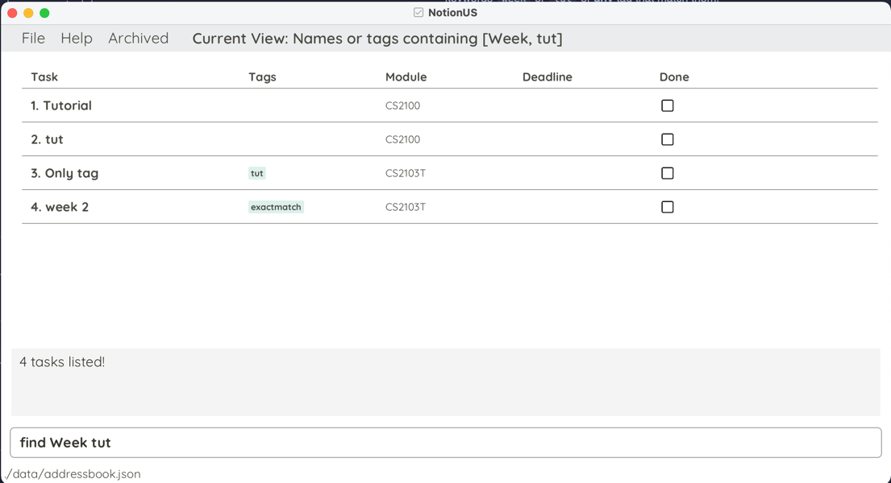
### Archiving data files : `archive`

Allows you to remove a task from task list and store in archived file.

Format: `archive TASK_NUMBER`
* `TASK_NUMBER`: This is the number of the task currently displayed.

Examples:
* `archive 1`: archives first task in task list.

:warning: **NOTE**: 

This command is irreversible!

### View Archived Tasks : `showarchive`

Displays a list of archived tasks.

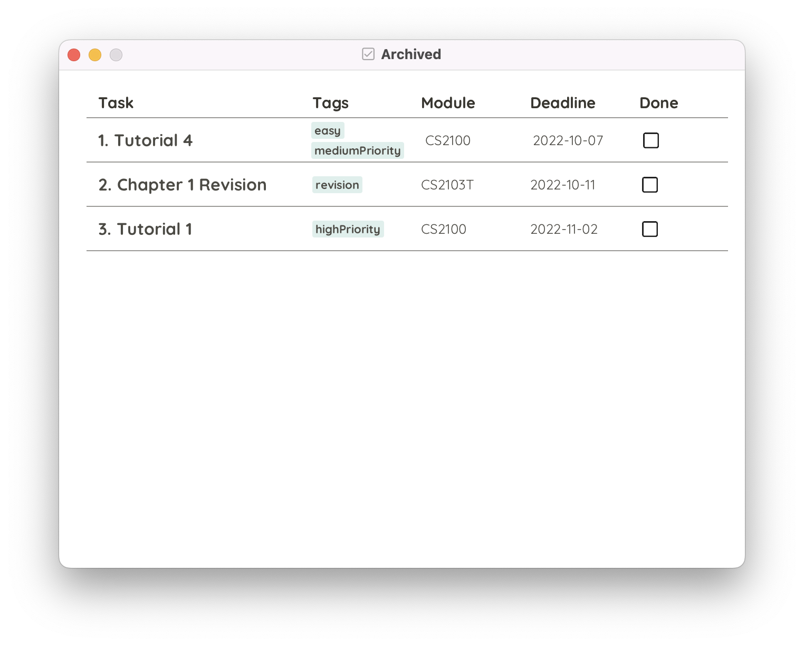

Format: `showArchive`

### Exiting the program : `exit`

Terminates and exits the program.  

Format: `exit`

--------------------------------------------------------------------------------------------------------------------

## Other Features

### Saving the data
NotionUS data are saved in the hard disk automatically after any command that changes the data. There is no need to save manually.

### Editing the data file
NotionUS data are saved as a JSON file `[JAR file location]/data/notionusdata.json`. Advanced users are welcome to update data directly by editing that data file.

**Caution:**
If your changes to the data file makes its format invalid, NotionUS will discard all data and start with an empty data file at the next run.

--------------------------------------------------------------------------------------------------------------------

## FAQ

**Q**: How do I transfer my data in NotionUS to another Computer? 
**A**: Install the app in the other computer and overwrite the empty data file it creates with the file that contains the data of your previous NotionUS home folder.

**Q**: What is the date file fails to load into NotionUS? 
**A**: It is likely that your storage data file is in the wrong format. Do check the log files to see what had happened when launching NotionUS. 

**Q**: What if double-clicking fails to open the jar file? 
**A**: Check that the correct version of java is installed (Java 11) locally on your computer. You may open the terminal and type java -version to check. If it is the wrong version, visit this [page](https://nus-cs2103-ay2223s1.github.io/website/admin/programmingLanguages.html#programming-language) for a guide to install the correct version of java. If you have the correct version of java installed, you may try to launch the app using terminal, open terminal or command prompt and type java -jar NotionUs.jar.  

**Q**: Is internet needed for NotionUS to work? 
**A**: No, NotionUS functions fully without internet connection.

**Q**: What if the application crashes? 
**A**: Please contact us via GitHub issues [here](https://github.com/AY2223S1-CS2103T-F12-3/tp/issues?q=is%3Aissue+is%3Aopen), do provide screenshots of the error or state the error message. We will assist you as soon as possible. 

--------------------------------------------------------------------------------------------------------------------

## Command summary

Format meanings:
* Words in `lower_case` are commands or flags to be typed as-is
* Words in `UPPER_CASE` are values of parameters to be supplied by the user
* Words in `[Square brackets]` are optional parameters (Note:`ls` can stack filters)
* Words that are followed by `*` are parameters that can be used multiple times

| Action                      | Format                                                                                                                                                                                                                                                                                                                                                                                                                                 | Examples                                     |
|-----------------------------|----------------------------------------------------------------------------------------------------------------------------------------------------------------------------------------------------------------------------------------------------------------------------------------------------------------------------------------------------------------------------------------------------------------------------------------|----------------------------------------------|
| **Add** task                | `add -n TASK_NAME -m MODULE [-d YYYY-MM-DD] [-t TAG_NAME]*`                                                                                                                                                                                                                                                                                                                                                                            | `add -n Tutorial 3 -m CS2103T -d 2022-09-16` |
| **Archive** task            | `archive TASK_NUMBER`                                                                                                                                                                                                                                                                                                                                                                                                                  | `archive 1`                                  |
| **Clear** all tasks         | `clear`                                                                                                                                                                                                                                                                                                                                                                                                                                |                                              |
| **Delete** task             | `delete TASK_NUMBER`                                                                                                                                                                                                                                                                                                                                                                                                                   | `delete 3`                                   |
| **Edit** task               | `edit TASK_NUMBER [-n NEW_NAME] [-m NEW_MODULE] [-d NEW_DEADLINE]`                                                                                                                                                                                                                                                                                                                                                                     | `edit 1 -n CS2103T ip`                       |
| **Exit** NotionUS           | `exit`                                                                                                                                                                                                                                                                                                                                                                                                                                 |                                              |
| **Find** task/tag with name | `find KEYWORD/TAG_NAME*`                                                                                                                                                                                                                                                                                                                                                                                                               | `find Tutorial Lab`                          |
| **Help**                    | `help`                                                                                                                                                                                                                                                                                                                                                                                                                                 |                                              |
| **List** specific tasks     | `ls [-a] [-u] [-m] [--module MODULE] [-t TAG_NAME] [-d YYYY-MM-DD] [-n KEYWORD*]` `ls -a` View all tasks `ls -u` View all incomplete tasks  `ls -m` View all marked tasks  `ls --module MODULE` View tasks under the specific module  `ls -t TAG_NAME` View tasks with a specific tag  `ls -d YYYY-MM-DD` View tasks on or after a specific date   `ls -n KEYWORD*` View task names with matching keywords | `ls -n task test --module CS2103T `          |
| **Mark** tasks              | `mark TASK_NUMBER`                                                                                                                                                                                                                                                                                                                                                                                                                     | `mark 2`                                     |
| **Show Archived** tasks     | `showarchive`                                                                                                                                                                                                                                                                                                                                                                                                                          |                                              |
| **Tagging** a task          | `tag TASK_NUMBER (-t TAG_NAME)*`                                                                                                                                                                                                                                                                                                                                                                                                       | `tag 1 -t highPriority -t homework`          |
| **Unmark** tasks            | `unmark TASK_NUMBER`                                                                                                                                                                                                                                                                                                                                                                                                                   | `unmark 2`                                   |
| Accessing previous commands | Use the `Up` and `Down` arrow keys                                                                                                                                                                                                                                                                                                                                                                                                     |                                              |

--------------------------------------------------------------------------------------------------------------------

## Glossary

| Word    | Definition                                                                   |
|---------|------------------------------------------------------------------------------|
| **GUI** | Graphical User Interface - what the user sees when interacting with the app. |
|         |                                                                              |
|         |                                                                              |
|         |                                                                              |

