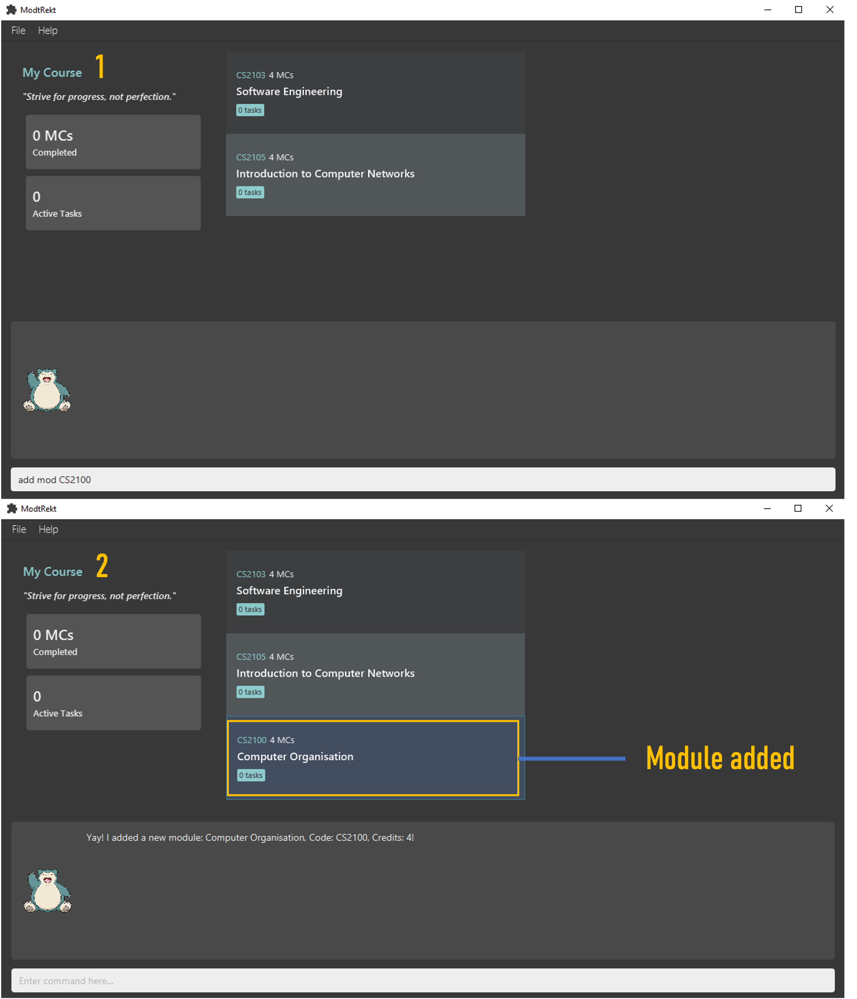
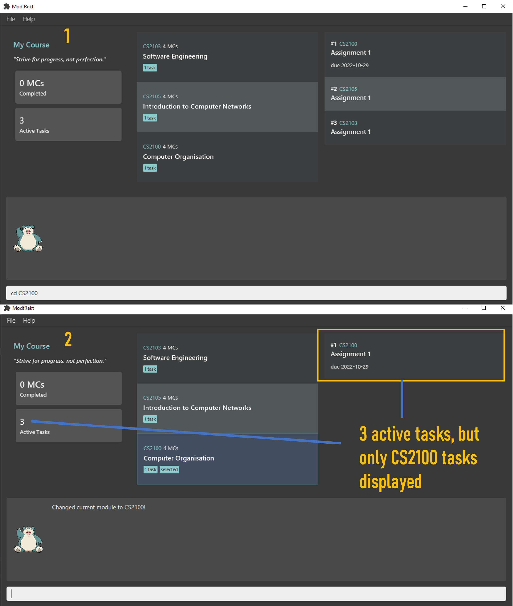
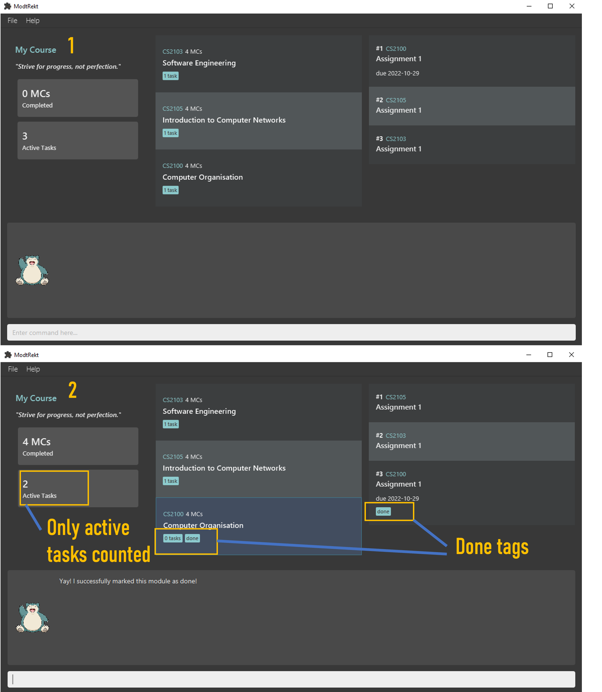
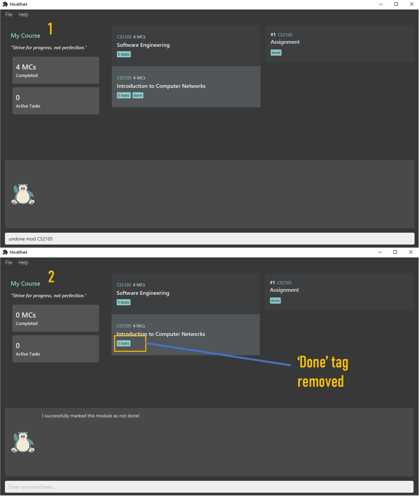
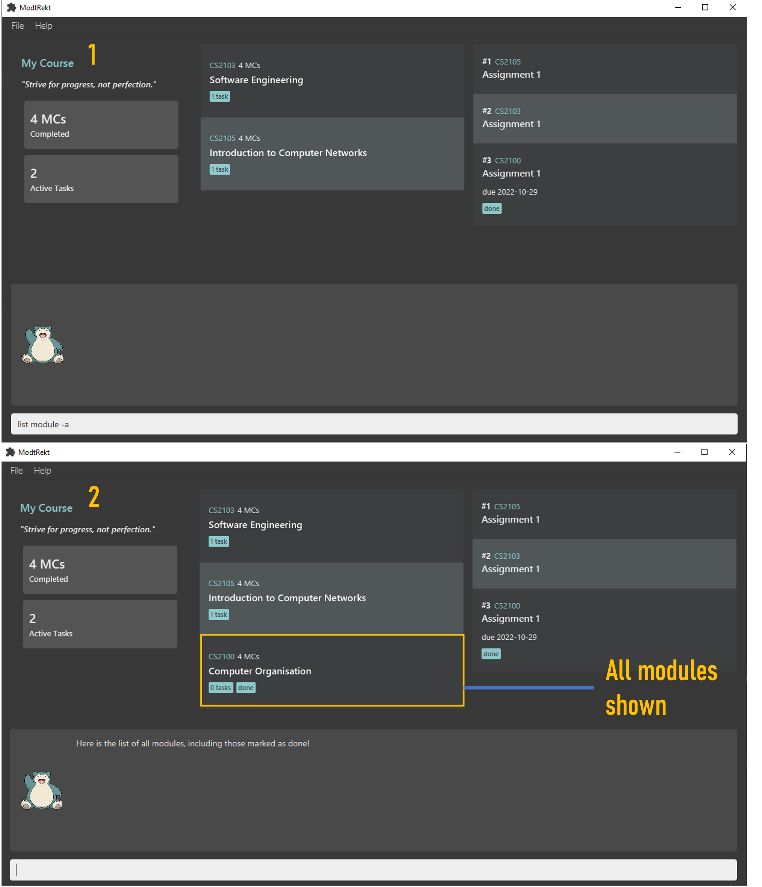
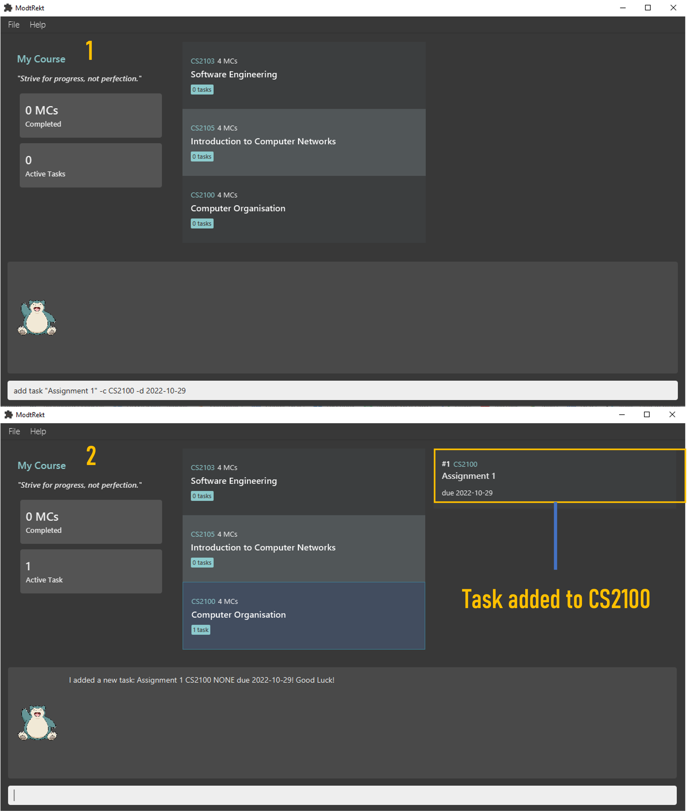

# ModtRekt User Guide

ModtRekt is a **desktop app for managing modules and tasks, optimized for use via a Command Line Interface** (CLI) while still having the benefits of a Graphical User Interface (GUI).

# Table of Contents
- [UI Mockups](#ui-mockups)
- [Quick Start](#quick-start)
- [Features](#features)
- [Command Summary](#command-summary)

## UI Mockups


--------------------------------------------------------------------------------------------------------------------

## Quick Start

1. Ensure you have Java 11 or above installed on your computer.

1. Download the latest `ModtRekt.jar` from [here](https://github.com/AY2223S1-CS2103T-W10-4/tp/releases).

1. Copy the file to the folder you want to use as the home folder for your module tracker.

1. Double-click the file to start the app. The GUI similar to the screenshot above should appear in a few seconds. Note how the app contains some sample data.

1. Type the command in the command box and press `Enter` to execute it. e.g. typing `help` and pressing `Enter` will open the help window.

1.  Here are some example commands you can try:

    1. `list`: Lists all the active tasks.

    1. `add module CS2103T`: Adds a module called CS2103T to the module tracker.

    1. `cd CS2103T`: Sets the current module page to CS2103T.

    1. `add task ip week 6 -d 16/09/2022`: Adds a task called ip week 6, with a deadline of 16/09/2022, to the module tracker.

    1. `remove task 1`: Removes the first task of CS2103T.

    1. `exit` : Exits the app.

    1. Refer to the Features below for details of each command.


--------------------------------------------------------------------------------------------------------------------

## Features

<div markdown="block" class="alert alert-info">

```< >``` for mandatory arguments

```[ ]``` for optional arguments

```" "``` arguments that are more than 1 word need to be enclosed in Quotation Marks

### General
`help`

Shows a message which explains the basic commands and links to the user guide.

`exit`

Exits the application.

### Modules

#### Adding a module: `add module`

Adds a module to the program.

- The module code is case insensitive e.g. `cs2103t` will match **CS2103T**
- Only modules that are on NUSMods can be added with just the module code.
- If module name is added, module code also has to be added and vice versa.
- Module credit must be a numeric and cannot be negative

Format: `add module <module code> [-n <module name> -cr <module credit>]`

Shorthand: `add mod <module code> [-n <module name> -cr <module credit>]`

Examples:
- `add module CS2103T`
- `add mod CS2103T`
- `add mod ST2334 -n "Probability and Statistics" -cr 4`



#### Removing a module: `remove module`

Deletes a module from the program.

- The module code is case insensitive e.g. `cs2103t` will match **CS2103T**
- Module code must match an existing module.

Format: `remove module <module code>`

Shorthand: `rm mod <module code>`

Examples:
- `remove module CS2103T`
- `rm mod CS2103T`


#### Entering a module: `cd`

Sets the current module page to the specified module.

- The module code is case insensitive e.g. `cs2103t` will match **CS2103T**
- Allows user to view information relating to the specified module.
- Scopes the user’s actions to the specified module.
- Module code must match an existing module.

Format: `cd <module code>`

Examples:
- `cd CS2103T`


Example of CDing into a module



Example of CDing back to all modules


#### Marks done a module: `done`

Marks a module as done.

- The module code is case insensitive e.g. `cs2103t` will match **CS2103T**
- After you marked a module as done, this will increment
  the total MC you completed displayed on the left side of the application.
- When you mark a module as done, this will mark all active tasks
  corresponding to the module as done.

Format: `done module <module code>`

Shorthand: `done mod <module code>`

Examples:
- `done module CS1101S`



#### Marks undone a module: `undone`

Marks a module as undone.

- The module code is case insensitive e.g. `cs2103t` will match **CS2103T**
- After you unmarked a module, this will decrement
  the total MC you completed displayed on the left side of the application.
- Unmarking a module will not affect its tasks. (Corresponding tasks will not be undoned)

Format: `undone module <module code>`

Shorthand: `done mod <module code>`

Examples:
- `undone module CS1101S`



#### Listing all modules: `list module`

Lists all the modules added by the user.

- Using the command without `-a` tag will show you all active modules.
- Using the command with `-a` tag will show you all modules, including those marked as done.

Format: `list module [-a]`

Shorthand: `ls module [-a]`, `list mod [-a]`, `ls mod [-a]`

Examples:
- `list module -a`



#### Editing modules: `edit module`

Changes current parameters of selected module.

- The module code is case insensitive e.g. `cs2103t` will match **CS2103T**
- Targeted module code must exist in the module list
- New module code must not already exist in the module list
- All tasks associated with the module would change to the new module code after editing the module
- New module credit must be numeric and cannot be negative
- The order of optional tags does not matter

Format: `edit module <module code> [-c <module code>] [-cr <module credit>] [-n <module name>]`

Examples:
- `edit module ST2334 -c CS2040S -cr 4 -n "Data Structures and Algorithms"`


### Tasks

#### Adding a task: `add task`

Adds a task under specific module.

- User must be within a module page.
- User may optionally include a deadline for the task by specifying the -d flag along with the deadline in DD/MM/YYYY format.
- Description of a task can **only** contain American Standard Code for Information Interchange (ASCII) characters

Format: `add task <task> [-d <deadline>]`

Shorthand: `add -t <task> [-d <deadline>]`

Examples:
- `add task do ip tasks -d 15/09/2022`
- `add -t do ip tasks`



#### Removing a task: `remove task`

Removes a task under a specific module.

- User must be within a module page.
- Index must be a valid integer. Users may use the list tasks command to find the indexes of their tasks.

Format: `remove task <task index>`

Shorthand: `rm -t <task index>`

Examples:
- `remove task 1`
- `rm -t 1`


#### Listing all tasks: `list tasks`

Lists all tasks under either all modules or a specific module.

- Module code is inferred from the current module page if the user is currently within a module page.
- The module code is case insensitive e.g. cs2103t will match CS2103T
- Module code must match an existing module.

Format: `list tasks [-m <module code>]`

Shorthand: `ls -t [-m <module code>]`

Examples:
- `list tasks -m cs2103t`
- `ls -t -m CS2103T`

#### Editing tasks: `edit task`

Changes current parameters of selected task

- Index must be a valid integer. Users may use the list tasks command to find the indexes of their tasks.
- Order of optional parameters does not matter.
- The new module code associated with task must exist in module list
- New Deadlines must be in format: `YYYY-MM-DD`
- Task count in module would change accordingly after editing a task to be associated with another module 


- Users can add priorities into their tasks which will be ordered by decreasing priority in the task list
- 4 Levels of priority: `NONE`, `LOW`, `MEDIUM`, `HIGH`
- can be set by adding: `-p none`, `-p low`, `-p medium`, `-p high` tags

Format: `edit task <task index> [-c <module code>] [-d <deadline>] [-ds <description>] [-p <priority>]`

Examples:
- `edit task 1 -d 2000-12-11 -ds "finish tutorial 9" -p high`
- `edit task 3 -p low -ds "finals exams" -c CS2103T`


--------------------------------------------------------------------------------------------------------------------

## FAQ

**Q**: How do I transfer my data to another Computer?<br>
**A**: Install the app in the other computer and overwrite the empty data file it creates with the file that contains
the data of your previous ModuleList home folder.

--------------------------------------------------------------------------------------------------------------------

## Command summary

### General

|       Action        | Format       | Examples     |
|:-------------------:|--------------|--------------|
|      **Help**       | `help`<br/>  | `help`<br/>  |
|      **Exit**       | `exit`       | `exit`       |

### Modules

|          Action           | Format                                                                                  | Examples                                                                   |
|:-------------------------:|-----------------------------------------------------------------------------------------|----------------------------------------------------------------------------|
|     **Add a Module**      | `add module <module code>`<br/>`add mod <module code>`                                  | `add module CS2103T`<br/>`add mod CS2103T`                                 |
|    **Remove a Module**    | `remove module <module code>`<br/>`rm mod <module code>`                                | `remove module CS2103T`<br/>`rm mod cS2103t`                               |
|    **Go to a Module**     | `cd <module code>`                                                                      | `cd CS2103T`                                                               |
|  **Marks done a Module**  | `done module <module code>` <br/> `done mod <module code>`                              | `done module CS1101S` <br/> `done mod CS1101S`                             |
| **Marks undone a Module** | `undone module <module code>` <br/> `undone mod <module code>`                          | `undone module CS1101S` <br/> `undone mod CS1101S`                         |
|     **Edit a Module**     | `edit module <module code> [-c <module code>] [-cr <module credit>] [-n <module name>]` | `edit module ST2334 -c CS2040S -cr 4 -n "Data Structures and Algorithms"`  |
|   **List All Modules**    | `list module [-a]` <br/> `list mod [-a]` <br/> `ls module [-a]` <br/> `ls mod [-a]`     | `list module`<br/> `list mod -a`<br/> `ls module`<br/> `ls mod -a`         |

### Tasks

|       Action       | Format                                                                                           | Examples                                                                          |
|:------------------:|--------------------------------------------------------------------------------------------------|-----------------------------------------------------------------------------------|
|   **Add a Task**   | `add task <description> [-d <deadline>]`<br/>`add -t <description> [-d <deadline>]`              | `add task do ip tasks deadline 15/09/2022`<br/>`add -t do ip tasks -d 15/09/2022` |
| **Remove a Task**  | `remove task <index> `<br/>`rm -t <index>`                                                       | `remove task 1`<br/>`rm -t 1`                                                     |
| **List All Tasks** | `list tasks` <br/> `ls -t`                                                                       | `list tasks`<br/>`ls -t`                                                          |
|  **Edit a Task**   | `edit task <task index> [-c <module code>] [-d <deadline>] [-ds <description>] [-p <priority>]`  | `edit task 3 -p low -ds "finals exams" -c CS2103T`                                |
