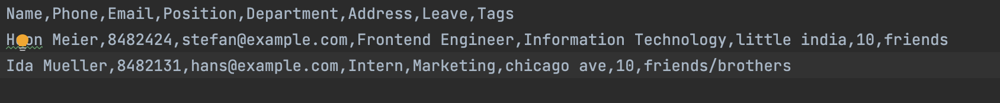

  
  <h1 align="center">Coydir <em>The Ultimate Company Directory</em></h1>

 

Welcome to Coydir's User Guide! 

**[Insert some catchy phrase here]**

---

### Table of Contents

- [Introduction](#introduction)
- [Using this Guide](#using-this-guide)
  - [Navigating the User Guide](#navigating-the-user-guide)
  - [The User Interface](#the-user-interface)
- [Quick Start](#quick-start)
- [Features](#features)
  - [Coydir Commands Format](#coydir-commands-format)
  - [Managing Employee Profiles](#managing-employee-profiles)
    - [Adding an employee](#adding-an-employee--add)
    - [Editing an employee](#editing-an-employee--edit)
    - [Deleting an employee](#deleting-an-employee--delete)
    - [Adding multiple employees at once](#adding-multiple-employees-at-once--batchadd)
    - [View details of an employee](#view-details-of-an-employee--view)
    - [Listing all employees](#listing-all-employees--list)
    - [Finding an employee](#finding-an-employee--find)
  - [Managing Employee Leaves](#managing-employee-leaves)
    - [Controlling total leaves for an employee](#controlling-total-leave-for-an-employee)
    - [Checking if an employee is on leave](#checking-if-an-employee-is-on-leave)
    - [Adding a leave period for an employee](#adding-a-leave-period-for-an-employee-add-leave)
    - [Deleting a leave period for an employee](#deleting-a-leave-period-for-an-employee-delete-leave)
  - [Managing Employee Performance](#managing-employee-performance)
    - [Rating the performance of an employee](#rating-the-performance-of-an-employee--rate)
    - [Employee Performance History](#employee-performance-history)
  - [Managing Departments](#managing-departments)
    - [View details of a department](#view-details-of-a-department--viewdepartment)
  - [Additional Features](#additional-features)
    - [Exiting the program](#exiting-the-program--exit)
    - [Clearing the data](#clearing-the-data--clear)
    - [Saving the data](#saving-the-data)
    - [Editing the data file](#editing-the-data-file)
- [FAQ](#faq)
- [Command summary](#command-summary)

---

## Introduction

Coydir is a desktop app to manage the employee details within a company, optimized for use via a Command Line Interface (CLI). Coydir would not only allow you to quickly access the list of all employees and their details but also make necessary updates based on the changes of the company structure.

## Using this Guide

### Navigating the User Guide

**[To be updated]**

### The User Interface

**[To be updated]**

## Quick start

1. Ensure you have Java `11` or above installed in your Computer.
    1. If you have installed Java before, check that you have the right version,  which is Java `11`.
        - If you are using Windows, open up command prompt and type `java -version` and enter. 
        - If you are using Mac, open up terminal and type `java -version` and enter.   
    2. If you do not have Java `11`:
        - If you are using Windows, you can install it from [here](https://www.oracle.com/java/technologies/downloads/).
        - If you are using Mac, you can install the Azul build of OpenJDK 11 version from [here](https://www.azul.com/downloads/?version=java-11-lts&os=macos&architecture=arm-64-bit&package=jdk-fx).   
     
        
2. Download the latest Coydir v1.3.0 jar file from [here](https://github.com/AY2223S1-CS2103T-T15-1/tp/releases).

3. Copy the file to the folder you want to use as the _home folder_ for your Coydir.

4. Double-click the file to start the app. The GUI similar to the below should appear in a few seconds. Note how the app contains some sample data. 

  

5. Type the command in the command box and press Enter to execute it. e.g. typing **`help`** and pressing Enter will open the help window. 
   Some example commands you can try:

   - **`list`** : Lists all employees in the company.

   - **`add`** `n/John Doe p/98765432 e/johnd@example.com j/Recruiter d/Human Resources a/311, Clementi Ave 2, #02-25 l/20 t/friends t/owesMoney` : Adds an employee named `John Doe`, with fields phone number, email, job title, department, address, total leaves, and tags to Coydir.

   - **`delete`**`3` : Deletes employee with ID 3.

   - **`exit`** : Exits the app.

6. Refer to the [Features](#features) below for details of each command.

---

## Features

With our powerful features, it has never been more convenient to perform HR tasks in companies of all sizes.

Coydir empowers you to take more control with less hassle, through data management and analytics features targeting 4 main fields:

1. [Employee particulars and details](#managing-employee-profiles)
2. [Employee leaves](#managing-employee-leaves)
3. [Employee performance](#managing-employee-performance)
4. [Department macro-view](#managing-departments)

Coydir also has other miscellaneous features for a smooth and comfortable use of the application, that we will cover in:

- [Additional Features](#additional-features)

We will explore each of these fields in great detail as we continue along, but before we get into that, let us take a look at how you can use the commands in Coydir's CLI-based interface.

### Coydir Commands Format

- Words in `UPPER_CASE` are the parameters to be supplied by the user. 
  e.g. in `add n/NAME`, `NAME` is a parameter which can be used as `add n/John Doe`.

- Items in square brackets are optional. 
  e.g `n/NAME [t/TAG]` can be used as `n/John Doe t/friend` or as `n/John Doe`.

- Items with `…`​ after them can be used multiple times including zero times. 
  e.g. `[t/TAG]…​` can be used as ` ` (i.e. 0 times), `t/friend`, `t/friend t/family` etc.

- Parameters can be in any order. 
  e.g. if the command specifies `n/NAME p/PHONE_NUMBER`, `p/PHONE_NUMBER n/NAME` is also acceptable.

- If a parameter is expected only once in the command but you specified it multiple times, only the last occurrence of the parameter will be taken. 
  e.g. if you specify `p/12341234 p/56785678`, only `p/56785678` will be taken.

- Extraneous parameters for commands that do not take in parameters (such as `help`, `list`, `exit` and `clear`) will be ignored. 
  e.g. if the command specifies `help 123`, it will be interpreted as `help`.

:warning: **Integer input values cannot be too large**: any values greater than $2^{32}-1$ is not supported.

### Managing Employee Profiles

What's Human Resources without the Human aspect? (*P.S. It's not "Resources"*)

The **core** of any management tool is the **collection and tracking of data**. 
Recognising this, Coydir offers several features for the manipulation of data on your company's employees. 

As a *HR professional*, Coydir makes it easy for you to **add and remove data**, **change past entries**, and **look for exactly the information you need**. 
All this, while keeping your data packed neatly as individual employee profiles for a clean, organised viewing.

Next, let us look at each feature in detail.

#### Adding an employee: `add`

Adds an employee to Coydir.

Format: `add n/NAME p/PHONE e/EMAIL j/POSITION d/DEPARTMENT a/ADDRESS l/LEAVE [t/TAG]…​`

:bulb:
An employee can have any number of tags (including 0).

:bulb:
The only compulsory fields are name, position and department.
Leaves will be default 14 while the other fields will be initialised as N/A.

Examples:

- `add n/John Doe p/98765432 e/johnd@example.com j/Recruiter d/Human Resources a/311, Clementi Ave 2, #02-25 l/20 t/friends t/owesMoney`
- `add n/Peter Mars j/Chief Operating Officer d/General Management`

#### Editing an employee: `edit`

Edits the details of the person identified by the index number used in the displayed person list. Existing values will be overwritten by the input values.

Format: `edit INDEX [n/NAME] [p/PHONE] [e/EMAIL] [j/POSITION] [d/DEPARTMENT] [a/ADDRESS] [l/LEAVE] [t/TAG]…​`

Examples:

- `edit 1 p/91234567 e/johndoe@example.com`
- `edit 2 p/91234567 l/20 t/colleagues`

#### Deleting an employee : `delete`

Deletes the specified employee from Coydir, given the employee ID.

This command results in one of two cases below:

**Case 1: Employee with ID exists**

If Coydir has an employee with the respective ID, Coydir will delete it.

**Case 2: Employee with ID does not exist**

Otherwise, if Coydir has no employee with ID that matches the specified name, Coydir will prompt users that the employee ID entered is invalid.

Format: `delete ID`

Example:

- `delete 1` deletes the employee with employee ID of 1.

#### Adding multiple employees at once: `batchadd`

Adds multiple employees to Coydir all at once.

:warning: **Make sure to have uploaded CSV file to make use of this command, and that employees' fields are compatible with Coydir**: CSV file can be uploaded under the 'data' folder of Coydir.

:warning: **Fields to be added in batchadd would be name, phone, email, position, department, address, tags, and total number of leaves**

:warning: **Do not have commas between each field in the CSV file.**

This command results in one of two cases below:

**Case 1: CSV file exists**

if a CSV file of employees exists in the 'data' folder of Coydir, Coydir will read from the CSV file to add the employees.

**Case 2: CSV file does not exist**

if a CSV file does not exist in the 'data' folder of Coydir, Coydir will
throw an error.

Format: `batchadd FILENAME`

Example:

- `batchadd employees.csv`

Sample CSV file as such:

#### View details of an employee: `view`

Views the details of an existing employee in the current list.

Format: `view INDEX`

Example:

- `view 2` returns the details of the second employee in the current list.

#### Listing all employees : `list`

Shows a list of all employees in the company.

Format: `list`

#### Finding an employee : `find`

Finds employees by searching for specified keywords. You can search for a specific name, position, or department, or with any combination of the aforementioned.

The keywords for searching are case-insensitive, and need not be full words. Running the command will then display all employees whose details match the specified keywords.

**Note**: There must be _at least one_ of the employees' particulars (and keywords) in the search.

Format: `find [n/NAME_KEYWORD] [j/POSITION_KEYWORD] [d/DEPARTMENT_KEYWORD]`

Example:

- `find n/John j/engineer d/Tech` displays the employee "John Doe", who is a "Software Engineer" in the "Information Technology" department.

### Managing Employee Leaves

Employee leave management can sometimes be a surprisingly *tedious* matter to tackle.

However, with Coydir, we can help you to ensure your **company operations run smoothly**, while your **employees get adequate opportunities** to rest and attend to personal matters.

Here is how we support you in leave management.

#### Controlling total leave for an employee

You can set the total leave available for an **incoming new** employee when adding them to the database. This can be done by including the optional leave field, `l/`, when using the `add` command. 

Example: `add n/Yi Long Ma j/Chief Operating Officer d/General Management l/20` adds an employee, and specifies his **total leave** to be **20**.

You can also edit the total leave available for an **existing** employee by using the `edit` command, and editing the `l/` tag for an employee.

Example: `edit 1 l/10` edits the total leave of the **first** employee in the current list to be **10**.

#### Checking if an employee is on leave

There are two ways to check for the live availability of employees. 

1. First is using the `view-department` command: `view-department general management` opens up a table to show all the employees of the general management department. The number of employees in the department that are available or on leave will be shown.

2. The other way is using the `view` command, or simply just clicking on the profile card of a specific employee: `view 1`, or clicking on the first person card in the current list of employees, opens up the full information of the employee on the right hand side of the screen. You will be able to check if they are on leave by looking for the "On Leave" field. 

#### Adding a leave period for an employee: `add-leave`

This adds a leave period to an employee given the employee ID and a start and end date. The leave period will also be displayed in a table which can be seen when viewing the employee's particulars. 

This command results in one of two cases below:

**Case 1: Valid ID, date and sufficient leaves**

If the employee exists, the leave date given is valid,
and the employee has sufficient leaves, the leave period will be added and shown in the table of leaves The total leaves remaining will be deducted accordingly. The employee's "On Leave" status will become "True" when the timeframe is within the leave period.

**Case 2: Invalid ID, date or insufficient leaves**

If any of employee ID, date is invalid, or the employee does not possess enough leaves, Coydir will prompt the users accordingly, and the command will not execute.

:bulb:
Leaves are ordered by reverse chronological order in the table view.

Format: `add-leave id/ID sd/START_DATE ed/END_DATE`

Field |TAG | Description | Requirement| Default Value
--------------|---------------|---------------|------------------------ | --------
`ID`|id/|Employee ID|**Compulsory**| N.A.
`START_DATE` |sd/|Start date of leave, in dd-MM-YYYY format|**Compulsory**| N.A.
`END_DATE` |ed/|End date of leave, in dd-MM-YYYY format|**Compulsory**| N.A.

Example:

- `add-leave id/1 sd/01-01-2022 ed/01-01-2022` adds a leave period to an employee of ID 1 with a leave period from 01-01-2022 to 01-01-2022 of 1 day.

  
   <em>Result of adding leave successfully from example given</em>

 

#### Deleting a leave period for an employee: `delete-leave`

Added a wrong leave period or the employee wants to change their leave application? Fret not, `delete-leave` helps you to removes a leave period for an employee given the employee ID and index of leave in the table. The leave period deleted will then be removed from the leave table.

This command results in one of two cases below:

**Case 1: Valid ID and index of leave**

If the employee exists, the index given is valid, the leave period at that index of the list of leaves will be removed for the particular employee.

**Case 2: Invalid ID, or index**

If the employee ID, or the index is invalid, Coydir will prompt the users accordingly, and the command will not execute.

Format: `delete-leave id/ID i/INDEX`

Field |TAG | Description | Requirement| Default Value
--------------|---------------|---------------|------------------------ | --------
`ID`|id/|Name|**Compulsory**| N.A.
`INDEX` |i/|Index of leave in the leave table|**Compulsory**| N.A.

Example:

- `delete-leave id/1 i/1` deletes the first leave period for an employee of ID 1 in the table of leaves.

  
   <em>Result of deleting leave successfully from example given</em>

 

### Managing Employee Performance

Understanding the performance of your employees is crucial for *talent development* in the company.

Key performance indicators, productivity, and progression policies may differ from company to company. 
Here, Coydir offers a **simple yet powerful** way of keeping track of and making sense of your employees' performance in the company.

**[Insert a brief overview of the 1-5 rating system]**

#### Rating the performance of an employee: `rate`

Rate the performance of an employee given the employee ID and a numeric rating.
Ratings can take any values from 1 - 5, and it should not be blank.

The numeric representation of the ratings follows as such:
5: Outstanding | 4: Exceeds Expectations | 3: Satisfactory | 2: Needs Improvement | 1: Unsatisfactory

This command results in one of two cases below:

**Case 1: Valid ID and rating**

If the employee exists, the rating given is valid (is a number from 1-5 inclusive), the performance rating will be added and the performance field of the employee will be updated accordingly.

**Case 2: Invalid ID or rating**

If any of employee ID, the rating given is invalid (is not a number from 1-5 inclusive), Coydir will prompt the users accordingly, and the command will not execute.

Format: `rate id/ID r/RATING`

Example:

- `rate id/1 r/3` adds a performance rating to an employee of ID 1 with a rating of 3: Satisfactory.

#### Employee Performance History

**[Insert description of the performance history chart]**

### Managing Departments

Apart from supporting the core HR functions, Coydir also supports *department-level management*, for other manpower staff and executives (*department heads, operations planning, etc.*).

With these features, we offer a view that is broader than an individual employee profile and more specific than the full directory. 
Complete with **real-time statistics and analytics**, Coydir makes department management much simpler.

**[Insert details on how we have fixed departments for now]**

#### View details of a department: `viewdepartment`

View the summarized details of a department given the name of the department.

Details include the number of employee in that particular department, employees who are currently available, employees who are currently on leave, and a table of employees in that department and their corresponding performance ratings.

Format: `viewdepartment DEPARTMENT`

Example:

- `viewdepartment Finance` displays a brief summary of the Finance department's details on the right panel.

### Additional Features

To wrap up, let us take a look at a couple of additional features that give *a little boost* to your HR management on Coydir.
These features and techniques serve to make your usage of the application **smoother, easier, and more flexible**.

#### Exiting the program : `exit`

Exits the program.

Format: `exit`

#### Clearing the data : `clear`

Clears all the data currently stored in the database.

Format: `clear`

#### Saving the data

Coydir data are saved in the hard disk automatically after any command that changes the data. There is no need to save manually.

#### Editing the data file

Coydir data are saved as a JSON file `[JAR file location]/data/database.json`. Advanced users are welcome to update data directly by editing that data file.

:exclamation: **Caution:**
If your changes to the data file makes its format invalid, Coydir will discard all data and start with an empty data file at the next run.

---

## FAQ

**Q**: How do I transfer my data to another Computer? 
**A**: Install the app in the other computer and overwrite the empty data file it creates with the file that contains the data of your previous Coydir home folder.

---

## Command summary

| Action              | Format, Examples                                                                                                                                                                                                                                 |
| ------------------- | ------------------------------------------------------------------------------------------------------------------------------------------------------------------------------------------------------------------------------------------------ |
| **Add**             | `add n/NAME p/PHONE e/EMAIL j/POSITION d/DEPARTMENT a/ADDRESS l/LEAVE [t/TAG]…​`   e.g. `add n/Betsy Crowe t/friend e/betsycrowe@example.com a/Newgate Prison p/1234567 l/14 t/criminal`                                                      |
| **Edit**            | `add n/NAME p/PHONE_NUMBER e/EMAIL a/ADDRESS [t/TAG]…​add n/NAME p/PHONE e/EMAIL j/POSITION d/DEPARTMENT a/ADDRESS l/LEAVE [t/TAG]…​`   e.g. `add n/Betsy Crowe t/friend e/betsycrowe@example.com a/Newgate Prison p/1234567 l/14 t/criminal` |
| **Batch Add**       | `batchadd FILENAME`   e.g. `batchadd newemployees.csv`                                                                                                                                                                                        |
| **View Details**    | `view ID`   e.g. `view 1`                                                                                                                                                                                                                     |
| **Delete**          | `delete INDEX`  e.g. `delete 3`                                                                                                                                                                                                               |
| **Find**            | `find [n/NAME] [j/POSITION] [d/DEPARTMENT]`  e.g. `find n/John j/engineer d/Tech`                                                                                                                                                             |
| **Add leave**       | `add-leave id/ID sd/START_DATE ed/END_DATE`  e.g. `add-leave id/1 sd/01-01-2022 ed/02-01-2022`                                                                                                                                                  |
| **Delete leave**    | `delete-leave id/ID i/INDEX`  e.g. `delete-leave id/1 i/3`                                                                                                                                                                                      |
| **View Department** | `viewdepartment DEPARTMENT`  e.g. `viewdepartment Finance`                                                                                                                                                                                    |
| **rate**            | `rate id/ID r/RATING`  e.g. `rate id/1 r/3`                                                                                                                                                                                                   |
| **List**            | `list`                                                                                                                                                                                                                                           |
| **Exit**            | `exit`                                                                                                                                                                                                                                           |
| **Clear**           | `clear`                                                                                                                                                                                                                                          |
| **Help**            | `help`                                                                                                                                                                                                                                           |
