# Introduction

Welcome to the **REal-Time** User Guide!

In this user guide, you will find everything you need to know about **REal-Time** in making your user
experience easy and smooth.

The **REal-Time** user guide provides you with **step-by-step** instructions from installing the application
to teaching you our easy-to-use features!


## About REal-Time

Tired of having to manage your client information and details through multiple spreadsheets, tracking through listings in another
application and scheduling your important meetings with clients through a calendar app? Look no further, as **REal-Time**
has got you covered!


**REal-Time** is a desktop application for **Real-Estate agents** to **manage client information, schedule meetings,
and track client offers and listings**, isn't that awesome?

It is optimized for use via a _Command Line Interface_ ([CLI](#glossary)) while still having the added
benefits of a _Graphical User Interface_ ([GUI](#glossary)).
With just the usage of a standard keyboard, **REal-Time** can get all the necessary tasks
done faster than traditional GUI apps!

## Fun fact
The **"REa"** in **REal-Time** stands for _Real-Estate agents_, which is the intended target user of our application!

## Using this guide

Now that you have read the introduction and learnt about what our product does, get started in using **REal-Time** by
following the guide provided in the [Quick Start](#quick-start) section. Otherwise,
* If you are still unsure of the commands used in REal-Time, the [Command Summary](#command-summary) is a good place to
start.
* The [Prefix Summary](#prefix-summary) and [Glossary](#glossary) are also great places to understand REal-Time
better.
* If you are a developer and would like to help improve our product, take a look at our [Developer Guide](https://ay2223s1-cs2103t-w15-2.github.io/tp/DeveloperGuide.html).

# Table of Contents
{: .no_toc}

* Table of Contents
{:toc}

--------------------------------------------------------------------------------------------------------------------


# Quick start

1. Ensure you have `Java 11` or above installed in your Computer. To install `Java 11`,
click [here](https://www.oracle.com/sg/java/technologies/downloads/#java11) and download the appropriate file depending
on your Operating System ([OS](#glossary)) (_e.g, Linux, Windows, macOS_).

2. Download the latest `REal-Time.jar` file from [here](https://github.com/AY2223S1-CS2103T-W15-2/tp/releases). The
`REal-Time.jar` file is located in the "Assets" section as shown below.


3. Copy the file to the folder you want to use as the _home folder_ for REal-Time. If you are unsure on how to create
a new folder, click [here](https://www.computerhope.com/issues/ch000742.htm) to learn more.

4. Double-click the file to start the app. The GUI similar to the one below should appear in a few seconds.
Note how the app contains some sample data.<br>
   

5. Refer to the [Layout](#layout) if you are still unsure in navigating REal-Time's interface.

6. Type the command in the command box and press Enter to execute it. e.g. typing [**`help`**](#viewing-help--help) and
pressing Enter will open the help window.<br>
   Some example commands you can try:

   * [**`addO`**](#adding-an-offer-addo)`l/John street, block 123, #01-01 n/John Doe o/700000` : Adds an offer by `John Doe` to the list of offers.

   * [**`delC`**](#deleting-a-client--delc)`3` : Deletes the 3rd contact shown in the current list of clients.

   * [**`clear`**](#clearing-all-entries--clear) : Deletes all clients, meetings, listings and offers.

   * [**`exit`**](#exit-real-time--exit) : Exits the app.

* We recommend you to read the [Command Format](#command-format) section before using REal-Time.

7. Refer to the [Features](#features) below for more details of each command.

Back to [Table of Contents](#table-of-contents)

___

# Layout


`Command Box` - What you type will be shown here.<br>

`Feedback Box` - REal-Time feedbacks to your commands will appear here.<br>

`Client Box` - All [Clients](#glossary) in REal-Time will appear here.<br>

`Offer Box` - All [Offers](#glossary) in REal-Time will appear here.<br>

`Listing Box` - All [Listings](#glossary) in REal-Time will appear here.<br>

`Meeting Box` - All [Meetings](#glossary) in REal-Time will appear here.

Back to [Table of Contents](#table-of-contents)

--------------------------------------------------------------------------------------------------------------------

# Command format
#### We highly recommend you to read this section before using REal-Time
REal-Time functions are based on commands that you enter. REal-Time has 4 main types
of commands. let's learn how to write them!

## 1. `add`

This type of command includes `addC` `addO` `addL` `addM` and is used to add a new
entry into REal-Time.

Back to [Table of Contents](#table-of-contents)

**Format:** `addC n/NAME p/PHONE_NUMBER e/EMAIL a/ADDRESS [t/TAG]…`

This command adds a client into REal-Time.<br>
1. `addC` is the **Command Word**
2. `n/` `p/` `e/` `a/` are **Prefixes**. Prefixes help REal-Time distinguish between different inputs.
3. `NAME` `PHONE_NUMBER` `EMAIL` `ADDRESS` are the **Data Field** that you can input. For example, `NAME` in `n/NAME` can be replaced with `n/John Doe`.

Let's say you want to add a client named `John Doe`, his phone number
is `12345678`, his email is `john@gmail.com` and his address is `123 John St`.<br>

You can enter the following command:<br>
```text
addC n/John Doe p/12345678 e/john@gmail.com a/123 John St
```
**Note:**
1. You may notice square brackets [] around some parameters. This indicates that the field is **optional**. For the
example above, the `t/TAG` parameter can be left empty if you do not wish to tag the client.

2. You may also notice `…` after the `t/TAG` field. This indicates that you may enter this field as many times as you
want to (0 or more times). For example, if you want to tag `John Doe` as `Friend` and `Neighbor` you can add
`t/Friend t/Neighbor` to the command above.

3. The order of every field does not matter. If the command specifies
`n/NAME p/PHONE_NUMBER`, `p/PHONE_NUMBER n/NAME` is also acceptable.

4. If a field is expected only once in the command, but you specified it multiple times, only the last occurrence
will be taken. If you specify `n/John Dough n/John Doe`, only `n/John Doe` will be taken.


## 2. `del`
This type of command includes `delC` `delO` `delL` `delM` and is used to delete a
current entry from REal-Time.

Back to [Table of Contents](#table-of-contents)

**Format:** `delL INDEX`

Let's say you want to delete the second listing from the `Listing Box`.<br>

You can enter the following command:
```text
delL 2
```
**Note:**
1. `INDEX` refers to the index number shown in each of the box. Below is an example:<br>
<br>
2. `INDEX` **must be a positive integer** 1, 2, 3, …​

## 3. `edit`
This type of command includes `editC` `editO` `editL` `editM` and is used to edit the details
of a current entry in REal-Time.

Back to [Table of Contents](#table-of-contents)

**Format:** `editO INDEX [n/NAME] [o/OFFER_PRICE] [l/LISTING_ID]`

Let's say there is an existing offer at `INDEX` 2 that `Betsy Crowler` made for `john_house` with offer price `100000`
but Betsy Crower just increased her offer price to `200000`, you also realised that you spelt her
name wrongly the first time you add this offer, and it is actualy `Besty Crower` and you want to update this
change in REal-Time.<br>

You can enter the following command:<br>

```text
editO 2 n/Betsy Crower o/200000
```

## 4. `list`
This type of command includes `listC` `listL` and is used to list all the entries
of the specific type in REal-Time.

Back to [Table of Contents](#table-of-contents)

**Format:** `listC`

Let's say you want to see all the clients in REal-Time.<br>

You can enter the following command:
```text
listC
```

--------------------------------------------------------------------------------------------------------------------

# Features

## Managing Clients

In this section, we provide you the basic steps needed to [add](#adding-a-client-addc), [delete](#deleting-a-client--delc),
[edit](#editing-a-client--editc), [find](#finding-clients-by-name-findc) and [list](#listing-clients-listc) clients.

**If this is not the section you are looking for**, click [here](#table-of-contents) to go back to the **Table of Contents**.

### Adding a client: `addC`

> Adds a client to REal-Time.

**Format:** `addC n/NAME p/PHONE_NUMBER e/EMAIL a/ADDRESS [t/TAG]…​`

* `NAME` refers to the name of the client.<br>
* `PHONE_NUMBER` refers to the phone number of the client<br>
* `EMAIL` refers to the email address of the client.<br>
* `ADDRESS` refers to the address of the client.<br>
* `TAG` refers to the tags that you want to associate with the client.

**Example input:**<br>

**_Success_**
```text
addC n/John Doe p/98765432 e/johnd@example.com a/John street, block 123, #01-01
```
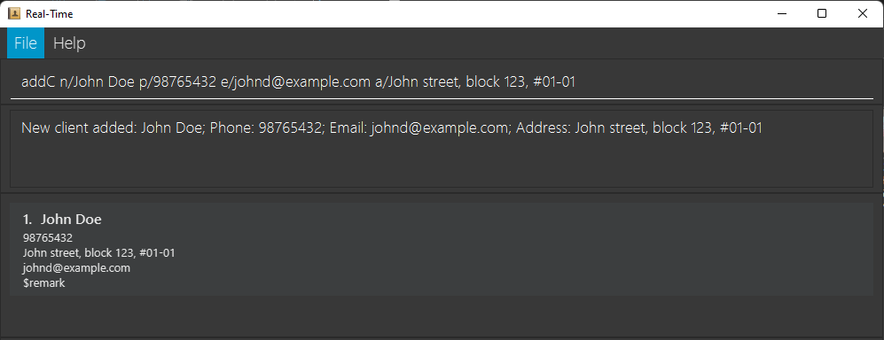<br>

```text
addC n/Betsy Crowe t/friend e/betsy@example.com a/Newgate Prison p/1234567 t/criminal
```
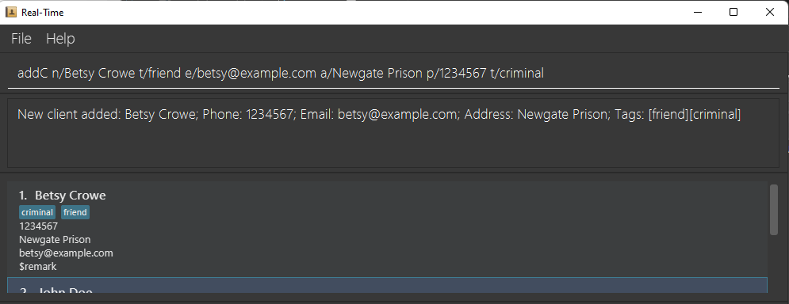<br>

**_Failure_**

* **Invalid client name:**
```text
addC n/John D@e p/98765432 e/johnd@example.com a/John street, block 123, #01-01
```

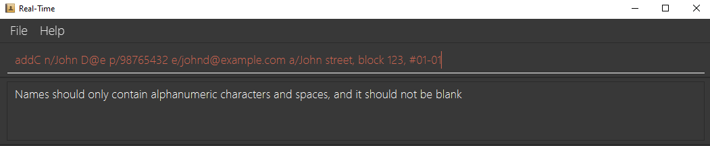<br>

* **Missing fields:**
```text
addC n/John Doe a/John street, block 123, #01-01
```
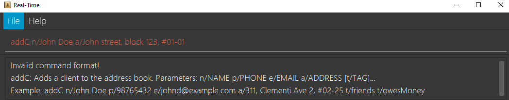<br>

**Expected Success Output:**<br>
A new client is added to RealTime.<br>

**Feedback Box:**

```text
New client added: [details of the newly added client]
```

1. If you have any confusion of the notation, you can refer to the
   [Command Format](#command-format) section here.
2. If you are still unsure of the **prefixes**, click [here](#prefix-summary) to find out more.

Back to [Table of Contents](#table-of-contents)<br>
Back to [Managing Clients](#managing-clients)

___

### Deleting a client : `delC`

> Deletes the client at the specified index in REal-Time.

**Format** - `delC INDEX`

**Example Input:**<br>

**_Success_**
```text
delC 1
```
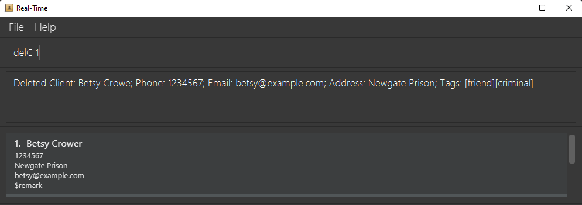<br>

**_Failure_**
* **Invalid index:**
```text
delC -1
```
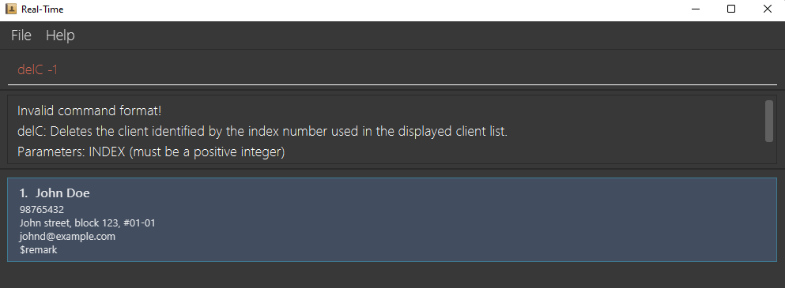<br>

**Expected Success Output:**<br>
The client at specified `INDEX` is deleted from REal-Time.<br>

**Feedback Box:**
```text
Deleted Client: [details of the deleted client]
```
**Note:**
1. `listC` followed by `delC 2` deletes the 2nd client in the REal-Time.
2. `findC Betsy` followed by `delC 1` deletes the 1st client in the results of the `findC` command.

1. If you have any confusion of the notation, you can refer to the
   [Command Format](#command-format) section here.

Back to [Table of Contents](#table-of-contents)<br>
Back to [Managing Clients](#managing-clients)

___

### Editing a client : `editC`

> Edits an existing client in REal-Time.

**Format:** `editC INDEX [n/NAME] [p/PHONE] [e/EMAIL] [a/ADDRESS] [t/TAG]…​`

**Example input:**<br>

**_Success_**
```text
editC 1 p/91234567 e/johndoe@example.com
```
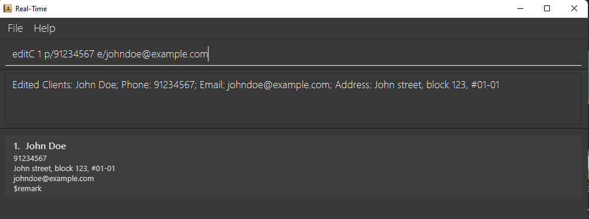<br>

```text
editC 2 n/Betsy Crower t/
```
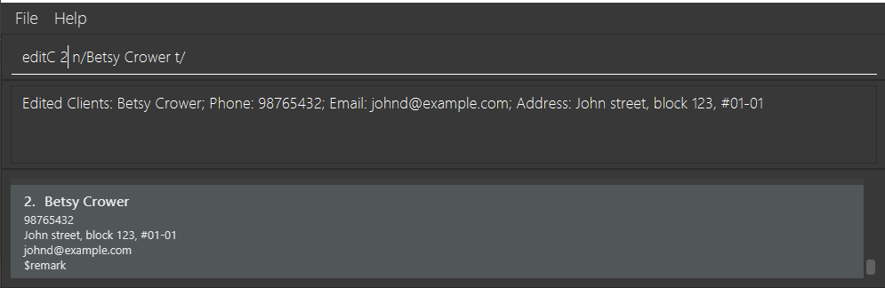<br>

**_Failure_**

* **Invalid index:**
```text
editC 0 p/12345678
```
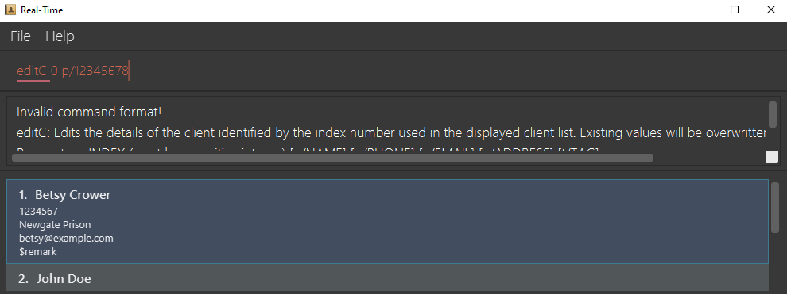<br>

* **Missing fields:**
```text
editC 1
```
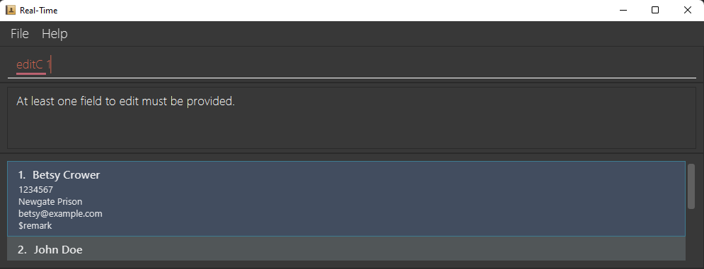<br>

**Expected Success Output:**<br>
The client at the specified `INDEX` is edited according to the fields provided.<br>

**Feedback Box:**
```text
Edited Client: [newly updated details of client]
```

**Note:**
1. Edits the client at the specified `INDEX`. The index refers to the index number shown in the displayed client list.
   The index **must be a positive integer** 1, 2, 3, …​
2. At least one of the optional fields must be provided.
3. Existing values will be updated to the input values.
4. When editing tags, the existing tags of the client will be removed i.e adding of tags is not cumulative.
5. You can remove all the client’s tags by typing `t/` without
   specifying any tags after it.


**Help:**
1. If you have any confusion of the notation, you can refer to the
   [Command Format](#command-format) section here.
2. If you are still unsure of the **prefixes**, click [here](#prefix-summary) to find out more.

Back to [Table of Contents](#table-of-contents)<br>
Back to [Managing Clients](#managing-clients)

___

### Finding clients by name: `findC`

Finds clients whose names contain any of the given keywords.

**Format:** `findC KEYWORD [MORE_KEYWORDS]`

**Example Input:**<br>

**_Success_**
```text
findC John
```
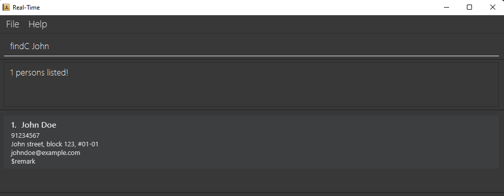<br>

**_Failure_**

* **No keywords provided:**
```text
findC
```
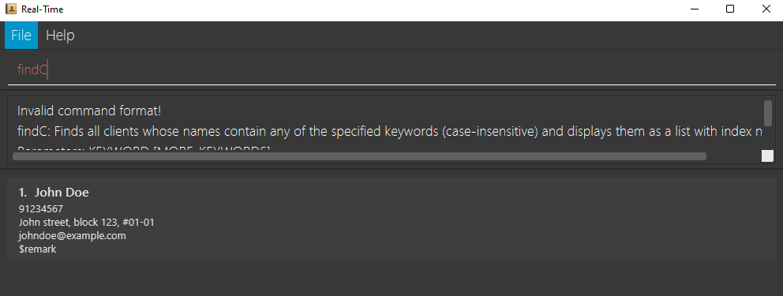<br>
* The list of clients in the Client Box is updated to a list of all matches from the findC command.

**Feedback Box:**
```text
[number of matches] clients listed!
```


**Note:**
1. The search is case-insensitive. e.g `hans` will match `Hans`
2. The order of the keywords does not matter. e.g. `Hans Bo` will match `Bo Hans`
3. Only the name is searched.
4. Only full words will be matched e.g. `Han` will not match `Hans`
5. Clients matching at least one keyword will be returned (i.e. `OR` search).
  e.g. `Hans Bo` will return `Hans Gruber`, `Bo Yang`

**Help:**
1. If you have any confusion of the notation, you can refer to the
   [Command Format](#command-format) section here.

Back to [Table of Contents](#table-of-contents)<br>
Back to [Managing Clients](#managing-clients)

___

### Listing Clients: `listC`

> Shows the full list of clients.

**Format:** `listC`

**Expected Success Output:**<br>
The full list of clients appears in the Client Box.<br>

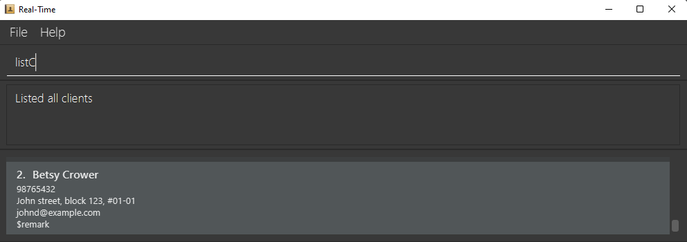<br>

**Feedback Box:**
```text
Listed all clients
```


Back to [Table of Contents](#table-of-contents)<br>
Back to [Managing Clients](#managing-clients)

___

## Managing Offers

In this section, we provide you the basic steps needed to [add](#adding-an-offer-addo), [delete](#deleting-an-offer--delo),
and [edit](#editing-an-offer--edito) offers.

**If this is not the section you are looking for**, click [here](#table-of-contents) to go back to the **Table of Contents**.

___

### Adding an offer: `addO`


> Adds an offer to REal-Time.

**Format:** `addO l/LISTING_ID n/NAME o/OFFER_PRICE`

* `LISTING_ID` refers to the ListingId of the Listing that the offer has been made for.<br>
* `NAME` refers to the name of the client making the offer.<br>
* `OFFER_PRICE` refers to the offer price that has been made for the listing.

**Example Input:**<br>

**_Success_**
```text
addO l/BEDOK_NORTH_BLK123_12 n/John Doe o/2000000
```
<br>

**_Failure_**

* **Missing fields:**
```text
addO l/BEDOK_NORTH_BLK123_12 n/John Doe
```
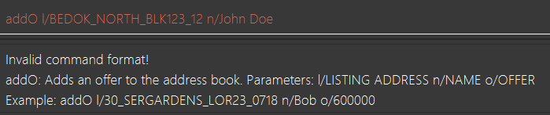<br>

* **Invalid offer price:**
```text
addO l/BEDOK_NORTH_BLK123_12 n/John Doe o/-1
```
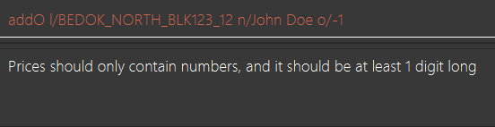<br>

**Expected Success Output:**<br>
A new offer is added to REal-Time<br>

**Feedback Box:**
```text
New offer added: [offer details]
```

**Help:**
1. If you have any confusion of the notation, you can refer to the
   [Command Format](#command-format) section here.
2. If you are still unsure of the **prefixes**, click [here](#prefix-summary) to find out more.

Back to [Table of Contents](#table-of-contents)<br>
Back to [Managing Offers](#managing-offers)

___

### Deleting an offer : `delO`

> Deletes the specified offer in REal-Time.

**Format** - `delO INDEX`

**Example Input:**<br>

**_Success_**
```text
delO 2
```
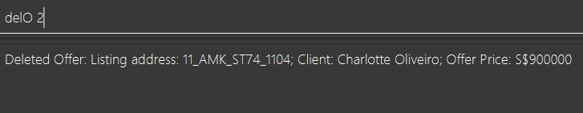<br>

**_Failure_**

* **Invalid index:**
```text
delO 0
```
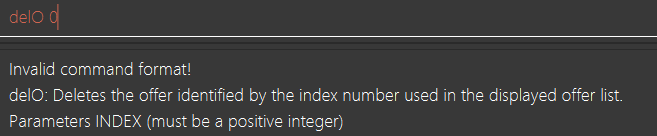<br>

* **Missing Index**
```text
delO
```
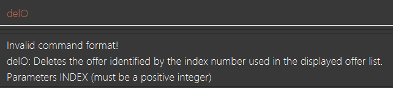<br>

**Expected Success Output:**<br>
The offer at specified `INDEX`  is deleted from REal-Time.<br>

**Feedback Box:**
```text
Deleted Offer: [details of the deleted offer]
```
**Help:**
1. If you have any confusion of the notation, you can refer to the 
[Command Format](#command-format) section here.

Back to [Table of Contents](#table-of-contents)<br>
Back to [Managing Offers](#managing-offers)

___

### Editing an offer : `editO`

> Edits an existing offer in REal-Time.

**Format:** `editO INDEX [n/NAME] [o/OFFER_PRICE] [l/LISTING_ID]`

**Example Input:**

**_Success_**
```text
editO 2 n/Betsy Crower o/200000
```
<br>

**_Failure_**

* **Invalid index:**
```text
editO -1 n/Betsy Crower o/200000
```
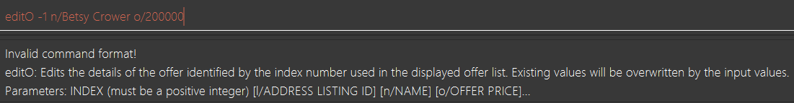<br>

* **Invalid client name:**
```text
editO 2 n/Betsy Cr@wer o/200000
```
<br>

**Expected Success Output:**<br>
The offer at `INDEX` 2 is edited according to the fields provided.<br>

**Feedback Box:**
```text
Edited Offer: [newly updated details of offer]
```
**Note:**
1. Edits the offer at the specified `INDEX`. The index refers to the index number shown in the displayed client list.
   The index **must be a positive integer** 1, 2, 3, …​
2. At least one of the optional fields must be provided.
3. Existing values will be updated to the input values.

**Help:**
1. If you have any confusion of the notation, you can refer to the
   [Command Format](#command-format) section here.
2. If you are still unsure of the **prefixes**, click [here](#prefix-summary) to find out more.

Back to [Table of Contents](#table-of-contents)<br>
Back to [Managing Offers](#managing-offers)

___

## Managing Listings

In this section, we provide you the basic steps needed to [add](#adding-a-listing-addl), [delete](#deleting-a-listing--dell),
[edit](#editing-a-listing--editl) and [list](#listing-listings-listl) listings.

**If this is not the section you are looking for**, click [here](#table-of-contents) to go back to the **Table of Contents**.


### Adding a listing: `addL`

> Adds a listing to REal-Time.

**Format:** `addL l/LISTING_ID a/ADDRESS n/OWNER_NAME ap/ASKING_PRICE [t/TAG]…​`


* `l/LISTING_ID` refers to the ListingId you wish to assign to this Listing.<br>
* `a/ADDRESS` refers to the address of this Listing.<br>
* `n/NAME` refers to the name of the owner of this Listing.<br>
* `ap/ASKING_PRICE` refers to the asking price that the owner is asking for this Listing.

**Example Input:**

**_Success_**
```text
addL l/007 a/100 Charming Ave n/Joke Peralta ap/10000000
```


**_Failure_**

* **Missing asking price field:**
```text
addL l/007 a/100 Charming Ave n/Joke Peralta`
```


**Expected Success Output:**<br>
A new listing is added to REal-Time<br>

**Feedback Box:**
```text
New listing added: [listing details]
```

**Help:**
1. If you have any confusion of the notation, you can refer to the
   [Command Format](#command-format) section here.
2. If you are still unsure of the **prefixes**, click [here](#prefix-summary) to find out more.

Back to [Table of Contents](#table-of-contents)<br>
Back to [Managing Listings](#managing-listings)

___

### Deleting a listing : `delL`

> Deletes the listing at the specified Index from REal-Time.

**Format:** `delL id/INDEX`

**Example Input:**<br>

**_Success_**
```text
delL 1
```
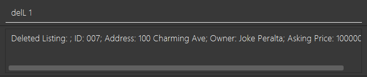

**_Failure_**
* **Invalid index:**
```text
delL 2356739457
```
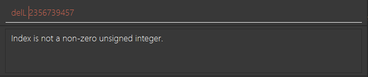

**Expected Success Output:**<br>
The listing at the specified `INDEX` is deleted from REal-Time.<br>

**Feedback Box:**
```text
Deleted Listing: [details of the deleted listing]
```
**Help:**
1. If you have any confusion of the notation, you can refer to the
   [Command Format](#command-format) section here.

Back to [Table of Contents](#table-of-contents)<br>
Back to [Managing Listings](#managing-listings)

___

### Editing a listing : `editL`

> Edits an existing listing in the REal-Time.

**Format:** `editL INDEX [l/LISTING_ID] [a/ADDRESS] [n/OWNER_NAME] [ap/ASKING_PRICE] [t/TAG]…​`

**Example input:**<br>

**_Success_**
```text
editL 1 n/Joke Peralta
```


**_Failure_**
* **Invalid index:**
```text
editL 200 n/Joke Peralta
```


* **Missing fields:**
```text
editL 1
```


**Expected Success Output:**<br>
The listing at the specified `INDEX` is edited according to the fields provided.<br>

**Feedback Box:**
```text
Edited Listing: [newly updated details of listing]
```
**Note:**
1. Edits the listing at the specified `INDEX`. The index refers to the index number shown in the displayed listing list.
   The index **must be a positive integer** 1, 2, 3, …​
2. At least one of the optional fields must be provided.
3. Existing values will be updated to the input values.
4. When editing tags, the existing tags of the listing will be removed i.e adding of tags is not cumulative.
5. You can remove all the listing’s tags by typing `t/` without
   specifying any tags after it.

**Help:**
1. If you have any confusion of the notation, you can refer to the
   [Command Format](#command-format) section here.
2. If you are still unsure of the **prefixes**, click [here](#prefix-summary) to find out more.

Back to [Table of Contents](#table-of-contents)<br>
Back to [Managing Listings](#managing-listings)

___

### Listing listings: `listL`

> Shows the full list of listings.

**Format:** `listL`

**Expected Success Output:**<br>

The full list of listings appears in the Client Box.<br>

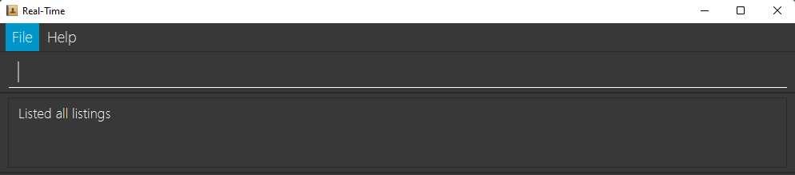

**Feedback Box:**
```text
Listed all listings
```

Back to [Table of Contents](#table-of-contents)<br>
Back to [Managing Listings](#managing-listings)

___

## Managing Meetings

In this section, we provide you the basic steps needed to [add](#adding-a-meeting-addm), [delete](#deleting-a-meeting--delm)
and [edit](#editing-a-meeting--editm) meetings.

**If this is not the section you are looking for**, click [here](#table-of-contents) to go back to the **Table of Contents**.

> Currently, Meetings are not displayed in the UI.

### Adding a meeting: `addM`

> Adds a meeting to the REal-Time.

**Format:** `addM l/LISTING_ID n/CLIENT_NAME d/DATE_TIME`

* `LISTING_ID` refers to the Listing the meeting is about.
* `CLIENT_NAME` refers to the name of the Client you are meeting.
* `DATE_TIME` refers to the date and time of the meeting.

**Example Input:**<br>

**_Success_**
```text
addM l/007 n/Joke Peralta d/2022-10-20 12:00
```
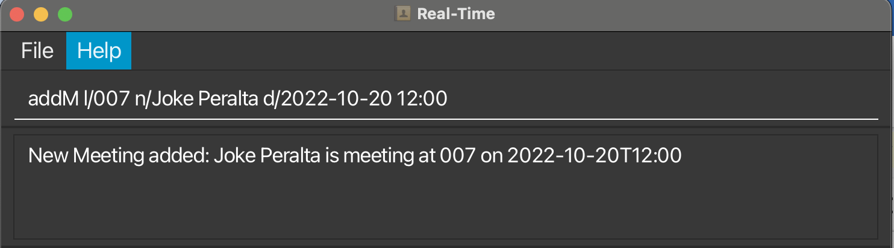<br>

**_Failure_**
* **Wrong date format:**
```text
addM l/007 n/Joke Peralta d/tomorrow 12pm
```
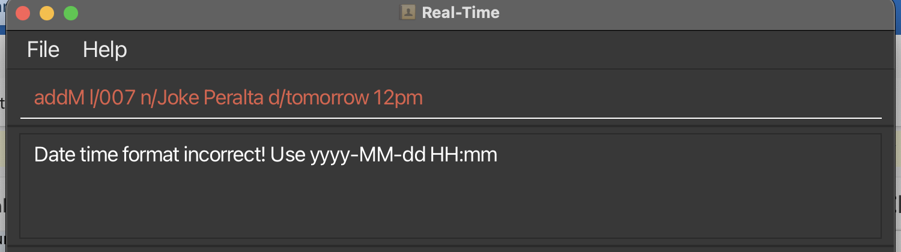<br>

**Note:**
1. DATE_TIME must be in this format, yyyy-MM-dd HH:mm

**Help:**
1. If you have any confusion of the notation, you can refer to the
   [Command Format](#command-format) section here.
2. If you are still unsure of the **prefixes**, click [here](#prefix-summary) to find out more.

Back to [Table of Contents](#table-of-contents)<br>
Back to [Managing Meetings](#managing-meetings)

___

### Deleting a meeting : `delM`

> Deletes the meeting at the specified index from REal-Time.

**Format:** `delM id/INDEX`

**Example Input:**<br>

**_Success_**
```text
delM 1
```
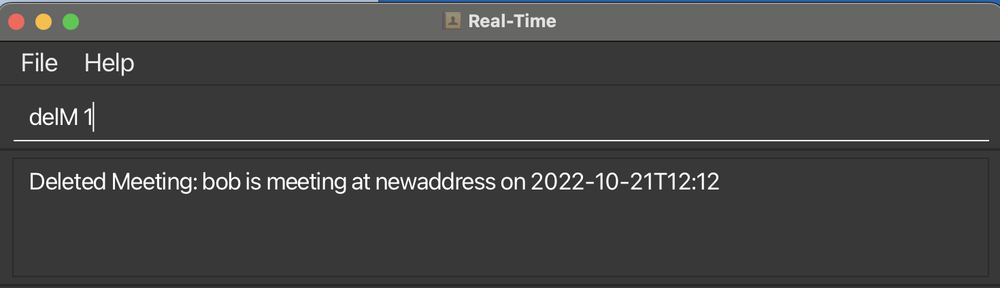<br>

**_Failure_**
* **Invalid index:**
```text
delM -1
```
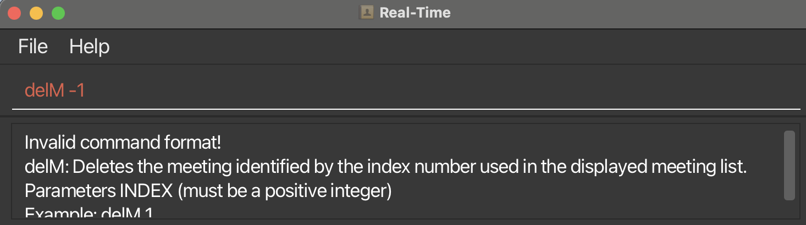<br>

**Expected Success Output:**<br>
The meeting at the specified `INDEX` is deleted from REal-Time.<br>

**Feedback Box:**
```text
Deleted Meeting: [details of the deleted listing]
```
**Help:**
1. If you have any confusion of the notation, you can refer to the
   [Command Format](#command-format) section here.

Back to [Table of Contents](#table-of-contents)
Back to [Managing Meetings](#managing-meetings)

___

### Editing a meeting : `editM`

> Edits an existing meeting in REal-Time.

**Format:** `editM INDEX [n/NAME] [d/DATE_TIME]`

**Example input:**<br>

**_Success_**
```text
`editM 1 n/Joke Peralta d/2022-10-20 23:59`
```
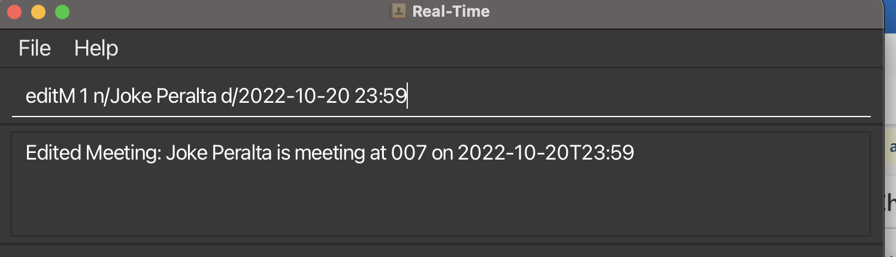<br>

**_Failure_**
* **Invalid index:**
```text
editM -1 n/Joke Peralta
```
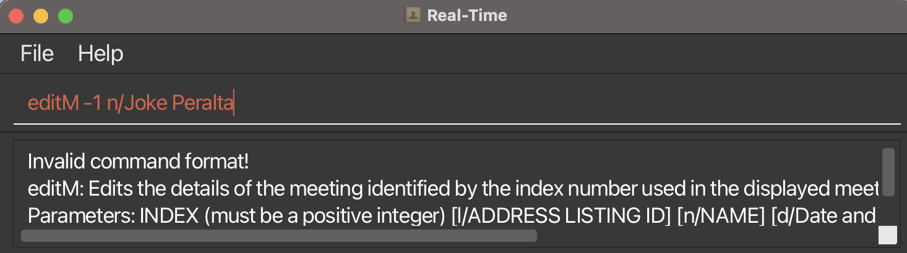<br>

* **Missing fields:**
```text
editM 1
```
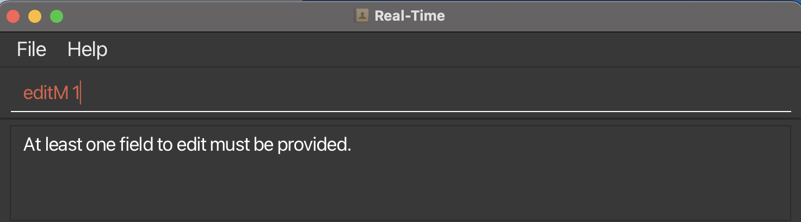<br>

**Expected Success Output:**<br>
The meeting at the specified `INDEX` is edited according to the fields provided.<br>

**Feedback Box:**
```text
Edited Meeting: [newly updated details of meeting]
```
**Note:**
1. Edits the meeting at the specified `INDEX`. The index refers to the index number shown in the displayed client list.
   The index **must be a positive integer** 1, 2, 3, …​
2. At least one of the optional fields must be provided.
3. Existing values will be updated to the input values.

**Help:**
1. If you have any confusion of the notation, you can refer to the
   [Command Format](#command-format) section here.
2. If you are still unsure of the **prefixes**, click [here](#prefix-summary) to find out more.

Back to [Table of Contents](#table-of-contents)<br>
Back to [Managing Meetings](#managing-meetings)

___

## General

In this section, we provide you the basic steps needed to use the [help](#viewing-help--help), [clear](#clearing-all-entries--clear) and
[exit](#exit-real-time--exit) commands.

**If this is not the section you are looking for**, click [here](#table-of-contents) to go back to the **Table of Contents**.


Available commands: `help` `clear` `exit`

### Viewing help : `help`

> Show a help window for REal-Time

**Format:** `help`

**Expected Success Output:**<br>

A window displaying help similar to below will appear.


Back to [Table of Contents](#table-of-contents)<br>
Back to [General](#general)

### Clearing all entries : `clear`

> Clears all entries in REal-Time.

**Example Input:**<br>
```text
clear
```
**Expected Success Output:**<br>
All data in REal-Time is cleared

Back to [Table of Contents](#table-of-contents)<br>
Back to [General](#general)

___
### Exit REal-Time : `exit`
> Exits REal-Time

**Example Input:**<br>
```text
exit
```
**Expected Success Output:**<br>
The REal-Time window closes.

Back to [Table of Contents](#table-of-contents)<br>
Back to [General](#general)

___


### Saving the data

REal-Time data are saved in the hard disk automatically after any command that changes the data. There is no need to save manually.

Back to [Table of Contents](#table-of-contents)<br>
Back to [General](#general)

___

### Editing the data file

REal-Time data are saved as a [JSON file](#glossary) `[JAR file location]/data/realtime.json`.
Advanced users are welcome to update data directly by editing that data file.

<div markdown="span" class="alert alert-warning">:exclamation: **Caution:** If your changes to the data file makes its format invalid, REal-Time will
discard all data and start with an empty data file at the next run.
</div>

Back to [Table of Contents](#table-of-contents)<br>
Back to [General](#general)

# Glossary

|     Term      |                                                 Description                                                 |
|:-------------:|:-----------------------------------------------------------------------------------------------------------:|
|    **OS**     |                 The operating system is the software that is used to run in your computer.                  |
|    **CLI**    |                             Interface that takes in text commands from the user                             |
|    **GUI**    |                   A form of user interface that allows users to interact through graphics                   |
|  **Client**   |                       A person that is interested in purchasing or selling a property                       |
|   **Offer**   |                         A price that the purchaser is willing to pay for a property                         |
|  **Listing**  |                                     A property that is being advertised                                     |
|  **Meeting**  |                      A scheduled appointment between the Real-Estate agent and client                       |
| **JSON file** | JSON stands for JavaScript Object Notation. JSON is a lightweight format for storing and transporting data. |

Back to [Introduction](#introduction)<br>
Back to [Table of Contents](#table-of-contents)

--------------------------------------------------------------------------------------------------------------------

# Command Summary

|                      Action                       |                                       Format                                       |                                              Examples                                               |
|:-------------------------------------------------:|:----------------------------------------------------------------------------------:|:---------------------------------------------------------------------------------------------------:|
|      [**Add Client**](#adding-a-client-addc)      |              `addC n/NAME p/PHONE_NUMBER e/EMAIL a/ADDRESS [t/TAG]…​`              | `addC n/James Ho p/22224444 e/jamesho@example.com a/123, Clementi Rd, 1234665 t/friend t/colleague` |
|     [**Add Listing**](#adding-a-listing-addl)     |        `addL l/LISTING_ID a/ADDRESS n/OWNER_NAME ap/ASKING_PRICE [t/TAG]…​`        |                     `addL l/007 a/100 Charming Ave n/Joke Peralta ap/10000000`                      |
|     [**Add Meeting**](#adding-a-meeting-addm)     |                   `addM id/Listing_ID n/CLIENT_NAME d/DATE_TIME`                   |                   `addM id/1 a/John street, block 123, #01-01 d/2022-10-20 12:00`                   |
|      [**Add Offer**](#adding-an-offer-addo)       |                      `addO l/LISTING_ID n/NAME o/OFFER_PRICE`                      |                          `addO l/30_SERGARDENS_LOR23_0718 n/Bob o/600000`                           |
|     [**Clear**](#clearing-all-entries--clear)     |                                      `clear`                                       |                                               `clear`                                               |
|   [**Delete Client**](#deleting-a-client--delc)   |                                    `delC INDEX`                                    |                                              `delC 3`                                               |
|  [**Delete Listing**](#deleting-a-listing--dell)  |                                    `delL INDEX`                                    |                                              `delL 1`                                               |
|  [**Delete Meeting**](#deleting-a-meeting--delm)  |                                    `delM INDEX`                                    |                                              `delM 4`                                               |
|   [**Delete Offer**](#deleting-an-offer--delo)    |                                    `delO INDEX`                                    |                                              `delO 2`                                               |
|    [**Edit Client**](#editing-a-client--editc)    |      `editC INDEX [n/NAME] [p/PHONE_NUMBER] [e/EMAIL] [a/ADDRESS] [t/TAG]…​`       |                            `editC 2 n/James Lee e/jameslee@example.com`                             |
|   [**Edit Listing**](#editing-a-listing--editl)   | `editL INDEX [l/LISTING_ID][a/ADDRESS] [n/OWNER_NAME] [ap/ASKING_PRICE] [t/TAG]…​` |                                        `editL 4 ap/1234567`                                         |
|   [**Edit Meeting**](#editing-a-meeting--editm)   |                     `editM INDEX [n/OWNER_NAME] [d/DATE_TIME]`                     |                                      `editM 2 n/Roza Santiago`                                      |
|    [**Edit Offer**](#editing-an-offer--edito)     |               `editO INDEX [n/NAME] [o/OFFER_PRICE] [l/LISTING_ID]`                |                                  `editO 2 n/Betsy Crower o/123456`                                  |
| [**Find Client**](#finding-clients-by-name-findc) |                          `findC KEYWORD [MORE_KEYWORDS]`                           |                                         `findC James Jake`                                          |
|     [**List Client**](#listing-clients-listc)     |                                      `listC`                                       |                                               `listC`                                               |
|    [**List Listing**](#listing-listings-listl)    |                                      `listL`                                       |                                               `listL`                                               |
|          [**Help**](#viewing-help--help)          |                                       `help`                                       |                                               `help`                                                |


Back to [Table of Contents](#table-of-contents)

--------------------------------------------------------------------------------------------------------------------

# Prefix Summary

| Prefix | Description                                                             | Used in                                                                                                                                                                                                                                                    | Example                       |
|--------|-------------------------------------------------------------------------|------------------------------------------------------------------------------------------------------------------------------------------------------------------------------------------------------------------------------------------------------------|-------------------------------|
| `a/`   | **Address** of the Client or the Listing.                               | [Add Client](#adding-a-client-addc)<br/> [Add Listing](#adding-a-listing-addl) <br/> [Edit Client](#editing-a-client--editc)<br/> [Edit Listing](#editing-a-listing--editl)                                                                                | `a/123, Clementi Rd, 1234665` |
| `ap/`  | **Asking Price** of the Owner in a Listing.                             | [Add Listing](#adding-a-listing-addl) <br/> [Edit Listing](#editing-a-listing--editl)                                                                                                                                                                      | `ap/500000`                   |
| `d/`   | **Date and time** of a Meeting with a Client.                           | [Add Meeting](#adding-a-meeting-addm)<br/>[Edit Meeting](#editing-a-meeting--editm)                                                                                                                                                                        | `d/2022-10-20 12:00`          |
| `e/`   | **Email** of the Client.                                                | [Add Client](#adding-a-client-addc)<br/>[Edit Client](#editing-a-client--editc)                                                                                                                                                                            | `e/johndoe@example.com`       |
| `l/`   | **Listing ID** by the user for a Listing. Can be specified by the user. | [Add Listing](#adding-a-listing-addl)<br/>[Add Offer](#adding-an-offer-addo)<br/> [Edit Listing](#editing-a-listing--editl)<br/>[Edit Offer](#editing-an-offer--edito)                                                                                     | `l/BEDOK_NORTH_RD_BLK123`     |
| `n/`   | **Name** of Client or Owner of a Listing                                | [Add Client](#adding-a-client-addc)<br/>[Add Listing](#adding-a-listing-addl) <br/>[Add Offer](#adding-an-offer-addo)<br/>[Edit Client](#editing-a-client--editc)<br/>[Edit Offer](#editing-an-offer--edito)<br/>[Edit Listing](#editing-a-listing--editl) | `n/John Doe`                  |
| `o/`   | **Offer price** by a Client                                             | [Add Offer](#adding-an-offer-addo)<br/>[Edit Offer](#editing-an-offer--edito)                                                                                                                                                                              | `o/700000`                    |
| `p/`   | **Phone number** of a Client                                            | [Add Client](#adding-a-client-addc)<br/>[Edit Client](#editing-a-client--editc)                                                                                                                                                                            | `p/12345678`                  |
| `t/`   | **Tag** to specify a unique trait of a Listing or Client                | [Add Client](#adding-a-client-addc)<br/> [Add Listing](#adding-a-listing-addl) <br/> [Edit Client](#editing-a-client--editc)<br/> [Edit Listing](#editing-a-listing--editl)                                                                                | `t/4room`                     |

Back to [Table of Contents](#table-of-contents)
