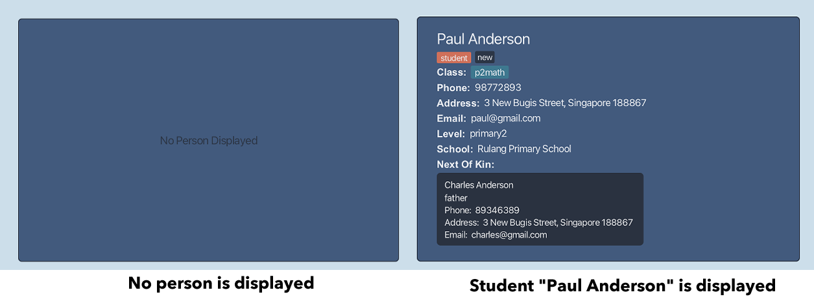

myStudents is **a desktop app for managing students of a tuition center, optimized for use via a Command Line Interface (CLI)** while still having the benefits of a Graphical User Interface (GUI). If you can type fast, myStudents can get your student management tasks done faster than traditional GUI apps.

* Table of Contents
{:toc}

--------------------------------------------------------------------------------------------------------------------

:pencil2: **Configuring the app**  
Users can change the default configurations of the app in the `preference.json` file located in the same place where they download the app into.  
A `preference.json` file will be created when you first run the application. Users can then edit the file to suit their needs.  

**What users can change:**
* The size of the window such as its height and width (in pixels).
* At which part of the screen the app will be displayed.
* The default theme.
* Where data will be loaded from and stored into.

| Settings 	                            | Default Value 	                       |
|---------------------------------------|---------------------------------------|
| Window Width 	                        | 670px 	                               |
| Window Height 	                       | 950px 	                               |
| Window Coordinates 	                  | null 	                                |
| Theme 	                               | Light Theme 	                         |
| Student Address Book Location 	       | data\\\studentaddressbook.json 	      |
| Tutor Address Book Location 	         | data\\\tutoraddressbook.json 	        |
| Tuition Class Address Book Location 	 | data\\\tuitionclassaddressbook.json 	 |

## Layout

### 1.Command Box

This is where you key in commands. After typing the commands, simply press `return` on your keyboard to execute them. 

### 2.Feedback Box

This is where the feedback information would be displayed after you execute a command. For example, after you keyed in an invalid command, the feedback “Invalid format” would be shown in the box for your reference.

### 3.List Display Panel

This is where the current list of entities is shown. Only one of the three entities, student, tutor and class will be shown at one time.
In student and tutor lists, you could click at the student or tutor cards to show their description in the description panel.

### 4.List Tabs

There are three list tabs: Student, Tutor and Class indicating the current displayed list showing in the list display panel.
You could click at the list tabs to switch to different lists.

### 5.Description Panel

This is where the description of a specified student or tutor is shown. When there is no person on display, the line “No Person Displayed” would be shown.

### 6. Toolbar 

#### File 
The ` File`  menu contains `Export` and Exit`. 
`Export` allows you to export your data into a `.csv` file. 
 `Exit` allows the software to exit after three seconds of pause.

#### Help
`Help` allows you to view the help information regarding the software.

#### Theme
 `Theme` allows you to change the color scheme of the software. There are four themes provided: `Light Theme`, `Dark Theme`,  `Green Theme` and `Pink Theme`.

## Features

### Viewing help: `help`

Shows a message explaining how to execute a valid command. 

Format:

`help [command]`

Examples:
* `help add`
* `help edit`

To view all the` [commands]`, key in `help` and press `return`.

### Exiting the software: `exit`

Exits the software after playing the exit animation.

Format: `exit`

### Adding a person: `add`

Adds a person to the database.

Format:

`add student n/<name> p/<phone> e/<email> a/<address> s/<school> l/<level> [#/<tag>]`

`add tutor n/<name> p/<phone> e/<email> a/<address> q/<qualification> i/<institution> [#/<tag>]`

Examples:
* `add student n/John Doe p/98765432 e/johndoe@example.com a/John street, block 123, #01-01 s/Example Primary School l/Primary 3 #/badBoy`
* `add tutor n/Betsy Crowe p/1234567 e/betsycrowe@example.com a/Newgate st, block 123, #01-01 q/MSc, Master of Science i/National University of Singapore #/mostLiked`

### Adding a class: `add`

Adds a class to the database.

Format:

`add class n/<name> s/<subject> l/<level> d/<day> t/<time> [#/<tag>]`

Examples:
* `add class n/P2-MATH-F12 s/Math l/Primary 2 d/Friday t/12:00 - 14:00`
* `add class n/S1-ENG-T10 s/Math l/Secondary 1 d/Thursday t/10am to 12pm`

### Editing an entity: `edit`

Edits an entity in the database. 

Format:

`edit 1 [n/<name>] [p/<phone>] [e/<email>] [a/<address>] [s/<school>] [l/<level>] [#/<tag>]`

`edit 1 [n/<name>] [p/<phone>] [e/<email>] [a/<address>] [q/<qualification>] [i/<institution>] [#/<tag>]`

`edit 1 [n/<name>] [s/<subject>] [l/<level>] [d/<day>] [t/<time>] [#/<tag>]`

* Arguments that are valid depends on which list is being displayed currently.
* Only arguments specified will overwrite the existing values.

Examples:
* edit 1 n/Tom Doe
* edit 2 l/Primary 5 d/Monday

### Listing all persons : `list`

Shows a list of the specified entities in the database.

Format: `list <entity>`

Examples:
* `list student`
* `list tutor`
* `list class`

### Deleting an entity: `delete`

Deletes the specified entity from the current displayed list.

Format: `delete <index>`

* The index refers to the index number shown in the displayed list.
* The index must be a positive integer 1, 2, 3, …

Examples:
* `delete 2`

### Clears list: `clear`

Clears the current displayed list of its contents.

Format: `clear`

* Take note of which list you are clearing.

### Sort list: `sort`

Sorts the current list chronologically, alphabetically, or in reverse order.

Format: `sort [default/alpha/reverse]`

* **default**: sorts the list in order of entries added from oldest to newest.
* **alpha**: sorts the list alphabetically with reference to the name.
* **reverse**: sorts the list in reverse order.

### Searching by multiple fields: `find`

Finds entities from the current list based on multiple fields at a time such that the fields of the entity specified contains the respective keywords.

Format: `find PREFIX/KEYWORD [MORE PREFIX/KEYWORD]...`
* The input `PREFIXES` is case-sensitive and must be in lowercase. e.g. `n/hans e/notgmail.com`
* The input `KEYWORDS` is case-insensitive. e.g. `n/hans` will match a student named “Hans”
* Partial `KEYWORDS` will be matched e.g. `n/Ha` will match a student named “Hans Jones”
* The order of the `PREFIX/KEYWORD` pair does not matter. e.g. `n/Alice p/12345678` vs `p/12345678 n/Alice`
* All fields are optional, but at least one pair of `PREFIX/KEYWORD` must be specified.
* `KEYWORDS` must not contain the `/` character.
* If there are repeated `PREFIXES`, only the latest one will be taken.

Examples:
(insert screenshot of the current list being the student list)
* `find n/john s/evergarden` returns the students, `Johnny` and `John Doe`, from “Evergarden Secondary School” in the student list.

(insert screenshot of the current list being the class list)
* `find a/clementi e/example.com i/nus` returns the tutors who live in Clementi, have emails with domain name “example.com” and graduated from NUS.

(insert screenshot of the current list being the class list)
* `find l/p1math d/sunday #/difficult` returns all classes whose names contain “p1math”, conducted on Sundays and have the tag “difficult”.

### Assign class to a person: `assign`

Assign an existing tuition class to a specified student/tutor.

Format: `assign INDEX n/[class name]`

* `assign` command only works when the displayed list is a student or tutor list.
* The index refers to the index number shown in the displayed list.
* The index must be a positive integer 1, 2, 3, …
* Class name must be the name of a tuition class that already exists in the tuition class list.
* The tuition class to be assigned to the specified student/tutor must not have been assigned beforehand.

Examples:
* `assign 1 n/P3 maths`

### Unassign class from a person: `unassign`

Unassign an existing tuition class from a specified student/tutor.

Format: `unassign INDEX n/[class name]`

* `unassign` command only works when the displayed list is a student or tutor list.
* The index refers to the index number shown in the displayed list.
* The index must be a positive integer 1, 2, 3, …
* Class name must be the name of a tuition class that already exists in the tuition class list.
* The tuition class to be unassigned from the specified student/tutor must have been assigned to the 
student/tutor beforehand.

Examples:
* `unassign 1 n/P3 maths`

### Showing the details of a person: `show`

In the student and tutor list, the details of the persons are hidden due to security concerns. You could access the person’s details by executing the show command.

Format: `show [index]` 
*`show 1` shows the description of the first student in the list

Note that `show` is an invalid command for class list since the details of classes are already in the class list, thus when you are in the class list.
*`show 2` is an invalid command 

### Add next of kin to a student: `nok`

Adds a next of kin to an existing student in the current list.

Format: 

`nok <index>`

`nok <index> n/<name> p/<phone> e/<email> a/<address> r/<relationship> [#/tag]`

* The index refers to the index number shown in the displayed list.
* This command only works when the displayed list is listing students.
* Not specifying any arguments after index will remove the next of kin from the student of that index.

Examples:

* `nok 1 n/Mama Doe p/87654321 e/mamadoe@example.com a/John street, block 123, #01-01 r/Mother #/bestMomAward`

### Exporting address books to csv

Export Students, Tutors, and TuitionClasses address books into their own .csv files to be used in other programs.

Format: Click on the "*File*" tab at the top left hand corner of `myStudent` and click on "*Export*" in the dropdown menu.

* The csv files will be saved in the same location as the .json files as specified in `preferences.json`.
* The default location is in a folder named `data` in the same location where you downloaded the myStudent.jar file.

### FAQs
**Q:** Does myStudent need an Internet connection?

**A:** No, myStudent is an offline software that does not need Internet connection to use.

**Q:** Can I move myStudent from one computer to another without loss of data?
**A:** Yes, by copying the home folder containing myStudent.jar to another computer, you could resume your work on another computer without loss of data.

### Troubleshooting

Warnings issued when Mac users are trying to open the software by double-clicking the icon.
“myStudents.jar” cannot be opened because it is from an unidentified developer.
Instead of double-clicking the software icon, you may want to right-click the icon and choose `Open`, then click `Open` in the pop-up window. Note that you only need to do this for the first time. For future usage, simply double-click the icon to launch the software.

Still unable to launch the software?
Make sure that you have installed `Java 11` or above by doing the following checking:

For Mac Users:
Open your terminal and type `java -version` and press `enter`. Information returned should show the current version of Java installed on your computer.

For Windows Users:
Open the command prompt and type `java -version` and press `enter`. Information returned should show the current version of Java installed on your computer.

If you do not have `Java 11` or above installed, please install from [here](https://www.oracle.com/sg/java/technologies/downloads/).
