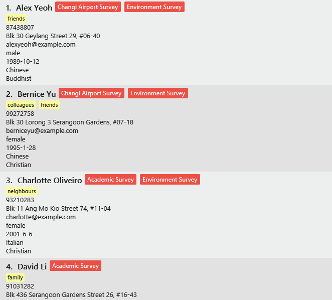
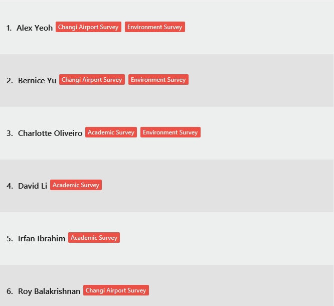

Survin is a desktop application for surveyors to use to keep track of people they have surveyed. The surveyor can easily follow up with people they have surveyed for additional information or for confirmation. The user interacts with the application using a CLI, and it has a GUI created with JavaFX. It is written in Java.

- Table of Contents
{:toc}

---

## Quick start

1. Ensure you have Java `11` or above installed in your Computer.

2. Download the latest `Survin.jar` from [here](https://github.com/AY2223S1-CS2103-F13-2/tp).

3. Copy the file to the folder you want to use as the _home folder_ for the app.

4. Double-click the file to start the app. The GUI similar to the below should appear in a few seconds. Note how the app contains some sample data.<br>
   

5. Type the command in the command box and press Enter to execute it. e.g. typing **`help`** and pressing Enter will open the help window.<br>
   Some example commands you can try:

    - **`list`** : Lists all contacts.

    - **`add`**`n/John Doe p/98765432 e/johnd@example.com a/John street, block 123, #01-01 g/male b/1989-10-1 ra/White American re/Christian s/Environment Survey` : Adds a contact named `John Doe` to Survin.

    - **`delete`**`3` : Deletes the 3rd contact shown in the current list.

    - **`clear`** : Deletes all contacts.

    - **`exit`** : Exits the app.

6. Refer to the [Features](#features) below for details of each command.

---

## Features

<div markdown="block" class="alert alert-info">

**:information_source: Notes about the command format:**<br>

-   Words in `UPPER_CASE` are the parameters to be supplied by the user.<br>
    e.g. in `add n/NAME`, `NAME` is a parameter which can be used as `add n/John Doe`.

-   Items in square brackets are optional.<br>
    e.g `n/NAME [t/TAG]` can be used as `n/John Doe t/friend` or as `n/John Doe`.

-   Items with `…`​ after them can be used multiple times including zero times.<br>
    e.g. `[t/TAG]…​` can be used as ` ` (i.e. 0 times), `t/friend`, `t/friend t/family` etc.

-   Parameters can be in any order.<br>
    e.g. if the command specifies `n/NAME p/PHONE_NUMBER`, `p/PHONE_NUMBER n/NAME` is also acceptable.

-   If a parameter is expected only once in the command but you specified it multiple times, only the last occurrence of the parameter will be taken.<br>
    e.g. if you specify `p/12341234 p/56785678`, only `p/56785678` will be taken.

-   Extraneous parameters for commands that do not take in parameters (such as `list`, `exit` and `clear`) will be ignored.<br>
    e.g. if the command specifies `list 123`, it will be interpreted as `list`.

-   A person is uniquely characterised by their name, phone number and email. You cannot have 2 people with the same name, phone number, and email.

</div>

### Viewing help : `help`

Shows a message explaning how to access the help page.


Format: `help [COMMAND_NAME]`

-   Use `help [COMMAND_NAME]` to see more information about the command features and usages.
-   There is a help window for each command in Survin.
-   Using `help` without any parameters will prompt you to our [user guide](https://ay2223s1-cs2103-f13-2.github.io/tp/UserGuide.html).

### Adding a person: `add`

Adds a person to the app.

Format: `add n/NAME p/PHONE e/EMAIL a/ADDRESS g/GENDER b/BIRTHDATE ra/RACE re/RELIGION [s/SURVEY]… [t/TAG]…`

-   Adds a surveyee with the all the descriptions listed.
-   All descriptors have to be specified and follow their own specified format.

<div markdown="span" class="alert alert-primary">:bulb: **Tip:**
A person can have any number of surveys and tags (including 0)
</div>

Examples:

-   `add n/John Doe p/98765432 e/johnd@example.com a/John street, block 123, #01-01 g/male b/1989-10-1 ra/White American re/Christian s/Environment Survey` Adds a person with the descriptions as stated.
-   `add n/Betsy Crowe t/friend e/betsycrowe@example.com a/Newgate Prison p/1234567 t/criminal g/female b/1991-11-31 ra/Chinese re/Buddhist`

### Listing all persons : `list`

Shows a list of all persons in the app.

Format: `list`

### Editing a person : `edit`

Edits an existing person in Survin.

Format: `edit INDEX [n/NAME] [p/PHONE] [e/EMAIL] [a/ADDRESS] [g/GENDER] [b/BIRTHDATE] [ra/RACE] [re/RELIGION] [s/SURVEY]… [t/TAG]…`

-   Edits the surveyee at the specified INDEX. The index refers to the index number of the surveyee you wish to edit, as shown in the display list. The index must be a **positive integer**.
-   At least one of the optional fields has to be provided. (E.g. Phone or Email)
-   Existing value in specified field will be updated to the new value.
-   When editing tags, the existing tags of the person will be removed i.e adding of tags is not cumulative.
-   You can remove all the person’s tags by typing `t/` without
    specifying any tags after it.

Examples:

-   `edit 1 p/91234567 e/johndoe@example.com` Edits the phone number and email address of the 1st person to be `91234567` and `johndoe@example.com` respectively.
-   `edit 2 n/Betsy Crower t/` Edits the name of the 2nd person to be `Betsy Crower` and clears all existing tags.

### Deleting a person : `delete`

Delete an existing person in Survin by index or delete all persons satisfying the specified attributes.

Format: `delete INDEX` OR `delete [ra/RACE] [re/RELIGION] [s/NAME OF SURVEY]`

-   Delete surveyee(s) satisfying the conditions specified. (the conditions cannot be all empty)
-   The index refers to the index number shown in the displayed person list.
-   The index **must be a positive integer** 1, 2, 3, …
-   Fields must be non-empty if deleting by attributes
-   Note that deleting using `s/NAME OF SURVEY` only deletes a person if he/she only has that one survey.

Example:

-   `list` followed by `delete 2` deletes the 2nd person in the app.
-   `view n/Betsy` followed by `delete 1` deletes the 1st person in the results of the `view` command.
-   `delete ra/Chinese re/Christian` Deletes all surveyees that are Chinese and Christian.

### Clone a person : `clone`

Creates a new person with updated details based on an existing person in Survin, the new person created will be added to end of existing app.

Format: `clone INDEX [n/NAME] [p/PHONE] [e/EMAIL] [a/ADDRESS] [g/GENDER] [b/BIRTHDATE] [ra/RACE] [re/RELIGION] [s/SURVEY] [t/TAG]…`

- Clones the surveyee at the specified INDEX. The index refers to the index number of the surveyee you wish to clone, as shown in the display list. The index must be a **positive integer**.
- At least one of the unique optional fields (Name, Phone or Email) has to be provided.
- A new person with updated values in specified field will be added to the address book.
- When updating tags or surveys, the existing tags or surveys of the person will be removed i.e adding of tags is not cumulative.
- You can remove all the person’s tags by typing `t/` without specifying any tags after it.
- You can remove all the person’s surveys by typing `s/` without specifying any surveys after it.

Examples:

-   `clone 1 p/91234567 e/johndoe@example.com` Add a new person with all details of the 1st person except the phone number and email will be updated to `91234567` and `johndoe@example.com` respectively.
-   `clone 2 n/Betsy Crower t/` Add a new person with all details of the 2nd person except the name will be updated to `Betsy Crower` and all tags are removed.

### Viewing a person : `view`

Views the attributes of all surveyees with some specified attributes.

Format: `[n/NAME] [p/PHONE] [e/EMAIL] [a/ADDRESS] [g/GENDER] [b/BIRTHDATE] [ra/RACE] [re/RELIGION] [s/NAME OF SURVEY]`

-   The search is case-insensitive. e.g `alex` will match `Alex`
-   The order of the keywords does not matter. e.g. `Alex Tan` will match `Tan Alex`
-   Only full words are matched. e.g. `Ale` will not match `Alex`
-   Use quotation marks to match exact phrases. e.g. `"Alex Tan"` will not match `Tan Alex`
-   Quotation marks only match exact phrases. e.g. `Alex T` will not match `Alex Tan`
-   For all attributes except `email` and `birthdate`, only full words will be matched e.g. `Ale` will not match `Alex`
-   For multiple worded input, `view` lists all persons whose attributes contain any of the words or phrases specified.
    e.g. `view n/Jane Doe "Alex Tan"` lists all persons whose names contain any of the following: `Jane`, `Doe` or `Alex Tan`.
-   When using `view` on an attribute with multiple objects (e.g. `Survey` or `Tag`), `view` performs the search on each survey and tag.
-   When using `view` on any attribute, only the last prefix is parsed. e.g. `view ra/chinese ra/malay g/male g/female` lists female malay persons, ignores `ra/chinese` and `g/male`.

<div markdown="span" class="alert alert-primary">:bulb: **Tip:**
Fields must be non-empty.
</div>

Examples:

```
view g/female ra/chinese re/christian
> 2 persons listed!
> Jane Doe 91234567 jane_doe@example.com, …
> Jenette Doe 81234567 jenette_doe@example.com, …
```

### Append to a person: `append`

Append surveys or tags to the person identified by the index number in the command.

Format: `INDEX [s/SURVEYS]... [t/TAGS]...`

-   Person should not already have any of the surveys or tags that you are appending.
-   The append command is case-sensitive. e.g. you can append both `Food Survey` and `food survey`.
-   At least one of the optional fields has to be provided. (Survey or Tag)
-   Able to append multiple surveys and tags in a single command.
-   Fields must be non-empty.

Example: `append 1 s/Food Survey s/Environment Survey t/friend t/student`

### Unappend from a person: `unappend`

Unappend surveys or tags from the person identified by the index number in the command.

Format: `INDEX [s/SURVEYS]... [t/TAGS]...`

-   The unappend command is case-sensitive. e.g. you can only unappend `Food Survey` by typing `Food Survey` and not `food survey`.
-   At least one of the optional fields has to be provided. (Survey or Tag)
-   Able to unappend multiple surveys and tags in a single command.
-   Fields must be non-empty.

Example: `unappend 1 s/Food Survey s/Environment Survey t/friend t/student`

### Change theme : `theme`

Changes the theme of the app. Only "light" or "dark".

Format: `THEME ("light" or "dark")`

Examples:

-   `theme light`
-   `theme dark`

### Toggle mode of list : `toggle-list-mode`

Toggle the mode of the list between a compacted or an expanded mode.

<div markdown="span" class="alert alert-info">:information_source: **Note:** You can toggle the modes of individual elements in the list by clicking on them.

</div>

Expanded Mode:<br>


Compacted Mode:<br>


Format: `toggle-list-mode`

### Mark or unmark a survey as done or not done: `mark/unmark`

Changes the status of the survey to done or not done. More specifically, mark changes the status of the specified survey to done while unmark changes the status of the specified survey to not done.

Format: `mark INDEX s/NAME OF SURVEY`, `unmark INDEX s/NAME OF SURVEY`

Example: `mark 1 s/Shopping survey`, `unmark 3 s/Environmental survey`

### Shortcut keys

These shortcut keys will add texts to the command box, this helps the users to enter the commands faster.

-   `CTRL + N` adds `add n/ p/ e/ a/ g/ b/ ra/ re/ s/ t/` to the command box.
-   `CTRL + E` adds `edit` to the command box.
-   `CTRL + D` adds `delete` to the command box.
-   `CTRL + M` adds `mark` to the command box.
-   `CTRL + U` adds `unmark` to the command box.
-   `CTRL + Z` adds `undo` to the command box.
-   `CTRL + L` adds `clone` to the command box.
-   `CTRL + I` adds `view` to the command box.
-   `CTRL + R` clears all texts in the command box.

### Undo command

Undoes commands that are undoable.

Format: `undo`

Example: `undo`

### Clearing all entries : `clear`

Clears all entries from the app.

Format: `clear`

### Exiting the program : `exit`

Exits the program.

Format: `exit`

### Saving the data

Survin are saved in the hard disk automatically after any command that changes the data. There is no need to save manually.

### Editing the data file

Survin data are saved as a JSON file `[JAR file location]/data/survin.json`. Advanced users are welcome to update data directly by editing that data file.

<div markdown="span" class="alert alert-warning">:exclamation: **Caution:**
If your changes to the data file makes its format invalid, Survin will discard all data and start with an empty data file at the next run.
</div>

### Archiving data files `[coming in v2.0]`

_Details coming soon ..._

---

## FAQ

**Q**: How do I transfer my data to another Computer?<br>
**A**: Install the app in the other computer and overwrite the empty data file it creates with the file that contains the data of your previous Survin home folder.

---

## Command summary

| Action                  | Format, Examples                                                                                                                                                                                                                                                                  |
|-------------------------|-----------------------------------------------------------------------------------------------------------------------------------------------------------------------------------------------------------------------------------------------------------------------------------|
| **Add**                 | `n/NAME p/PHONE e/EMAIL a/ADDRESS g/GENDER b/BIRTHDATE ra/RACE re/RELIGION [s/SURVEY]... [t/TAG]...` <br> e.g., `add n/John Doe p/98765432 e/johnd@example.com a/311, Clementi Ave 2, #02-25 g/male b/1998-11-28 ra/Chinese re/Christian s/Shopping survey t/friends t/owesMoney` |
| **Clear**               | `clear`                                                                                                                                                                                                                                                                           |
| **Delete**              | `delete INDEX`<br> e.g. `delete 3`                                                                                                                                                                                                                                                |
| **Delete by attribute** | `delete [n/NAME] [p/PHONE] [e/EMAIL] [a/ADDRESS] [g/GENDER] [b/BIRTHDATE] [ra/RACE] [re/RELIGION] [s/NAME OF SURVEY]`<br> e.g. `delete ra/Chinese`                                                                                                                                |
| **Edit**                | `edit INDEX [n/NAME] [p/PHONE_NUMBER] [e/EMAIL] [a/ADDRESS] [t/TAG]`<br> e.g.,`edit 2 n/James Lee e/jameslee@example.com`                                                                                                                                                         |
| **Exit**                | `exit`                                                                                                                                                                                                                                                                            |
| **View**                | `view n/NAME p/PHONE e/EMAIL a/ADDRESS g/GENDER b/BIRTHDATE ra/RACE re/RELIGION s/SURVEY `<br> e.g., `view g/female ra/chinese re/christian`                                                                                                                                      |
| **Undo**                | `undo`                                                                                                                                                                                                                                                                            |
| **Theme**               | `theme`                                                                                                                                                                                                                                                                           |
| **Mark**                | `mark INDEX [s/NAME OF SURVEY]`<br> e.g., `mark 1 s/Shopping Survey`                                                                                                                                                                                                              |
| **Unmark**              | `unmark INDEX [s/NAME OF SURVEY]`<br> e.g., `unmark 1 s/Shopping Survey`                                                                                                                                                                                                          |
| **Append**              | `append INDEX [s/SURVEY]... [t/TAG]...`<br> e.g., `append 1 s/Food Survey s/Environment Survey t/friend t/student`                                                                                                                                                                |
| **Unappend**            | `unappend INDEX [s/SURVEY]... [t/TAG]...`<br> e.g., `unappend 1 s/Food Survey s/Environment Survey t/friend t/student`                                                                                                                                                            |
| **Toggle list mode**    | `toggle-list-mode`                                                                                                                                                                                                                                                                |
| **Clone**               | `clone INDEX [n/NAME] [p/PHONE_NUMBER] [e/EMAIL]` <br> e.g., `clone 1 n/James Lee p/91234567 e/jameslee@example.com`                                                                                                                                                              |
| **List**                | `list`                                                                                                                                                                                                                                                                            |
| **Help**                | `help` and `help [NAME_OF_COMMAND]`                                                                                                                                                                                                                                               |

## Parameters format

**NAME**: Names should only contain alphanumeric characters and spaces, and it should not be blank.
**PHONE**: Phone numbers should only contain numbers, and it should be at least 3 digits long.
**EMAIL**: Emails should be of the format local-part@domain and adhere to the following constraints:

1. The local-part should only contain alphanumeric characters and these special characters, excluding the parentheses, (+_.-). The local-part may not start or end with any special characters.
2. This is followed by a '@' and then a domain name. The domain name is made up of domain labels separated by periods.
3. The domain name must:
    - end with a domain label at least 2 characters long
    - have each domain label start and end with alphanumeric characters
    - have each domain label consist of alphanumeric characters, separated only by hyphens, if any.

**ADDRESS**: Addresses can take any values, and it should not be blank.
**GENDER**: Gender should only be 'male', 'female', or 'others', and it should not be blank.
**BIRTHDATE**: Birthdate should be in the format of yyyy-mm-dd, it should be a valid date, and it should not be blank. Birthdate should also not be in the future.
**RACE**: Race should only contain alphabetical characters and spaces, and it should not be blank.
**RELIGION**: Religion should only contain alphabetical characters and spaces, and it should not be blank.
**SURVEY**: Survey should only contain alphanumeric characters and spaces, and it should not be blank.
**TAG**: Tags names should be alphanumeric.
