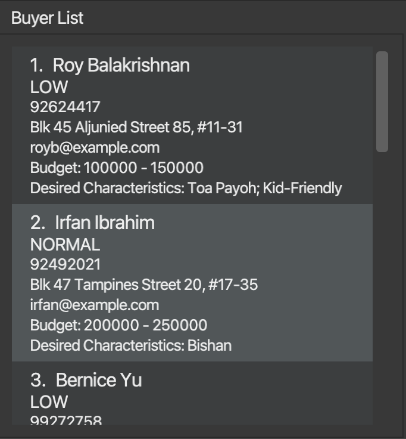

Cobb is a **Contact and Property Management System** that aims to help property agents and brokers manage their customer
base and properties, as well as match and gain actionable insights from stored data. As property agents, you can make use
of Cobb's flexible **filtering and sorting** systems to understand key demographics of your customer base. Cobb's **tagging** system
allows you to organise entries in your database into defined categories. Finally, make use of Cobb's **matching** systems
to match-make buyers and properties or vice-versa, boosting sales potential.

The only tools you need to make use of the full suite of capabilities Cobb has to offer are your hands and a keyboard.

This **user guide** aims to provide an in-depth overview of how to set up, use, and debug Cobb. Take a look at the [command summary](#command-summary)
section for a quick overview of the different commands along with how to use them, or dive into the [quick start](#quick-start)
section to get started. Also, be sure to check out the [key definitions](#key-definitions) section of the guide if you are confused
by any of the terms used throughout it!

* Table of Contents
{:toc}

--------------------------------------------------------------------------------------------------------------------

## Quick start

1. Ensure you have Java `11` or above installed in your Computer. This [link](https://docs.oracle.com/en/java/javase/11/install/overview-jdk-installation.html#GUID-8677A77F-231A-40F7-98B9-1FD0B48C346A)
   (external link to Oracle) provides a step-by-step installation guide for Java, if needed.

2. Download the latest `cobb.jar` from our [release page](https://github.com/AY2223S1-CS2103T-F12-1/tp/releases).

3. Copy the file to the folder you want to use as the _home folder_ for Cobb. All data will be created and stored
   within this directory.

4. Double-click the file to start the app. A window similar to the below should appear in a few seconds. Note how the application contains some sample data. 
   

Congratulations! Cobb is now set up and ready to work on your system.

If you encounter any bugs during the setup process, do check out the [FAQ](#faq) section of this guide, which hopefully
contains some information that can help you diagnose your issue.

:exclamation: **Caution:**
On first launch, Cobb will create a few files that have the extension `.json` in its *home directory*. These files are used
by Cobb to store its data. **Edit these at your own risk**, as Cobb will start with an empty database if it detects any
error in the formatting of the data in these files.

## Key definitions

This section aims to define some terms that pop up throughout the user guide. These terms are used often, so it would be 
good to take note of them before continuing.

### Command-specific terms
1. **Command**: A piece of instruction that a user types into the command input box to instruct Cobb's behaviour.
   Commands have many variations, and can serve many purposes.
2. **Syntax**: The manner in which is a command is to be typed. Can be thought of as the "format" of the command.
3. **Parameter**: An input to a command. Can be thought of as a piece of information a user provides that determines the
   behaviour of a specific command.
4. **Command string**: The text that forms the command.
5. **Flag**: A marker that signifies the start of a parameter to a command. For Cobb, in the command `findbuyer -k Tim`, 
   `-k` is the flag, and `Tim` is the parameter.
6. **Fuzzy**: A flag that signifies loose filtering, that is, given a set of filter requirements, any user that matches at least one
   the given requirements will be returned.
7. **Strict**: A flag that signifies tight filtering, that is, given a set of filter requirements, any user matching all of the
   given requirements will be returned.
8. **Ascending**: Related to order; from low to high or minimum to maximum.
9. **Descending**: Related to order; from high to low or maximum to minimum. 

### Person-specific terms
1. **Name**: The name of the person.
2. **Phone**: The phone number of the person.
3. **Email**: The email of the person.
4. **Address**: The address of the person.
5. **Price Range**: The price range of properties that a person might consider buying. That is, any property whose price
   falls within this range will be considered by the buyer.
6. **Characteristics**: The characteristics of a property that a person desires. For example, a person that has characteristics
   `bright; sunny` is ideally looking for a property that is also `bright` and `sunny`.
7. **Priority**: The priority of the person. Can be `LOW`, `NORMAL` or `HIGH`.

### Property-specific terms
1. **Name**: The name of the property.
2. **Price**: The price of the property.
3. **Address**: The address of the property.
4. **Description**: A short description of the property.
5. **Characteristics**: The characteristics associated with a property. For example, a property that has characteristics
   `windy; roomy` is both `windy` and `roomy`.
6. **Owner**: The name of the owner of the property.
7. **Phone**: The phone number of the owner of the property.

## Layout

When you launch Cobb, Cobb will appear on your screen as a window, or a [Graphical User Interface](https://en.wikipedia.org/wiki/Graphical_user_interface) (GUI). 
Let's take a look at the different components that make up Cobb's GUI.

#### 1. Command Input Box and Command Output Box

The __command input box__ is located where the placeholder text `Enter command here...` is. 
Clicking on it will allow you input commands for Cobb to execute. Here are some commands you can test to start with.

* **`listbuyers`** : Lists all buyers in the database, that is, clears any buyer filters currently in place.

* **`addbuyer -n Tim Cook -ph 91234567 -r 1000000-2500000 -a 10 lorong street avenue -c bright; sunny`**: Adds a buyer named "Tim Cook" with phone number "91234567" to the database.
 This buyer has a specified price range, and desired characteristics for the property he wants to buy.

* **`deletebuyer 1`** : Deletes a buyer at index 1 of the current list from the database.

* **`help`** : Displays some help text.

* **`exit`** : Exits the app.

Refer to the [Features](#features) below for details of each command.

The __command output box__ is located directly beneath the _command input box_. Upon execution of any command,
Cobb will display some information regarding the command, regardless of whether the command was successfully or 
unsuccessfully executed.

:exclamation: **Note:**
If a command was not successfully executed, the text within the command input box will turn red.

#### 2. Buyer List

The __buyer list__ displays information regarding buyers who are currently stored in Cobb's database.

The buyer list can be filtered and modified using commands given in the [features](#features) section of the guide.

#### 3. Property List

The __property list__ displays information regarding properties that are currently stored in Cobb's database.

The property list can be filtered and modified using commands given in the [features](#features) section of the guide.

#### 4. Help Window

The __help window__ displays a link to Cobb's User Guide, which is what you are currently reading.

It appears when the user executes a `help` command.

--------------------------------------------------------------------------------------------------------------------

## Features

**:information_source: Notes about the command format:** 

* The first word in the command string actually specifies which command we are invoking. For example, `help` specifies that we are invoking the `help` command, while `adduser -n John Doe` specifies that we are using the `adduser` command.

* Items in square brackets are parameters that must be passed into the command. 
  e.g. `[-n NAME]` indicates that the command requires a `NAME` parameter to be passed in.

* Parameters that contain angled braces `<>` means that the valid values that a parameter can take must be one of the values within the braces. 
  e.g. `-priority [PRIORITY <HIGH, LOW>]` means that the `priority` parameter can take values `HIGH` or `LOW`.

* Parameters that contain curly braces `{}` means that the parameters are optional, and can be excluded from the command if not required. 
  For an example, `{-c CHARACTERISTICS}` means that the `CHARACTERISTICS` parameter is optional.

* Parameters can be in any order. 
  e.g. if the command specifies `[-n NAME] [-p PHONE_NUMBER]`, `[-p PHONE_NUMBER] [-n NAME]` is also acceptable.

* To specify a parameter and the value that it will take, type the parameter's flag followed by a space, and then its value. 
  e.g `-n John Doe` will define the parameter `name` to store the value `John Doe`.

* If commands are missing specific parameters required for it to execute, an error message will be displayed that contains 
  information about the syntax of the command and its required parameters.

### Viewing help : `help`

Displays a link for the user to access Cobb's User Guide for further help.

Syntax: `help`

### Adding a buyer to the database: `addbuyer`

Adds a buyer to the database with relevant buyer information 
Syntax: `addbuyer [-n NAME] [-ph PHONE] [-e EMAIL] [-a address] {-r PRICE RANGE} {-c CHARACTERISTICS} {-priority PRIORITY <HIGH, NORMAL, LOW>}`

The `-n` flag indicates the name of the buyer. 
The `-ph` flag indicates the buyer’s phone number. 
The `-e` flag indicates the buyer’s email. 
The `-a` flag indicates the buyer’s house address. 
The `-r` flag indicates the price range of properties that the buyer can accept. 
The `-c` flag indicates the characteristics that the buyer is looking for in a property. 
The `-priority` flag indicates the priority of the buyer.

:bulb: **Tip:**
The range field and the characteristics field are optional.
That is, it is perfectly okay to try and add a buyer that does not have these fields.

Examples: 
`addbuyer -n Tim -ph 87321237 -e tim@gmail.com -a S648234 -priority HIGH` : Adds a buyer named Tim to the database. Tim has high priority. 
`addbuyer -n Jane -ph 89991237 -e jane@gmail.com -a S123456 -r 2000-5000 -c bright; sunny` : Adds a buyer named Jane to the database.
Ideally, Jane would like a property that costs between $2000 - $5000, and has characteristics "bright" and "sunny".

### Adding a property to the database: `addprop`

Adds a property to the database along with relevant information. 
Syntax: `addprop [-n NAME] [-price PRICE] [-a ADDRESS] [-d DESCRIPTION] {-c CHARACTERISTICS} [-owner OWNER NAME] [-ph PHONE]`

The `-n` flag indicates the name of the property. 
The `-price` flag indicates the property’s price. 
The `-a` flag indicates the property’s address. 
The `-d` flag indicates the property’s description (characteristics). 
The `-c` flag indicates the characteristics associated with the property. 
The `-owner` flag indicates the name of the owner of the property. 
The `-ph` flag indicates the phone number of the owner of the property. 

Examples:  
`addprop -n Peak Residences -a 333 Thompson Road -price 1000000 -d long property description -owner Bob -ph 91234567`: Adds a property called "Peak Residences" to the database along with its relevant description.
The property is owned by Bob with a phone number of 91234567.

### Deleting buyers from the database: `deletebuyer`

Syntax: `deletebuyer INDEX`

:exclamation: **Note:**
Note that this command has a slightly different syntax from the usual commands, as it takes a number representing the index of the object that you would like to delete
instead of flags like other commands. This index is the number that you see next to the name of the object in the list.

The `INDEX` specified in this command refers to the index of the entry that is currently visible on the list.
Note that if an entry has been filtered out / is not currently on the list, then a `deletebuyer` command cannot be executed on it.

Examples: 
`deletebuyer 5`: Deletes the fifth buyer currently visible on the buyer list.

### Deleting properties from the database: `deleteprop`

Syntax: `deleteprop INDEX`

The `INDEX` specified in this command refers to the index of the entry that is currently visible on the list.
Note that if an entry has been filtered out / is not currently on the list, then a `deleteprop` command cannot be executed on it.

Examples: 
`deleteprop 5`: Deletes the fifth property currently visible on the property list.

### Edit a buyer entry in the database: `editbuyer`

Syntax: `editbuyer INDEX {-n NAME} {-ph PHONE} {-e EMAIL} {-a ADDRESS} {-r PRICERANGE} {-c CHARACTERISTICS} {-priority PRIORITY<HIGH, NORMAL, LOW>}`

Edits a buyer’s details with specified information in specified categories.

The `-n` flag indicates the buyer's new name. 
The `-ph` flag indicates the buyer's new phone number. 
The `-e` flag indicates the buyer's new email address. 
The `-a` flag indicates the buyer's new address. 
The `-r` flag indicates the buyer's new acceptable price range. 
The `-c` flag indicates the buyer's new desired property characteristics. 
The `-priority` flag indicates the buyer's new priority - Priority values must be one of `HIGH, NORMAL, LOW`.

:exclamation: **Note:**
Note that we are updating existing entries in the database, hence all parameters above are optional,
as we can choose to update a parameter without changing the others.

The `INDEX` field specifies the index of the buyer that we want to edit
on the current visible buyer list, so if the buyer is not on this list, then we cannot execute this command on the buyer.

Examples: 
`editbuyer 3 -n John Doe -e johndoe@yahoo.com -r 40000-50000 -priority HIGH`: Edits buyer at index 3 to have a new name "John Doe", new email "johndoe@yahoo.com", new acceptable price range of $40000 - $500000, and a high priority. 
`editbuyer 1 -c bright; sunny`: Edits buyer at index 1 to have new desired characteristics of bright and sunny.

### Edit a property entry in database: `editprop`

Syntax: `editprop INDEX {-n NAME} {-price PRICE} {-a ADDRESS} {-d DESCRIPTION} {-c CHARACTERISTICS} {-owner OWNERNAME} {-ph PHONE}`

Edits a property’s details with specified information in specified categories.

The `INDEX` indicates which property in the list we are choosing to edit.
The `-n` flag indicates the property's new name. 
The `-p` flag indicates the property’s new price. 
The `-a` flag indicates the property’s new address. 
The `-d` flag indicates the property’s new description. 
The `-c` flag indicates the property's new characteristics. 
The `-owner` flag indicates the property's owner's new name. 
The `-ph` flag indicates the property's owner's new phone number. 

Note that we are updating existing entries in the database, hence all parameters above are optional,
as we can choose to update a parameter without changing the others. Also, the `INDEX` field specifies the index of the property that we want to update
on the current visible property list, so if the property is not on this list, then we cannot execute this command on the property.

Examples: 
`editprop 3 -n Hill Residence -a Block 225 -ph 750000`: Edits property at index 3 of the list to have a new name Hill Residence, a new address Block 225 and price 750000.

### Find buyer entry in database: `findbuyer`
Syntax: `findbuyer [-k KEYWORDS]`

Searches through the database and returns all buyers whose names contain any keywords in KEYWORDS _(case-insensitive)_.

The `-k` flag indicates the keywords that Cobb will be using to search through the database. 

:bulb: **Tip:**
Note that each space-separated keyword will be taken as its own search term. That is,
`findbuyer -k tan lee` will list buyers that have `tan` or `lee` in their name, as `tan` and `lee` are taken
as individual search terms.

Examples: 
`findbuyer -k John`: Looks for all buyers that have “John” in their name. 
`findbuyer -k John Alice Bob`: Looks for all buyers that have "John", "Alice" or "Bob" in their name.

### Find property entry in database: `findprop`
Syntax: `findprop [-k KEYWORDS]`

Searches through the database and returns all properties whose names contain any keywords in KEYWORDS _(case-insensitive)_.

The `-k` flag indicates the keywords that Cobb will be using to search through the database. Each space-separated keyword will be taken as its own search term.

:bulb: **Tip:**
See above for the definition of space-separated terms.

Examples: 
`findprop -k Peak`: Looks for all properties that have “Peak” in their name. 
`findprop -k Peak Residence Hut`: Looks for all properties that have "Peak", "Residence" or "Hut" in their name.

### Filter buyers in database (multiple conditions): `filterbuyers`

Filters buyers in the database according to multiple given conditions, and updates the visible buyer list.

Syntax: `filterbuyers {-price PRICE} {-c CHARACTERISTICS} {-priority PRIORITY<HIGH, NORMAL, LOW>} {-fuzzy}`

The `-price` flag indicates that we will be filtering buyers that have a price range containing the specified price. 
The `-c` flag indicates that we will be filtering buyers that want properties with some (or all) of the specified ";"-separated characteristics. 
The `-priority` flag indicates that we will be filtering buyers according to the specified priority level. 
The `-fuzzy` flag indicates that fuzzy filtering will be applied, that is, filtered buyers will only need to satisfy one of
the conditions supplied (if there are more than one).

:bulb: **Tip:**
The `-c` flag will take in ";"-separated characteristics. This means that if we supply the following input: `filterbuyers -c bright; sunny`,
Cobb will match properties that have either `bright` or `sunny` in their characteristics, that is, these two characteristics
are taken as individual characteristics.

By default, if multiple conditions are provided, the filter command will filter buyers who match __all__ of the conditions, unless the `fuzzy` flag is provided.

Examples: 
`filterbuyers -price 500000 -c bright; sunny -priority HIGH`: Filters all buyers that have a price range containing $500000 *AND* desired characteristics of bright and sunny *AND* a `HIGH` priority.

### Filter property in database (multiple conditions): `filterprops`

Filters properties in the database according to multiple given conditions, and updates the visible property list.

Syntax: `filterprops {-r PRICE RANGE} {-c CHARACTERISTICS} {-owner OWNER NAME} {-fuzzy}`

The `-r` flag indicates that we will be filtering properties that have a price within the specified price range. 
The `-c` flag indicates that we will be filtering properties with some (or all) of the specified ";"-separated characteristics. 
The `-owner` flag indicates that we will be filtering properties that have the specified owner. 
The `-fuzzy` flag indicates that fuzzy filtering will be applied, that is, filtered properties will only need to satisfy one of
the conditions supplied (if there are more than one).

:bulb: **Tip:**
See above for more information regarding the `-c` and `fuzzy` flags.

Examples: 
`filterprops -r 500000-1000000 -c bright; sunny -owner GARY -fuzzy`: Filters all properties that have a price in the range $500000 - $1000000 _OR_ have characteristics of bright and sunny _OR_ is owned by someone named Gary.

### Match specified buyer to properties: `matchbuyer`

Intelligently matches a buyer in the database to properties that fit their criteria.

Syntax: `matchbuyer INDEX -strict`

The `INDEX` specified in this command refers to the index of the buyer that is currently visible on the list. 
The `-strict` flag indicates that we will be matching the buyer to properties that match all of their criteria. 
Note that if an entry has been filtered out / is not currently on the list, then a `matchbuyer` command cannot be executed on it.

This command filters the properties list to only display properties who have criteria that match a given buyer, that is, they might be interested in buying the said properties.

Examples: 
`matchbuyer 5 -strict`: Matches buyer 5 to existing properties in the database, by considering all possible criteria.

### Match specified property to buyers: `matchprop`

Intelligently matches a property in the database to buyers who might be interested in buying the specific property.

Syntax: `matchprop INDEX -strict`

The `INDEX` specified in this command refers to the index of the entry that is currently visible on the list. 
Note that if an entry has been filtered out / is not currently on the list, then a `matchprop` command cannot be executed on it.

This command filters the buyers list to only display buyers who have criteria that match a given property, that is, they might be interested in buying the said property.

Examples: 
`matchprop 5`: Matches property 5 to existing buyers in the database.

### Sort buyers in database: `sortbuyers`

Sorts buyers in the database according to a single given condition, and updates the visible buyer list.

Syntax: `sortbuyers {-n NAME <ASC/DESC>} {-r PRICERANGE <ASC/DESC>} {-priority <ASC/DESC>} {-t ENTRYTIME <ASC/DSC>}`

The `-n` flag indicates that we will be sorting buyers by name in ascending or descending order. 
The `-r` flag indicates that we will be sorting buyers by either the upper price bound or lower price bound. 
The `-priority` flag indicates that we will be sorting buyers according to the specified priority level. 
The `-t` flag indicates that we will be sorting buyers according to entry time. 

Examples: 
`sortbuyers -priority DESC`: Sort buyers from `HIGH` priority level to `LOW` priority level. 
`sortbuyers -r ASC` Sort buyers according to the upper price bound in ascending order. 
`sortbuyers -t ASC` Sort buyers according to the time of entry from oldest to most recent.

### Sort properties in database: `sortprops`

Sorts properties in the database according to a single given condition, and updates the visible property list.

Syntax: `sortprops {-n PROPERTYNAME <ASC/DESC>} {-price PRICE <ASC/DESC>} {-t ENTRYTIME <ASC/DSC>}`

The `-n` flag indicates that we will be sorting properties by name in ascending or descending order. 
The `-price` flag indicates that we will be sorting properties by listed price in ascending or descending order. 
The `-t` flag indicates that we will be sorting buyers according to entry time.

Examples: 
`sortprops -price DESC`: Sort properties from highest listed price to lowest. 
`sortbuyers -t ASC` Sort properties according to the time of entry from oldest to most recent.

### List buyers in database: `listbuyers`

Lists all buyers in the database in the visible list, that is, removes all filters.

This command updates the buyers list to display all current entries.

Syntax: `listbuyers`

### List properties in database: `listprops`

Lists all buyers in the database in the visible list, that is, removes all filters.

This command updates the properties list to display all current entries.

Syntax: `listprops`

### Exiting the program : `exit`

Exits Cobb (closes the program).

Format: `exit`

### Saving the data

Cobb's data is saved in the hard disk automatically after any command that changes the data. There is no need to save manually.

### Editing the data file

Cobb's data is saved as 2 separate JSON files `[JAR file location]/data/personmodel.json` and `[JAR file location]/data/propertymodel.json`. Advanced users are welcome to update data directly by editing these data files.

:exclamation: **Caution:**
If your changes to the data file makes its format invalid, Cobb will discard all data and start with an empty data file at the next run.

### Archiving data files `[coming in v2.0]`

_Details coming soon ..._

--------------------------------------------------------------------------------------------------------------------

## FAQ

**Q**: How do I transfer my data to another computer? 
**A**: Install the app in the other computer and overwrite the empty data file it creates with the file that contains the data of your previous Cobb home folder.
Alternatively, copy and paste the data file with the *same name* from your old computer.

**Q**: Help! I can't seem to get a command to work... 
**A**: Refer to the [features](#features) section of our guide for command information and syntax. Make sure that you have supplied all necessary parameters for the command and specified parameter flags in a correct manner.

**Q**: How do I run the app if double-clicking the jar file does nothing?  
**A**: Take a look at the [quick start](#quick-start) section of the guide for setup information. For the more technically inclined, try running this command in the jar file's home directory: `java -jar cobb.jar` 
If the problem persists, please report the bug to us.

**Q**: I deleted my data file! Is there any way to recover the data that I lost? 
**A**: Unfortunately, there is no way for you to recover your data after you have deleted it. However, we are working on a way to make data persist in the future, so stay tuned!

**Q**: How do I uninstall Cobb?  
**A**: We are sad to see you go :( Cobb is not installed onto your hard drive, so you only need to delete the `cobb.jar` file as well as any associated data files.

**Q**: I don't understand some terms used in the guide... 
**A**: Do check out the [key definitions](#key-definitions) portion of the guide and see if the term that you are confused about is documented there!

--------------------------------------------------------------------------------------------------------------------

## Command summary

| Action                | Format, Examples                                                                                                                                                                                                                                     |
|-----------------------|------------------------------------------------------------------------------------------------------------------------------------------------------------------------------------------------------------------------------------------------------|
| **Add buyer**         | `addbuyer [-n NAME] [-ph PHONE] [-e EMAIL] [-a address] {-r PRICE RANGE} {-c CHARACTERISTICS} {-priority PRIORITY <HIGH, NORMAL, LOW>}`   e.g., `addbuyer -n Tim -ph 87321237 -e tim@gmail.com -a S648234 -priority HIGH`                         |
| **Add property**      | `addprop [-n NAME] [-price PRICE] [-a ADDRESS] [-d DESCRIPTION] {-c CHARACTERISTICS} [-owner OWNER NAME] [-ph PHONE]`   e.g.`addprop -n Peak Residences -a 333 Thompson Road -price 1000000 -d long property description -owner Bob -ph 91234567` |
| **Delete buyer**      | `deletebuyer INDEX`   e.g. `deletebuyer 5`                                                                                                                                                                                                        |
| **Delete property**   | `deleteprop INDEX`   e.g. `deleteprop 5`                                                                                                                                                                                                          |
| **Edit buyer**        | `editbuyer INDEX {-n NAME} {-ph PHONE} {-e EMAIL} {-a ADDRESS} {-r PRICERANGE} {-c CHARACTERISTICS} {-priority PRIORITY<HIGH, NORMAL, LOW>}`  e.g.,`editbuyer 3 -n John Doe -e johndoe@yahoo.com -r 40000-50000 -priority HIGH`                   |
| **Edit property**     | `editprop INDEX {-n NAME} {-price PRICE} {-a ADDRESS} {-d DESCRIPTION} {-c CHARACTERISTICS} {-owner OWNERNAME} {-p PHONE}`  e.g., `editprop 3 -n Hill Residence -a Block 225 -p 750000`                                                           |
| **Find buyer**        | `findbuyer [-k KEYWORDS]`   e.g. `findbuyer John`                                                                                                                                                                                                 |
| **Find property**     | `findprop [-k KEYWORDS]`   e.g. `findprop Heng Mui Keng`                                                                                                                                                                                          |
| **Filter buyers**     | `filterbuyers {-price PRICE} {-c CHARACTERISTICS} {-priority PRIORITY<HIGH, NORMAL, LOW>} {-fuzzy}`   e.g. `filterbuyers -p 500000 -c bright; sunny -priority HIGH`                                                                               |
| **Filter properties** | `filterprops {-r PRICE RANGE} {-c CHARACTERISTICS} {-owner OWNER NAME} {-fuzzy}`   e.g. `filterprops -r 500000-1000000 -c bright; sunny -fuzzy`                                                                                                   |
| **Match buyers**      | `matchbuyer INDEX -strict`   e.g. `matchbuyer 1 -strict`                                                                                                                                                                                          |
| **Match properties**  | `matchprop INDEX -strict`   e.g. `matchprop 1`                                                                                                                                                                                                    |
| **Sort buyers**       | `sortbuyers {-n NAME <ASC/DESC>} {-r PRICERANGE <ASC/DESC>} {-priority <ASC/DESC>} {-t ENTRYTIME <ASC/DSC>}`   e.g. `sortbuyers -priority DESC`                                                                                                   |
| **Sort properties**   | `sortprops {-n PROPERTYNAME <ASC/DESC>} {-price PRICE <ASC/DESC>} {-t ENTRYTIME <ASC/DSC>}`   e.g. `sortprops -price DESC`                                                                                                                        |
| **List buyers**       | `listbuyers`                                                                                                                                                                                                                                         |
| **List properties**   | `listprops`                                                                                                                                                                                                                                          |
| **Exit Cobb**         | `exit`                                                                                                                                                                                                                                               |
| **Get help**          | `help`                                                                                                                                                                                                                                               |
