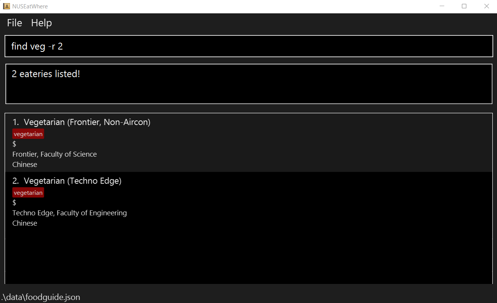
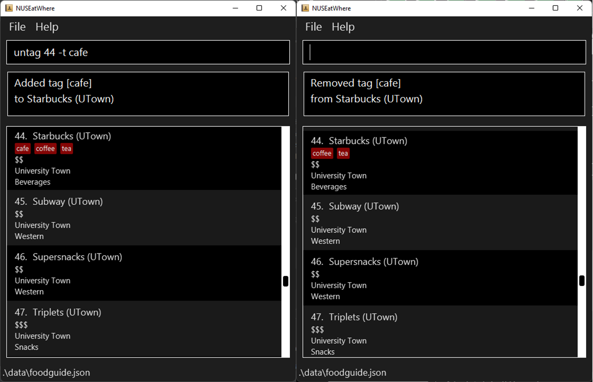
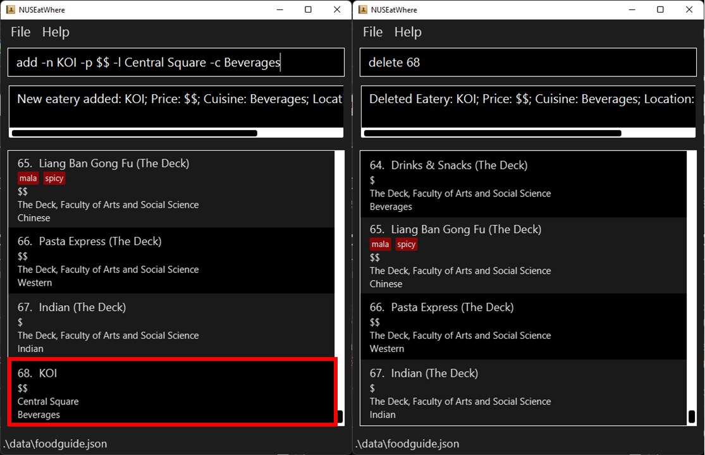

## Introduction
_Not sure what food options there are in NUS? Stuck on what to eat for lunch?_  
NUSEatWhere is a **Command Line (CLI) application** which helps you search for the available 
food options in NUS and  make an informed decision on where to eat.

## Table of Contents
* [Introduction](#introduction)
* [Table of Contents](#table-of-contents)
* [Quick Start](#quick-start)
* [Features](#features)
  * [Help](#help-command--help)
  * [List](#listing-all-eateries--list)
  * [Find](#finding-eateries-by-name--find) / [FindTag](#finding-eateries-by-tag--findtag) / 
  [FindLocation](#finding-eateries-by-location--findlocation) / [FindCuisine](#finding-eateries-by-cuisine--findcuisine)
  * [Tag](#add-tag-to-eatery--tag) / [Untag](#remove-tag-from-eatery--untag)
  * [Add](#add-eatery-add) / [Delete](#delete-eatery--delete)
  * [Fav](#favourite-eatery--fav) / [Unfav](#unfavourite-eatery--unfav)
* [FAQ](#faq)
* [Command Summary](#command-summary)

--------------------------------------------------------------------------------------------------------------------

## Quick start

1. Install `Java 11` from [here](https://www.oracle.com/sg/java/technologies/javase/jdk11-archive-downloads.html).

2. Download the latest `foodguide.jar` from [here](https://github.com/AY2223S1-CS2103T-W11-1/tp/releases).

3. Move the file to your intended **home folder** for the NUSEatWhere application.

4. Double-click the file to start the app. The GUI similar to the below should appear in a few seconds.  
   

5. Type commands into the command box and press Enter to execute it. 
e.g. typing **`help`** and pressing Enter will open the help window.  
   Here are some example commands you can try:

   * **`help`** : Lists all commands

   * **`list`**: Lists all eateries

7. You can refer to [Features](#features) below for the details of each command.

--------------------------------------------------------------------------------------------------------------------

## Features

**:information_source: Notes about the command format:**  

* Words in `UPPER_CASE` are **parameters** to be supplied by the user.  
  e.g. in `add -n NAME`, `NAME` is a parameter which can be used as `add -n Pasta Express`.   

* Items in square brackets are **optional**.  
  e.g `-n NAME [-p PRICE]` can be used as `-n Pasta Shop -p $` or as `-n Pasta Shop`.   

* Items with `…`​ after them can be used **one or more times**.  
  e.g. `-t TAGNAME…​` can be used as `-t Foodcourt`, `-t Tea -t Coffee` etc.   
Note:  (i.e. 0 times) is only allowed if there are square brackets, e.g. `[-t TAGNAME]`   

* **Prefixed parameters** _(e.g. -n, -p, -t, etc.)_ can be in **any order**.  
  e.g. if the command specifies `-n NAME -t TAG`, `-t TAG -n NAME` is also acceptable.   

* If a parameter is expected only once in the command, but you have specified it multiple times, 
only the last occurrence of the parameter will be taken.  
  e.g. if you specify `-n nameA -n nameB`, only `-n nameB` will be taken.   

* Extra parameters for commands that do not take in parameters (such as `help`) will be ignored.  
  e.g. if the command specifies `help 123`, it will be interpreted as `help`.

 

### Help command : `help`

_Lists out all the available commands & their functions as a pop-out window.  
The window also contains a link to this User Guide._

**Format:** `help`

 

### Listing all eateries : `list`

_Lists out all eateries in NUSEatWhere database.  
This can be used after a `find` command to return the list to its default state (all eateries displayed)._

**Format:** `list [-h]`

**Arguments:**  
`-h`: displays help message (specific to list)

 

### Finding eateries by name : `find`

_Search for eateries with names that match the input.  
You can also choose to randomize a list of eateries to decide on where to eat._

**Format:** `find NAME…​ [-r NUMBER] [-h]`

 :bulb:  **Tip:**
You can leave NAME empty if you are using the randomizer (-r) feature

**Arguments:**  
`NAME` : returns eateries that match the keyword(s)  
`NUMBER`: how many randomly selected eateries to show (more than 0)  
`-h`: displays help message (specific to find)
 

Note:
* The search is case-insensitive. e.g `koi` will match `KOI`
* Eateries matching at least one keyword will be returned (i.e. `OR` search).
  e.g. `find coffee cafe` will return eateries with either `coffee` or `cafe` in their name.

Example: `find mala -r 2`

Below is an example of what the list would look like when using the randomizer `-r` command.
The command used is shown on the command line.  
Note how only 2 random eateries with "mala" in their names are shown. 

 

### Finding eateries by tag : `findTag`

_Search for eateries that match the specified tag(s). 
You can also choose to randomize a list of eateries to decide on where to eat._

**Format:** `findTag TAGNAME…​ [-r NUMBER] [-h]`

 :bulb: **Tip:**
You can search for any number of tags by typing them all after findTag

**Arguments:**  
`TAGNAME`: returns eateries that match the keyword(s)  
`NUMBER`: how many randomly selected eateries to show (more than 0)  
`-h`: displays help message (specific to findTag)
 

Note:
* The search is case-insensitive. e.g `foodcourt` will match `Foodcourt`
* Eateries matching at least one tag will be returned (i.e. `OR` search).
  e.g. `findTag foodcourt cafe` will return eateries with either tag.

Example: `findTag restaurant`

 

### Finding eateries by location : `findLocation`

_Search for eateries that match the specified location(s).  
You can also choose to randomize a list of eateries to decide on where to eat._

**Format:** `findLocation LOCATIONNAME…​ [-r NUMBER] [-h]`

**Arguments:**  
`LOCATIONNAME`: returns eateries that match the keyword(s)  
`NUMBER`: how many randomly selected eateries to show (more than 0)  
`-h`: displays help message (specific to findLocation)  

Note:
* The search is case-insensitive. e.g `arts` will match `Arts`
* Eateries matching at least one keyword will be returned (i.e. `OR` search).
  e.g. `findLocation engineering science` will list eateries at either location.

Example: `findLocation University Town -r 2`  
Example: `findLocation University Town`

 

### Finding eateries by cuisine : `findCuisine`

_Search for eateries that match the specified cuisine(s).  
You can also choose to randomize a list of eateries to decide on where to eat._

**Format:** `findCuisine CUISINENAME…​ [-r NUMBER] [-h]`

**Arguments:**  
`CUISINENAME`: returns eateries that match the keyword(s)  
`NUMBER`: how many randomly selected eateries to show (more than 0)  
`-h`: displays help message (specific to findCuisine)
 

Note:
* The search is case-insensitive. e.g `korean` will match `Korean`
* Eateries matching at least one keyword will be returned (i.e. `OR` search).
  e.g. `findCuisine Western Japanese` will return eateries that sell either cuisine.

Example: `findCuisine Chinese -r 2`  
Example: `findCuisine Chinese`

 

### Finding eateries by price : `findPrice`

_Search for eateries that match the specified price(s)._

**Format:** `findPrice PRICE…​ [-r NUMBER] [-h]`

**Arguments:**  
`PRICE`: returns eateries that match the keyword(s)  
`NUMBER`: how many randomly selected eateries to show (more than 0)  
`-h`: displays help message (specific to findCuisine)
 

Note:
* Persons matching at least one keyword will be returned (i.e. `OR` search).
  e.g. `findPrice $ $$` will return eateries that have either of the prices.

Example: `findPrice $ -r 2`  
Example: `findPrice $`

 

### Add tag to eatery : `tag`

_Create custom tag(s) for an eatery to facilitate searching._

**Format:** `tag ID -t TAGNAME…​ [-h]`

**Arguments:**  
`ID`: ID of eatery to place tag on  
`TAGNAME`: name of tag to assign to eatery  
`-h`: displays help message (specific to tag)   
Example: `tag 1 -t coffee -t tea`

 

### Remove tag from eatery : `untag`

_Remove custom tag(s) from eatery._

**Format:** `untag ID -t TAGNAME…​ [-h]`

**Arguments:**  
`ID`: ID of eatery to remove tag from  
`TAGNAME`: name of tag to remove from eatery  
`-h`: displays help message (specific to untag)   
Example: `untag 1 -t coffee -t tea`

Below is a comparison between when the store at ID 50 is `tag[ged]` _(left)_ then `untag[ged]` _(right)_.
The commands used are shown on the command line.  
Note how the blue "cafe" tag on store 50 disappears after the untag command.

  

### Add eatery : `add`

_Adds a new eatery to NUSEatWhere's database. Eatery will be added to the end of the 
current list  
(i.e. if the current list pre-addition has 5 eateries, the newly added eatery will be of index 6)._

**Format:** `add -n NAME -l LOCATION -c CUISINE [-p PRICE] [-t TAG]…​ [-h]`

**Arguments:**  
`NAME`: name of the eatery to be added  
`LOCATION`: location of the eatery  
`CUISINE`: cuisine type of the eatery  
`PRICE`: price of the eatery  
`TAG`: extra tags to add to the eatery  
`-h`: displays help message (specific to add)   
Example: `add -n KOI -l Central Square -c Drinks`  
Example: `add -n KOI -l Central Square -c Drinks -p $$`

 

### Delete eatery : `delete`

_Deletes an eatery from NUSEatWhere's database_

**Format:** `delete ID [-h]`

**Arguments:**  
`ID`: ID of eatery to remove from NUSEatWhere  
`-h`: displays help message (specific to delete)   
Example: `delete 3`

Below is a comparison between when the store at ID 70 is `add[ed]` _(left)_ then `delete[d]` _(right)_.
The commands used are shown on the command line.  
Note how the eatery at index 70 disappears after the delete command.

  

### Favourite Eatery : `fav`

_Favourites an eatery from NUSEatWhere's database._

**Format:** `fav ID [-h]`

**Arguments:**  

`ID`: ID of the eatery to favourite  
`-h`: displays help message (specfic to fav)   
Example: `fav 3`

 

### Unfavourite Eatery : `unfav`

_Unfavourites an eatery from NUSEatWhere's database._

**Format:** `unfav ID [-h]`

**Arguments:**  

`ID`: ID of the eatery to unfavourite  
`-h`: displays help message (specfic to unfav)   
Example: `unfav 3`

 

### Edit eatery : `edit`

_... Details coming soon ..._

 

### Edit tag `[coming in later versions]`

_... Details coming soon ..._

 

### List all tags `[coming in later versions]`

_... Details coming soon ..._

 

--------------------------------------------------------------------------------------------------------------------

## FAQ

**Q**: How do I transfer my data to another Computer?  
**A**: Install the app in the other computer and overwrite the empty data file it creates with the file that contains 
the data of your previous NUSEatWhere home folder.

--------------------------------------------------------------------------------------------------------------------

## Command summary

| Action           | Format                                                          |
|:-----------------|:----------------------------------------------------------------|
| **Help**         | `help`                                                          |
| **List**         | `list [-h]`                                                     |
| **Find**         | `find NAME…​ [-r NUMBER] [-h]`                                  |
| **FindTag**      | `findTag TAGNAME…​ [-r NUMBER] [-h]`                            |
| **FindLocation** | `findLocation LOCATIONNAME…​ [-r NUMBER] [-h]`                  |
| **FindCuisine**  | `findCuisine CUISINENAME…​ [-r NUMBER] [-h]`                    |
| **FindPrice**    | `findPrice PRICE…​ [-r NUMBER] [-h]`									                   |
| **Tag**          | `tag ID -t TAGNAME…​ [-h]`                                      |
| **Untag**        | `untag ID -t TAGNAME…​ [-h]`                                    |
| **Add**          | `add -n NAME -l LOCATION -c CUISINE [-p PRICE] [-t TAG…​] [-h]` |
| **Delete**       | `delete ID [-h]`                                                |
| **fav**          | `fav ID [-h]`                                                   |
| **unfav**        | `unfav ID [-h]`                                                 |
