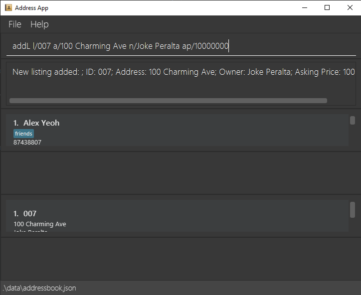
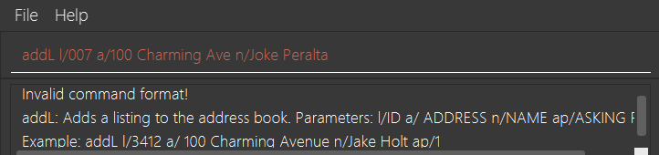
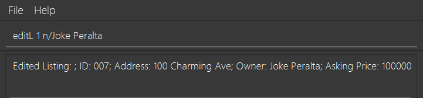
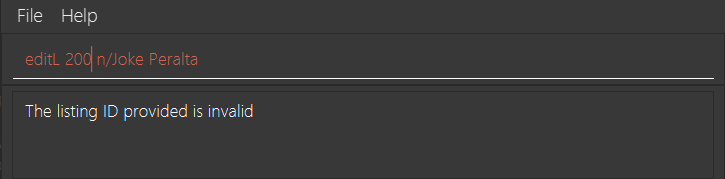
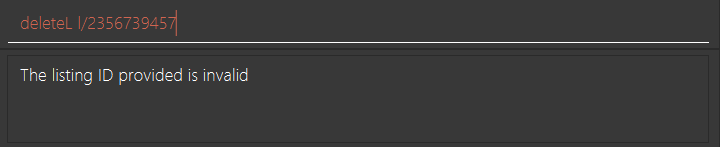

=]---
layout: page
title: User Guide
---

REal-Time is a **desktop app for real estate agents to manage client contacts, optimized for use via a Command Line Interface** (CLI) while still having the benefits of a Graphical User Interface (GUI). If you can type fast, REal-Time can get your contact management tasks done faster than traditional GUI apps.

* Table of Contents
{:toc}

--------------------------------------------------------------------------------------------------------------------

## Quick start

1. Ensure you have Java `11` or above installed in your Computer.

1. Download the latest `REal-Time.jar` from [here](https://github.com/AY2223S1-CS2103T-W15-2/tp/releases).

1. Copy the file to the folder you want to use as the _home folder_ for your AddressBook.

1. Double-click the file to start the app. The GUI similar to the below should appear in a few seconds. Note how the app contains some sample data. 
   

1. Type the command in the command box and press Enter to execute it. e.g. typing **`help`** and pressing Enter will open the help window. 
   Some example commands you can try:

   * **`addO`**`l/John street, block 123, #01-01 n/John Doe o/700000` : Adds an offer by `John Doe` to the list of offers.

   * **`deleteC`**`3` : Deletes the 3rd contact shown in the current list of clients.

   * **`clear`** : Deletes all clients, meetings, listings and offers.

   * **`exit`** : Exits the app.

1. Refer to the [Features](#features) below for details of each command.

--------------------------------------------------------------------------------------------------------------------

## Features

**:information_source: Notes about the command format:** 

* Words in `UPPER_CASE` are the parameters to be supplied by the user. 
  e.g. in `addC n/NAME`, `NAME` is a parameter which can be used as `addC n/John Doe`.

* Items in square brackets are optional. 
  e.g `n/NAME [t/TAG]` can be used as `n/John Doe t/friend` or as `n/John Doe`.

* Items with `…`​ after them can be used multiple times including zero times. 
  e.g. `[t/TAG]…​` can be used as ` ` (i.e. 0 times), `t/friend`, `t/friend t/family` etc.

* Parameters can be in any order. 
  e.g. if the command specifies `n/NAME p/PHONE_NUMBER`, `p/PHONE_NUMBER n/NAME` is also acceptable.

* If a parameter is expected only once in the command, but you specified it multiple times, only the last occurrence of the parameter will be taken. 
  e.g. if you specify `p/12341234 p/56785678`, only `p/56785678` will be taken.

* Extraneous parameters for commands that do not take in parameters (such as `help`, `list`, `exit` and `clear`) will be ignored. 
  e.g. if the command specifies `help 123`, it will be interpreted as `help`.

___

### Viewing help : `help`

Shows a message explaining how to access the help page.

Format - `help`

___

### Adding a client: `addC`

Adds a client to the address book.

Format - `addC n/NAME p/PHONE_NUMBER e/EMAIL a/ADDRESS [t/TAG]…​`

:bulb: **Tip:**
A client can have any number of tags (including 0)

Examples:
* `addC n/John Doe p/98765432 e/johnd@example.com a/John street, block 123, #01-01`
* `addC n/Betsy Crowe t/friend e/betsycrowe@example.com a/Newgate Prison p/1234567 t/criminal`

___

### Adding a listing: `addL`

Adds a listing to the address book.

Format - `addL l/LISTING_ID a/ADDRESS n/OWNER_NAME ap/ASKING_PRICE [t/TAG]…​`

:bulb: **Tip:**
A listing can have any number of tags (including 0).
However, all other fields must be present.

    `l/LISTING_ID` refers to the ListingId you wish to assign to this Listing.
    `a/ADDRESS` refers to the address of this Listing.
    `n/NAME` refers to the name of the owner of this Listing.
    `ap/ASKING_PRICE` refers to the asking price that the owner is asking for this Listing.

Examples:

_Success_
* `addL l/007 a/100 Charming Ave n/Joke Peralta ap/10000000`

_Failure_
* `addL l/007 a/100 Charming Ave n/Joke Peralta` Fails as there is no asking price.

[Back to top](#features).
___

### Adding an offer: `addO`

Adds an offer to the address book.

Format - `addoffer l/LISTING_ID n/NAME o/OFFER_PRICE`

Examples:
* `addO id/abc a/John Doe o/2000000`
* `add0 id/1 a/Betsy Crowe o/20 `
___

### Adding a meeting: `addM`

Adds a meeting to the address book.

Format - `addM id/Listing_ID n/CLIENT_NAME d/DATE_TIME`

Note: 
* DATE_TIME must be in this format, yyyy-MM-dd HH:mm

Examples:
* `addM id/1 a/John street, block 123, #01-01 d/2022-10-20 12:00`
* `addM id/abc a/Changi Prison d/2022-10-21 14:00`

___

### Editing a client : `editC`

Edits an existing client in the address book.

Format - `editC INDEX [n/NAME] [p/PHONE] [e/EMAIL] [a/ADDRESS] [t/TAG]…​`

Note:
* Edits the client at the specified `INDEX`. The index refers to the index number shown in the displayed client list. The index **must be a positive integer** 1, 2, 3, …​
* At least one of the optional fields must be provided.
* Existing values will be updated to the input values.
* When editing tags, the existing tags of the client will be removed i.e adding of tags is not cumulative.
* You can remove all the client’s tags by typing `t/` without
    specifying any tags after it.

Examples:
* `editC 1 p/91234567 e/johndoe@example.com` Edits the phone number and email address of the 1st client to be `91234567` and `johndoe@example.com` respectively.
* `editC 2 n/Betsy Crower t/` Edits the name of the 2nd client to be `Betsy Crower` and clears all existing tags.

___

### Editing a listing : `editL`

Edits an existing listing in the address book.

Format - `editL INDEX [a/ADDRESS] [n/OWNER_NAME] [ap/ASKING_PRICE] [t/TAG]…​`

    `INDEX` refers to the index of the Listing you wish to edit
    Any number (more than 1) of fields may be edited. 

Examples:

_Success_
* `editL 1 n/Joke Peralta`

_Failure_
* `editL 200 n/Joke Peralta` Fails as the index `200` does not exist.

* `editL 1` Fails as no fields were being edited.

[Back to top](#features).
___

### Editing an offer : `editO`

Edits an existing offer in the address book.

Format - `editO INDEX [n/NAME] [o/OFFER_PRICE] [l/LISTING_ID]`

Examples:
* `editO 1 o/600000` Edits the offer price of the 1st offer to be `600000`.
* `editO 2 n/Betsy Crower o/123456` Edits the name and offer price of the 2nd offer to be `Betsy Crower` and `123456`
  respectively.

___

### Editing a meeting : `editM`

Edits an existing meeting in the address book.

Format - `editM INDEX [n/OWNER_NAME] [d/DATE_TIME]`

Examples:
* `editM 1 n/Betsy Crowe d/2022-10-20 17:00`
* `editM 2 n/Johnny Sins d/2022-10-22 12:00`

___

### Listing entries : `listC` `listL` `list0` `listM`

`listC` - Shows a list of all **clients** in the address book. 
`listL` - Shows a list of all **listings** in the address book. 
`listO` - Shows a list of all **offers** in the address book. 
`listM` - Shows a list of all **meetings** in the address book.

___

### Finding clients by name: `findC`

Finds clients whose names contain any of the given keywords.

Format - `findC KEYWORD [MORE_KEYWORDS]`

* The search is case-insensitive. e.g `hans` will match `Hans`
* The order of the keywords does not matter. e.g. `Hans Bo` will match `Bo Hans`
* Only the name is searched.
* Only full words will be matched e.g. `Han` will not match `Hans`
* Clients matching at least one keyword will be returned (i.e. `OR` search).
  e.g. `Hans Bo` will return `Hans Gruber`, `Bo Yang`

Examples:
* `findC John` returns `john` and `John Doe`
* `findC alex david` returns `Alex Yeoh`, `David Li` 
  

___

### Finding an offer : `[Coming soon]`

___

### Finding a meeting: `[Coming soon]`

___

### Deleting a client : `deleteC`

Deletes the specified client from the address book.

Format - `deleteC INDEX`

* Deletes the client at the specified `INDEX`.
* The index refers to the index number shown in the displayed client list.
* The index **must be a positive integer** 1, 2, 3, …​

Examples:
* `listC` followed by `deleteC 2` deletes the 2nd client in the address book.
* `findC Betsy` followed by `deleteC 1` deletes the 1st client in the results of the `findC` command.

___

### Deleting a listing : `deleteL`

Format: `deleteL [id/INDEX]`
* Deletes the listing with the given Index.
* `INDEX` refers to the Index of the listing you wish to delete.

:bulb: **Tip:**
Note that you refer to the Index of the Listing in the displayed list.

Examples:

_Success_
* `deleteL id/1` Deletes the first Listing in the list.

_Failure_
* `deleteL l/2356739457` Fails as the Index provided does not exist.

___

### Deleting an offer : `deleteO`

Deletes the specified offer from the address book.

Format - `deleteO INDEX`

Examples:
* `deleteO 2` deletes the 2nd offer in the address book.

___

### Deleting an meeting : `deleteM`

Deletes the specified meeting from the address book.

Format - `deleteM INDEX`

Examples:
* `deleteM 2` deletes the 2nd meeting in the address book.

___

### Clearing all entries : `clear`

Clears all entries from the address book.

Format - `clear`

___

### Exiting the program : `exit`

Exits the program.

Format - `exit`

___

### Saving the data

REal-Time data are saved in the hard disk automatically after any command that changes the data. There is no need to save manually.

___

### Editing the data file

REal-Time data are saved as a JSON file `[JAR file location]/data/addressbook.json`. Advanced users are welcome to update data directly by editing that data file.

:exclamation: **Caution:**
If your changes to the data file makes its format invalid, REal-Time will discard all data and start with an empty data file at the next run.

### Archiving data files `[coming in v2.0]`

_Details coming soon ..._

--------------------------------------------------------------------------------------------------------------------

## FAQ

**Q**: How do I transfer my data to another Computer? 
**A**: Install the app in the other computer and overwrite the empty data file it creates with the file that contains the data of your previous AddressBook home folder.

--------------------------------------------------------------------------------------------------------------------

## Command summary

| Action           | Format, Examples                                                                                                                                                      |
|------------------|-----------------------------------------------------------------------------------------------------------------------------------------------------------------------|
| **Add Client**   | `add n/NAME p/PHONE_NUMBER e/EMAIL a/ADDRESS [t/TAG]…​`   e.g., `add n/James Ho p/22224444 e/jamesho@example.com a/123, Clementi Rd, 1234665 t/friend t/colleague` |
| **Add offer**    | `addoffer l/LISTING_ID n/NAME o/OFFER_PRICE`   e.g., `addoffer l/30_SERGARDENS_LOR23_0718 n/Bob o/600000`                                                          |
| **Clear**        | `clear`                                                                                                                                                               |
| **Delete**       | `delete INDEX`  e.g., `delete 3`                                                                                                                                   |
| **Delete offer** | `deleteO INDEX`   e.g., `deleteO 2`                                                                                                                                |
| **Edit**         | `edit INDEX [n/NAME] [p/PHONE_NUMBER] [e/EMAIL] [a/ADDRESS] [t/TAG]…​`  e.g.,`edit 2 n/James Lee e/jameslee@example.com`                                           |
| **Edit offer**   | `editO INDEX [n/NAME] [o/OFFER_PRICE] [l/LISTING_ID]`   e.g., `editO 2 n/Betsy Crower o/123456`                                                                    |
| **Find**         | `find KEYWORD [MORE_KEYWORDS]`  e.g., `find James Jake`                                                                                                            |
| **List**         | `list`                                                                                                                                                                |
| **Help**         | `help`                                                                                                                                                                |
