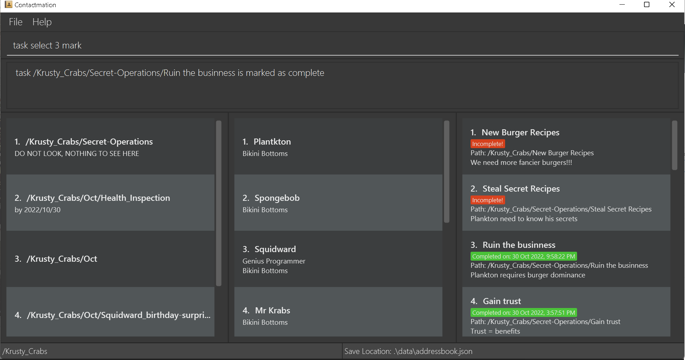
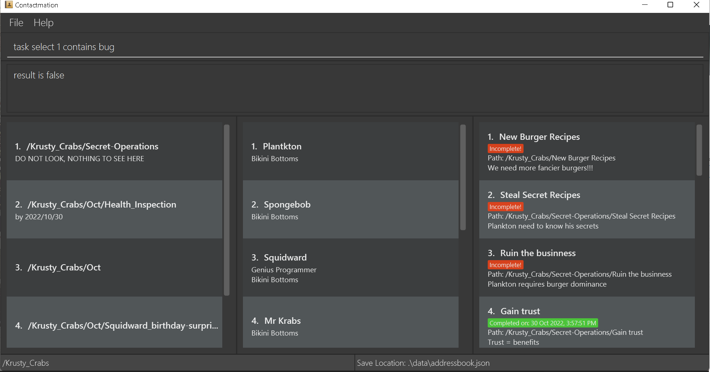
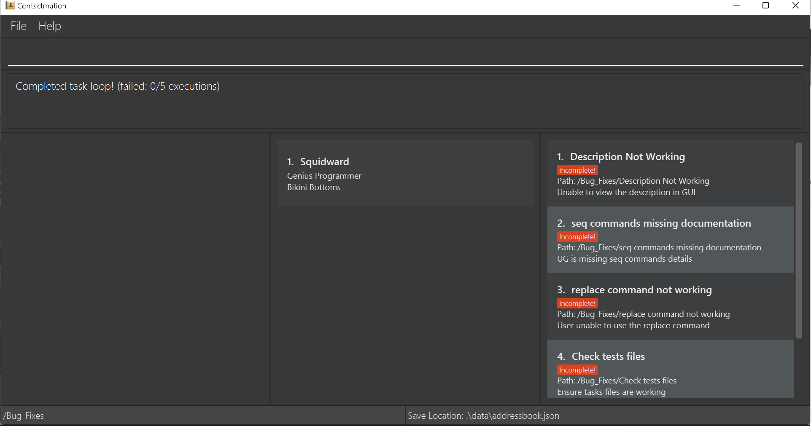
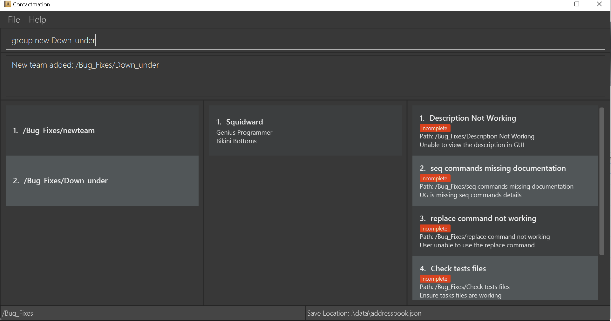
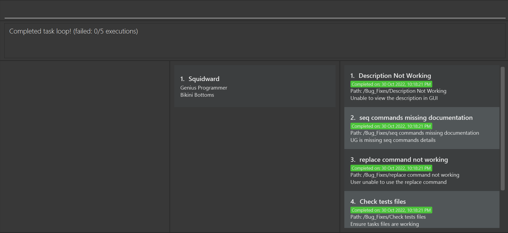

# Contactmation User Guide

## Table of contents

1. [Introduction](#introduction)
2. [About](#about)
3. [Prerequisites](#prerequisites)
4. [Quick start](#quick-start)
5. [Features](#features)
    1. [Definitions](#definitions)
    2. [Scoping](#scoping)
    3. [Basic features](#basic-features)
       1. [General commands](#general-commands)
          1. [Clear command](#clear-command-clear)
          2. [Find command](#find-command-find)
          3. [Exit command](#exits-the-program-exit)
       3. [Contact commands](#contact-commands)
          1. [Add a contact](#add-a-contact-person-new)
          2. [Delete a contact](#delete-a-contact-person-delete)
          3. [Listing all contacts](#listing-all-contacts-list)
       4. [Group commands](#group-commands)
          1. [Creating a group](#creating-a-group-team-new)
          2. [Deleting a group](#deleting-a-group-team-delete)
          3. [Adding people to a group](#adding-contacts-to-a-group-assign)
          4. [Removing people from group](#removing-contacts-from-group-team-remove)
       5. [Task commands](#task-commands)
          1. [Adding a task to a group](#adding-a-task-to-a-group-task-add)
          2. [Deleting a task from group](#deleting-a-task-from-group-task-delete)
          3. [Set progress for tasks](#set-progress-for-tasks-task-progress)
    4. [Advanced features](#advanced-features)
       1. [Chaining](#advanced-features-overview-chaining)
       2. [Feature constraints](#advanced-feature-constraints)
       3. [Select command](#select-command)
       4. [Contains command](#contains-command)
       5. [Execute command](#execute-command)
       6. [Replace command](#replace-command)
       7. [Foreach command](#foreach-command)
       8. [If else command](#if--else-command)
       9. [Aliasing](#aliasing)
       10. [Custom command / macro](#custom-command--macro)
6. [FAQ](#faq)
7. [Future plans](#future-plans)
8. [Glossary](#glossary)
9. [Commands summary](#commands-summary)
   1. [General commands](#general-commands-summary)
   2. [Contact commands](#contact-commands-summary)
   3. [Group commands](#group-commands-summary)
   4. [Task commands](#task-commands-summary)
   5. [Advanced commands](#advanced-commands-summary)
--------------------------------------------------------------------------------------------------------------------
## Introduction

>**What is Contactmation?**

Contactmation is a powerful **desktop based team management solution** that **helps its users efficiently and
effectively manage many projects and groups at once.**

Contactmation will be able to help you save all your contact details, keep track of
each projects' group and subgroup, and delegate tasks to each group.

>**Who is Contactmation for?**

Contactmation is for **project managers and supervisors** that want to maintain an organised view of their
projects and streamline the management of their projects.
--------------------------------------------------------------------------------------------------------------------
## About

### Graphic User Interface

The following figure shows the different graphical components of our application.
We will be referring to these terminologies throughout the user guide:

---

## Prerequisites

- Ensure that `Java 11` and above is installed on your device. If you do not have `Java 11` installed, please refer to
  this [Java 11 installation guide](https://www.codejava.net/java-se/download-and-install-java-11-openjdk-and-oracle-jdk).

---

## Quick start

1. Ensure that the [prerequisites](#prerequisites) are met before installing Contactmation.

2. Download the latest version of `contactmation.jar` from
   [here](https://github.com/AY2223S1-CS2103T-T11-1/tp/releases).

3. Save `contactmation.jar` into a Desktop folder on your computer. This folder will now be the home folder
   for Contactmation.

4. Double-click on `contactmation.jar` to start up the application. You will be greeted with the current window
   if everything goes well:

> **Note:** 

> If you wish to clear all default entries, use the [clear](#clear-command-clear) command.

5. You may begin by referring to the [basic features](#basic-features) section to get started on using
   Contactmation. For additional, more powerful commands, refer to our [advanced features](#advanced-features),
   especially if you are comfortable with the CLI or have prior programming experience.

---

# Features

## Definitions

In this user guide, we define any parameters within **square brackets** e.g. `[t/new_tag]` as
**optional parameters**, and commands within **angled brackets** e.g. `<command>` are **placeholder parameters**.

**Ellipses** `...` indicate that more than 1 argument of a certain type can be given to a single command.
For example, `[t/tags ...]` means that an optional number (0 or more) of `tags` can be added to a single
user command, but `t/tags...` means that 1 or more `tags` can be given to a single user command.

#### Other keywords
- `item`: an object that is part of a team project (person, groups and tasks).
- Scoping: the level of access of an `item` or an attribute of an `item` in your app. So when an item is in a scope, it 
means the level of access of all the attributes of that item is within the scope of that item. It is explained in further
detail below.

## Scoping

Since Contactmation is a multi group management contact application, it supports scoping to facilitate
easy access between groups and subgroups of a group project.

Scoping defines the relationship between different groups. For example, a subgroup can be contained within
another group, similar to how a folder on your desktop can be contained within another folder.

There may also be many subgroups under a group, similar to how there may be many sub folders under a folder.

Adding to the analogy, your contacts can be thought of as files on your desktop. Contacts can thus be
added to a group or a subgroup, similar to how files can be added into folders.

## Basic features

## General commands

### Clear command: `clear`

Clears all group, contact and task entries from the application.

> **Warning**
> **THIS ACTION IS IRREVERSIBLE! RUN THIS COMMAND AT YOUR OWN DISCRETION!**

**Format:** `clear`

### Find command: `find`

**CURRENTLY A WORK IN PROGRESS DUE TO BUGS**

Searches for a contact, group or task that matches the given `KEYWORD`. Searches may also include `MORE_KEYWORDS`
to further narrow the search for a contact, subgroup or task within the current [scope](#scoping).

**Format:** `find <KEYWORD> [<MORE_KEYWORDS>]`

**Examples:**

- `find John Doe`
- `find task1 task2`

### Exits the program: `exit`

Exits the current session and closes the application.

**Format:** `exit`

## Contact commands

### Constraints on contact information

The following contact commands comply with these placeholder constraints:

- The `NAME` of the contact must be alphanumeric and can contain whitespace.
- The `PHONE_NUMBER` of the contact must be at least 3 digits long.
- The `EMAIL` of the contact must be in the format `local-part@domain`.

<<<<<<< HEAD
    - `local-part`: Only contain alphanumeric characters and these special characters, excluding
      the parentheses, (+_.-). The local-part may not start or end with any special characters.
    - `domain`:
    - Ends with a domain label at least 2 characters long.
    - Have each domain label start and end with alphanumeric characters.
    - Have each domain label consist of alphanumeric characters, separated only by hyphens, if any.

- The `ADDRESS` can take any values, but it should not be blank.
- The `TAG` must be alphanumeric.
- The `INDEX` must be a positive integer which cannot exceed the number of contacts currently displayed in the
  application.
- The `KEYWORD` and `MORE_KEYWORDS` must be alphanumeric.

### Add a contact: `person new`

Adds a new contact with a name within the current [scope](#scoping). Additionally, other contact details such
as the phone number, email, address and multiple tags may be included during the creation of the contact.

**Format:** `person new n/<NAME> [p/<PHONE_NUMBER>] [e/<EMAIL>] [a/<ADDRESS>] [t/<TAG>...]`

**Examples:**

- `person new n/John Doe p/98765432 e/johnd@example.com a/311, Clementi Ave 2, #02-25 t/friends t/owesMoney`
- `person new n/Betty White`

### Delete a contact: `person delete`

Delete a contact from the contact list by their listed `INDEX` within the current [scope](#scoping).

**Format:** `person delete <INDEX>`

**Example:**

- `person delete 1`

### Listing all contacts: `list`

Lists all current contacts in your contact list within the current [scope](#scoping).

**Format:** `list`

<<<<<<< HEAD
### Select command

Refer to the [select](#select-command-select) command for more information.

## Team commands

### Constraints on team information

The following group commands comply with these placeholder constraints:

- The `GROUP NAME` must be alphanumeric.
- The `INDEX` must be a positive integer which cannot exceed the number of contacts / groups currently displayed
  in the application.

### Creating a group: `team new`

Creates a new group with the specified group name within the current [scope](#scoping). This new group
will thus be a subgroup of the group you are currently scoped in.

**Format:** `team new <GROUP NAME>`

**Example:**

- `team new namingIsHard`

### Deleting a group: `team delete`

Removes an existing group from the current [scope](#scoping). All subgroups of the group you are currently
deleting will also be deleted.

**Format:** `team delete <INDEX>`

**Example:**

- `team delete 1`

### Adding contacts to a group: `assign`

Adds a contact to a group.

**Format:** `assign g/<INDEX> u/<INDEX>`

**Example:**

- `assign g/3 u/7`

### Removing contacts from group: `team remove`

Removes the contact from the current group by their currently specified `INDEX` as shown in
the application window.

**Format:** `team remove <INDEX>`

**Example:**

- `team remove 3`

### Group scope commands

> **Note:** 

> Please look at how [scoping](#scoping) works before continuing.

### Changing the group scope: `cg`

Updates the group scope that is currently being displayed in the application. This command is similar to going
into a folder on your desktop, or stepping out of it.

**Formats:**

- `cg <INDEX>`
- `cg ..` changes the group scope to its parent group. This is similar to stepping out of a folder once.
- `cg /` changes the group scope to the root group. This is similar to moving your current context to the
  root folder.

## Task commands

### Adding a task to a group: `task add`

Adds a new task to an existing group scope. This group cannot be the root group.

**Format:** `task add t/<TITLE> d/<DESCRIPTION>`

**Example:**

- `task add t/Complete all CS2103T homework d/Give description here`

### Deleting a task from group: `task delete`

Deletes an existing task from a group by their `INDEX` within the current [scope](#scoping).

Format: `task delete <INDEX>`

Example:

- `task delete 1`

### Set progress for tasks: `task progress`

**THIS FEATURE IS CURRENTLY IN PROGRESS**

Sets the progress level for each task that has been listed.

Format: `task progress i/<INDEX> <LEVEL>`

- Index indicates the index of the task in the list.
- Level indicates the progress level, and can only be set to 25%, 50%, 75%, 100%.

Example:

- `task progress 1 25%`

This sets the progress of the first task in the list as 25%.

## Advanced features

Now, there might be many things that you wish to do with managing your tasks and groups. However, it feels really, 
really tedious to perform multiple functions one after the other.
Are you a power user? Are you good with logic? Well this section is for you! Supercharge your user experience by 
adding and customizing your own commands and features!

Firstly, let’s understand what these commands are and how these commands work in Contactmation.

## Advanced features overview: Chaining

Most of the commands in Contactmation can take in an input and give an output. This is similar to how your functions 
work in programming and mathematics.

For instance, take the command `ops`. This command can take in a value, perform some operators on it and returns 
the value. Another command is the command `float`. This command allows you to create a floating point value and return 
it.

Many commands in Contactmation have this functionality, and you can in turn **chain multiple commands together to 
perform complicated tasks** that suits your needs.

So, how do we chain multiple commands together? We can use the `|` and `;` and the `seq` command to do so. The way 
this commands work is extremely similar to how `|` and `;` works on a UNIX operating system. You can chain multiple 
commands together like such:

- `seq <command 1> [| command 3]...`
- `seq <command 1> [; command 3]...`

Whenever a pipe symbol (`|`) is encountered, the output of the previous commands is then passed to the next command. 
Whenever (`;`) is used, the output of the previous commands are not passed on.

All commands that produce an output supports the use of `|` to “pipe” their output to the subsequent commands.

## Advanced feature constraints

While these advanced features can make your Contactmation experience a lot smoother, it is also subject to certain 
limitations. These are the following constraints for each keyword in the format section of each advanced feature 
command:

- The `MACRO WORD` is alphanumeric but hyphens and underscores are allowed. It must also begin with a letter.
- `INPUT` is a string of any length.

Here are some commands that will aid you in gaining better control over Contactmation:

## Select command

This command allows you to select a specific group, contact or task by their `INDEX`. While this command does nothing 
by itself, it is useful as a precursor to chaining other commands after it.

**Format:** `<ITEM> select <INDEX> <COMMAND> [...]`

**Example:**

- `task select 3 mark`

## Contains command

You can use the `contains` command which takes in an item and checks if it contains a certain attribute. If it does, 
then the attribute description will be shown in the result display if there is no further piping.

**Format:** `<ITEM> contains <ATTRIBUTE>`

**Example:**

- `task select 1 contains bug`

Here, we see that there are no `bug` attribute in the task `New Burger Recipes`.

## Execute command

This command allows for the running of a `command` on a piped string.

**Format:** `<INPUT> | e`

**Example:**

- `Who lives in a pineapple under the sea | e`

## Replace command

This command replaces a piece of text with another piece of text.

**Format:** `r <TEXT TO REPLACE> <TEXT TO BE REPLACED>`

**Example:**

- `r tetss tests`

## Foreach command

Iterations can increase our workflow efficiency several fold, and through the `foreach` command, we can now cycle 
through all entries of an item type in the current scope and apply a command to them. This can be especially powerful 
when combined with piping to do complex executions with a single command!

**Format:**  `<ITEM> foreach <COMMAND>`

**Example:**

- `task foreach unmark`

## If / else command

This command behaves exactly like if else statements in programming languages. If the `CRITERIA` specified is met, 
then the command sequence will execute `COMMAND IF`, else it will execute `COMMAND ELSE` instead. The command 
ensures that the application cannot run `COMMAND IF` and `COMMAND ELSE` in the same command sequence.

>**Note:** If else commands cannot be nested in other if else commands directly.

**Format:** `if [[CRITERIA]] ;; [[COMMAND IF]] ;; [[COMMAND ELSE]]`

**Example:**

- `task select 1 if [[contains bug]] ;; [[mark]] ;; [[task delete]]`

## Aliasing

Aliasing is very useful to have in case you do not agree with the default naming scheme in Contactmation! Here’s 
how it works:

**Format:** `alias <NEW COMMAND NAME> <COMMAND>`

**Example:**

- `alias group team`

After running `alias group team`, you are now able to use the command `group` as if it was a `team`!

## Custom command / Macro

Do you ever feel tired from typing the same commands over and over again? Do you find yourself highlighting your 
commands and copying and pasting them? Macros are available in our application to solve this problem of yours.

All you have to do is assign the command sequence to a single word, or multiple words separated by hyphens and 
underscores only. After that, when the word is typed into the command box, the command sequence it is used to 
represent will run!

**Format:** `macro <MACRO WORD> <COMMAND SEQUENCE>`

**Example:**

- `macro markeverytask task foreach mark`

This will produce the following output:

When `markeverytask` is typed into the command box, all tasks become marked!

## Piecing multiple commands together

Here’s another example. You have just completed fixed a bunch of bugs you would like to mark off all tasks that 
was bugged as complete.

Well, you know that you defined your custom field’s type as `bug` and you can see that task 1, 2 and 3 are bug 
related tasks with the `Severity` labelled as a custom field in the bugs.

Well, you could of course just do `mark` commands 3 times and mark all the tasks, but what if there are a few 
hundred of those pesky bug tasks that you and your team fixed?

Luckily for you, Contactmation supports the automation of commands!

Here is an example of a command sequence to search through all tasks and mark all tasks which have bug severity 
ratings:

`task foreach if [[contains bug]] ;; [[mark]]`

Using just 1 command sequence, you are able to do the work that many normal commands would similarly achieve and 
mark hundreds of tasks in a matter of seconds!

## FAQ

> How can I install `Java 11`?

Follow the guide for installing `Java 11` [here](#prerequisites).

> Will this application also apply to a general, non-professional user?

This depends on what you will be using Contactmation for. It still can be used simply as an application
for simply saving and organizing contacts.

## Future plans

Our future plans for Contactmation includes:

- The ability to delegate tasks to individuals.
- Contacting any person through the application simply by clicking their email, phone number
etc.
- Releasing a version of Contactmation on the mobile platform.
- The ability to synchronize data between multiple copies of Contactmation on your mobile and desktop.
- A pop-up window that shows the detailed form of descriptions to the user.
- A for loop command to iterate through and count groups, contacts or tasks by their attribute.

## Glossary

| Vocabulary  | Description |
| ----------- | ----------- |
| Command sequence | What you, the user, would write in the command box for the execution of a command. |
| Contact   | A contact with contact information.  |
| Group   | A container that contains people that work on a similar project.  |
| Index    | The numerical placing of a group, contact or task in the current application display. |
| Item    | An item can refer to a group, contact or task. |
| Pipe | The output of the previous section of commands will be used as input for the next set of commands.|
| Root group   | Refers to the application not being in any scope. |
| Scope  | A constraint on the groups, people and tasks you are able to view at one time on the display. |
| Task  | Assigned to people or groups |

## Commands summary

### General commands summary

| Command  | Format |
| ----------- | ----------- |
| Group   | A container that contains people that work on a similar project.  |
| Item    | An item can refer to a group, contact or task. |
| Contact   | A contact with contact information.  |
| Task  | Assigned to people or groups |

### Group commands summary

| Command  | Format |
| ----------- | ----------- |
| Group   | A container that contains people that work on a similar project.  |
| Item    | An item can refer to a group, contact or task. |
| Contact   | A contact with contact information.  |
| Task  | Assigned to people or groups |

### Contact commands summary

| Command  | Format |
| ----------- | ----------- |
| Group   | A container that contains people that work on a similar project.  |
| Item    | An item can refer to a group, contact or task. |
| Contact   | A contact with contact information.  |
| Task  | Assigned to people or groups |

### Task commands summary

| Command  | Format |
| ----------- | ----------- |
| Group   | A container that contains people that work on a similar project.  |
| Item    | An item can refer to a group, contact or task. |
| Contact   | A contact with contact information.  |
| Task  | Assigned to people or groups |

### Advanced commands summary

| Command  | Format |
| ----------- | ----------- |
| Aliasing | `alias <NEW COMMAND NAME> <COMMAND>` |
| Chaining/seq | `seq <command 1> [\| command 3]... OR seq <command 1> [; command 3]...` |
| Contains | `<ITEM> contains <ATTRIBUTE>` |
| Execute | `<INPUT> \| e` |
| Foreach | `<ITEM> foreach <COMMAND>` |
| If else | `if [[CRITERIA]] ;; [[COMMAND IF]] ;; [[COMMAND ELSE]]` |
| Macro | `macro <MACRO WORD> <COMMAND SEQUENCE>` |
| Replace | `r <TEXT TO REPLACE> <TEXT TO BE REPLACED>` |
| Select    | `<ITEM> select <INDEX> <COMMAND> [...]` |

[Back to top](#contactmation-user-guide)
