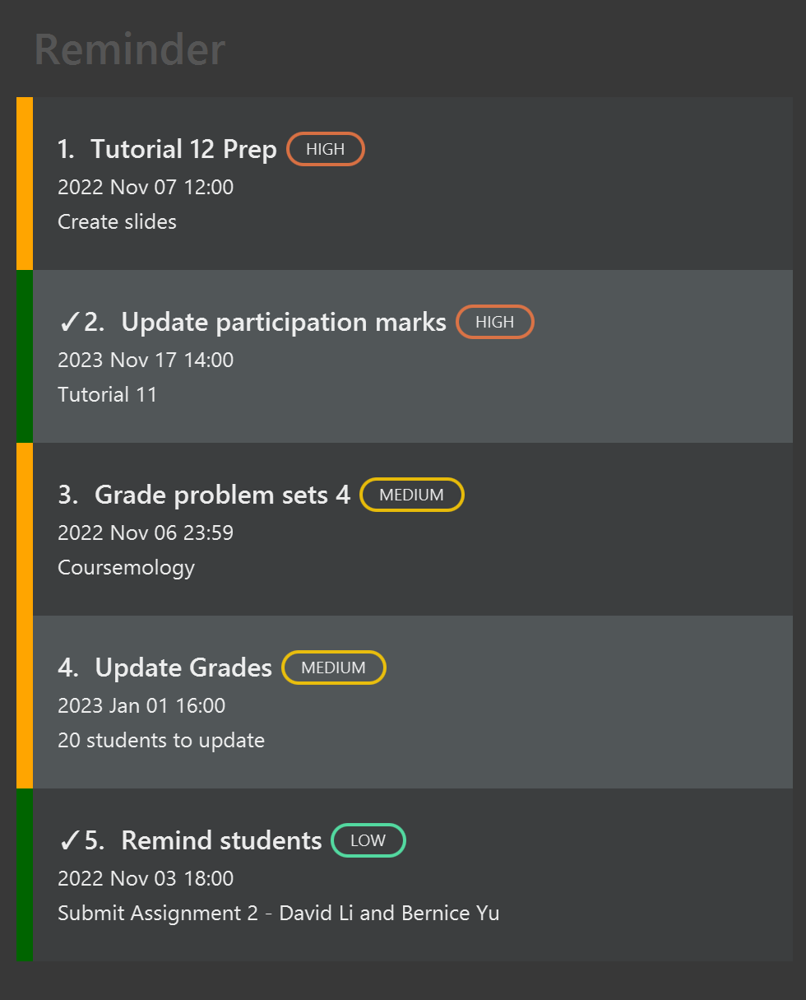

## 1. Introduction
Are you a Teaching Assistant (Teaching Assistant) struggling to monitor your classes and what tasks you have to complete?
Tired of having to use multiple applications (such as LumiNUS and Todoist) to keep track of all your responsibilities?  
 
Introducing ModQuik, a Teaching Assistant tool made for you!

ModQuik is a convenient tool that allows you to keep track of your classes, monitor your students' grades and set up reminders for your tasks(such as creating tutorial slides or marking homework). 
ModQuik is optimised for use via a Command Line Interface (CLI) while still having the benefits of a Graphical User Interface (GUI).
If you can type fast, ModQuik can get your lesson management tasks done faster than traditional GUI apps.

* Table of Contents
{:toc}

--------------------------------------------------------------------------------------------------------------------

## 2. Quick start

1. Ensure you have Java `11` or above installed in your Computer.

1. Download the latest `modquik.jar` [here](https://github.com/AY2223S1-CS2103T-W17-3/tp/releases).

1. Copy the file to the folder you want to use as the _home folder_ for your ModQuik.

1. Double-click the file to start the app. The GUI as shown below should appear in a few seconds. Note how the app contains some sample data. 
   

1. Type the command in the command box and press Enter to execute it. e.g. typing **`help`** and pressing Enter will open the help window. 
   Some example commands you can try:

    * **[`list`]**: Lists all students.

    * **[`add student`]**`n/John Doe i/A0232123X ph/98765432 e/johnd@example.com tele/johnDoe m/CS2103T tut/W17`: Adds a student named `John Doe` to CS2103T module.

    * **[`delete student`]**`3`: Deletes the 3rd student shown in the current list displayed.

    * **[`switch`]**`f/grade`: Switch the tab to view the grade charts for the respective modules you teach.

    * **[`clear`]**`f/reminder`: Deletes all your reminders.

    * **[`exit`]**: Exits the app.

1. Refer to the [Features](#features) below for details of each command.

--------------------------------------------------------------------------------------------------------------------

## 3. About this User Guide
This guide aims to
* Teach first-time users how to start using ModQuik
* Explain the features of each command and how to use them.
* Provides a summary of the:
  * available commands with their respective formats
  * available prefixes and which commands use which prefixes

### 3.1 Navigating the User Guide
**Information Box**

**:information_source: Info:** Provides useful information

**Tip Box**

**:bulb: Tip:** Provides pointers to enhance your experience

**Highlights**  
[`commands`](#glossary) or [`PARAMETERS`](#glossary) are inputs by users

### 3.2 Navigating the GUI

**Command Box**
Enter your command here.

**Result Display Box**
Displays a feedback message after a command is executed.

**Navigation Tab**
Panel displaying the tabs you can navigate to.

:bulb: **Tip:**
Clicking on a button in the panel will allow you to switch tabs. 

**Main Display**
Displays the list of your chosen tab.

**Reminder List**
Displays your list of reminders.
--------------------------------------------------------------------------------------------------------------------

## 4. Features

**:information_source: Notes about the command format:** 

* Words in `UPPER_CASE` are the parameters to be supplied by the user. 
  e.g. in `add student n/NAME`, `NAME` is a parameter which can be used as `add student n/John Doe`.

* Items in square brackets are optional. 
  e.g. `n/NAME [t/TAG]` can be used as `n/John Doe t/friend` or as `n/John Doe`.

* Items with `…` after them can be used multiple times including zero times. 
  e.g. `[t/TAG]…` can be used as ` ` (i.e. 0 times), `t/friend`, `t/friend t/family` etc.

* Parameters can be in any order. 
  e.g. if the command specifies `n/NAME ph/PHONE`, `ph/PHONE n/NAME` is also acceptable.

* If a parameter is expected only once in the command, but you specified it multiple times, only the last occurrence of the parameter will be taken. 
  e.g., if you specify `ph/12341234 ph/56785678`, only `ph/56785678` will be taken.

* The following prefix parameters, `D/` and `T/`, have more than 1 definition, depending on the type of command inputted. 
    - `D/` stands for `DAY` in `tutorial` commands, and `DATE` in `consultation` and `reminder` commands. 
      Format of `DAY` is an integer from 1 (Monday) to 7 (Sunday). 
      Format of `DATE` should be yyyy-MM-dd. e.g., 2022-02-24
    - `T/` stands for `TIMESLOT` in `tutorial` and `consultation` commands, and `TIME` in `reminder` commands. 
      Format of `TIMESLOT` should be HH:mm-HH:mm. e.g. 08:00-09:00 
      Format of `TIME` should be HH:mm. e.g., 13:00.

* Inapplicable parameters for commands that do not take in parameters (such as [`help`] and [`exit`]) will be ignored. 
  e.g., if the command specifies `help 123`, it will be interpreted as `help`.

* To make it convenient for you, you could click on `Tab` button to switch between the different tabs (`Student`, `Grade Chart`, `Consultation`, `Tutorial`) and the command box.
 Alternatively, you can use the [`switch`] command.

### 4.1 Student Features

#### 4.1.1 Adding a student: `add student`

Adds a student to the specified module.

Format: `add student n/NAME i/STUDENT_ID ph/PHONE e/EMAIL tele/TELEGRAM_HANDLE m/MODULE tut/TUTORIAL [g/GRADE] [att/ATTENDANCE] [part/PARTICIPATION] [t/TAG]…`

* `PHONE` should be 8 digits long as per standard telephone numbers in Singapore.
* `STUDENT_ID` should follow the following format AXXXXXXXY, where X is a number, and Y is an alphabet.

:bulb: **Tip:**
A student can have any number of tags (including 0).

* `ATTENDANCE` and `PARTICIPATION` can only take in integers greater than 0. If a value is not given, they will automatically be set to 0.
* `GRADE` can take in `A+`, `A`, `A-`, `B+`, `B`, `B-`, `C+`, `C`, `D+`, `D`, `F`. If a value is not given, it will automatically be set to `PENDING...`.

Examples:
* `add student n/John Doe i/A0232123X ph/98765432 e/johnd@example.com tele/johnDoe m/CS2103T tut/W17`
* `add student n/Betsy Crowe i/A0000000B t/struggling e/betsycrowe@example.com ph/91234567 tele/betsy_crowe m/CS2105 tut/G03 att/3 part/1 g/C t/quiet`

#### 4.1.2 Listing all students: `list`

Shows a list of all students in ModQuik.

* Command will only display the list if you navigate to the `Student` tab

Format: `list`

#### 4.1.3 Editing a student: `edit student`

Edits an existing student in a specified module.

Format: `edit student INDEX [n/NAME] [i/STUDENT_ID] [ph/PHONE] [e/EMAIL] [tele/TELEGRAM_HANDLE] [m/MODULE] [tut/TUTORIAL] [g/GRADE] [att/ATTENDANCE] [part/PARTICIPATION] [t/TAG]…`

* Edits the student at the specified `INDEX`. The index refers to the index number shown in the displayed student list. The index **must be a positive integer** 1, 2, 3, …
* At least one of the optional fields must be provided.
* Existing values will be updated to the input values.
* When editing tags, the existing tags of the student will be removed i.e. adding of tags is not cumulative.
* You can remove all the student’s tags by typing `t/` without
  specifying any tags after it.
* If nothing is given to `GRADE` even though `g/` is typed into the command box, it will automatically be set to `PENDING...`.
* If nothing is given to `ATTENDANCE` even though `att/` is typed into the command box, it will automatically be set to `0`.
* If nothing is given to `PARTICIPATION` even though `part/` is typed into the command box, it will automatically be set to `0`.

Examples:
* `edit student 1 ph/91234567 e/jameslee@example.com` Edits the phone number and email address of the 1st student to be `91234567` and `jameslee@example.com` respectively.
* `edit student 2 n/Betsy Crower t/` Edits the name of the 2nd student to be `Betsy Crower` and clears all existing tags.
* [`find`] `m/CS2103T` followed by `edit student 2 n/Betsy Crower` Edits the name of the 2nd student to be `Betsy Crower` in the results of the [`find`] command.

#### 4.1.4 Locating students by their attributes: `find`

Finds students by names, student ID, module or tutorial, by checking if respective attribute contains any of the given keywords.

Format: `find [n/NAME] [i/STUDENT_ID] [m/MODULE] [tut/TUTORIAL]`

* At least one of the optional fields must be provided.
* The search is case-insensitive. e.g. `hans` will match `Hans`
* The order of the keywords does not matter. e.g. `Hans Bo` will match `Bo Hans`
* Only full words will be matched e.g. `Han` will not match `Hans`
* Persons matching at least one keyword will be returned (i.e. `OR` search).
  e.g. `Hans Bo` will return `Hans Gruber`, `Bo Yang`

Examples:
* `find n/John` returns `john` and `John Doe`
* `find m/CS2103T` returns list of students in CS2103T 

#### 4.1.5 Deleting a student: `delete student`

Deletes the specified student from the list of students.

Format: `delete student INDEX`

* Deletes the student at the specified `INDEX`.
* The index refers to the index number shown in the displayed student list.
* The index **must be a positive integer** 1, 2, 3, …

Examples:
* [`list`] followed by `delete student 2` deletes the 2nd student in the list of people.
* [`find`] `n/Betsy` followed by `delete student 1` deletes the 1st student in the results of the [`find`] command.
* [`find`] `m/CS2103T` followed by `delete student 2` deletes the 2nd student in the results of the [`find`] command.

#### 4.1.6 Extracting student's emails: `extract emails`

Copies all emails in the displayed student list onto the clipboard.

Format: `extract emails`

:bulb: **Tip:**
Paste the link in the address bar of a browser and a pop-up will appear, prompting you to open up your email apps e.g. Outlook !

Examples:
* [`find`] `m/CS2103T` followed by `extract emails` copies all the emails of the students in the results of the [`find`] command.

### 4.2 Tutorial Features

#### 4.2.1 Adding a tutorial: `add tutorial`

Adds a tutorial to ModQuik.

Format: `add tutorial n/NAME m/MODULE v/VENUE T/TIMESLOT D/DAY`
* `DAY` should take in a number from 1 (Monday) to 7 (Sunday).
* `TIMESLOT` should take in a start time to end time in the format HH:mm-HH:mm, e.g., 18:00-20:00.

Examples:
* `add tutorial n/T23 m/CS2103T v/COM1-0205 T/18:00-20:00 D/1`

#### 4.2.2 Editing a tutorial: `edit tutorial`

Edits an existing student in ModQuik.

Format: `edit tutorial INDEX [n/NAME] [m/MODULE] [v/VENUE] [T/TIMESLOT] [D/DAY]`

* Edits the tutorial at the specified `INDEX`. The index refers to the index number shown in the displayed tutorial list. The index **must be a positive integer** 1, 2, 3, …
* At least one of the optional fields must be provided.
* Existing values will be updated to the input values.
* When editing the timeslot or the day, both fields must be given.

Examples:
* `edit tutorial 1 n/G08 m/CS1101S` Edits the tutorial name and module of the 1st tutorial to be `G08` and `CS1101S` respectively.
* `edit tutorial 2 T/14:00-16:00 D/2` Edits the timeslot of the 2nd tutorial to be `14:00 to 16:00` and sets tutorial day to `Tue`.

#### 4.2.3 Deleting a tutorial: `delete tutorial`

Deletes a specified tutorial from ModQuik.

Format: `delete tutorial INDEX`

* Deletes the tutorial at the specified `INDEX`.
* The index refers to the index number shown in the displayed tutorial list.
* The index **must be a positive integer** 1, 2, 3, …

Examples:
* `delete tutorial 3`

### 4.3 Consultation Features

#### 4.4.1 Adding a consultation: `add consultation`

Adds a consultation to ModQuik.

Format: `add consultation n/NAME m/MODULE v/VENUE D/DATE T/TIMESLOT d/DESCRIPTION`
* `DATE` should take in a date in the format yyyy-MM-dd, e.g. 2022-10-24.
* `TIMESLOT` should take in a start time to end time in the format HH:mm-HH:mm, e.g., 18:00-20:00.

Examples:
* `add consultation n/JakeKim m/CS2103T D/2022-10-24 T/18:00-20:00 v/COM1-0205 d/past year papers`

#### 4.4.2 Editing a consultation: `edit consultation`

Edits an existing consultation in ModQuik.

Format: `edit consultation INDEX [n/NAME] [m/MODULE] [v/VENUE] [T/TIMESLOT] [D/DATE] [d/DESCRIPTION]`

* Edits the consultation at the specified `INDEX`. The index refers to the index number shown in the displayed consultation list. The index **must be a positive integer** 1, 2, 3, …
* At least one of the optional fields must be provided.
* Existing values will be updated to the input values.
* When editing the timeslot or the date, both fields must be given.

Examples:
* `edit consultation 1 n/G08 m/CS1101S` Edits the tutorial name and module of the 1st tutorial to be `G08` and `CS1101S` respectively.
* `edit consultation 2 T/14:00-16:00 D/2022-10-10` Edits the timeslot of the 2nd consultation to be `14:00 to 16:00` and sets consultation date to `2022 Oct 10`.

#### 4.4.3 Deleting a consultation: `delete consultation`

Deletes a specified consultation from ModQuik.

Format: `delete consultation INDEX`

* Deletes the consultation at the specified `INDEX`.
* The index refers to the index number shown in the displayed consultation list.
* The index **must be a positive integer** 1, 2, 3, …

Examples:
* `delete consultation 3`

### 4.4 Reminder Features

#### 4.4.1 Adding a reminder: `add reminder`

Adds a reminder to ModQuik. Users can add reminders such as "Mark Assignment 1" by a specified deadline.

Format: `add reminder n/NAME T/TIME D/DATE p/PRIORITY d/DESCRIPTION `

* `PRIORITY` is case-insensitive and can only be either `HIGH`, `MEDIUM` or `LOW`.
* Duplicated reminders are allowed.

Examples:
* `add reminder n/Mark Midterms D/2022-01-01 T/15:00 d/300 papers to mark p/HIGH`
* `add reminder n/Mark Midterms T/15:00 D/2022-01-01 d/300 papers to mark p/HIGH`

#### 4.4.2 Editing a reminder: `edit reminder`

Edits an existing reminder in ModQuik. Users would be able to edit any field of an existing reminder in the event that there are changes, such as extension of a deadline.

Format: `edit reminder INDEX [n/NAME] [T/TIME] [D/DATE] [p/PRIORITY] [d/DESCRIPTION] `

* Edits the reminder at the specified `INDEX`. The index refers to the index number shown in the displayed reminder list. The index **must be a positive integer** 1, 2, 3, …
* At least one of the optional fields must be provided.
* Existing values will be updated to the input values.
* When editing the time or the date, both fields must be given.
* `PRIORITY` is case-insensitive and can only be either `HIGH`, `MEDIUM` or `LOW`.

Examples:
* `edit reminder 1 p/LOW` Edits the priority of the 1st reminder to be `LOW`.
* `edit reminder 2 T/14:00 D/2022-10-10` Edits the deadline time of the 2nd reminder to be `14:00` and sets deadline date to `2022 Oct 10`.

#### 4.4.3 Mark a reminder: `mark reminder`

Marks a reminder as complete.

Format: `mark reminder INDEX`

Examples:
* `mark reminder 2`

<table>
  <tr>
    <td>Before executing mark command</td>
    <td>After executing mark command</td>
  </tr>
  <tr>
    <td></td>
    <td></td>
  </tr>
 </table>

#### 4.4.4 Unmark a reminder: `unmark reminder`

Unmarks a reminder as incomplete.

Format: `unmark reminder INDEX`

Examples:
* `unmark reminder 3`

#### 4.4.5 Deleting a reminder: `delete reminder`

Deletes the specified reminder from ModQuik. Users can delete a reminder if they think it is no longer relevant.

Format: `delete reminder INDEX`

* Deletes the reminder at the specified `INDEX`.
* The index refers to the index number shown in the displayed reminder list.
* The index **must be a positive integer** 1, 2, 3, …

Examples:
* `delete reminder 3`

#### 4.4.6 Sort reminders: `sort reminder`

Sort reminders by a chosen criteria. Users would be able to view the list of reminders based on the criteria they want.

Format: `sort reminder by/SORT_CRITERIA`

* `SORT_CRITERIA` must either be `priority` or `deadline`.
* Specifying `priority` will sort reminders by their priority, with `HIGH` on top of the list, followed by `MEDIUM` and `LOW`.
  Reminders with the same priority will then be sorted by date, from earliest to latest chronologically.
* Specifying `deadline` will sort reminders by their deadline, with the earliest date on top of the list.
  Reminders with the same deadline will then be sorted by descending priority level, with the same order as stated above.
* Reminders with the same priority and deadline will then be sorted lexicographically.

Examples:
* `sort reminder by/priority`

### 4.5 Switch tabs: `switch`

Switch the tabs displayed.

Format: `switch f/FIELD`

* `FIELD` includes: `student`, `tutorial`, `consultation`, `grade`

Examples:
* `switch f/tutorial` will switch tabs and display the tutorial list.
* `switch f/grade` with switch tabs and display a pie chart showing an overview of the number of students in each grade category.

_Figure 2. Grade Chart Tab_

### 4.6 Clearing all data: `clear`

Clears all data in a specific field or the entire app. For example, user might choose to reset the data when the semester ends to prepare for the upcoming semester.

Format: `clear f/FIELD`
* `FIELD` including `all`, `student`, `tutorial`, `consultation`, `reminder`

Examples:
* `clear f/all`

### 4.7 Viewing help: `help`
Shows a message explaining how to access the help page.

Format: `help`

### 4.8 Exiting the program: `exit`

Exits the program.

Format: `exit`

### 4.9 Saving the data

All data in ModQuik is saved in the hard disk automatically after executing any command that changes the data. There is no need to save manually.

### 4.10 Editing the data file

All data in ModQuik is saved as a JSON file `[JAR file location]/data/modquik.json`. Advanced users are welcome to update data directly by editing that data file.

:exclamation: **Caution:**
If your changes to the data file makes its format invalid, ModQuik will discard all data and start with an empty data file at the next run.

### 4.11 Archiving data files `[coming in v2.0]`

_Details coming soon..._

### 4.12 Add existing student into multiple modules `[coming in v2.0]`

_Details coming soon..._

--------------------------------------------------------------------------------------------------------------------

## 5. FAQ

**Q**: How do I transfer my data to another Computer? 
**A**: Install the app in the other computer and overwrite the empty data file it creates with the file that contains the data of your previous ModQuik home folder.

**Q**: How do I toggle between tabs at the side panel? 
**A**: Method 1: Use the [**switch tabs**][`switch`] command. 
       Method 2: Click on the `Tab` button, and it will toggle between all 4 tabs (**Student**, **Grade Chart**, **Consultation**, **Tutorial**).

--------------------------------------------------------------------------------------------------------------------

## 6. Command summary

| Action                                           | Format, Examples                                                                                                                                                                                                                                           |
|--------------------------------------------------|------------------------------------------------------------------------------------------------------------------------------------------------------------------------------------------------------------------------------------------------------------|
| [**Add Student**][`add student`]                 | `add student n/NAME i/STUDENT_ID ph/PHONE e/EMAIL tele/TELEGRAM_HANDLE m/MODULE tut/TUTORIAL [att/ATTENDANCE] [part/PARTICIPATION] [t/TAG]…`  e.g., `add student n/John Doe i/A0000000J ph/98765432 e/johnd@example.com tele/johnDoe m/CS2103T tut/W17` |
| [**List All Students**][`list`]                  | `list`                                                                                                                                                                                                                                                     |
| [**Edit Student**][`edit student`]               | `edit student INDEX [n/NAME] [i/STUDENT_ID] [ph/PHONE] [e/EMAIL] [tele/TELEGRAM_HANDLE] [m/MODULE] [tut/TUTORIAL] [att/ATTENDANCE] [part/PARTICIPATION] [t/TAG]…`  e.g., `edit student 1 ph/91234567 e/jameslee@example.com`                            |
| [**Find Student**][`find`]                       | `find [n/NAME] [i/STUDENT_ID] [m/MODULE] [tut/TUTORIAL]`  e.g., `find n/john m/CS2103T`                                                                                                                                                                 |
| [**Delete Student**][`delete student`]           | `delete student INDEX [m/MODULE]`  e.g., `delete student 2 m/CS2103T`                                                                                                                                                                                   |
| [**Extract Student Emails**][`extract emails`]   | `extract emails`                                                                                                                                                                                                                                           |
| [**Add Tutorial**][`add tutorial`]               | `add tutorial n/NAME m/MODULE v/VENUE T/TIMESLOT D/DAY`  e.g., `add tutorial n/T23 m/CS2103T v/COM1-0205 T/1800-2000 D/1`                                                                                                                               |
| [**Edit Tutorial**][`edit tutorial`]             | `edit tutorial INDEX [n/NAME] [m/MODULE] [v/VENUE] [T/TIMESLOT] [D/DAY]`  e.g., `edit tutorial 1 n/W17 m/CS2103T`                                                                                                                                       |
| [**Delete Tutorial**][`delete tutorial`]         | `delete tutorial INDEX`  e.g., `delete tutorial 3`                                                                                                                                                                                                      |
| [**Add Consultation**][`add consultation`]       | `add consultation n/NAME m/MODULE v/VENUE D/DATE T/TIMESLOT d/DESCRIPTION`  e.g., `add consultation D/2022-10-24 T/18:00-20:00 v/COM1-0205 m/CS2103T n/JakeKim d/past year papers`                                                                      |
| [**Edit Consultation**][`edit consultation`]     | `edit consultation INDEX`  e.g., `edit consultation 3 d/Review past year paper`                                                                                                                                                                         |
| [**Delete Consultation**][`delete consultation`] | `delete consultation INDEX`  e.g., `delete consultation 3`                                                                                                                                                                                              |
| [**Add Reminder**][`add reminder`]               | `add reminder n/NAME D/DATE T/TIME p/PRIORITY d/DESCRIPTION`  e.g., `add reminder n/mark papers D/2022-03-21 T/13:00 p/HIGH d/300 papers to mark`                                                                                                       |
| [**Edit Reminder**][`edit reminder`]             | `edit reminder INDEX [n/NAME] [T/TIME] [D/DATE] [p/PRIORITY] [d/DESCRIPTION]`  e.g., `delete reminder 1 D/2022-01-01 T/14:00`                                                                                                                           |
| [**Mark Reminder**][`mark reminder`]             | `mark reminder INDEX`  e.g., `mark reminder 3`                                                                                                                                                                                                          |
| [**Unmark Reminder**][`unmark reminder`]         | `unmark reminder INDEX`  e.g., `unmark reminder 3`                                                                                                                                                                                                      |
| [**Delete Reminder**][`delete reminder`]         | `delete reminder INDEX`  e.g., `delete reminder 3`                                                                                                                                                                                                      |
| [**Sort Reminder**][`sort reminder`]             | `sort reminder by/SORT_CRITERIA`  e.g., `sort reminder by/priority`                                                                                                                                                                                     |
| [**Switch Tabs**][`switch`]                      | `switch f/FIELD`  e.g., `switch f/tutorial`                                                                                                                                                                                                             |
| [**Clear**][`clear`]                             | `clear f/FIELD`  e.g., `clear f/student`                                                                                                                                                                                                                |
| [**Help**][`help`]                               | `help`                                                                                                                                                                                                                                                     |
| [**Exit**][`exit`]                               | `exit`                                                                                                                                                                                                                                                     |

--------------------------------------------------------------------------------------------------------------------

## 7. Prefix summary

| Prefix    | Symbolise        | Used in                                                                                                                                                                                    |
|-----------|------------------|--------------------------------------------------------------------------------------------------------------------------------------------------------------------------------------------|
| **att/**  | attendance       | [`add student`]  [`edit student`]                                                                                                                                                       |
| **by/**   | sorting criteria | [`sort reminder`]                                                                                                                                                                          |
| **d/**    | description      | [`add consultation`]  [`edit consultation`]  [`add reminder`]  [`edit reminder`]                                                                                                  |
| **D/**    | date or day      | [`add consultation`]  [`edit consultation`]  [`add reminder`]  [`edit reminder`]                                                                                                  |
| **e/**    | email            | [`add student`]  [`edit student`]                                                                                                                                                       |
| **f/**    | field            | [`switch`]  [`clear`]                                                                                                                                                                   |
| **g/**    | grade            | [`add student`]  [`edit student`]                                                                                                                                                       |
| **i/**    | student id       | [`add student`]  [`edit student`]  [`find`]                                                                                                                                          |
| **m/**    | module           | [`add student`]  [`edit student`]  [`find`]  [`add tutorial`]  [`edit tutorial`]  [`add consultation`]  [`edit consultation`]                                            |
| **n/**    | name             | [`add student`]  [`edit student`]  [`find`]  [`add tutorial`]  [`edit tutorial`]  [`add consultation`]  [`edit consultation`]  [`add reminder`]  [`edit reminder`] |
| **p/**    | priority         | [`add reminder`]  [`edit reminder`]                                                                                                                                                     |
| **ph/**   | phone            | [`add student`]  [`edit student`]                                                                                                                                                       |
| **part/** | participation    | [`add student`]  [`edit student`]                                                                                                                                                       |
| **t/**    | tag              | [`add student`]  [`edit student`]                                                                                                                                                       |
| **T/**    | time or timeslot | [`add student`]  [`edit student`]                                                                                                                                                       |
| **tut/**  | tutorial         | [`add student`]  [`edit student`]  [`find`]  [`add tutorial`]  [`edit tutorial`]                                                                                               |
| **tele/** | Telegram handle  | [`add student`]  [`edit student`]                                                                                                                                                       |
| **v/**    | venue            | [`add tutorial`]  [`edit tutorial`]  [`add consultation`]  [`edit consultation`]                                                                                                  |

[`add student`]: #add-student
[`list`]: #list
[`edit student`]: #edit-student
[`find`]: #find
[`delete student`]: #delete-student
[`extract emails`]: #extract-emails
[`add tutorial`]: #add-tutorial
[`edit tutorial`]: #edit-tutorial
[`delete tutorial`]: #delete-tutorial
[`add consultation`]: #add-consultation
[`edit consultation`]: #edit-consultation
[`delete consultation`]: #delete-consultation
[`add reminder`]: #add-reminder
[`edit reminder`]: #edit-reminder
[`mark reminder`]: #mark-reminder
[`unmark reminder`]: #unmark-reminder
[`delete reminder`]: #delete-reminder
[`sort reminder`]: #sort-reminder
[`delete consultation`]: #delete-consultation
[`switch`]: #switch
[`clear`]: #clear
[`help`]: #help
[`exit`]: #exit

--------------------------------------------------------------------------------------------------------------------

## 8. Glossary
| Term                               | Description                                                                                                                                                                                    |
|------------------------------------|------------------------------------------------------------------------------------------------------------------------------------------------------------------------------------------------|
| **Command Line Interface (CLI)**   | User interface that allows users to use text as commands to be executed by an application.                                                                                                     |
| **Graphical User Interface (GUI)** | User interface that allows users to interact with an application through graphics and visuals                                                                                                  |
| **Command**                        | User-specified instruction that MoqQuik will execute.  e.g., `add student` and `find`                                                                                                       |
| **Parameter**                      | A component of the command that the user will need to input.  e.g., `sort reminder by/deadline` where deadline is the parameter.                                                            |
| **Prefix**                         | Abbreviation of the name of the parameter followed by a `/`. User will need to type the prefix before the parameter in ModQuik.  e.g., `sort reminder by/deadline` where by/ is the prefix. |
| **Lexicographically**              | Generalization of the alphabetical order of the dictionaries                                                                                                                                   |
