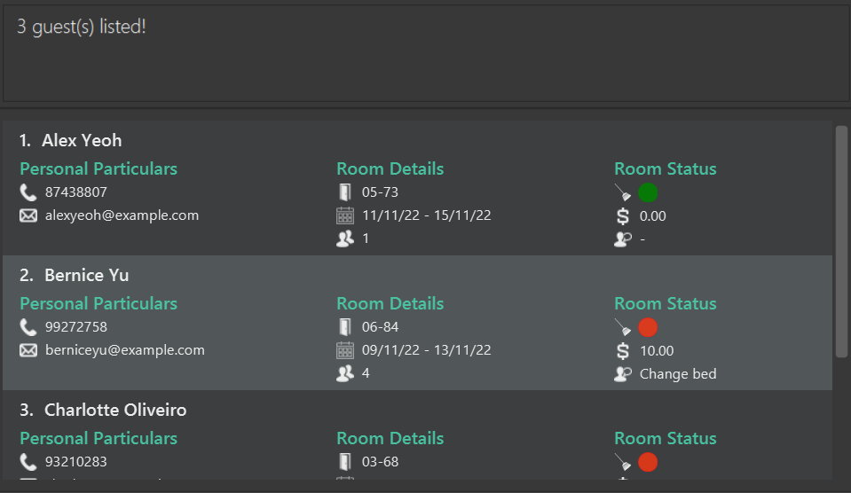

GuestBook is a **desktop app for managing guests in a hotel,
optimized for use via a Command Line Interface** (CLI)
while still having the benefits of a Graphical User Interface (GUI).
If you can type fast, GuestBook can get your
guest management tasks done faster than traditional GUI apps.

* Table of Contents
{:toc}

--------------------------------------------------------------------------------------------------------------------

## Components of the UI

* Command Box: This is where you enter your commands.
* Result Display: This is where the detailed results of your command will be shown.
* Guest Card: This is where all your guest information will be shown.
* Status Bar: This is where your saved file is stored.

--------------------------------------------------------------------------------------------------------------------

## Quick start

1. Ensure you have Java `11` or above installed in your Computer.

1. Download the latest `guestbook.jar` from [here](https://github.com/AY2223S1-CS2103T-W16-1/tp/releases).

1. Copy the file to the folder you want to use as the _home folder_ for your GuestBook.

1. Double-click the file to start the app. The GUI similar to the image below should appear in a few seconds. Note how the app contains some sample data. 
   

1. Type the command in the command box and press Enter to execute it. e.g. typing **`help`** and pressing Enter will open the help window. 
   Some example commands you can try:

   * **`add`**`n/John Doe p/98765432 e/johnd@example.com rm/05-73 dr/13/09/22 - 15/09/22 ng/3 rq/Extra towels`: Adds a guest named `John Doe` to the guest book.

   * **`edit`** `1` `n/Bob rc/no rq/Room Service`: Edits the first guest shown in the current list.

   * **`find`** `James` : Finds all the guests where at least one of the fields contains `James` (case insensitive).

   * **`list`** : Lists all guests.

   * **`bill`** `2` `b/+99.99`: Adds 99.99 to the bill of the 2nd guest.

   * **`delete`**`3` : Deletes the 3rd guest shown in the current list.

   * **`clear`** : Deletes all guests.

   * **`exit`** : Exits the app.

1. Refer to the [Features](#features) below for details of each command.

--------------------------------------------------------------------------------------------------------------------

## Glossary

| Term             | Definition                                                                                                                                            |
|------------------|-------------------------------------------------------------------------------------------------------------------------------------------------------|
| **Alphanumeric** | `Refers to characters that are numbers 0-9 and alphabets A-Z, both uppercase and lowercase.`                                                          |
| **dd/MM/yy**     | `Refers to the date format, where dd stands for 2 digit days, 2 digit months and the last 2 digits for the year and they must be separated by a "/".` |
| **CLI**          | `Stands for Command Line Interface, it refers to a text-based interface used to execute opertaions of the system.`                                    |
| **Guest**        | `A guest staying at the hotel`                                                                                                                        |
| **GUI**          | `Stands for Graphical User Interface, it refers to an interface that allows users to interact with the system through friendly visuals.`              |
| **Hard disk**    | `A data storage device used to store and retrieve data.`                                                                                              |
| **Index**        | `The number that corresponds to the position of the Guest in the list.`                                                                               |
| **Java**         | `A programming language used to run Guest Book.`                                                                                                      |
| **JSON file**    | `Stands for JavaScript Object Notation, it refers to a file format to store data.`                                                                    |

--------------------------------------------------------------------------------------------------------------------

## Features

**:information_source: Notes about the command format:** 

* Words in `UPPER_CASE` are the parameters to be supplied by the user. 
  e.g. in `add n/NAME`, `NAME` is a parameter which can be used as `add n/John Doe`.

[//]: # (Commented out as the features below are currently not in our application, but we can consider it)
* Items in square brackets are optional. 

  e.g `n/NAME [rq/REQUEST]` can be used as `n/John Doe rq/Extra towels` or as `n/John Doe`.

[//]: # ()
[//]: # (* Items with `…`​ after them can be used multiple times including zero times. )

[//]: # (  e.g. `[t/TAG]…​` can be used as ` ` &#40;i.e. 0 times&#41;, `t/friend`, `t/friend t/family` etc.)

* Parameters can be in any order. 
  e.g. if the command specifies `n/NAME p/PHONE`, `p/PHONE n/NAME` is also acceptable.

* If a parameter is expected only once in the command but you specified it multiple times, only the last occurrence of the parameter will be taken. 
  e.g. if you specify `p/12341234 p/56785678`, only `p/56785678` will be taken.

* Extraneous parameters for commands that do not take in parameters (such as `help`, `list`, `exit` and `clear`) will be ignored. 
  e.g. if the command specifies `help 123`, it will be interpreted as `help`.

### Viewing help : `help`

Shows a message explaining how to access the help page.

Format: `help`

### Adding a guest : `add`

This command adds a guest to the guest book. This is akin to checking in a guest with their personal 
and room details.

Format: `add n/NAME p/PHONE e/EMAIL rm/ROOM dr/DATE_RANGE ng/NUMBER_OF_GUESTS [rq/REQUEST]`

Constraints of parameters:

&nbsp;&nbsp;&nbsp;Unless stated otherwise, all fields should not be left blank.
* `NAME` should only contain alphanumeric characters and spaces.
* `PHONE` should only contain numbers, and it should be at least 3 digits long.
* `EMAIL` should only contain alphanumeric characters and '@' character.
* `ROOM` should only contain alphanumeric characters and a hyphen.
* `DATE_RANGE` should follow the format dd/MM/yy - dd/MM/yy.
* `NUMBER_OF_GUESTS` should only contain numbers, and it should be at least 1 and at most 4.
* `REQUEST` is an optional field and it should be at most 500 characters long.

Examples:
* `add n/John Doe p/98765432 e/johnd@example.com rm/05-73 dr/19/05/22 - 24/05/22 ng/3`
* `add n/Betsy Crowe p/82297553 e/betsycrowe@example.com rm/Aloha5 dr/10/01/12 - 11/01/12 ng/1 rq/Extra towels`

### Listing all guests : `list`

This command displays a list of all guests in the guest book.

Format: `list`

### Editing a guest : `edit`

This command edits an existing guest in the guest book.

Format: `edit INDEX [n/NAME] [p/PHONE] [e/EMAIL] [rm/ROOM] [dr/DATE_RANGE] [ng/NUMBER_OF_GUESTS] [rc/IS_ROOM_CLEAN] [rq/REQUEST]`

* Edits the guest at the specified `INDEX`. The index refers to the index number shown in the displayed guest list. The index **must be a positive integer** 1, 2, 3, …​

* Existing values will be updated to the input values.

Examples:
*  `edit 1 p/91234567 e/johndoe@example.com` Edits the phone number and email address of the 1st guest to be `91234567` and `johndoe@example.com` respectively.
*  `edit 2 n/Betsy Crower` Edits the name of the 2nd guest to be `Betsy Crower`.

### Billing a guest : `bill`

This command updates the bill of a guest in the guest book.

Format: `bill INDEX b/BILL`

* Updates the bill of the guest at the specified `INDEX`.

* The index **must be a positive integer** 1, 2, 3, …​

* The existing bill value will be increased by the input value.

* The bill value **must be either an integer or a double with up to 2 decimal places**

Examples:
* `bill 1 b/+99.99` or `bill 1 b/99.99` Adds 99.99 to the bill of the 1st guest.
* `bill 2 n/-10` Subtracts 10 from the bill of the 2nd guest.

Common mistakes:
* Missing out the b/ prefix in the bill command
* Editing the bill using the edit command instead of the bill command

### Locating guests : `find`

This command locates guests whose details contain any of the given keywords.

This command is typically used when searching for a guest of a specific characteristic.

Format: `find KEYWORD [MORE_KEYWORDS]`

* The search is case-insensitive. e.g `hans` will match `Hans`
* The order of the keywords does not matter. e.g. `Hans Bo` will match `Bo Hans`
* Only full words will be matched e.g. `Han` will not match `Hans`
* Guests matching at least one keyword will be returned (i.e. `OR` search).
  e.g. `Hans Bo` will return `Hans Gruber`, `Bo Yang`

Examples:
* `find John` returns `john` and `John Doe`
* `find alex 99272758 03-68` returns `Alex Yeoh`, `Bernice Yu`, `Charlotte Oliveiro` 

  

### Deleting a guest : `delete`

This command deletes the specified guest from the guest book. 

This command is typically used when a guest has checked out of the hotel. Do note that this command 
is irreversible. Once deleted, the specific guest's data cannot be retrieved. Please use this 
command with caution.

Format: `delete INDEX`

* Deletes the guest at the specified `INDEX`.
* The index **must be a positive integer** 1, 2, 3, …​

Examples:
* `list` followed by `delete 2` deletes the 2nd guest in the guest book.

* `find Betsy` followed by `delete 1` deletes the 1st guest in the results of the `find` command.

### Marking all rooms as unclean: `markRoomsUnclean`

This command functions to mark the room clean statuses of all guests as "no".

This command is typically used at the end or the start of the day when the hotel manager wishes to 
update all the room clean statuses to "no" efficiently. This clean slate would allow the hotel 
managers to keep abreast of the rooms that are cleaned or uncleaned for the day.

Format: `markRoomsUnclean`

Common mistakes: 
* Missing out the "s" after the "Rooms"
* Capitalising the "m" in "mark"

### Clearing all entries : `clear`

This command clears all entries from the guest book. 

This command is typically used as a hard reset of the entire guest book. Do note that this command 
is irreversible. Once cleared, all the guest data cannot be retrieved. Please use this command 
with utmost caution.

Format: `clear`

### Exiting the program : `exit`

This command exits the program.

Format: `exit`

### Saving the data

GuestBook data are saved in the hard disk automatically after any command that changes the data. There is no need to save manually.

### Editing the data file

GuestBook data are saved as a JSON file `[JAR file location]/data/guestbook.json`. Advanced users are welcome to update data directly by editing that data file.

:exclamation: **Caution:**
If your changes to the data file makes its format invalid, GuestBook will discard all data and start with an empty data file at the next run.

### Archiving data files `[coming in v2.0]`

_Details coming soon ..._

--------------------------------------------------------------------------------------------------------------------

## FAQ

Listed here are some frequently asked questions. Should you require any other assistance, feel free to [contact us](#contact-us).

**Q**: How do I transfer my data to another Computer? 
**A**: Install the app in the other computer and overwrite the empty data file it creates with the file that contains the data of your previous GuestBook home folder.

**Q**: Will my data be automatically saved? 
**A**: Yes, GuestBook automatically saves your data after every command entered.

**Q**: Where is my data saved? 
**A**: Go to where you have downloaded your `guestbook.jar` file, there a `/data` folder will be created and the data will be saved under `guestbook.json`.

**Q**: Can I rename my saved data file? 
**A**: No, GuestBook currently only supports the use of `guestbook.json` as the name of the saved data file.

**Q**: Why are there no guests in my GuestBook? 
**A**: If you didn't enter the `clear` command, it is likely that your `guestbook.json` file is corrupted, causing Guest Book to reset it to prevent any malicious files from being used.

--------------------------------------------------------------------------------------------------------------------

## Command summary

| Action                 | Format, Examples                                                                                                                                                                               |
|------------------------|------------------------------------------------------------------------------------------------------------------------------------------------------------------------------------------------|
| **Add**                | `add n/NAME p/PHONE e/EMAIL rm/ROOM dr/DATE_RANGE ng/NUMBER_OF_GUESTS [rq/REQUEST]`   e.g., `add n/John Doe p/98765432 e/johnd@example.com rm/ 05-73 dr/19/05/20 - 24/05/22 ng/3`           |
| **Clear**              | `clear`                                                                                                                                                                                        |
| **Delete**             | `delete INDEX`  e.g., `delete 3`                                                                                                                                                            |
| **Edit**               | `edit INDEX [n/NAME] [p/PHONE] [e/EMAIL] [rm/ROOM] [dr/DATE_RANGE] [ng/NUMBER_OF_GUESTS] [rc/IS_ROOM_CLEAN] [rq/REQUEST]`  e.g.,`edit 2 e/jameslee@example.com dr/13/09/22 - 15/09/22 ng/5` |
| **Bill**               | `bill INDEX b/BILL`  e.g., `bill 2 b/99.99`                                                                                                                                                 |
| **Find**               | `find KEYWORD [MORE_KEYWORDS]`  e.g., `find James Jake`                                                                                                                                     |
| **Mark rooms unclean** | `markRoomsUnclean`                                                                                                                                                                             |
| **List**               | `list`                                                                                                                                                                                         |
| **Help**               | `help`                                                                                                                                                                                         |

## Contact Us
