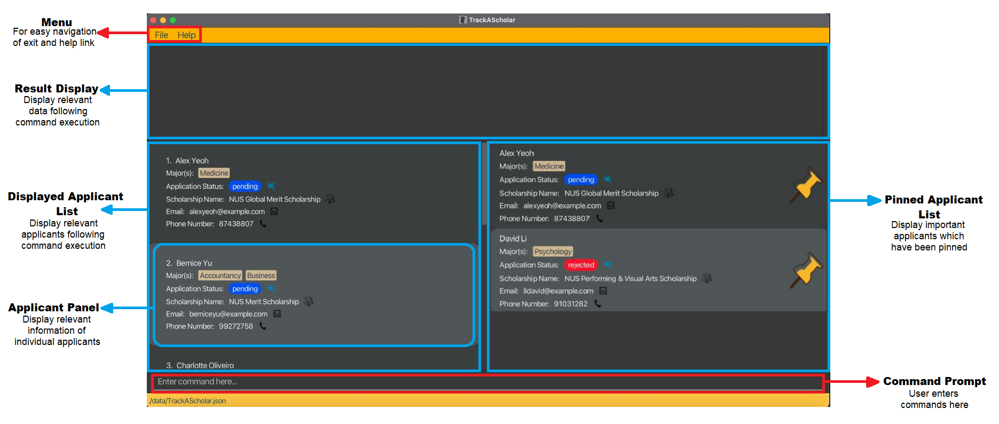
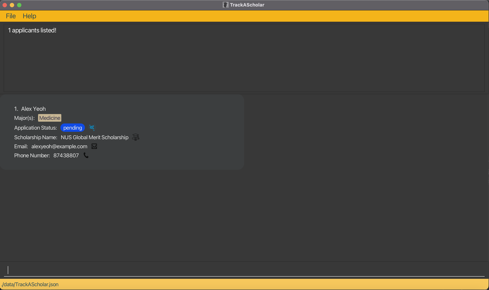
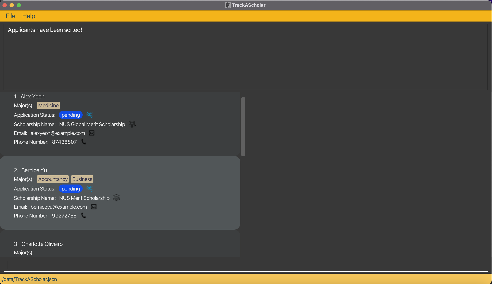

## Table of Contents

* Table of Contents
{:toc}

--------------------------------------------------------------------------------------------------------------------

## Introduction

#### What is TrackAScholar?

TrackAScholar (TAS) is the **only** desktop app any university administrative staff needs for managing scholarship applications.
TAS helps administrative staff manage scholarship applications by storing the applicant's contact details, scholarship applied and majors taken all in one place.

TAS presents the administrative staff with the option to pin important applicants, edit their details easily,
 find or filter for applicants with ease and otherwise speeds up the application process.

TAS is **optimised for use via a Command Line Interface (CLI)** while simultaneously having the benefits of a **Graphical User Interface
(GUI)**. If you can type fast, TAS can handle your scholarship application process faster than conventional GUI apps.

#### Who is this User Guide for?

We have created this user manual for people who want to learn how to use our app.
It is best suited for administrative staff members who seek an app to streamline their scholarship management procedure.

Alternatively, you may read our [Developer Guide](https://ay2223s1-cs2103t-w10-3.github.io/tp/DeveloperGuide.html)
 to find out more about the technical components of our app.

[Return to top](#table-of-contents)

--------------------------------------------------------------------------------------------------------------------

## Legend

:information_source: **Notes:** Notes are placed in this guide to specify extra details and elaboration.

:bulb: **Tip:** Tips are placed in this guide to provide a suggestion.

:exclamation: **Caution:** Cautions are placed in this guide as warnings for certain erroneous actions.

[Return to top](#table-of-contents)

--------------------------------------------------------------------------------------------------------------------

## Quick start

1. Ensure `Java 11` or a later version is installed on your computer. Otherwise, check [here](https://nus-cs2103-ay2223s1.github.io/website/admin/programmingLanguages.html#programming-language).

2. Download the latest `TrackAScholar.jar` from [here](https://github.com/AY2223S1-CS2103T-W10-3/tp/releases).

3. Move the jar file to an empty folder you wish to use as the **home folder** for the app.

4. Double-click the jar file to open the app. If the app does not respond, open your terminal in the current folder 
   where `TrackAScholar.jar` is located and enter `java -jar TrackAScholar.jar` to open the app.

5. The following screen ought to appear in a few seconds when the app first launches. 
  Note how the app contains some sample data for you to explore the features with.
   

6. Type the command in the command box and press Enter to execute it. e.g. typing `help` and pressing Enter will open the help window.

7. Refer to the [Features](#features) below for details of each command.

[Return to top](#table-of-contents)

--------------------------------------------------------------------------------------------------------------------

## Overview of TrackAScholar app



--------------------------------------------------------------------------------------------------------------------

## Features

<div markdown="block" class="alert alert-info">

**:information_source: Notes about the command format:**<br>

* Command words and prefixes have to be in `lower_case` **(Case sensitive)**.<br>
  Command words includes `help`, `list`, `exit` etc.<br>
  Prefixes are used to recognise the different parameters input by the user, these include `n/`, `p/`, `e/` etc.

* Words in `UPPER_CASE` are the parameters to be supplied by the user.<br>
  e.g. in `add n/NAME`, `NAME` is a parameter which can be used as `add n/John Doe`.

* Items in square brackets are optional.<br>
  e.g `n/NAME [m/MAJOR]` can be used as `n/John Doe m/Business` or as `n/John Doe`.

* Items in angle brackets are fixed, precise and **case-insensitive** values.<br>
  e.g. `<ACCEPTED>` means the parameter must be an input of a **case-insensitive** value `ACCEPTED`. This means `AccEpTEd` or `accepted` are valid inputs.

* Items with `…`​ after them can be used multiple times including zero times.<br>
  e.g. `[m/MAJOR]…​` can be used as ` ` (i.e. 0 times), `m/Business`, `m/Medicine m/Dentistry` etc.

* Parameters can be in any order.<br>
  e.g. if the command specifies `n/NAME p/PHONE_NUMBER`, `p/PHONE_NUMBER n/NAME` is also acceptable.

* If a parameter is expected only once in the command but you specified it multiple times, only the last occurrence of the parameter will be taken.<br>
  e.g. if you specify `p/12341234 p/56785678`, only `p/56785678` will be taken.

* Extraneous parameters for commands that do not take in parameters (such as `help`, `list`, `exit` and `clear`) will be ignored.<br>
  e.g. if the command specifies `help 123`, it will be interpreted as `help`.

</div>

[Return to top](#table-of-contents)

--------------------------------------------------------------------------------------------------------------------

### Viewing help window : `help`

Pops open a help window which contains a link that directs the user to this user guide.


Format:
```
help
```

[Return to top](#table-of-contents)

--------------------------------------------------------------------------------------------------------------------

### Adding an applicant: `add`

Adds an applicant with the following details to the TrackAScholar:
* `NAME`: Name of applicant.
* `PHONE_NUMBER`: Phone number of Applicant.
* `EMAIL`: Email of Applicant.
* `SCHOLARSHIP`: Scholarship that applicant has applied for.
* `APPLICATION_STATUS`: Status of scholarship application for the applicant, can only be either `PENDING`, `ACCEPTED` or `REJECTED`.
* `MAJOR`: A Major taken up by the applicant.

Format:
```
add n/NAME p/PHONE_NUMBER e/EMAIL s/SCHOLARSHIP as/APPLICATION_STATUS [m/MAJOR]…​
```

<div markdown="block" class="alert alert-info">:information_source: **Note:**
Duplicate names are not allowed in TrackAScholar, as such any attempts to add an applicant with the same name as an existing applicant will be rejected.
</div>

<div markdown="block" class="alert alert-info">:information_source: **Note:**
An applicant can have at most 2 majors (including 0).
</div>

<div markdown="span" class="alert alert-primary">:bulb: **Tip:**
Application status is **case-insensitive**, entering the status PENDING, ACCEPTED or REJECTED in any combination of upper or lower case is acceptable.
</div>

Examples:
`add n/Samuel Cheong m/Medicine e/samuelcheong1234@gmail.com p/65782310 s/Merit as/pending`

Sample output for `add n/Samuel Cheong m/Medicine e/samuelcheong1234@gmail.com p/65782310 s/Merit as/pending`:


[Return to top](#table-of-contents)

--------------------------------------------------------------------------------------------------------------------

### Listing all applicants : `list`

List out all the applicants stored in TrackAScholar.

Format:
```
list
```
Sample output for `list`:


[Return to top](#table-of-contents)

--------------------------------------------------------------------------------------------------------------------

### Editing an existing applicant : `edit`

Edits an existing applicant stored in TrackAScholar.

Format:
```
edit INDEX [n/NAME] [p/PHONE] [e/EMAIL] [m/MAJOR] [as/APPLICATION_STATUS]…​
```

* Edits the applicant at the specified `INDEX`. 
* The index refers to the index number shown in the displayed applicant list. 
* The index **must be a positive integer** 1, 2, 3, …​
* Index specified must not exceed the total number of applicants stored in TrackAScholar. e.g. using index `7` on a list of `6` applicants will cause the edit command to be rejected as `INDEX` specified is invalid.
* At least one of the optional fields must be provided.
* Existing values will be updated to the input values.
* When editing majors, the existing majors of the applicant will be removed i.e adding of majors is not cumulative. 
e.g. `edit INDEX m/Business` on an applicant with Majors `Business` and `Mathematics` will remove the `Mathematics` Major.
* You can remove all the applicant's majors by typing `m/` without specifying any majors after it.

<div markdown="block" class="alert alert-info">:information_source: **Note:**
Duplicate names are not allowed in TrackAScholar, as such any attempts to edit an applicant's name to have the same name as an existing applicant will be rejected.
</div>

<div markdown="block" class="alert alert-info">:information_source: **Note:**
Since an applicant can have at most 2 Majors, any attempts to edit an applicant such that he/she has more than two majors will be rejected.
</div>

Examples:
* `edit 1 n/John Cena e/johnCena@yahoo.com` Edits the name and email address of the 1st applicant to be John Cena and johnCena@yahoo.com respectively.
* `edit 2 n/Samuel Cheong m/` Edits the name of the 2nd applicant to be Samuel Cheong and clears all existing majors

Sample output for `edit 2 n/Samuel Cheong m/`:


[Return to top](#table-of-contents)

--------------------------------------------------------------------------------------------------------------------

### Deleting an applicant : `delete`

Deletes the specified applicant from TrackAScholar.

Format:
```
delete INDEX
```

* Deletes the applicant at the specified `INDEX`. 
* The index refers to the index number shown in the displayed applicant list.
* The index **must be a positive integer** 1, 2, 3, …​.
* Index specified must not exceed the total number of applicants stored in TrackAScholar. e.g. using index `7` on a list of `6` applicants will cause the delete command to be rejected as `INDEX` specified is invalid.

Examples:
* `list` followed by `delete 2` deletes the 2nd applicant in TrackAScholar.

Sample output for `delete 2`:


[Return to top](#table-of-contents)

--------------------------------------------------------------------------------------------------------------------

### Removing applicants by status : `remove`

All applicants with a specified completed application status (accepted/rejected) stored in TrackAScholar are removed.

Format:
```
remove <ACCEPTED>/<REJECTED>
```

* The user selects the applicant(s) with application status of either `ACCEPTED` or `REJECTED` to be removed from TrackAScholar.
* Remove command is **case-insensitive**. e.g. `Accepted` or `accepted` both matches `ACCEPTED`.

<div markdown="span" class="alert alert-primary">:bulb: **Tip:**
You can navigate between the **Close** and **Yes** button on the confirmation screen using **Shift** + **Left Arrow / Right Arrow** on your keyboard
</div>

Examples:
* `remove accepted` removes all entries with `ACCEPTED` as an application status from TrackAScholar.
* `remove rejected` removes all entries with `REJECTED` as an application status from TrackAScholar.

Sample output for `remove accepted`:


[Return to top](#table-of-contents)

--------------------------------------------------------------------------------------------------------------------

### Clearing all entries : `clear`

Clears all entries from data stored in TrackAScholar.

Format:
```
clear
```

<div markdown="span" class="alert alert-primary">:bulb: **Tip:**
You can navigate between the **Close** and **Yes** button on the confirmation screen using **Shift** + **Left Arrow / Right Arrow** on your keyboard
</div>

Sample output for `clear`:


[Return to top](#table-of-contents)

--------------------------------------------------------------------------------------------------------------------

### Finding applicants by name, scholarship or major : `find`

Finds all scholarship applicants whose credentials match any of the attributes searched.

Format:
```
find [n/NAME]... [s/SCHOLARSHIP]... [m/MAJOR]...
```

* The search is **case-insensitive**. e.g `find n/hans` will match an applicant with `NAME` `Hans`.
* The order of the keywords does not matter. e.g. `find n/Hans Bo` will match applicant with Name `Bo Hans`.
* Only full words will be matched e.g. `find m/Engineer` will not match the Major `Software Engineering`.
* Applicant whose credentials matching at least one keyword will be returned (i.e. `OR` search).
  e.g. `find s/Global Merit` will match applicants with scholarship of `NUS Merit Scholarship` or `NUS Global Merit Scholarship`.
* At least one of the optional fields must be provided.

Examples:
* `find n/John n/Sam` returns applicant with Name `john`, applicant with Name `John Doe` and applicant with Name `Sam Ong`
* `find n/alex m/Business` returns any applicants with Name containing `Alex` and Major containing `Business`

Sample output for `find n/alex m/Business`:



[Return to top](#table-of-contents)

--------------------------------------------------------------------------------------------------------------------

### Filtering applicants by application status: `filter`

Filters and list all applicants whose application status matches the specified application status.

Format:
```
filter <PENDING>/<ACCEPTED>/<REJECTED>
```

* The user specifies to filter the applicants with application status of either `PENDING` or `ACCEPTED` or `REJECTED`.
* Filter command is **case-insensitive**. e.g. `pEnDiNg` or `Pending` both matches `PENDING`.

Examples:
* `filter pending` displays all applicants with the application status `PENDING`.

Sample output for `filter pending`:


[Return to top](#table-of-contents)

--------------------------------------------------------------------------------------------------------------------

### Sorting applicants by either name, scholarship or application status : `sort`

All applicants in TrackAScholar will be sorted in the specified manner.

Format:
```
sort <NAME>/<SCHOLARSHIP>/<STATUS> [-r]
```

* The user can choose to sort the list according the applicant's `NAME`, `SCHOLARSHIP` or Application `STATUS`.
* The optional `-r` flag specifies that the sort will be in reverse order.
* Sort command is **case-insensitive**. e.g. `NamE` or `name` both matches `NAME`.
* In the event where two applicants have the same `SCHOLARSHIP` or Application `STATUS`, the applicants' name is used as a tiebreaker, as duplicate applicant names are not allowed.

Examples:
* `sort name` All applicants in TrackAScholar will be sorted based on their name in a lexicographical manner.
* `sort scholarship` All applicants in TrackAScholar will be sorted based on the type of scholarship they have applied for, in a lexicographical manner.
* `sort status` All applicants in TrackAScholar will be sorted according to their application status in the following order: pending, accepted and rejected applicants.

Sample output for `sort name`:



[Return to top](#table-of-contents)

--------------------------------------------------------------------------------------------------------------------

### Importing a trackAScholar file : `import`

Imports a trackAScholar file into the current trackAScholar file.

Format:
```
import <r>/<k>
```

* The user can choose to import a data file which adds to the current list of applicants.
* Imported applicants that are duplicates of applicants in the current list are handled with the `r` or `k` input.
* `r` stands for replacing the duplicate applicants with the imported applicants.
* `k` stands for keeping the current applicants and disregarding the imported duplicate applicants.
* Import command is **case-insensitive**. e.g. `import R` is the same as `import r`.

<div markdown="span" class="alert alert-warning">:exclamation: **Caution:**
It is necessary for a trackAScholar file to be named as a readable format (trackAScholarImport.json) and be placed in the ./data directory. 
Otherwise, file cannot be read.
</div>

Examples:
* `import r` applicants with the same name will be replaced with application data from imported file
* `import k` applicants with the same name will be kept instead of being replaced with application data from imported file

[Return to top](#table-of-contents)

--------------------------------------------------------------------------------------------------------------------

### Pinning an applicant : `pin`

An applicant will be pinned in the pinned applicant list on the right side of the screen.
The applicant will be displayed on both applicant lists.

Format: 
```
pin INDEX
```

* Pins the applicant with the specified `INDEX`.
* The index refers to the index number shown in the displayed applicant list.
* The index **must be a positive integer** 1, 2, 3, …​.

Examples:
* `list` followed by `pin 2` pins the 2nd applicant in TrackAScholar.

Sample output for `pin 2`:


[Return to top](#table-of-contents)

--------------------------------------------------------------------------------------------------------------------

### Unpins an applicant : `unpin`

An applicant in the pinned applicant list (on the right side of the screen) will be unpinned. 
This will result in the removal of the applicant from the pinned applicant list.

Format: 
```
unpin FULL_NAME
```

* Unpins the scholarship applicant with the specified `FULL_NAME`.
* `FULL_NAME` refers the full name of the pinned applicant. e.g. `Bernice Yu` instead of `Bernice`
* Unpin Command is **case-insensitive**. e.g. `BernICE yU` will match the applicant with `FULL_NAME` `Bernice Yu`.

Examples:
* `unpin Bernice Yu` unpins the applicant with the full name `Bernice Yu` in TrackAScholar.

Sample output for `unpin Bernice Yu`:


[Return to top](#table-of-contents)

--------------------------------------------------------------------------------------------------------------------

### Exiting the app : `exit`

Exits TrackAScholar.

Format: 
```
exit
```

[Return to top](#table-of-contents)

--------------------------------------------------------------------------------------------------------------------

## Further details

### Saving the data

TrackAScholar data is saved in the hard disk automatically after any command that changes the data. There is no need to save manually.

### Editing the data file

TrackAScholar data is saved as a JSON file `[JAR file location]/data/trackAScholar.json`. Advanced users are welcome to update data directly by editing that data file.

<div markdown="span" class="alert alert-warning">:exclamation: **Caution:**
If your changes to the data file makes its format invalid, TrackAScholar will discard all data and start with an empty data file at the next run.
</div>

[Return to top](#table-of-contents)

--------------------------------------------------------------------------------------------------------------------

## Command summary

| Action     | Format, Examples                                                                                                                                                                           |
|------------|--------------------------------------------------------------------------------------------------------------------------------------------------------------------------------------------|
| **Help**   | `help`                                                                                                                                                                                     |
| **Add**    | `add n/NAME p/PHONE_NUMBER e/EMAIL s/SCHOLARSHIP as/APPLICATION_STATUS [m/MAJOR]…​` <br/> e.g. `add n/Samuel Cheong m/Medicine e/samuelcheong1234@gmail.com p/65782310 s/Merit as/pending` |
| **List**   | `list`                                                                                                                                                                                     |
| **Edit**   | `edit INDEX [n/NAME] [p/PHONE_NUMBER] [e/EMAIL] [m/MAJOR]…​` <br/> e.g. `edit 1 n/John Cena e/johnCena@yahoo.com`                                                                          |
| **Delete** | `delete INDEX` <br/> e.g. `delete 1`                                                                                                                                                       |
| **Remove** | `remove <ACCEPTED>/<REJECTED>` <br/> e.g. `remove rejected`                                                                                                                                |
| **Clear**  | `clear`                                                                                                                                                                                    |
| **Find**   | `find [n/NAME]... [s/SCHOLARSHIP]... [m/MAJOR]...` <br/> e.g. `find n/alex m/business`                                                                                                     |
| **Filter** | `filter <PENDING>/<ACCEPTED>/<REJECTED>` <br/> e.g. `filter pending`                                                                                                                       |
| **Sort**   | `sort <NAME>/<SCHOLARSHIP>/<STATUS> [-r]` <br/> e.g. `sort scholarship`                                                                                                                    |
| **Import** | `import <r>/<k>` <br/> e.g. `import r`                                                                                                                                                     |
| **Pin**    | `pin INDEX` <br/> e.g. `pin 2`                                                                                                                                                             |
| **Unpin**  | `unpin FULL_NAME` <br/> e.g. `unpin Alex Yeoh`                                                                                                                                             |
| **Exit**   | `exit`                                                                                                                                                                                     |
