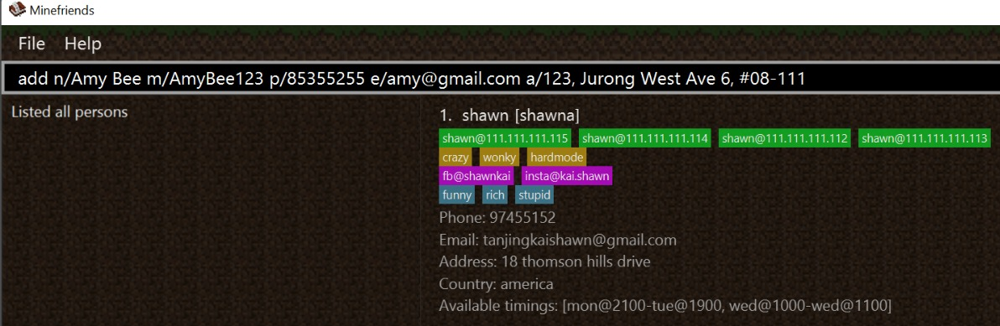
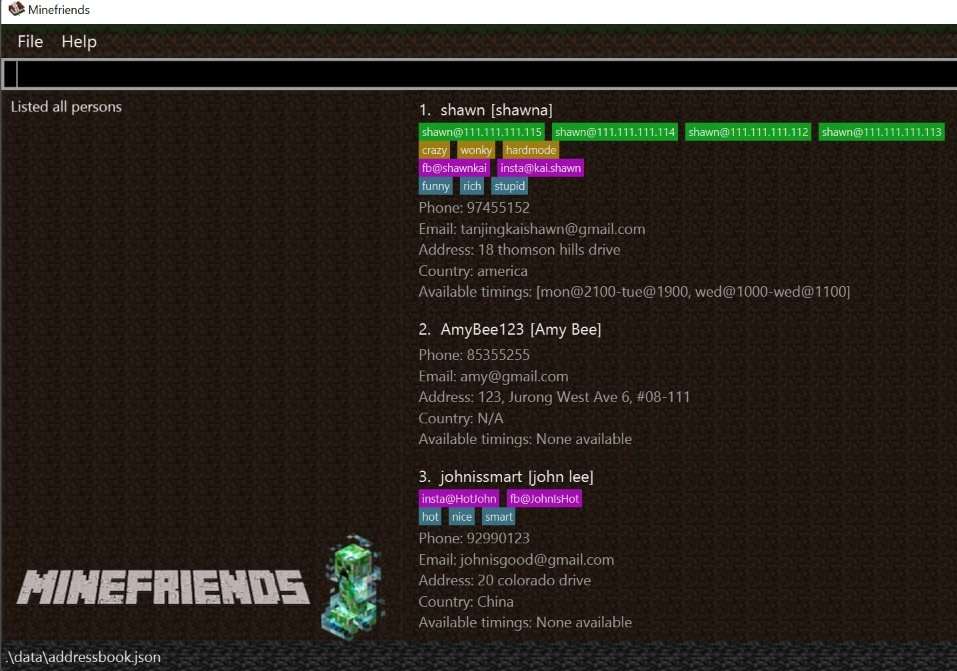
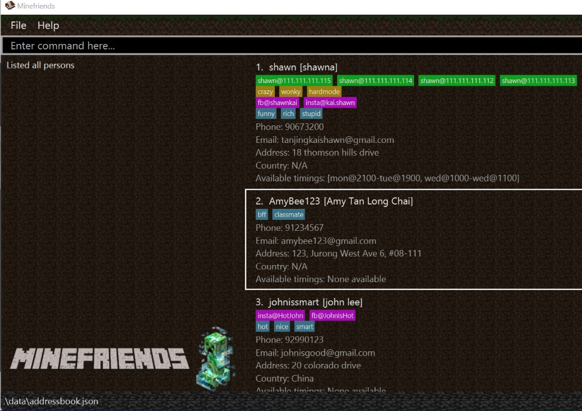

# 👾 MineFriends User Guide

MineFriends is an address book for you to find friends to play Minecraft multiplayer with,
at the right time, with the right game modes and on the right servers.

This user guide will help you get started with Minefriends and get to know what it can do for you. 
The guide is meant for Minecraft players who are familiar with the game and how multiplayer in Minecraft works.
No other technical knowledge is required.

### Table of Contents
* Getting started
* User interface breakdown
* Managing your Minecraft friends
* Summary of commands

--------------------------------------------------------------------------------------------------------------------

## Quick start

1. Ensure you have Java `11` or above installed in your Computer.

2. Download the latest `MineFriends.jar` from [here](\to be added\).

3. Copy the file to the folder you want to use as the _home folder_ for your MineFriends.

4. Double-click the file to start the app. The GUI similar to the one below should appear in a few seconds. Note how the app contains some sample data. 
   

5. Type the command in the command box and press Enter to execute it. e.g. typing **`help`** and pressing Enter will open the help window. 
   

Some sample commands you can try out:

   * **`list`** : Lists all of your friends.

   * **`add`**`n/Amy Bee m/AmyBee123 p/85355255 e/amy@gmail.com a/123, Jurong West Ave 6, #08-111` :  
   Adds a friend named `Amy Bee` to your friend list.

   * **`delete`**`3` : Deletes the 3rd friend shown in your current friend list.
   

Refer to the [Features](#features) below for details of each command.

--------------------------------------------------------------------------------------------------------------------

## Features

**Notes about the command format:** 

* Words in `UPPER_CASE` are the parameters to be supplied by the user. 
  e.g. in `add n/NAME`, `NAME` is a parameter which can be used as `add n/Amy Bee`.

* Items in square brackets are optional. 
  e.g `n/NAME [t/TAG]` can be used as `n/Amy Bee t/friend` or as `n/Amy Bee`.

* Parameters can be in any order. 
  e.g. if the command specifies the fields to be in the order`n/NAME p/PHONE_NUMBER`, 
  arranging them in an alternative order such as `p/PHONE_NUMBER n/NAME` is also acceptable.

* Extraneous parameters for commands that do not take in parameters (such as `help`, `list`, `exit` and `clear`) will be ignored. 
  e.g. if the command specifies `help 123`, it will be interpreted as `help`.

#
### Viewing help : `help`

Format: `help`

In the `Help` window, upon choosing a specific command, a Description,
and Example will be shown for that specific command along with the
specific Parameters for that command.

Example: 
Upon typing `help` or clicking on the `help` option, a help window
as such will appear:

### Adding a friend: `add`
Format (fields in [ ] are optional): `add n/NAME m/MINECRAFT_NAME p/PHONE_NUMBER e/EMAIL a/ADDRESS
[c/COUNTRY] [ms/MINECRAFT_SERVER] [s/SOCIAL_HANDLES] [t/TAG] [gt/GAME_TYPE] [ti/TIME_INTERVAL]`

Adds a person to your friend list.

#### Details of each field:
Name (prefix:n): 
Each person can only have one name.

Minecraft name (prefix:m): 
Each person can only have one minecraft name.

Phone Number (prefix:p): 
Each person can only have one phone number.

Email (prefix:e):  
Each person can only have one email.

Address (prefix:a):   
Each person can only have one address.

Country (prefix:c) [**Optional**]  
Each person can only have one country.

Minecraft Server (prefix:ms) [**Optional**]  
Each person can have multiple Minecraft servers. 
Minecraft servers are in the format of `ServerName@IpAddress`.

#### Examples:

##### Adding with only compulsory fields
* Before adding `add n/Amy Bee m/AmyBee123 p/85355255 e/amy@gmail.com a/123, Jurong West Ave 6, #08-111`
 

 
 
 

* After adding `add n/Amy Bee m/AmyBee123 p/85355255 e/amy@gmail.com a/123, Jurong West Ave 6, #08-111`
  
   
   
   
##### Adding with several optional fields

* Before adding `add n/john lee p/92990123 m/johnissmart a/20 colorado drive 
e/johnisgood@gmail.com c/China t/hot t/nice t/smart s/insta@HotJohn s/fb@JohnIsHot`
  

 
 
 

* After adding `add n/john lee p/92990123 m/johnissmart a/20 colorado drive
  e/johnisgood@gmail.com c/China t/hot t/nice t/smart s/insta@HotJohn s/fb@JohnIsHot`
  
 
 
 

### Listing all friends : `list`
Format: `list` 

Shows a list of all of your MineCraft friends.

Example: 

### Editing a friend's information : `edit`
Format: `edit INDEX [n/NAME] [a/ADDRESS] [t/TAG] …` 

Edits information about an existing friend in your friend list.

* Edits the person at the specified `INDEX`. The index refers to the index number shown in your displayed friend list. The index **must be a positive integer** 1, 2, 3, …​
* At least one field must be provided for editing.
* Existing values will be updated to the input values.
* For optional fields, you can remove all the person’s information in that field by typing the prefix (eg: `t/`) without
  including any information after the prefix.

#### Examples:

##### Editing only compulsory fields
Command: `edit 2 p/91234567 e/amybee123@gmail.com` 

Edits the phone number and email address of the 2nd person in the list 
to be `91234567` and `amybee123@gmail.com` respectively. 

Before editing

 
 
 
After editing

##### Editing compulsory and optional fields
Command: `edit 2 n/Amy Bee t/` 

Edits the name of the 2nd person in the list to be `Amy Bee` 
and clears all existing tags.

Before editing

 
 
 
After editing

### Locating friends by name: `find`
Format: `find KEYWORD [MORE_KEYWORDS]` 

Find friends whose names contain any of the given keywords.

* The search is case-insensitive. (e.g. `amy` will match `Amy`) 
 
Example:  
`find Amy` returns `amy` and `Amy Bee`

* The order of the keywords does not matter. e.g. `Amy Bee` will match `Bee Amy`.

* Only the name is searched.

* Only full words will be matched. (e.g. `Am` will not match `Amy`)

* Persons matching at least one keyword will be returned
  (e.g. `Amy Tan` will return `Amy Bee`, `Benson Tan`)
         
Example: 
`find amy benson` returns `Amy Bee` and `Benson Tan` 

### Suggest me a friend: `suggest`

Suggest friends to play with given a set of constraints.

Format: `suggest [dt/DAY_TIME_IN_WEEK]* [k/KEYWORD]*`

* The search is case-insensitive (e.g. `amy` will match `Amy`)
* The order of the keywords does not matter
* The `Keyword` will be matched against **all** attributes of a friend (eg. Name, Minecraft Name, Address etc.)
* As long as some attribute of a friend contains the `Keyword`, the `Keyword` is considered to have a valid match
* All `Keyword` must be matched, but only 1 `DayTimeInWeek` needs to be matched

Examples:

`suggest dt/tue@2125 dt/sat@1200 k/Victoria k/Vicky` 
will return friends subjected to **all** of the following conditions:
1. Is available at either Tuesday 9:25pm or Saturday 12:00pm
2. Attributes contain the `Keyword` "Victoria" (ignore case)
3. Attributes contain the `Keyword` "Vicky" (ignore case)

* A friend with name "Victoria Tan" and Minecraft name "vicky12345", who is available from Tuesday 7pm to 11pm
will be matched
* A friend with name "Victoria Tan" but no other attributes containing "Vicky" will not be matched
* A friend with name "Victoria Tan" and Minecraft name "vicky12345", who is only available from Sunday 1pm to 6pm
will also not be matched

`suggest k/Victoria`
will return friends subjected to the only condition:
1. Attributes contain the `Keyword` "Victoria" (ignore case)

`suggest dt/tue@2125`
will return friends subjected to the only condition:
1. Is available at Tuesday 9:25pm

### Deleting a friend : `delete`
Format: `delete INDEX` 

Deletes the specified friend from your friend list.

* Deletes the friend at the specified `INDEX` of your friend list.
* The index **must be a positive integer** 1, 2, 3, …

Example:
* `list` followed by `delete 2` deletes the 2nd friend in your friend list. 

Before delete
  

After delete

### Clearing all entries : `clear`

Clears all entries from your friend list.

Example: - image to be added -

Format: `clear`

### Exiting the program : `exit`

Exits the program.

Format: `exit`

### Saving the data

MineFriends data are saved in the hard disk automatically after any 
command that changes the data. There is no need to save manually.

--------------------------------------------------------------------------------------------------------------------

## FAQ

**Q: How do I transfer my MineFriends data to another Computer?**  

**A**: 
Install the app in the other computer and overwrite the empty data file it creates with the file that contains the data of your previous MineFriends home folder.

--------------------------------------------------------------------------------------------------------------------

## Command summary

| Action      | Format, Examples                                                                                                                                                                                                                                                                                               |
|-------------|----------------------------------------------------------------------------------------------------------------------------------------------------------------------------------------------------------------------------------------------------------------------------------------------------------------|
| **Add**     | `add n/NAME m/MINECRAFT_NAME p/PHONE_NUMBER e/EMAIL a/ADDRESS [s/SOCIAL_HANDLES] [t/TAG] [c/COUNTRY] [ms/MINECRAFT_SERVER]``[s/SOCIAL_HANDLES] [t/TAG] [gt/GAME_TYPE] [ti/TIME_INTERVAL]`     e.g. `add n/Benson m/benson01 p/92881083 e/bensontan@hotmail.com a/ 4 Leith road s/ig@bensontan01 t/bff` |
| **List**    | `list`                                                                                                                                                                                                                                                                                                         | `list`     
| **Edit**    | `edit INDEX [n/NAME] [a/ADDRESS] [t/TAG] …`    e.g.`edit 2 n/Amy Bee e/amybee123@gmail.com`                                                                                                                                                                                                            |    |                                                                                                                                                                       |
| **Find**    | `find KEYWORD [MORE_KEYWORDS]`    e.g., `find Amy Benson`                                                                                                                                                                                                                                                |
| **Delete**  | `delete INDEX`   e.g., `delete 3`                                                                                                                                                                                                                                                                        |
| **Suggest** | `suggest [dt/DAY_TIME_IN_WEEK]* [k/KEYWORD]*`       e.g. `suggest dt/tue@2125 dt/sat@1200 k/Victoria k/Vicky`                                                                                                                                                                                          ||
| **Clear**   | `clear`                                                                                                                                                                                                                                                                                                        ||
| **Exit**    | `exit`                                                                                                                                                                                                                                                                                                         |
| **Help**    | `help`                                                                                                                                                                                                                                                                                                         |
