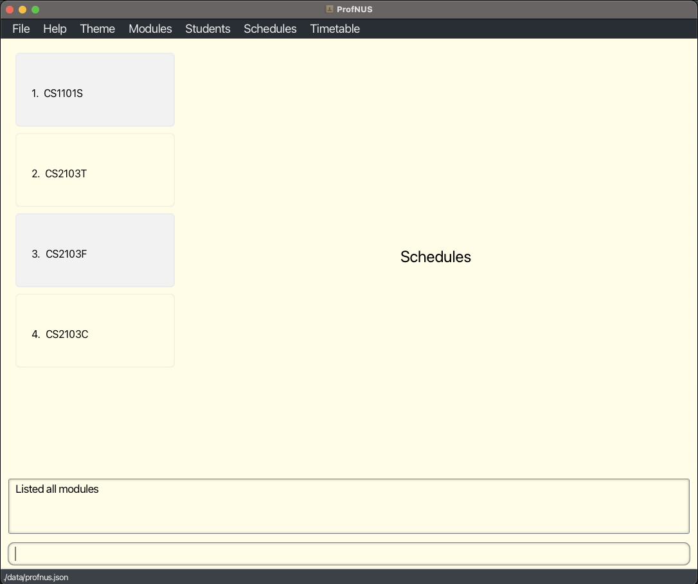
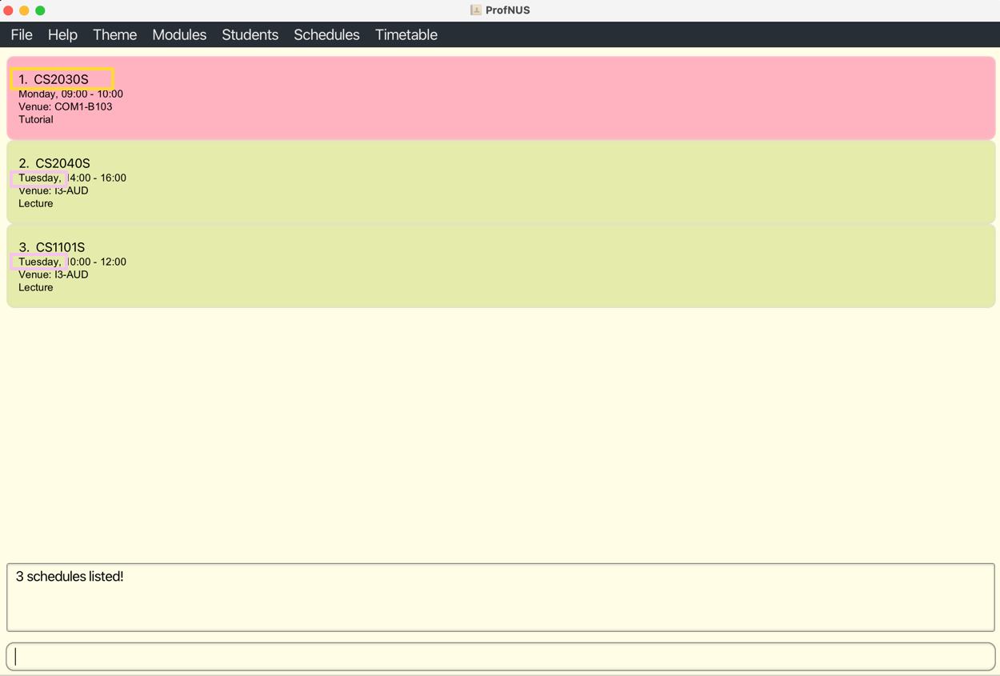

Made for SOC Professors, **ProfNUS** is the **easiest way to keep track of your teaching schedule and organize information regarding the students and modules you teach.** It is optimized for users who prefer Command Line Interface (CLI) so that frequent tasks can be done faster by typing in commands which is perfect for SOC Professors! Interested? :wink: Continue reading to find out more!

* Table of Contents
  {:toc}

--------------------------------------------------------------------------------------------------------------------

## 1. Introduction

Welcome to **ProfNUS**! :blush:

Are you a SoC professor who is busy with heavy research work, teaches many modules and manages hundreds of students and TAs at the same time? Do you feel dizzy changing from one platform to another such as Luminus or Canvas? Have you ever sent an email to the wrong group of students? Life is hard, but luckily, **ProfNUS** can help you out! **ProfNUS** is a comprehensive teaching management desktop application that assists SoC professor in terms of modules, students, TAs, and schedules. It is designed based on Command Line Interface (CLI), which perfectly fits SoC professors' habits and preferences. We also provide Graphic User Interface (GUI) for users to interact with our product.

If you want to know more about how **ProfNUS** is able to ease your worries, go to the [Quick Start](#2-quick-start) and take your first step in **ProfNUS**!

## 2. Quick start

1. Ensure you have Java `11` or above installed in your Computer.

2. Download the latest `ProfNUS.jar` from [here](https://github.com/AY2223S1-CS2103T-W11-2/tp/releases).

3. Copy the file to the folder you want to use as the _home folder_ for your ProfNUS application.

4. Double-click the file to start the app. The GUI similar to the below should appear in a few seconds. Note how the app contains some sample data. 
   

5. Type the command in the command box and press Enter to execute it. e.g. typing **`help`** and pressing Enter will open the help window. 
   Some example commands you can try:

    * **`list`** : Lists all students and teaching assistants.

    * **`add`**`n/John Doe p/98765432 e/johnd@example.com a/John street, block 123, #01-01 i/A0837092R t/@john_doe c/CS2030S cg/CS2030S:Tut07`: Adds a student named `John Doe` to ProfNUS.

    * **`delstu`**`3` : Deletes the 3rd student shown in the current list of students.

    * **`clear`** : Deletes all students, teaching assistants, modules and schedules.

    * **`exit`** : Exits the app.

6. Refer to the [Features](#4-features) below for details of each command.

--------------------------------------------------------------------------------------------------------------------
## 3. About

This section introduces you to some technical terms, syntax and symbols that are used throughout the guide. You may want to familiarize yourself with them before moving on to the next section.

Else, if you are already familiar with the syntax, you can skip this section and head on to [Features](#4-features) below for details of each command!

### 3.1. Structure of this document

We have structured the User Guide in a way to help you find what you want and what you need easily. The [features](#4-features) are separated into 4 main categories namely:
* User Interface
* Modules
* Students
* Schedules

In the next [subsection](#32-reading-this-document), you can find several useful tips on how to read this guide.

### 3.2. Reading this document

This section introduces to you some terminologies, symbols and syntax that are used throughout the user guide. You may find it useful to familiarize yourself with them before moving on to the next section.

#### 3.2.1 Symbols

The table below shows the general symbols and syntax used throughout the user guide.

| Syntax                                                                      | Definition                                                                                               |
|-----------------------------------------------------------------------------|----------------------------------------------------------------------------------------------------------|
| `command`                                                                   | A grey highlighted block specifies an executable command that can be entered into the command box.       |
| 
 :bulb: 
               | An bulb icon indicates that the following text is a tip.                                                 |
| 
 :information_source: 
 | An information sign indicates that the following text provides additional information that you may need. |
| 
 :exclamation: 
      | An exclamation mark indicates that the following text is important.                                      |

#### 3.2.2 Command Syntax
Notes about the command format:

* Words in `UPPER_CASE` are the parameters to be supplied by the user. 
  e.g. in `add n/NAME`, `NAME` is a parameter which can be used as `add n/John Doe`.

* Items in square brackets are optional. 
  e.g `n/NAME [t/TAG]` can be used as `n/John Doe t/friend` or as `n/John Doe`.

* Items with `…`​ after them can be used multiple times including zero times. 
  e.g. `[t/TAG]…​` can be used as ` ` (i.e. 0 times), `t/friend`, `t/friend t/family` etc.

* Parameters can be in any order. 
  e.g. if the command specifies `n/NAME p/PHONE_NUMBER`, `p/PHONE_NUMBER n/NAME` is also acceptable.

* If a parameter is expected only once in the command but you specified it multiple times, only the last occurrence of the parameter will be taken. 
  e.g. if you specify `p/12341234 p/56785678`, only `p/56785678` will be taken.

* Extraneous parameters for commands that do not take in parameters (such as `help`, `list`, `exit` and `clear`) will be ignored. 
  e.g. if the command specifies `help 123`, it will be interpreted as `help`.

--------------------------------------------------------------------------------------------------------------------

## 4. Features

This section contains all the information on the main features of **ProfNUS**. You may enter the commands here into the Command Box to use our features.

### 4.1. User Interface

#### 4.1.1. Switch to light mode : `light`

Switch to light mode.

Format: `light`

#### 4.1.2. Switch to dark mode : `dark`

Switch to dark mode.

Format: `dark`

#### 4.1.3. Viewing help : `help`

Shows a message explaining how to access the help page.

Format: `help`

### 4.2. Modules

#### 4.2.1. Viewing list of modules : `mlist`

Shows a list of all modules in ProfNUS.
You can click on each module to view more details about the module.

Format: `mlist`

#### 4.2.2. Viewing more details of a module in the list of modules : `vtarget`

You can also choose to use a CLI-command to get more information about a module in ProfNUS
at your specified `INDEX`.
More information such as name of the module and module description,
as well as any tags given to the module will be displayed.

Format: `vtarget INDEX`

Examples: `vtarget 3`

#### 4.2.3. Viewing module details : `mview`

Shows a list of students and tutors in the module.

Format: `mview c/MODULE_CODE`

* Views the list of students and tutors at the specified `MODULE_CODE`.

Examples:
*  `mview c/CS1101S` Views the list of students and tutors in CS1101S.

#### 4.2.4. Adding a module: `madd`

Adds a module to ProfNUS.

Format: `madd n/MODULE NAME c/MODULE CODE d/MODULE DESCRIPTION [t/TAG]…​ `

:bulb: **Tip:**
A module can have any number of tags or modules(including 0)

Examples:
* `madd n/Introduction to SWE c/CS2103T d/Teach students SWE principles and practices t/ModuleCoordinator`
* `madd n/Introduction to Cybersecurity c/CS2107 d/Cryptography practices t/NEW t/URGENT`

#### 4.2.5. Deleting a module: `mdel`

Deletes a module stored in ProfNUS.

Format: `mdel c/MODULE CODE`

Examples:
* `mdel c/CS2103T`

### 4.3 Student Manager

As SOC Professors, you certainly have many students and teaching assistants to keep track of.
In ProfNUS, you are able to add students / teaching assistants in to our contact list.
We are able to save the individual's name, unique student id, phone number, email, telegram handle,
address and other school related information such as modules the student is taking, modules which 
the student is a teaching assistant for and the class groups that the student is in.
Teaching assistants in ProfNUS are considered students as well and as such, an individual 
can be both a student and a teaching assistant at the same time.

As we can see, the person `Bernice Yu` is a student of the module `CS2040S` as seen by the red label and a 
teaching assistant of the module `CS2030S` as seen by the green label. If you edit or delete `Bernice Yu`, the changes will 
be saved on both sides.

#### 4.3.1 Student Manager Command Parameters

Before you get started with this feature, have a look at the common parameters we have used. Take a look before you 
continue!

| Parameter     | Description & Restriction                                                                                                                                                                                                                                                                                                                                                                                                                    | Example                             |
|---------------|----------------------------------------------------------------------------------------------------------------------------------------------------------------------------------------------------------------------------------------------------------------------------------------------------------------------------------------------------------------------------------------------------------------------------------------------|-------------------------------------|
| `NAME`        | This parameter represents the name of the student you are adding into ProfNUS. The name should be alphanumeric. Students in ProfNUS are allowed to have the same names.                                                                                                                                                                                                                                                              | `Alex Yeoh`                         |
| `EMAIL`       | This parameter represents the email of the student you are adding into ProfNUS. The email should follow the format `front@domain`. The `front` can only contain alphanumeric characters and special characters. The `domain` should at least be 2 characters long, start with alphanumeric characters and can contain A period or hyphen for the characters in between. Students in ProfNUS are allowed to have the same emails. | `AlexYeoh123@gmail2.com`            |
| `PHONE`       | This parameter represents the phone number of the student you are adding into ProfNUS. The phone number should only consist of numbers and be at least 3 digits long. Students in ProfNUS are allowed to have the same number.                                                                                                                                                                                                       | `995` or `918414732`                |
| `ADDRESS`     | This parameter represents the address of the student you are adding into ProfNUS. The address can take any value, but should not be blank. Students in ProfNUS are allowed to have the same address.                                                                                                                                                                                                                                 | `Blk 47 Tampines Street 20, #17-35` |
| `STUDENT_ID`  | This parameter represents the student id of the student you are adding into ProfNUS. The student id should be at most 9 characters, where the starting and ending characters are letters, while the middle characters are numbers. The student id of each student in ProfNUS should be unique.                                                                                                                                       | `A0257734W`                         |
| `TELEGRAM`    | This parameter represents the telegram username of the student you are adding into ProfNUS. The telegram username of the student should start with `@` and only consist of alphanumeric characters and underscores, and it should be at least 6 characters long inclusive of `@`. Students in ProfNUS are allowed to have the same telegram username.                                                                                | `@good_student`                     |
| `TAG`         | This parameter represents the tag you want to attach to the student. It must be a single word consisting of alphanumeric characters.                                                                                                                                                                                                                                                                                                     | `attentive`                         |
| `MODULE_CODE` | This parameter represents the module code of a module in ProfNUS. Using module code can uniquely determine a module. The format should abide by the Module Code Format of NUS.                                                                                                                                                                                                                                                               | `CS2030S`                           |
| `CLASS_GROUP` | This parameter represents the group label if there are multiple lecture, tutorial, lab, or reflection groups. There are no restrictions on the information added to class groups.                                                                                                                                                                                                                                                        | `CS2030S:L1`                        |

#### 4.3.2 Adding a student / teaching assistant: `add`

Adds a student / teaching assistant.

Format: `add n/NAME p/PHONE e/EMAIL a/ADDRESS i/STUDENT_ID h/TELEGRAM [t/TAG]…​ [c/MODULE_CODE]…​ [ta/MODULE_CODE]…​ [cg/CLASS_GROUP]…​`

:bulb: **Tip:** A student can have any number of tags, modules, ta modules and class groups (including 0).

:bulb: **Tip:** A student should not be a teaching assistant and a student of the same module!

Examples:
* `add n/John Doe p/98765432 e/johnd@example.com a/John street, block 123, #01-01 i/A0175749U h/@good_user`
* `add n/Adam Doink e/ad4md01nk@example.com a/Kent Ridge Hall p/1234567 i/A0175776U h/@adam_doink c/CS1101S cg/CS1101S:Tut07`
* `add n/David Lim e/ad4md01nk@example.com a/Tembusu College p/82738419 i/A0175079D h/@david_the_best c/CS2030S ta/CS1101S cg/CS1101S:Tut07`

#### 4.3.2. Editing a student : `editstu`

<<<<<<< HEAD
Edits an existing student.
=======
Edits an existing student in ProfNUS.
>>>>>>> a5fdf512968963ed2e4c615a4cd3b9287247e8f1

Format: `editstu INDEX [n/NAME] [p/PHONE] [e/EMAIL] [a/ADDRESS] [t/TAG]…​ [c/MODULE]…​ [ta/TAMODULE]…​ [cg/CLASSGROUPS]…​`

* Edits the student at the specified `INDEX`. The index refers to the index number shown in the displayed student list. The index **must be a positive integer** 1, 2, 3, …​
* At least one of the optional fields must be provided.
* Existing values will be updated to the input values.
* When editing tags, modules, ta modules and class groups, the existing information of the student will be removed i.e adding of tags is not cumulative.
* You can remove all the student’s tags by typing `t/` without
  specifying any tags after it.

Examples:
*  `editstu 1 p/91234567 e/johndoe@example.com` Edits the phone number and email address of the 1st student to be `91234567` and `johndoe@example.com` respectively.
*  `editstu 2 n/Betsy Crower ta/` Edits the name of the 2nd student to be `Betsy Crower` and clears all ta modules.

#### 4.3.3. Editing a teaching assistant : `editta`

<<<<<<< HEAD
Edits an existing teaching assistant.
=======
Edits an existing teaching assistant in ProfNUS.
>>>>>>> a5fdf512968963ed2e4c615a4cd3b9287247e8f1

Format: `editta INDEX [n/NAME] [p/PHONE] [e/EMAIL] [a/ADDRESS] [t/TAG]…​ [c/MODULE]…​ [ta/TAMODULE]…​ [cg/CLASSGROUPS]…​`

* Edits the teaching assistant at the specified `INDEX`. The index refers to the index number shown in the displayed teaching assistant list. The index **must be a positive integer** 1, 2, 3, …​
* At least one of the optional fields must be provided.
* Existing values will be updated to the input values.
* When editing tags, modules, ta modules and class groups, the existing information of the teaching assistant will be removed i.e adding of tags is not cumulative.
* You can remove all the teaching assistant’s modules by typing `c/` without
  specifying any modules after it.

Examples:
*  `editta 1 p/91234567 e/johndoe@example.com` Edits the phone number and email address of the 1st teaching assistant to be `91234567` and `johndoe@example.com` respectively.
*  `editta 2 n/Betsy Crower ta/` Edits the name of the 2nd teaching assistant to be `Betsy Crower` and clears all ta modules.

#### 4.3.4. Deleting a student : `delstu`

Deletes the specified student from ProfNUS.

Format: `delstu INDEX`

* Deletes the student at the specified `INDEX`.
* The index refers to the index number shown in the displayed student list.
* The index **must be a positive integer** 1, 2, 3, …​

Examples:
* `list` followed by `delete 2` deletes the 2nd student in the list of students.
* `find Betsy` followed by `delete 1` deletes the 1st student in the results of the `find` command.

#### 4.3.5. Deleting a teaching assistant : `delta`

Deletes the specified teaching assistant from ProfNUS.

Format: `delta INDEX`

* Deletes the teaching assistant at the specified `INDEX`.
* The index refers to the index number shown in the displayed teaching assistant list.
* The index **must be a positive integer** 1, 2, 3, …​

Examples:
* `list` followed by `delta 2` deletes the 2nd teaching assistant in the list of teaching assistants.
* `find Betsy` followed by `delta 1` deletes the 1st teaching assistant in the results of the `find` command.

#### 4.3.6. Locating students by name: `find`

Finds students/teaching assistants whose names contain any of the given keywords.

Format: `find KEYWORD [MORE_KEYWORDS]`

* The search is case-insensitive. e.g `hans` will match `Hans`
* The order of the keywords does not matter. e.g. `Hans Bo` will match `Bo Hans`
* Only the name is searched.
* Only full words will be matched e.g. `Han` will not match `Hans`
* Persons matching at least one keyword will be returned (i.e. `OR` search).
  e.g. `Hans Bo` will return `Hans Gruber`, `Bo Yang`

Examples:
* `find John` returns `john` and `John Doe`
* `find alex david` returns `Alex Yeoh`, `David Li` 

#### 4.3.7. Listing all students : `list`

Shows a list of all the students and teaching assistants in ProfNUS with their contact information in the application.

Format: `list`

Examples:

### 4.4. Schedule Manager

As a professor in SoC, you must be busy with teaching. ProfNUS is here to help you out! The following features are designed to help you manage your schedules more efficiently.

#### 4.4.1. Schedule Manager Command Parameters

In this section, we list all the parameters you will encounter of following commands. Take a look before you continue.

| Parameter     | Description & Restriction                                    | Example       |
| ------------- | ------------------------------------------------------------ | ------------- |
| `MODULE_CODE` | This parameter represents the code of a module. Using module code can uniquely determine a module. The format should abide by the  [Module Code Format of NUS](https://www.nus.edu.sg/registrar/docs/info/nusbulletin/AY201213_GeneralInformation.pdf). | `CS2103T`     |
| `WEEKDAY`     | This parameter represents the day in a week. We provide seven options for you: `Monday`, `Tuesday`, `Wednesday`, `Thursday`, `Friday`, `Saturday`, `Sunday`.  Please take note that this parameter is **case sensitive**. Weekdays in lower case will not be accepted. | `Monday`      |
| `PERIOD`      | This parameter represents the time slot of your schedule. Your `PERIOD` should follow the format of `HH:MM-HH:MM`. To be consistent with NUS regular class duration, we  have set the following **restrictions** to this parameter:                                                                                                                   1. No class should start before `07:00` or end after `10:00`.                                 2. The time should be on the whole or half hour.                                                    3. The duration should be longer than or equal to one hour, and shorter than or equal to three hours.                                                                                                              Please take note that ProfNUS adopts 24-hour clock, so `02:00` will be treated as 2am. | `10:00-12:00` |
| `CLASS_TYPE`  | This parameter represents the class category. We provide four types of classes for you: `lec`, `tut`, `lab`, `rec`, representing Lecture, Tutoria, Lab, and Reflection, respectively.   Please take note that this parameter is **case sensitive**. Any uppercase character will not be accepted. | `lec`         |
| `CLASS_GROUP` | This parameter represents the group label if there are multiple lecture, tutorial, lab, or reflection groups. | `L1`          |
| `VENUE`       | This parameter represents the venue of a class.              | `LT16`        |
| `INDEX`       | This parameter represents the index of a schedule in the displayed list. Indices are **one-based**. | `1`           |

#### 4.4.2. Add your schedule `sadd`

You can add a schedule by using this command.

**Format**: `sadd m/MODULE_CODE w/WEEKDAY ct/PERIOD cc/CLASS_TYPE cg/CLASS_GROUP cv/VENUE`

**:information_source: Note** 

- Refer to section [Schedule Manager Command Parameters](#441-schedule-manager-command-parameters) for more information about the parameters

:exclamation: **Caution:**

- Please make sure you have added the module with `MODULE_CODE` before you add any schedules with `MODULE_CODE`. Otherwise, ProfNUS will consider the command to be invalid.
- If the schedule to be added conflicts with any existing schedule, ProfNUS will not perform any operation.

**Example**:

Now, let's use `sadd` to add a schedule with following information:

`m/CS1101S w/Tuesday ct/10:00-12:00 cc/lec cg/L1 cv/I3-AUD`

**Step 1**: type command `sadd m/CS1101S w/Tuesday ct/10:00-12:00 cc/lec cg/L1 cv/I3-AUD` in the command text box.

**Step 2**: Press enter, then you can see the new schedule has been added to the list.

#### 4.4.3. Edit your schedule `sedit`

Edits a schedule in ProfNUS.

**Format**: `sedit INDEX [m/MODULE_CODE] [w/WEEKDAY] [ct/PERIOD] [cc/CLASS_TYPE] [cg/CLASS_GROUP] [cv/VENUE] `

**:information_source: Note** 

- Refer to section [Schedule Manager Command Parameters](#441-schedule-manager-command-parameters) for more information about the parameters
- You are expected to provide at least one optional parameter
- Your newly typed parameters will overwrite corresponding existing information.

:exclamation: **Caution:**

- Please make sure the `INDEX` you type is **valid**, i.e. it appears in the displayed list. Otherwise, **no** schedule will be edited by ProfNUS.

**Example**:

Now, let's use `sedit` command to edit a schedule with the following information:

`1 w/Monday ct/09:00-10:00 cc/tut cv/COM2-0218`

**Step 1**: Type the command `sedit 1 w/Monday ct/09:00-10:00 cc/tut cv/COM1-B103` in the command text box.

**Step 2**: Press enter, then you will see the first schedule in the list has been edited.

#### 4.4.4. Delete your schedule `sdelete`

Deletes a schedule from ProfNUS.

**Format**: `sdelete INDEX`

**:information_source: Note** 

- Refer to section [Schedule Manager Command Parameters](#441-schedule-manager-command-parameters) for more information about the parameters

:exclamation: **Caution:**

- Please make sure the `INDEX` you type is **valid**, i.e. it appears in the displayed list. Otherwise, **no** schedule will be deleted by ProfNUS.

**Example**: `sdelete 1`

Now, let's use `sdelete` command and delete the first schedule in your schedule list.

**Step 1**:  Type the command `sdelete 1` in the command box.

**Step 2**: Press enter, then you will see the first schedule is deleted.

#### 4.4.5. Clear your schedule `sclear`

This command helps you clear all schedules/all schedules of selected modules.
**Format**: `sclear [m/MODULE_CODE]...`

**:information_source: Note** 

- Refer to section [Schedule Manager Command Parameters](#441-schedule-manager-command-parameters) for more information about the parameters
- If no optional `MODULE_CODE` is given, all schedules will be cdeleted

:exclamation: **Caution:**

- If the `MODULE_CODE` you type in doesn't exist, ProfNUS will **not** clear any schedule you have

**Example**: `sclear m/CS2103T m/CS2103`

#### 4.4.6. View your schedule `view`

You can use this command to view the list of selected/all schedules.
**Format**: `view [m/MODULE_CODE]... [w/WEEKDAY]...`

**:information_source: Note** 

- Refer to section [Schedule Manager Command Parameters](#441-schedule-manager-command-parameters) for more information about the parameters
- Schedules matching at least one keyword will be returned to you.
- You can view all your schedules by typing `view` without any parameter.

**Example**: `view m/CS2030S w/Monday`

Now, let's view your schedules of CS2030S and schedules on Monday.

**Step 1**: Type the command `view m/CS2030S w/Monday` in the command box.

**Step 2**: Press enter, you will see all schedules related to CS2030S and Monday.

#### 4.4.7. View your timetable `tview`

Want to make your own timetable? Use `tview` command! It helps you creates your own weekly timetable.

**Format**: `tview`
**Example**: `tview`

### 4.5. Clearing all entries : `clear`

Clears all entries from ProfNUS.

Format: `clear`

### 4.6. Exiting the program : `exit`

Exits the program.

Format: `exit`

### 4.7. Saving the data

ProfNUS data are saved in the hard disk automatically after any command that changes the data. There is no need to save manually.

### 4.8. Editing the data
ProfNUS data are saved as a JSON file `[JAR file location]/data/profnus.json`. Advanced users are welcome to update data directly by editing that data file.

:exclamation: **Caution:**
If your changes to the data file makes its format invalid, ProfNUS will discard all data and start with an empty data file at the next run.

### 4.9. Archiving data files `[coming in v2.0]`

_Details coming soon ..._

--------------------------------------------------------------------------------------------------------------------

## 5. FAQ

**Q**: How do I transfer my data to another Computer? 
**A**: Install the app in the other computer and overwrite the empty data file it creates with the file that contains the data of your previous ProfNUS home folder.

--------------------------------------------------------------------------------------------------------------------

## 6. Command summary

### 6.1 User Interface Command Summary

| Action                                                 | Format                                                       | Example                                                      |
|--------------------------------------------------------| ------------------------------------------------------------ | ------------------------------------------------------------ |
| [Switch to light mode](#411-switch-to-light-mode-light) | `light`                                                                                                            | `light`                                                                                                                                                                     |
| [Switch to dark mode](#412-switch-to-dark-mode-dark)   | `dark`                                                                                                             | `dark`                                                                                                                                                                      |
| [View help](#413-viewing-help)                         | `help`                                                                                                             | `help`                                                                                                                                                                      |

### 6.2 Module Manager Command Summary

| Action                                                                                                       | Format               | Example                                                                              |
|--------------------------------------------------------------------------------------------------------------|----------------------|--------------------------------------------------------------------------------------|
| [List all modules](#421-viewing-list-of-modules-mlist)                                                       | `mlist`              | `mlist`                                                                              |
| [View more information about a module](#422-viewing-more-details-of-a-module-in-the-list-of-modules-vtarget) | `vtarget INDEX`      | `vtarget 3`                                                                          |
| [View more information about a module](#423-viewing-module-details-mview)                                    | `mview c/MODULE_CODE` | `mview c/CS1101S`                                                                    |
| [Add a module](#424-adding-a-module-madd)                                                                    | `madd`               | `madd n/Computer Organisation c/CS2100 d/Teaches you more on computer hardware t/Y2` |
| [Delete a module](#425-deleting-a-module-mdel)                                                               | `mdel c/MODULE_CODE` | `mdel c/CS1101S`                                                                     |

### 6.3 Student Manager Command Summary

| Action                                | Format                                                                                                             | Example                                                                                                                                                                     |
|---------------------------------------|--------------------------------------------------------------------------------------------------------------------|-----------------------------------------------------------------------------------------------------------------------------------------------------------------------------|
| list all students/teaching assistants     | `list`                                                                                                             | `list`                                                                                                                                                                      |
| add a student/teaching assistant      | `add n/NAME p/PHONE_NUMBER e/EMAIL a/ADDRESS [t/TAG]…​ [c/MODULE]…​ [ta/TAMODULE]…​ [cg/CLASSGROUPS]…​`            | `add n/John Doe p/98765432 e/johnd@example.com a/John street, block 123, #01-01`   `add n/Adam Doink t/TA e/ad4md01nk@example.com a/Kent Ridge Hall p/1234567 c/CS1101S` |
| edit a student                        | `editstu INDEX [n/NAME] [p/PHONE] [e/EMAIL] [a/ADDRESS] [t/TAG]…​ [c/MODULE]…​ [ta/TAMODULE]…​ [cg/CLASSGROUPS]…​` | `editstu 1 p/91234567 e/johndoe@example.com`   `editstu 2 n/Betsy Crower c/`                                                                                             |
| edit a teaching assistant             | `editta INDEX [n/NAME] [p/PHONE] [e/EMAIL] [a/ADDRESS] [t/TAG]…​ [c/MODULE]…​ [ta/TAMODULE]…​ [cg/CLASSGROUPS]…​`  | `editta 1 p/97384723 e/davidlim@example.com`   `editta 2 n/Beth ta/CS2030S`                                                                                              |
| delete a student                      | `delstu INDEX`                                                                                                     | `delstu 1`                                                                                                                                                                  |
| delete a teaching assistant           | `delta INDEX`                                                                                                      | `delta 1`                                                                                                                                                                   |
| find a student/teaching assistant     | `find KEYWORD [MORE_KEYWORD]`                                                                                      | `find Adam Do`                                                                                                                                                              |

### 6.4 Schedule Manager Command Summary

| Action                                                    | Format                                                       | Example                                                      |
|-----------------------------------------------------------| ------------------------------------------------------------ | ------------------------------------------------------------ |
| [Add your schedule](#442-add-your-schedule-sadd)          | `sadd m/MODULE_CODE w/WEEKDAY ct/PERIOD cc/CLASS_TYPE cg/CLASS_GROUP cv/VENUE` | `sadd m/CS1101S w/Tuesday ct/10:00-12:00 cc/lec cg/L1 cv/I3-AUD` |
| [Edit your schedule](#443-edit-your-schedule-sedit)       | `sedit INDEX [m/MODULE_CODE] [w/WEEKDAY] [ct/PERIOD] [cc/CLASS_TYPE] [cg/CLASS_GROUP] [cv/VENUE]` | `sedit 1 w/Monday ct/09:00-10:00 cc/tut cv/COM1-B103`        |
| [Delete your schedule](#444-delete-your-schedule-sdelete) | `sdelete INDEX`                                              | `sdelete 1`                                                  |
| [Clear your schedule](#445-clear-your-schedule-sclear)    | `sclear [m/MODULE_CODE]...`                                  | `sclear m/CS2103T m/CS1101S`                                 |
| [View your schedule list](#446-view-your-schedule-view)   | `view [m/MODULE_CODE]... [w/WEEKDAY]...`                     | `view m/CS2103T w/Monday`                                    |
| [View your timetable](#447-view-your-timetable-tview)     | `tview`                                                      | `tview`                                                      |

### 6.5 Miscellaneous Command Summary

| Action                                       | Format                                                       | Example                                                      |
|----------------------------------------------| ------------------------------------------------------------ | ------------------------------------------------------------ |
| [Clear data](#45-clearing-all-entries-clear) | `clear`                                                                                                            | `clear`                                                                                                                                                                     |
| [Exit ProfNUS](#46-exiting-the-program)      | `exit`                                                                                                             | `exit`                                                                                                                                                                      |
